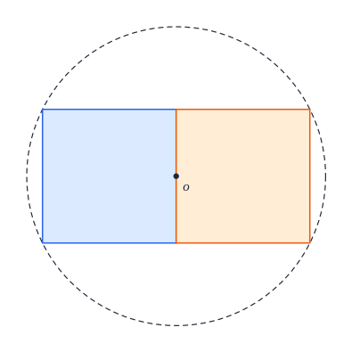
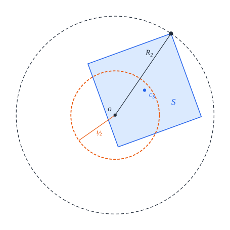
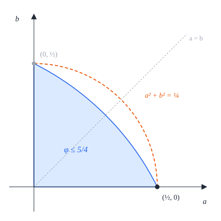

# 5. Two squares

[Contents](README.md) · [← 4. One square](04-one.md) · [6. Three squares →](06-three.md)

This chapter proves the case $n = 2$ of the main theorem: the least radius of a
closed disk that holds two disjoint unit squares is $R_2 = \frac{\sqrt5}2$,
half the diagonal of a $2 \times 1$ rectangle, and in a closed disk of that
radius the two squares always form such a rectangle, centred at the centre of
the disk (Figure 5.1). Packings, models and congruence are as in
[Definitions 2.3](02-preliminaries.md#definition-23-packing) and
[2.6](02-preliminaries.md#definition-26-congruence-to-a-model).

The proof plays two facts against each other. The farthest-vertex bound
([Lemma 3.4](03-tools.md#lemma-34-farthest-vertex)) keeps the centre of each
square within $\frac12$ of the disk centre $o$, while the centres of two
disjoint unit squares are at least 1 apart
([Lemma 3.10](03-tools.md#lemma-310-centres-at-least-1-apart)). By the
parallelogram law both can hold only with equality: the two centres are
exactly 1 apart, and $o$ is their midpoint. Two disjoint unit squares whose
centres are exactly 1 apart share a full edge
([Lemma 3.13](03-tools.md#lemma-313-squares-at-distance-1)), so the squares
form a $2 \times 1$ rectangle, and its centre is $o$.

## Theorem 5.1 (two squares)

Let $R_2 = \frac{\sqrt5}2$, and let the *rectangle* be the model
$Q(c_1), Q(c_2)$ with $c_1 = (-\frac12, 0)$ and $c_2 = (\frac12, 0)$.

1. The rectangle is a packing in the closed disk of radius $R_2$ about the
   origin.
2. If two unit squares form a packing in a closed disk of radius $R$, then
   $R \ge R_2$.
3. The packings of two unit squares in a closed disk of radius $R_2$ are
   exactly the configurations congruent to the rectangle.



*Figure 5.1.* The rectangle placed at the disk centre $o$. The squares
$Q(c_1)$ and $Q(c_2)$ share an edge whose midpoint is $o$, and the four
corners of the $2 \times 1$ rectangle lie on the circle of radius $R_2$ about
$o$ (dashed).

*Lean: [`Two.model_packing`](../../SquaresInCircles/Two/Construction.lean#L18),
[`Two.uniqueness`](../../SquaresInCircles/Two/Uniqueness.lean#L55),
[`Two.optimum`](../../SquaresInCircles/Two/Uniqueness.lean#L80).*

*Outline of the proof.* Part (1) is the construction, Proposition 5.2
(§5.1). Parts (2) and (3) follow, by
[Corollary 2.10](02-preliminaries.md#corollary-210-the-scheme-of-proof) (§5.4),
from the uniqueness statement, Proposition 5.3: every packing of two unit
squares in a closed disk of radius $R_2$ is congruent to the rectangle. Its
proof takes three steps.

1. *The centres* (§5.2). The two centres are exactly 1 apart, and the disk
   centre $o$ is their midpoint (Lemmas 5.4 and 5.5).
2. *The shared edge* (§5.3, step 1). So the squares share a full edge, and
   the step from one centre to the other is along a side of each square.
3. *The rectangle* (§5.3, steps 2 and 3). In the frame at $o$ along that step
   one square sits at $c_1$ and the other at $c_2$, which is the congruence.

## 5.1 Construction

### Proposition 5.2 (construction)

The rectangle is a packing in the closed disk of radius $R_2$ about the origin:
$Q(c_1)$ and $Q(c_2)$ are disjoint, and their closed squares lie in
$\overline{D}(0, R_2)$.


*Figure 5.2.* The centres $c_1$ and $c_2$ differ by 1 in the first
coordinate, and the corner $(1, \frac12)$, at the end of the hypotenuse of the
right triangle with legs 1 and $\frac12$, is at distance
$\sqrt{1 + \frac14} = R_2$ from $o$; by symmetry, so are the other three
corners.

*Proof.* The centres $c_1 = (-\frac12, 0)$ and $c_2 = (\frac12, 0)$ differ by
1 in the first coordinate, and each of them, $(x, y) = (\mp\frac12, 0)$,
satisfies

```math
\left(|x| + \tfrac12\right)^2 + \left(|y| + \tfrac12\right)^2 = 1 + \tfrac14 = \tfrac54 = R_2^2 .
```

So [Lemma 2.8](02-preliminaries.md#lemma-28-axis-parallel-squares) (3)
applies. $\square$

*Lean: [`Two.model_packing`](../../SquaresInCircles/Two/Construction.lean#L18),
[`Two.model`](../../SquaresInCircles/Geometry.lean#L133),
[`Two.radius`](../../SquaresInCircles/Geometry.lean#L127),
[`axis_packing`](../../SquaresInCircles/Common/Constructions.lean#L38).*

## 5.2 The centres

### Proposition 5.3 (uniqueness)

Every packing of two unit squares in a closed disk of radius $R_2$ is
congruent to the rectangle.

The proof occupies §5.2 and §5.3. Throughout, $o$ is the disk centre. This
section shows that the two centres are exactly 1 apart, with $o$ as their
midpoint, and §5.3 locates the squares from there. We first turn the
farthest-vertex bound at radius $R_2$ into a bound on the distance from the
centre of a square to $o$ (Figure 5.3).



*Figure 5.3.* A unit square $S$ whose closed square lies in the closed disk of
radius $R_2$ about $o$ (dashed), here with its farthest vertex on the circle.
By Lemma 3.4 and Lemma 5.4 its centre $c_S$ lies in the closed disk of radius
$\frac12$ about $o$ (orange).

### Lemma 5.4 (centres near the disk centre)

Let $a$ and $b$ be nonnegative real numbers with $\varphi(a, b) \le \frac54$.
Then $a^2 + b^2 \le \frac14$.



*Figure 5.4.* Lemma 5.4 in the $(a, b)$-plane. For $a, b \ge 0$, the region
$\varphi(a, b) \le \frac54$ (blue) lies in the quarter disk
$a^2 + b^2 \le \frac14$, and meets the quarter circle $a^2 + b^2 = \frac14$
(dashed) only at $(\frac12, 0)$ and $(0, \frac12)$.

*Proof.* This is [Lemma 3.4](03-tools.md#lemma-34-farthest-vertex) (3) with
$\rho = \frac12$, since $\frac14 + \frac12 + \frac12 = \frac54$ (Figure 5.4).
$\square$

*Lean: [`radial_sq_le_of_phi`](../../SquaresInCircles/Common/Basic.lean#L159).*

Seen in the frame of a square $S$ whose closed square lies in
$\overline{D}(o, R_2)$, Lemma 5.4 puts $o$ in the closed disk of radius
$\frac12$ about $c_S$, the disk inscribed in $\overline S$ (Figure 5.5). In the
rectangle, $o$ lies on the circle of this disk, at the midpoint of an edge of
each square.


*Figure 5.5.* Lemma 5.4 in the frame of a square $S$. The positions of the
disk centre $o$ for which $\overline S$ lies in $\overline{D}(o, R_2)$ (blue)
lie in the closed disk of radius $\frac12$ about $c_S$ (orange, dashed), and
reach its circle only at the midpoints of the four edges (dots).

### Lemma 5.5 (both centres at distance one half)

Let $o$ be a point of the plane, and let $S$ and $T$ be disjoint unit squares
with $\varphi(a_S, b_S) \le \frac54$ and $\varphi(a_T, b_T) \le \frac54$. Then

```math
a_S^2 + b_S^2 = a_T^2 + b_T^2 = \tfrac14 ,
```

that is, both centres are at distance exactly $\frac12$ from $o$. Moreover
the centres are exactly 1 apart, $|c_S - c_T| = 1$, and $o$ is their
midpoint, $c_S + c_T = 2o$.


*Figure 5.6.* Left: the parallelogram with the sides $u = c_S - o$ and
$v = c_T - o$ at $o$, and its diagonals $u - v = c_S - c_T$ (orange) and
$u + v$ (dashed). Its squared diagonals add up to twice its squared sides, so
if both centres lie within $\frac12$ of $o$, the diagonal from $c_S$ to $c_T$
is at most 1. Right: the equality case, $u + v = 0$ and $|c_S - c_T| = 1$.

*Proof.* Put $u = c_S - o$ and $v = c_T - o$.

**Step 1. Both centres are near the disk centre.** By Lemma 3.4,
$|u|^2 = a_S^2 + b_S^2$ and $|v|^2 = a_T^2 + b_T^2$. The numbers
$a_S, b_S, a_T, b_T$ are nonnegative
([Definition 3.1](03-tools.md#definition-31-position-of-the-disk-centre)), so
Lemma 5.4 applies to the pairs $(a_S, b_S)$ and $(a_T, b_T)$, and gives
$|u|^2 \le \frac14$ and $|v|^2 \le \frac14$.

**Step 2. The parallelogram law.** The parallelogram with vertices $o$, $c_S$,
$c_S + c_T - o$ and $c_T$ (Figure 5.6) has the sides $u$ and $v$ at $o$, and
its diagonals are $u - v = c_S - c_T$ and $u + v = c_S + c_T - 2o$. Expanding
the inner products,

```math
|u - v|^2 + |u + v|^2 = \left(|u|^2 - 2\langle u, v\rangle + |v|^2\right) + \left(|u|^2 + 2\langle u, v\rangle + |v|^2\right) = 2|u|^2 + 2|v|^2 .
```

**Step 3. Equality throughout.** The squares are disjoint, so
$|c_S - c_T| \ge 1$ by
[Lemma 3.10](03-tools.md#lemma-310-centres-at-least-1-apart). With steps 1
and 2,

```math
1 \le |c_S - c_T|^2 = 2|u|^2 + 2|v|^2 - |u + v|^2 \le 2|u|^2 + 2|v|^2 \le 2 \cdot \tfrac14 + 2 \cdot \tfrac14 = 1 .
```

So equality holds throughout. Equality in the first inequality is
$|c_S - c_T| = 1$, and in the second $|u + v| = 0$, that is, $c_S + c_T = 2o$
(Figure 5.6, right). In the last it is $|u|^2 + |v|^2 = \frac12$; as
$|v|^2 \le \frac14$, this gives $|u|^2 = \frac12 - |v|^2 \ge \frac14$, hence
$|u|^2 = \frac14$, and in the same way $|v|^2 = \frac14$. By Lemma 3.4 these
are the claims $a_S^2 + b_S^2 = \frac14$ and $a_T^2 + b_T^2 = \frac14$.
$\square$

*Lean: [`Two.centers_at_half`](../../SquaresInCircles/Two/Uniqueness.lean#L30),
[`Two.normSq_parallelogram`](../../SquaresInCircles/Two/Uniqueness.lean#L21).*

## 5.3 The shared edge

We now complete the proof of Proposition 5.3.

*Proof of Proposition 5.3.* Let $S, T$ be a packing of two unit squares in the
closed disk of radius $R_2$ about a point $o$. The closed squares of $S$ and
$T$ lie in $\overline{D}(o, R_2)$, so $\varphi(a_S, b_S) \le R_2^2 = \frac54$
and $\varphi(a_T, b_T) \le \frac54$ by Lemma 3.4; and $S$ and $T$ are
disjoint, as the squares of a packing are
([Definition 2.3](02-preliminaries.md#definition-23-packing)). By Lemma 5.5,
the step $d = c_T - c_S$ from one centre to the other is a unit vector, and
$o$ is the midpoint of the centres:

```math
c_S - o = -\tfrac12 d , \qquad c_T - o = \tfrac12 d . \tag{5.1}
```

**Step 1. The squares share an edge.** The squares $S$ and $T$ are disjoint
and their centres are exactly 1 apart. By
[Lemma 3.13](03-tools.md#lemma-313-squares-at-distance-1), the sides of $T$
are parallel to those of $S$, and $d$ is one of $\pm e^S_1, \pm e^S_2$: the
squares share a full edge, and by (5.1) its midpoint is $o$ (Figure 5.7). So
$d$ is a unit vector along a side of $S$ and, the sides of $T$ being parallel
to those of $S$, along a side of $T$.


*Figure 5.7.* Step 1. The centres are the ends of a diameter of the circle of
radius $\frac12$ about $o$ (dashed), 1 apart. Left: a square $T$ turned
against $S$ overlaps it (shaded). Right: by Lemma 3.13 the squares share a
full edge (thick), whose midpoint is $o$.

**Step 2. Both squares in one frame.** Turning the frame of a square by a
quarter turn changes neither its open nor its closed square
([Definition 2.1](02-preliminaries.md#definition-21-unit-square)). By step 1,
some quarter turn of the frame of $S$, and some quarter turn of the frame of
$T$, have first vector $d$, so we may take $e^S_1 = e^T_1 = d$. Let $\phi$ be
the direction of $d$. By
[Lemma 3.30](03-tools.md#lemma-330-sitting-at-a-centre) (1), applied to $S$
and to $T$, in the frame $\phi$ the square $S$ sits at the coordinates of
$c_S - o$ in the frame of $S$, and $T$ at the coordinates of $c_T - o$ in the
frame of $T$. By (5.1), $c_S - o = -\frac12 e^S_1$ and
$c_T - o = \frac12 e^T_1$, so these coordinates are $(-\frac12, 0) = c_1$
and $(\frac12, 0) = c_2$ (Figure 5.8).


*Figure 5.8.* Step 2. The frames of $S$ and $T$, turned so that
$e^S_1 = e^T_1 = d$, and the frame $\phi$ at $o$ (dashed axes). In it $S$ sits
at $(-\frac12, 0)$ and $T$ at $(\frac12, 0)$.

**Step 3. Congruence.** The squares $S$ and $T$ are disjoint, and in the frame
$\phi$ the square $S$ sits at $c_1$ and $T$ at $c_2$. By
[Lemma 3.31](03-tools.md#lemma-331-from-slots-to-congruence) the configuration
$S, T$ is congruent to the model $Q(c_1), Q(c_2)$, the rectangle. $\square$

*Lean: [`Two.uniqueness`](../../SquaresInCircles/Two/Uniqueness.lean#L55),
[`Two.frame_scale`](../../SquaresInCircles/Two/Uniqueness.lean#L50),
[`unit_contact`](../../SquaresInCircles/Common/Contacts.lean#L108),
[`same_axes_open`](../../SquaresInCircles/Common/Contacts.lean#L80),
[`self_represents`](../../SquaresInCircles/Common/Contacts.lean#L72),
[`congruent_of_slots`](../../SquaresInCircles/Common/Congruence.lean#L148).*

## 5.4 Proof of Theorem 5.1

*Proof of Theorem 5.1.* We apply
[Corollary 2.10](02-preliminaries.md#corollary-210-the-scheme-of-proof) with
$n = 2$, $R_2 = \frac{\sqrt5}2$ and
$\mathcal M = \lbrace\text{the rectangle}\rbrace$: (a) is Proposition 5.2; (b)
holds because the corner $(1, \frac12)$ of $Q(c_2)$ has squared distance
$1 + \frac14 = \frac54 = R_2^2$ from the origin (Figure 5.2); (c) is
Proposition 5.3. Parts (1), (2), (3) of the theorem are (a), (i) and (ii).
$\square$

*Lean: [`Two.optimum`](../../SquaresInCircles/Two/Uniqueness.lean#L80),
[`Optimum.optimality`](../../SquaresInCircles/Common/Optimum.lean#L47),
[`Optimum.isLeast`](../../SquaresInCircles/Common/Optimum.lean#L61),
[`Optimum.packing_iff`](../../SquaresInCircles/Common/Optimum.lean#L67).*
