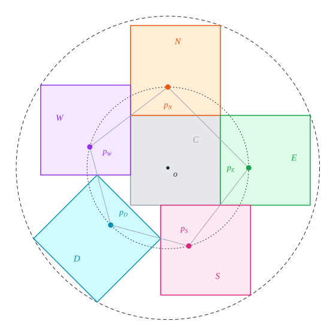
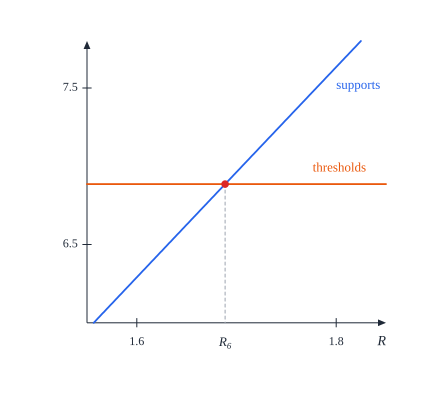
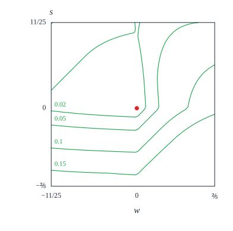

# 9. Six squares

[Contents](README.md) · [← 8. Five squares](08-five.md) · [10. Seven squares →](10-seven.md)

Six unit squares fit in a closed disk of radius $R_6 \approx 1.68854$ as
Figure 9.1 shows: a central square with one neighbour on top and one on its
right, two more neighbours on its left and below it, each pushed along its side
by about $0.336$, and a sixth square turned by $\frac\pi4$ in the corner
between them. It is the only optimal packing in this book with a square that
is not parallel to the others. This chapter proves that no smaller closed disk
holds six unit squares, and that every packing of six unit squares in a closed
disk of radius $R_6$ is congruent to the packing of Figure 9.1.

The proof starts as for five squares. On the circle $\Gamma_{9/10}$ about the
disk centre, every square that avoids the disk centre holds an arc of more than
a sixth of the circle, so one of the six squares, $C$, contains the disk
centre, and in a frame of $C$ its centre lies in a small box. Five fixed points
near the disk centre, the *pins*, then name the other five squares $E$, $N$,
$W$, $D$ and $S$ after the pin each of them holds, and confine each of them to
a window of angles. The new tool is a *stress*: a weighted sum of separating
inequalities between neighbouring squares, read as forces acting on their
centres. The disk bounds the work of each force, and a stress shows that the
squares cannot be separated as assumed when the thresholds add up to more than
these bounds. Most of the chapter uses stresses of this kind to show that the
squares are separated from one another as in the optimal packing. The stress of
the optimal packing itself then leaves no room at the radius $R_6$: every
square is turned as in the model, eight pairs of squares touch as there, and
the eight contacts fix every centre.

## Theorem 9.1 (six squares)

Let $h = \frac{\sqrt2}2$, and let $s_*$ be the smaller root of the quadratic
$s^2 - A_* s + B_*$, where

```math
A_* = \frac{1466 + 1940h}{267}, \qquad B_* = \frac{327 + 432h}{712} .
```

Put

```math
t_* = (30h - 20)\, s_* + \tfrac72 - \tfrac{9h}2, \qquad d_* = \tfrac12 + h - t_*, \qquad q_* = 2s_*^2 + 4s_* + \tfrac52, \qquad R_6 = \sqrt{q_*} ,
```

so that $s_* \approx 0.08425$, $t_* \approx 0.42023$, $d_* \approx 0.78688$,
$q_* \approx 2.85118$ and $R_6 \approx 1.68854$. The *model* is the
configuration of the six squares

```math
C = Q(s_*, s_*), \quad N = Q(s_*, s_* + 1), \quad E = Q(s_* + 1, s_*), \quad W = Q(s_* - 1, t_*), \quad S = Q(t_*, s_* - 1)
```

and $D$, the unit square with centre $(-d_*, -d_*)$ and frame
$u(\frac\pi4)$, $u(\frac{3\pi}4)$, turned by $\frac\pi4$ from the axes.

1. The model is a packing in the closed disk of radius $R_6$ about the origin.
2. If six unit squares form a packing in a closed disk of radius $R$, then
   $R \ge R_6$.
3. The packings of six unit squares in a closed disk of radius $R_6$ are
   exactly the configurations congruent to the model.


*Figure 9.1.* The model in its circle of radius $R_6$ (dashed). The central
square $C$ (grey) holds the disk centre $o$. Thick segments mark where two
squares share part of an edge: $C$ with each of $N$, $E$, $W$ and $S$, $W$ with
$N$, and $S$ with $E$. The turned square $D$ touches $W$ and $S$ with two of its
vertices (large dots). Six points lie on the circle (small dots): the far
corners of $N$, $E$, $W$ and $S$, and two vertices of $D$.

*Lean: [`Six.hStar`](../../SquaresInCircles/Geometry.lean#L184),
[`Six.AStar`](../../SquaresInCircles/Geometry.lean#L188),
[`Six.BStar`](../../SquaresInCircles/Geometry.lean#L191),
[`Six.sStar`](../../SquaresInCircles/Geometry.lean#L198),
[`Six.tStar`](../../SquaresInCircles/Geometry.lean#L202),
[`Six.dStar`](../../SquaresInCircles/Geometry.lean#L206),
[`Six.qStar`](../../SquaresInCircles/Geometry.lean#L209),
[`Six.radius`](../../SquaresInCircles/Geometry.lean#L213),
[`Six.diagonalSquare`](../../SquaresInCircles/Geometry.lean#L216),
[`Six.model`](../../SquaresInCircles/Geometry.lean#L227),
[`Six.model_packing`](../../SquaresInCircles/Six/Construction.lean#L160),
[`Six.uniqueness`](../../SquaresInCircles/Six/Uniqueness.lean#L79),
[`Six.optimum`](../../SquaresInCircles/Six/Uniqueness.lean#L100).*

*Remarks.* (i) The model is symmetric under the reflection
$(x, y) \mapsto (y, x)$ in the diagonal, which exchanges $N$ with $E$ and $W$
with $S$ and maps $C$ and $D$ to themselves. So, as in the other cases, a
reflected copy of the model is a rotated copy of it with the labels changed
([Definition 2.6](02-preliminaries.md#definition-26-congruence-to-a-model)).

(ii) Eight pairs of squares touch in the model (Figure 9.1), and the constants
are fixed by four conditions: the far corners of $E$ and $W$ and the far
vertices of $D$ lie on one circle, and $D$ touches $W$ (§9.1, Figure 9.4).
Friedman's page ([§1.3](README.md#13-background)) lists this packing, which
Friedman found in 1997, with the exact radius found by David Ellsworth in 2023,

```math
R_6 = \frac1{534}\sqrt{19706163 + 13275064\sqrt2 - 40\sqrt{443374242065 + 313512226176\sqrt2}} ;
```

the two values agree, and $q_* = R_6^2$ is the least root of the quartic

```math
164249856q^4 - 45402999552q^3 + 416695446880q^2 - 1290849794864q + 1334524470769 .
```

(iii) Unlike the optimal packings of three, four and five squares, this one is
not held by arcs of one circle alone: on $\Gamma_{9/10}$ its five outer squares
hold arcs of only about $67.5°$ to $68°$, and the arcs leave about $21°$ of the
circle free (Figure 9.6). The proof uses the arcs only to find the central
square; the rest is done by stresses.

*Outline of the proof.* Part (1) is the construction, Proposition 9.3 (§9.1).
Parts (2) and (3) follow, by
[Corollary 2.10](02-preliminaries.md#corollary-210-the-scheme-of-proof) (§9.10),
from uniqueness, Proposition 9.60: every packing of six unit squares in a
closed disk of radius $R_6$ is congruent to the model. Its proof has six steps.

1. *The containing square* (§9.2). Everything up to §9.7 is proved for packings
   in a closed disk of squared radius at most a ceiling $Q_0 = 2.85118$, just
   above $q_*$. Every square that avoids the disk centre holds an arc of
   $\Gamma_{9/10}$ of half-width more than $\frac\pi6$ (Lemma 9.6), so one
   square $C$ contains the disk centre (Proposition 9.7). Read in a frame of
   $C$, the packing lies about the origin, $C = Q(c)$, and an arc of
   $\Gamma_{9/10}$ that no square can reach keeps $c$ in the box $[0, c_0]^2$,
   $c_0 \approx 0.1128$ (Proposition 9.15).
2. *Pins and labels* (§9.3). Each of the other five squares holds exactly one
   of five pins at distance $\frac9{10}$ from the disk centre, which names it
   $E$, $N$, $W$, $D$ or $S$, puts its angle in a window and limits the axes
   along which it is separated from $C$ (Proposition 9.22).
3. *Stresses* (§9.4). A weighted sum of separating inequalities is a sum of
   works of forces on the centres, and the disk bounds each work
   (Lemmas 9.24 to 9.26). The stress of the model balances exactly
   (Proposition 9.27).
4. *Normalization* (§9.5). Up to the reflection in the diagonal, the angle of
   $D$ is at most $\frac\pi4$; then $D$ is separated from $C$ along its own
   axis, by a first stress (Proposition 9.33), and the five squares come in the
   order $E$, $N$, $W$, $D$, $S$ (Proposition 9.35).
5. *The separators* (§9.6 and §9.7). Further stresses show that the turned
   square is separated from $W$ and from $S$ along their secondary axes, as in
   the model (Proposition 9.45), and bound the angles of $W$ and $S$
   (Proposition 9.47).
6. *The stress of the model* (§9.8 and §9.9). At the radius $R_6$ the stress
   of the model, with its edges along the separating axes of the packing,
   leaves no room: the angles are those of the model (Theorem 9.54), eight
   separating inequalities are tight, and they fix every centre
   (Proposition 9.58).

The longer estimates of these steps are proved in Appendices B to E.

## 9.1 Construction

### Lemma 9.2 (the constants)

1. $0.08424567 < s_* < 0.0842457$, $0.4202266 < t_* < 0.4202267$,
   $d_* > 0$, $2.85117 < q_* < 2.85118$ and $1.68854 < R_6 < 1.68855$.
2. The three squared distances

   ```math
   \left(s_* + \tfrac32\right)^2 + \left(s_* + \tfrac12\right)^2, \qquad \left(\tfrac32 - s_*\right)^2 + \left(t_* + \tfrac12\right)^2, \qquad 2d_*^2 + 2hd_* + \tfrac12
   ```

   are all equal to $q_*$.
3. The number $\rho_* = \sqrt{q_* - \frac14} - \frac12$ satisfies
   $\rho_*^2 + \rho_* + \frac12 = q_*$, $1.11281 < \rho_* < 1.11282$ and
   $\rho_* = 2hd_*$.

*Proof.* (1) We use $0.70710678 < h < 0.70710679$, which follows from
$h^2 = \frac12$. Then $10 < A_* < 11$ and $\frac45 < B_* < 1$, so the
discriminant $A_*^2 - 4B_*$ is positive and the smaller root is

```math
s_* = \frac{A_* - \sqrt{A_*^2 - 4B_*}}2 = \frac{2B_*}{A_* + \sqrt{A_*^2 - 4B_*}} \in \left(0, \tfrac15\right) .
```

The other root is $A_* - s_* > 9$, so on $[0, \frac15]$ the quadratic
$p(s) = s^2 - A_*s + B_* = (s - s_*)(s - A_* + s_*)$ is positive left of $s_*$
and negative right of it. Substituting the two ends of the bracket of $h$ into
the coefficients, which are affine in $h$, gives $p(0.08424567) > 0$ and
$p(0.0842457) < 0$, hence the bracket of $s_*$. The brackets of $t_*$, $q_*$
and $R_6$ follow from it and from that of $h$ by monotonicity, since $t_*$ is
affine in $s_*$ with the coefficient $30h - 20 > 0$, $q_*$ increases with
$s_* > 0$, and $1.68854^2 < 2.85117$, $2.85118 < 1.68855^2$. Finally
$d_* = \frac12 + h - t_* > 0.78$.

(2) The three expressions are the squared distances from the origin of the
far corners of $E$ and $W$ and of a far vertex of $D$ in the model
(Figure 9.2). The first is $2s_*^2 + 4s_* + \frac52 = q_*$. For the
other two,
write $t_*$, $d_*$ and $q_*$ through $s = s_*$ and $h$. The differences with
$q_*$ are then combinations of $p(s)$, which vanishes at $s_*$, and of
$h^2 - \frac12$:

```math
\begin{aligned}
\left(\tfrac32 - s\right)^2 + \left(t + \tfrac12\right)^2 - q &= (849 - 1200h)\,p(s) + \frac{320400s^2 - 3200120s + 266409}{356}\left(h^2 - \tfrac12\right), \\
2d^2 + 2hd + \tfrac12 - q &= (1698 - 2400h)\,p(s) + \frac{320400s^2 - 3232160s + 271927}{178}\left(h^2 - \tfrac12\right),
\end{aligned}
```

as one checks by expanding both sides, with $A_*$ and $B_*$ written out.

(3) $(\rho_* + \frac12)^2 = q_* - \frac14$ is the first identity, and the
bracket follows from that of $q_*$. Put $x = 2hd_* > 0$. By (2),
$x^2 + x + \frac12 = 2d_*^2 + 2hd_* + \frac12 = q_*$, as $4h^2 = 2$. So
$0 = (\rho_*^2 + \rho_*) - (x^2 + x) = (\rho_* - x)(\rho_* + x + 1)$, and the
second factor is positive. $\square$


*Figure 9.2.* Lemma 9.2 (2) in the model: the squared distances from
the origin of the far corner of $E$, of the far corner of $S$ (by symmetry,
the same as that of $W$) and of a far vertex of $D$, with the legs of the
right triangles; the three points lie on the circle of radius $R_6$.

*Lean: [`Six.sStar_polynomial`](../../SquaresInCircles/Six/Constants.lean#L101),
[`Six.sStar_bounds`](../../SquaresInCircles/Six/Constants.lean#L121),
[`Six.tStar_bounds`](../../SquaresInCircles/Six/Constants.lean#L136),
[`Six.dStar_pos`](../../SquaresInCircles/Six/Constants.lean#L143),
[`Six.qStar_bounds`](../../SquaresInCircles/Six/Constants.lean#L151),
[`Six.radius_bounds`](../../SquaresInCircles/Six/Constants.lean#L161),
[`Six.east_radius_identity`](../../SquaresInCircles/Six/Constants.lean#L168),
[`Six.west_radius_identity`](../../SquaresInCircles/Six/Constants.lean#L175),
[`Six.diagonal_radius_identity`](../../SquaresInCircles/Six/Constants.lean#L184),
[`Six.rhoStar`](../../SquaresInCircles/Six/Constants.lean#L204),
[`Six.rhoStar_identity`](../../SquaresInCircles/Six/Constants.lean#L261),
[`Six.rhoStar_bounds`](../../SquaresInCircles/Six/Constants.lean#L254),
[`Six.rhoStar_eq_two_h_d`](../../SquaresInCircles/Six/Constants.lean#L268).*

### Proposition 9.3 (construction)

The model is a packing in the closed disk of radius $R_6$ about the origin. The
corners $(s_* + \frac32, s_* + \frac12)$ of $E$, $(s_* + \frac12, s_* + \frac32)$
of $N$, $(s_* - \frac32, t_* + \frac12)$ of $W$ and
$(t_* + \frac12, s_* - \frac32)$ of $S$, and the vertices $(-d_* - h, -d_*)$ and
$(-d_*, -d_* - h)$ of $D$ lie on its boundary circle.

*Proof.* *The five axis-parallel squares.* Any two of the centres
$(s_*, s_*)$, $(s_*, s_* + 1)$, $(s_* + 1, s_*)$, $(s_* - 1, t_*)$ and
$(t_*, s_* - 1)$ differ by at least 1 in one coordinate: every pair differs by
exactly 1 or 2 in a coordinate, except $W$ and $S$, whose first coordinates
differ by $1 + t_* - s_* > 1$. By
[Lemma 2.8](02-preliminaries.md#lemma-28-axis-parallel-squares) they are pairwise
disjoint, and they lie in the disk as soon as each centre $(x, y)$ has
$(|x| + \frac12)^2 + (|y| + \frac12)^2 \le q_*$. For $N$, $E$, $W$ and $S$ the
left side is one of the first two expressions of Lemma 9.2 (2), which equal
$q_*$; for $C$ it is $2(s_* + \frac12)^2 < 1 < q_*$.

*The turned square.* In the frame $u(\frac\pi4) = (h, h)$,
$u(\frac{3\pi}4) = (-h, h)$ of $D$, the local coordinates of a point
$(x, y)$ are $h(X + Y)$ and $h(Y - X)$, with $X = x + d_*$ and $Y = y + d_*$.
As $\frac1{2h} = h$, the open square is the diamond

```math
D^\circ = \left\lbrace (x, y) : |x + d_*| + |y + d_*| < h \right\rbrace ,
```

with the vertices $(-d_* \pm h, -d_*)$ and $(-d_*, -d_* \pm h)$. Seen from the
origin, the offsets of $D$ are $a_D = 2hd_*$ and $b_D = 0$, so by
[Lemma 3.4](03-tools.md#lemma-34-farthest-vertex) its farthest vertices are at
squared distance $\varphi(2hd_*, 0) = 2d_*^2 + 2hd_* + \frac12 = q_*$, and
$\overline D$ lies in the disk. Every point of $D^\circ$ has $x < h - d_*$ and
$y < h - d_*$, and $h - d_* = t_* - \frac12$. The open squares of $N$, $W$
lie above the line $y = t_* - \frac12$, as $s_* + \frac12 > t_* - \frac12$, and
those of $E$, $S$ to the right of $x = t_* - \frac12$; so none of them meets
$D^\circ$. Finally, every point of $C^\circ$ has $x + y > 2s_* - 1$, so
$x + y + 2d_* > 2(s_* + d_*) - 1 > \frac{18}{25}$, as $s_* + d_* > 0.871$; and
$\frac{18}{25} > h$, so the point is not in $D^\circ$ (Figure 9.3).

*The points on the circle.* By Lemma 9.2 (2), the corners
$(s_* + \frac32, s_* + \frac12)$ and $(s_* + \frac12, s_* + \frac32)$ of $E$ and
$N$ and $(s_* - \frac32, t_* + \frac12)$ and $(t_* + \frac12, s_* - \frac32)$ of
$W$ and $S$ are at squared distance $q_*$ from the origin, and so are the two
vertices of $D$ farthest from it, $(-d_* - h, -d_*)$ and $(-d_*, -d_* - h)$.
$\square$

![Two panels. Left: the model with the three lines that separate D from its neighbours, dashed: the vertical line x = t* - 1/2 and the horizontal line y = t* - 1/2, which keep D left of S and E and below W and N, and the line x + y = 2s* - 1, which keeps D away from C; D, a diamond, sits in the corner they cut out, and a dashed grey square marks the corner between W and S. Right: that corner enlarged, with the top vertex of D, at (-d*, t* - 1/2), on the lower edge of W, the right vertex, at (t* - 1/2, -d*), on the left edge of S, and the half-diagonal h of D dashed from its centre up to the top vertex](figures/09-six/construction.svg)

*Figure 9.3.* The proof of Proposition 9.3. Left: $D^\circ$ lies left of
$x = t_* - \frac12$, below $y = t_* - \frac12$ and below the line
$x + y = 2s_* - 1$ (dashed), and the other open squares lie beyond these lines.
Right: the corner between $W$ and $S$ (grey square on the left), enlarged.
The top vertex $(-d_*, t_* - \frac12)$ of $D$ lies on the lower edge of $W$,
and the right vertex $(t_* - \frac12, -d_*)$ on the left edge of $S$. The
half-diagonal $h$ of $D$ (dashed) runs from its centre $(-d_*, -d_*)$ to the
top vertex, so $-d_* + h = t_* - \frac12$: this is $d_* = \frac12 + h - t_*$.

*Remark (where the constants come from).* Place $C = Q(s, s)$,
$E = Q(s + 1, s)$, $W = Q(s - 1, t)$ and $D$ turned by $\frac\pi4$ with centre
$(-d, -d)$, and ask for four contacts: the far corner
$(s + \frac32, s + \frac12)$ of $E$, the far corner $(s - \frac32, t + \frac12)$
of $W$ and the far vertices of $D$ lie on one circle, whose squared radius is
then $q = 2s^2 + 4s + \frac52$, and $D$ touches $W$, which is
$d = \frac12 + h - t$. The corner of $W$ gives
$(t + \frac12)^2 = s^2 + 7s + \frac14$, and the vertex of $D$ gives
$2d^2 + 2hd + \frac12 = q$. Subtracting twice the first from the second
eliminates $t^2$ and leaves the affine equation
$(8 + 12h)\,t = 1 + 6h + 20s$; multiplied by $3h - 2$, with
$(8 + 12h)(3h - 2) = 2$ and $h^2 = \frac12$, it becomes the formula of $t_*$ in
Theorem 9.1. Substituting it back leaves the quadratic $p(s) = 0$, whose
smaller root is $s_*$. $N$ and $S$ are the mirror images of $E$ and $W$ in the
diagonal. With only the first three contacts, the circle through the far
corners of $E$ and $W$ grows with $s$ while the far vertices of $D$ come in,
and they meet at $s_*$ (Figure 9.4).

![Two panels. Left: the configuration of the remark for the shift s = 0.04: the central square C = Q(s, s), E and N beside it, W with its far corner on the dashed circle through the far corner of E, S its mirror image, and the turned square D touching W and S, with its two far vertices on a larger dotted circle. Right: against s from 0 to about 0.09, the radius of the circle through the far corners of E and W, rising from about 1.58, and the distance of the far vertices of D, falling from about 2.26; the two curves cross at s = s*, at the height R6, and dots mark their values at s = 0.04](figures/09-six/constants.svg)

*Figure 9.4.* The balance behind the constants. For each shift $s$ the
far corner of $W$ is put on the circle through that of $E$, and $D$ touches $W$
(and $S$). Left, $s = 0.04$: the far vertices of $D$ lie at distance about
$1.95$, outside that circle, of radius about $1.63$. Right: the two distances
against $s$, while $D$ stays clear of $C$ ($s \le 0.09$); they are equal at
$s_*$, where both are $R_6$.

*Lean: [`Six.model_packing`](../../SquaresInCircles/Six/Construction.lean#L160),
[`Six.axisCenters_separated`](../../SquaresInCircles/Six/Construction.lean#L29),
[`Six.axisCenters_contained`](../../SquaresInCircles/Six/Construction.lean#L40),
[`Six.diagonal_contained`](../../SquaresInCircles/Six/Construction.lean#L68),
[`Six.diagonal_open_upper`](../../SquaresInCircles/Six/Construction.lean#L89),
[`Six.central_diagonal_disjoint`](../../SquaresInCircles/Six/Construction.lean#L110),
[`Six.model_reaches`](../../SquaresInCircles/Six/Uniqueness.lean#L91).*

## 9.2 The containing square

From here to the end of §9.7 the packing lies in a closed disk whose squared
radius is at most a rational ceiling $Q_0$, just above $q_*$; only §9.8 and
§9.9 use the radius $R_6$ itself.

### Definition 9.4 (the ceiling)

Let $Q_0 = 2.85118$, $R_0 = \sqrt{Q_0}$, and

```math
\rho_0 = \sqrt{Q_0 - \tfrac14} - \tfrac12, \qquad c_0 = \rho_0 - 1, \qquad r_0 = \tfrac32 - \rho_0, \qquad a_0 = 2 - \rho_0, \qquad U_0 = \sqrt{Q_0 - \left(\tfrac52 - \rho_0\right)^2} - \tfrac12 .
```

We write $\bar R = 1.6886$, $\bar\rho = 1.11282$ and $\bar c = 0.11282$ for
the decimal upper bounds of $R_0$, $\rho_0$ and $c_0$ (Lemma 9.5).

*Lean: [`Six.Q0`](../../SquaresInCircles/Six/Constants.lean#L318),
[`Six.R0`](../../SquaresInCircles/Six/Constants.lean#L321),
[`Six.rho0`](../../SquaresInCircles/Six/Constants.lean#L325),
[`Six.c0`](../../SquaresInCircles/Six/Constants.lean#L328),
[`Six.coreRadius`](../../SquaresInCircles/Six/Constants.lean#L332),
[`Six.aMin`](../../SquaresInCircles/Six/Constants.lean#L335),
[`Six.U0`](../../SquaresInCircles/Six/Constants.lean#L339),
[`Six.radiusBound`](../../SquaresInCircles/Six/Constants.lean#L419),
[`Six.rhoBound`](../../SquaresInCircles/Six/Constants.lean#L421),
[`Six.coreUpper`](../../SquaresInCircles/Six/Constants.lean#L423).*

### Lemma 9.5 (the ceiling)

1. $q_* < Q_0 < q_* + 3 \cdot 10^{-6}$ and $\rho_* < \rho_0$.
2. $1.6885 < R_0 < 1.6886 = \bar R$, $1.11281 < \rho_0 < 1.11282 = \bar\rho$,
   $0.1128 < c_0 < 0.11282 = \bar c$, $0.387 < r_0 < 0.388$,
   $0.887 < a_0 < 0.888$ and $U_0 < 0.463$.
3. $(\rho_0 + \frac12)^2 + \frac14 = Q_0$, $c_0 + r_0 = \frac12$ and
   $a_0 = r_0 + \frac12$.

*Proof.* (1) By Lemma 9.2 (1), $q_* = 2s_*^2 + 4s_* + \frac52 > 2.8511773$, so
$q_* < Q_0 < q_* + 3\cdot10^{-6}$. As $x \mapsto x^2 + x$ increases for
$x \ge 0$ and $\rho_*^2 + \rho_* + \frac12 = q_* < Q_0 = \rho_0^2 + \rho_0 + \frac12$
by (3) and Lemma 9.2 (3), $\rho_* < \rho_0$. (2) Square the brackets:
$1.6885^2 < Q_0 < 1.6886^2$ and $1.61281^2 < Q_0 - \frac14 < 1.61282^2$. The
brackets of $c_0$, $r_0$ and $a_0$ follow. For $U_0$, expanding with (3) gives
$Q_0 - (\frac52 - \rho_0)^2 = 6\rho_0 - \frac{23}4 < 0.92692 < 0.963^2$.
(3) follows from the definitions. $\square$

The numbers $\rho_0$, $c_0$, $r_0$, $a_0$ and $U_0$ have a meaning that the
next sections explain. By [Lemma 3.4](03-tools.md#lemma-34-farthest-vertex), the
centre of a square in the disk of squared radius $Q_0$ is within $\rho_0$ of
the disk centre; $c_0$ will bound the coordinates of the centre of the
containing square in its own frame (Proposition 9.15); the open disk of radius
$r_0$ about the disk centre then lies inside the containing square, and every
other square has its near edge at least $r_0$ from the disk centre, so its
radial coordinate is at least $a_0$ and its transverse coordinate at most $U_0$
(Lemma 9.16).

*Lean: [`Six.qStar_lt_Q0`](../../SquaresInCircles/Six/Constants.lean#L342),
[`Six.rhoStar_lt_rho0`](../../SquaresInCircles/Six/Constants.lean#L378),
[`Six.R0_bounds`](../../SquaresInCircles/Six/Constants.lean#L354),
[`Six.rho0_bounds`](../../SquaresInCircles/Six/Constants.lean#L370),
[`Six.c0_bounds`](../../SquaresInCircles/Six/Constants.lean#L381),
[`Six.coreRadius_bounds`](../../SquaresInCircles/Six/Constants.lean#L387),
[`Six.aMin_bounds`](../../SquaresInCircles/Six/Constants.lean#L401),
[`Six.U0_upper`](../../SquaresInCircles/Six/Constants.lean#L412),
[`Six.ceiling_bounds`](../../SquaresInCircles/Six/Constants.lean#L427),
[`Six.rho0_identity`](../../SquaresInCircles/Six/Constants.lean#L362),
[`Six.c0_add_coreRadius`](../../SquaresInCircles/Six/Constants.lean#L393),
[`Six.aMin_eq_coreRadius_add_half`](../../SquaresInCircles/Six/Constants.lean#L397).*

### Lemma 9.6 (exterior arcs)

Let $T$ be an exterior square with $\varphi(a_T, b_T) \le Q_0$. Then $T$ holds
an arc of the circle $\Gamma_{9/10}$ about $o$ of half-width more than
$\frac{14}{25}$, which exceeds $\frac\pi6$.


*Figure 9.5.* The length of the arc of $\Gamma_{9/10}$ held by an exterior
square, $\min(A, U) + \min(A, V)$ of Lemma 3.24 (1), over the offsets
$(a, b)$ allowed by the ceiling, with level lines at $66°$, $70°$, $75°$, $80°$
and $90°$. The length exceeds $2\cdot\frac{14}{25} \approx 64.2°$ everywhere;
it is smallest, about $65.1°$, at the corner of the region where $a = b$ on
the circle $\varphi = Q_0$ (red dot).

*Proof.* Write $a = a_T$ and $b = b_T$, so that $a \ge \frac12$ and
$0 \le b \le a$ ([Definition 3.2](03-tools.md#definition-32-containing-and-exterior-squares)),
and $a \le \rho_0 < 1.113$ by Lemma 3.4 (2). On $\Gamma_{9/10}$ the crossing
angles of [Definition 3.23](03-tools.md#definition-323-crossing-angles) are

```math
A = \arccos\tfrac{10}9\left(a - \tfrac12\right), \qquad V = \arcsin\tfrac{10}9\left(\tfrac12 - b\right), \qquad U = \arcsin\tfrac{10}9\left(b + \tfrac12\right) .
```

As $a - \frac12 < 0.62 < \frac9{10} < 1 \le a + \frac12$,
[Lemma 3.24](03-tools.md#lemma-324-arcs-of-an-exterior-square) (1) applies, and it
suffices to show that each of $2A$, $A + U$, $A + V$ and $U + V$ exceeds
$\frac{28}{25}$. We use $\sin x \ge x - \frac{x^3}6$ for $x \ge 0$ and the
estimates of [Lemma 3.29](03-tools.md#lemma-329-elementary-estimates): $\arcsin x \ge x$
on $[0, 1]$ and $\arcsin x \le x + \frac{x^3}4$ on $[0, \frac35]$. Note that
$b \le \frac7{10}$, since $2(b + \frac12)^2 \le \varphi(a, b) \le Q_0$.

1. *$2A > \frac{28}{25}$.* As $\frac{10}9(a - \frac12) < 0.69$ and
   $\cos\frac35 \ge 1 - \frac{9}{50} = 0.82$, the arccosine, which decreases,
   gives $A > \frac35$.
2. *$A + U > \frac{28}{25}$.* $\frac{10}9(b + \frac12) \ge \frac59$, so
   $U \ge \frac59$, and $A + U > \frac35 + \frac59 = \frac{52}{45} > \frac{28}{25}$.
3. *$U + V > \frac{28}{25}$.* If $b + \frac12 \ge \frac9{10}$, then
   $U = \frac\pi2$, and $\frac{10}9(\frac12 - b) \ge -\frac29 > -\frac14$, so
   $V \ge -\arcsin\frac14 \ge -\frac14 - \frac1{256}$ and
   $U + V > 1.31$. Otherwise $u = \frac{10}9(b + \frac12)$ and
   $v = \frac{10}9(\frac12 - b)$ lie in $[0, 1]$, with $\frac{u + v}2 = \frac59$.
   As $\sin\frac{14}{25} \le \frac{14}{25} - \frac16(\frac{14}{25})^3 + \frac1{120}(\frac{14}{25})^5 < 0.532 < \frac59$
   ([Lemma A.7](appendix-a.md#lemma-a7-taylor-bounds) (2)), Lemma 3.29 (4) gives
   $U + V = \arcsin u + \arcsin v > \frac{28}{25}$.
4. *$A + V > \frac{28}{25}$.* Here $A = \frac\pi2 - \arcsin X$ with
   $X = \frac{10}9(a - \frac12) \in [0, 0.69)$, and since
   $\frac\pi2 - \frac9{20} > 1.1207 > \frac{28}{25}$ it suffices to show
   $\arcsin X - V \le \frac9{20}$. There are three cases.

   - *$b \ge \frac12$.* Then $V = -\arcsin Y$ with $Y = \frac{10}9(b - \frac12) \ge 0$.
     Put $\sigma = X + Y$ and $\Sigma = X^2 + Y^2 \ge \frac12\sigma^2$. The
     disk condition $(1 + \frac9{10}X)^2 + (1 + \frac9{10}Y)^2 \le Q_0$ reads
     $\frac95\sigma + \frac{81}{100}\Sigma \le Q_0 - 2 < 0.8512$; so
     $X, Y \le \frac35$, and $\frac95\sigma + \frac{81}{200}\sigma^2 < 0.8512$
     forces $\sigma < 0.432$. With $X^3 + Y^3 \le \sigma\Sigma$ and the cubic
     bound,

     ```math
     \arcsin X + \arcsin Y \le \sigma + \tfrac14\sigma\Sigma < \sigma + \frac{\sigma\left(0.8512 - \frac95\sigma\right)}{3.24} = \left(1 + \tfrac{0.8512}{3.24}\right)\sigma - \tfrac59\sigma^2 < 0.442 ,
     ```

     as the last expression increases for $\sigma < 1.13$ and is less than
     $0.442$ at $\sigma = 0.432$.
   - *$b < \frac12$ and $a \le 1.04$.* Then $V \ge \frac{10}9(\frac12 - b)$, and
     $X \le \frac35$ with $X^2 \le (\frac{27}{50})^2/(\frac9{10})^2 = 0.36$, so
     $\arcsin X \le X(1 + \frac{0.36}4) = 1.09X$. Hence

     ```math
     \arcsin X - V \le \tfrac{10}9\left(1.09\left(a - \tfrac12\right) - \left(\tfrac12 - b\right)\right) = \tfrac{10}9\left(1.09\left(a + \tfrac12\right) + \left(b + \tfrac12\right) - 2.09\right) < \tfrac{10}9(2.484 - 2.09) < \tfrac9{20} ,
     ```

     because $1.09(a + \frac12) + (b + \frac12) \le 1.09\sqrt{Q_0 - y^2} + y$
     with $y = b + \frac12 \le 1$, and $1.09\sqrt{Q_0 - y^2} + y$ increases
     for $y \le 1$ (its derivative $1 - 1.09y/\sqrt{Q_0 - y^2}$ is positive as
     $2.1881y^2 < Q_0$), with the value $1.09\sqrt{Q_0 - 1} + 1 < 2.484$ at
     $y = 1$.
   - *$b < \frac12$ and $a > 1.04$.* Then $(b + \frac12)^2 \le Q_0 - 1.54^2 < 0.49$,
     so $b + \frac12 < \frac7{10}$ and $V \ge \frac{10}9(\frac12 - b) > \frac13$;
     and $\sin 0.77 \ge 0.77 - \frac{0.77^3}6 > 0.69 > X$, so
     $\arcsin X < 0.77$. Hence $\arcsin X - V < 0.77 - \frac13 < \frac9{20}$.

So $T$ holds an arc of half-width more than $\frac{14}{25}$, by Lemma 3.24 (1)
with $w = \frac{14}{25}$ (Figure 9.5); and $\frac{14}{25} > \frac\pi6$ as
$\pi < 3.36$.
$\square$


*Figure 9.6.* The arcs of $\Gamma_{9/10}$ in the model. The squares $N$ and $E$
hold arcs of about $68.0°$, $W$ and $S$ of about $67.6°$, and $D$ of about
$67.5°$, each more than the $64.2°$ of Lemma 9.6 and the $60°$ of a sixth of
the circle. The central square misses the circle. $W$ and $N$, and $S$ and
$E$, meet on the circle; the gaps around $D$ and between $E$ and $N$ are about
$6.2°$ and $9.0°$.

*Lean: [`Six.exterior_arc`](../../SquaresInCircles/Six/Exterior.lean#L169),
[`Six.arc_length`](../../SquaresInCircles/Six/Exterior.lean#L144).*

### Proposition 9.7 (the containing square)

Let six squares form a packing in a closed disk of radius $R$ about $o$, with
$R^2 \le Q_0$. Then exactly one of them contains $o$.

*Proof.* Two disjoint squares cannot both contain $o$. If none of the six did,
each would be exterior, with $\varphi(a_S, b_S) \le R^2 \le Q_0$ by
[Lemma 3.4](03-tools.md#lemma-34-farthest-vertex), and by Lemma 9.6 each would
hold an arc of $\Gamma_{9/10}$ of half-width more than $\frac\pi6$. Six such
arcs in pairwise disjoint open squares contradict
[Lemma 3.16](03-tools.md#lemma-316-angular-budget). $\square$

*Lean:
[`Six.exists_containing`](../../SquaresInCircles/Six/Containing.lean#L29),
[`Six.exists_unique_containing`](../../SquaresInCircles/Six/Containing.lean#L40).*

From now on we read the packing in a frame of its containing square, as a
packing about the origin.

### Lemma 9.8 (the frame of the containing square)

Let six squares form a packing in a closed disk of radius $R$ about $o$, and
let $C$ be the square that contains $o$. Then the packing is congruent to a
packing in the closed disk of radius $R$ about the origin in which the square
of $C$ is $Q(c)$ for a point $c = (c_x, c_y)$ with $0 \le c_x, c_y < \frac12$.

*Proof.* Let $(x, y)$ be the coordinates of $c_C - o$ in the frame of $C$;
since $o \in C^\circ$, $|x|, |y| < \frac12$. Of the four directions of the
axes $\pm e^C_1$, $\pm e^C_2$, choose the direction $\phi$ for which these
coordinates, read in the frame turned by the corresponding quarter turn, are
both nonnegative; by
[Lemma 3.30](03-tools.md#lemma-330-sitting-at-a-centre), $C$ sits at
$c = (|x|, |y|)$ or $(|y|, |x|)$ in the frame $\phi$. Replace every square $S$
by $F_\phi^{-1}(S)$, which is a unit square, and number $C$ first. By
[Lemma 2.5](02-preliminaries.md#lemma-25-frames-are-rigid-motions) the map
$F_\phi^{-1}$ preserves distances and sends $o$ to the origin, so the new
squares form a packing in the closed disk of radius $R$ about the origin, and
$F_\phi^{-1}(C) = Q(c)$; and $F_\phi$ carries each new square back onto the old
one, which is
[Definition 2.6](02-preliminaries.md#definition-26-congruence-to-a-model) with
the new configuration as the model. $\square$

*Lean: [`NormalizedFrame`](../../SquaresInCircles/Common/Frames.lean#L144),
[`normalize_with_containing`](../../SquaresInCircles/Common/Frames.lean#L158),
[`Six.Normalization.normalize_frame_of_ceiling`](../../SquaresInCircles/Six/Containing.lean#L49).*

### Definition 9.9 (squares in a frame)

For real numbers $t$, $a$ and $b$, $Q_t(a, b)$ is the unit square that sits at
$(a, b)$ in the frame $t$ at the origin
([Definition 2.4](02-preliminaries.md#definition-24-frames-at-the-disk-centre)): its
centre is $a\,u(t) + b\,u(t + \frac\pi2)$ and its frame is $u(t)$,
$u(t + \frac\pi2)$ (Figure 9.7). We call $t$ its *phase*, $a$ its
*radial coordinate*, $b$ its *transverse coordinate*, $e_1 = u(t)$ its *own
axis* (or *primary axis*) and $e_2 = u(t + \frac\pi2)$ its *secondary axis*.
The centre has the Cartesian coordinates

```math
x_t(a, b) = a\cos t - b\sin t, \qquad y_t(a, b) = a\sin t + b\cos t .
```

A *chart in the ceiling* is a triple $(t, a, b)$ with

```math
\tfrac12 \le a, \qquad |b| \le a, \qquad \varphi(a, |b|) = \left(a + \tfrac12\right)^2 + \left(|b| + \tfrac12\right)^2 \le Q_0 .
```

Finally, for a real number $\delta$,

```math
\omega(\delta) = \tfrac12\left(|\cos\delta| + |\sin\delta|\right), \qquad \tau(\delta) = \tfrac12 + \omega(\delta) .
```


*Figure 9.7.* The square $Q_t(a, b)$, here with $t = 0.5$, $a = 1.05$ and
$b = 0.3$: its centre lies $a$ along $u(t)$ and $b$ along $u(t + \frac\pi2)$
from the origin, and its frame is its own axis $e_1$ and its secondary axis
$e_2$.

*Lean: [`orientedSquare`](../../SquaresInCircles/Common/Congruence.lean#L87),
[`centerX`](../../SquaresInCircles/Common/Congruence.lean#L94),
[`centerY`](../../SquaresInCircles/Common/Congruence.lean#L96),
[`Six.Normalization.ContainedChart`](../../SquaresInCircles/Six/Normalization/Basic.lean#L40),
[`ExteriorChart`](../../SquaresInCircles/Common/ExteriorCharts.lean#L17),
[`angularWidth`](../../SquaresInCircles/Common/SeparatingAxes.lean#L250),
[`SAT.threshold`](../../SquaresInCircles/Common/SeparatingAxes.lean#L202).*

### Lemma 9.10 (charts in the ceiling)

1. Let $T$ be an exterior square of a packing about the origin in a closed
   disk of squared radius at most $Q_0$. Then $T = Q_t(a, b)$ for a chart
   $(t, a, b)$ in the ceiling, with $a = a_T$ and $|b| = b_T$.
2. If $(t, a, b)$ is a chart in the ceiling, then $\overline{Q_t(a, b)}$ lies
   in the closed disk of radius $R_0$ about the origin, $a \le \rho_0$, and
   $a^2 + b^2 \le \rho_0^2$: the centre of $Q_t(a, b)$ lies within $\rho_0$
   of the origin.

*Proof.* (1) Take a chart $(\theta_T, \varepsilon_T)$ of $T$
([Lemma 3.21](03-tools.md#lemma-321-charts)), let $t$ be a real representative of
$\theta_T$, $a = a_T$ and $b = \varepsilon_T b_T$. By
[Lemma 3.22](03-tools.md#lemma-322-cartesian-form-of-a-chart), $T$ sits at
$(a, b)$ in the frame $t$, that is, $T = Q_t(a, b)$. As $T$ is exterior,
$a \ge \frac12$ (Lemma 3.21 (1)); $|b| = b_T \le a_T$ by
[Definition 3.1](03-tools.md#definition-31-position-of-the-disk-centre); and
$\varphi(a, |b|) \le Q_0$ by
[Lemma 3.4](03-tools.md#lemma-34-farthest-vertex). (2) Seen from the origin, the
offsets of $Q_t(a, b)$ are $a$ and $|b|$, so Lemma 3.4 (1) puts its closed
square in the closed disk of radius $R_0$, and Lemma 3.4 (2) and (3) with
$R^2 = Q_0$ give $a \le \sqrt{Q_0 - \frac14} - \frac12 = \rho_0$ and
$a^2 + b^2 \le \rho_0^2$. $\square$

*Lean:
[`SquareChart.exteriorChart_signed`](../../SquaresInCircles/Common/ExteriorCharts.lean#L58),
[`Six.Normalization.chart_same_open_oriented`](../../SquaresInCircles/Six/Normalization/Basic.lean#L162),
[`Six.Normalization.oriented_contained_of_chart`](../../SquaresInCircles/Six/Normalization/Basic.lean#L262),
[`Six.Normalization.ContainedChart.a_le_rho0`](../../SquaresInCircles/Six/Normalization/Basic.lean#L52),
[`ExteriorChart.center_sq_le`](../../SquaresInCircles/Common/ExteriorCharts.lean#L41).*

### Lemma 9.11 (separating axes of two squares)

Let $U = Q_t(a, b)$ and $V = Q_{t'}(a', b')$ be disjoint squares, and let
$\delta = t' - t$. Then for one of the eight vectors
$n = \pm e^U_1, \pm e^U_2, \pm e^V_1, \pm e^V_2$,

```math
\left\langle n,\ c_V - c_U\right\rangle \ge \tau(\delta) . \tag{9.1}
```

In coordinates, the offset of the centres is

```math
\begin{aligned}
\langle e^U_1, c_V - c_U\rangle &= a'\cos\delta - b'\sin\delta - a, &
\langle e^U_2, c_V - c_U\rangle &= a'\sin\delta + b'\cos\delta - b, \\
\langle e^V_1, c_V - c_U\rangle &= a' - a\cos\delta - b\sin\delta, &
\langle e^V_2, c_V - c_U\rangle &= b' + a\sin\delta - b\cos\delta .
\end{aligned}
```

Moreover, for each of the eight vectors $n$, $\tau(\delta)$ is the sum
$w_U(n) + w_V(n)$ of the widths
([Definition 3.11](03-tools.md#definition-311-width)); so if (9.1) holds, then
$\langle n, q - p\rangle > 0$ for all $p \in U^\circ$ and $q \in V^\circ$. We
say that $U$ and $V$ are *separated along* $n$.

*Proof.* The coordinates follow from $c_U = a\,u(t) + b\,u(t + \frac\pi2)$,
$c_V = a'u(t') + b'u(t' + \frac\pi2)$ and
$\langle u(\alpha), u(\beta)\rangle = \cos(\alpha - \beta)$. For the widths
([Definition 3.11](03-tools.md#definition-311-width)), each of the eight vectors
$n$ is a unit vector along an axis of one square, so that square has width
$\frac12$ along it, and the inner products of $n$ with the frame of the other
square are $\pm\cos\delta$ and $\pm\sin\delta$, so the other square has width
$\omega(\delta)$; the sum is $\tau(\delta)$. If (9.1) holds, then for
$p \in U^\circ$ and $q \in V^\circ$, by Definition 3.11,
$\langle n, p\rangle < \langle n, c_U\rangle + w_U(n) \le \langle n, c_V\rangle - w_V(n) < \langle n, q\rangle$.

It remains to find the vector. Put $\Delta = c_V - c_U$ and
$P = \lbrace \pm e^U_1, \pm e^U_2, \pm e^V_1, \pm e^V_2\rbrace$, and suppose
that $\langle p, \Delta\rangle < \tau(\delta)$ for every $p \in P$. The
function

```math
\Omega(n) = w_U(n) + w_V(n) = \tfrac12\left(|\langle n, e^U_1\rangle| + |\langle n, e^U_2\rangle| + |\langle n, e^V_1\rangle| + |\langle n, e^V_2\rangle|\right)
```

equals $\tau(\delta)$ on $P$. The rays through the points of $P$ cut the plane
into closed sectors of angle at most $\frac\pi2$. Inside a sector none of the
four inner products vanishes, since each vanishes only on a line spanned by
two opposite points of $P$; so on the closed sector $\Omega(n) = \langle n, m\rangle$
for a fixed vector $m$, a sum of $\pm\frac12$ times the four frame vectors. A
nonzero $n$ in the sector bounded by $p, q \in P$ is $n = \alpha p + \beta q$
with $\alpha, \beta \ge 0$ not both 0, and

```math
\Omega(n) = \alpha\langle p, m\rangle + \beta\langle q, m\rangle = (\alpha + \beta)\,\tau(\delta) > \alpha\langle p, \Delta\rangle + \beta\langle q, \Delta\rangle = \langle n, \Delta\rangle .
```

But $U$ and $V$ are disjoint, so by
[Lemma 3.12](03-tools.md#lemma-312-supporting-line) (1) some $n \ne 0$ has
$\Omega(n) \le \langle n, \Delta\rangle$, a contradiction. So
$\langle p, \Delta\rangle \ge \tau(\delta)$ for some $p \in P$. $\square$

This is the separating-axis theorem for two squares; Chapter 10 uses it in
the form of [Lemma 10.14](10-seven.md#lemma-1014-separating-axes). In terms of
the centres, $U$ and $V$ are disjoint exactly when $c_V - c_U$ lies outside
the open octagon of the points $x$ with $\langle n, x\rangle < \tau(\delta)$
for all eight vectors $n$; its sides touch the circle of radius $\tau(\delta)$
about $0$ (Figure 9.8).

![An axis-parallel square U, grey, at the centre of a shaded octagon with dashed sides, and the dotted circle of radius tau(delta) inscribed in the octagon; eight arrows, the vectors plus or minus e1 and e2 of U and of V, stand on the sides of the octagon where they touch the circle, four of them labelled. A square V turned by 0.45, orange, touches a corner of U; its centre is a point of the side of the octagon perpendicular to e1 of V, and the dashed line through that corner of U, perpendicular to e1 of V, separates the two squares](figures/09-six/octagon.svg)

*Figure 9.8.* Lemma 9.11 for two squares $U$ and $V$ turned by
$\delta = 0.45$ against each other. With $c_U$ at the centre, the octagon
(shaded) is the set of the centres $c_V$ for which $V^\circ$ meets $U^\circ$:
its sides are perpendicular to the eight vectors (arrows) and touch the circle
of radius $\tau(\delta) \approx 1.168$ (dotted). Here $V$ touches a corner of
$U$, $c_V$ lies on the side perpendicular to $e^V_1$, and the two squares are
separated along $e^V_1$ (dashed line).

*Lean:
[`oriented_separating_axes`](../../SquaresInCircles/Common/SeparatingAxes.lean#L356),
[`SAT.separating_axes`](../../SquaresInCircles/Common/SeparatingAxes.lean#L205),
[`oriented_pair_threshold`](../../SquaresInCircles/Common/SeparatingAxes.lean#L312),
[`pair_frameX_left`](../../SquaresInCircles/Common/SeparatingAxes.lean#L319),
[`pair_frameY_left`](../../SquaresInCircles/Common/SeparatingAxes.lean#L327),
[`pair_frameX_right`](../../SquaresInCircles/Common/SeparatingAxes.lean#L336),
[`pair_frameY_right`](../../SquaresInCircles/Common/SeparatingAxes.lean#L344),
[`Six.directed_pair_separator`](../../SquaresInCircles/Six/Normalization/DirectedAxes.lean#L212),
[`Six.pairNormal_widths`](../../SquaresInCircles/Six/Normalization/DirectedAxes.lean#L110),
[`Six.axis_points_to_pin`](../../SquaresInCircles/Six/Normalization/DirectedAxes.lean#L145).*

### Definition 9.12 (separators of the containing square)

Let $C = Q(c)$ with $c = (c_x, c_y)$, and let $T = Q_t(a, b)$. The *margins*
of $T$ against $C$ are

```math
\begin{aligned}
m_{\mathrm{own}} &= a - \langle c, u(t)\rangle - \tau(t), &
m_{\mathrm{sec}}^\pm &= \pm\left(b - \left\langle c, u\left(t + \tfrac\pi2\right)\right\rangle\right) - \tau(t), \\
m_{\mathrm{east}} &= x_t(a, b) - c_x - \tau(t), &
m_{\mathrm{west}} &= c_x - x_t(a, b) - \tau(t), \\
m_{\mathrm{north}} &= y_t(a, b) - c_y - \tau(t), &
m_{\mathrm{south}} &= c_y - y_t(a, b) - \tau(t) .
\end{aligned}
```

$T$ is *separated from $C$* along its own axis, along its secondary axis, or
along the east, west, north or south side of $C$ when the corresponding margin
is nonnegative.

*Lean:
[`Six.Normalization.CentralAxis`](../../SquaresInCircles/Six/Normalization/Basic.lean#L272),
[`Six.Normalization.centralMargin`](../../SquaresInCircles/Six/Normalization/Basic.lean#L284),
[`Six.Normalization.centralNormal`](../../SquaresInCircles/Six/Normalization/Basic.lean#L277),
[`Six.Normalization.centralTransverse`](../../SquaresInCircles/Six/Normalization/Basic.lean#L279).*

### Lemma 9.13 (separators of the containing square)

Let $C = Q(c)$ with $0 \le c_x, c_y \le \frac12$, and let $T = Q_t(a, b)$
with $a \ge \frac12$ be disjoint from $C$. Then one of the seven margins of $T$
against $C$ is nonnegative.

*Proof.* Apply Lemma 9.11 to $U = C = Q_0(c_x, c_y)$ and $V = T$, so that
$\delta = t$ (Figure 9.9). The vectors $\pm e^C_1 = (\pm1, 0)$ and
$\pm e^C_2 = (0, \pm1)$ give the four sides:
$\langle (1, 0), c_T - c\rangle = x_t(a, b) - c_x$, and so on. The vectors
$e^T_1$ and $\pm e^T_2$ give $m_{\mathrm{own}}$ and
$m^\pm_{\mathrm{sec}}$, as $\langle u(t), c_T\rangle = a$ and
$\langle u(t + \frac\pi2), c_T\rangle = b$. The last vector, $-e^T_1$, does not
separate: $\langle c, u(t)\rangle \le c_x|\cos t| + c_y|\sin t| \le \omega(t)$,
as $c_x, c_y \le \frac12$, so
$\langle -e^T_1, c_T - c\rangle = \langle c, u(t)\rangle - a \le \omega(t) - \frac12 < \tau(t)$.
$\square$


*Figure 9.9.* Two of the separators of Lemma 9.13. Left: $T$ lies beyond the
east side of $C$. Right: $C$ lies behind the line perpendicular to the own axis
$e_1$ of $T$ through its farthest point along $e_1$, and $T$ lies beyond it:
$T$ is separated from $C$ along its own axis. The secondary axis of $T$ and the
other sides of $C$ work in the same way. The eighth way, along $-e_1$, never
occurs: it would put $C$, and with it the origin, beyond the far edge of $T$.

*Lean:
[`Six.Normalization.central_separators_complete`](../../SquaresInCircles/Six/Normalization/Basic.lean#L320),
[`Six.Normalization.centralNormal_le_width`](../../SquaresInCircles/Six/Normalization/Basic.lean#L302).*

### Lemma 9.14 (shallow support lines)

Let $c_0 < c_x < \frac12$ and $0 \le c_y \le c_x$, and let $(q_1, q_2)$ be a
point with $0 < q_1 \le \frac9{10}$ and either $c_y \le c_0$ and
$-\frac9{40} \le q_2 \le \frac25$, or $c_y > c_0$ and $0 \le q_2 \le \frac35$.
If a unit vector $(x, y)$ satisfies

```math
c_x x + c_y y + \tfrac12\left(|x| + |y|\right) \le \rho_0 - \tfrac12 ,
```

then $q_1 x + q_2 y \le c_x x + c_y y + \frac12(|x| + |y|)$.

The proof is given in [Appendix B](appendix-b.md#b1-proof-of-lemma-914).

*Lean:
[`Six.Normalization.shallow_support`](../../SquaresInCircles/Six/Containing.lean#L119),
[`Six.Normalization.FreeRegime`](../../SquaresInCircles/Six/Containing.lean#L112).*

### Proposition 9.15 (the central box)

In the frame of Lemma 9.8, if the packing lies in a closed disk of squared
radius at most $Q_0$, then $c_x \le c_0$ and $c_y \le c_0$.

*Idea of the proof.* If the centre of $C$ were farther out, a whole arc of
$\Gamma_{9/10}$ beyond $C$ would be free: no other square can reach it, since
$C$ blocks it and the support lines that separate a square from $C$ are too
close to the origin to cut it (Lemma 9.14). With the five arcs of Lemma 9.6
this is more than the whole circle.

*Proof.* The reflection $(x, y) \mapsto (y, x)$ maps the packing to a packing
in the same disk, with $Q(c_y, c_x)$ in the place of $C$; so we may assume
$c_y \le c_x$, and suppose $c_x > c_0$. Let the *free arc* (Figure 9.10) be the
set of points $q = \frac9{10}u(\theta)$ with $-\frac14 < \theta < \frac9{20}$
if $c_y \le c_0$, and $0 < \theta < \frac7{10}$ if $c_y > c_0$. Its points
satisfy the hypotheses of Lemma 9.14: $q_1 = \frac9{10}\cos\theta > 0$, and
$q_2 = \frac9{10}\sin\theta$ lies in $[-\frac9{40}, \frac25]$ in the first case
and in $[0, \frac35]$ in the second, since $\sin\theta \ge \theta$ for
$\theta \le 0$, $\sin\frac9{20} < 0.435$ and $\sin\frac7{10} < 0.645$ (Lemma
A.7).

We claim that no other square $T$ contains a point $q$ of the free arc. Write
$T = Q_t(a, b)$ for a chart in the ceiling (Lemma 9.10); by Lemma 9.13 it is
separated from $C$ along one of the seven axes.

- *Its own axis, or its secondary axis.* Let $n$ be the unit vector of that
  axis, $u(t)$ or $\pm u(t + \frac\pi2)$, so that
  $\frac12(|n_1| + |n_2|) = \omega(t)$ and the margin says
  $\langle n, c_T\rangle - \frac12 \ge \langle c, n\rangle + \omega(t)$.
  Every point $p$ of $T^\circ$ has $\langle n, p\rangle > \langle n, c_T\rangle - \frac12$,
  since $n$ is an axis of $T$. And $\langle n, c_T\rangle$ is $a$ or $\pm b$,
  at most $a \le \rho_0$. So
  $\langle c, n\rangle + \omega(t) \le \rho_0 - \frac12$, and Lemma 9.14 gives
  $\langle q, n\rangle \le \langle c, n\rangle + \omega(t) < \langle n, p\rangle$:
  $q \ne p$.
- *The east side of $C$.* This is impossible: it needs
  $x_t(a, b) \ge c_x + \frac12 + \omega(t) > c_0 + 1 = \rho_0$, while
  $x_t(a, b) \le |c_T| \le \rho_0$ by Lemma 9.10 (2).
- *The west side.* $T^\circ$ lies in $x < c_x - \frac12 < 0 < q_1$.
- *The north side.* $T^\circ$ lies in $y > c_y + \frac12$, while
  $q_2 \le \frac25 < \frac12$ in the first case and
  $q_2 \le \frac35 < c_0 + \frac12 < c_y + \frac12$ in the second.
- *The south side.* $T^\circ$ lies in $y < c_y - \frac12$, while
  $q_2 \ge -\frac9{40} > c_0 - \frac12 \ge c_y - \frac12$ in the first case and
  $q_2 \ge 0 > c_y - \frac12$ in the second.

So the free arc, an arc of half-width $\frac7{20}$ of the complement of the five
other open squares, and the five arcs of half-width more than $\frac{14}{25}$
that they hold on $\Gamma_{9/10}$ (Lemma 9.6), lie in six pairwise disjoint
sets. By [Lemma 3.16](03-tools.md#lemma-316-angular-budget),
$\frac7{20} + 5\cdot\frac{14}{25} < \pi$; but the left side is
$\frac{63}{20} > \pi$. $\square$

![Two panels, each with the containing square C = Q(c), the origin o inside it, the circle of radius 9/10 dotted, the east side of C dashed, and the free arc east of C drawn thick and red: left, c = (0.24, 0.05), so cy is at most c0, and the arc from -1/4 to 9/20; right, c = (0.24, 0.2), so cy is above c0, and the arc from 0 to 7/10. Blue dashed lines, support lines of C at distance rho0 - 1/2 from the origin, two on the left and one on the right, pass between C and the free arc, and the sides beyond them are shaded](figures/09-six/free-arc.svg)

*Figure 9.10.* The free arc (red) in the proof of Proposition 9.15, for
$c = (0.24, 0.05)$, left, and $c = (0.24, 0.2)$, right. A square separated
from $C$ along its own or its secondary axis lies beyond a support line of $C$
at distance at most $\rho_0 - \frac12$ from the origin; the lines of this kind
closest to the free arc are dashed blue, the sides beyond them shaded, and
none reaches the arc (Lemma 9.14). The east side of $C$ (black, dashed) is too
far out for any square.

*Lean:
[`Six.Normalization.central_box`](../../SquaresInCircles/Six/Containing.lean#L335),
[`Six.Normalization.free_point_outside`](../../SquaresInCircles/Six/Containing.lean#L175),
[`Six.Normalization.east_separator_negative`](../../SquaresInCircles/Six/Normalization/Basic.lean#L371).*

## 9.3 Pins and labels

From here on the packing lies about the origin, in a closed disk of squared
radius at most $Q_0$, the containing square is $C = Q(c)$ with
$c \in [0, c_0]^2$, and every other square is $Q_t(a, b)$ for a chart
$(t, a, b)$ in the ceiling (Lemma 9.10).

### Lemma 9.16 (the core)

Let $c \in [0, c_0]^2$, and let $T = Q_t(a, b)$, for a chart in the ceiling,
be disjoint from $C = Q(c)$. Then:

1. $\overline T$ does not meet the open disk of radius $r_0$ about the origin,
   and so $a_0 \le a \le \rho_0$, $|b| \le U_0$ and $|b| < \frac12$;
2. $T$ is not separated from $C$ along its secondary axis, in either direction.

*Proof.* (1) The offsets of the origin from $C$ are $c_x, c_y \le c_0$, so by
[Lemma 3.9](03-tools.md#lemma-39-inscribed-disks) (2) the open disk of radius
$\frac12 - c_0 = r_0$ about the origin lies in $C^\circ$ (Figure 9.11); and no
point of $\overline T$ lies in $C^\circ$
([Lemma 3.12](03-tools.md#lemma-312-supporting-line) (2)). In the frame $t$ the
closed square $\overline T$ is $[a - \frac12, a + \frac12] \times [b - \frac12, b + \frac12]$,
with $a - \frac12 \ge 0$, so its point nearest to the origin is at squared
distance $(a - \frac12)^2 + \max(|b| - \frac12, 0)^2$, which is therefore at
least $r_0^2$.

If $|b| \ge \frac12$, put $x = a - \frac12$ and $y = |b| - \frac12$, both
nonnegative, with $x^2 + y^2 \ge r_0^2$ and so $x + y \ge r_0$; then
$\varphi(a, |b|) = (x + 1)^2 + (y + 1)^2 \ge r_0^2 + 2r_0 + 2 > 2.9 > Q_0$, a
contradiction. So $|b| < \frac12$, the nearest point is at distance
$a - \frac12$, and $a \ge r_0 + \frac12 = a_0$. Then
$(|b| + \frac12)^2 \le Q_0 - (a_0 + \frac12)^2 = Q_0 - (\frac52 - \rho_0)^2$,
which is $|b| \le U_0$; and $a \le \rho_0$ is Lemma 9.10 (2).

(2) A nonnegative secondary margin needs
$|b - \langle c, u(t + \frac\pi2)\rangle| \ge \tau(t) \ge 1$
([Lemma A.15](appendix-a.md#lemma-a15-small-angles) (2)). But
$|b| \le U_0 < 0.463$ and
$|\langle c, u(t + \frac\pi2)\rangle| \le c_x + c_y < 0.226$. $\square$

![The containing square C = Q(c), grey, with c = (c0, c0) at the far corner of the small box [0, c0] squared, drawn darker at the origin o; the open disk of radius r0 about the origin, shaded red, lies inside C and touches its left and bottom sides, with a radius r0 drawn to the left side. Beyond these sides the squares W and S avoid the disk; along the own axis of S, dashed, its near edge, a dot, lies outside the disk, and its centre lies 1/2 further, at the radial coordinate a](figures/09-six/core.svg)

*Figure 9.11.* The core, with $C$ in its farthest position $c = (c_0, c_0)$,
the corner of the box $[0, c_0]^2$ (dark grey). For every $c$ in the box the
open disk of radius $r_0 = \frac12 - c_0 \approx 0.387$ about the origin lies
in $C^\circ$; here it touches the left and bottom sides of $C$. The other
squares avoid it, so their near edges are at least $r_0$ from the origin, and
their centres at least $a_0 = r_0 + \frac12$ along their own axes (dashed, for
$S$).

*Lean:
[`Six.Normalization.avoidsCore_of_disjoint`](../../SquaresInCircles/Six/Normalization/Basic.lean#L109),
[`Six.Normalization.AvoidsCore`](../../SquaresInCircles/Six/Normalization/Basic.lean#L45),
[`Six.Normalization.ContainedChart.aMin_le`](../../SquaresInCircles/Six/Normalization/Basic.lean#L74),
[`Six.Normalization.ContainedChart.u_le_U0`](../../SquaresInCircles/Six/Normalization/Basic.lean#L89),
[`Six.Normalization.ContainedChart.u_lt_half`](../../SquaresInCircles/Six/Normalization/Basic.lean#L56),
[`Six.Normalization.secondary_separators_fail`](../../SquaresInCircles/Six/Normalization/Basic.lean#L393).*

### Lemma 9.17 (deep caps)

Let $\eta \ge r_0$, and let $T = Q_t(a, b)$ with
$(|a| + \frac12)^2 + (|b| + \frac12)^2 \le Q_0$ lie beyond the line $x = \eta$:
$x_t(a, b) \ge \eta + \omega(t)$.

1. If $|t| \le \frac\pi4$, then $|t| < \frac25$, $|b| < a$,
   $\eta + \frac12 \le a \le \rho_0$, $|b| \le U_0$ and $|b| < \frac12$, and
   $T$ contains the point $(\eta + \frac12, 0)$.
2. If moreover $\eta \ge \frac12$, then $|t| < 0.203$.
3. If $a \ge 0$ and $|b| < \frac12$, then $T$ faces the cap: $t \equiv v$
   modulo $2\pi$ for a $v$ with $|v| < \frac25$.

The proof is given in [Appendix B](appendix-b.md#b2-proof-of-lemma-917).

A *deep cap* is the part of the disk beyond a line at distance at least $r_0$
from its centre. The lemma says that a square in a deep cap is nearly square
to the line, contains the point $(\eta + \frac12, 0)$ on the axis of the cap,
and has its own axis pointing into the cap. For $\eta \ge \frac12$, which is
the case of the east and north sides of $C$, the angle is less than $0.203$
(Figure 9.12).


*Figure 9.12.* Left: a square in a deep cap beyond $x = \eta$ holds the point
$(\eta + \frac12, 0)$; here $\eta = 0.45$ and $t = 0.15$. Right: the depth of
the deepest cap that holds a square turned by $t$ against the normal of the
line; it falls below $\frac12$ before $t = 0.203$ and below $r_0$ before
$t = \frac25$, which gives (1) and (2).

*Lean:
[`Six.Normalization.deep_cap_bounds`](../../SquaresInCircles/Six/Normalization/Caps.lean#L330),
[`Six.Normalization.cap_piercing`](../../SquaresInCircles/Six/Normalization/Caps.lean#L414),
[`Six.Normalization.cap_angle_small`](../../SquaresInCircles/Six/Normalization/PinAxes.lean#L26),
[`Six.Normalization.deep_cap_faces`](../../SquaresInCircles/Six/Normalization/Caps.lean#L471),
[`Six.Normalization.capDepth`](../../SquaresInCircles/Six/Normalization/Caps.lean#L40),
[`Six.Normalization.cap_support_bound_signed`](../../SquaresInCircles/Six/Normalization/Caps.lean#L105).*

### Definition 9.18 (pins)

The *pins* are the five points at distance $\frac9{10}$ from the origin

```math
p_E = \tfrac9{10}u(0), \qquad p_N = \tfrac9{10}u\left(\tfrac\pi2\right), \qquad p_W = \tfrac9{10}u\left(\tfrac{11\pi}{12}\right), \qquad p_D = \tfrac9{10}u\left(\tfrac{5\pi}4\right), \qquad p_S = \tfrac9{10}u\left(\tfrac{19\pi}{12}\right) .
```

The reflection $(x, y) \mapsto (y, x)$ in the diagonal exchanges $p_E$ and
$p_N$, and $p_W$ and $p_S$, and fixes $p_D$.

Indeed, the reflection maps the direction $\theta$ to $\frac\pi2 - \theta$,
and $\frac\pi2 - \frac{11\pi}{12} = \frac{19\pi}{12} - 2\pi$,
$\frac\pi2 - \frac{5\pi}4 = \frac{5\pi}4 - 2\pi$. In the model each square
other than $C$ holds the pin of its name (Figure 9.13): the pins sit near the
middle of the arcs of Figure 9.6, $p_W$ and $p_S$ turned by $\frac\pi{12}$
towards $D$, whose pin lies on the diagonal.



*Figure 9.13.* The five pins in the model, on $\Gamma_{9/10}$: $p_E$, $p_N$,
$p_W$, $p_D$, $p_S$ at $0°$, $90°$, $165°$, $225°$ and $285°$. Consecutive pins
are $\frac\pi3$ apart from $W$ to $D$ and from $D$ to $S$, and
$\frac{5\pi}{12}$, $\frac\pi2$, $\frac{5\pi}{12}$ apart from $S$ to $E$, $E$ to
$N$ and $N$ to $W$; the chords between them are used in §9.5 and §9.6.

*Lean:
[`Six.Normalization.pin`](../../SquaresInCircles/Six/Normalization/Pins.lean#L32),
[`Six.Normalization.pinAngle`](../../SquaresInCircles/Six/Normalization/Pins.lean#L98),
[`Six.Normalization.pin_diagonal`](../../SquaresInCircles/Six/Normalization/Pins.lean#L117),
[`Six.Normalization.mirrorPin`](../../SquaresInCircles/Six/Normalization/Pins.lean#L91).*

### Lemma 9.19 (sixty degrees)

Let $(t, a, b)$ be a chart in the ceiling with $|b| < \frac12$, and let
$q \le t \le q + \frac\pi3$. Then $Q_t(a, b)$ contains one of the points
$\frac9{10}u(q)$ and $\frac9{10}u(q + \frac\pi3)$.

*Proof.* Put $v = t - q \in [0, \frac\pi3]$. In the frame of the square, with
its centre at $(a, b)$, the two points have the coordinates
$P_1 = \frac9{10}(\cos v, -\sin v)$ and
$P_2 = \frac9{10}(\cos(\frac\pi3 - v), \sin(\frac\pi3 - v))$; a point $(x, y)$
lies in the open square when $|x - a| < \frac12$ and $|y - b| < \frac12$. We
use four facts.

1. $\frac9{10}(\sin v + \sin(\frac\pi3 - v)) = \frac9{10}\cos(v - \frac\pi6) < 1$.
2. The first coordinate of each point is at most $\frac9{10} < a + \frac12$.
3. One of the points lies beyond the near edge: $a - \frac12 < \frac9{10}\cos v$
   or $a - \frac12 < \frac9{10}\cos(\frac\pi3 - v)$. Indeed one of $v$ and
   $\frac\pi3 - v$ is at most $\frac\pi6$, where $\cos \ge \frac{41}{50}$, and
   $a - \frac12 \le \rho_0 - \frac12 < 0.62 < \frac9{10}\cdot\frac{41}{50}$.
4. For $z \in [0, \frac\pi3]$, it cannot happen that both
   $a + \frac12 \ge 1 + \frac9{10}\cos z$ and
   $|b| + \frac12 \ge 1 - \frac9{10}\sin(\frac\pi3 - z)$. Indeed
   $\cos z \ge 1 - \frac z2$ on $[0, \frac\pi3]$ (from $1 - \frac{z^2}2$ for
   $z \le 1$, and from $\cos z \ge \frac12$ beyond) and
   $\sin(\frac\pi3 - z) \le \frac\pi3 - z < \frac{22}{21} - z$, so the far
   corner of the square would lie beyond the point
   $(A, B) = (\frac{19}{10} - \frac9{20}z, \frac2{35} + \frac9{10}z)$; but
   $A + \frac12 B = \frac{27}{14}$, so
   $A^2 + B^2 \ge \frac45(\frac{27}{14})^2 > 2.97 > Q_0$, against
   $\varphi(a, |b|) \le Q_0$.

Suppose first that $a - \frac12 < \frac9{10}\cos v$. If moreover
$b < \frac12 - \frac9{10}\sin v$, then $P_1$ lies in the square: its first
coordinate by (2) and the assumption, its second because
$-\frac12 - \frac9{10}\sin v < -\frac12 < b < \frac12 - \frac9{10}\sin v$.
Otherwise $|b| + \frac12 \ge b + \frac12 \ge 1 - \frac9{10}\sin v$, and (4) with
$z = \frac\pi3 - v$ gives $a - \frac12 < \frac9{10}\cos(\frac\pi3 - v)$; then
$P_2$ lies in the square, its second coordinate because
$\frac9{10}\sin(\frac\pi3 - v) - \frac12 < \frac12 - \frac9{10}\sin v \le b < \frac12$,
by (1). Suppose finally that $a - \frac12 \ge \frac9{10}\cos v$. By (3),
$a - \frac12 < \frac9{10}\cos(\frac\pi3 - v)$, and by (4) with $z = v$,
$|b| + \frac12 < 1 - \frac9{10}\sin(\frac\pi3 - v)$, so
$\frac9{10}\sin(\frac\pi3 - v) - \frac12 < -|b| \le b$: again $P_2$ lies in the
square (Figure 9.14). $\square$


*Figure 9.14.* Lemma 9.19 for $q = 0$. Three squares in the disk of squared
radius $Q_0$, with $|b| < \frac12$ and turned by $0.12$, $0.95$ and
$\frac\pi6$, and the two points of $\Gamma_{9/10}$ in the directions $0$ and
$\frac\pi3$; each square holds one of them (red), the last one both. To avoid
both points a square would have to reach out beyond both, and its far corner
would leave the disk.

*Lean:
[`Six.sixty_pin_cover`](../../SquaresInCircles/Six/Normalization/Pins.lean#L317),
[`Six.sixty_coordinates_cover`](../../SquaresInCircles/Six/Normalization/Pins.lean#L269),
[`Six.sixty_cross_obstruction`](../../SquaresInCircles/Six/Normalization/Pins.lean#L237),
[`Six.sixty_cross_quadratic`](../../SquaresInCircles/Six/Normalization/Pins.lean#L230).*

### Lemma 9.20 (squares separated along their own axis)

Let $c \in [0, c_0]^2$, let $(t, a, b)$ be a chart in the ceiling with
$|b| < \frac12$, and let $T = Q_t(a, b)$ be separated from $C = Q(c)$ along
its own axis.

1. If $|t| \le \frac\pi4$, then $-\frac5{12} < t < \frac3{10}$ and $T$ holds
   $p_E$.
2. If $t = \pi + v$ with $|v| \le \frac\pi4$, then $v > -\frac23$; $T$ holds
   $p_W$ or $p_D$; it holds $p_W$ if $v \le -\frac\pi{12}$; and if it holds
   $p_W$, then $v < \frac58$.

The same conclusion as in (2) for $v \le -\frac\pi{12}$ holds for a square in a
deep cap beyond the west side of $C$: if $T = Q_{\pi + v}(a, b)$, with
$|v| < \frac25$ and $v \le -\frac\pi{12}$, lies beyond the line $x = -\eta$ for
some $\eta \ge r_0$, that is $-x_{\pi + v}(a, b) \ge \eta + \omega(v)$, then $T$
holds $p_W$.

The proof is given in [Appendix B](appendix-b.md#b3-proof-of-lemma-920).

*Lean:
[`Six.own_east_window`](../../SquaresInCircles/Six/Normalization/Pins.lean#L455),
[`Six.own_east_pin`](../../SquaresInCircles/Six/Normalization/Pins.lean#L645),
[`Six.own_west_lower_window`](../../SquaresInCircles/Six/Normalization/Pins.lean#L528),
[`Six.own_west_pins`](../../SquaresInCircles/Six/Normalization/Pins.lean#L734),
[`Six.own_west_left_pin`](../../SquaresInCircles/Six/Normalization/Pins.lean#L713),
[`Six.own_west_pin_upper`](../../SquaresInCircles/Six/Normalization/Pins.lean#L553),
[`Six.western_left_pin`](../../SquaresInCircles/Six/Normalization/Pins.lean#L679),
[`Six.west_cap_left_pin`](../../SquaresInCircles/Six/Normalization/Pins.lean#L772).*

### Proposition 9.21 (every exterior square holds a pin)

Let $c \in [0, c_0]^2$, and let $T = Q_t(a, b)$, for a chart in the ceiling,
be disjoint from $C = Q(c)$. Then $T$ holds a pin, and its phase satisfies one
of the following, for a real $v$:

- (E) $t \equiv v$ with $-\frac5{12} < v < \frac3{10}$, and $T$ holds $p_E$;
- (N) $t \equiv \frac\pi2 + v$ with $-\frac3{10} < v < \frac5{12}$, and $T$
  holds $p_N$;
- (W) $t \equiv \pi + v$ with $-\frac23 < v \le \frac\pi4$, and $T$ holds $p_W$
  or $p_D$; it holds $p_W$ if $v \le -\frac\pi{12}$, and if it holds $p_W$, then
  $v < \frac58$;
- (S) $t \equiv \frac{3\pi}2 + v$ with $-\frac\pi4 \le v < \frac23$, and $T$
  holds $p_S$ or $p_D$; it holds $p_S$ if $v \ge \frac\pi{12}$, and if it holds
  $p_S$, then $v > -\frac58$.

Here $\equiv$ means equality modulo $2\pi$.

*Proof.* By Lemma 9.16, $|b| < \frac12$, and $T$ is not separated from $C$
along its secondary axis; by Lemma 9.13 it is separated along its own axis or
along a side of $C$. Every phase is, modulo $2\pi$, one of $v$,
$\frac\pi2 - v$, $\pi + v$ and $-\frac\pi2 - v$ with $|v| \le \frac\pi4$.

*Its own axis.* For the phases $v$ and $\pi + v$, Lemma 9.20 (1) and (2) give
(E) and (W). For the phases $\frac\pi2 - v$ and $-\frac\pi2 - v$, reflect the
packing in the diagonal. The reflection maps $Q_t(a, b)$ to
$Q_{\pi/2 - t}(a, -b)$ and $C$ to $Q(c_y, c_x)$, with $(c_y, c_x)$ still in
the box; it maps the own axis of a square to the own axis of its image, so the
image is separated from the image of $C$ along its own axis, and its phase is
$v$ or $\pi + v$. Lemma 9.20 applies to the image, and reflecting back, with
$p_E \leftrightarrow p_N$ and $p_W \leftrightarrow p_S$, turns (E) into (N) and
(W) into (S), with $v$ replaced by $-v$.

*A side of $C$.* By the reflection again it suffices to treat the east and west
sides. The east side is the line $x = \eta$ with
$\eta = \frac12 + c_x \ge \frac12$, and the margin says that $T$ lies beyond it.
By Lemma 9.17 (3), $t \equiv v$ with $|v| < \frac25$, and then by Lemma 9.17 (1)
and (2), $|v| < 0.203$ and $T$ contains the point $(\eta + \frac12, 0)$, with
$\eta + \frac12 \ge 1$. So $T$ contains $p_E$, by
[Lemma B.13](appendix-b.md#lemma-b13-the-east-pin) (2). This is (E). The west
side is the line $x = -\eta$ with $\eta = \frac12 - c_x \ge r_0$; turned by
$\pi$, the picture becomes that of a deep cap beyond $x = \eta$, and Lemma 9.17
(3) gives $t \equiv \pi + v$ with $|v| < \frac25$. If $v \le -\frac\pi{12}$, the
last claim of Lemma 9.20 gives $p_W$. Otherwise
$\frac{11\pi}{12} \le t \le \frac{11\pi}{12} + \frac\pi3$, and Lemma 9.19 gives
$p_W$ or $p_D$. In both cases (W) holds, as $|v| < \frac25 < \frac58$.
$\square$

*Lean:
[`Six.five_pin_cover`](../../SquaresInCircles/Six/Normalization/Pins.lean#L1036),
[`Six.pin_location_of_separation`](../../SquaresInCircles/Six/Normalization/Pins.lean#L1012),
[`Six.PinLocation`](../../SquaresInCircles/Six/Normalization/Pins.lean#L846),
[`Six.EastPinData`](../../SquaresInCircles/Six/Normalization/Pins.lean#L819),
[`Six.NorthPinData`](../../SquaresInCircles/Six/Normalization/Pins.lean#L824),
[`Six.WestPinData`](../../SquaresInCircles/Six/Normalization/Pins.lean#L830),
[`Six.SouthPinData`](../../SquaresInCircles/Six/Normalization/Pins.lean#L838),
[`Six.east_cap_pin`](../../SquaresInCircles/Six/Normalization/Pins.lean#L752),
[`Six.west_cap_pins`](../../SquaresInCircles/Six/Normalization/Pins.lean#L803),
[`Six.west_cap_left_pin`](../../SquaresInCircles/Six/Normalization/Pins.lean#L772),
[`Six.western_left_pin`](../../SquaresInCircles/Six/Normalization/Pins.lean#L679).*

### Proposition 9.22 (labels)

Let six squares form a packing about the origin in a closed disk of squared
radius at most $Q_0$, with containing square $C = Q(c)$, $c \in [0, c_0]^2$.
Then each of the other five squares holds exactly one pin, and no two of them
hold the same pin. Name each square after its pin: $E$, $N$, $W$, $D$, $S$.
For each of them, $X = Q_{t_X}(a_X, b_X)$ for a chart in the ceiling whose
phase lies in the window of $X$ in Table 9.1, and $X$ is separated from $C$
along some axis, and only along the axes allowed for $X$ in Table 9.1.

| square | pin direction | model phase $\theta_X$ | window of $t_X - \theta_X$ | allowed axes |
| :-: | :-: | :-: | :-: | --- |
| $E$ | $0$ | $0$ | $(-\frac5{12}, \frac3{10})$ | own, east |
| $N$ | $\frac\pi2$ | $\frac\pi2$ | $(-\frac3{10}, \frac5{12})$ | own, north |
| $W$ | $\frac{11\pi}{12}$ | $\pi$ | $(-\frac23, \frac58)$ | own, west |
| $D$ | $\frac{5\pi}4$ | $\frac{5\pi}4$ | $(-\frac{15}{14}, \frac{15}{14})$ | own, west, south |
| $S$ | $\frac{19\pi}{12}$ | $\frac{3\pi}2$ | $(-\frac58, \frac23)$ | own, south |

*Table 9.1.* The labels, their pins, the phases of the model, the windows of the
phases and the allowed separators from $C$.


*Figure 9.15.* The windows of the phases (Table 9.1), drawn as sectors of
directions, with the phases of the model (solid rays) and the pins (dots). The
window of $D$ is wide and overlaps those of $W$ and $S$: the pins alone do not
order these three squares; §9.5 does.

*Proof.* *Labels.* By Proposition 9.21 each of the five squares holds a pin,
and two disjoint squares cannot hold the same pin, since it would lie in both
open squares. Choosing one pin for each square gives an injective map from the
five squares to the five pins, so a bijection. If a square held two pins, the
second would also be the chosen pin of another square, which is impossible. So
each square holds exactly one pin.

*Windows.* Let $X$ hold only the pin of its name, and take its phase in
$[\theta_X - \pi, \theta_X + \pi]$. Proposition 9.21 puts it in one of the
cases (E), (N), (W), (S). In case (E) the square holds $p_E$, so $X = E$ and
$t_E - \theta_E = v \in (-\frac5{12}, \frac3{10})$; likewise for (N). In case
(W), if $X = W$ then $v < \frac58$, so $t_W - \pi = v \in (-\frac23, \frac58)$;
if $X = D$, it does not hold $p_W$, so $v > -\frac\pi{12}$, and
$t_D - \frac{5\pi}4 = v - \frac\pi4 \in (-\frac\pi3, 0]$. In case (S), likewise,
$t_S - \frac{3\pi}2 \in (-\frac58, \frac23)$, or $X = D$ and
$t_D - \frac{5\pi}4 = v + \frac\pi4 \in [0, \frac\pi3)$. In every case the
representative in the window is the one in $[\theta_X - \pi, \theta_X + \pi]$,
since the windows lie inside $(-\pi, \pi)$ (Figure 9.15).

*Allowed axes.* By Lemma 9.16 (2) no square is separated from $C$ along its
secondary axis, and the own axis is allowed for all. If $X$ is separated along
the east side of $C$, it lies beyond $x = c_x + \frac12 \ge \frac12$, and so
does its pin; but every pin other than $p_E$ has first coordinate at most
$\frac9{10}\sin\frac\pi{12} < \frac3{10}$, so $X = E$. Likewise only $N$ can be
separated along the north side. If $X$ is separated along the west side, it
lies beyond $x = c_x - \frac12 < 0$, and the pins $p_E$, $p_N$ and $p_S$ have
nonnegative first coordinates; so $X$ is $W$ or $D$. Likewise only $D$ and $S$
can be separated along the south side. $\square$

*Lean:
[`Six.Normalization.pinPacking_of_ceiling`](../../SquaresInCircles/Six/Normalization/Complete.lean#L180),
[`Six.Normalization.PinPacking`](../../SquaresInCircles/Six/Normalization/Complete.lean#L59),
[`Six.Normalization.pin_labels_of_covering`](../../SquaresInCircles/Six/Normalization/Pins.lean#L58),
[`Six.labelled_window`](../../SquaresInCircles/Six/Normalization/Pins.lean#L1119),
[`Six.window_for_unique_pin`](../../SquaresInCircles/Six/Normalization/Pins.lean#L1070),
[`Six.allowed_axis_of_pin`](../../SquaresInCircles/Six/Normalization/Pins.lean#L1185),
[`Six.Normalization.modelPhase`](../../SquaresInCircles/Six/Normalization/Pins.lean#L39),
[`Six.Normalization.windowLower`](../../SquaresInCircles/Six/Normalization/Pins.lean#L44),
[`Six.Normalization.windowUpper`](../../SquaresInCircles/Six/Normalization/Pins.lean#L45),
[`Six.Normalization.allowed`](../../SquaresInCircles/Six/Normalization/Pins.lean#L48).*

## 9.4 Stresses

Two disjoint squares are separated along some axis (Lemma 9.11), and the
separating inequality is linear in their centres. A weighted sum of such
inequalities, one for each pair of neighbours, is linear in all the centres at
once. Collecting the terms of each square turns it into a sum of works of
forces on the centres, and the disk bounds each work. When the bounds add up to
less than the sum of the thresholds, the squares cannot be separated as
assumed. This bookkeeping, a *stress*, is the main tool from here on.

### Definition 9.23 (stress)

Let $U_1, \dots, U_m$ be squares. A *stress* on them is a finite list of
*edges*; an edge $e$ has a *source* $i$, a *target* $j \ne i$, a unit
*normal* $n_e$, a *weight* $\lambda_e \ge 0$ and a *threshold* $\tau_e$. The
squares are *separated by* the stress if

```math
\left\langle n_e,\ c_{U_j} - c_{U_i}\right\rangle \ge \tau_e \qquad \text{for every edge } e .
```

The *force* on $U_k$ is

```math
F_k = \sum_{e:\ \text{target } k} \lambda_e n_e - \sum_{e:\ \text{source } k} \lambda_e n_e ,
```

and the *threshold sum* is $\sum_e \lambda_e\tau_e$. In use, the threshold
of an edge between two squares is that of Lemma 9.11 for their relative turn
$\delta$, $\tau_e = \tau(\delta)$, and its normal is the separating axis.

*Lean: the stresses are written out one by one, for instance
[`Six.westForceC`](../../SquaresInCircles/Six/Normalization/WestStress.lean#L613),
[`Six.westForceW`](../../SquaresInCircles/Six/Normalization/WestStress.lean#L615),
[`Six.westForceD`](../../SquaresInCircles/Six/Normalization/WestStress.lean#L618),
[`Six.westThreshold`](../../SquaresInCircles/Six/Normalization/WestStress.lean#L623),
[`Six.Stress.Pair.northForce`](../../SquaresInCircles/Six/Stress/PairStress.lean#L68),
[`Six.Stress.Pair.westForce`](../../SquaresInCircles/Six/Stress/PairStress.lean#L72),
[`Six.Stress.Pair.threshold`](../../SquaresInCircles/Six/Stress/PairStress.lean#L77).*

### Lemma 9.24 (balance)

For every stress and every point $o$,

```math
\sum_e \lambda_e \left\langle n_e,\ c_{U_j} - c_{U_i}\right\rangle = \sum_k \left\langle F_k,\ c_{U_k} - o\right\rangle .
```

So if the stress separates the squares and
$\langle F_k, c_{U_k} - o\rangle \le \sigma_k$ for every $k$, then
$\sum_e \lambda_e\tau_e \le \sum_k \sigma_k$.

*Proof.* Write $c_{U_j} - c_{U_i} = (c_{U_j} - o) - (c_{U_i} - o)$; each edge
then contributes $\lambda_e\langle n_e, c_{U_j} - o\rangle$ to its target and
$-\lambda_e\langle n_e, c_{U_i} - o\rangle$ to its source, and collecting the
terms of each square gives the identity. If the squares are separated, the
left side is at least the threshold sum, and the right side is at most
$\sum_k \sigma_k$. $\square$

We call $\langle F_k, c_{U_k} - o\rangle$ the *work* of the force $F_k$, and a
bound $\sigma_k$ for it a *support*. The forces add up to zero, so the identity
does not depend on $o$; we always take $o$ to be the disk centre, where the
supports come from the disk.

The simplest stress has one edge (Figure 9.16). If two axis-parallel
squares $U$ and $V$ in a closed disk of radius $R$ are separated along
$n = (1, 0)$, the forces are $n$ on $V$ and $-n$ on $U$, the centre bound of
Lemma 9.25 (2) below bounds each work by
$\rho = \sqrt{R^2 - \frac14} - \frac12$, and Lemma 9.24 gives $1 \le 2\rho$,
that is $R \ge \frac{\sqrt5}2$, the radius of two squares in
[Chapter 5](05-two.md).


*Figure 9.16.* The stress of one edge, from $U$ to $V$ along
$n = (1, 0)$, with the weight $1$ and the threshold $\tau(0) = 1$. The work of
each force is at most $\rho$, so $1 \le 2\rho$; at $R = \frac{\sqrt5}2$, where
$\rho = \frac12$, both bounds are attained, by the $2 \times 1$ rectangle.

*Lean: the instances
[`Six.west_force_balance`](../../SquaresInCircles/Six/Normalization/WestStress.lean#L640),
[`Six.Stress.edge_work_identity`](../../SquaresInCircles/Six/Stress/StressBound.lean#L79),
[`Six.Equality.model_of_contacts`](../../SquaresInCircles/Six/Equality/Contacts.lean#L68).*

### Lemma 9.25 (supports of a square in a disk)

Let $R > 0$ and let $a$, $b$ be real numbers with
$(|a| + \frac12)^2 + (|b| + \frac12)^2 \le R^2$, and put
$\rho = \sqrt{R^2 - \frac14} - \frac12$. Then for all real $U$ and $V$:

1. (the far vertex) $Ua + Vb \le R\sqrt{U^2 + V^2} - \frac12(|U| + |V|)$;
2. (the centre) $Ua + Vb \le \rho\sqrt{U^2 + V^2}$;
3. (the cap) if $U, V \ge 0$ and $(\rho + \frac12)V \le \frac12 U$, then
   $Ua - Vb \le \rho U$; for $R = R_0$ this is $Ua - Vb \le \rho_0 U$.

If the square $Q_t(a, b)$ lies in the closed disk of radius $R$ about the
origin and a force $F$ has the components $U = \langle F, e_1\rangle$ and
$V = \langle F, e_2\rangle$ in its frame, its work $\langle F, c\rangle$ on the
centre is $Ua + Vb$.

*Proof.* The last claim is
$\langle F, a e_1 + b e_2\rangle = aU + bV$. (1) As
$Ua + Vb \le |U|\,|a| + |V|\,|b|$, Cauchy–Schwarz gives

```math
Ua + Vb \le |U|\left(|a| + \tfrac12\right) + |V|\left(|b| + \tfrac12\right) - \tfrac12\left(|U| + |V|\right) \le R\sqrt{U^2 + V^2} - \tfrac12\left(|U| + |V|\right) .
```

(2) By [Lemma 3.4](03-tools.md#lemma-34-farthest-vertex) (3), applied to $|a|$ and
$|b|$, $a^2 + b^2 \le \rho^2$, and Cauchy–Schwarz gives
$Ua + Vb \le \rho\sqrt{U^2 + V^2}$.

(3) Put $A = |a| + \frac12$ and $B = |b| + \frac12 \ge \frac12$, so that
$A^2 + B^2 \le R^2$, and let $(\alpha, \beta) = (\rho + \frac12, \frac12)$, a
point of the circle $A^2 + B^2 = R^2$, as $(\rho + \frac12)^2 + \frac14 = R^2$.
Since the disk lies on one side of its tangent at $(\alpha, \beta)$
([Lemma 3.6](03-tools.md#lemma-36-tangent-lines)),
$\alpha(A - \alpha) + \beta(B - \beta) \le 0$. Hence

```math
\alpha\left(UA + VB - U\alpha - V\beta\right) = U\alpha(A - \alpha) + V\alpha(B - \beta) \le (B - \beta)\left(V\alpha - U\beta\right) \le 0 ,
```

because $B \ge \beta$ and $\alpha V \le \beta U$. So
$UA + VB \le U\alpha + V\beta$, that is
$U|a| + V|b| \le \rho U$, and $Ua - Vb \le U|a| + V|b|$. $\square$

The three bounds are attained in different places (Figure 9.17). The far
vertex bound (1) is attained when the far vertex of the square lies on the
circle in the direction of the force; it is the bound for a force that is far
from both axes of the square. The centre bound (2) is attained when the centre
lies at distance $\rho$ in the direction of the force, which is possible only
along an axis of the square. The cap bound (3) says that for a force close to
the own axis, $V \le \frac U{2\rho + 1}$, the work is largest when the
square touches the circle with the two corners of its far edge.

![Three panels, each with the right part of the dashed circle of radius R0 about o, an axis-parallel square in the disk, a force F drawn as an arrow from o, and the dashed line perpendicular to F through the point of the square farthest along F. Left, the far vertex: F at about 31 degrees, and the square touching the circle with its far vertex in the direction of F. Middle, the centre: F along the first axis, the square touching the circle with both corners of its far edge, and its centre at the distance rho0 from o, marked. Right, the cap: F tilted by about 11 degrees from the first axis, and the work still largest at the same square](figures/09-six/supports.svg)

*Figure 9.17.* The supports of Lemma 9.25, in the disk of radius $R_0$. Left,
the far vertex bound: the square reaches out in the direction of the force
with a vertex. Middle, a force along an axis: the centre is at the distance
$\rho_0$ and the square touches the circle with both corners of its far edge.
Right, a force close to the axis, here with $V = \frac15U$: the cap bound,
attained at the same square.

*Lean:
[`box_vertex_support`](../../SquaresInCircles/Common/DiskSupport.lean#L81),
[`Six.local_vertex_support`](../../SquaresInCircles/Six/Supports.lean#L28),
[`Six.chart_radial_work`](../../SquaresInCircles/Six/Supports.lean#L113),
[`dot_le_radius`](../../SquaresInCircles/Common/DiskSupport.lean#L47),
[`radial_sq_le_of_phi`](../../SquaresInCircles/Common/Basic.lean#L159),
[`Six.cap_linear_upper`](../../SquaresInCircles/Six/Supports.lean#L101),
[`Six.disk_corner_support`](../../SquaresInCircles/Six/Supports.lean#L85),
[`Six.Stress.center_dot_project`](../../SquaresInCircles/Six/Stress/StressBound.lean#L37).*

### Lemma 9.26 (supports in the ceiling)

Let $(t, a, b)$ be a chart in the ceiling.

1. (the far corner) $a + \frac{31}{100}(|b| + b^2) \le \rho_0$.
2. (the cones) For real $U$ and $V$: if $|V| \le \frac{31}{100}U$, then
   $Ua + Vb \le \bar\rho U$; if $U \ge \frac75$ and $|V| \le \frac12 U$, then
   $Ua + Vb \le \bar\rho U + \frac1{12}V^2$; if $U \ge \frac{33}{20}$ and
   $|V| \le \frac35 U$, then $Ua + Vb \le \bar\rho U + \frac3{25}V^2$; and if
   $\frac35 \le U \le \frac7{10}$ and $|V| \le \frac25 U$, then
   $Ua + Vb \le \rho_0 U + \frac1{160}$.
3. (the chord) For $z \ge 0$ and $0 \le q \le \pi$,

   ```math
   (z + \sin q)\,a + (\cos q - 1)\,b \le \bar R\left(\left(2 + \tfrac{z^2}4\right)\sin\tfrac q2 + z\cos\tfrac q2\right) - \tfrac12\left(z + \sin q + 1 - \cos q\right) .
   ```

4. (the box) If $0 \le c_x, c_y \le c_0$, then $Xc_x + Yc_y \le \bar c(X + Y)$
   for $X, Y \ge 0$, and for $X \ge 0$ and real $Y$,
   $Xc_x + Yc_y \le \bar c X + yY$ for $y = 0$ or $y = \bar c$.

The proof is given in [Appendix B](appendix-b.md#b4-proof-of-lemma-926).

*Lean:
[`Six.radial_transverse_quadratic`](../../SquaresInCircles/Six/Supports.lean#L164),
[`Six.cone_support`](../../SquaresInCircles/Six/Supports.lean#L176),
[`Six.soft_support`](../../SquaresInCircles/Six/Supports.lean#L187),
[`Six.wide_support`](../../SquaresInCircles/Six/Supports.lean#L205),
[`Six.narrow_support`](../../SquaresInCircles/Six/Supports.lean#L223),
[`Six.chord_support`](../../SquaresInCircles/Six/Supports.lean#L60),
[`Six.chordMajorant`](../../SquaresInCircles/Six/Supports.lean#L55),
[`Six.center_corner`](../../SquaresInCircles/Six/Supports.lean#L267),
[`Six.center_face`](../../SquaresInCircles/Six/Supports.lean#L275),
[`Six.vertex_support`](../../SquaresInCircles/Six/Supports.lean#L34).*

### Proposition 9.27 (the stress of the model)

Let

```math
r_* = \frac{s_* + \frac12}{s_* + \frac32}, \qquad k_* = \frac{t_* + \frac12}{\frac32 - s_*}, \qquad m_* = (1 + r_*)k_*, \qquad K_* = 2hm_*, \qquad \beta_* = m_*\left(\tfrac12 - t_*\right) ,
```

so that $r_* \approx 0.36878$, $k_* \approx 0.64999$, $m_* \approx 0.88970$,
$K_* \approx 1.25822$ and $\beta_* \approx 0.07097$. In the model, give the
weight $1$ to the four edges from $C$ to $E$, $N$, $W$ and $S$, with the
normals $(1, 0)$, $(0, 1)$, $(-1, 0)$ and $(0, -1)$; the weight $r_*$ to the
edges from $W$ to $N$ and from $S$ to $E$, with the normals $(1, 0)$ and
$(0, 1)$; and the weight $m_*$ to the edges from $W$ to $D$ and from $D$ to
$S$, with the normals $(0, -1)$ and $(1, 0)$, the secondary axes of $W$ and
$S$.

1. The force on $C$ vanishes. The forces on $E$, $N$, $W$ and $S$ point at
   their corners on the circle of radius $R_6$, and the force on $D$, of length
   $K_*$, points away from the origin along the diagonal.
2. Every edge is tight, and the work of each force on its centre equals the
   bound of Lemma 9.25 (1) for $E$, $N$, $W$ and $S$, and of Lemma 9.25 (2) for
   $D$, at $R = R_6$.
3. $2\beta_* + K_*(1 - \rho_*) = 0$.

*Proof.* (1) Adding $\lambda_e n_e$ at the target and $-\lambda_e n_e$ at the
source of each edge (Figure 9.18),

```math
F_C = 0, \quad F_E = (1, r_*), \quad F_N = (r_*, 1), \quad F_W = (1 + r_*)(-1, k_*), \quad F_S = (1 + r_*)(k_*, -1), \quad F_D = -m_*(1, 1) .
```

By the definition of $r_*$, $F_E$ is a positive multiple of the far corner
$(s_* + \frac32, s_* + \frac12)$ of $E$, and $F_N$ of that of $N$; by the
definition of $k_*$, $F_W$ is a positive multiple of the far corner
$(s_* - \frac32, t_* + \frac12)$ of $W$, and $F_S$ of that of $S$. The force on
$D$ has length $\sqrt2\,m_* = K_*$.

(2) The four edges at $C$ and the two edges $W$–$N$ and $S$–$E$ join parallel
squares whose centres differ by exactly 1 along the normal; their threshold is
$\tau(0) = 1$. For $W$–$D$,
$\langle (0, -1), c_D - c_W\rangle = d_* + t_* = \frac12 + h = \tau(\frac\pi4)$,
and likewise for $D$–$S$. So every edge is tight. For $E$, the local
coordinates of the centre are $(a, b) = (1 + s_*, s_*)$, and
$(a + \frac12, b + \frac12)$ is the far corner, a point of the circle of radius
$R_6$ in the direction of the force; so the Cauchy–Schwarz step in the proof of
Lemma 9.25 (1) is an equality. The same holds for $N$, $W$ and $S$ in their
frames. For $D$, in the frame $u(\frac{5\pi}4)$, $u(\frac{7\pi}4)$ the force
has the components $(K_*, 0)$ and the centre the coordinates $(\rho_*, 0)$, by
Lemma 9.2 (3); its work is $K_*\rho_*$, the bound (2) at $R = R_6$, where
$\rho = \rho_*$.

(3) By $\rho_* = 2hd_*$ and $d_* = \frac12 + h - t_*$,

```math
2\beta_* + K_*(1 - \rho_*) = m_*\left(1 - 2t_* + 2h - 4h^2 d_*\right) = m_*\left(1 - 2t_* + 2h - 2d_*\right) = 0 . \qquad \square
```


*Figure 9.18.* The stress of the model. The edges (thin, with their weights)
push $C$ in four opposite directions, so it feels no force; each of $E$, $N$,
$W$ and $S$ is pushed along the radius through its corner on the circle
(dotted), and $D$ along the diagonal. Every support bound is attained, so the
threshold sum equals the sum of the supports: in the model nothing can move
outwards.

Proposition 9.27 already proves a weak form of the theorem: if six squares,
five of them parallel and one turned by $\frac\pi4$, were separated along the
eight edges of the model, with the same normals, Lemma 9.24 and the supports
of Lemma 9.25 at the radius $R$ would give
$4 + 2r_* + m_*(1 + 2h) \le 2V_1(R) + 2V_2(R) + K_*\rho(R)$, where
$V_1(R) = R|F_E| - \frac12(1 + r_*)$ and
$V_2(R) = R|F_W| - \frac12(1 + r_* + m_*)$; the right side increases with $R$
and equals the left side at $R_6$, so $R \ge R_6$ (Figure 9.19). The rest
of the chapter removes the two assumptions: that the squares are turned as in
the model, and that they are separated along the same axes. Most of the work
is the second.



*Figure 9.19.* The weak form: the threshold sum
$4 + 2r_* + m_*(1 + 2h) \approx 6.886$ of the stress of the model and the sum
$2V_1(R) + 2V_2(R) + K_*\rho(R)$ of the supports at the radius $R$. They meet
at $R_6$; below it the supports cannot pay for the thresholds.

*Lean: [`Six.rStar`](../../SquaresInCircles/Six/Constants.lean#L194),
[`Six.kStar`](../../SquaresInCircles/Six/Constants.lean#L196),
[`Six.mStar`](../../SquaresInCircles/Six/Constants.lean#L198),
[`Six.diagonalK`](../../SquaresInCircles/Six/Constants.lean#L200),
[`Six.pairBase`](../../SquaresInCircles/Six/Constants.lean#L207),
[`Six.rStar_bounds`](../../SquaresInCircles/Six/Constants.lean#L212),
[`Six.kStar_bounds`](../../SquaresInCircles/Six/Constants.lean#L218),
[`Six.mStar_bounds`](../../SquaresInCircles/Six/Constants.lean#L229),
[`Six.diagonalK_bounds`](../../SquaresInCircles/Six/Constants.lean#L238),
[`Six.pairBase_bounds`](../../SquaresInCircles/Six/Constants.lean#L247),
[`Six.radius_mul_north_length`](../../SquaresInCircles/Six/Constants.lean#L281),
[`Six.radius_mul_west_length`](../../SquaresInCircles/Six/Constants.lean#L294),
[`Six.pairBase_diagonal_identity`](../../SquaresInCircles/Six/Constants.lean#L310).*

## 9.5 Normalized packings

Proposition 9.22 names the squares, but it leaves the order of $W$, $D$ and $S$
open, and allows $D$ on three axes. This section fixes both, up to the
reflection in the diagonal, which exchanges the two sides of $D$.

### Lemma 9.28 (separation along a side)

In the setting of Proposition 9.22, let $X$ be separated from $C$ along a side
of $C$ whose direction $\theta$ ($0$ for east, $\frac\pi2$ for north, $\pi$ for
west, $\frac{3\pi}2$ for south) satisfies $|t_X - \theta| \le \frac{3\pi}4$.
Then $|t_X - \theta| < \frac25$, and $X$ contains the point of the line
through the origin in the direction $\theta$ that lies half a unit beyond that
side: $(1 + c_x, 0)$, $(0, 1 + c_y)$, $(c_x - 1, 0)$ or $(0, c_y - 1)$.

*Proof.* The side lies on a line at the distance $\eta = \frac12 \pm c_x$ or
$\frac12 \pm c_y$ from the origin, and $r_0 \le \eta \le \rho_0 - \frac12$ since
$c \in [0, c_0]^2$. Turn the picture about the origin by $-\theta$: the side
becomes the line $x = \eta$, $X$ becomes $Q_{t_X - \theta}(a_X, b_X)$, and the
margin says that it lies beyond that line. By Lemma 9.17 (3), $t_X - \theta$ is
congruent modulo $2\pi$ to some $v$ with $|v| < \frac25$; two numbers less
than $\frac{3\pi}4 + \frac25 < 2\pi$ apart that are congruent modulo $2\pi$ are
equal, so $t_X - \theta = v$. Lemma 9.17 (1) then puts the point
$(\eta + \frac12, 0)$ in the turned square; turning back gives the claim.
$\square$

*Lean:
[`Six.Normalization.PinPacking.side_angle`](../../SquaresInCircles/Six/Normalization/Complete.lean#L383),
[`Six.Normalization.PinPacking.matching_cardinal_angle`](../../SquaresInCircles/Six/Normalization/Complete.lean#L394),
[`Six.Normalization.PinPacking.cardinal_piercing`](../../SquaresInCircles/Six/Normalization/Complete.lean#L464),
[`Six.Normalization.PinPacking.cardinal_cap_depth`](../../SquaresInCircles/Six/Normalization/Complete.lean#L496),
[`Six.Normalization.cardinal_margin_local`](../../SquaresInCircles/Six/Normalization/Complete.lean#L346),
[`Six.Normalization.phase_eq_of_short_difference`](../../SquaresInCircles/Six/Normalization/Basic.lean#L205).*

### Lemma 9.29 (the reflection in the diagonal)

The reflection in the diagonal maps a packing as in Proposition 9.22 to
another one, with $E$ and $N$, and $W$ and $S$, exchanged, and the phase $t_D$
of $D$ replaced by $\frac{5\pi}2 - t_D$. So every packing in a closed disk of
squared radius at most $Q_0$ is congruent, or congruent after this reflection,
to one in which moreover $t_D \le \frac{5\pi}4$.

*Proof.* The reflection $(x, y) \mapsto (y, x)$ preserves distances, the disk
and the box $[0, c_0]^2$, and it maps $C = Q(c_x, c_y)$ to $Q(c_y, c_x)$ and
$Q_t(a, b)$ to $Q_{\pi/2 - t}(a, -b)$, since it maps $u(t)$ to
$u(\frac\pi2 - t)$ and $u(t + \frac\pi2)$ to $-u(\frac\pi2 - t + \frac\pi2)$.
It maps the pins as in Definition 9.18, so the images of the squares holding
$p_E$, $p_N$, $p_W$, $p_D$, $p_S$ hold $p_N$, $p_E$, $p_S$, $p_D$, $p_W$. It
maps the own axis of a square to the own axis of its image, the east and north
sides of $C$ to the north and east sides of its image, and the west and south
sides to the south and west sides. Finally, with the phase $\frac\pi2 - t$ for
the images of $E$ and $N$ and $\frac{5\pi}2 - t$ for those of $W$, $D$, $S$, the
windows of Table 9.1 go over into each other: for instance
$t_W - \pi \in (-\frac23, \frac58)$ becomes
$(\frac{5\pi}2 - t_W) - \frac{3\pi}2 = -(t_W - \pi) \in (-\frac58, \frac23)$,
and the window of $D$ is symmetric about $\frac{5\pi}4$. So the image is a
packing as in Proposition 9.22. If $t_D > \frac{5\pi}4$, the image has
$\frac{5\pi}2 - t_D < \frac{5\pi}4$. As the reflection is its own inverse, a
packing is congruent to the reflection of its own image. $\square$

*Lean:
[`Six.Normalization.PinPacking.mirror`](../../SquaresInCircles/Six/Normalization/Complete.lean#L213),
[`Six.Normalization.mirroredPhase`](../../SquaresInCircles/Six/Normalization/Complete.lean#L192),
[`Six.Normalization.mirrored_window`](../../SquaresInCircles/Six/Normalization/Complete.lean#L205),
[`Six.Normalization.normalize_diagonal_half`](../../SquaresInCircles/Six/Normalization/Complete.lean#L290),
[`Six.square_diagonal_membership`](../../SquaresInCircles/Six/Normalization/Pins.lean#L179),
[`reflectDiagonalSquare`](../../SquaresInCircles/Common/Frames.lean#L204),
[`packing_reflectDiagonal`](../../SquaresInCircles/Common/Frames.lean#L236),
[`CongruentOrDiagonal`](../../SquaresInCircles/Common/Frames.lean#L281).*

### Lemma 9.30 (two choices)

In the setting of Proposition 9.22 with $t_D \le \frac{5\pi}4$:

1. $W$ and $D$ are not both separated from $C$ along the west side of $C$, and
   $D$ is not separated from $C$ along the south side;
2. each of $E$, $N$, $W$, $D$ and $S$ is separated from $C$ along its own axis
   or along its *matching side*: the east side for $E$, the north side for
   $N$, the west side for $W$ and $D$, and the south side for $S$.

*Proof.* (1) The windows give $|t_W - \pi| < \frac23$ and
$-\frac{15}{14} < t_D - \frac{5\pi}4 \le 0$, so $|t_D - \pi| \le \frac{3\pi}4$.
If $W$ and $D$ were both separated along the west side, both would contain
the point $(c_x - 1, 0)$ by Lemma 9.28, against their disjointness. If $D$ were
separated along the south side, then $|t_D - \frac{3\pi}2| \le \frac{3\pi}4$,
so $|t_D - \frac{3\pi}2| < \frac25$ by Lemma 9.28; but
$t_D - \frac{3\pi}2 \le -\frac\pi4 < -\frac25$. (2) By Proposition 9.22 each
square is separated along an allowed axis, and by (1) the only allowed axis
other than the own axis and the matching side, the south side for $D$, does not
occur. $\square$

*Lean:
[`Six.Normalization.PinPacking.one_per_side`](../../SquaresInCircles/Six/Normalization/Complete.lean#L482),
[`Six.Normalization.PinPacking.diagonal_south_negative`](../../SquaresInCircles/Six/Normalization/Complete.lean#L406),
[`Six.Normalization.PinPacking.two_choice`](../../SquaresInCircles/Six/Normalization/Complete.lean#L421),
[`Six.Normalization.matchingCardinal`](../../SquaresInCircles/Six/Normalization/Complete.lean#L311).*

### Lemma 9.31 (turned pairs)

Let $(t, a, b)$ and $(t', a', b')$ be charts in the ceiling whose squares
$U = Q_t(a, b)$ and $V = Q_{t'}(a', b')$ are disjoint and avoid the open disk
of radius $r_0$ about the origin, with $0 \le t' - t \le \frac{16}{15}$. Then
$U$ and $V$ are separated along $e^U_2$ or along $e^V_2$.

*Proof.* As in the proof of Lemma 9.16 (1), avoiding the disk gives
$a, a' \ge a_0 > \frac78$ and $|b|, |b'| < \frac12$; and $a, a' \le \rho_0$
(Figure 9.20).
Put $\delta = t' - t$, so that $0 \le \sin\delta$ and
$\cos\delta \ge \cos\frac{16}{15} > \frac{12}{25}$ (Lemma A.7 (3)), and
$\tau(\delta) = \frac12 + \frac12(\cos\delta + \sin\delta)$. We show that six of
the eight vectors of Lemma 9.11 do not separate, using the coordinates there.

- *$\pm e^U_1$.* The projection $a'\cos\delta - b'\sin\delta$ of $c_V$ on
  $e^U_1$ is at most $|c_V| \le \rho_0$, so
  $a'\cos\delta - b'\sin\delta - a \le \rho_0 - \frac78 < \frac12 < \tau(\delta)$.
  And $a'\cos\delta - b'\sin\delta \ge (a' + \frac12)\cos\delta - \frac12\cos\delta - \frac12\sin\delta$,
  with $(a' + \frac12)\cos\delta > \frac{11}8\cdot\frac{12}{25} = 0.66$, so
  $a - a'\cos\delta + b'\sin\delta < \rho_0 - 0.66 + \frac12(\cos\delta + \sin\delta) < \tau(\delta)$.
- *$\pm e^V_1$.* The same with the two squares exchanged.
- *$-e^U_2$.* $-(a'\sin\delta + b'\cos\delta - b) \le \frac12\cos\delta + b < \tau(\delta)$,
  as $a'\sin\delta \ge 0$.
- *$-e^V_2$.* $-(b' + a\sin\delta - b\cos\delta) \le -b' + \frac12\cos\delta < \tau(\delta)$.

So the separating vector is $e^U_2$ or $e^V_2$. $\square$


*Figure 9.20.* Lemma 9.31. Squares that avoid the core (red) have their
centres in the annulus $a_0 \le |c| \le \rho_0$ (blue), of width less than
$0.23$; so when they are turned by at most $\frac{16}{15}$ against each other,
the projections of their centres on an own axis differ by less than
$\tau(\delta) \ge 1$, and the order of the phases excludes $-e^U_2$ and
$-e^V_2$. Here $t' - t = 0.75$, and $U$ and $V$ are separated along $e^U_2$
(dashed).

*Lean:
[`Six.turned_pair_secondary`](../../SquaresInCircles/Six/Normalization/WestPair.lean#L103),
[`Six.primary_projection_bound`](../../SquaresInCircles/Six/Normalization/WestPair.lean#L57),
[`Six.forward_transverse_bound`](../../SquaresInCircles/Six/Normalization/WestPair.lean#L78),
[`Six.west_difference_trig`](../../SquaresInCircles/Six/Normalization/WestPair.lean#L87),
[`Six.west_secondary_axes`](../../SquaresInCircles/Six/Normalization/WestPair.lean#L157).*

### Lemma 9.32 (W comes before D)

In the setting of Proposition 9.22 with $t_D \le \frac{5\pi}4$, choose the
phases in their windows. Then $t_W < t_D$.

*Proof.* The windows give $\pi - \frac23 < t_W < \pi + \frac58$ and
$\pi - \frac25 < \frac{5\pi}4 - \frac{15}{14} < t_D \le \frac{5\pi}4$. Suppose
$t_D \le t_W$. Then $0 \le t_W - t_D < \frac58 + \frac25 = \frac{41}{40} < \frac{16}{15}$,
and both squares avoid the open disk of radius $r_0$ (Lemma 9.16); so by
Lemma 9.31, applied to $U = D$ and $V = W$, they are separated along
$e^D_2$ or $e^W_2$, directed from $D$ to $W$. By the last claim of
Lemma 9.11, the chord from $p_D \in D^\circ$ to $p_W \in W^\circ$ has a positive
projection on that vector. But for every phase $t$ with
$\pi - \frac23 \le t \le \frac{5\pi}4$,

```math
\left\langle u\left(t + \tfrac\pi2\right),\ p_D - p_W\right\rangle = \tfrac9{10}\left(\sin\left(\tfrac{5\pi}4 - t\right) - \sin\left(\tfrac{11\pi}{12} - t\right)\right) = \tfrac9{10}\cos\left(\tfrac{13\pi}{12} - t\right) > 0 ,
```

as $\frac{13\pi}{12} - t \in [-\frac\pi6, \frac\pi{12} + \frac23] \subset (-\frac\pi2, \frac\pi2)$;
both $t_D$ and $t_W$ are such phases. So the chord from $p_D$ to $p_W$ has a
negative projection on both $e^D_2$ and $e^W_2$ (Figure 9.21), a
contradiction. $\square$


*Figure 9.21.* Lemma 9.32. The directions $u(t + \frac\pi2)$ for
$\pi - \frac23 \le t \le \frac{5\pi}4$ (the fan, with the secondary axes
$e^W_2$ and $e^D_2$ of the model) all make an obtuse angle with the chord from
$p_D$ to $p_W$: they point to the side of the dashed line perpendicular to the
chord away from $p_W$. So, with $t_D \le t_W$, neither secondary axis could
separate $D$ from $W$.

*Lean:
[`Six.west_before_diagonal`](../../SquaresInCircles/Six/Normalization/WestPair.lean#L176),
[`Six.Normalization.PinPacking.west_before_diagonal`](../../SquaresInCircles/Six/Normalization/Complete.lean#L514),
[`Six.west_diagonal_pin_order`](../../SquaresInCircles/Six/Normalization/WestPair.lean#L42),
[`Six.west_diagonal_projection_difference`](../../SquaresInCircles/Six/Normalization/WestPair.lean#L32).*

### Proposition 9.33 (the west stress)

Let $c \in [0, c_0]^2$, and let $W = Q_{\pi + t}(a, b)$ and
$D = Q_{\pi + u}(a', b')$, for charts in the ceiling, avoid the open disk of
radius $r_0$ about the origin, with

```math
-\tfrac23 \le t \le u, \qquad -\tfrac25 \le u \le \tfrac25 .
```

If $W$ is separated from $C = Q(c)$ along its own axis and $D$ along the west
side of $C$, then $W$ and $D$ are not disjoint.

The proof is given in [Appendix B](appendix-b.md#b5-proof-of-proposition-933).

*Lean:
[`Six.west_cardinal_impossible`](../../SquaresInCircles/Six/Normalization/WestStress.lean#L788),
[`Six.west_geometric_defect_nonpos`](../../SquaresInCircles/Six/Normalization/WestStress.lean#L732),
[`Six.westStressW_positive`](../../SquaresInCircles/Six/Normalization/WestStress.lean#L545),
[`Six.westStressD_positive`](../../SquaresInCircles/Six/Normalization/WestStress.lean#L578).*

This is the first stress argument of the chapter. By Lemma 9.31, $W$ and $D$
are separated along the secondary axis of one of them. The three separating
inequalities, from $C$ to $W$ along the own axis of $W$, from $C$ to $D$ along
$(-1, 0)$ and between $W$ and $D$ along that secondary axis, are summed with the
weights $\frac9{20}$, $\frac3{10}$ and $\frac14$. The supports of the three
forces, by the box of $c$ for $C$ and by the far vertex for $W$ and $D$, add up
to less than the thresholds for every pair of angles allowed by the
proposition (Figure 9.22).

![Two panels. Left: the containing square C, grey, around the origin o; W, purple, to its upper left, turned by -0.3 and separated from C along its own axis; D, cyan, to its lower left, turned by 0.15 and separated from C along the west side of C, with a vertex on the lower edge of W, so that W and D are separated along the secondary axis of W. The three separating lines are dashed, the forces of the west stress are arrows at the centres of C, W and D, and the squares need the dashed circle of radius 1.807, larger than the dotted circle of radius R0. Right: the quadrilateral of the angles t and u allowed by the proposition, cut by t = 0 and u = 0 into three parts, with its seven vertices and the point (-0.3, 0.15) of the left panel marked](figures/09-six/west-stress.svg)

*Figure 9.22.* The situation of Proposition 9.33, which the west stress
excludes. Left: $W$ on its own axis at $t = -0.3$, $D$ on the west side of $C$
at $u = 0.15$, and $W$, $D$ separated along the secondary axis of $W$, all
three separations tight (dashed lines), with the forces of the stress on $C$,
$W$ and $D$ (arrows); these squares need a disk of radius about $1.807$
(dashed), more than $R_0$ (dotted). Right: the region
$-\frac23 \le t \le u$, $-\frac25 \le u \le \frac25$ of the angles, with the
point of the left panel, cut into three parts on which the stress is concave
in each angle; it is positive at the seven vertices, and therefore everywhere
(Appendix B).

### Definition 9.34 (normalized packing)

A *normalized packing* is a packing of six squares about the origin, in a
closed disk of squared radius at most $Q_0$, labelled as in Proposition 9.22,
with $c \in [0, c_0]^2$ and $t_D \le \frac{5\pi}4$, the phases taken in their
windows. Its *angles* $e$, $n$, $w$, $d$, $s$ are defined by

```math
t_E = e, \qquad t_N = \tfrac\pi2 + n, \qquad t_W = \pi + w, \qquad t_D = \pi + d, \qquad t_S = \tfrac{3\pi}2 + s .
```

In the model all five angles are $0$ except $d = \frac\pi4$ (Figure 9.23). A
square of a normalized packing is *on its matching side* if it is separated
from $C$ along its matching side (Lemma 9.30), and *on its own axis*
otherwise; by Lemma 9.30 a square on its own axis is separated from $C$ along
its own axis.

*Lean:
[`Six.Normalization.NormalizedPacking`](../../SquaresInCircles/Six/Normalization/Complete.lean#L605),
[`Six.Normalization.NormalizedPacking.deviation`](../../SquaresInCircles/Six/Normalization/Complete.lean#L612),
[`Six.Normalization.NormalizedPacking.diagonalAngle`](../../SquaresInCircles/Six/Normalization/Complete.lean#L615),
[`Six.Normalization.PinPacking.ownAxis`](../../SquaresInCircles/Six/Normalization/Complete.lean#L440),
[`Six.Normalization.PinPacking.own_of_ownAxis`](../../SquaresInCircles/Six/Normalization/Complete.lean#L454).*

### Proposition 9.35 (normalization)

Every packing of six squares in a closed disk of squared radius at most $Q_0$
is congruent, or congruent after the reflection in the diagonal, to a
normalized packing. In every normalized packing:

1. $-\frac5{12} < e < \frac3{10}$, $-\frac3{10} < n < \frac5{12}$,
   $-\frac23 < w < \frac58$, $0 < d \le \frac\pi4$ and
   $-\frac58 < s < \frac23$, and the phases increase in the order $E$, $N$,
   $W$, $D$, $S$;
2. $D$ is separated from $C$ along its own axis;
3. a square on its matching side has its angle less than $\frac25$ in absolute
   value, and less than $0.203$ for $E$ and $N$.

*Proof.* By Proposition 9.7 one square contains the disk centre; by Lemma 9.8
the packing is congruent to one about the origin with $C = Q(c)$,
$c \in [0, \frac12)^2$, and by Proposition 9.15, $c \in [0, c_0]^2$; by
Proposition 9.22 the other squares are labelled; and by Lemma 9.29, after the
reflection if needed, $t_D \le \frac{5\pi}4$.

(2) By Lemma 9.30, $D$ is separated along its own axis or along the west side
of $C$. Suppose the west side. Then $W$ is not separated along the west side
(Lemma 9.30 (1)), so it is separated along its own axis; $|d| < \frac25$ by
Lemma 9.28; $w > -\frac23$ by its window; and $w < d$ by Lemma 9.32. Both
squares avoid the open disk of radius $r_0$ (Lemma 9.16), so
Proposition 9.33, with $t = w$ and $u = d$, says that $W$ and $D$ overlap, a
contradiction.

(1) The bounds on $e$, $n$, $w$ and $s$ are the windows. For $d$, the window
and $t_D \le \frac{5\pi}4$ give $-\frac25 < d \le \frac\pi4$. Suppose $d \le 0$,
and put $v = -d \in [0, \frac25)$. In the frame of $D$, at the phase $\pi - v$,
the pin $p_D$ has the second coordinate $\frac9{10}\sin(\frac\pi4 + v) - b_D$,
which lies in $(-\frac12, \frac12)$; with $\sin v \ge \frac{24}{25}v$,
$\cos v \ge 1 - \frac v5$ and $h > \frac7{10}$ this gives
$b_D > \frac{13}{100} + \frac{47}{100}v$. The own margin of $D$ exceeds its west
margin by

```math
m_{\mathrm{own}} - m_{\mathrm{west}} = (1 - \cos v)(a_D - c_x) - \sin v\,(b_D + c_y) \le \tfrac{v^2}2\cdot\tfrac98 - \tfrac{24}{25}v\left(\tfrac{13}{100} + \tfrac{47}{100}v\right) \le 0 ,
```

as $a_D - c_x \le \rho_0 < \frac98$ and
$(\frac9{16} - \frac{24}{25}\cdot\frac{47}{100})v \le 0.112v < \frac{24}{25}\cdot\frac{13}{100}$.
So the own margin is at most the west margin, which is negative by (2), and $D$
would be separated along no axis. Hence $d > 0$. For the order of the phases,
the windows give $t_E < \frac3{10} < \frac\pi2 - \frac3{10} < t_N$,
$t_N < \frac\pi2 + \frac5{12} < \pi - \frac23 < t_W$,
$t_D \le \frac{5\pi}4 < \frac{3\pi}2 - \frac58 < t_S$ and
$t_S < \frac{3\pi}2 + \frac23 < 2\pi - \frac5{12} < t_E + 2\pi$; and
$t_W < t_D$ is Lemma 9.32.

(3) Lemma 9.28 gives $\frac25$, as every window lies within $\frac{3\pi}4$ of
the direction of the matching side. For $E$ and $N$ the side is at distance
$\frac12 + c_x$ or $\frac12 + c_y$, at least $\frac12$, and Lemma 9.17 (2) gives
$0.203$. $\square$

*Lean:
[`Six.Normalization.normalize_of_ceiling`](../../SquaresInCircles/Six/Normalization/Complete.lean#L649),
[`Six.Normalization.normalize`](../../SquaresInCircles/Six/Normalization/Complete.lean#L662),
[`Six.Normalization.PinPacking.diagonal_west_negative`](../../SquaresInCircles/Six/Normalization/Complete.lean#L559),
[`Six.Normalization.PinPacking.diagonal_own_axis`](../../SquaresInCircles/Six/Normalization/Complete.lean#L594),
[`Six.Normalization.NormalizedPacking.primary_order`](../../SquaresInCircles/Six/Normalization/Complete.lean#L617),
[`Six.Normalization.NormalizedPacking.diagonal_angle_pos`](../../SquaresInCircles/Six/Normalization/PinAxes.lean#L136),
[`Six.diagonal_pin_transverse_lower`](../../SquaresInCircles/Six/Normalization/PinAxes.lean#L94),
[`Six.diagonal_gap_nonpos`](../../SquaresInCircles/Six/Normalization/PinAxes.lean#L112),
[`Six.Normalization.own_sub_west_margin`](../../SquaresInCircles/Six/Normalization/Basic.lean#L296),
[`Six.Normalization.NormalizedPacking.deviation_windows`](../../SquaresInCircles/Six/Normalization/PinAxes.lean#L346),
[`Six.Normalization.NormalizedPacking.cardinal_angle`](../../SquaresInCircles/Six/Normalization/Complete.lean#L640),
[`Six.Normalization.NormalizedPacking.east_cardinal_angle_small`](../../SquaresInCircles/Six/Normalization/PinAxes.lean#L42),
[`Six.Normalization.NormalizedPacking.north_cardinal_angle_small`](../../SquaresInCircles/Six/Normalization/PinAxes.lean#L54).*

![A normalized packing that is not the model: the containing square C with its centre in the small box, and the five other squares E, N, W, D, S at angles within their windows, each holding its pin on the dotted circle of radius 9/10; E, N and W are on their matching sides, D and S on their own axes. At each square a short dotted ray points in the direction 0, 90, 180, 180 or 270 degrees, an arrow along the own axis of the square, and a small arc between them is labelled with the angle e, n, w, d or s](figures/09-six/normalized.svg)

*Figure 9.23.* The notation of Definition 9.34, on six disjoint squares that
hold their pins and have their phases in their windows. At each square the
angle runs from the direction $0$, $\frac\pi2$, $\pi$, $\pi$ or $\frac{3\pi}2$
(dotted) to the own axis of the square (arrow); here $e = 0.18$, $n = -0.12$,
$w = -0.22$, $d = 0.66$ and $s = 0.2$. These squares need a disk of radius
about $1.86$: within the ceiling the squares can hardly move away from the
model, and the angles would not show.

## 9.6 The separators of neighbours

Throughout this section and the next, a normalized packing is fixed, with the
notation of Definition 9.34.

The stress of the model (Proposition 9.27) has an edge between each pair of
neighbours. To use it, we must know along which axes the neighbours are
separated. For the pairs $W$, $N$ and $S$, $E$ the pins narrow the choice to
four axes, which is enough for §9.8. For the turned square the answer must be
the one of the model: $W$ and $D$ separated along the secondary axis of $W$,
and $D$ and $S$ along that of $S$. The pins first reduce each of these two pairs
to a secondary axis (Lemmas 9.36, 9.37 and Proposition 9.41); stresses then
exclude the secondary axis of $D$ (Lemma 9.42 and Proposition 9.46). On the way
they bound the angle and the coordinates of $D$ (Proposition 9.39 and
Lemma 9.40) and the signs of the angles of $W$ and $S$ (Lemmas 9.38 and 9.43).

### Lemma 9.36 (pins orient the axes)

1. $W$ and $N$ are separated along one of $-e^W_1$, $-e^W_2$, $e^N_1$ and
   $-e^N_2$, directed from $W$ to $N$; $S$ and $E$ along one of $-e^S_1$,
   $e^S_2$, $e^E_1$ and $e^E_2$, directed from $S$ to $E$.
2. $W$ and $D$ are separated along one of the eight vectors of Lemma 9.11 other
   than $-e^W_2$ and $-e^D_2$, directed from $W$ to $D$; $D$ and $S$ along one
   other than $e^D_1$, $-e^D_2$ and $-e^S_2$, directed from $D$ to $S$.

*Proof.* By Lemma 9.11, two disjoint squares are separated along one of the
eight vectors $\pm e$, $e$ running over the four frame vectors, and the
separating vector has a positive inner product with every chord from a point
of the first open square to a point of the second; in particular with the
chord between their pins. If that chord has a positive inner product with $e$,
then $-e$ does not separate; so it suffices to compute the chords.

(1) The chord from $p_W$ to $p_N$ is $\ell_1 u(\frac{5\pi}{24})$, and the
chord from $p_S$ to $p_E$ is $\ell_1 u(\frac{7\pi}{24})$ (Figure 9.24), with
$\ell_1 = \frac95\sin\frac{5\pi}{24} > 0$. With the phases $\pi + w$ and
$\frac\pi2 + n$, the vectors $-e^W_1 = u(w)$, $-e^W_2 = u(\frac\pi2 + w)$,
$e^N_1 = u(\frac\pi2 + n)$ and $-e^N_2 = u(n)$ have the inner products
$\ell_1\cos(\frac{5\pi}{24} - w)$, $\ell_1\sin(\frac{5\pi}{24} - w)$,
$\ell_1\sin(\frac{5\pi}{24} - n)$ and $\ell_1\cos(\frac{5\pi}{24} - n)$
with the first chord, all positive, since $\frac{5\pi}{24} - w$ and
$\frac{5\pi}{24} - n$ lie in $(0, \frac\pi2)$ by the windows. Likewise
$-e^S_1 = u(\frac\pi2 + s)$, $e^S_2 = u(s)$, $e^E_1 = u(e)$ and
$e^E_2 = u(\frac\pi2 + e)$ have the positive inner products
$\ell_1\sin(\frac{7\pi}{24} - s)$, $\ell_1\cos(\frac{7\pi}{24} - s)$,
$\ell_1\cos(\frac{7\pi}{24} - e)$ and $\ell_1\sin(\frac{7\pi}{24} - e)$
with the second.

(2) The chord from $p_W$ to $p_D$ is $\frac9{10}u(-\frac{5\pi}{12})$, and its
inner products with $e^W_2 = u(\frac{3\pi}2 + w)$ and
$e^D_2 = u(\frac{3\pi}2 + d)$ are $\frac9{10}\cos(w - \frac\pi{12})$ and
$\frac9{10}\cos(d - \frac\pi{12})$, positive as $-\frac23 < w < \frac58$
and $0 < d \le \frac\pi4$. The chord from $p_D$ to $p_S$ is
$\frac9{10}u(-\frac\pi{12})$, and its inner products with $e^D_1 = u(\pi + d)$,
$e^D_2$ and $e^S_2 = u(s)$ are $-\frac9{10}\cos(d + \frac\pi{12}) < 0$,
$\frac9{10}\sin(d + \frac\pi{12}) > 0$ and $\frac9{10}\cos(s + \frac\pi{12}) > 0$.
$\square$


*Figure 9.24.* Lemma 9.36 (1). The chord from $p_W$ to $p_N$ has a positive
inner product with the four vectors $-e^W_1$, $-e^W_2$, $e^N_1$, $-e^N_2$
(short arrows), so $W$ and $N$, which hold these pins, can only be separated
along one of them; likewise for $S$ and $E$.

*Lean:
[`Six.Normalization.NormalizedPacking.northWest_separator`](../../SquaresInCircles/Six/Normalization/PinAxes.lean#L365),
[`Six.Normalization.NormalizedPacking.eastSouth_separator`](../../SquaresInCircles/Six/Normalization/PinAxes.lean#L379),
[`Six.Normalization.NormalizedPacking.westDiagonal_separator`](../../SquaresInCircles/Six/Normalization/PinAxes.lean#L417),
[`Six.Normalization.NormalizedPacking.diagonalSouth_separator`](../../SquaresInCircles/Six/Normalization/PinAxes.lean#L458),
[`Six.northWestSigns`](../../SquaresInCircles/Six/Normalization/PinAxes.lean#L265),
[`Six.eastSouthSigns`](../../SquaresInCircles/Six/Normalization/PinAxes.lean#L266),
[`Six.preferred_separators_complete`](../../SquaresInCircles/Six/Normalization/DirectedAxes.lean#L226).*

### Lemma 9.37 (secondary axes)

Let $X$ and $Y$ be two of the five exterior squares with
$0 \le t_Y - t_X \le \frac\pi2$.

1. $X$ and $Y$ are not separated along $e^X_1$, nor along $-e^Y_1$.
2. If they are separated along one of the eight vectors other than $-e^X_2$ and
   $-e^Y_2$, then they are separated along $e^X_2$ or along $e^Y_2$.

So $W$ and $D$ are separated along $e^W_2$ or $e^D_2$, and if $s \le d$, then
$D$ and $S$ are separated along $e^D_2$ or $e^S_2$.

The proof is given in [Appendix C](appendix-c.md#c1-proof-of-lemma-937).

*Lean:
[`Six.normalized_outward_axes_excluded`](../../SquaresInCircles/Six/Separators/Axes.lean#L55),
[`Six.secondary_of_inward_primary`](../../SquaresInCircles/Six/Separators/Axes.lean#L115),
[`Six.secondary_of_separating_axis`](../../SquaresInCircles/Six/Separators/Axes.lean#L147),
[`Six.westDiagonal_secondary`](../../SquaresInCircles/Six/Separators/Axes.lean#L189),
[`Six.south_secondary_choice_of_angle`](../../SquaresInCircles/Six/Separators/Axes.lean#L214).*

### Lemma 9.38 (W on its own axis turns away from D)

If $W$ is not separated from $C$ along the west side of $C$, then $w < 0$.

The proof is given in [Appendix C](appendix-c.md#c2-proof-of-lemma-938).

*Lean:
[`Six.own_west_negative`](../../SquaresInCircles/Six/Wings/WestSign.lean#L218),
[`Six.diagonal_transverse_profile`](../../SquaresInCircles/Six/Wings/WestSign.lean#L26),
[`Six.west_nonnegative_impossible`](../../SquaresInCircles/Six/Wings/WestSign.lean#L170).*

### Proposition 9.39 (the angle of D)

$d > \frac12$.

The proof is given in [Appendix C](appendix-c.md#c3-proof-of-proposition-939).

*Lean:
[`Six.normalized_diagonal_gt_half`](../../SquaresInCircles/Six/Separators/DiagonalAngle.lean#L422),
[`Six.own_west_diagonal_gt_half`](../../SquaresInCircles/Six/Separators/DiagonalAngleOwn.lean#L437),
[`Six.cardinal_west_diagonal_gt_half`](../../SquaresInCircles/Six/Separators/DiagonalAngle.lean#L389).*

### Lemma 9.40 (transverse profiles)

1. $a_D > \frac{41}{40}$ and $|b_D| < \frac{31}{100} - \frac{17}{100}d < \frac9{40}$.
2. If $W$ is separated from $C$ along the west side of $C$, with $w = -v$ and
   $0 \le v \le \frac25$, then $-b_W < \frac{47}{100} - \frac23 v$.
3. If $W$ is separated from $C$ along its own axis, with $w = -v$ and
   $0 \le v \le \frac12$, then $|b_W| < \frac{233}{500} - \frac{73}{100}v$.

The proof is given in [Appendix C](appendix-c.md#c4-proof-of-lemma-940).

*Lean:
[`Six.normalized_diagonal_profile`](../../SquaresInCircles/Six/Separators/Profiles.lean#L229),
[`Six.normalized_diagonal_transverse_small`](../../SquaresInCircles/Six/Separators/Profiles.lean#L260),
[`Six.cardinal_west_negative_transverse`](../../SquaresInCircles/Six/Separators/Profiles.lean#L51),
[`Six.own_west_transverse_small_angle`](../../SquaresInCircles/Six/Separators/Profiles.lean#L103).*

### Proposition 9.41 (D and S along a secondary axis)

$D$ and $S$ are separated along $e^D_2$ or along $e^S_2$.

The proof is given in [Appendix C](appendix-c.md#c5-proof-of-proposition-941).

*Lean:
[`Six.south_secondary_choice`](../../SquaresInCircles/Six/Separators/SouthPair.lean#L347),
[`Six.SouthSecondaryChoice`](../../SquaresInCircles/Six/Separators/Axes.lean#L207),
[`Six.coupled_own_radial_sum`](../../SquaresInCircles/Six/Separators/SouthPair.lean#L195),
[`Six.overtaking_secondary_sum`](../../SquaresInCircles/Six/Separators/SouthPair.lean#L249).*

### Lemma 9.42 (walls)

1. If $W$ and $D$ are separated along $e^D_2$, then $w < d - \frac\pi4$; if
   $D$ and $S$ are separated along $e^D_2$, then $s > d - \frac\pi4$.
2. $W$ and $D$, and $D$ and $S$, are not both separated along $e^D_2$.

The proof is given in [Appendix C](appendix-c.md#c6-proof-of-lemma-942).

*Lean:
[`Six.westDiagonal_wall`](../../SquaresInCircles/Six/Separators/Walls.lean#L58),
[`Six.diagonalSouth_wall`](../../SquaresInCircles/Six/Separators/Walls.lean#L70),
[`Six.westDiagonal_gap_gt_quarter`](../../SquaresInCircles/Six/Separators/Walls.lean#L28),
[`Six.diagonalSouth_gap_gt_quarter`](../../SquaresInCircles/Six/Separators/Walls.lean#L42),
[`Six.diagonal_secondary_excluded`](../../SquaresInCircles/Six/Separators/SmallAngle.lean#L44),
[`Six.not_both_diagonal_secondary`](../../SquaresInCircles/Six/Separators/Walls.lean#L280),
[`Six.doubleSecondaryGap_nonpositive`](../../SquaresInCircles/Six/Separators/Walls.lean#L100).*

### Lemma 9.43 (signs of the own wings)

1. If $S$ is not separated from $C$ along the south side of $C$, then $s > 0$.
2. If neither $W$ nor $S$ is separated from $C$ along its matching side, then
   $s - w < \frac{24}{25}$.

The proof is given in [Appendix C](appendix-c.md#c7-proof-of-lemma-943).

*Lean:
[`Six.own_south_positive`](../../SquaresInCircles/Six/Separators/Signs.lean#L242),
[`Six.normalized_own_wing_angle_sum`](../../SquaresInCircles/Six/Separators/Signs.lean#L349).*

### Definition 9.44 (wings)

The *west wing* holds if $W$ and $D$ are separated along $e^W_2$, and the
*south wing* if $D$ and $S$ are separated along $e^S_2$: these are the
separations of the model. The west wing is *missing* if $W$ and $D$ are
separated along $e^D_2$ and $D$ and $S$ along $e^S_2$; the south wing is
*missing* if $W$ and $D$ are separated along $e^W_2$ and $D$ and $S$ along
$e^D_2$.

*Lean:
[`Six.WingSeparators`](../../SquaresInCircles/Six/Normalization/PinAxes.lean#L483),
[`Six.MissingWestWing`](../../SquaresInCircles/Six/Separators/Walls.lean#L333),
[`Six.MissingSouthWing`](../../SquaresInCircles/Six/Separators/Walls.lean#L341).*

![Three panels with the squares W, D and S, each with the separating lines of the pairs W, D and D, S dashed. Left, the model: W and D separated along the secondary axis of W, a horizontal line, and D and S along the secondary axis of S, a vertical line. Middle, a missing west wing, with w = -0.47, d = 0.57 and s = 0.19: W and D separated along the secondary axis of D, the line of the upper left edge of D, and D and S along the secondary axis of S. Right, a missing south wing, with w = -0.45, d = 0.6 and s = 0.4: W and D separated along the secondary axis of W, and D and S along the secondary axis of D, the line of the lower right edge of D](figures/09-six/wings.svg)

*Figure 9.25.* The wings. Left, the model: $W$ and $D$ are separated along the
secondary axis of $W$, and $D$ and $S$ along that of $S$ (dashed). Middle, a
missing west wing ($w = -0.47$, $d = 0.57$, $s = 0.19$): $W$ and $D$ are
separated along the secondary axis of $D$ instead. Right, a missing south wing
($w = -0.45$, $d = 0.6$, $s = 0.4$): $D$ and $S$ are separated along the
secondary axis of $D$. Lemma 9.42 (1) puts the angles of a missing wing beyond
the walls $w = d - \frac\pi4$ and $s = d - \frac\pi4$, and Appendix D shows by
stresses that no configuration of this kind fits in the disk of squared radius
$Q_0$ together with $C$.

### Proposition 9.45 (the wings)

Both wings hold: $W$ and $D$ are separated along $e^W_2$, and $D$ and $S$ along
$e^S_2$.

The proof, after Proposition 9.46, reduces this to the exclusion of a missing
wing (Figure 9.25).

*Lean:
[`Six.wing_separators`](../../SquaresInCircles/Six/Wings/Separators.lean#L133),
[`Six.missing_west_of_failure`](../../SquaresInCircles/Six/Separators/Walls.lean#L349),
[`Six.missing_south_of_failure`](../../SquaresInCircles/Six/Separators/Walls.lean#L365),
[`Six.Wings.not_missing_west`](../../SquaresInCircles/Six/Wings/Separators.lean#L87),
[`Six.Wings.not_missing_south`](../../SquaresInCircles/Six/Wings/Separators.lean#L31).*

### Proposition 9.46 (no missing wing)

Neither wing is missing.

The proof is given in [Appendix D](appendix-d.md).

*Lean:
[`Six.Wings.not_missing_west`](../../SquaresInCircles/Six/Wings/Separators.lean#L87),
[`Six.Wings.not_missing_south`](../../SquaresInCircles/Six/Wings/Separators.lean#L31),
[`Six.westDiagonal_gap_gt_one`](../../SquaresInCircles/Six/Wings/WestGap.lean#L161).*

*Proof of Proposition 9.45.* Suppose that $W$ and $D$ are not separated
along $e^W_2$. By Lemma 9.37 they are separated along $e^D_2$. By
Proposition 9.41, $D$ and $S$ are separated along $e^D_2$ or $e^S_2$, and by
Lemma 9.42 (2) not along $e^D_2$; so the west wing is missing, against
Proposition 9.46. In the same way, if $D$ and $S$ are not separated along
$e^S_2$, they are separated along $e^D_2$ by Proposition 9.41, $W$ and $D$ are
then separated along $e^W_2$ by Lemma 9.37 and Lemma 9.42 (2), and the south
wing is missing. $\square$

## 9.7 The tails

The stress of the model in §9.8 needs the angles in a bounded range. For $W$
and $S$ on their matching sides, Proposition 9.35 (3) gives $|w|, |s| < \frac25$.
On their own axes they turn away from $D$ (Lemmas 9.38 and 9.43), and the
windows allow them to turn up to $\frac23$; the next proposition cuts these
tails off. Its proof is again a stress, on four edges: from $C$ to $W$ and to
$S$, and the two wings of Proposition 9.45 (Figure 9.26).

### Proposition 9.47 (the tails)

If $W$ is separated from $C$ along its own axis, then $w > -\frac{11}{25}$; if
$S$ is separated from $C$ along its own axis, then $s < \frac{11}{25}$.

The proof is given in [Appendix E](appendix-e.md#e1-proof-of-proposition-947).

![The containing square C, grey, with its centre at (c0, 0); W, purple, on its own axis, turned up by the angle 11/25, away from D; S, pink, on its own axis, turned by 0.05; and D, cyan, at d = 0.6 in the corner, with a vertex on the lower edge of W and one on the left edge of S. The four separating lines of the tail stress are dashed: of C and W, perpendicular to the own axis of W; of C and S, perpendicular to the own axis of S; and of the two wings. The forces of the stress are arrows at the four centres, and the squares need the dashed circle of radius 1.713, a little larger than the dotted circle of radius R0](figures/09-six/tails.svg)

*Figure 9.26.* The tail stress at $w = -\frac{11}{25}$, with $c = (c_0, 0)$,
$s = 0.05$ and $d = 0.6$: $W$ and $S$ on their own axes, and the two wings,
all four separations tight (dashed lines), with the forces of the stress
(arrows) for the weights $\frac8{15}$, $\frac15$, $\frac16$ and $\frac1{10}$
of Appendix E. The more $W$ turns away from $D$, the farther out it must go
along its own axis to clear $C$; these squares need a disk of radius about
$1.713$ (dashed), more than $R_0$ (dotted), and the stress shows that for
$w \le -\frac{11}{25}$ none fits within the ceiling.

*Lean:
[`Six.WestTail.own_west_bound`](../../SquaresInCircles/Six/Tails/West.lean#L451),
[`Six.SouthTail.own_south_bound`](../../SquaresInCircles/Six/Tails/South.lean#L723).*

## 9.8 The stress of the model

From here on the normalized packing lies in the closed disk of radius $R_6$.
The stress of the model (Proposition 9.27) is now applied to it: its edges join
the same squares, but each is taken along the axis that separates them, so the
forces depend on the angles. The pairs $N$, $W$ and $E$, $S$ carry most of the
edges; the turned square $D$ carries the two wings.

### Definition 9.48 (the value of a pair)

Let $n$ and $w$ be real numbers, let each of $N$ and $W$ be *on its own axis* or
*on its matching side*, and let $f$ be one of the four *facets* $-e^W_1$,
$-e^W_2$, $e^N_1$, $-e^N_2$ of Lemma 9.36 (1). Put $q = n - w$ and

```math
\kappa(t) = \begin{cases} (1, 0) & \text{on its own axis}, \\ (\cos t, -\sin t) & \text{on its matching side}, \end{cases}
```

and let $\phi_f(q)$ and $\psi_f(q)$ be given by the table

| facet $f$ | $-e^W_1$ | $-e^W_2$ | $e^N_1$ | $-e^N_2$ |
| :-: | :-: | :-: | :-: | :-: |
| $\phi_f(q)$ | $(-\sin q, -\cos q)$ | $(\cos q, -\sin q)$ | $(1, 0)$ | $(0, -1)$ |
| $\psi_f(q)$ | $(1, 0)$ | $(0, 1)$ | $(-\sin q, \cos q)$ | $(\cos q, \sin q)$ |

The *forces* on $N$ and $W$, written in their frames, are

```math
F_N = \kappa_N(n) + r_*\,\phi_f(q), \qquad F_W = \kappa_W(w) + r_*\,\psi_f(q) - (0, m_*) ,
```

with $\kappa_N = \kappa$ for the choice made for $N$ and $\kappa_W$ for $W$. With
$V(x, y) = R_6\sqrt{x^2 + y^2} - \frac12(x - y)$, the *value of the pair* is

```math
\Pi(n, w) = \tau(n) + \tau(w) + r_*\,\tau(n - w) + \tfrac12 m_* - B_f(F_N) - V(F_W) - P(n, w) ,
```

where $B_f(F) = V(F)$ for the two facets $-e^W_1$ and $-e^N_2$ of the model and
$B_f(F) = \rho_*|F|$ for the other two, and the *penalty* is

```math
P(n, w) = c_0\left(\max(\sin n, 0) + 1 - \cos n\right)[N \text{ on its own axis}] + c_0 \max(\sin w, 0)\,[W \text{ on its own axis}] ,
```

a bracket being 1 if the condition holds and 0 otherwise.

*Lean:
[`Six.Stress.Facet`](../../SquaresInCircles/Six/Stress/PairStress.lean#L32),
[`Six.Stress.Facet.north`](../../SquaresInCircles/Six/Stress/PairStress.lean#L46),
[`Six.Stress.Facet.west`](../../SquaresInCircles/Six/Stress/PairStress.lean#L53),
[`Six.Stress.Facet.model`](../../SquaresInCircles/Six/Stress/PairStress.lean#L39),
[`Six.Stress.Pair.central`](../../SquaresInCircles/Six/Stress/PairStress.lean#L65),
[`Six.Stress.Pair.northForce`](../../SquaresInCircles/Six/Stress/PairStress.lean#L68),
[`Six.Stress.Pair.westForce`](../../SquaresInCircles/Six/Stress/PairStress.lean#L72),
[`Six.Stress.Pair.threshold`](../../SquaresInCircles/Six/Stress/PairStress.lean#L77),
[`Six.Stress.Pair.vertexBound`](../../SquaresInCircles/Six/Stress/PairStress.lean#L87),
[`Six.Stress.Pair.northBound`](../../SquaresInCircles/Six/Stress/PairStress.lean#L91),
[`Six.Stress.Pair.penalty`](../../SquaresInCircles/Six/Stress/PairStress.lean#L82),
[`Six.Stress.Pair.value`](../../SquaresInCircles/Six/Stress/PairStress.lean#L96).*

These are the edges of the stress of the model that touch $N$ or $W$: from
$C$ to $N$ with the weight 1, along the own axis of $N$ or the north normal
$(0, 1)$; from $C$ to $W$ with the weight 1, along the own axis of $W$ or the
west normal $(-1, 0)$; from $W$ to $N$ with the weight $r_*$, along the facet
$f$; and half of the edge from $W$ to $D$, with the weight $m_*$ along the
secondary axis $e^W_2$ of $W$, whose force $-(0, m_*)$ on $W$ is counted here
and whose force on $D$ is counted with the turned square. Each force is written
in the frame of its square, and $\kappa$, $\phi_f$, $\psi_f$ are the normals in
those frames. At $n = w = 0$ the facets $-e^W_1$ and $-e^N_2$ are both the
normal $(1, 0)$ of the model, and $F_N = (1, -r_*)$, $F_W = (1 + r_*, -m_*)$ are
the forces of Proposition 9.27 read in the frames of $N$ and $W$. The value
$\Pi$ is the part of the thresholds that belongs to the pair, less the supports
of the two forces, and less a penalty for the work of the forces on $C$: when
$N$ or $W$ turns on its own axis, its edge from $C$ turns with it, and the force
on $C$ no longer vanishes. Figure 9.27 shows these edges and forces at
angles other than those of the model.

![The containing square C, grey, around the origin o; N, orange, above it, turned by 0.15 and separated from C along its own axis, its lower edge on a dashed line through the upper left corner of C; W, purple, to the left, turned by -0.2 and separated from C along the west side of C, a dashed vertical line; and N separated from W along the facet -e1 of W, the dashed line of the right edge of W, which a vertex of N touches. On each dashed line a short arrow shows the normal of the edge with its weight, 1, 1 or r*, and thick arrows show the forces F_N and F_W at the centres of N and W](figures/09-six/pair.svg)

*Figure 9.27.* The edges of Definition 9.48 at $n = 0.15$, with $N$ on its
own axis, and $w = -0.2$, with $W$ on its matching side, for the facet
$f = -e^W_1$; all three separations are tight (dashed lines). The short arrows
are the normals of the edges, with their weights; the thick arrows are the
forces $F_N$ and $F_W$, the latter with the term $-m_* e^W_2$ of the edge from
$W$ to $D$.

### Lemma 9.49 (the pair bound)

Let $N$ and $W$ be separated from each other along the facet $f$. Then

```math
\Pi(n, w) \le c_x - c_y + m_*\left(b_W + \tfrac12\right) .
```

Read in the reflection in the diagonal, which maps $E$ to a square in the place
of $N$ at the angle $-e$ and $S$ to one in the place of $W$ at the angle $-s$,
the same holds for $E$ and $S$, separated along the facet $f'$ that corresponds
to $f$: $\Pi(-e, -s) \le c_y - c_x + m_*\left(\frac12 - b_S\right)$.

*Proof.* The three separating inequalities are: from $C$ to $N$,
$\langle \nu_N, c_N - c\rangle \ge \tau(n)$, with $\nu_N = e^N_1$ or $(0, 1)$;
from $C$ to $W$, $\langle \nu_W, c_W - c\rangle \ge \tau(w)$, with
$\nu_W = e^W_1$ or $(-1, 0)$; and from $W$ to $N$,
$\langle f, c_N - c_W\rangle \ge \tau(n - w)$, as the relative turn of $N$ and
$W$ is $\frac\pi2 + n - \pi - w$ and $\tau(q - \frac\pi2) = \tau(q)$
([Lemma A.15](appendix-a.md#lemma-a15-small-angles) (2)). We add them with the
weights 1, 1 and $r_*$. Written in the frames of $N$ and $W$, whose centres
have the coordinates $(a_N, b_N)$ and $(a_W, b_W)$, the left side is

```math
\langle F_N, (a_N, b_N)\rangle + \langle F_W, (a_W, b_W)\rangle + m_* b_W + c_x - c_y + \langle G, c\rangle ,
```

where $G = -\nu_N - \nu_W - (1, -1)$ is the change of the force on $C$ from its
value $(1, -1)$ at zero angles, and $m_* b_W$ compensates the term $-(0, m_*)$ of
$F_W$. Indeed $\nu_N$ has the components $\kappa_N(n)$ in the frame of $N$,
$\nu_W$ the components $\kappa_W(w)$ in that of $W$, and $f$ the components
$\phi_f(q)$ in the frame of $N$ and $-\psi_f(q)$ in that of $W$; this is how the
table was made. The work of $F_W$ is at most $V(F_W)$, by Lemma 9.25 (1) at
$R = R_6$ and $|x| + |y| \ge x - y$; the work of $F_N$ is at most $V(F_N)$ in the
same way, or $\rho_*|F_N|$ by Lemma 9.25 (2). For the last term, $G$ is
$(\sin n, 1 - \cos n)$ if $N$ is on its own axis, plus $(\cos w - 1, \sin w)$ if
$W$ is, and 0 for a square on its matching side; on $c \in [0, c_0]^2$ its work
is at most $P(n, w)$, as $c_x(\cos w - 1) \le 0$. Comparing with the thresholds
gives $\Pi(n, w) \le c_x - c_y + m_* b_W + \frac12 m_*$.

The reflection in the diagonal maps the packing to a packing in the same disk
(Lemma 9.29), $E$ at the phase $e$ to a square at the phase
$\frac\pi2 - e = \frac\pi2 + (-e)$, $S$ at the phase $\frac{3\pi}2 + s$ to a
square at the phase $\pi + (-s)$ modulo $2\pi$, with the transverse coordinate
$-b_S$, and $C$ to $Q(c_y, c_x)$; and it maps the four vectors of Lemma 9.36 (1)
for $S$, $E$ to those for $W$, $N$. The first part, applied to the images,
gives the second. $\square$

*Lean:
[`Six.Stress.pair_work_bound`](../../SquaresInCircles/Six/Stress/StressBound.lean#L105),
[`Six.Stress.edge_work_identity`](../../SquaresInCircles/Six/Stress/StressBound.lean#L79),
[`Six.Stress.northwest_work`](../../SquaresInCircles/Six/Stress/StressBound.lean#L188),
[`Six.Stress.eastsouth_work`](../../SquaresInCircles/Six/Stress/StressBound.lean#L263),
[`Six.Stress.Pair.work_le_vertexBound`](../../SquaresInCircles/Six/Stress/PairStress.lean#L102),
[`Six.Stress.Pair.work_le_northBound`](../../SquaresInCircles/Six/Stress/PairStress.lean#L116),
[`Six.Stress.Pair.central_excess_support`](../../SquaresInCircles/Six/Stress/PairStress.lean#L149).*

### Proposition 9.50 (the pair estimate)

Let

```math
\ell(w) = \tfrac{18}{25}\max(-w, 0) - \tfrac{13}{50}\max(w, 0) ,
```

and let the angles lie in the *domain of the pair*: $n \in [-\frac3{10}, \frac5{12}]$
if $N$ is on its own axis and $n \in [-\frac14, \frac14]$ otherwise,
$w \in [-\frac{11}{25}, 0]$ if $W$ is on its own axis and
$w \in [-\frac25, \frac25]$ otherwise. Then, for each facet $f$,

```math
\Pi(n, w) \ge \beta_* + \ell(w) + \tfrac1{1000}|n| .
```

At $n = w = 0$ the value is $\beta_*$ for the two facets of the model, and
larger than $\beta_*$ for the other two.

The proof is given in [Appendix E](appendix-e.md#e2-proof-of-proposition-950);
Figure 9.28 shows the bound along $w$.


*Figure 9.28.* Proposition 9.50 along $w$: the least value of
$\Pi(n, w) - \frac{|n|}{1000} - \beta_*$ over $n$, the four facets and both
choices for $N$, with $W$ on its own axis or on its matching side, lies above
the line $\ell(w)$ (dashed). They meet at $w = 0$ (red dot), and nearly at
$w = -\frac{11}{25}$.

*Lean:
[`Six.Stress.Pair.lower_bound`](../../SquaresInCircles/Six/Stress/PairEstimate.lean#L124),
[`Six.Stress.Pair.model_of_value_origin`](../../SquaresInCircles/Six/Stress/PairEstimate.lean#L133),
[`Six.Stress.Pair.value_origin`](../../SquaresInCircles/Six/Stress/PairStress.lean#L127),
[`Six.Stress.Pair.Domain`](../../SquaresInCircles/Six/Stress/PairStress.lean#L169),
[`Six.Stress.line`](../../SquaresInCircles/Six/Stress/PairStress.lean#L28),
[`Six.Stress.Pair.gap`](../../SquaresInCircles/Six/Stress/PairStress.lean#L186).*

### Definition 9.51 (the diagonal value)

For real $w$, $s$ and $d$ let

```math
\Xi = \tfrac12(w - s), \qquad \Theta = d - \tfrac\pi4 - \tfrac12(w + s), \qquad L = K_*(\cos\Xi - \sin\Xi) ,
```

let $\sigma(L, \Theta) = \rho_* L\cos\Theta$ if $2R_6|\sin\Theta| \le 1$, and
$\sigma(L, \Theta) = L\left(R_6 - \frac12(\cos\Theta + |\sin\Theta|)\right)$
otherwise, and put

```math
\Delta(w, s, d) = m_*\left(\omega(d - w) + \omega(d - s)\right) - \sigma(L, \Theta) .
```

The *domain of the diagonal* is the box $-\frac{11}{25} \le w \le \frac25$,
$-\frac25 \le s \le \frac{11}{25}$, $\frac12 \le d \le \frac\pi4$, and the
*remainder* is

```math
\mathcal R(w, s, d) = \ell(w) + \ell(-s) + \Delta(w, s, d) + 2\beta_* .
```

*Lean:
[`Six.Stress.diagonalBeta`](../../SquaresInCircles/Six/Stress/DiagonalEstimate.lean#L34),
[`Six.Stress.diagonalDelta`](../../SquaresInCircles/Six/Stress/DiagonalEstimate.lean#L35),
[`Six.Stress.diagonalSupport`](../../SquaresInCircles/Six/Stress/DiagonalEstimate.lean#L39),
[`Six.Stress.diagonalValue`](../../SquaresInCircles/Six/Stress/DiagonalEstimate.lean#L46),
[`Six.Stress.DiagonalDomain`](../../SquaresInCircles/Six/Stress/DiagonalEstimate.lean#L52),
[`Six.Stress.remainder`](../../SquaresInCircles/Six/Stress/DiagonalEstimate.lean#L56),
[`Six.Stress.diagonalLocalForce`](../../SquaresInCircles/Six/Stress/DiagonalEstimate.lean#L30),
[`Six.Stress.diagonal_force_formula`](../../SquaresInCircles/Six/Stress/DiagonalEstimate.lean#L123).*

### Lemma 9.52 (the diagonal bound)

If both wings hold and the angles $w$, $s$, $d$ lie in the domain of the
diagonal, then $\Delta(w, s, d) \le m_*\left(-1 - b_W + b_S\right)$.

*Proof.* The wings are the separating inequalities
$\langle e^W_2, c_D - c_W\rangle \ge \tau(d - w)$ and
$\langle e^S_2, c_S - c_D\rangle \ge \tau(d - s)$; by Lemma 9.11, in
coordinates,

```math
a_D\sin(d - w) + b_D\cos(d - w) - b_W \ge \tau(d - w), \qquad b_S + a_D\cos(d - s) - b_D\sin(d - s) \ge \tau(d - s) .
```

Multiply both by $m_*$ and add. The terms in $D$ are the work of the force
$F_D = m_*(e^W_2 - e^S_2)$, whose components in the frame of $D$ are

```math
m_*\left(\sin(d - w) + \cos(d - s),\ \cos(d - w) - \sin(d - s)\right) = L\left(\cos\Theta, -\sin\Theta\right) ,
```

by the sum formulas: with $d - w = \Theta + \frac\pi4 - \Xi$ and
$d - s = \Theta + \frac\pi4 + \Xi$, both components are
$2m_*\sin(\frac\pi4 - \Xi) = K_*(\cos\Xi - \sin\Xi)$ times $\cos\Theta$
and $-\sin\Theta$ (Figure 9.29). On the domain
$|\sin\Theta| \le \cos\Theta$ and $L > 0$, and
the work $L(a_D\cos\Theta - b_D\sin\Theta)$ is at most $\sigma(L, \Theta)$: by
the cap bound of Lemma 9.25 (3) at $R = R_6$, where $\rho = \rho_*$, when
$2R_6|\sin\Theta| \le 1$, which is the same as
$(\rho_* + \frac12)|\sin\Theta| \le \frac12\cos\Theta$ because
$4R_6^2 = 4(\rho_* + \frac12)^2 + 1$ (after a reflection of the frame of $D$ if
$\sin\Theta < 0$); and by the far vertex bound (1) otherwise. As
$\tau(d - w) + \tau(d - s) = 1 + \omega(d - w) + \omega(d - s)$, this is
$m_*(1 + \omega(d - w) + \omega(d - s)) \le \sigma(L, \Theta) + m_*(b_S - b_W)$,
which is the claim. $\square$

![Two panels. Left: the turned square D, cyan, at d = 0.75, between W, purple, at w = -0.3 above it and S, pink, at s = -0.1 to its right, with C faint near the origin o; a vertex of D lies on the dashed line of the lower edge of W and another on the dashed line of the left edge of S, and a dotted ray marks the own axis e1 of D. Right: in the frame of D, with e1 to the right and e2 up, the forces m* e2 of W and -m* e2 of S drawn from one point, their sum F_D as a thick arrow, and the angle Theta from e1 down to F_D](figures/09-six/diagonal.svg)

*Figure 9.29.* Lemma 9.52 at $w = -0.3$, $s = -0.1$ and $d = 0.75$,
with both wings tight (dashed lines, left). Right, in the frame of $D$: the
wing forces $m_* e^W_2$ and $-m_* e^S_2$ add up to
$F_D = L(\cos\Theta, -\sin\Theta)$, here with $\Theta \approx 0.165$ and
$L \approx 1.377$.

*Lean:
[`Six.Stress.diagonal_work`](../../SquaresInCircles/Six/Stress/StressBound.lean#L306),
[`Six.Stress.diagonal_work_le`](../../SquaresInCircles/Six/Stress/DiagonalEstimate.lean#L157),
[`Six.Stress.diagonal_support_bound`](../../SquaresInCircles/Six/Stress/DiagonalEstimate.lean#L84),
[`Six.Stress.diagonal_threshold_formula`](../../SquaresInCircles/Six/Stress/DiagonalEstimate.lean#L137).*

### Proposition 9.53 (the diagonal estimate)

On the domain of the diagonal, $\mathcal R(w, s, d) \ge 0$, and
$\mathcal R(w, s, d) = 0$ only for $w = s = 0$ and $d = \frac\pi4$.

The proof is given in [Appendix E](appendix-e.md#e3-proof-of-proposition-953);
Figure 9.30 shows the remainder, least over $d$.



*Figure 9.30.* Proposition 9.53: level lines of the remainder
$\mathcal R(w, s, d)$, least over $\frac12 \le d \le \frac\pi4$, on the
domain of the diagonal. It pays for the lines $\ell$ of the two pairs and
vanishes only at the model (red dot).

*Lean:
[`Six.Stress.remainder_nonnegative`](../../SquaresInCircles/Six/Stress/DiagonalEstimate.lean#L541),
[`Six.Stress.remainder_zero`](../../SquaresInCircles/Six/Stress/DiagonalEstimate.lean#L548),
[`Six.Stress.diagonal_cap_lower`](../../SquaresInCircles/Six/Stress/DiagonalEstimate.lean#L214),
[`Six.Stress.diagonal_cap_zero`](../../SquaresInCircles/Six/Stress/DiagonalEstimate.lean#L285),
[`Six.Stress.diagonal_vertex_pos`](../../SquaresInCircles/Six/Stress/DiagonalEstimate.lean#L490).*

### Theorem 9.54 (the stress bound)

In a normalized packing in the closed disk of radius $R_6$, the five angles
are those of the model, $e = n = w = s = 0$ and $d = \frac\pi4$; moreover $W$
and $N$ are separated along the normal $(1, 0)$, and $S$ and $E$ along
$(0, 1)$.

*Proof.* *The domains.* The angles of $N$ and $W$ lie in the domain of the
pair of Proposition 9.50: if $N$ is on its own axis by its window, and
otherwise by Proposition 9.35 (3), $|n| < 0.203 < \frac14$; if $W$ is on its
own axis, $-\frac{11}{25} < w < 0$ by Proposition 9.47 and Lemma 9.38, and
otherwise $|w| < \frac25$. The same holds for the angles $-e$ and $-s$ of the
reflected pair, by Lemma 9.43 (1) and Proposition 9.47 for $S$. The angles
$w$, $s$, $d$ lie in the domain of the diagonal, by these bounds and
Proposition 9.39.

*The stress.* By Lemma 9.36 (1), $W$ and $N$ are separated along some facet,
and $S$ and $E$ along the corresponding one; by Proposition 9.45 both wings
hold. Adding Lemmas 9.49 (twice) and 9.52,

```math
\Pi(n, w) + \Pi(-e, -s) + \Delta(w, s, d) \le \left(c_x - c_y + m_*\left(b_W + \tfrac12\right)\right) + \left(c_y - c_x + m_*\left(\tfrac12 - b_S\right)\right) + m_*\left(-1 - b_W + b_S\right) = 0 .
```

By Proposition 9.50 the left side is at least
$\mathcal R(w, s, d) + \frac1{1000}(|n| + |e|)$, and by Proposition 9.53,
$\mathcal R(w, s, d) \ge 0$. So $n = e = 0$, $\mathcal R(w, s, d) = 0$, and by
Proposition 9.53 again $w = s = 0$ and $d = \frac\pi4$. All inequalities are
then equalities; in particular $\Pi(0, 0) = \beta_*$ for the facet of each
pair, which by Proposition 9.50 is a facet of the model, $-e^W_1$ or $-e^N_2$
for $W$, $N$, both equal to $(1, 0)$ at zero angles, and likewise $(0, 1)$ for
$S$, $E$. $\square$

The weights of the model work only when the packing is separated as the model
is, and they leave no slack there: the stress bound is the precise sense in
which the model is optimal (Figures 9.28 and 9.30).

*Lean:
[`Six.Stress.stress_bound`](../../SquaresInCircles/Six/Stress/StressBound.lean#L435),
[`Six.Stress.angle_domains`](../../SquaresInCircles/Six/Stress/StressBound.lean#L327).*

## 9.9 The eight contacts

By Theorem 9.54 the five squares are turned as in the model: $E = Q_0(a_E, b_E)$,
$N = Q_{\pi/2}(a_N, b_N)$, $W = Q_\pi(a_W, b_W)$, $D = Q_{5\pi/4}(a_D, b_D)$ and
$S = Q_{3\pi/2}(a_S, b_S)$. Only their positions remain to be found.

### Definition 9.55 (the eight contacts)

Let $c$ be a point and $a_X$, $b_X$ real numbers, for $X = E, N, W, D, S$. The
*eight contacts* are the inequalities

```math
\begin{aligned}
1 + c_x &\le a_E, & 1 + c_y &\le a_N, & 1 &\le a_W + c_x, & 1 &\le a_S + c_y, \\
1 &\le a_W - b_N, & 1 &\le a_S + b_E, & \tfrac12 + h &\le h(a_D + b_D) - b_W, & \tfrac12 + h &\le b_S + h(a_D - b_D) .
\end{aligned}
```

They say that the squares at these coordinates are separated along the edges of
the stress of the model: $C$ from $E$, $N$, $W$, $S$ along the normals
$(1, 0)$, $(0, 1)$, $(-1, 0)$, $(0, -1)$; $W$ from $N$ along $(1, 0)$; $S$ from
$E$ along $(0, 1)$; $W$ from $D$ along $(0, -1)$; and $D$ from $S$ along
$(1, 0)$. In the model all eight are equalities.

*Lean:
[`Six.Equality.Contacts`](../../SquaresInCircles/Six/Equality/Contacts.lean#L27),
[`Six.Equality.modelRadial`](../../SquaresInCircles/Six/Equality/Contacts.lean#L38),
[`Six.Equality.modelTransverse`](../../SquaresInCircles/Six/Equality/Contacts.lean#L39).*

### Lemma 9.56 (the contacts hold)

In a normalized packing in the closed disk of radius $R_6$, the centre $c$ of
$C$ and the coordinates of the other five squares satisfy the eight contacts.

*Proof.* With the phases of the model, the centres are
$c_E = (a_E, b_E)$, $c_N = (-b_N, a_N)$, $c_W = (-a_W, -b_W)$,
$c_S = (b_S, -a_S)$ and $c_D = -h(a_D - b_D, a_D + b_D)$. Each of $E$, $N$, $W$,
$S$ is separated from $C$ along its own axis or its matching side
(Lemma 9.30), and at these phases the two are the same normal, with the
threshold $\tau(0) = 1$; this gives the first four contacts. $W$ and $N$ are
separated along $(1, 0)$ and $S$ and $E$ along $(0, 1)$ (Theorem 9.54), with
the threshold 1: the next two. The wings (Proposition 9.45) are separations
along $e^W_2 = (0, -1)$ and $e^S_2 = (1, 0)$ with the threshold
$\tau(\frac\pi4) = \frac12 + h$: the last two. $\square$

*Lean:
[`Six.Stress.contacts_of_model_angles`](../../SquaresInCircles/Six/Stress/StressBound.lean#L375).*

### Lemma 9.57 (a force at a corner)

Let $R > 0$, $x, y > 0$, and let $(A, B) = \mu(x, y)$, for some $\mu > 0$, be a
point of the circle $A^2 + B^2 = R^2$. If
$(|a| + \frac12)^2 + (|b| + \frac12)^2 \le R^2$, then

```math
xa + yb \le x\left(A - \tfrac12\right) + y\left(B - \tfrac12\right) ,
```

with equality only for $a = A - \frac12$ and $b = B - \frac12$.

*Proof.* Put $X = |a| + \frac12 - A$ and $Y = |b| + \frac12 - B$. The
hypothesis $(A + X)^2 + (B + Y)^2 \le A^2 + B^2$ reads
$X^2 + Y^2 + 2\mu(xX + yY) \le 0$. So $xX + yY \le 0$, that is,
$x(|a| + \frac12) + y(|b| + \frac12) \le xA + yB$, and
$xa + yb \le x|a| + y|b|$ gives the inequality. Equality forces
$X^2 + Y^2 = 0$ and $a = |a|$, $b = |b|$. $\square$

*Lean:
[`Six.Equality.corner_bound`](../../SquaresInCircles/Six/Equality/Contacts.lean#L44).*

This is Lemma 9.25 (1) for a force with positive components, with its case of
equality: the far vertex must be the point of the circle in the direction of the
force. In terms of the centre: the centres of the axis-parallel unit squares
in the disk fill a region bounded by four circular arcs, and the work is
largest at the single point of it where the force is an outward normal
(Figure 9.31).

![The model in its dashed circle of radius R6, its squares drawn as faint outlines; the region of the possible centres of an axis-parallel unit square in the disk, shaded blue, bounded by four circular arcs that meet in corners on the axes, and the region for a square turned by 45 degrees, shaded cyan, with its corners on the diagonals. The centres of E, N, W and S are dots on the boundary of the blue region, each with its force drawn as an arrow along the outward normal there and with the dashed tangent line; the centre of D is a dot at a corner of the cyan region, with its force along the diagonal](figures/09-six/centres.svg)

*Figure 9.31.* Lemma 9.57 and Proposition 9.58. The centre of an
axis-parallel unit square in the disk of radius $R_6$ lies in the region
bounded by four circular arcs (blue), that of a square turned by $\frac\pi4$
in the same region turned by $\frac\pi4$ (cyan). Over its region, the work of
each force of the stress of the model is largest exactly at the centre of the
model (dots), where the force is an outward normal, for $D$ at a corner; the
dashed lines are the level lines of the work through these centres.

### Proposition 9.58 (the contacts fix the model)

Let $c$ and $a_X$, $b_X$ satisfy the eight contacts, and let
$(|a_X| + \frac12)^2 + (|b_X| + \frac12)^2 \le q_*$ for each $X$. Then

```math
(a_E, a_N, a_W, a_D, a_S) = (1 + s_*, 1 + s_*, 1 - s_*, \rho_*, 1 - s_*), \qquad (b_E, b_N, b_W, b_D, b_S) = (s_*, -s_*, -t_*, 0, t_*), \qquad c = (s_*, s_*) .
```

*Proof.* Add the eight contacts with the weights of the stress of the model
(Figure 9.32):
1 for the first four, $r_*$ for the next two and $m_*$ for the last two. The
coordinates of $c$ cancel, and

```math
4 + 2r_* + m_* + 2hm_* \le (a_E + r_*b_E) + (a_N - r_*b_N) + \left((1 + r_*)a_W - m_*b_W\right) + \left((1 + r_*)a_S + m_*b_S\right) + 2hm_*a_D .
```

Each term on the right is the work of a force of Proposition 9.27, bounded by
Lemma 9.57. The force $(1, r_*)$ points at $(s_* + \frac32, s_* + \frac12)$, a
point of the circle of squared radius $q_*$ (Lemma 9.2 (2)), so
$a_E + r_*b_E \le (1 + s_*) + r_*s_*$, and the same bound holds for
$a_N + r_*(-b_N)$. The force $(1 + r_*, m_*) = (1 + r_*)(1, k_*)$ points at
$(\frac32 - s_*, t_* + \frac12)$, so $(1 + r_*)a_W + m_*(-b_W)$ and
$(1 + r_*)a_S + m_*b_S$ are at most $(1 + r_*)(1 - s_*) + m_*t_*$. Finally
$a_D \le \rho_*$, by Lemma 3.4 (2) at the radius $R_6$. The sum of these bounds
is

```math
2\left(1 + s_* + r_*s_*\right) + 2\left((1 + r_*)(1 - s_*) + m_*t_*\right) + 2hm_*\rho_* = 4 + 2r_* + 2m_*t_* + K_*\rho_* ,
```

and it equals the left side, $4 + 2r_* + m_* + K_*$, because their difference
is $2\beta_* + K_*(1 - \rho_*) = 0$ (Proposition 9.27 (3)). So every bound is an
equality. By Lemma 9.57, $(a_E, b_E) = (1 + s_*, s_*)$,
$(a_N, -b_N) = (1 + s_*, s_*)$, $(a_W, -b_W) = (1 - s_*, t_*)$ and
$(a_S, b_S) = (1 - s_*, t_*)$; $a_D = \rho_*$, and then
$(|b_D| + \frac12)^2 \le q_* - (\rho_* + \frac12)^2 = \frac14$ gives $b_D = 0$.
Every contact is an equality too, as their sum is; the first and the third give
$c_x = a_E - 1 = 1 - a_W = s_*$, and the second and the fourth $c_y = s_*$.
$\square$

*Lean:
[`Six.Equality.model_of_contacts`](../../SquaresInCircles/Six/Equality/Contacts.lean#L68),
[`Six.pairBase_diagonal_identity`](../../SquaresInCircles/Six/Constants.lean#L310),
[`Six.radius_mul_north_length`](../../SquaresInCircles/Six/Constants.lean#L281),
[`Six.radius_mul_west_length`](../../SquaresInCircles/Six/Constants.lean#L294).*


*Figure 9.32.* Proposition 9.58. The eight contacts, summed with the weights
of the stress, bound the sum of the works of the five forces from below; the
disk bounds each work from above, by the far corner in the direction of the
force (and the centre of $D$ on the diagonal). The two bounds meet, so each
square sits where its corner, or for $D$ its centre, is as far out as it can
be: at the model.

## 9.10 Proof of Theorem 9.1

### Lemma 9.59 (the reflection of the model)

The reflection of the model in the diagonal is congruent to the model, by a
relabelling alone. Consequently, a configuration that is congruent to a
configuration $T$, or to the reflection of $T$ in the diagonal, is congruent
to the model whenever $T$ is.

*Proof.* The reflection $(x, y) \mapsto (y, x)$ maps $Q(c_1, c_2)$ to
$Q(c_2, c_1)$, so it exchanges $N$ and $E$, and $W$ and $S$, and maps $C$ to
itself; it maps $D$, whose open square is the diamond
$|x + d_*| + |y + d_*| < h$, to itself. For the second claim, let $T$ be
congruent to the model by a direction $\phi$ and a relabelling. Reflecting both
sides, the reflection of $T$ is congruent to the reflection of the model by
the direction $-\phi$, because the reflection turns the rotation by $\phi$
about the origin into the rotation by $-\phi$; with the first claim, the
reflection of $T$ is congruent to the model. Congruences compose, since frames
at the origin compose as rotations. $\square$

*Lean:
[`Six.Equality.model_reflection_congruent`](../../SquaresInCircles/Six/Equality/Reflection.lean#L38),
[`Six.Equality.model_reflection_open`](../../SquaresInCircles/Six/Equality/Reflection.lean#L29),
[`Six.Equality.congruent_of_reflection`](../../SquaresInCircles/Six/Equality/Reflection.lean#L45),
[`congruent_diagonal`](../../SquaresInCircles/Common/Frames.lean#L267),
[`congruent_trans`](../../SquaresInCircles/Common/Frames.lean#L87).*

### Proposition 9.60 (uniqueness)

Every packing of six unit squares in a closed disk of radius $R_6$ is
congruent to the model.

*Proof.* Let the squares form a packing in the closed disk of radius $R_6$
about $o$. As $q_* < Q_0$ (Lemma 9.5), Proposition 9.35 makes the packing
congruent, or congruent after the reflection in the diagonal, to a normalized
packing $T$, in the same disk. By Theorem 9.54, the squares of $T$ are turned
as in the model, and by Lemma 9.56 and Proposition 9.58 their coordinates are
those of the model. So $C = Q(s_*, s_*)$, $E = Q_0(1 + s_*, s_*) = Q(s_* + 1, s_*)$,
$N = Q_{\pi/2}(1 + s_*, -s_*) = Q(s_*, s_* + 1)$,
$W = Q_\pi(1 - s_*, -t_*) = Q(s_* - 1, t_*)$,
$S = Q_{3\pi/2}(1 - s_*, t_*) = Q(t_*, s_* - 1)$, and $D = Q_{5\pi/4}(\rho_*, 0)$
has the centre $\rho_* u(\frac{5\pi}4) = (-d_*, -d_*)$ (Lemma 9.2 (3)) and the
frame of $D$ in the model turned by $\pi$, which is the same square. So $T$ is
the model with its squares relabelled, congruent to it by the direction 0, and
Lemma 9.59 removes the reflection. $\square$

*Lean: [`Six.uniqueness`](../../SquaresInCircles/Six/Uniqueness.lean#L79),
[`Six.model_congruent`](../../SquaresInCircles/Six/Uniqueness.lean#L43),
[`Six.order`](../../SquaresInCircles/Six/Uniqueness.lean#L27),
[`Six.Normalization.normalize`](../../SquaresInCircles/Six/Normalization/Complete.lean#L662),
[`Six.Stress.stress_bound`](../../SquaresInCircles/Six/Stress/StressBound.lean#L435).*

*Proof of Theorem 9.1.* We apply
[Corollary 2.10](02-preliminaries.md#corollary-210-the-scheme-of-proof) with
$n = 6$, $R_6 = \sqrt{q_*}$ and $\mathcal M = \lbrace\text{the model}\rbrace$:
(a) is Proposition 9.3; (b) the corner $(s_* + \frac32, s_* + \frac12)$ of $E$
is at distance $R_6$ from the origin, by Lemma 9.2 (2); (c) is
Proposition 9.60. Parts (1), (2), (3) of the theorem are (a), (i) and (ii).
$\square$

*Lean: [`Six.optimum`](../../SquaresInCircles/Six/Uniqueness.lean#L100),
[`Six.model_reaches`](../../SquaresInCircles/Six/Uniqueness.lean#L91),
[`Optimum.isLeast`](../../SquaresInCircles/Common/Optimum.lean#L61),
[`Optimum.packing_iff`](../../SquaresInCircles/Common/Optimum.lean#L67).*
