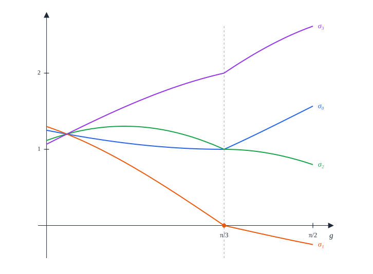

# 10. Seven squares

[Contents](README.md) · [← 9. Six squares](09-six.md) · [Appendix A →](appendix-a.md)

This chapter proves that the least radius of a closed disk that holds seven
unit squares with disjoint interiors is $R_7 = \frac{\sqrt{13}}2$, and it
finds all the packings at that radius. Unlike one to six squares, the optimal
packing is not unique: four squares form two side columns, and each of the
three squares of the middle column can slide along it on its own, as long as
the three stay 1 apart and inside the disk.

The idea is the following. Every square that does not contain the disk centre
gets a *marker*, a direction from the disk centre computed from the position of
the centre relative to the square. The heart of the proof is a statement about
two disjoint such squares: their markers are at least $\frac\pi3$ apart, and
exactly $\frac\pi3$ apart only if the two squares touch as neighbours do in the
optimal packings. Seven markers cannot be pairwise $\frac\pi3$ apart, so one
square contains the disk centre; the markers of the other six form a regular
hexagon, and the contacts between neighbours rebuild the optimal packing. The
argument compares pairs of squares rather than arcs of a single circle, and it
uses the disk only through the farthest-vertex bound
$\varphi(a_S, b_S) \le \frac{13}4$ of
[Lemma 3.4](03-tools.md#lemma-34-farthest-vertex).

## Theorem 10.1 (seven squares)

Let $R_7 = \frac{\sqrt{13}}2$. For real numbers $y_1, y_2, y_3$, the *heights*,
with

```math
-\left(\sqrt3 - \tfrac12\right) \le y_1, \qquad y_1 + 1 \le y_2, \qquad y_2 + 1 \le y_3, \qquad y_3 \le \sqrt3 - \tfrac12 ,
```

the *column packing* with these heights is the model $Q(1, -\frac12)$,
$Q(1, \frac12)$, $Q(-1, -\frac12)$, $Q(-1, \frac12)$, $Q(0, y_1)$,
$Q(0, y_2)$, $Q(0, y_3)$: a column of three squares between two columns of
two.

1. Every column packing is a packing in the closed disk of radius $R_7$ about
   the origin.
2. If seven unit squares form a packing in a closed disk of radius $R$, then
   $R \ge R_7$.
3. The packings of seven unit squares in a closed disk of radius $R_7$ are
   exactly the configurations congruent to a column packing.


*Figure 10.1.* The column packing with heights $(-1, 0, 1)$ in its circle of
radius $R_7$ (dashed). The unit circle $\Gamma_1$ about the disk centre $o$
splits into six arcs of exactly 60°, one in each square that avoids $o$; the
middle square (grey) contains $o$. The centres of the six arcs are the markers
of Definition 10.6, in the directions 30°, 90°, …, 330°, exactly $\frac\pi3$
apart.

*Lean: [`Seven.radius`](../../SquaresInCircles/Geometry.lean#L238),
[`Seven.columnLimit`](../../SquaresInCircles/Geometry.lean#L243),
[`Seven.Column`](../../SquaresInCircles/Geometry.lean#L248),
[`Seven.columnCenters`](../../SquaresInCircles/Geometry.lean#L259),
[`Seven.columnModel`](../../SquaresInCircles/Geometry.lean#L265),
[`Seven.column_packing`](../../SquaresInCircles/Seven/Construction.lean#L49),
[`Seven.uniqueness`](../../SquaresInCircles/Seven/Uniqueness.lean#L64),
[`Seven.optimum`](../../SquaresInCircles/Seven/Uniqueness.lean#L70).*

*Remark.* The optimum is not unique. The four side squares are fixed, but each
of the three middle squares can move along the middle column on its own, as
long as their centres stay at least 1 apart and within $\sqrt3 - \frac12$ of
the disk centre (Figure 10.2). The four outer corners $(\pm\frac32, \pm1)$ lie on
the circle of radius $R_7$; a middle square reaches it only at the end of its
range. In every column packing the middle square $Q(0, y_2)$ contains the
origin: $y_2 \ge y_1 + 1 \ge \frac32 - \sqrt3$ and
$y_2 \le y_3 - 1 \le \sqrt3 - \frac32$, so
$|y_2| \le \sqrt3 - \frac32 < \frac12$. The other six squares avoid it: the
side centres are 1 away from it in the first coordinate, and
$y_1 \le y_2 - 1 \le \sqrt3 - \frac52 < -\frac12$ and
$y_3 \ge y_2 + 1 \ge \frac52 - \sqrt3 > \frac12$.

*Outline of the proof.* Part (1) is Proposition 10.2 (§10.1). The work is part
(3) at the radius $R_7$ itself: Proposition 10.3 shows that every packing in the
closed disk of radius $R_7$ is congruent to a column packing, and parts (2) and
(3) then follow from
[Corollary 2.10](02-preliminaries.md#corollary-210-the-scheme-of-proof) (§10.8).
The proof of Proposition 10.3 has five steps.

1. *States and markers* (§10.2). Each square $S$ that does not contain the disk
   centre has a *state* $(a_S, b_S)$, the position of the disk centre seen
   from the square, and a *marker*, a direction from the disk centre. At the
   radius $R_7$ the states are *admissible*: $\varphi(a_S, b_S) \le \frac{13}4$.
   The closed square contains a long arc of the unit circle about its marker
   (Lemma 10.9, proved in [Appendix F](appendix-f.md)).
2. *Pairs of squares* (§10.3, §10.4). Two such squares, read in the frame of the
   first, form a *canonical pair*, and four *support sums* $\sigma_k$ measure
   the overlaps of their shadows on the four edge directions of the first
   square. If the squares are disjoint, a support sum of the pair, or of the
   pair seen from the second square, is at most 0 (Lemma 10.14). When the
   markers are exactly $\frac\pi3$ apart, every support sum is nonnegative,
   and it vanishes only at a *contact*, one of the three ways in which
   neighbours touch in a column packing (Proposition 10.17, proved in
   [Appendix G](appendix-g.md), [Appendix H](appendix-h.md) and
   [Appendix I](appendix-i.md)).
3. *Marker separation* (§10.5). For markers less than $\frac\pi3$ apart every
   support sum is positive (Theorem 10.23). So disjoint squares have markers at
   least $\frac\pi3$ apart, and exactly $\frac\pi3$ apart only at a contact
   (Theorem 10.24).
4. *The ring* (§10.6). Seven markers do not fit, so some square contains the
   disk centre. The markers of the other six form a regular hexagon,
   neighbours round it are contacts, and the contacts rebuild the two side
   columns and one square above and one below the centre (Proposition 10.26).
5. *The middle column* (§10.7). The side columns pin the square that contains
   the disk centre to the middle column (Lemma 10.27). The three squares of the
   column need only be 1 apart, and that is a column packing.

## 10.1 Construction

### Proposition 10.2 (the column packings)

Let $y_1, y_2, y_3$ be heights as in Theorem 10.1.

1. The column packing with these heights is a packing in the closed disk of
   radius $R_7$ about the origin.
2. The four *slacks*

   ```math
   \zeta_0 = y_1 + \sqrt3 - \tfrac12, \qquad \zeta_1 = y_2 - y_1 - 1, \qquad \zeta_2 = y_3 - y_2 - 1, \qquad \zeta_3 = \sqrt3 - \tfrac12 - y_3 ,
   ```

   the room below, between and above the squares of the middle column, are
   nonnegative with $\zeta_0 + \zeta_1 + \zeta_2 + \zeta_3 = 2\sqrt3 - 3$.
   Conversely, for all nonnegative $\zeta_0, \dots, \zeta_3$ with this sum
   there is exactly one choice of heights with these slacks.

*Proof.* (1) We apply
[Lemma 2.8](02-preliminaries.md#lemma-28-axis-parallel-squares) (3). Any two of
the seven centres differ by at least 1 in one coordinate: two side centres
$(\pm1, \pm\frac12)$ differ by 2 in the first coordinate or by 1 in the second;
a side centre and a middle centre $(0, y_i)$ differ by 1 in the first; and two
middle centres differ by at least 1 in the second, as $y_2 - y_1 \ge 1$,
$y_3 - y_2 \ge 1$ and $y_3 - y_1 \ge 2$. Each centre $(x, y)$ satisfies
$(|x| + \frac12)^2 + (|y| + \frac12)^2 \le R_7^2 = \frac{13}4$: for the side
centres this is $\frac94 + 1 = \frac{13}4$, and for a middle centre it is
$\frac14 + (|y_i| + \frac12)^2 \le \frac14 + 3$, because
$-(\sqrt3 - \frac12) \le y_1 \le y_2 \le y_3 \le \sqrt3 - \frac12$.

(2) The slacks are nonnegative by the four conditions on the heights, and
their sum telescopes to $2(\sqrt3 - \frac12) - 2 = 2\sqrt3 - 3$. Conversely the
slacks determine the heights, $y_1 = -(\sqrt3 - \frac12) + \zeta_0$,
$y_2 = y_1 + 1 + \zeta_1$, $y_3 = y_2 + 1 + \zeta_2$, and these heights satisfy
the four conditions, the last one because
$y_3 = \sqrt3 - \frac12 - \zeta_3$ when the slacks add up to $2\sqrt3 - 3$.
$\square$

*Lean:
[`Seven.column_packing`](../../SquaresInCircles/Seven/Construction.lean#L49),
[`Seven.model_packing`](../../SquaresInCircles/Seven/Construction.lean#L87),
[`Seven.centeredColumn`](../../SquaresInCircles/Seven/Construction.lean#L70),
[`Seven.Column.slots`](../../SquaresInCircles/Seven/Construction.lean#L94),
[`Seven.Column.slots_nonneg`](../../SquaresInCircles/Seven/Construction.lean#L98),
[`Seven.Column.sum_slots`](../../SquaresInCircles/Seven/Construction.lean#L102),
[`Seven.columnOfSlots`](../../SquaresInCircles/Seven/Construction.lean#L109),
[`Seven.columnSlotEquiv`](../../SquaresInCircles/Seven/Construction.lean#L140),
[`axis_packing`](../../SquaresInCircles/Common/Constructions.lean#L38).*


*Figure 10.2.* Three column packings: the middle column pushed down, spread out
and pushed up, with slacks $(0, 0, 0, 2\sqrt3 - 3)$,
$(0, \sqrt3 - \frac32, \sqrt3 - \frac32, 0)$ and $(2\sqrt3 - 3, 0, 0, 0)$. The
side columns do not move; the middle column has $2\sqrt3 - 3 \approx 0.46$ of
room in all, shared in any way among its four slacks.

## 10.2 States, labels and markers

The proof of the following proposition occupies §10.2 to §10.7.

### Proposition 10.3 (uniqueness)

Every packing of seven unit squares in a closed disk of radius $R_7$ is
congruent to a column packing.

*Lean: [`Seven.uniqueness`](../../SquaresInCircles/Seven/Uniqueness.lean#L64).*

Throughout, the disk centre $o$ is fixed. For every exterior square $S$
([Definition 3.2](03-tools.md#definition-32-containing-and-exterior-squares)) we
fix a chart $(\theta_S, \varepsilon_S)$
([Definition 3.20](03-tools.md#definition-320-chart) and
[Lemma 3.21](03-tools.md#lemma-321-charts)): in it, $S$ is the axis-parallel unit
square centred at $(a_S, b_S)$, with $a_S \ge \frac12$ and
$0 \le b_S \le a_S$, and by
[Lemma 3.22](03-tools.md#lemma-322-cartesian-form-of-a-chart) $S$ sits at
$(a_S, \varepsilon_S b_S)$ in the frame $\theta_S$. A square may have more than
one chart (for instance when $a_S = b_S$); everything below holds for any
choice.

### Definition 10.4 (states)

A *state* is a pair of real numbers $(a, b)$ with $\frac12 \le a$ and
$0 \le b \le a$. It is *admissible* if moreover
$\varphi(a, b) \le \frac{13}4$. The *remainder* of $(a, b)$ is

```math
r(a, b) = 4 - 3a - 2b .
```

The *state* of an exterior square $S$ is the pair $(a_S, b_S)$ of its offsets,
written $(a, b)$, and its *sign* is its orientation $\varepsilon_S$.

*Lean: [`Seven.Admissible`](../../SquaresInCircles/Seven/Exterior.lean#L33),
[`ExteriorChart`](../../SquaresInCircles/Common/ExteriorCharts.lean#L17),
[`Seven.remainder`](../../SquaresInCircles/Seven/Exterior.lean#L30),
[`Seven.targetSq`](../../SquaresInCircles/Seven/Exterior.lean#L25).*

### Lemma 10.5 (admissible states)

1. For all real $a$ and $b$,

   ```math
   r(a, b) = (a - 1)^2 + \left(b - \tfrac12\right)^2 + \tfrac{13}4 - \varphi(a, b) .
   ```

   Hence an admissible state has $r(a, b) \ge 0$, that is $3a + 2b \le 4$.
2. An admissible state $(a, b)$ has $a \le \sqrt3 - \frac12 < \frac54$,
   $a + b < \frac{31}{20}$ and $b < \frac{31}{40}$. Here
   $1.73 < \sqrt3 < 1.733$.
3. If $S$ is an exterior square with $\varphi(a_S, b_S) \le \frac{13}4$, in
   particular if $\overline S$ lies in a closed disk of radius $R_7$ about $o$,
   then the state of $S$ is admissible.

*Proof.* (1) This is the identity of
[Lemma 3.6](03-tools.md#lemma-36-tangent-lines) at the point $(1, \frac12)$,
where $\varphi(1, \frac12) = \frac{13}4$ and the linear terms are
$3(a - 1) + 2(b - \frac12) = -r(a, b)$. For an admissible state the three terms
on the right are nonnegative.

(2) As $b \ge 0$, [Lemma 3.4](03-tools.md#lemma-34-farthest-vertex) (2) gives
$a \le \sqrt{\frac{13}4 - \frac14} - \frac12 = \sqrt3 - \frac12$; and
$\sqrt3 < \frac74$ because $3 < \frac{49}{16}$. Next,
$2\varphi(a, b) = (a + b + 1)^2 + (a - b)^2 \ge (a + b + 1)^2$, so
$(a + b + 1)^2 \le \frac{13}2 < (\frac{51}{20})^2 = 6.5025$ and
$a + b < \frac{31}{20}$. With $b \le a$ this gives
$2b \le a + b < \frac{31}{20}$. The bounds on $\sqrt3$ follow from
$1.73^2 < 3 < 1.733^2$.

(3) By [Lemma 3.21](03-tools.md#lemma-321-charts) (1), $a_S \ge \frac12$ since
$o \notin S^\circ$, and $0 \le b_S \le a_S$ by
[Definition 3.1](03-tools.md#definition-31-position-of-the-disk-centre). If
$\overline S$ lies in the closed disk of radius $R_7$ about $o$, then
$\varphi(a_S, b_S) \le R_7^2 = \frac{13}4$ by
[Lemma 3.4](03-tools.md#lemma-34-farthest-vertex). $\square$

*Lean:
[`Seven.remainder_identity`](../../SquaresInCircles/Seven/Exterior.lean#L35),
[`Seven.Admissible.remainder_nonneg`](../../SquaresInCircles/Seven/Exterior.lean#L58),
[`Seven.Admissible.tangent`](../../SquaresInCircles/Seven/Exterior.lean#L55),
[`tangent_le`](../../SquaresInCircles/Common/Tangents.lean#L19),
[`Seven.Admissible.a_le_sqrt_three_sub_half`](../../SquaresInCircles/Seven/Exterior.lean#L62),
[`Seven.Admissible.a_lt_five_fourths`](../../SquaresInCircles/Seven/Exterior.lean#L65),
[`Seven.Admissible.sum_lt`](../../SquaresInCircles/Seven/Exterior.lean#L69),
[`Seven.Admissible.u_lt`](../../SquaresInCircles/Seven/Exterior.lean#L73),
[`dot_gt`](../../SquaresInCircles/Common/DiskSupport.lean#L34),
[`coordinate_le_of_phi`](../../SquaresInCircles/Common/Basic.lean#L166),
[`Seven.sqrt_three_bounds`](../../SquaresInCircles/Seven/Exterior.lean#L222),
[`SquareChart.exteriorChart`](../../SquaresInCircles/Common/ExteriorCharts.lean#L49).*

The identity (1) says that $r \ge 0$ is the tangent half-plane
([Definition 3.5](03-tools.md#definition-35-tangent-half-plane) and
[Lemma 3.6](03-tools.md#lemma-36-tangent-lines)) of the circle
$\varphi = \frac{13}4$ at $(1, \frac12)$, and that among admissible states
$r = 0$ only at that point (Figure 10.3). In a column packing the four side
squares have the state $(1, \frac12)$, and the top and bottom squares have the
states $(y_3, 0)$ and $(-y_1, 0)$, where
$\frac52 - \sqrt3 \le y_3, -y_1 \le \sqrt3 - \frac12$.


*Figure 10.3.* The admissible states: $\frac12 \le a$, $0 \le b \le a$ and
$\varphi(a, b) \le \frac{13}4$. The line $r = 0$ touches the circle
$\varphi = \frac{13}4$ at the side state $(1, \frac12)$, and the region lies on
the side $r \ge 0$. The axial states of Definition 10.15 form the thick
segment of the $a$-axis; the transition state $(a_0, b_0)$ of Definition 10.6 is
marked on the arc.

### Definition 10.6 (labels and markers)

For real $a$ and $b$ let

```math
\mathrm{axial}(b) = \tfrac54 b, \qquad
\mathrm{side}(a, b) = \tfrac\pi6 + \tfrac13\left(b - \tfrac12\right) + \tfrac34(1 - a), \qquad
\ell(a, b) = \min\left(\mathrm{axial}(b), \mathrm{side}(a, b), \tfrac\pi4\right) .
```

The number $\ell(a, b)$ is the *label* of $(a, b)$. The label is *axial*,
*side* or *capped* when the first, second or third term attains the minimum
(Figure 10.4), and *active* when it is axial or side. A tie counts for every
term that attains the minimum, so a label equal to $\frac\pi4$ can be both
capped and active. The *marker* of an exterior square $S$ is the direction

```math
\mu_S = \theta_S + \varepsilon_S\,\ell(a_S, b_S) .
```

The axial and side terms agree exactly on the line $9a + 11b = 2\pi + 7$,
since $12(\mathrm{axial}(b) - \mathrm{side}(a, b)) = 9a + 11b - 2\pi - 7$. This
line meets the circle $\varphi = \frac{13}4$ in two points; the one with the
larger $a$ is the *transition state* $(a_0, b_0)$,

```math
a_0 = \frac{9M + 11J}{202} - \frac12, \qquad b_0 = \frac{11M - 9J}{202} - \frac12, \qquad M = 2\pi + 17, \quad J = \sqrt{202\cdot\tfrac{13}4 - M^2} ,
```

and $s_0 = \frac54 b_0$ is its label. Numerically
$(a_0, b_0) \approx (1.1198, 0.2914)$ and $s_0 \approx 0.3642$.

*Lean: [`Seven.axial`](../../SquaresInCircles/Seven/Exterior.lean#L27),
[`Seven.side`](../../SquaresInCircles/Seven/Exterior.lean#L28),
[`Seven.label`](../../SquaresInCircles/Seven/Exterior.lean#L29),
[`Seven.ActiveLabel`](../../SquaresInCircles/Seven/Pair/Contacts.lean#L65),
[`Seven.chartMarker`](../../SquaresInCircles/Seven/Exterior.lean#L219),
[`Seven.chartSign`](../../SquaresInCircles/Seven/Pair.lean#L20),
[`Seven.Boundary.a0`](../../SquaresInCircles/Seven/Pair/LabelBoundary.lean#L19),
[`Seven.Boundary.u0`](../../SquaresInCircles/Seven/Pair/LabelBoundary.lean#L20),
[`Seven.Boundary.s0`](../../SquaresInCircles/Seven/Pair/LabelBoundary.lean#L21).*

The label is an angle measured in the chart from the phase $\theta_S$ towards
the centre of $S$ (Figure 10.6). In the column packing of Figure 10.1 the side
squares have the label $\mathrm{side}(1, \frac12) = \frac\pi6$ and the top and
bottom squares the label $\mathrm{axial}(0) = 0$; for instance $Q(1, -\frac12)$
has the chart $(0, -1)$ and the marker $-\frac\pi6$, and the top square has a
chart with phase $\frac\pi2$ and the marker $\frac\pi2$. This puts the six
markers at 30°, 90°, …, 330°.

![The admissible region of the (a, b)-plane divided into three label regions: the axial region below and left, where the label is 5b/4; the side region on the right next to the circle, where the label is the side term; and the small capped triangle near the diagonal, where the label is pi/4. The dividing lines meet at one point; level lines of the label are drawn in each region, horizontal in the axial region and of slope 9/4 in the side region; the side state, the transition state and the axial segment are marked](figures/10-seven/labels.svg)

*Figure 10.4.* The label on the admissible region. It is axial (green) below
the line $b = \frac\pi5$ and left of the line $9a + 11b = 2\pi + 7$, side
(orange) to the right of that line and below the line $9a - 4b = 7 - \pi$, and
capped (grey) in the triangle above both, whose vertices are
$(\frac\pi5, \frac\pi5)$, $(\frac{7 - \pi/5}9, \frac\pi5)$ and
$(\frac{7 - \pi}5, \frac{7 - \pi}5)$; the three lines meet at the second
vertex. The thin lines are level lines of $\ell$ at $0.1, 0.2, \dots, 0.7$,
horizontal where the label is axial. The side state (orange dot) and the
transition state (black dot) are marked.

### Lemma 10.7 (the label)

1. For all real $a$ and $b$,

   ```math
   \mathrm{side}(a, b) = \tfrac\pi6 + \tfrac56\left(b - \tfrac12\right) + \tfrac14 r(a, b)
   = \tfrac\pi6 - \tfrac54(a - 1) - \tfrac16 r(a, b) .
   ```

2. Let $(a, b)$ be admissible. Then $\mathrm{side}(a, b) > 0$ and
   $0 \le \ell(a, b) \le \frac\pi4$; the label is equal to one of
   $\mathrm{axial}(b)$, $\mathrm{side}(a, b)$, $\frac\pi4$ and at most each of
   them; and $\ell(a, b) = 0$ if and only if $b = 0$.
3. An admissible state has $a \le 1 + \frac{2\pi}{15} - \frac45\ell(a, b)$.

*Proof.* (1) Both expressions expand to
$\frac\pi6 + \frac7{12} - \frac34 a + \frac13 b$, and so does
$\mathrm{side}(a, b)$.

(2) By Lemma 10.5 (2), $b \ge 0$ and $a < \frac54$ give
$\mathrm{side}(a, b) > \frac\pi6 - \frac16 - \frac3{16}$, and this is
$\frac\pi6 - \frac{17}{48} > 0$ as $\pi > 3$. The label is the least of the
three numbers $\frac54 b \ge 0$, $\mathrm{side}(a, b) > 0$ and $\frac\pi4$; it
equals one of them and is at most each. If $b = 0$ then
$0 \le \ell(a, b) \le \mathrm{axial}(0) = 0$; if $b > 0$ all three numbers are
positive, and so is the label.

(3) By (1) and $r(a, b) \ge 0$,
$\ell(a, b) \le \mathrm{side}(a, b) \le \frac\pi6 - \frac54(a - 1)$; solve for
$a$. $\square$

*Lean:
[`Seven.side_identity_transverse`](../../SquaresInCircles/Seven/Exterior.lean#L40),
[`Seven.side_identity_radial`](../../SquaresInCircles/Seven/Exterior.lean#L45),
[`Seven.Admissible.side_pos`](../../SquaresInCircles/Seven/Exterior.lean#L75),
[`Seven.Admissible.label_nonneg`](../../SquaresInCircles/Seven/Exterior.lean#L81),
[`Seven.Admissible.label_le_axial`](../../SquaresInCircles/Seven/Exterior.lean#L85),
[`Seven.Admissible.label_le_side`](../../SquaresInCircles/Seven/Exterior.lean#L89),
[`Seven.Admissible.label_le_quarter`](../../SquaresInCircles/Seven/Exterior.lean#L93),
[`Seven.Admissible.label_mem`](../../SquaresInCircles/Seven/Exterior.lean#L96),
[`Seven.Admissible.selected`](../../SquaresInCircles/Seven/Exterior.lean#L117),
[`Seven.Admissible.label_zero_iff`](../../SquaresInCircles/Seven/Exterior.lean#L99),
[`Seven.Admissible.radial_label_bound`](../../SquaresInCircles/Seven/Exterior.lean#L110).*

### Lemma 10.8 (side and axial labels)

Let $(a, b)$ be an admissible state.

1. If the label is side, $\ell(a, b) = \mathrm{side}(a, b)$, then
   $\ell(a, b) > \frac9{25}$, $\frac7{10} < a < \frac98$, and

   ```math
   \tfrac95\left(\ell(a, b) - \tfrac\pi6\right)^2 \le r(a, b) .
   ```

2. If the label is axial, $\ell(a, b) = \mathrm{axial}(b)$, then
   $9a + 11b \le 2\pi + 7$ and $a + b < 1 + \frac{2\pi}{15}$.

*Proof.* We use $3.14 < \pi < 3.1416$.

(1) Write $\ell = \ell(a, b)$. Since $\ell = \mathrm{side}(a, b)$ we
have $12\ell = 2\pi + 7 + 4b - 9a$, and since $\ell \le \mathrm{axial}(b)$ we
have $b \ge \frac45\ell$.

*The label exceeds $\frac9{25}$.* Every admissible state has
$2a + b < 2.532$: with $X = a + \frac12$ and $Y = b + \frac12$,

```math
(2X + Y)^2 + (2Y - X)^2 = 5\left(X^2 + Y^2\right) = 5\,\varphi(a, b) \le \tfrac{65}4 < 4.032^2 ,
```

so $2X + Y < 4.032$, that is $2a + b < 2.532$.
This is the disk $\varphi \le \frac{13}4$ seen in the direction $(2, 1)$.
Now suppose $\ell \le \frac9{25}$. Then $9a = 2\pi + 7 - 12\ell + 4b$ and
$b \ge \frac45\ell$ give

```math
9(2a + b) = 4\pi + 14 - 24\ell + 17b \ge 4\pi + 14 - \tfrac{52}5\ell \ge 4\pi + 14 - \tfrac{52}5 \cdot \tfrac9{25} > 12.56 + 14 - 3.744 > 22.8 ,
```

so $2a + b > \frac{22.8}9 > 2.533$, a contradiction.

*The bound $a < \frac98$.* Suppose $a \ge \frac98$. From
$\mathrm{side}(a, b) > \frac9{25}$,

```math
b - \tfrac12 > \tfrac{27}{25} - \tfrac\pi2 + \tfrac94(a - 1) \ge 1.08 - 1.5708 + 0.28125 > -0.21 ,
```

so $b + \frac12 > 0.79$. With $a + \frac12 \ge \frac{13}8$, the state lies beyond
the corner $(\frac98, 0.29)$, which is already outside the disk:

```math
\varphi(a, b) > \left(\tfrac{13}8\right)^2 + 0.79^2 > 2.64 + 0.62 > \tfrac{13}4 ,
```

a contradiction.

*The bound $a > \frac7{10}$.* From $\ell \le \frac\pi4$,
$\frac13(b - \frac12) \le \frac\pi{12} - \frac34(1 - a)$, that is
$b \le \frac94 a + \frac\pi4 - \frac74$. From $\ell \le \mathrm{axial}(b)$,
$9a + 11b \ge 2\pi + 7$. Together,

```math
2\pi + 7 \le 9a + 11\left(\tfrac94 a + \tfrac\pi4 - \tfrac74\right) = \tfrac{135}4 a + \tfrac{11\pi}4 - \tfrac{77}4 ,
```

so $a \ge \frac{35 - \pi}{45}$, which exceeds $\frac7{10}$ as $\pi < \frac72$.

*The quadratic bound.* Put $D = \ell - \frac\pi6$ and $w = r(a, b) \ge 0$. By
Lemma 10.7 (1) with $\ell = \mathrm{side}(a, b)$,
$a - 1 = -\frac45 D - \frac2{15}w$ and $b - \frac12 = \frac65 D - \frac3{10}w$,
so that

```math
(a - 1)^2 + \left(b - \tfrac12\right)^2 = \tfrac{52}{25}D^2 - \tfrac{38}{75}Dw + \tfrac{97}{900}w^2 .
```

By Lemma 10.5 (1) the left side is at most $w$. Also
$D \le \frac\pi4 - \frac\pi6 = \frac\pi{12} < \frac4{15}$, so, as $w \ge 0$,
$\frac{38}{75}Dw \le \frac{38}{75} \cdot \frac4{15}\,w \le \frac w7$. Dropping the
term in $w^2$, we get $w \ge \frac{52}{25}D^2 - \frac w7$, that is,

```math
w \ge \tfrac78 \cdot \tfrac{52}{25}D^2 = \tfrac{91}{50}D^2 \ge \tfrac95 D^2 .
```

(2) Now $\ell(a, b) = \mathrm{axial}(b) \le \mathrm{side}(a, b)$, and
$12(\mathrm{axial}(b) - \mathrm{side}(a, b)) = 9a + 11b - 2\pi - 7$, so
$9a + 11b \le 2\pi + 7$. As $3a + 2b = 4 - r(a, b)$,

```math
15(a + b) = (9a + 11b) + 2(3a + 2b) \le 2\pi + 7 + 8 - 2r(a, b) ,
```

that is, $a + b \le 1 + \frac{2\pi}{15} - \frac2{15}r(a, b)$. Finally
$r(a, b) > 0$: by Lemma 10.5 (1), the only admissible state with
$r(a, b) = 0$ is $(1, \frac12)$, where $9a + 11b = \frac{29}2 > 2\pi + 7$.
$\square$

*Lean:
[`Seven.Admissible.projection_two_one`](../../SquaresInCircles/Seven/Exterior.lean#L127),
[`dot_gt`](../../SquaresInCircles/Common/DiskSupport.lean#L34),
[`Seven.side_selected_label_gt`](../../SquaresInCircles/Seven/Exterior.lean#L131),
[`Seven.side_selected_a_gt`](../../SquaresInCircles/Seven/Exterior.lean#L154),
[`Seven.side_selected_a_lt`](../../SquaresInCircles/Seven/Exterior.lean#L143),
[`Seven.side_remainder_quadratic`](../../SquaresInCircles/Seven/Exterior.lean#L185),
[`Seven.axial_tie_line`](../../SquaresInCircles/Seven/Exterior.lean#L162),
[`Seven.axial_sum_lt`](../../SquaresInCircles/Seven/Exterior.lean#L172).*

The side term $\ell = \mathrm{side}(a, b)$ and the remainder $r = r(a, b)$ are
affine coordinates of the $(a, b)$-plane. In them part (1) says that the states
with a side label lie right of $\ell = \frac9{25}$ and above the parabola
$r = \frac95(\ell - \frac\pi6)^2$ (Figure 10.5).

![The plane of the side label l and the remainder r near r = 0, l from about 0.33 to 0.83. The states with a side label form an orange region bounded below by a blue curve, the image of the circle phi = 13/4, which touches r = 0 at l = pi/6; on the left the region ends at the transition state, just right of a dashed vertical line at 9/25, and on the right at the vertical l = pi/4, near the corner b = a of the circle. A dashed purple parabola 9/5 (l - pi/6) squared touches r = 0 at the same point and runs just below the blue curve on both sides](figures/10-seven/quadratic.svg)

*Figure 10.5.* Lemma 10.8 (1) in the coordinates
$(\ell, r) = (\mathrm{side}(a, b), r(a, b))$, which are affine in $(a, b)$,
for $0 \le r \le 0.17$. The states with a side label (orange) are bounded below
by the image of the circle $\varphi = \frac{13}4$ (blue), which rests on
$r = 0$ at the side state $(1, \frac12)$, where $\ell = \frac\pi6$. They lie
right of $\frac9{25}$, which the transition state $(a_0, b_0)$ just clears,
and above the parabola $\frac95(\ell - \frac\pi6)^2$ (dashed), which touches
them at the side state and comes close again at the corner $b = a$ of the
circle.

### Lemma 10.9 (the marker arc)

Let $(a, b)$ be an admissible state and $t$ a real number with
$|t - \ell(a, b)| \le \frac12$. Then

```math
|\cos t - a| \le \tfrac12 , \qquad |\sin t - b| \le \tfrac12 ,
```

that is, the point $u(t)$ of the unit circle lies in the closed square
$\overline{Q(a, b)}$.

The proof is given in [Appendix F](appendix-f.md).

*Lean: [`Seven.marker_arc`](../../SquaresInCircles/Seven/Exterior.lean#L486).*

In the chart of an exterior square with an admissible state, the lemma says
that the closed square contains the arc of the unit circle of half-width
$\frac12$ (about $28.6°$) about the label, that is, about the marker
(Figure 10.6). In the column packing of Figure 10.1 the arc in each exterior
square has half-width exactly $\frac\pi6$.

![Left: a tilted exterior square S seen from the disk centre o, with the dashed phase direction theta S, the marker direction mu S turned clockwise from it by the angle l, and a thick orange arc of the unit circle about the marker inside the square. Right: the same square in its chart, the axis-parallel square centred at the state (a, b), with the dashed chart axis t = 0, the marker at the angle l from it, and the same thick arc, whose half-width 1/2 is marked as an angle between the marker and one end of the arc; the whole part of the unit circle inside the square is drawn in thin blue](figures/10-seven/marker.svg)

*Figure 10.6.* The marker, for the state $(1, 0.45)$, whose label is side.
Left: an exterior square $S$ seen from $o$, with its phase $\theta_S$
(dashed) and its marker $\mu_S = \theta_S + \varepsilon_S\ell$, here with
$\varepsilon_S = -1$. Right: the same square in its chart, where it is
$Q(a, b)$ and the marker is at the angle $\ell = \ell(a, b)$. The thick arc of
the unit circle, of half-width $\frac12$ about the marker, lies in the closed
square (Lemma 10.9); the thin blue arc is the whole part of the circle in the
square.

## 10.3 The canonical pair

To compare two exterior squares we read both in the frame of the first; the
second is then turned by the difference of the phases, and everything depends
only on the two states, the two signs and the angle between the markers.

### Definition 10.10 (support function)

For real $a$, $b$ and a direction $z$ let

```math
h(a, b, z) = a\cos z + b\sin z + \tfrac12\left(|\cos z| + |\sin z|\right) .
```

*Lean: [`support`](../../SquaresInCircles/Common/DiskSupport.lean#L93).*

### Lemma 10.11 (the support function)

1. For all real $a, b, z$, every point $p$ of $\overline{Q(a, b)}$ has
   $\langle p, u(z)\rangle \le h(a, b, z)$, with equality at a vertex. So
   $h(a, b, z) = \max_{p \in \overline{Q(a, b)}} \langle p, u(z)\rangle$ is the
   support function of the closed square.
2. Let $(a, b)$ be admissible, $s \in \lbrace 1, -1\rbrace$, and $x$ real with
   $|x - s\,\ell(a, b)| \le \frac12$. Then
   $u(x) \in \overline{Q(a, sb)}$, and $h(a, sb, z) \ge \cos(z - x)$ for every
   $z$.
3. If $(a, |y|)$ is admissible, then $a^2 + y^2 \le (\sqrt3 - \frac12)^2$ and
   $h(a, y, z) \ge 1 - \sqrt3 > -\frac{37}{50}$ for every $z$. In particular
   this holds for $y = sb$ when $(a, b)$ is admissible and $s = \pm1$.

*Proof.* (1) Write $p = (a + x, b + y)$ with $|x|, |y| \le \frac12$. Then
$\langle p, u(z)\rangle = a\cos z + b\sin z + x\cos z + y\sin z$, and
$x\cos z + y\sin z \le \frac12|\cos z| + \frac12|\sin z|$, with equality when
$x$ and $y$ are $\pm\frac12$ with the signs of $\cos z$ and $\sin z$.

(2) For $s = 1$, Lemma 10.9 with $t = x$ gives $u(x) \in \overline{Q(a, b)}$.
For $s = -1$, apply Lemma 10.9 to $t = -x$, which has
$|t - \ell(a, b)| = |x + \ell(a, b)| \le \frac12$: then
$|\cos x - a| \le \frac12$ and $|{-\sin x} - b| \le \frac12$, so
$u(x) \in \overline{Q(a, -b)}$. In both cases (1) gives
$h(a, sb, z) \ge \langle u(x), u(z)\rangle = \cos(z - x)$.

(3) As $a$ and $|y|$ are nonnegative and $\varphi(a, |y|) \le \frac{13}4$,
[Lemma 3.4](03-tools.md#lemma-34-farthest-vertex) (3) gives
$\rho = \sqrt{a^2 + y^2} \le \sqrt{\frac{13}4 - \frac14} - \frac12 = \sqrt3 - \frac12$.
By Cauchy–Schwarz $a\cos z + y\sin z \ge -\rho$, and
$(|\cos z| + |\sin z|)^2 = 1 + 2|\cos z\sin z| \ge 1$, so
$h(a, y, z) \ge \frac12 - \rho \ge 1 - \sqrt3$, and
$1 - \sqrt3 > 1 - 1.733 > -\frac{37}{50}$ by Lemma 10.5 (2). $\square$

*Lean: [`point_le_support`](../../SquaresInCircles/Common/DiskSupport.lean#L96),
[`Seven.marker_arc_support`](../../SquaresInCircles/Seven/Pair/Frame.lean#L50),
[`Seven.sign_admissible`](../../SquaresInCircles/Seven/Pair/Frame.lean#L44),
[`Seven.support_lower`](../../SquaresInCircles/Seven/Exterior.lean#L228),
[`support_ge`](../../SquaresInCircles/Common/DiskSupport.lean#L107),
[`ExteriorChart.center_sq_le`](../../SquaresInCircles/Common/ExteriorCharts.lean#L41),
[`cauchy_sq`](../../SquaresInCircles/Common/Basic.lean#L41).*

Part (2) is how the marker arcs enter the proofs below: a point of the arc lies
in the closed square, so its projection on any direction is at most the support
(Figure 10.7).


*Figure 10.7.* Lemma 10.11 (1) and (2) for the state $(1, 0.45)$ and the
direction $z = 75°$. The line perpendicular to $u(z)$ at the distance
$h(a, b, z)$ from $o$ supports $\overline{Q(a, b)}$ at a vertex. The point
$u(x)$ of the marker arc lies in the closed square, so its projection
$\cos(z - x)$ on $u(z)$ is at most $h(a, b, z)$.

### Definition 10.12 (canonical pair and support sums)

Let $a, b, A, B, g$ be real numbers and $s, t \in \lbrace 1, -1\rbrace$; in all
our applications $(a, b)$ and $(A, B)$ are states. For an angle $d$, $R_d$ is
the rotation of the plane about the origin by $d$,
$R_d(x, y) = x\,u(d) + y\,u(d + \frac\pi2)$. The *relative phase* is

```math
d = g + s\,\ell(a, b) - t\,\ell(A, B) ,
```

and the *canonical pair* consists of the unit squares $S = Q(a, sb)$ and $T$,
the unit square with centre $c_T = R_d(A, tB)$ and frame
$u(d), u(d + \frac\pi2)$. The local coordinates of $R_d\,p$ in $T$ are the
coordinates of $p - (A, tB)$, so

```math
T^\circ = R_d\left(Q(A, tB)^\circ\right), \qquad \overline T = R_d\left(\overline{Q(A, tB)}\right) :
```

with the origin as the disk centre, $S$ sits at $(a, sb)$ in the frame $0$ and
$T$ sits at $(A, tB)$ in the frame $d$, that is, $S = Q_0(a, sb)$ and
$T = Q_d(A, tB)$ in the notation of
[Definition 9.9](09-six.md#definition-99-squares-in-a-frame). The number $g$ is
the *gap*: the *markers* $s\,\ell(a, b)$ of $S$ and
$d + t\,\ell(A, B) = g + s\,\ell(a, b)$ of $T$ are $g$ apart. For
$k = 0, 1, 2, 3$ let $n_k = u(k\frac\pi2)$, the outer normal of the $k$-th edge
of $S$ (Figure 10.8). We call $n_0$, $n_1$, $n_2$, $n_3$ the *outward*,
*forward*, *inward* and *backward* axes: $n_0$ points away from the
disk centre and $n_2$ towards it, $n_1$ points in the direction of increasing
angle, towards the marker of $T$, and $n_3$ the other way. The *support sums*
of the pair are

```math
\sigma_k(g) = h\left(a, sb, k\tfrac\pi2\right) + h\left(A, tB, k\tfrac\pi2 + \pi - d\right) \qquad (k = 0, 1, 2, 3),
```

regarded as functions of the gap $g$, all other data being fixed. The
*reversed pair* is the canonical pair of $A, B, a, b$ with the signs $-t, -s$
and the same gap $g$; we write $\sigma'_k(g)$ for its support sums.

*Lean:
[`Seven.TransverseSign`](../../SquaresInCircles/Seven/Pair/Frame.lean#L19),
[`Seven.cardinalAngle`](../../SquaresInCircles/Seven/Pair/Frame.lean#L37),
[`Seven.relativePhase`](../../SquaresInCircles/Seven/Pair/Frame.lean#L133),
[`Seven.pairSupport`](../../SquaresInCircles/Seven/Pair/Frame.lean#L39),
[`orientedSquare`](../../SquaresInCircles/Common/Congruence.lean#L87),
[`Seven.CanonicalDisjoint`](../../SquaresInCircles/Seven/Pair/Frame.lean#L170).*


*Figure 10.8.* The canonical pair of the states $(1.1, 0.2)$ and $(1, 0.4)$
with the signs $1$ and $-1$ at the gap $g = 1.6$, with the markers of $S$ and
$T$ and the four axes $n_0, \dots, n_3$ of $S$. Below and to the left are the
shadows of $\overline S$ (blue) and $\overline T$ (green) on the two axes of
$S$. By Lemma 10.13 (1) each support sum compares two ends of shadows: $\sigma_1$
runs from the lower end of the shadow of $T$ to the upper end of the shadow of
$S$, and is positive here; $\sigma_2$ runs from the left end of the shadow of
$S$ to the right end of the shadow of $T$, and is negative here, so a vertical
line separates the squares.

### Lemma 10.13 (support sums)

Let $(S, T)$ be the canonical pair of $a, b, A, B, g, s, t$, with relative phase
$d$, and let

```math
\Delta = c_T - c_S = (\Delta_1, \Delta_2) = \left(A\cos d - tB\sin d - a,\ A\sin d + tB\cos d - sb\right), \qquad
W = \tfrac12\left(1 + |\cos d| + |\sin d|\right) .
```

1. The support sums compare the shadows of the closed squares on the axes:

   ```math
   \sigma_k(g) = \max_{p \in \overline S}\langle p, n_k\rangle - \min_{q \in \overline T}\langle q, n_k\rangle .
   ```

   So $\sigma_k(g) \le 0$ if and only if some line perpendicular to $n_k$ has
   $\overline S$ on one side and $\overline T$ on the other:
   $\langle p, n_k\rangle \le m \le \langle q, n_k\rangle$ for some $m$ and all
   $p \in \overline S$, $q \in \overline T$.
2. In terms of the centres,

   ```math
   \sigma_0(g) = W - \Delta_1, \qquad \sigma_1(g) = W - \Delta_2, \qquad \sigma_2(g) = W + \Delta_1, \qquad \sigma_3(g) = W + \Delta_2 .
   ```

3. The reversed pair has the same relative phase $d$, and its support sums are

   ```math
   \begin{aligned}
   \sigma'_0(g) &= W + \langle \Delta, u(d)\rangle, & \sigma'_1(g) &= W - \left\langle \Delta, u\left(d + \tfrac\pi2\right)\right\rangle, \\
   \sigma'_2(g) &= W - \langle \Delta, u(d)\rangle, & \sigma'_3(g) &= W + \left\langle \Delta, u\left(d + \tfrac\pi2\right)\right\rangle .
   \end{aligned}
   ```

4. Each $\sigma_k$ is a continuous function of $g$.

*Proof.* (1) By Lemma 10.11 (1),
$\max_{\overline S}\langle \cdot, n_k\rangle = h(a, sb, k\frac\pi2)$. Since
$\overline T = R_d(\overline{Q(A, tB)})$ and
$\langle R_d\,p, n_k\rangle = \langle p, R_{-d}\,n_k\rangle$, where
$R_{-d}\,n_k = u(k\frac\pi2 - d)$,

```math
\begin{aligned}
\min_{q \in \overline T}\langle q, n_k\rangle &= \min_{p \in \overline{Q(A, tB)}}\left\langle p, u\left(k\tfrac\pi2 - d\right)\right\rangle \\
&= -\max_{p \in \overline{Q(A, tB)}}\left\langle p, u\left(k\tfrac\pi2 + \pi - d\right)\right\rangle = -h\left(A, tB, k\tfrac\pi2 + \pi - d\right).
\end{aligned}
```

Subtract. If $\sigma_k(g) \le 0$, take
$m = \max_{\overline S}\langle\cdot, n_k\rangle$; conversely, such an $m$ lies
between $\max_{\overline S}\langle\cdot, n_k\rangle$ and
$\min_{\overline T}\langle\cdot, n_k\rangle$.

(2) As $|\cos k\frac\pi2| + |\sin k\frac\pi2| = 1$, the first term of
$\sigma_k$ is $\langle (a, sb), n_k\rangle + \frac12$, that is
$\langle c_S, n_k\rangle + \frac12$. As
$\langle (A, tB), R_{-d}\,n_k\rangle = \langle R_d(A, tB), n_k\rangle$ and a
quarter turn exchanges $|\cos|$ and $|\sin|$, the second term is

```math
\begin{aligned}
& -\left\langle (A, tB), u\left(k\tfrac\pi2 - d\right)\right\rangle + \tfrac12\left(\left|\cos\left(k\tfrac\pi2 - d\right)\right| + \left|\sin\left(k\tfrac\pi2 - d\right)\right|\right) \\
&\qquad = -\langle c_T, n_k\rangle + \tfrac12\left(|\cos d| + |\sin d|\right) .
\end{aligned}
```

So $\sigma_k(g) = W - \langle \Delta, n_k\rangle$, which is (2) for
$n_k = (1, 0), (0, 1), (-1, 0), (0, -1)$.

(3) The relative phase of the reversed pair is
$g + (-t)\ell(A, B) - (-s)\ell(a, b) = d$. Its squares are $S' = Q(A, -tB)$ and
$T'$ with centre $R_d(a, -sb)$, which is
$(a\cos d + sb\sin d,\ a\sin d - sb\cos d)$. So by (2) its support sums are
$W \mp \Delta'_1$ and $W \mp \Delta'_2$ with
$\Delta' = (a\cos d + sb\sin d - A,\ a\sin d - sb\cos d + tB)$. Expanding,

```math
\langle \Delta, u(d)\rangle = A - a\cos d - sb\sin d = -\Delta'_1, \qquad
\left\langle \Delta, u\left(d + \tfrac\pi2\right)\right\rangle = tB + a\sin d - sb\cos d = \Delta'_2 .
```

(4) $h$ is continuous in $z$, and $z = k\frac\pi2 + \pi - d$ is affine in $g$.
$\square$

*Lean:
[`Seven.pair_support_axis_values`](../../SquaresInCircles/Seven/Pair/Frame.lean#L142),
[`angularWidth`](../../SquaresInCircles/Common/SeparatingAxes.lean#L250),
[`Seven.centerDX`](../../SquaresInCircles/Seven/Pair/Frame.lean#L136),
[`Seven.centerDY`](../../SquaresInCircles/Seven/Pair/Frame.lean#L139),
[`Seven.reverse_reflected_phase`](../../SquaresInCircles/Seven/Pair/Frame.lean#L162),
[`pair_frameX_right`](../../SquaresInCircles/Common/SeparatingAxes.lean#L336),
[`pair_frameY_right`](../../SquaresInCircles/Common/SeparatingAxes.lean#L344),
[`Seven.pairSupport_continuous`](../../SquaresInCircles/Seven/Pair/SmallerGaps.lean#L430).*

The reversed pair is the pair seen from $T$: the isometry of the plane that
turns by $-d$ about the origin and then reflects in the first axis maps $T$
onto $S'$ and $S$ onto $T'$ (Figure 10.9). So the axes of $S'$ are the edge
directions of $T$, as (3) shows.


*Figure 10.9.* The reversed pair. Left, the canonical pair of Figure 10.8.
Right, its reversed pair, the canonical pair of $(1, 0.4)$ and $(1.1, 0.2)$
with the signs $1$ and $-1$: $S' = Q(1, 0.4)$ is $T$ turned by $-d$ and
reflected in the first axis, and $T'$ is $S$ moved in the same way. The gap is
still $g$.

### Lemma 10.14 (separating axes)

Let $a, b, A, B, g$ be real numbers and $s, t \in \lbrace 1, -1\rbrace$. If the
open squares of the canonical pair are disjoint, then $\sigma_k(g) \le 0$ for
some $k$, or $\sigma'_k(g) \le 0$ for some $k$.

*Proof.* This is the separating-axis theorem of Chapter 9 for the canonical
pair $S = Q_0(a, sb)$, $T = Q_d(A, tB)$ (Definition 10.12 and Figure 10.10).
With $W$ and $\Delta = c_T - c_S$ as in Lemma 10.13, $W = \tau(d)$
(Definition 9.9) is the threshold of
[Lemma 9.11](09-six.md#lemma-911-separating-axes-of-two-squares) for the
relative phase $d$. As $S$ and $T$ are disjoint, Lemma 9.11 gives
$\langle n, \Delta\rangle \ge W$ for one of the eight vectors
$n = \pm u(0), \pm u(\frac\pi2), \pm u(d), \pm u(d + \frac\pi2)$, the axes of
$S$ and $T$. If $n$ is an axis of $S$, this says $\sigma_k(g) \le 0$ for some
$k$, by Lemma 10.13 (2); if $n$ is an axis of $T$, it says $\sigma'_k(g) \le 0$
for some $k$, by Lemma 10.13 (3). $\square$

*Lean:
[`Seven.canonical_has_separator`](../../SquaresInCircles/Seven/Pair/Frame.lean#L177),
[`oriented_separating_axes`](../../SquaresInCircles/Common/SeparatingAxes.lean#L356).*


*Figure 10.10.* The separating-axis argument of Lemma 10.14. Left, the pair of
Figure 10.8 and $\Delta = c_T - c_S$. Right, the octagon $K$ of the differences
$(p - c_S) - (q - c_T)$ with $p \in \overline S$ and $q \in \overline T$,
whose support function is the sum $w_S + w_T$ of the widths of the squares
([Definition 3.11](03-tools.md#definition-311-width)). Its edges are
perpendicular to the axes $n_0, \dots, n_3$ of $S$ and
$\pm e^T_1 = \pm u(d)$, $\pm e^T_2 = \pm u(d + \frac\pi2)$ of $T$, at the
distance $W$ from the origin (dashed lines). By Lemma 10.13 the eight support
sums are the distances from $\Delta$ to these eight lines, measured inwards;
here $\Delta$ lies beyond the line perpendicular to $n_2$, and
$\sigma_2 < 0$. The point $\Delta$ lies inside $K$ exactly when the closed
squares meet, and strictly inside all eight lines exactly when the open
squares meet.

## 10.4 Contacts and the critical gap

### Definition 10.15 (contacts)

A state is a *side state* if it is $(1, \frac12)$, and an *axial state* if it
is $(a, 0)$ with $\frac12 \le a \le \sqrt3 - \frac12$. Two states $(a, b)$ and
$(A, B)$ with signs $s$ and $t$, in this order, form a *contact* if

1. $s = -1$, $t = 1$, and both states are side states; or
2. $s = 1$, $(a, b)$ is a side state and $(A, B)$ is an axial state; or
3. $t = -1$, $(a, b)$ is an axial state and $(A, B)$ is a side state.

*Lean: [`Seven.SideState`](../../SquaresInCircles/Seven/Pair/Contacts.lean#L16),
[`Seven.AxialState`](../../SquaresInCircles/Seven/Pair/Contacts.lean#L17),
[`Seven.OrderedContact`](../../SquaresInCircles/Seven/Pair/Contacts.lean#L19).*

Going counterclockwise round a column packing, these are the three ways in
which an exterior square touches the next one (Figure 10.11): in (1) the lower
square of a side column touches the upper one, in (2) a side column touches the
top or bottom square, and in (3) the top or bottom square touches the next side
column. In the canonical pair at the gap $\frac\pi3$ a contact of kind (1) has
relative phase $d = 0$, and contacts of kinds (2) and (3) have relative phase
$d = \frac\pi2$.


*Figure 10.11.* The three kinds of contact, as canonical pairs at the gap
$\frac\pi3$. Left, kind (1): $S = Q(1, -\frac12)$ and $T = Q(1, \frac12)$, a
side column; $\sigma_1(\frac\pi3) = 0$. Middle, kind (2): $S = Q(1, \frac12)$
and the axial square $T$ at $(A, 0)$ in the frame $\frac\pi2$, that is
$Q(0, A)$; $\sigma_2(\frac\pi3) = 0$ for every $A$. Right, kind (3): the axial
square $S = Q(a, 0)$ and $T$ at $(1, -\frac12)$ in the frame $\frac\pi2$, that
is $Q(\frac12, 1)$; $\sigma_1(\frac\pi3) = 0$. The shared edges are thick; the
figure uses $A = 1$ and $a = 1$.

### Lemma 10.16 (contacts)

1. $\ell(1, \frac12) = \frac\pi6$, and every axial state $(a, 0)$ is admissible
   with $\ell(a, 0) = 0$. In particular neither state of a contact has a
   capped label.
2. If $(a, b)$ is admissible and $r(a, b) = 0$, then $(a, b)$ is the side
   state.
3. If $(a, b)$ is admissible and $b = 0$, then $(a, b)$ is an axial state.
4. If the states $(A, B)$, $(a, b)$ with the signs $-t$, $-s$ form a contact,
   then $(a, b)$, $(A, B)$ with the signs $s$, $t$ form a contact.
5. Let $(a, b)$ and $(A, B)$ be admissible with
   $\ell(A, B) = \mathrm{axial}(B)$, let $t = \pm1$ and
   $k \in \lbrace 0, 1, 2, 3\rbrace$, and let the support sum of their
   canonical pair with the signs $1, t$ satisfy, for some $c > 0$,

   ```math
   \sigma_k\left(\tfrac\pi3\right) \ge \tfrac2{15}\,r(a, b) + c\left|\ell(a, b) - t\,\ell(A, B) - \tfrac\pi6\right| .
   ```

   Then $\sigma_k(\frac\pi3) \ge 0$, and $\sigma_k(\frac\pi3) = 0$ only if the
   two states with the signs $1, t$ form a contact.

*Proof.* (1) $\mathrm{axial}(\frac12) = \frac58$ and
$\mathrm{side}(1, \frac12) = \frac\pi6$, and $\frac\pi6$ is less than $\frac58$
and $\frac\pi4$. An axial state has $0 \le b \le a$, $\frac12 \le a$ and
$\varphi(a, 0) = (a + \frac12)^2 + \frac14 \le 3 + \frac14$, and its label is 0
by Lemma 10.7 (2). Neither $\frac\pi6$ nor 0 equals $\frac\pi4$.

(2) By Lemma 10.5 (1),
$0 = (a - 1)^2 + (b - \frac12)^2 + (\frac{13}4 - \varphi(a, b))$ is a sum of
three nonnegative terms, so $a = 1$ and $b = \frac12$.

(3) $a \le \sqrt3 - \frac12$ by Lemma 10.5 (2).

(4) If $-t = -1$, $-s = 1$ and both states are side states, then $s = -1$,
$t = 1$: kind (1). If $-t = 1$, $(A, B)$ is a side state and $(a, b)$ axial,
then $t = -1$: kind (3). If $-s = -1$, $(A, B)$ is axial and $(a, b)$ a side
state, then $s = 1$: kind (2).

(5) The right side is nonnegative by Lemma 10.5 (1). If
$\sigma_k(\frac\pi3) = 0$, both terms vanish. By (2), $(a, b) = (1, \frac12)$,
whose label is $\frac\pi6$ by (1); then $t\,\ell(A, B) = 0$, so
$\frac54 B = \ell(A, B) = 0$, and $(A, B)$ is axial by (3). With $s = 1$ this
is a contact of kind (2). $\square$

*Lean:
[`Seven.side_label`](../../SquaresInCircles/Seven/Pair/Contacts.lean#L34),
[`Seven.axial_label`](../../SquaresInCircles/Seven/Pair/Contacts.lean#L41),
[`Seven.side_neq_cap`](../../SquaresInCircles/Seven/Pair/Contacts.lean#L44),
[`Seven.contact_label_not_cap`](../../SquaresInCircles/Seven/Pair/Contacts.lean#L48),
[`Seven.AxialState.admissible`](../../SquaresInCircles/Seven/Ring.lean#L45),
[`Seven.remainder_zero`](../../SquaresInCircles/Seven/Pair/Contacts.lean#L24),
[`Seven.axial_of_transverse_zero`](../../SquaresInCircles/Seven/Pair/Contacts.lean#L31),
[`Seven.reflected_reverse_contact`](../../SquaresInCircles/Seven/Pair/Contacts.lean#L59),
[`Seven.PairProperty.of_side_axial`](../../SquaresInCircles/Seven/Pair/Contacts.lean#L80).*

### Proposition 10.17 (the critical gap)

Let $(a, b)$ and $(A, B)$ be admissible states and
$s, t \in \lbrace 1, -1\rbrace$. Then for $k = 0, 1, 2, 3$ the support sums of
their canonical pair satisfy
$\sigma_k(\frac\pi3) \ge 0$, and $\sigma_k(\frac\pi3) = 0$ only if the two
states with the signs $s$ and $t$ form a contact.

*Lean:
[`Seven.fixed_gap_nonneg`](../../SquaresInCircles/Seven/Pair/CriticalGap.lean#L172),
[`Seven.fixed_gap_zero`](../../SquaresInCircles/Seven/Pair/CriticalGap.lean#L178),
[`Seven.fixed_gap_property`](../../SquaresInCircles/Seven/Pair/CriticalGap.lean#L167),
[`Seven.PairProperty`](../../SquaresInCircles/Seven/Pair/Contacts.lean#L69),
[`Seven.gap`](../../SquaresInCircles/Seven/Exterior.lean#L26).*

The proof is a case analysis over the four axes, the four pairs of signs and
the kinds of the two labels, carried out in [Appendix G](appendix-g.md)
(set-up, capped labels, the outward and backward axes and the easy sectors,
and the assembly), [Appendix H](appendix-h.md) (the inward axis) and
[Appendix I](appendix-i.md) (the forward axis). Capped labels are removed
first: where a label equals $\frac\pi4$ the support sum is an affine function
of that state, the capped states form a triangle whose vertices are admissible
states with active labels (Figure 10.4), and so the support sum at a capped
state is at least its value at a vertex. For active labels, each support sum
is written in closed form, reduced by monotonicity or concavity to the
boundary of the label regions, and bounded below by a function of one angle,
which is shown positive with the Taylor bounds of $\sin$ and $\cos$
([Lemma A.7](appendix-a.md#lemma-a7-taylor-bounds)), monotonicity and concavity
([Lemmas A.1 to A.4](appendix-a.md#a1-monotonicity-and-concavity)) of
Appendix A, and Cauchy–Schwarz on the disk
([Lemma G.3](appendix-g.md#lemma-g3-cauchyschwarz-on-the-disk)).

The zeros occur only at contacts for the following reason. Where the lower
bound of a case can vanish, it is a sum of nonnegative terms, as in
Lemma 10.16 (5): the remainder $r$ of one or both states and an absolute value
such as $|\ell(a, b) - t\,\ell(A, B) - \frac\pi6|$. A zero makes all of them
vanish. By Lemma 10.16 (2), $r = 0$ forces the side state $(1, \frac12)$,
whose label is $\frac\pi6$; the absolute value then fixes the other label at
$\frac\pi6$, for a second side state, or at $0$, which forces an axial state
(Lemma 10.7 (2) and Lemma 10.16 (3)). A zero at a capped label would pass to a
vertex of the capped triangle, a state with a capped label, and by
Lemma 10.16 (1) no contact has one. So $\sigma_k(\frac\pi3)$ vanishes only
where two squares touch as in a column packing; in a contact of kind (2) or (3)
the axial square keeps its first coordinate free, as the column packings
require.

With Lemma 10.14, Proposition 10.17 makes the gap $\frac\pi3$ rigid. If two
admissible states with their signs do not form a contact, neither do the
reversed states (Lemma 10.16 (4)), so all eight support sums of the pair and of
the reversed pair are positive at the gap $\frac\pi3$, and by Lemma 10.14 the
two squares overlap (Figure 10.12).

![Three canonical pairs at the gap pi/3, each with the unit circle about o and the two markers pi/3 apart. Left: a square S below the first axis and a slightly tilted square T above it, overlapping in a thin wedge along the top edge of S. Middle: a side square S and a nearly upright square T to its upper left, overlapping in a small triangle at the top left corner of S. Right: a square S across the first axis and a slightly tilted square T above it, overlapping in a thin sliver at the top left corner of S. The overlaps are shaded red](figures/10-seven/overlap.svg)

*Figure 10.12.* Three pairs at the gap $\frac\pi3$ that are not contacts, each
a contact of Figure 10.11 with one state moved. Left, the states
$(1, \frac12)$ and $(0.9, 0.55)$ with the signs $-1$ and $1$. Middle,
$(1, \frac12)$ and $(1, 0.15)$ with the signs $1$ and $1$: the second state is
off the axis. Right, $(1.1, 0.1)$ and $(1, \frac12)$ with the signs $1$ and
$-1$: the first state is off the axis. In each the squares overlap (shaded).

## 10.5 Marker separation

We now show that for admissible states every support sum is positive at every
gap in $[0, \frac\pi3)$ (Theorem 10.23). For gaps below 1 the marker arcs of
Lemma 10.9 do it (Lemma 10.18). For larger gaps, a nonpositive value would give
a leftmost minimum inside $(\frac12, \frac\pi3)$ (Lemma 10.19), at a gap of at
least 1 by Lemma 10.18, and at such a minimum
the pair is parallel, quarter-turned (Lemmas 10.20 and 10.21) or in general
position (Lemma 10.22); in each case the value is positive.

### Lemma 10.18 (small gaps)

Let $(a, b)$ and $(A, B)$ be admissible, $s, t \in \lbrace 1, -1\rbrace$ and
$0 \le g < 1$. Then $\sigma_k(g) > 0$ for $k = 0, 1, 2, 3$.

*Proof.* Let $(S, T)$ be the canonical pair, with relative phase $d$, and put
$\lambda = s\,\ell(a, b)$, so that the markers are $\lambda$ and $\lambda + g$
(Figure 10.13).
Let $m = \lambda + \frac g2$ be their midpoint and
$\epsilon = \frac{1 - g}2 > 0$. For each
$x \in \lbrace m - \epsilon, m, m + \epsilon\rbrace$,

```math
|x - \lambda| \le \tfrac g2 + \epsilon = \tfrac12 , \qquad
|(x - d) - t\,\ell(A, B)| = \left|x - m - \tfrac g2\right| \le \tfrac12 ,
```

so by Lemma 10.11 (2) $u(x) \in \overline{Q(a, sb)} = \overline S$ and
$u(x - d) \in \overline{Q(A, tB)}$, that is
$u(x) = R_d\,u(x - d) \in \overline T$. Suppose $\sigma_k(g) \le 0$. By Lemma
10.13 (1) there is $m'$ with
$\langle p, n_k\rangle \le m' \le \langle q, n_k\rangle$ for
$p \in \overline S$ and $q \in \overline T$. Each of the three points
$u(x)$ is in both squares, so $\langle u(x), n_k\rangle = m'$: the three points
lie on one line. But a line meets the unit circle in at most two points.
$\square$

*Lean:
[`Seven.small_gap_support_pos`](../../SquaresInCircles/Seven/Pair/SmallerGaps.lean#L276).*


*Figure 10.13.* Small gaps. The marker arcs of $S$ (blue) and $T$ (green), of
half-width $\frac12$, overlap around the midpoint $m$ of the markers
when $g < 1$ (here $g = 0.8$). The common arc (orange) lies in both closed
squares, and no line contains it, so no line perpendicular to an axis
separates the squares.

### Lemma 10.19 (a leftmost minimum)

Let $\alpha < \beta$ and let $f : \mathbb R \to \mathbb R$ be continuous with
$f(\alpha) > 0$, $f(\beta) \ge 0$ and $f(y) \le 0$ for some
$y \in [\alpha, \beta)$. Then there is $x \in (\alpha, \beta)$ with
$f(x) \le 0$, $f(x) \le f(z)$ for all $z \in [\alpha, \beta]$, and
$f(x) < f(z)$ for all $z \in [\alpha, x)$.

*Proof.* By the extreme value theorem, $f$ attains a least value $\underline f$
on $[\alpha, \beta]$. The set
$E = \lbrace z \in [\alpha, \beta] : f(z) = \underline f\rbrace$ is closed,
bounded and nonempty, so it has a least element $x$. Then
$f(x) = \underline f \le f(y) \le 0 < f(\alpha)$, so $x \ne \alpha$. If
$x = \beta$, then $\underline f = f(\beta) \ge 0 \ge f(y) \ge \underline f$, so
$y \in E$ and $y < x$, against the choice of $x$. So $x \in (\alpha, \beta)$,
and every $z \in [\alpha, x)$ lies outside $E$, so $f(z) > \underline f = f(x)$
(Figure 10.14). $\square$

*Lean:
[`leftmost_nonpositive_minimum`](../../SquaresInCircles/Common/Analysis.lean#L190).*


*Figure 10.14.* A leftmost minimum. The function is positive at $\alpha$,
nonnegative at $\beta$ and somewhere nonpositive; its minimum is attained on a
whole stretch, and $x$ is the left end of that stretch: every point to the left
of $x$ has a strictly larger value. Step 3 of the proof of Lemma 10.22 needs
exactly this.

### Lemma 10.20 (labels of separated pairs)

Let $(a, b)$ and $(A, B)$ be admissible and $s, t \in \lbrace 1, -1\rbrace$.

1. If $b + B \ge 1$, then $\ell(a, b) + \ell(A, B) \ge \frac\pi3$.
2. If $a + tB \ge 1$ or $A - sb \ge 1$, then
   $s\,\ell(a, b) - t\,\ell(A, B) \le \frac\pi6$.

*Proof.* (1) By Lemma 10.5 (2), $b, B < \frac{31}{40}$, so $b + B \ge 1$ gives
$b, B > \frac9{40}$. Each label is one of its three terms (Lemma 10.7 (2)), so it
suffices to show that a term of the first label plus a term of the second is
at least $\frac\pi3$. By Lemma 10.7 (1) and $r \ge 0$,
$\mathrm{side}(a, b) \ge \frac\pi6 + \frac56(b - \frac12)$, and likewise for
$(A, B)$. Then:

- two axial terms: $\frac54(b + B) \ge \frac54 > \frac\pi3$;
- two side terms: at least $\frac\pi3 + \frac56(b + B - 1) \ge \frac\pi3$;
- two capped terms: $\frac\pi2$;
- an axial and a side term: with $b \ge 1 - B$ and the definition of the side
  term,

  ```math
  \tfrac54 b + \mathrm{side}(A, B) \ge \tfrac54(1 - B) + \mathrm{side}(A, B) = \tfrac\pi6 + \tfrac1{12}(22 - 9A - 11B) ,
  ```

  and by Lemma 10.5 (2),
  $9A + 11B = 9(A + B) + 2B < 9\cdot\frac{31}{20} + 2\cdot\frac{31}{40} = \frac{31}2$.
  So the sum exceeds $\frac\pi6 + \frac{13}{24}$, which is more than
  $\frac\pi3$ as $\pi < \frac{13}4$; and symmetrically for
  $\mathrm{side}(a, b) + \frac54 B$;
- an axial and a capped term:
  $\frac54 b + \frac\pi4 > \frac9{32} + \frac\pi4 > \frac\pi3$, as
  $\pi < \frac{27}8$;
- a side and a capped term: as $b > \frac9{40}$, the sum
  $\frac\pi6 + \frac56(b - \frac12) + \frac\pi4$ exceeds
  $\frac{5\pi}{12} - \frac{11}{48}$, which is at least $\frac\pi3$ as
  $\pi \ge \frac{11}4$.

(2) First let $a + tB \ge 1$.

- $s = -1$, $t = 1$: $-\ell(a, b) - \ell(A, B) \le 0$.
- $s = -1$, $t = -1$: then $B \le a - 1 < \frac14$, and
  $-\ell(a, b) + \ell(A, B) \le \frac54 B < \frac5{16} < \frac\pi6$.
- $s = 1$, $t = -1$: then $B \le a - 1$, and by Lemma 10.7 (1)

  ```math
  \ell(a, b) + \ell(A, B) \le \mathrm{side}(a, b) + \tfrac54(a - 1) = \tfrac\pi6 + \tfrac13\left(b - \tfrac12\right) + \tfrac12(a - 1) = \tfrac\pi6 - \tfrac16 r(a, b) \le \tfrac\pi6 .
  ```

- $s = 1$, $t = 1$: then $B \ge 1 - a$. If the label of $(A, B)$ is axial,

  ```math
  \ell(a, b) - \ell(A, B) \le \mathrm{side}(a, b) - \tfrac54(1 - a) = \tfrac\pi6 - \tfrac16 r(a, b) \le \tfrac\pi6 .
  ```

  If it is side, $\ell(A, B) > \frac9{25}$ by Lemma 10.8 (1), and
  $\ell(a, b) - \ell(A, B) < \frac\pi4 - \frac9{25} < \frac\pi6$. If it is
  capped, $\ell(a, b) - \ell(A, B) \le 0$.

If instead $A - sb \ge 1$, apply the case just proved to the states $(A, B)$,
$(a, b)$ with the signs $-t$, $-s$: its hypothesis is $A + (-s)b \ge 1$, and its
conclusion $(-t)\ell(A, B) - (-s)\ell(a, b) \le \frac\pi6$ is the claim.
$\square$

*Lean:
[`Seven.opposite_labels_ge`](../../SquaresInCircles/Seven/Pair/SmallerGaps.lean#L326),
[`Seven.quarter_difference_le`](../../SquaresInCircles/Seven/Pair/SmallerGaps.lean#L395),
[`Seven.quarter_difference_horizontal`](../../SquaresInCircles/Seven/Pair/SmallerGaps.lean#L372).*

### Lemma 10.21 (parallel and quarter-turned pairs)

Let $(a, b)$ and $(A, B)$ be admissible, $s, t \in \lbrace 1, -1\rbrace$, $g$
real, and $d$ the relative phase of the canonical pair.

1. If $0 < g < \frac\pi3$ and $d = 0$, then $\sigma_k(g) > 0$ for every $k$.
2. If $g < \frac\pi3$ and $d = \frac\pi2$, then $\sigma_k(g) > 0$ for every
   $k$.

*Proof.* We use Lemma 10.13 (2) and the bounds $\frac12 \le a, A < \frac54$ and
$0 \le b, B < \frac{31}{40}$ of Lemma 10.5 (2) (Figure 10.15).

(1) Here $W = 1$ and $\Delta = (A - a, tB - sb)$: the two squares are parallel,
$T = Q(A, tB)$. Then $\sigma_0 = 1 + a - A$ and $\sigma_2 = 1 + A - a$ are
positive, as $|A - a| < \frac34$. Next, $\sigma_1 = 1 + sb - tB$ and
$\sigma_3 = 1 - sb + tB$. If $s = t$ both are positive, as $|b - B| < 1$. The
case $s = 1$, $t = -1$ does not occur, since then
$d = g + \ell(a, b) + \ell(A, B) > 0$. If $s = -1$, $t = 1$, then
$\sigma_3 = 1 + b + B > 0$, and $d = 0$ says
$\ell(a, b) + \ell(A, B) = g < \frac\pi3$, so $b + B < 1$ by Lemma 10.20 (1) and
$\sigma_1 = 1 - b - B > 0$.

(2) Here $W = 1$ and $\Delta = (-tB - a, A - sb)$. Then
$\sigma_0 = 1 + a + tB \ge \frac32 - B > 0$ and
$\sigma_3 = 1 + A - sb \ge \frac32 - b > 0$. If $\sigma_1 = 1 - A + sb \le 0$ or
$\sigma_2 = 1 - a - tB \le 0$, then $A - sb \ge 1$ or $a + tB \ge 1$, and Lemma
10.20 (2) gives $s\,\ell(a, b) - t\,\ell(A, B) \le \frac\pi6$, so that
$d < \frac\pi3 + \frac\pi6 = \frac\pi2$, a contradiction. $\square$

*Lean:
[`Seven.parallel_pos`](../../SquaresInCircles/Seven/Pair/SmallerGaps.lean#L341),
[`Seven.quarter_turn_pos`](../../SquaresInCircles/Seven/Pair/SmallerGaps.lean#L407).*


*Figure 10.15.* The two degenerate relative phases. Left, $d = 0$: $S$ and $T$
are parallel, and a line $y = \text{const}$ can separate them only if they lie
on opposite sides of the first axis with $b + B \ge 1$; then the labels add up
to at least $\frac\pi3$ (Lemma 10.20 (1)), so the markers are at least
$\frac\pi3$ apart. Right, $d = \frac\pi2$: a separating line $x = \text{const}$
needs $a + tB \ge 1$ or $A - sb \ge 1$, and then the labels differ by at most
$\frac\pi6$ (Lemma 10.20 (2)), which forces $g \ge \frac\pi3$.

### Lemma 10.22 (smooth minima)

Let $(a, b)$ and $(A, B)$ be admissible, $s, t \in \lbrace 1, -1\rbrace$ and
$k \in \lbrace 0, 1, 2, 3\rbrace$. Let $1 \le g < \frac\pi3$ satisfy
$\sigma_k(g) \le \sigma_k(y)$ for all $y \in [\frac12, \frac\pi3]$ and
$\sigma_k(g) < \sigma_k(y)$ for all $y \in [\frac12, g)$, and suppose that the
relative phase $d$ at the gap $g$ has $\cos d \ne 0$ and $\sin d \ne 0$. Then
$\sigma_k(g) > 0$.

*Idea of the proof.* Near $g$ the support of $T$ is a sinusoid. At a minimum
that is leftmost it is stationary and negative, which happens only when the
direction points from the vertex of $T$ nearest the disk centre towards the
centre (Figures 10.16 and 10.17). Then the support sum is the support of $S$
minus the distance $\delta < \frac12$ of that vertex, and the support of $S$ is
larger.

*Proof.* Let $\lambda = \ell(a, b)$ and $\Lambda = \ell(A, B)$, both in
$[0, \frac\pi4]$ by Lemma 10.7 (2), and let $c = h(a, sb, k\frac\pi2)$, the
first term of $\sigma_k$, which does not depend on the gap. With
$Z = k\frac\pi2 + \pi - s\lambda + t\Lambda$ the second term of $\sigma_k(y)$
is $h(A, tB, Z - y)$, and at $y = g$ its direction is
$z = Z - g = k\frac\pi2 + \pi - d$.

*Step 1: a sinusoid near $g$.* As $z$ differs from $\pi - d$ by a multiple of
$\frac\pi2$, the numbers $|\cos z|$, $|\sin z|$ are $|\cos d|$, $|\sin d|$ in
some order, so $\cos z \ne 0$ and $\sin z \ne 0$. Let $\epsilon_1$ and
$\epsilon_2$ be their signs. By continuity there is an open interval $J$ about
$g$ on which $\cos(Z - y)$ and $\sin(Z - y)$ keep these signs, and on $J$

```math
\sigma_k(y) = c + X\cos(Z - y) + Y\sin(Z - y), \qquad X = A + \tfrac{\epsilon_1}2, \quad Y = tB + \tfrac{\epsilon_2}2 . \tag{10.1}
```

The point $(X, Y)$ is the vertex of $\overline{Q(A, tB)}$ that is extreme in
the direction $u(z)$.

*Step 2: Fermat's theorem.* The point $g$ is interior to
$[\frac12, \frac\pi3]$ and a minimum of $\sigma_k$ there, so the derivative of
(10.1) vanishes at $g$:

```math
X\sin z - Y\cos z = 0 . \tag{10.2}
```

*Step 3: the comparison to the left.* Let $H = X\cos z + Y\sin z$, so that
$\sigma_k(g) = c + H$. For $e > 0$ so small that $g - e \in J$ and
$g - e \ge \frac12$, (10.1), the addition formulas and (10.2) give

```math
\sigma_k(g - e) = c + X\cos(z + e) + Y\sin(z + e) = c + H\cos e + (Y\cos z - X\sin z)\sin e = c + H\cos e ,
```

so $\sigma_k(g - e) - \sigma_k(g) = H(\cos e - 1)$. The left side is positive,
because every point of $[\frac12, g)$ has a larger value than $g$, and
$\cos e - 1 \le 0$. Hence $H < 0$: at $g$ the sinusoid (10.1) is at a trough
(Figure 10.16).


*Figure 10.16.* Steps 1 to 3 for the state $(A, B) = (0.85, 0.68)$ and
$t = 1$. The support $h(A, tB, z)$ of $T$ in the direction $u(z)$ (blue) is
the largest of the four sinusoids $\langle p, u(z)\rangle$ of its vertices $p$
(dashed), with corners at the multiples of $\frac\pi2$. As
$\sigma_k(y) = c + h(A, tB, Z - y)$, a smooth minimum of $\sigma_k$ is a
smooth minimum of $h$, the trough of one sinusoid. Only the sinusoid of the
vertex nearest to $o$ (orange) has its trough on the graph of $h$: at
$z = \pi + \beta$, of depth $-\delta$.

*Step 4: the nearest vertex of $T$.* By (10.2),
$X = \cos z\,(X\cos z + Y\sin z) + \sin z\,(X\sin z - Y\cos z) = H\cos z$, and
likewise $Y = H\sin z$. As $H < 0$:

- $\cos z < 0$, since otherwise $\epsilon_1 = 1$ and
  $X = A + \frac12 > 0 > H\cos z$. So $\epsilon_1 = -1$, $X = A - \frac12$, and
  $X = H\cos z > 0$.
- If $t = 1$: $\sin z > 0$ would give $Y = B + \frac12 > 0 > H\sin z$; so
  $\sin z < 0$ and $Y = B - \frac12 = H\sin z > 0$. If $t = -1$: $\sin z < 0$
  would give $Y = -B - \frac12 < 0 < H\sin z$; so $\sin z > 0$ and
  $Y = -(B - \frac12) = H\sin z < 0$. In both cases $Y = t(B - \frac12)$ and
  $B > \frac12$.

So $(X, Y) = (A - \frac12, t(B - \frac12))$ is the vertex of
$\overline{Q(A, tB)}$ nearest to the origin, and $p = A - \frac12$ and
$q = B - \frac12$ satisfy $0 < q \le p$, as $B \le A$. Let
$\delta = \sqrt{p^2 + q^2}$. From $H^2 = X^2 + Y^2 = \delta^2$ and $H < 0$ we
get $H = -\delta$, so

```math
\sigma_k(g) = c - \delta .
```

Choose $\beta \in (0, \frac\pi4]$ with $(p, q) = \delta(\cos\beta, \sin\beta)$,
possible as $0 < q \le p$. Then
$(\cos z, \sin z) = (X, Y)/H = (-\cos\beta, -t\sin\beta)$, that is

```math
z \equiv \pi + t\beta \pmod{2\pi} . \tag{10.3}
```

Moreover $\delta < \frac12$: as $(p + q)^2 = \delta^2 + 2pq > \delta^2$ we have
$p + q > \delta$, and

```math
\tfrac{13}4 \ge \varphi(A, B) = (p + 1)^2 + (q + 1)^2 = \delta^2 + 2(p + q) + 2 > \delta^2 + 2\delta + 2 ,
```

so $(\delta - \frac12)(\delta + \frac52) < 0$. Finally $\Lambda > \frac\pi6$,
because $B > \frac12$: $\mathrm{axial}(B) > \frac58 > \frac\pi6$, by Lemma 10.7
(1) $\mathrm{side}(A, B) = \frac\pi6 + \frac56(B - \frac12) + \frac14 r(A, B)$
exceeds $\frac\pi6$, and $\frac\pi4 > \frac\pi6$.


*Figure 10.17.* Step 4 for the state $(A, B) = (0.85, 0.68)$ and $t = 1$,
drawn in the frame $d$, where $T$ is $Q(A, tB)$. At a smooth leftmost minimum
the direction $u(z)$ points from the vertex of $T$ nearest to $o$, at the
distance $\delta$ and the angle $\beta$, through $o$, so that
$z \equiv \pi + t\beta$ (10.3). The line through that vertex perpendicular to
$u(z)$ supports $T$, and the support of $T$ in the direction $u(z)$ is
$-\delta$.

*Step 5: the support of $S$ exceeds $\delta$.* It remains to show $c > \delta$.
By (10.3), since $z = k\frac\pi2 + \pi - g - s\lambda + t\Lambda$, the numbers
$N = k\frac\pi2 - s\lambda$ and $C = g + t(\beta - \Lambda)$ are congruent
modulo $2\pi$. Now $N \in [-\frac\pi4, \frac{7\pi}4]$ and
$C \in (0, \frac{7\pi}{12})$: for $t = 1$, $C = g + \beta - \Lambda$ lies
between $1 - \frac\pi4 > 0$ and
$\frac\pi3 + \frac\pi4 - \frac\pi6 = \frac{5\pi}{12}$; for $t = -1$,
$C = g - \beta + \Lambda$ lies between $1 - \frac\pi4 + \frac\pi6 > 0$ and
$\frac\pi3 + \frac\pi4 = \frac{7\pi}{12}$. So $|N - C| < 2\pi$, and $N = C$.
We go through the axes.

- $k = 2$ or $3$: $N \ge \pi - \frac\pi4 = \frac{3\pi}4 > \frac{7\pi}{12} > C$,
  which is impossible.
- $k = 0$: $c = h(a, sb, 0) = a + \frac12 \ge 1 > \delta$.
- $k = 1$, $s = 1$: $c = b + \frac12 \ge \frac12 > \delta$.
- $k = 1$, $s = -1$: $c = \frac12 - b$ and $N = \frac\pi2 + \lambda$. If
  $t = 1$, then $C = g + \beta - \Lambda < \frac{5\pi}{12} < \frac\pi2 \le N$,
  impossible. So $t = -1$ and $\frac\pi2 + \lambda = g - \beta + \Lambda$, that
  is $\Lambda = \frac\pi2 + \lambda - g + \beta$, which is at least
  $\frac\pi6 + \lambda + \beta$ as $g \le \frac\pi3$; with
  $\Lambda \le \frac\pi4$ this gives $\lambda + \beta \le \frac\pi{12}$.
  Hence $\lambda < \frac\pi{12} < \frac9{25}$, so the label of $(a, b)$ is
  neither side (Lemma 10.8 (1)) nor capped: $\lambda = \mathrm{axial}(b)$ and
  $b = \frac45\lambda$. On the other hand, with
  $\kappa = \frac34\cos\beta - \frac13\sin\beta$,

  ```math
  \Lambda \le \mathrm{side}(A, B) = \tfrac\pi6 + \tfrac13\delta\sin\beta + \tfrac34\left(\tfrac12 - \delta\cos\beta\right) = \tfrac\pi6 + \tfrac38 - \delta\kappa ,
  ```

  and together with $\Lambda \ge \frac\pi6 + \lambda + \beta$ this gives
  $\delta\kappa \le \frac38 - \lambda - \beta$. As $0 < \beta \le \frac\pi4$,
  $\sin\beta \le \cos\beta$, so $\kappa \ge \frac5{12}\cos\beta > 0$; and
  $\cos\beta \ge 1 - \frac{\beta^2}2 \ge 1 - \beta$ (as
  $1 - \cos\beta = 2\sin^2\frac\beta2 \le \frac{\beta^2}2$ and $\beta \le 2$)
  and $\sin\beta \le \beta$ give $\kappa \ge \frac34 - \frac{13}{12}\beta$.
  Since $\frac12 - \frac45\lambda > 0$,

  ```math
  \begin{aligned}
  \left(\tfrac12 - \tfrac45\lambda\right)\kappa &\ge \left(\tfrac12 - \tfrac45\lambda\right)\left(\tfrac34 - \tfrac{13}{12}\beta\right)
  = \tfrac38 - \tfrac35\lambda - \tfrac{13}{24}\beta + \tfrac{13}{15}\lambda\beta \\
  &> \tfrac38 - \lambda - \beta \ge \delta\kappa ,
  \end{aligned}
  ```

  the strict inequality because $\frac25\lambda + \frac{11}{24}\beta > 0$.
  Dividing by $\kappa > 0$ gives
  $\delta < \frac12 - \frac45\lambda = \frac12 - b = c$.

So $c > \delta$ in every case, and $\sigma_k(g) = c - \delta > 0$. $\square$

*Lean:
[`Seven.smooth_leftmost_support_pos`](../../SquaresInCircles/Seven/Pair/SmallerGaps.lean#L229),
[`sinusoid_leftmost_minimum`](../../SquaresInCircles/Common/Analysis.lean#L241),
[`Seven.stationary_nearest_corner`](../../SquaresInCircles/Seven/Pair/SmallerGaps.lean#L54),
[`Seven.corner_source_margin`](../../SquaresInCircles/Seven/Pair/SmallerGaps.lean#L137),
[`Seven.corner_label_gt`](../../SquaresInCircles/Seven/Pair/SmallerGaps.lean#L44),
[`Seven.cardinal_shift_ne`](../../SquaresInCircles/Seven/Pair/SmallerGaps.lean#L32).*

### Theorem 10.23 (all gaps)

Let $(a, b)$ and $(A, B)$ be admissible, $s, t \in \lbrace 1, -1\rbrace$ and
$0 \le g < \frac\pi3$. Then $\sigma_k(g) > 0$ for $k = 0, 1, 2, 3$.

*Proof.* Fix the data and $k$, and let $f(y) = \sigma_k(y)$, a continuous
function (Lemma 10.13 (4)). For $g < 1$ this is Lemma 10.18. Let
$1 \le g < \frac\pi3$ and suppose $f(g) \le 0$. Now $f(\frac12) > 0$ by Lemma
10.18 and $f(\frac\pi3) \ge 0$ by Proposition 10.17, so Lemma 10.19 on
$[\frac12, \frac\pi3]$ gives $x \in (\frac12, \frac\pi3)$ with $f(x) \le 0$,
$f(x) \le f(y)$ for all $y \in [\frac12, \frac\pi3]$ and $f(x) < f(y)$ for all
$y \in [\frac12, x)$; and $x \ge 1$, since $f(x) \le 0$ and Lemma 10.18. Let
$d = x + s\,\ell(a, b) - t\,\ell(A, B)$ be the relative phase at the gap $x$. As
the labels lie in $[0, \frac\pi4]$,

```math
-\tfrac\pi2 < 1 - \tfrac\pi2 \le d < \tfrac\pi3 + \tfrac\pi2 < \pi .
```

If $\sin d = 0$, then $d = 0$, and Lemma 10.21 (1) gives $f(x) > 0$. If
$\cos d = 0$, then $d = \frac\pi2$, the only zero of $\cos$ in
$(-\frac\pi2, \pi)$, and Lemma 10.21 (2) gives $f(x) > 0$. Otherwise Lemma 10.22
gives $f(x) > 0$. Each contradicts $f(x) \le 0$. $\square$

*Lean:
[`Seven.all_gap_pos_below`](../../SquaresInCircles/Seven/Pair/SmallerGaps.lean#L436).*

Figure 10.18 shows the four support sums of the pair of a side column as
functions of the gap.



*Figure 10.18.* The four support sums of the pair of a side column (states
$(1, \frac12)$ with signs $-1$ and $1$) as functions of the gap
$g \in [0, \frac\pi2]$. All four are positive below $\frac\pi3$ (Theorem 10.23).
For $g \le \frac\pi3$, $\sigma_1(g) = \frac32\sin(\frac\pi3 - g)$, which
vanishes at $\frac\pi3$, where the pair is a contact of kind (1)
(Proposition 10.17), and $\sigma_1$ is negative beyond.

### Theorem 10.24 (marker separation)

Let $S$ and $T$ be disjoint exterior squares whose states are admissible. Then
their markers are at least $\frac\pi3$ apart:
$\angle(\mu_S, \mu_T) \ge \frac\pi3$. If $\mu_T = \mu_S + \frac\pi3$, then the
states of $S$ and $T$ with the signs $\varepsilon_S$ and $\varepsilon_T$ form a
contact.

*Proof.* Let $g \in (-\pi, \pi]$ represent $\mu_T - \mu_S$, so that
$\angle(\mu_S, \mu_T) = |g|$.

*Step 1: the canonical pair.* Suppose $0 \le g \le \frac\pi3$. Put
$(a, b) = (a_S, b_S)$, $s = \varepsilon_S$, $(A, B) = (a_T, b_T)$,
$t = \varepsilon_T$, and let $d = g + s\,\ell(a, b) - t\,\ell(A, B)$ be the
relative phase of their canonical pair $(S_0, T_0)$ with gap $g$. Since
$\mu_T - \mu_S \equiv g$, we have $\theta_T \equiv \theta_S + d$
(Figure 10.19). By [Lemma 3.22](03-tools.md#lemma-322-cartesian-form-of-a-chart),
$S^\circ = F_{\theta_S}(Q(a, sb)^\circ) = F_{\theta_S}(S_0^\circ)$ and
$T^\circ = F_{\theta_T}(Q(A, tB)^\circ)$. By the addition formulas,
$F_{\theta_S}(R_d\,p) = F_{\theta_S + d}(p)$ for every point $p$, so
$T^\circ = F_{\theta_S}(R_d(Q(A, tB)^\circ)) = F_{\theta_S}(T_0^\circ)$. As
$F_{\theta_S}$ is a bijection
([Lemma 2.5](02-preliminaries.md#lemma-25-frames-are-rigid-motions)), the open
squares of $S_0$ and $T_0$ are disjoint, and by Lemma 10.14 some support sum of
the canonical pair or of the reversed pair is at most 0 at the gap $g$. The
reversed pair is the canonical pair of the admissible states $(A, B)$,
$(a, b)$ with the signs $-t$, $-s$.

*Step 2: the angle.* Suppose $|g| < \frac\pi3$. Exchanging $S$ and $T$, which
replaces $g$ by $-g$, we may assume $0 \le g < \frac\pi3$. By Step 1 a support
sum of one of the two pairs is at most 0, while all of them are positive by
Theorem 10.23. So $\angle(\mu_S, \mu_T) = |g| \ge \frac\pi3$.

*Step 3: the contact.* If $\mu_T = \mu_S + \frac\pi3$, then $g = \frac\pi3$, and
by Step 1 some $\sigma_k(\frac\pi3)$ of the pair, or of the reversed pair, is
at most 0. By Proposition 10.17 it is 0, and the states with their signs form a
contact: for the pair this is the claim, and for the reversed pair it is the
claim by Lemma 10.16 (4). $\square$

*Lean:
[`Seven.marker_separation_closed`](../../SquaresInCircles/Seven/Pair.lean#L72),
[`Seven.ordered_chart_contact`](../../SquaresInCircles/Seven/Pair.lean#L97),
[`Seven.charts_disjoint_canonical`](../../SquaresInCircles/Seven/Pair.lean#L33),
[`Seven.chartMarker_formula`](../../SquaresInCircles/Seven/Pair.lean#L28),
[`Seven.ordered_gap_not_below`](../../SquaresInCircles/Seven/Pair.lean#L59).*


*Figure 10.19.* Theorem 10.24 for two disjoint exterior squares in the disk of
radius $R_7$ (dashed): $S$ with the state $(1.15, 0.2)$ and the sign $1$, and
$T$ with the state $(1.1, 0.3)$ and the sign $-1$. Their markers are
$g \approx 74°$ apart, more than $60°$. Their phases are $d = 110°$ apart, and
$d = g + \ell(1.15, 0.2) + \ell(1.1, 0.3)$ is the relative phase of their
canonical pair: read in the frame $\theta_S$, the two squares are the canonical
pair at the gap $g$ (Step 1).

## 10.6 The ring

### Lemma 10.25 (a square contains the centre)

In a packing of seven unit squares in a closed disk of radius $R_7$ about $o$,
some square contains $o$.

*Proof.* Otherwise all seven squares are exterior, and their states are
admissible by Lemma 10.5 (3). By Theorem 10.24 their markers are pairwise at
least $\frac\pi3$ apart, so by
[Lemma 3.19](03-tools.md#lemma-319-regular-polygons) (1)
$7 \cdot \frac\pi3 \le 2\pi$, which is false. $\square$

*Lean: [`directions_budget`](../../SquaresInCircles/Common/Angles.lean#L68),
[`Seven.exists_containing`](../../SquaresInCircles/Seven/Containing.lean#L117).*

### Proposition 10.26 (the ring)

Let $S_1, \dots, S_6$ be pairwise disjoint exterior squares with
$\varphi(a_{S_i}, b_{S_i}) \le \frac{13}4$ for every $i$. Then there are a
direction $\theta$, numbers $y_1, y_3$ with
$\frac12 \le -y_1, y_3 \le \sqrt3 - \frac12$ and a renumbering of the
squares such that in the frame $\theta$ they sit at

```math
\left(1, -\tfrac12\right),\quad \left(1, \tfrac12\right),\quad (0, y_3),\quad \left(-1, \tfrac12\right),\quad \left(-1, -\tfrac12\right),\quad (0, y_1) .
```

*Proof.* *Step 1: a hexagon of contacts.* The states are admissible by Lemma
10.5 (3), so by Theorem 10.24 the six markers are pairwise at least
$\frac\pi3$ apart. By [Lemma 3.19](03-tools.md#lemma-319-regular-polygons) (2),
with six directions and $6 \cdot \frac\pi3 = 2\pi$, after renumbering the
squares $S_0, \dots, S_5$ the markers are $\mu_{S_i} = \psi + i\frac\pi3$ for
some direction $\psi$. So each marker is exactly $\frac\pi3$ ahead of the one
before, $\mu_{S_{i+1}} = \mu_{S_i} + \frac\pi3$, indices modulo 6, and by
Theorem 10.24 the states of $S_i$ and $S_{i+1}$ with their signs form a contact.

*Step 2: the kinds.* Call an exterior square *lower* if its state is the side
state and its sign is $-1$, *upper* if its state is the side state and its
sign is $1$, and *axial* if its state is an axial state; the three kinds
exclude one another, as the side state has $b = \frac12 \ne 0$. By Definition
10.15 the first square of a contact has a kind, and its kind decides the kind
of the contact and of the second square. A contact whose first square is lower
is of kind (1), since kind (2) needs the sign $1$ and kind (3) an axial state;
so the second square is upper. Likewise a contact whose first square is upper
is of kind (2), and the second square is axial; and a contact whose first
square is axial is of kind (3), and the second square is lower. Every $S_i$ is
the first square of a contact, so the kinds repeat with period 3 round the
hexagon, and after a cyclic renumbering $S_0, \dots, S_5$ are lower, upper,
axial, lower, upper, axial.

*Step 3: the phases.* By Lemma 10.16 (1) the signed labels
$\varepsilon_{S_i}\ell(a_{S_i}, b_{S_i})$ are $-\frac\pi6$, $\frac\pi6$ and $0$
for lower, upper and axial squares. With $\theta = \theta_{S_0}$, so that
$\psi = \theta - \frac\pi6$, the phases
$\theta_{S_i} = \mu_{S_i} - \varepsilon_{S_i}\ell(a_{S_i}, b_{S_i})$ are

```math
\theta, \quad \theta, \quad \theta + \tfrac\pi2, \quad \theta + \pi, \quad \theta + \pi, \quad \theta + \tfrac{3\pi}2 .
```

*Step 4: the positions.* By
[Lemma 3.22](03-tools.md#lemma-322-cartesian-form-of-a-chart) each $S_i$ sits in
the frame $\theta_{S_i}$ at $(a_{S_i}, \varepsilon_{S_i}b_{S_i})$: at
$(1, -\frac12)$ if lower, at $(1, \frac12)$ if upper, and at $(a_{S_i}, 0)$ if
axial. By [Lemma 3.30](03-tools.md#lemma-330-sitting-at-a-centre) (2), in the
frame $\theta$ the square $S_i$ sits at that point turned by as many quarter
turns as $\theta_{S_i}$ is ahead of $\theta$: $S_0$ at $(1, -\frac12)$, $S_1$
at $(1, \frac12)$, $S_2$ at $(0, a_{S_2})$, $S_3$ at $(-1, \frac12)$, $S_4$ at
$(-1, -\frac12)$ and $S_5$ at $(0, -a_{S_5})$. Put $y_3 = a_{S_2}$ and
$y_1 = -a_{S_5}$; then $\frac12 \le -y_1, y_3 \le \sqrt3 - \frac12$ because
the states of $S_2$ and $S_5$ are axial (Figure 10.20). $\square$

*Lean: [`Seven.six_exterior_ring`](../../SquaresInCircles/Seven/Ring.lean#L144),
[`Seven.hexagon_successor`](../../SquaresInCircles/Seven/Ring.lean#L19),
[`Seven.ring_of_ordered_contacts`](../../SquaresInCircles/Seven/Ring.lean#L104),
[`Seven.contact_kinds`](../../SquaresInCircles/Seven/Ring.lean#L36),
[`Seven.kind_unique`](../../SquaresInCircles/Seven/Ring.lean#L32),
[`Seven.ExteriorRing`](../../SquaresInCircles/Seven/Ring.lean#L94),
[`regular_polygon`](../../SquaresInCircles/Common/Angles.lean#L80).*


*Figure 10.20.* The ring of Proposition 10.26, drawn in the column packing with
the heights $(-1.15, -0.1, 1.1)$, whose middle square (dashed) is left out. The
markers form a regular hexagon, and going counterclockwise from the lower right
the kinds are lower, upper, axial, lower, upper, axial; each square is
labelled with the point where it sits. Consecutive squares are contacts,
touching along the thick edges: a side column, a side column with the top or
bottom square, and the top or bottom square with the next side column. The
heights $y_3$ and $y_1$ of the axial squares are free.

## 10.7 The middle column

### Lemma 10.27 (the square in the middle)

Let $S$ be a unit square with $o \in S^\circ$, and let $P_1, P_2, P_3, P_4$ be
unit squares disjoint from $S$ that sit at $(1, -\frac12)$, $(1, \frac12)$,
$(-1, -\frac12)$, $(-1, \frac12)$ in a frame $\theta$. Then $S$ sits at
$(0, z)$ in the frame $\theta$ for some $z$ with $|z| < \frac12$.

*Proof.* We work in the coordinates of the frame $\theta$, that is, we
identify a point $p$ with $F_\theta^{-1}(p)$. As $F_\theta(q) = o + R_\theta\,q$
is a rotation followed by a translation
([Definition 2.4](02-preliminaries.md#definition-24-frames-at-the-disk-centre)
and [Lemma 2.5](02-preliminaries.md#lemma-25-frames-are-rigid-motions)), $S$
becomes the unit square $S^\ast$ with centre $F_\theta^{-1}(c_S)$ and frame
$R_{-\theta}e^S_1, R_{-\theta}e^S_2$, in which $F_\theta^{-1}(p)$ has the local
coordinates that $p$ has in $S$. Write $(X, Y)$ for its centre and
$u(\psi), u(\psi + \frac\pi2)$ for its frame:

```math
S^{\ast\circ} = \left\lbrace (x, y) : |\cos\psi\,(x - X) + \sin\psi\,(y - Y)| < \tfrac12,\ |-\sin\psi\,(x - X) + \cos\psi\,(y - Y)| < \tfrac12 \right\rbrace ,
```

and $P_i$ becomes $Q(p_i)$ with $p_i$ one of $(\pm1, \pm\frac12)$; as a closed
square is the closure of the open one, $\overline{P_i}$ becomes
$\overline{Q(p_i)}$. The origin lies in $S^{\ast\circ}$.

*Step 1: the band.* Every point $(x, y) \in S^{\ast\circ}$ with $|y| < 1$ has
$|x| \le \frac12$ (Figure 10.21). Suppose $|x| > \frac12$ and put
$\tau = \frac1{2|x|} \in (0, 1)$. The point $(\tau x, \tau y)$ lies on the
segment from the origin to $(x, y)$,
so in $S^{\ast\circ}$ by convexity; and $|\tau x| = \frac12$,
$|\tau y| < 1$. Such a point lies in one of the closed squares
$\overline{Q(\pm1, \pm\frac12)}$: for $\tau x = \frac12$ in
$\overline{Q(1, \frac12)} = [\frac12, \frac32] \times [0, 1]$ if $\tau y \ge 0$
and in $\overline{Q(1, -\frac12)}$ if $\tau y \le 0$, and similarly for
$\tau x = -\frac12$. But by [Lemma 3.12](03-tools.md#lemma-312-supporting-line)
(2) no point of $\overline{P_i}$ lies in $S^\circ$, that is, no point of
$\overline{Q(p_i)}$ lies in $S^{\ast\circ}$.

*Step 2: the centre is near the origin.* The local coordinates of the origin
in $S^\ast$, $-(X\cos\psi + Y\sin\psi)$ and $X\sin\psi - Y\cos\psi$, are less
than $\frac12$ in absolute value, and the sum of their squares is
$X^2 + Y^2$. So $X^2 + Y^2 < \frac12$, and $|Y| < 1$.

*Step 3: $S^\ast$ is not tilted.* Suppose $\cos\psi \ne 0$ and
$\sin\psi \ne 0$. Then $m = \max(|\cos\psi|, |\sin\psi|) < 1$. The points
$(X + \xi, Y)$ with $|\xi| < \frac1{2m}$ lie in $S^{\ast\circ}$, as their
local coordinates are $\xi\cos\psi$ and $-\xi\sin\psi$; they form the chord
of $S^\ast$ through its centre parallel to the first axis, of length
$\frac1m > 1$. Take $\xi = \pm\rho$ with
$\rho = \frac14(1 + \frac1m) \in (\frac12, \frac1{2m})$. By Step 1, applied
with $|Y| < 1$, $|X + \rho| \le \frac12$ and $|X - \rho| \le \frac12$, so
$2\rho \le 1$, a contradiction. Hence $\cos\psi = 0$ or $\sin\psi = 0$, the
frame of $S^\ast$ is $\pm(1, 0), \pm(0, 1)$ in some order, and
$S^{\ast\circ} = Q(X, Y)^\circ$.

*Step 4: the column.* Now every point $(x, Y)$ with $|x - X| < \frac12$ lies
in $S^{\ast\circ}$, so $|x| \le \frac12$ by Step 1. The open interval
$(X - \frac12, X + \frac12)$ therefore lies in $[-\frac12, \frac12]$, which
forces $X = 0$. Finally the origin lies in $Q(0, Y)^\circ$, so $|Y| < \frac12$,
and $S$ sits at $(0, z)$ with $z = Y$. $\square$

*Lean:
[`Seven.central_square_represents`](../../SquaresInCircles/Seven/Containing.lean#L106),
[`Seven.central_strip`](../../SquaresInCircles/Seven/Containing.lean#L84),
[`Seven.section_strip_rigidity`](../../SquaresInCircles/Seven/Containing.lean#L51),
[`Seven.center_section_forces_cardinal`](../../SquaresInCircles/Seven/Containing.lean#L23),
[`pullSquare`](../../SquaresInCircles/Common/Frames.lean#L21),
[`pullSquare_open`](../../SquaresInCircles/Common/Frames.lean#L40).*


*Figure 10.21.* The square in the middle. The side squares
$P_1, \dots, P_4$ block the band $|y| < 1$ beyond $|x| = \frac12$, so the part
of the square that contains $o$ in that band stays in the strip
$|x| \le \frac12$. A tilted square (dashed) has a chord through its centre
longer than 1, which pokes into a side square; so the square is axis-parallel
and centred on the axis $x = 0$.

*Proof of Proposition 10.3.* Let $S_1, \dots, S_7$ be a packing of seven unit
squares in the closed disk of radius $R_7$ about $o$.

1. By Lemma 10.25 some square, say $S_7$, contains $o$. Two disjoint squares
   cannot both contain $o$, so the other six are exterior, and
   $\varphi(a_{S_i}, b_{S_i}) \le \frac{13}4$ by
   [Lemma 3.4](03-tools.md#lemma-34-farthest-vertex).
2. By Proposition 10.26, after renumbering, $S_1, \dots, S_6$ sit in a frame
   $\theta$ at $(1, -\frac12)$, $(1, \frac12)$, $(0, y_3)$, $(-1, \frac12)$,
   $(-1, -\frac12)$, $(0, y_1)$ with
   $\frac12 \le -y_1, y_3 \le \sqrt3 - \frac12$.
3. By Lemma 10.27, applied to $S_7$ and the four squares at $(\pm1, \pm\frac12)$,
   $S_7$ sits at $(0, z)$ in the frame $\theta$, with $|z| < \frac12$.
4. The squares at $(0, y_1)$, $(0, z)$ and $(0, y_3)$ are pairwise disjoint,
   and $y_1 \le -\frac12 < z < \frac12 \le y_3$. Two disjoint squares that sit
   at $(0, x)$ and $(0, y)$ in the same frame, with $x \le y$, have
   $y \ge x + 1$: otherwise the point $F_\theta(0, \frac{x + y}2)$ lies in both
   open squares. So $z \ge y_1 + 1$ and $y_3 \ge z + 1$.
5. So $y_1$, $y_2 = z$ and $y_3$ are heights as in Theorem 10.1, since
   $-(\sqrt3 - \frac12) \le y_1$ and $y_3 \le \sqrt3 - \frac12$, and each of
   the seven squares sits in the frame $\theta$ at one of the seven centres of
   the column packing with these heights. By
   [Lemma 3.31](03-tools.md#lemma-331-from-slots-to-congruence) the packing is
   congruent to that column packing. $\square$

*Lean:
[`Seven.congruent_of_containing`](../../SquaresInCircles/Seven/Uniqueness.lean#L31),
[`Seven.column_centers_separated`](../../SquaresInCircles/Seven/Containing.lean#L135),
[`congruent_of_slots`](../../SquaresInCircles/Common/Congruence.lean#L148).*

## 10.8 Proof of Theorem 10.1

*Proof of Theorem 10.1.* We apply
[Corollary 2.10](02-preliminaries.md#corollary-210-the-scheme-of-proof) with
$n = 7$, $R_7 = \frac{\sqrt{13}}2$ and $\mathcal M$ the set of column packings,
which is not empty: the heights $(-1, 0, 1)$ are allowed, as
$\sqrt3 - \frac12 \ge 1$. Condition (a) is Proposition 10.2 (1). For (b), every
column packing has the square $Q(1, -\frac12)$, whose corner $(\frac32, -1)$ is
at distance $\sqrt{\frac94 + 1} = R_7$ from the origin. Condition (c) is
Proposition 10.3. Parts (1), (2) and (3) of the theorem are (a), (i) and (ii).
$\square$

By Proposition 10.2 (2), the optimal packings are the configurations congruent
to the column packing of a quadruple of slacks
$\zeta_0, \zeta_1, \zeta_2, \zeta_3 \ge 0$ with sum $2\sqrt3 - 3$.

*Lean: [`Seven.optimum`](../../SquaresInCircles/Seven/Uniqueness.lean#L70),
[`Optimum.isLeast`](../../SquaresInCircles/Common/Optimum.lean#L61),
[`Optimum.packing_iff`](../../SquaresInCircles/Common/Optimum.lean#L67),
[`Optimum.optimality`](../../SquaresInCircles/Common/Optimum.lean#L47),
[`Seven.classification_by_slots`](../../SquaresInCircles/Seven/Uniqueness.lean#L87).*
