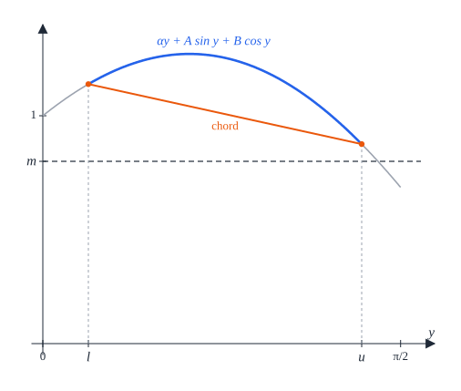
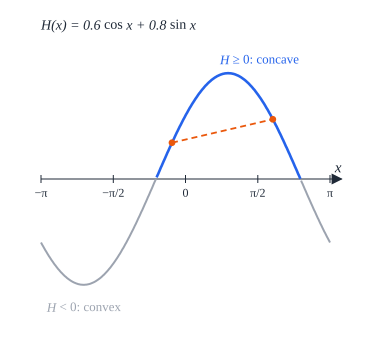
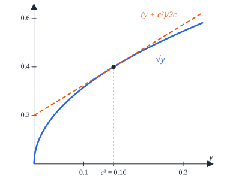

# Appendix A. One-variable estimates

[Contents](README.md) · [← 10. Seven squares](10-seven.md) · [Appendix B →](appendix-b.md)

This appendix proves the facts about functions of one real variable on which
the analysis of six and seven squares rests.

§A.1 derives monotonicity, tangent parabolas and concavity bounds from
derivatives. §A.2 compares the sine and the cosine and bounds them by their
Taylor polynomials of degrees 4 to 7. §A.3 bounds a function by its value
where its derivative changes sign. §A.4 carries concavity over to functions of
several angles, which are then positive on a box once they are positive at its
corners, and collects facts about first harmonics, the lengths of turning
forces, the square root, and small and half angles. With these tools an
inequality between functions of a few angles becomes an inequality between
polynomials on an interval or a box, settled by completing squares, by the
signs of a few factors and by comparing rational numbers. Chapters 9 and 10 and
Appendices B to I use them in this way throughout;
[Appendix F](appendix-f.md), the proof of the marker arc lemma of Chapter 10,
is a typical instance.

In Lemma A.15, $h = \frac{\sqrt2}2$, and
$\omega(t) = \frac12(|\cos t| + |\sin t|)$ and $\tau(t) = \frac12 + \omega(t)$
are the width and the threshold of
[Definition 9.9](09-six.md#definition-99-squares-in-a-frame); $\pi < \frac{22}7$
is the only bound on $\pi$ we need.

## A.1 Monotonicity and concavity

A function $f$ *has derivative* $c$ at a point $y$ if it is defined on a
neighbourhood of $y$, differentiable at $y$, and $f'(y) = c$. A function that
has a derivative at every point of an interval is continuous on it.

### Lemma A.1 (monotonicity from the derivative)

Let $f$ be a real function and $l$, $u$ real numbers.

1. If $f$ is continuous on $[l, u]$ and has a derivative $f'(y) \ge 0$ at every
   $y \in (l, u)$, then $f$ is nondecreasing on $[l, u]$.
2. If $f$ is continuous on $[l, u]$ and has a derivative $f'(y) \le 0$ at every
   $y \in (l, u)$, then $f$ is nonincreasing on $[l, u]$.
3. If $f$ is differentiable on $\mathbb R$, $f(0) = 0$ and $f'(y) \ge 0$ for
   every $y \ge 0$, then $f(x) \ge 0$ for every $x \ge 0$.

*Proof.* (1) Let $l \le x < y \le u$. By the mean value theorem there is
$\xi \in (x, y)$ with $f(y) - f(x) = f'(\xi)(y - x) \ge 0$. (2) Apply (1) to
$-f$. (3) For $x > 0$, (1) on $[0, x]$ gives $f(x) \ge f(0) = 0$. $\square$

*Lean:
[`monoOn_of_hasDeriv_nonneg`](../../SquaresInCircles/Common/Analysis.lean#L29),
[`antiOn_of_hasDeriv_nonpos`](../../SquaresInCircles/Common/Analysis.lean#L37),
[`nonneg_of_deriv_nonneg`](../../SquaresInCircles/Common/Analysis.lean#L47).*

### Lemma A.2 (tangent parabolas)

Let $l$, $u$, $\kappa$ be real numbers and $f$, $d$, $e$ real functions such
that at every $y \in [l, u]$, $f$ has derivative $d(y)$, $d$ has derivative
$e(y)$, and $e(y) \ge \kappa$. Then for all $x, t \in [l, u]$

```math
f(x) \ge f(t) + d(t)(x - t) + \tfrac\kappa2 (x - t)^2 .
```

*Proof.* Fix $t \in [l, u]$ and put

```math
g(y) = f(y) - f(t) - d(t)(y - t) - \tfrac\kappa2 (y - t)^2 , \qquad
g_1(y) = d(y) - d(t) - \kappa(y - t) .
```

At every $y \in [l, u]$, $g$ has derivative $g_1(y)$ and $g_1$ has derivative
$e(y) - \kappa \ge 0$; in particular both are continuous on $[l, u]$. By
Lemma A.1 (1), $g_1$ is nondecreasing on $[l, u]$, and $g_1(t) = 0$, so
$g_1 \le 0$ on $[l, t]$ and $g_1 \ge 0$ on $[t, u]$. By Lemma A.1 again, $g$ is
nonincreasing on $[l, t]$ and nondecreasing on $[t, u]$. As $g(t) = 0$, we get
$g \ge 0$ on $[l, u]$, and $g(x) \ge 0$ is the claim. $\square$

*Lean: [`curvature_tangent`](../../SquaresInCircles/Common/Analysis.lean#L148).*

With $\kappa = 0$, Lemma A.2 says that a function with a nonnegative second
derivative lies above its tangent lines; applied to $-f$, that a function with
a nonpositive second derivative lies below them.

### Lemma A.3 (positivity from curvature)

Let $l$, $u$, $\kappa$ be real numbers with $\kappa > 0$, and $f$, $d$, $e$ real
functions such that at every $y \in [l, u]$, $f$ has derivative $d(y)$, $d$ has
derivative $e(y)$, and $e(y) \ge \kappa$. If some $t \in [l, u]$ satisfies
$d(t)^2 < 2\kappa f(t)$, then $f(x) > 0$ for every $x \in [l, u]$.


*Figure A.1.* Lemmas A.2 and A.3. The function $f$ (blue) has second
derivative at least $\kappa$ on $[l, u]$, so it lies above its tangent parabola
of curvature $\kappa$ at $t$ (dashed). When $d(t)^2 < 2\kappa f(t)$, the lowest
value of the parabola, $f(t) - d(t)^2/2\kappa$ (green), is positive.

*Proof.* Let $x \in [l, u]$ and $s = x - t$. By Lemma A.2 and $\kappa > 0$
(Figure A.1),

```math
2\kappa f(x) \ge 2\kappa f(t) + 2\kappa d(t) s + \kappa^2 s^2
= \left(\kappa s + d(t)\right)^2 + \left(2\kappa f(t) - d(t)^2\right) > 0 . \qquad \square
```

*Lean:
[`positive_of_curvature`](../../SquaresInCircles/Common/Analysis.lean#L178).*

### Lemma A.4 (positivity from concavity)

Let $l \le u$, and let $f$, $d$, $e$ be real functions such that at every
$y \in [l, u]$, $f$ has derivative $d(y)$, $d$ has derivative $e(y)$, and
$e(y) \le 0$. If $f(l) > 0$ and $f(u) > 0$, then $f(x) > 0$ for every
$x \in [l, u]$.

*Proof.* For $x = l$ or $x = u$ there is nothing to prove, so let
$l < x < u$. By Lemma A.1 (2), $d$ is nonincreasing on $[l, u]$. By the mean
value theorem there are $\xi_1 \in (l, x)$ and $\xi_2 \in (x, u)$ with

```math
\frac{f(x) - f(l)}{x - l} = d(\xi_1) \ge d(\xi_2) = \frac{f(u) - f(x)}{u - x} .
```

Multiplying out,

```math
f(x) \ge \frac{(u - x) f(l) + (x - l) f(u)}{u - l} \ge \min\left(f(l), f(u)\right) > 0 . \qquad \square
```

*Lean:
[`positive_of_second_nonpos`](../../SquaresInCircles/Common/Analysis.lean#L139).*

### Lemma A.5 (concave trigonometric sums)

Let $\alpha$, $A$, $B$, $m$, $l$, $u$ be real numbers with $A \ge 0$, $B \ge 0$
and $0 \le l \le u \le \frac\pi2$, and put
$F(y) = \alpha y + A\sin y + B\cos y$. If $m < F(l)$ and $m < F(u)$, then
$m < F(x)$ for every $x \in [l, u]$.



*Figure A.2.* Lemmas A.4 and A.5, for $F(y) = -\frac y5 + \sin y + \cos y$,
$[l, u] = [0.2, 1.4]$ and $m = 0.8$. On $[l, u] \subset [0, \frac\pi2]$ the
function is concave, so it lies above its chord (orange); if both end values
exceed $m$, so does every value between.

*Proof.* Apply Lemma A.4 to $F - m$ (Figure A.2), with
$d(y) = \alpha + A\cos y - B\sin y$ and $e(y) = -A\sin y - B\cos y$. For
$y \in [l, u] \subset [0, \frac\pi2]$ we have $\sin y \ge 0$ and
$\cos y \ge 0$, so $e(y) \le 0$. $\square$

*Lean:
[`trig_concave_gt`](../../SquaresInCircles/Common/Trigonometry.lean#L323).*

## A.2 Sine and cosine

### Lemma A.6 (sine and cosine compared)

1. If $0 \le x \le \frac\pi4$, then $\sin x \le \cos x$.
2. If $\frac\pi4 \le x \le \frac\pi2$, then $\cos x \le \sin x$.
3. If $0 \le z \le \frac\pi3$, then $\cos z \ge \frac12$.


*Figure A.3.* Lemma A.6: on $[0, \frac\pi2]$ the sine and the cosine cross at
$\frac\pi4$, and the cosine stays at least $\frac12$ up to $\frac\pi3$.

*Proof.* The cosine is decreasing on $[0, \pi]$, and
$\sin y = \cos(\frac\pi2 - y)$ (Figure A.3). (1) Here
$0 \le x \le \frac\pi2 - x \le \pi$, so
$\sin x = \cos(\frac\pi2 - x) \le \cos x$. (2) Here
$0 \le \frac\pi2 - x \le x \le \pi$, so
$\cos x \le \cos(\frac\pi2 - x) = \sin x$. (3)
$\cos z \ge \cos\frac\pi3 = \frac12$. $\square$

*Lean:
[`sin_le_cos_of_small`](../../SquaresInCircles/Common/Trigonometry.lean#L50),
[`cos_le_sin_of_quarter`](../../SquaresInCircles/Common/Trigonometry.lean#L54),
[`cos_ge_half`](../../SquaresInCircles/Common/Trigonometry.lean#L59).*

### Lemma A.7 (Taylor bounds)

For every $x \ge 0$:

1. $\cos x \le 1 - \frac{x^2}2 + \frac{x^4}{24}$;
2. $\sin x \le x - \frac{x^3}6 + \frac{x^5}{120}$;
3. $\cos x \ge 1 - \frac{x^2}2 + \frac{x^4}{24} - \frac{x^6}{720}$;
4. $\sin x \ge x - \frac{x^3}6 + \frac{x^5}{120} - \frac{x^7}{5040}$.


*Figure A.4.* Lemma A.7 on $[0, 3.2]$: the cosine lies between its Taylor
polynomials of degrees 6 (below) and 4 (above), the sine between those of
degrees 7 (below) and 5 (above). On $[0, \frac\pi2]$ (shaded), where the
bounds are mostly used, the polynomials cannot be told apart from the
functions at this scale.

*Proof.* Consider the eight functions

```math
\begin{aligned}
g_0(x) &= 1 - \cos x , &
g_1(x) &= x - \sin x , \\
g_2(x) &= \cos x - 1 + \tfrac{x^2}2 , &
g_3(x) &= \sin x - x + \tfrac{x^3}6 , \\
g_4(x) &= 1 - \tfrac{x^2}2 + \tfrac{x^4}{24} - \cos x , &
g_5(x) &= x - \tfrac{x^3}6 + \tfrac{x^5}{120} - \sin x , \\
g_6(x) &= \cos x - 1 + \tfrac{x^2}2 - \tfrac{x^4}{24} + \tfrac{x^6}{720} , &
g_7(x) &= \sin x - x + \tfrac{x^3}6 - \tfrac{x^5}{120} + \tfrac{x^7}{5040} .
\end{aligned}
```

Up to sign, $g_k$ is the remainder of the Taylor polynomial of degree $k$ at 0
of the cosine ($k$ even) or the sine ($k$ odd). Since $\sin' = \cos$ and
$\cos' = -\sin$, each remainder has the previous one as its derivative:
$g_k' = g_{k-1}$ for $k = 1, \dots, 7$, as one checks term by term; and
$g_k(0) = 0$ for $k \ge 1$. Now $g_0 \ge 0$ everywhere, and if
$g_{k-1} \ge 0$ on $[0, \infty)$, then Lemma A.1 (3) gives $g_k \ge 0$ on
$[0, \infty)$. So $g_0, \dots, g_7 \ge 0$ on $[0, \infty)$. For $k \le 3$ these
are the classical bounds $\sin x \le x$, $\cos x \ge 1 - \frac{x^2}2$ and
$\sin x \ge x - \frac{x^3}6$; $g_4, g_5, g_6, g_7 \ge 0$ are (1) to (4)
(Figure A.4). $\square$

*Lean: [`cos_upper_four`](../../SquaresInCircles/Common/Trigonometry.lean#L200),
[`sin_upper_five`](../../SquaresInCircles/Common/Trigonometry.lean#L207),
[`cos_lower_six`](../../SquaresInCircles/Common/Trigonometry.lean#L214),
[`sin_lower_seven`](../../SquaresInCircles/Common/Trigonometry.lean#L221).*

Both sides of (1) and (3) are even functions of $x$, so these two bounds hold
for every real $x$.

### Lemma A.8 (polynomial brackets)

Let $0 \le l \le u \le \frac\pi2$ and $x \in [l, u]$. Then

```math
l - \tfrac{l^3}6 + \tfrac{l^5}{120} - \tfrac{l^7}{5040} \le \sin x \le u - \tfrac{u^3}6 + \tfrac{u^5}{120} ,
\qquad
1 - \tfrac{u^2}2 + \tfrac{u^4}{24} - \tfrac{u^6}{720} \le \cos x \le 1 - \tfrac{l^2}2 + \tfrac{l^4}{24} .
```

*Proof.* The sine is increasing on $[-\frac\pi2, \frac\pi2] \supset [l, u]$ and
the cosine decreasing on $[0, \pi] \supset [l, u]$, so
$\sin l \le \sin x \le \sin u$ and $\cos u \le \cos x \le \cos l$. Now apply
Lemma A.7 (4) at $l$, (2) at $u$, (3) at $u$ and (1) at $l$. $\square$

*Lean: [`trig_bracket`](../../SquaresInCircles/Common/Trigonometry.lean#L229).*

## A.3 A peak

### Lemma A.9 (a peak)

Let $l \le c \le u$, and let $f$, $d$ be real functions such that $f$ has
derivative $d(y)$ at every real $y$, with $d(y) \ge 0$ for $y \in [l, c]$ and
$d(y) \le 0$ for $y \in [c, u]$. Then $f(x) \le f(c)$ for every
$x \in [l, u]$.


*Figure A.5.* Lemma A.9 for $f(y) = \frac{y^3}3 - \frac{y^4}4$ on
$[l, u] = [-0.35, 1.25]$ and $c = 1$. The derivative $d(y) = y^2(1 - y)$
(below) is nonnegative on $[l, c]$ (green), where it vanishes at $y = 0$, and
nonpositive on $[c, u]$ (orange). So $f$ (above) rises up to $c$, with a flat
point at 0, falls after it, and stays below its value at $c$ (dashed),
although it is not concave.

*Proof.* As $f$ has a derivative everywhere, it is continuous. Let
$x \in [l, u]$. If $x \le c$, then $f$ is nondecreasing on $[l, c]$ by
Lemma A.1 (1), so $f(x) \le f(c)$. If $x \ge c$, then $f$ is nonincreasing on
$[c, u]$ by Lemma A.1 (2), so again $f(x) \le f(c)$ (Figure A.5). $\square$

*Lean: [`le_at_peak`](../../SquaresInCircles/Common/Analysis.lean#L54).*

In use, $d(y)$ is a product of factors of constant sign on $[l, u]$ and one
affine factor that vanishes at $c$; Lemma F.5 is an example (Figure F.7).

## A.4 Concave functions and harmonics

A function $f$ is *concave* on an interval $[l, u]$ if
$f((1 - \lambda)x + \lambda y) \ge (1 - \lambda)f(x) + \lambda f(y)$ for all
$x, y \in [l, u]$ and $\lambda \in [0, 1]$: its graph lies above its chords.
Lemma A.4 shows that a function with a nonpositive second derivative is
positive once its two end values are; the next lemma shows this for every
concave function and carries it over to rectangles. Most estimates of
Appendices B to E use it to reduce a function of several angles to its values
at the corners of a box.

### Lemma A.10 (concave functions)

Let $l \le u$.

1. If $f$ has a derivative $f'(x)$ at every $x \in [l, u]$, and $f'$ has a
   derivative $f''(x) \le 0$ at every $x \in [l, u]$, then $f$ is concave on
   $[l, u]$.
2. If $f$ is concave on $[l, u]$, $f(l) > m$ and $f(u) > m$, then $f(x) > m$
   for every $x \in [l, u]$.
3. Sums of functions concave on $[l, u]$, and their products with nonnegative
   numbers, are concave there; affine functions are concave on every interval;
   and if $f$ is concave on $[L, U]$ and $x \mapsto \alpha x + \beta$ maps
   $[l, u]$ into $[L, U]$, then $x \mapsto f(\alpha x + \beta)$ is concave on
   $[l, u]$.
4. Let $f$ be a function on the rectangle $[l, u] \times [L, U]$ such that
   $x \mapsto f(x, y)$ is concave on $[l, u]$ for every $y \in [L, U]$, and
   $y \mapsto f(l, y)$ and $y \mapsto f(u, y)$ are concave on $[L, U]$. If $f$
   is positive at the four corners of the rectangle, it is positive on all of
   it.

*Proof.* (1) By [Lemma A.1](#lemma-a1-monotonicity-from-the-derivative) (2),
$f'$ is nonincreasing on $[l, u]$. Let $x < z < y$ in $[l, u]$. By the mean
value theorem there are $\xi_1 \in (x, z)$ and $\xi_2 \in (z, y)$ with

```math
\frac{f(z) - f(x)}{z - x} = f'(\xi_1) \ge f'(\xi_2) = \frac{f(y) - f(z)}{y - z} ,
```

and multiplying out gives $f(z) \ge \frac{y - z}{y - x}f(x) + \frac{z - x}{y - x}f(y)$,
which is the chord inequality at $z = (1 - \lambda)x + \lambda y$.

(2) Write $x = (1 - \lambda)l + \lambda u$ with $\lambda \in [0, 1]$; then
$f(x) \ge (1 - \lambda)f(l) + \lambda f(u) \ge \min(f(l), f(u)) > m$.

(3) The chord inequality is preserved by sums and by nonnegative multiples, is
an equality for affine functions, and is carried over by the affine
substitution, since
$\alpha((1 - \lambda)x + \lambda y) + \beta = (1 - \lambda)(\alpha x + \beta) + \lambda(\alpha y + \beta)$.

(4) Let $(x, y)$ be in the rectangle. By (2) on the two edges, $f(l, y) > 0$
and $f(u, y) > 0$; by (2) again, along the segment from $(l, y)$ to $(u, y)$,
$f(x, y) > 0$ (Figure A.6). $\square$

*Lean: [`concave_of_deriv2`](../../SquaresInCircles/Common/Analysis.lean#L69),
[`concave_gt_of_endpoints`](../../SquaresInCircles/Common/Analysis.lean#L81),
[`affine_concave`](../../SquaresInCircles/Common/Analysis.lean#L118),
[`concave_affine_argument`](../../SquaresInCircles/Common/Analysis.lean#L107),
[`positive_on_separately_concave_rectangle`](../../SquaresInCircles/Common/Analysis.lean#L127),
[`monoOn_of_hasDeriv_nonneg`](../../SquaresInCircles/Common/Analysis.lean#L29),
[`antiOn_of_hasDeriv_nonpos`](../../SquaresInCircles/Common/Analysis.lean#L37).*

In use, (4) is applied one variable at a time: a function of three angles that
is concave in each of them on a box is positive once it is positive at the
eight corners.


*Figure A.6.* Lemma A.10 (4) for $f(x, y) = \frac{27}{20} - X^2 - Y^2 + 3XY$,
with $X = x - \frac12$ and $Y = y - \frac12$, on
$[l, u] \times [L, U] = [0, 1]^2$. It is concave in $x$ and in $y$ but not
concave: its level curves, at $0.25, 0.5, \dots, 1.5$, show a saddle at the
centre. It is positive at the four corners, so on the two vertical edges
(blue), and then along every horizontal segment (dashed). Right, along
$y = 0.7$: $f$ lies above its chord, from $f(l, 0.7) = 0.76$ to
$f(u, 0.7) = 1.36$.

### Lemma A.11 (first harmonics)

For real numbers $A$ and $B$ let $H(x) = A\cos x + B\sin x$, a *first
harmonic*.

1. $H'' = -H$. So $H$ is concave on every interval on which $H \ge 0$, and so
   is $K + H$ for every constant $K$.
2. If $A, B \ge 0$, then $H \ge 0$ on $[0, \frac\pi2]$. Hence, for every
   constant $K$ and every interval $[l, u] \subseteq [0, \frac\pi2]$: if
   $K + H(l) > 0$ and $K + H(u) > 0$, then $K + H(x) > 0$ for every
   $x \in [l, u]$.

*Proof.* (1) $H' = -A\sin x + B\cos x$ and $H'' = -A\cos x - B\sin x = -H$;
where $H \ge 0$, $H'' \le 0$, and Lemma A.10 (1) applies. (2) On
$[0, \frac\pi2]$ both $\cos x$ and $\sin x$ are nonnegative, so $H \ge 0$
there, and $K + H$ is concave on $[l, u]$ by (1); Lemma A.10 (2) with $m = 0$
gives the rest, which is also the case $\alpha = 0$ of Lemma A.5. $\square$

*Lean: [`harmonic`](../../SquaresInCircles/Common/Trigonometry.lean#L299),
[`harmonic_hasDerivAt`](../../SquaresInCircles/Common/Trigonometry.lean#L302),
[`harmonic_concave`](../../SquaresInCircles/Common/Trigonometry.lean#L315),
[`harmonic_nonneg`](../../SquaresInCircles/Common/Trigonometry.lean#L309),
[`harmonic_pos_of_endpoints`](../../SquaresInCircles/Common/Trigonometry.lean#L340),
[`trig_concave_gt`](../../SquaresInCircles/Common/Trigonometry.lean#L323).*

A typical use: a weighted sum of separating inequalities, after the supports
of the squares, leaves a function of an angle $x$ of the form
$K + A\cos x + B\sin x$, plus terms in other angles; when $A, B \ge 0$ and
$x$ ranges over an interval of $[0, \frac\pi2]$, it suffices to check its two
end values (Figure A.7).



*Figure A.7.* Lemma A.11 for the first harmonic
$H(x) = 0.6\cos x + 0.8\sin x$: it is concave where it is nonnegative (blue),
so there it lies above its chords (dashed), and convex where it is negative
(grey).

### Lemma A.12 (a harmonic less a radical)

Let $A$, $B$, $p$, $q$, $R$ be real numbers with $R \ge 0$ and $q^2 \le p^2$,
and let $[l, u]$ be an interval on which $p + q\sin x > 0$ and

```math
R\sqrt{p + q\sin x} \le 4\left(A\cos x + B\sin x\right) .
```

Then $f(x) = A\cos x + B\sin x - R\sqrt{p + q\sin x}$ is concave on $[l, u]$.

*Proof.* Put $r(x) = \sqrt{p + q\sin x} > 0$, so that $r^2 = p + q\sin x$ and
$r' = \frac{q\cos x}{2r}$. Differentiating again,

```math
r'' = -\frac{q\sin x}{2r} - \frac{q^2\cos^2 x}{4r^3}
= \frac{-2q\sin x\, r^2 - q^2(1 - \sin^2 x)}{4r^3}
= \frac{-r^4 + p^2 - q^2}{4r^3} = -\frac r4 + \frac{p^2 - q^2}{4r^3} ,
```

where the third step substitutes $q\sin x = r^2 - p$:
$-2(r^2 - p)r^2 - q^2 + (r^2 - p)^2 = -r^4 + p^2 - q^2$. So

```math
f'' = -\left(A\cos x + B\sin x\right) + \frac R4 r - R\,\frac{p^2 - q^2}{4r^3} \le -\left(A\cos x + B\sin x\right) + \frac R4 r \le 0
```

on $[l, u]$, by $R \ge 0$, $q^2 \le p^2$ and the hypothesis. Lemma A.10 (1)
applies. $\square$

*Lean: [`radicalTrig`](../../SquaresInCircles/Common/Trigonometry.lean#L350),
[`radical_second_identity`](../../SquaresInCircles/Common/Trigonometry.lean#L353),
[`radical_second_derivative`](../../SquaresInCircles/Common/Trigonometry.lean#L369),
[`radicalTrig_concave`](../../SquaresInCircles/Common/Trigonometry.lean#L391).*

The radical is the length of a force that turns with $x$: a force
$(\alpha + \gamma\sin x, \gamma\cos x)$ has length
$\sqrt{\alpha^2 + \gamma^2 + 2\alpha\gamma\sin x}$, with
$p = \alpha^2 + \gamma^2$ and $q = 2\alpha\gamma$, so that $q^2 \le p^2$.
Multiplied by a radius, it enters the far-vertex support of
[Lemma 9.25](09-six.md#lemma-925-supports-of-a-square-in-a-disk) (1).

### Lemma A.13 (a turning vector)

Let $a, b \ge 0$ with $a + b > 0$, and let $P$, $Q$, $T$ be real numbers with
$P = a^2 + b^2$ and $Q^2 + T^2 = 4a^2b^2$. Put
$\Lambda(x) = P + Q\cos x + T\sin x$, the squared length of the sum of a
constant vector of length $a$ and a vector of length $b$ that turns with $x$
(Figure A.8), and let $R \ge 0$.

1. $(a - b)^2 \le \Lambda(x) \le (a + b)^2$ for every $x$.
2. Where $\Lambda(x) > 0$, the function $g = -R\sqrt\Lambda$ has the second
   derivative

   ```math
   g''(x) = R\,\frac{L^4 - (a^2 - b^2)^2}{4L^3} \le R\,\frac{ab}{a + b}, \qquad L = \sqrt{\Lambda(x)} .
   ```

3. If moreover $a \le b$ and $Q\cos x + T\sin x \le -2a^2$, then
   $g''(x) \le 0$.

*Proof.* (1) $(Q\cos x + T\sin x)^2 + (-Q\sin x + T\cos x)^2 = Q^2 + T^2 = 4a^2b^2$,
so $|Q\cos x + T\sin x| \le 2ab$.

(2) Write $z = Q\cos x + T\sin x$, so that $\Lambda = P + z$,
$\Lambda' = -Q\sin x + T\cos x$ and $\Lambda'' = -z$. The second derivative of
$-R\sqrt\Lambda$ is
$R\,\frac{\Lambda'^2 - 2\Lambda\Lambda''}{4\Lambda\sqrt\Lambda}$, and

```math
\Lambda'^2 - 2\Lambda\Lambda'' = \left(Q^2 + T^2 - z^2\right) + 2(P + z)z = z^2 + 2Pz + Q^2 + T^2 = (P + z)^2 - \left(P^2 - Q^2 - T^2\right) = L^4 - (a^2 - b^2)^2 ,
```

as $P^2 - 4a^2b^2 = (a^2 - b^2)^2$. For the bound, by (1) $L \le a + b$, and

```math
4abL^3 - (a + b)\left(L^4 - (a^2 - b^2)^2\right) = (a + b - L)\left((a + b)L^3 + (a - b)^2L^2 + (a + b)(a - b)^2L + (a + b)^2(a - b)^2\right) \ge 0 ,
```

as one checks by expanding; divide by $4(a + b)L^3$ and multiply by $R$.

(3) Here $z^2 + 2Pz + Q^2 + T^2 = (z + 2a^2)(z + 2b^2)$, since
$2a^2 + 2b^2 = 2P$ and $4a^2b^2 = Q^2 + T^2$. The first factor is at most 0 by
hypothesis, and the second is at least 0, because $z \ge -2ab \ge -2b^2$ for
$a \le b$. $\square$

*Lean: [`harmonicArg`](../../SquaresInCircles/Common/Trigonometry.lean#L447),
[`harmonicRoot`](../../SquaresInCircles/Common/Trigonometry.lean#L450),
[`harmonicCurvature`](../../SquaresInCircles/Common/Trigonometry.lean#L457),
[`harmonicRoot_second`](../../SquaresInCircles/Common/Trigonometry.lean#L475),
[`harmonic_amplitude_bound`](../../SquaresInCircles/Common/Trigonometry.lean#L502),
[`harmonic_length_bound`](../../SquaresInCircles/Common/Trigonometry.lean#L520),
[`rotating_length_factor`](../../SquaresInCircles/Common/Trigonometry.lean#L533),
[`harmonicCurvature_le_harmonic_mean`](../../SquaresInCircles/Common/Trigonometry.lean#L539),
[`harmonic_mean_mono`](../../SquaresInCircles/Common/Trigonometry.lean#L571),
[`harmonicCurvature_nonpos_of_opposition`](../../SquaresInCircles/Common/Trigonometry.lean#L582).*

![Left: from o, a constant vector of length a = 2/5 and, from its tip, a vector of length b = 1 turned by the angle x; the tip of their sum runs on the dashed circle of radius b, and its distance L from o is drawn thick. The part of the circle behind the dotted line through o perpendicular to the constant vector is orange. Right: L as a function of x on minus pi to pi, between b - a and a + b; a dashed green parabola touches its peak from below, and the curve is orange where L is at most the square root of b squared minus a squared](figures/appendix-a/turning.svg)

*Figure A.8.* Lemma A.13 for a constant vector of length $a = \frac25$ and a
turning vector of length $b = 1$:
$\Lambda(x) = \frac{29}{25} + \frac45\cos x$. Left: the tip of the sum runs on
the circle of radius $b$ about the tip of the constant vector, so its length
$L$ lies between $b - a$ and $a + b$, which is (1). Right: $L$ as a function of
$x$. The parabola $a + b - \frac{ab}{2(a + b)}x^2$ (dashed) touches it at its
peak and stays below it, as (2) bounds the second derivative of $-RL$ by
$R\frac{ab}{a + b}$. Where $L \le \sqrt{b^2 - a^2}$ (orange), that is, where
the tip lies behind the line through $o$ perpendicular to the constant vector
(dotted, left), $L$ is convex and $-RL$ concave, which is (3).

### Lemma A.14 (tangents of the square root)

For $c > 0$ and $y \ge 0$, $\sqrt y \le \frac{y + c^2}{2c}$, with equality
only for $y = c^2$. For every real $y$, $y \le \left(\frac{y + c^2}{2c}\right)^2$.

*Proof.* $y + c^2 - 2c\sqrt y = (\sqrt y - c)^2 \ge 0$, and
$(y + c^2)^2 - 4c^2y = (y - c^2)^2 \ge 0$. $\square$

*Lean:
[`sqrt_le_tangent`](../../SquaresInCircles/Common/Trigonometry.lean#L609),
[`sq_le_tangent_sq`](../../SquaresInCircles/Common/Trigonometry.lean#L614).*

The square root is concave, and the right side is its tangent at $c^2$
(Figure A.9). The estimates use it to replace the length of a force, the
square root of an affine function of one sine, by an affine function of that
sine; the point $c^2$ is chosen near the squared length that matters.



*Figure A.9.* Lemma A.14: the square root (blue) lies below its tangent
$\frac{y + c^2}{2c}$ at $c^2$ (dashed), here for $c = \frac25$, the tangent
that §B.5 uses for the length of a force.

### Lemma A.15 (small angles)

1. If $|t| \le r$, then $\cos t \ge 1 - \frac{r^2}2$ and $|\sin t| \le r$.
2. $|\cos t| + |\sin t| \ge 1$ for every real $t$; so $\omega(t) \ge \frac12$
   and $\tau(t) \ge 1$. Moreover $\omega(t) \ge \frac12(\cos t + \sin t)$, and
   $\omega(t)$ does not change when $t$ is replaced by $-t$, $\pi + t$,
   $\frac\pi2 + t$ or $\frac\pi2 - t$.
3. If $0 \le t \le \frac\pi4$, then $\frac7{10} \le \cos t$ and
   $0 \le \sin t \le \cos t$; and $\cos t + \sin t$ is nondecreasing on
   $[0, \frac\pi4]$.
4. If $|t| \le \pi$, then $\cos t \le 1 - \frac{t^2}5$.

*Proof.* (1) $\cos t \ge 1 - \frac{t^2}2$ and $|\sin t| \le |t|$ for every
real $t$ (Lemma A.7). (2) $(|\cos t| + |\sin t|)^2 = 1 + 2|\cos t\sin t| \ge 1$;
the other claims follow from $|x| \ge x$ and from the formulas for
$\cos$ and $\sin$ of $-t$, $\pi + t$, $\frac\pi2 \pm t$, which permute
$|\cos t|$ and $|\sin t|$. (3) The cosine decreases from 1 to $h > \frac7{10}$
on $[0, \frac\pi4]$, and $\sin t \le \cos t$ is
[Lemma A.6](#lemma-a6-sine-and-cosine-compared) (1); the derivative
$\cos t - \sin t$ of $\cos t + \sin t$ is nonnegative there. (4) Both sides
are even, so let $0 \le t \le \pi$. Then $1 - \cos t = 2\sin^2\frac t2$, and
on $[0, \frac\pi2]$ the sine is concave (Lemma A.10 (1): its second
derivative $-\sin$ is nonpositive there), so it lies above its chord from $0$
to $\frac\pi2$: $\sin x \ge \frac2\pi x$. With $x = \frac t2$,
$1 - \cos t \ge \frac{2t^2}{\pi^2} \ge \frac{t^2}5$, since
$\pi^2 < (\frac{22}7)^2 < 10$ (Figure A.10). $\square$

*Lean: [`small_angle`](../../SquaresInCircles/Common/Trigonometry.lean#L100),
[`small_angle_nonneg`](../../SquaresInCircles/Common/Trigonometry.lean#L109),
[`one_le_abs_cos_add_abs_sin`](../../SquaresInCircles/Common/Trigonometry.lean#L89),
[`angularWidth_lower`](../../SquaresInCircles/Common/SeparatingAxes.lean#L276),
[`angularWidth_neg`](../../SquaresInCircles/Common/SeparatingAxes.lean#L258),
[`angularWidth_pi_add`](../../SquaresInCircles/Common/SeparatingAxes.lean#L261),
[`angularWidth_half_pi_add`](../../SquaresInCircles/Common/SeparatingAxes.lean#L264),
[`angularWidth_half_pi_sub`](../../SquaresInCircles/Common/SeparatingAxes.lean#L267),
[`east_quadrant_trig`](../../SquaresInCircles/Common/Trigonometry.lean#L64),
[`cos_add_sin_mono`](../../SquaresInCircles/Common/Trigonometry.lean#L79),
[`cos_le_one_sub_fifth_sq`](../../SquaresInCircles/Common/Trigonometry.lean#L116).*


*Figure A.10.* Lemma A.15. Left, (2): the width $\omega(t)$ has period
$\frac\pi2$ and lies between $\frac12$ and $h$; it is at least
$\frac12(\cos t + \sin t)$ (dashed), with equality on $[0, \frac\pi2]$.
Right, (1) and (4): on $[-\pi, \pi]$ the cosine lies between $1 - \frac{t^2}2$
and $1 - \frac{t^2}5$; at $\pm\pi$ the upper parabola is
$1 - \frac{\pi^2}5 \approx -0.974$, just above $-1$.

### Lemma A.16 (half angles)

Let $0 \le t \le \frac45$.

1. $\frac{17}{25} \le \cos t$, $\frac{89}{100}t \le \sin t \le t$ and
   $1 + \frac{12}{25}t \le \cos t + \sin t$.
2. The number $\tan\frac t2 = \frac{\sin t}{1 + \cos t}$ satisfies
   $\tan\frac t2\,(1 + \cos t) = \sin t$ and $\tan\frac t2\,\sin t = 1 - \cos t$,
   and $\frac t2 \le \tan\frac t2 \le \frac{11}{20}t$.
3. For every real $d$,
   $\sin(d - t) + \tan\frac t2\,\cos(d - t) = \sin d - \tan\frac t2\,\cos d$.
4. If $0 \le q \le t$, then $\cos q - \cos t \ge \frac{89}{200}(t^2 - q^2)$.

*Proof.* (1) From $\cos t \ge 1 - \frac{t^2}2$, $\sin t \ge t - \frac{t^3}6$
and $\sin t \le t$, with $t^2 \le \frac{16}{25}$:
$1 - \frac{t^2}2 \ge \frac{17}{25}$, $1 - \frac{t^2}6 \ge \frac{89}{100}$, and
$\cos t + \sin t - 1 \ge t(1 - \frac t2 - \frac{t^2}6) \ge \frac{12}{25}t$,
since $1 - \frac25 - \frac{8}{75} > \frac{12}{25}$.

(2) The identities follow from $\sin^2 t = (1 - \cos t)(1 + \cos t)$
(Figure A.11). For the lower bound, $F(x) = 2\sin x - x(1 + \cos x)$ has
$F(0) = 0$ and $F'(x) = \cos x - 1 + x\sin x$, which vanishes at 0 and has the
derivative $x\cos x \ge 0$ on $[0, \frac45]$; so $F' \ge 0$ and $F \ge 0$ there
([Lemma A.1](#lemma-a1-monotonicity-from-the-derivative)), which is
$\tan\frac t2 \ge \frac t2$. For the upper bound, by
$\cos t \ge 1 - \frac{t^2}2$ and Lemma A.7 (2),

```math
\tfrac{11}{20}t(1 + \cos t) - \sin t \ge \tfrac{11}{20}t\left(2 - \tfrac{t^2}2\right) - t + \tfrac{t^3}6 - \tfrac{t^5}{120} = t\left(\tfrac1{10} - \tfrac{13}{120}t^2 - \tfrac{t^4}{120}\right) \ge 0 ,
```

as $\frac{13}{120}\cdot\frac{16}{25} + \frac1{120}\cdot\frac{256}{625} < \frac1{10}$.

(3) Expand $\sin(d - t)$ and $\cos(d - t)$ and use the two identities of (2).

(4) $x \mapsto \cos x + \frac{89}{200}x^2$ has the derivative
$-\sin x + \frac{89}{100}x \le 0$ on $[0, \frac45]$, by (1); so it is
nonincreasing there, and its values at $q \le t$ compare as claimed. $\square$

*Lean:
[`small_polynomial_trig`](../../SquaresInCircles/Common/Trigonometry.lean#L621),
[`halfRatio`](../../SquaresInCircles/Common/Trigonometry.lean#L619),
[`halfRatio_identities`](../../SquaresInCircles/Common/Trigonometry.lean#L640),
[`halfRatio_lower`](../../SquaresInCircles/Common/Trigonometry.lean#L650),
[`halfRatio_upper`](../../SquaresInCircles/Common/Trigonometry.lean#L680),
[`halfRatio_shift`](../../SquaresInCircles/Common/Trigonometry.lean#L709),
[`cosine_difference_lower`](../../SquaresInCircles/Common/Trigonometry.lean#L694).*


*Figure A.11.* Lemma A.16 (2) for $t = \frac45$. Left: the chord from
$(-1, 0)$ to $u(t)$ (blue) has the slope
$\frac{\sin t}{1 + \cos t} = \tan\frac t2$ and crosses the vertical line
through $o$ at the height $\tan\frac t2$ (green); the chord from $u(t)$ to
$(1, 0)$ (orange) is perpendicular to it, which is
$\tan\frac t2\,\sin t = 1 - \cos t$. Right: $\tan\frac t2 / t$ rises from
$\frac12$ and stays below $\frac{11}{20}$ on $(0, \frac45]$ (dashed), which is
$\frac t2 \le \tan\frac t2 \le \frac{11}{20}t$.
