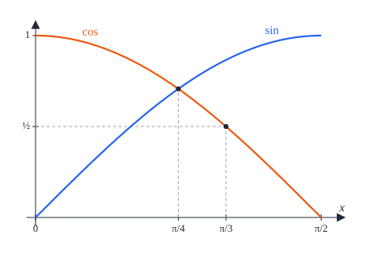
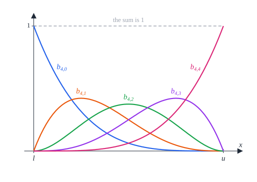

# Appendix A. One-variable estimates and the marker arc

[Contents](README.md) · [← 9. Seven squares](seven.md) · [Appendix B →](appendix-b.md)

This appendix proves the facts about functions of one real variable on which
the analysis of seven squares rests, and then uses them to prove the marker
arc lemma of [Chapter 9](seven.md), [Lemma 9.9](seven.md#lemma-99-the-marker-arc).

§A.1 derives monotonicity, tangent parabolas and concavity bounds from
derivatives. §A.2 compares the sine and the cosine and bounds them by their
Taylor polynomials of degrees 4 to 7. §A.3 proves that a polynomial whose
coefficients in the Bernstein basis of an interval are all positive is
positive on that interval. With these tools an inequality between functions of
one angle becomes an inequality between polynomials on an interval, and that
becomes a finite list of rational numbers to check. Chapter 9 and Appendices B
to D use them in this way throughout. §A.4 proves the marker arc lemma, a
typical instance: it needs all three tools, together with the elementary
estimates of [Lemma 3.29](common.md#lemma-329-elementary-estimates).

We use the conventions of §2.1: in particular $\arcsin$ is extended to all of
$\mathbb R$ (it is odd and nondecreasing) and
$\arccos x = \frac\pi2 - \arcsin x$. Of the classical bounds on $\pi$ we only
need $\pi > 3.14$.

## A.1 Monotonicity and concavity

A function $f$ *has derivative* $c$ at a point $y$ if it is defined on a
neighbourhood of $y$, differentiable at $y$, and $f'(y) = c$. A function that
has a derivative at every point of an interval is continuous on it.

### Lemma A.1 (monotonicity from the derivative)

Let $f$ be a real function and $l$, $u$ real numbers.

1. If $f$ is continuous on $[l, u]$ and has a derivative $f'(y) \ge 0$ at every
   $y \in (l, u)$, then $f$ is nondecreasing on $[l, u]$.
2. If $f$ is continuous on $[l, u]$ and has a derivative $f'(y) \le 0$ at every
   $y \in (l, u)$, then $f$ is nonincreasing on $[l, u]$.
3. If $f$ is differentiable on $\mathbb R$, $f(0) = 0$ and $f'(y) \ge 0$ for
   every $y \ge 0$, then $f(x) \ge 0$ for every $x \ge 0$.

*Proof.* (1) Let $l \le x < y \le u$. By the mean value theorem there is
$\xi \in (x, y)$ with $f(y) - f(x) = f'(\xi)(y - x) \ge 0$. (2) Apply (1) to
$-f$. (3) For $x > 0$, (1) on $[0, x]$ gives $f(x) \ge f(0) = 0$. $\square$

*Lean:
[`Seven.monoOn_of_hasDeriv_nonneg`](../../SquaresInCircles/Seven/Analysis.lean#L17),
[`Seven.antiOn_of_hasDeriv_nonpos`](../../SquaresInCircles/Seven/Analysis.lean#L25),
[`Seven.nonneg_of_deriv_nonneg`](../../SquaresInCircles/Seven/Analysis.lean#L124).*

### Lemma A.2 (tangent parabolas)

Let $l$, $u$, $\kappa$ be real numbers and $f$, $d$, $e$ real functions such
that at every $y \in [l, u]$, $f$ has derivative $d(y)$, $d$ has derivative
$e(y)$, and $e(y) \ge \kappa$. Then for all $x, t \in [l, u]$

```math
f(x) \ge f(t) + d(t)(x - t) + \tfrac\kappa2 (x - t)^2 .
```

*Proof.* Fix $t \in [l, u]$ and put

```math
h(y) = f(y) - f(t) - d(t)(y - t) - \tfrac\kappa2 (y - t)^2 , \qquad
h_1(y) = d(y) - d(t) - \kappa(y - t) .
```

At every $y \in [l, u]$, $h$ has derivative $h_1(y)$ and $h_1$ has derivative
$e(y) - \kappa \ge 0$; in particular both are continuous on $[l, u]$. By
Lemma A.1 (1), $h_1$ is nondecreasing on $[l, u]$, and $h_1(t) = 0$, so
$h_1 \le 0$ on $[l, t]$ and $h_1 \ge 0$ on $[t, u]$. By Lemma A.1 again, $h$ is
nonincreasing on $[l, t]$ and nondecreasing on $[t, u]$. As $h(t) = 0$, we get
$h \ge 0$ on $[l, u]$, and $h(x) \ge 0$ is the claim. $\square$

*Lean:
[`Seven.curvature_tangent`](../../SquaresInCircles/Seven/Analysis.lean#L35).*

With $\kappa = 0$, Lemma A.2 says that a function with a nonnegative second
derivative lies above its tangent lines; applied to $-f$, that a function with
a nonpositive second derivative lies below them.

### Lemma A.3 (positivity from curvature)

Let $l$, $u$, $\kappa$ be real numbers with $\kappa > 0$, and $f$, $d$, $e$ real
functions such that at every $y \in [l, u]$, $f$ has derivative $d(y)$, $d$ has
derivative $e(y)$, and $e(y) \ge \kappa$. If some $t \in [l, u]$ satisfies
$d(t)^2 < 2\kappa f(t)$, then $f(x) > 0$ for every $x \in [l, u]$.


*Figure A.1.* Lemmas A.2 and A.3. The function $f$ (blue) has second
derivative at least $\kappa$ on $[l, u]$, so it lies above its tangent parabola
of curvature $\kappa$ at $t$ (dashed). When $d(t)^2 < 2\kappa f(t)$, the lowest
value of the parabola, $f(t) - d(t)^2/2\kappa$ (green), is positive.

*Proof.* Let $x \in [l, u]$ and $s = x - t$. By Lemma A.2 and $\kappa > 0$,

```math
2\kappa f(x) \ge 2\kappa f(t) + 2\kappa d(t) s + \kappa^2 s^2
= \left(\kappa s + d(t)\right)^2 + \left(2\kappa f(t) - d(t)^2\right) > 0 . \qquad \square
```

*Lean:
[`Seven.positive_of_curvature`](../../SquaresInCircles/Seven/Analysis.lean#L65).*

### Lemma A.4 (positivity from concavity)

Let $l \le u$, and let $f$, $d$, $e$ be real functions such that at every
$y \in [l, u]$, $f$ has derivative $d(y)$, $d$ has derivative $e(y)$, and
$e(y) \le 0$. If $f(l) > 0$ and $f(u) > 0$, then $f(x) > 0$ for every
$x \in [l, u]$.

*Proof.* For $x = l$ or $x = u$ there is nothing to prove, so let
$l < x < u$. By Lemma A.1 (2), $d$ is nonincreasing on $[l, u]$. By the mean
value theorem there are $\xi_1 \in (l, x)$ and $\xi_2 \in (x, u)$ with

```math
\frac{f(x) - f(l)}{x - l} = d(\xi_1) \ge d(\xi_2) = \frac{f(u) - f(x)}{u - x} .
```

Multiplying out,

```math
f(x) \ge \frac{(u - x) f(l) + (x - l) f(u)}{u - l} \ge \min\left(f(l), f(u)\right) > 0 . \qquad \square
```

*Lean:
[`Seven.positive_of_second_nonpos`](../../SquaresInCircles/Seven/Analysis.lean#L74).*

### Lemma A.5 (concave trigonometric sums)

Let $\alpha$, $A$, $B$, $m$, $l$, $u$ be real numbers with $A \ge 0$, $B \ge 0$
and $0 \le l \le u \le \frac\pi2$, and put
$F(y) = \alpha y + A\sin y + B\cos y$. If $m < F(l)$ and $m < F(u)$, then
$m < F(x)$ for every $x \in [l, u]$.


*Figure A.2.* Lemmas A.4 and A.5, for $F(y) = -\frac y5 + \sin y + \cos y$. On
$[l, u] \subset [0, \frac\pi2]$ the function is concave, so it lies above its
chord (orange); if both end values exceed $m$, so does every value between.

*Proof.* Apply Lemma A.4 to $F - m$, with $d(y) = \alpha + A\cos y - B\sin y$
and $e(y) = -A\sin y - B\cos y$. For $y \in [l, u] \subset [0, \frac\pi2]$ we
have $\sin y \ge 0$ and $\cos y \ge 0$, so $e(y) \le 0$. $\square$

*Lean:
[`Seven.trig_concave_gt`](../../SquaresInCircles/Seven/Analysis.lean#L94).*

## A.2 Sine and cosine

### Lemma A.6 (sine and cosine compared)

1. If $0 \le x \le \frac\pi4$, then $\sin x \le \cos x$.
2. If $\frac\pi4 \le x \le \frac\pi2$, then $\cos x \le \sin x$.
3. If $0 \le z \le \frac\pi3$, then $\cos z \ge \frac12$.



*Figure A.3.* Lemma A.6: on $[0, \frac\pi2]$ the sine and the cosine cross at
$\frac\pi4$, and the cosine stays at least $\frac12$ up to $\frac\pi3$.

*Proof.* The cosine is decreasing on $[0, \pi]$, and
$\sin y = \cos(\frac\pi2 - y)$. (1) Here $0 \le x \le \frac\pi2 - x \le \pi$,
so $\sin x = \cos(\frac\pi2 - x) \le \cos x$. (2) Here
$0 \le \frac\pi2 - x \le x \le \pi$, so
$\cos x \le \cos(\frac\pi2 - x) = \sin x$. (3)
$\cos z \ge \cos\frac\pi3 = \frac12$. $\square$

*Lean:
[`Seven.sin_le_cos_of_small`](../../SquaresInCircles/Seven/Analysis.lean#L109),
[`Seven.cos_le_sin_of_quarter`](../../SquaresInCircles/Seven/Analysis.lean#L113),
[`Seven.cos_ge_half`](../../SquaresInCircles/Seven/Analysis.lean#L118).*

### Lemma A.7 (Taylor bounds)

For every $x \ge 0$:

1. $\cos x \le 1 - \frac{x^2}2 + \frac{x^4}{24}$;
2. $\sin x \le x - \frac{x^3}6 + \frac{x^5}{120}$;
3. $\cos x \ge 1 - \frac{x^2}2 + \frac{x^4}{24} - \frac{x^6}{720}$;
4. $\sin x \ge x - \frac{x^3}6 + \frac{x^5}{120} - \frac{x^7}{5040}$;
5. $\cos^2 x \ge 1 - x^2 + \frac{x^4}3 - \frac{2x^6}{45}$.


*Figure A.4.* Lemma A.7 on $[0, 3.2]$: the cosine lies between its Taylor
polynomials of degrees 6 (below) and 4 (above), the sine between those of
degrees 7 (below) and 5 (above). On $[0, \frac\pi2]$, where the bounds are
mostly used, the polynomials cannot be told apart from the functions at this
scale.

*Proof.* Consider the eight functions

```math
\begin{aligned}
g_0(x) &= 1 - \cos x , &
g_1(x) &= x - \sin x , \\
g_2(x) &= \cos x - 1 + \tfrac{x^2}2 , &
g_3(x) &= \sin x - x + \tfrac{x^3}6 , \\
g_4(x) &= 1 - \tfrac{x^2}2 + \tfrac{x^4}{24} - \cos x , &
g_5(x) &= x - \tfrac{x^3}6 + \tfrac{x^5}{120} - \sin x , \\
g_6(x) &= \cos x - 1 + \tfrac{x^2}2 - \tfrac{x^4}{24} + \tfrac{x^6}{720} , &
g_7(x) &= \sin x - x + \tfrac{x^3}6 - \tfrac{x^5}{120} + \tfrac{x^7}{5040} .
\end{aligned}
```

Up to sign, $g_k$ is the remainder of the Taylor polynomial of degree $k$ at 0
of the cosine ($k$ even) or the sine ($k$ odd). Since $\sin' = \cos$ and
$\cos' = -\sin$, each remainder has the previous one as its derivative:
$g_k' = g_{k-1}$ for $k = 1, \dots, 7$, as one checks term by term; and
$g_k(0) = 0$ for $k \ge 1$. Now $g_0 \ge 0$ everywhere, and if
$g_{k-1} \ge 0$ on $[0, \infty)$, then Lemma A.1 (3) gives $g_k \ge 0$ on
$[0, \infty)$. So $g_0, \dots, g_7 \ge 0$ on $[0, \infty)$. For $k \le 3$ these
are the classical bounds $\sin x \le x$, $\cos x \ge 1 - \frac{x^2}2$ and
$\sin x \ge x - \frac{x^3}6$; $g_4, g_5, g_6, g_7 \ge 0$ are (1) to (4). For
(5), $\cos 2x = 2\cos^2 x - 1$ and (3) at $2x \ge 0$ give

```math
\cos^2 x = \frac{1 + \cos 2x}2
\ge \frac12\left(2 - 2x^2 + \tfrac23 x^4 - \tfrac4{45} x^6\right)
= 1 - x^2 + \frac{x^4}3 - \frac{2x^6}{45} . \qquad \square
```

*Lean:
[`Seven.cos_upper_four`](../../SquaresInCircles/Seven/Analysis.lean#L133),
[`Seven.sin_upper_five`](../../SquaresInCircles/Seven/Analysis.lean#L140),
[`Seven.cos_lower_six`](../../SquaresInCircles/Seven/Analysis.lean#L147),
[`Seven.sin_lower_seven`](../../SquaresInCircles/Seven/Analysis.lean#L154),
[`Seven.cos_sq_lower_six`](../../SquaresInCircles/Seven/Analysis.lean#L161).*

Both sides of (1), (3) and (5) are even functions of $x$, so these three bounds
hold for every real $x$.

### Lemma A.8 (polynomial brackets)

Let $0 \le l \le u \le \frac\pi2$ and $x \in [l, u]$. Then

```math
l - \tfrac{l^3}6 + \tfrac{l^5}{120} - \tfrac{l^7}{5040} \le \sin x \le u - \tfrac{u^3}6 + \tfrac{u^5}{120} ,
\qquad
1 - \tfrac{u^2}2 + \tfrac{u^4}{24} - \tfrac{u^6}{720} \le \cos x \le 1 - \tfrac{l^2}2 + \tfrac{l^4}{24} .
```

*Proof.* The sine is increasing on $[-\frac\pi2, \frac\pi2] \supset [l, u]$ and
the cosine decreasing on $[0, \pi] \supset [l, u]$, so
$\sin l \le \sin x \le \sin u$ and $\cos u \le \cos x \le \cos l$. Now apply
Lemma A.7 (4) at $l$, (2) at $u$, (3) at $u$ and (1) at $l$. $\square$

*Lean: [`Seven.trig_bracket`](../../SquaresInCircles/Seven/Analysis.lean#L168).*

## A.3 The Bernstein criterion

### Definition A.9 (Bernstein basis)

Let $l < u$ and let $n \ge 0$ be an integer. The *Bernstein basis polynomials
of degree $n$ on $[l, u]$* are

```math
b_{n,i}(x) = \binom ni \frac{(x - l)^i (u - x)^{n-i}}{(u - l)^n} , \qquad i = 0, 1, \dots, n .
```

They are nonnegative on $[l, u]$, and by the binomial theorem
$\sum_{i=0}^n b_{n,i}(x) = \left((x - l) + (u - x)\right)^n / (u - l)^n = 1$
for every real $x$. Numbers $c_0, \dots, c_n$ are the *Bernstein coefficients
of degree $n$ on $[l, u]$* of a function $p : \mathbb R \to \mathbb R$ if
$p = \sum_i c_i b_{n,i}$, that is, if

```math
p(x)\,(u - l)^n = \sum_{i=0}^n c_i \binom ni (x - l)^i (u - x)^{n-i} \qquad \text{for every real } x . \tag{A.1}
```

Such numbers exist exactly when $p$ is a polynomial of degree at most $n$, and
they are then unique (see the remark after Lemma A.10). Both sides of (A.1)
are polynomials, so a proposed list of coefficients is checked by expanding
both sides.

*Lean: [`Seven.bernstein`](../../SquaresInCircles/Seven/Analysis.lean#L181).*



*Figure A.5.* The Bernstein basis of degree 4 on $[l, u]$: five polynomials,
nonnegative on $[l, u]$, that add up to 1. So on $[l, u]$ a polynomial is a
weighted average of its Bernstein coefficients, the weights being the values
$b_{n,i}(x)$ (Lemma A.10).

### Lemma A.10 (Bernstein criterion)

Let $l < u$, let $n \ge 0$ be an integer and let $c_0, \dots, c_n$ be positive
numbers. If a function $p : \mathbb R \to \mathbb R$ satisfies (A.1) for every
real $x$, then $p(x) > 0$ for every $x \in [l, u]$. In words: a polynomial
whose Bernstein coefficients of degree $n$ on $[l, u]$ are all positive is
positive on $[l, u]$.

*Proof.* Let $x \in [l, u]$. By (A.1), $p(x) = \sum_i c_i b_{n,i}(x)$. The
numbers $b_{n,i}(x)$ are nonnegative and add up to 1, so

```math
p(x) \ge \left(\min_i c_i\right) \sum_{i=0}^n b_{n,i}(x) = \min_i c_i > 0 . \qquad \square
```

*Lean:
[`Seven.bernstein_pos`](../../SquaresInCircles/Seven/Analysis.lean#L186).*

*Remark.* The coefficients are computed as follows. Let
$p(x) = \sum_{k=0}^n a_k (x - l)^k$ be a polynomial of degree at most $n$. Its
Bernstein coefficients of degree $n$ on $[l, u]$ are

```math
c_i = \sum_{k=0}^{i} \frac{\binom ik}{\binom nk}\, a_k (u - l)^k , \qquad i = 0, 1, \dots, n ; \tag{A.2}
```

in particular $c_0 = p(l)$ and $c_n = p(u)$. Indeed, put $h = u - l$ and
$s = (x - l)/h$, so that $b_{n,i}(x) = \binom ni s^i (1 - s)^{n-i}$. By the
binomial theorem

```math
(x - l)^k = h^k s^k \left(s + (1 - s)\right)^{n-k}
= h^k \sum_{i=k}^n \binom{n-k}{i-k} s^i (1 - s)^{n-i}
= h^k \sum_{i=k}^n \frac{\binom ik}{\binom nk}\, b_{n,i}(x) ,
```

because

```math
\binom{n-k}{i-k} \Big/ \binom ni = \frac{(n-k)!\, i!}{n!\, (i-k)!} = \binom ik \Big/ \binom nk .
```

Multiplying by $a_k$ and summing over $k$ gives (A.2). The same computation
shows that the $n + 1$ polynomials $b_{n,i}$ span the polynomials of degree at
most $n$, a space of dimension $n + 1$, so they form a basis of it: the
coefficients exist and are unique.

## A.4 Proof of Lemma 9.9

We prove the marker arc lemma of Chapter 9, [Lemma 9.9](seven.md#lemma-99-the-marker-arc):

> *Let $(a, u)$ be an admissible state and $t$ a real number with
> $|t - \ell(a, u)| \le \frac{801}{1600}$. Then $|\cos t - a| \le \frac12$ and
> $|\sin t - u| \le \frac12$.*

We recall the notions involved. A state $(a, u)$ is *admissible*
([Definition 9.4](seven.md#definition-94-states)) if

```math
\tfrac12 \le a , \qquad 0 \le u \le a , \qquad
\varphi(a, u) = \left(a + \tfrac12\right)^2 + \left(u + \tfrac12\right)^2 \le \tfrac{13}4 ,
```

where $\varphi$ is the farthest-vertex function of
[Definition 3.3](common.md#definition-33-farthest-vertex-function). Its
*label* ([Definition 9.6](seven.md#definition-96-labels-and-markers)) is

```math
\ell(a, u) = \min\left(\mathrm{axial}(u), \mathrm{side}(a, u), \tfrac\pi4\right) , \qquad
\mathrm{axial}(u) = \tfrac54 u , \qquad
\mathrm{side}(a, u) = \tfrac\pi6 + \tfrac13\left(u - \tfrac12\right) + \tfrac34(1 - a) ,
```

so $\ell(a, u)$ is at most each of the three terms. For an admissible state,
$u < \frac{31}{40}$ ([Lemma 9.5](seven.md#lemma-95-admissible-states)), $a < \frac54$
([Lemma 9.5](seven.md#lemma-95-admissible-states)) and $\ell(a, u) \ge 0$
([Lemma 9.7](seven.md#lemma-97-the-label)).


*Figure A.6.* The admissible states (shaded). The line
$\frac34(a + \frac12) + \frac23(u + \frac12) = \frac{2171}{1200}$ (orange)
passes just outside the circle $\varphi = \frac{13}4$, which it nearly touches
at the dot (step 3 of Lemma A.12). At $a = x + \frac12$ the circle bounds
$u + \frac12$ by $\sqrt{13/4 - (x + 1)^2}$ (green; step 1 of Lemma A.18).

In the chart of an exterior square with state $(a, u)$ (Chapter 9) the closed
square is $[a - \frac12, a + \frac12] \times [u - \frac12, u + \frac12]$ and
the unit circle $\Gamma_1$ about the disk centre is
$t \mapsto (\cos t, \sin t)$. So the lemma says that the arc of $\Gamma_1$ of
half-width $\frac{801}{1600}$ about the direction $\ell(a, u)$ lies in the
closed square: it stays on the correct side of each of the four edge lines
(Figure A.7).


*Figure A.7.* The marker arc lemma in the chart, for the side state
$(1, \frac12)$ (left) and the state $(0.9, 0.3)$, whose label is axial
(right). The part of $\Gamma_1$ in the closed square (blue, between the dots)
contains the arc of half-width $\frac{801}{1600}$ about the label (orange). For
the side state the fit is tight at both ends: the square holds the arc from 0
to $\frac\pi3$, of half-width $\frac\pi6 \approx 0.5236$, against
$\frac{801}{1600} = 0.500625$.

*Idea of the proof.* The far edge is out of reach. For the lower and upper
edges we compare the label with $\arcsin(u \mp \frac12)$ using lines of slope
$\frac54$ (Lemmas A.11 to A.13). For the near edge we need
$\ell + \arcsin(a - \frac12) + \frac{801}{1600} < \frac\pi2$. Bounding $\ell$
by the side term and $u$ by the circle $\varphi = \frac{13}4$ leaves a function
$E$ of $x = a - \frac12$ alone, the envelope. Its second derivative has the
sign of minus a polynomial with positive Bernstein coefficients, so it is
concave (Lemmas A.15 and A.16) and lies below its tangent at $x = \frac18$,
which is almost horizontal (Lemma A.17). Lemma A.18 concludes.

### Lemma A.11 (a line against the arcsine)

Let $g(y) = \frac54 y - \arcsin y$ for $-1 \le y \le 1$.

1. $g$ is nondecreasing on $[-\frac35, \frac35]$.
2. $g$ is nonincreasing on $[\frac35, 1]$.
3. $\arcsin\frac12 = \frac\pi6$.


*Figure A.8.* The function $g$ of Lemma A.11. On the range
$[-\frac12, \frac{11}{40})$ of $y = u - \frac12$ (orange) it stays above
$g(-\frac12) = \frac\pi6 - \frac58$, which is step 2 of Lemma A.12. On the
range $[\frac12, 1]$ of $y = u + \frac12$ when $u \le \frac12$ (green) it
stays below $g(\frac35) = \frac34 - \arcsin\frac35$, which is step 2 of
Lemma A.13.

*Proof.* The arcsine is continuous on $[-1, 1]$ and has derivative
$1/\sqrt{1 - y^2}$ at every $y \in (-1, 1)$. So $g$ is continuous on
$[-1, 1]$, with $g'(y) = \frac54 - 1/\sqrt{1 - y^2}$ for $|y| < 1$.
(1) If $|y| < \frac35$, then $1 - y^2 > \frac{16}{25}$, so
$\sqrt{1 - y^2} > \frac45$ and $g'(y) > 0$; apply Lemma A.1 (1).
(2) If $\frac35 < y < 1$, then $0 < 1 - y^2 < \frac{16}{25}$, so
$\sqrt{1 - y^2} < \frac45$ and $g'(y) < 0$; apply Lemma A.1 (2).
(3) $\sin\frac\pi6 = \frac12$ and $-\frac\pi2 \le \frac\pi6 \le \frac\pi2$.
$\square$

*Lean:
[`Seven.asin_line_mono`](../../SquaresInCircles/Seven/MarkerArc.lean#L25),
[`Seven.asin_half`](../../SquaresInCircles/Seven/MarkerArc.lean#L18).*

By (1) and (2), $g(\frac35) = \frac34 - \arcsin\frac35$ is the largest value of
$g$ on $[-\frac35, 1]$. The next two lemmas place the label between the lower
and the upper edge (Figure A.9).


*Figure A.9.* Lemmas A.12 and A.13. For each $u$ the labels $\ell(a, u)$ of
the admissible states $(a, u)$ fill the shaded interval. It lies above the
curve $\arcsin(u - \frac12) + \frac{801}{1600}$ of the lower edge (orange) and,
for $u \le \frac12$, below the curve $\arcsin(u + \frac12) - \frac{801}{1600}$
of the upper edge (green). The closest approach, about 0.004, is at the lower
edge near $u = 0.72$, where the label is a side label.

### Lemma A.12 (the lower edge)

Let $(a, u)$ be an admissible state. Then
$\arcsin(u - \frac12) + \frac{801}{1600} < \ell(a, u)$.

*Proof.* Put $y = u - \frac12$. As $0 \le u < \frac{31}{40}$,
$-\frac12 \le y < \frac{11}{40}$. We show that $\arcsin y + \frac{801}{1600}$
is less than each of the three terms whose minimum is $\ell(a, u)$.

1. *A bound on the arcsine: $\arcsin y \le y + \frac{1331}{256000}$.* If
   $y \ge 0$, then $y < \frac{11}{40} < \frac35$, and
   [Lemma 3.29](common.md#lemma-329-elementary-estimates) (3) gives

   ```math
   \arcsin y \le y + \tfrac{y^3}4 \le y + \tfrac14\left(\tfrac{11}{40}\right)^3 = y + \tfrac{1331}{256000} .
   ```

   If $y < 0$, then $\arcsin y \le y$ by Lemma 3.29 (2), as $y \ge -1$.
2. *The axial term.* Both $-\frac12$ and $y$ lie in $[-\frac35, \frac35]$, and
   $-\frac12 \le y$. By Lemma A.11 (1) and (3), and as the arcsine is odd,

   ```math
   \tfrac\pi6 - \tfrac58 = g\left(-\tfrac12\right) \le g(y) = \tfrac54 u - \tfrac58 - \arcsin y ,
   ```

   that is, $\arcsin y \le \mathrm{axial}(u) - \frac\pi6$. Since
   $\frac\pi6 > \frac{3.14}6 > \frac{801}{1600} = 0.500625$, we get
   $\arcsin y + \frac{801}{1600} < \mathrm{axial}(u)$.
3. *The side term.* Put $p = a + \frac12$, $q = u + \frac12$ and
   $L = \frac34 p + \frac23 q$. By Lagrange's identity, the equality form of
   the Cauchy–Schwarz inequality,

   ```math
   \left(\tfrac34 p + \tfrac23 q\right)^2 + \left(\tfrac23 p - \tfrac34 q\right)^2 = \tfrac{145}{144}\left(p^2 + q^2\right) ,
   ```

   so, with $\varphi(a, u) = p^2 + q^2 \le \frac{13}4$ (Figure A.6),

   ```math
   L^2 \le \tfrac{145}{144} \cdot \tfrac{13}4 = \tfrac{1885}{576} = \tfrac{4712500}{1440000}
   < \tfrac{4713241}{1440000} = \left(\tfrac{2171}{1200}\right)^2 ,
   ```

   and hence $L < \frac{2171}{1200}$. By the definition of the side term, and
   since $\frac{43}{24} - \frac{2171}{1200} = -\frac7{400}$,

   ```math
   \mathrm{side}(a, u) - y = \tfrac\pi6 - \tfrac23 y - \tfrac34 (a - 1) = \tfrac\pi6 + \tfrac{43}{24} - L
   > \tfrac\pi6 - \tfrac7{400} .
   ```

   With step 1,

   ```math
   \mathrm{side}(a, u) - \arcsin y - \tfrac{801}{1600}
   > \tfrac\pi6 - \tfrac7{400} - \tfrac{1331}{256000} - \tfrac{801}{1600}
   = \tfrac\pi6 - \tfrac{133971}{256000} > 0 ,
   ```

   because $\frac\pi6 > \frac{3.14}6 > 0.52333$ and
   $\frac{133971}{256000} = 0.52332421875$.
4. *The cap.* By step 1, and as $y < \frac{11}{40}$,

   ```math
   \arcsin y + \tfrac{801}{1600} \le y + \tfrac{1331}{256000} + \tfrac{801}{1600}
   < \tfrac{11}{40} + \tfrac{1331}{256000} + \tfrac{801}{1600} = \tfrac{199891}{256000} ,
   ```

   and $\frac{199891}{256000} < 0.781 < \frac{3.14}4 < \frac\pi4$.

So $\arcsin y + \frac{801}{1600}$ is less than $\mathrm{axial}(u)$,
$\mathrm{side}(a, u)$ and $\frac\pi4$, hence less than their minimum
$\ell(a, u)$. $\square$

*Lean:
[`Seven.marker_lower_endpoint`](../../SquaresInCircles/Seven/MarkerArc.lean#L47).*

### Lemma A.13 (the upper edge)

Let $(a, u)$ be an admissible state with $u \le \frac12$. Then
$\ell(a, u) + \frac{801}{1600} < \arcsin(u + \frac12)$.

*Proof.*

1. *$\arcsin\frac35 > \frac{63}{100}$.* By Lemma A.7 (2),

   ```math
   \sin\tfrac{63}{100} \le \tfrac{63}{100} - \tfrac16\left(\tfrac{63}{100}\right)^3 + \tfrac1{120}\left(\tfrac{63}{100}\right)^5
   = \tfrac{235661012181}{400000000000} < \tfrac35 .
   ```

   If $\arcsin\frac35 \le \frac{63}{100}$, then, as
   $-\frac\pi2 \le \arcsin\frac35 \le \frac{63}{100} < \frac\pi2$ and the sine
   is increasing on $[-\frac\pi2, \frac\pi2]$, we would get
   $\frac35 = \sin(\arcsin\frac35) \le \sin\frac{63}{100} < \frac35$.
2. Put $y = u + \frac12 \in [\frac12, 1]$. By Lemma A.11 (1) if
   $y \le \frac35$, and by Lemma A.11 (2) if $y \ge \frac35$,
   $g(y) \le g(\frac35)$, that is,
   $\arcsin y \ge \arcsin\frac35 + \frac54(y - \frac35)$. As
   $\frac54(y - \frac35) = \frac54 u - \frac18$, step 1 gives

   ```math
   \arcsin y > \tfrac{63}{100} + \tfrac54 u - \tfrac18 = \tfrac54 u + \tfrac{101}{200} .
   ```

3. As $\ell(a, u) \le \mathrm{axial}(u) = \frac54 u$ and
   $\frac{101}{200} = \frac{808}{1600} > \frac{801}{1600}$, step 2 gives
   $\arcsin(u + \frac12) > \ell(a, u) + \frac{801}{1600}$. $\square$

*Lean:
[`Seven.marker_horizontal_endpoint`](../../SquaresInCircles/Seven/MarkerArc.lean#L256).*

### Definition A.14 (the envelope)

Let $J = (-1, \frac45)$. For $x \in J$ we have $1 - x^2 > 0$ and
$\frac{13}4 - (x + 1)^2 > 0$, since $|x| < 1$, $0 < x + 1 < \frac95$ and
$(\frac95)^2 = \frac{81}{25} < \frac{13}4$. On $J$ put

```math
\begin{aligned}
E(x) &= \tfrac\pi6 + \tfrac1{24} + \tfrac13\sqrt{\tfrac{13}4 - (x + 1)^2} + \arcsin x - \tfrac34 x , \\
E_1(x) &= \frac1{\sqrt{1 - x^2}} - \frac34 - \frac{x + 1}{3\sqrt{13/4 - (x + 1)^2}} , \\
E_2(x) &= \frac x{\left(1 - x^2\right)^{3/2}} - \frac{13}{12\left(13/4 - (x + 1)^2\right)^{3/2}} .
\end{aligned}
```

$E$ is the *envelope*; $E_1$ and $E_2$ are its first and second derivatives
on $[0, \frac34]$ (Lemma A.16).

*Lean: [`Seven.arcEnvelope`](../../SquaresInCircles/Seven/MarkerArc.lean#L94),
[`Seven.arcEnvelopeDeriv`](../../SquaresInCircles/Seven/MarkerArc.lean#L97),
[`Seven.arcEnvelopeSecond`](../../SquaresInCircles/Seven/MarkerArc.lean#L100).*

The definition of the side term can be written

```math
\mathrm{side}(a, u) = \tfrac\pi6 + \tfrac1{24} + \tfrac13\left(u + \tfrac12\right) - \tfrac34\left(a - \tfrac12\right) . \tag{A.3}
```

For an admissible state with $a - \frac12 = x$, the disk bounds $u + \frac12$
by $\sqrt{13/4 - (x + 1)^2}$, so $E(x)$ bounds
$\mathrm{side}(a, u) + \arcsin x$ from above; this is where the name comes
from (Lemma A.18 and Figure A.10).


*Figure A.10.* The envelope. For each $x = a - \frac12$, the values of
$\mathrm{side}(a, u) + \arcsin x - \frac\pi6$ over the admissible states
$(a, u)$ fill the shaded interval; it ends at $x = \sqrt3 - 1$, beyond which
$u$ would have to be negative. The top of the interval lies on the graph of
$E(x) - \frac\pi6$ (orange) where the circle $\varphi = \frac{13}4$ rather
than $u \le a$ bounds $u$, that is, for $x \ge \sqrt{13/8} - 1 \approx 0.27$.
Lemma A.18 needs everything below the dashed level
$\frac\pi3 - \frac{801}{1600}$.

### Lemma A.15 (the curvature polynomial)

Let $P(x) = 676\left(1 - x^2\right)^3 - 9x^2\left(9 - 8x - 4x^2\right)^3$. Then
$P(x) > 0$ for every $x \in [0, \frac34]$.


*Figure A.11.* Lemma A.15. The polynomial $P$ on $[0, \frac34]$ (blue) and its
Bernstein coefficients $c_0, \dots, c_8$ of degree 8, drawn at the points
$\frac{3i}{32}$ and joined by their control polygon (dashed). By the proof of
Lemma A.10, $P$ stays above the least of them, $c_8 = P(\frac34)$ (dotted).

*Proof.* Expanded,

```math
P(x) = 676 - 8589x^2 + 17496x^3 - 4776x^4 - 10944x^5 + 2348x^6 + 3456x^7 + 576x^8 ,
```

a polynomial of degree 8. Its Bernstein coefficients of degree 8 on
$[0, \frac34]$ are

```math
(c_0, \dots, c_8) = \left(676,\ 676,\ \tfrac{32221}{64},\ \tfrac{64997}{224},\ \tfrac{327833}{2240},\ \tfrac{14627}{128},\ \tfrac{3921235}{28672},\ \tfrac{402967}{4096},\ \tfrac{13945}{256}\right) ,
```

that is, (A.1) holds with $l = 0$, $u = \frac34$ and $n = 8$:

```math
\left(\tfrac34\right)^8 P(x) = \sum_{i=0}^8 c_i \binom8i x^i \left(\tfrac34 - x\right)^{8-i} .
```

This is an identity between two polynomials of degree 8, which can be checked
by expanding both sides; the $c_i$ are also what (A.2) gives from the
coefficients of $P$ above. All $c_i$ are positive, the least being
$c_8 = \frac{13945}{256} = P(\frac34)$, so $P > 0$ on $[0, \frac34]$ by
Lemma A.10. $\square$

*Lean:
[`Seven.arcCurvaturePolynomial_pos`](../../SquaresInCircles/Seven/MarkerArc.lean#L85),
[`Seven.arcCurvaturePolynomial`](../../SquaresInCircles/Seven/MarkerArc.lean#L82).*

For orientation, the coefficients are about 676, 676, 503.5, 290.2, 146.4,
114.3, 136.8, 98.4 and 54.5.

### Lemma A.16 (the envelope is concave)

Let $0 \le x \le \frac34$. Then

1. $1 - x^2 > 0$ and $\frac{13}4 - (x + 1)^2 > 0$;
2. $E$ has derivative $E_1(x)$ at $x$;
3. $E_1$ has derivative $E_2(x)$ at $x$;
4. $E_2(x) < 0$.

*Proof.* Put $A = \sqrt{1 - x^2}$ and $B = \sqrt{13/4 - (x + 1)^2}$.

1. $x^2 \le \frac9{16}$ and $1 \le x + 1 \le \frac74$ give
   $1 - x^2 \ge \frac7{16}$ and
   $\frac{13}4 - (x + 1)^2 \ge \frac{13}4 - \frac{49}{16} = \frac3{16}$.
2. By (1) and the chain rule, $y \mapsto \sqrt{13/4 - (y + 1)^2}$ has
   derivative $-(x + 1)/B$ at $x$, and the arcsine has derivative $1/A$. So
   $E$ has derivative $-\frac{x + 1}{3B} + \frac1A - \frac34 = E_1(x)$.
3. Likewise $y \mapsto \sqrt{1 - y^2}$ has derivative $-x/A$ at $x$. So
   $1/A$ has derivative $x/A^3$, and by the quotient rule
   $(x + 1)/(3B)$ has derivative

   ```math
   \frac{3B - 3(x + 1) \cdot \left(-(x + 1)/B\right)}{9B^2} = \frac{B^2 + (x + 1)^2}{3B^3} = \frac{13}{12B^3} ,
   ```

   because $B^2 + (x + 1)^2 = \frac{13}4$. So $E_1$ has derivative
   $\frac x{A^3} - \frac{13}{12B^3} = E_2(x)$.
4. Over a common denominator,
   $E_2(x) = \left(3xB^3 - \frac{13}4 A^3\right) / \left(3A^3B^3\right)$, and
   the denominator is positive. Put $R = \frac{13}4 A^3 > 0$ and
   $L = 3xB^3 \ge 0$.
   Since $A^2 = 1 - x^2$ and $4B^2 = 13 - 4(x + 1)^2 = 9 - 8x - 4x^2$,

   ```math
   64(R - L)(R + L) = 64R^2 - 64L^2 = 676\left(1 - x^2\right)^3 - 9x^2\left(9 - 8x - 4x^2\right)^3 = P(x) .
   ```

   As $R + L > 0$, the sign of $R - L$ is that of $P(x)$, which is positive
   by Lemma A.15. So $3xB^3 - \frac{13}4 A^3 = L - R < 0$, and
   $E_2(x) < 0$. $\square$

*Lean:
[`Seven.arcEnvelopeSecond_neg`](../../SquaresInCircles/Seven/MarkerArc.lean#L164),
[`Seven.arc_radicands`](../../SquaresInCircles/Seven/MarkerArc.lean#L103),
[`Seven.arcEnvelope_hasDeriv`](../../SquaresInCircles/Seven/MarkerArc.lean#L108),
[`Seven.arcEnvelopeDeriv_hasDeriv`](../../SquaresInCircles/Seven/MarkerArc.lean#L125).*

### Lemma A.17 (the envelope bound)

For every $x \in [0, \frac34]$, $E(x) \le \frac\pi6 + \frac{5443}{10000}$.


*Figure A.12.* Lemma A.17. The envelope $E(x) - \frac\pi6$ (orange) is
concave, so it lies below its tangent at $\frac18$ (purple), whose slope is
between $-\frac1{100}$ and 0. Both stay below 0.5443 (green), which is below
the level $\frac\pi3 - \frac{801}{1600} \approx 0.5466$ that Lemma A.18
needs (black).

*Proof.*

1. *The tangent at $\frac18$.* By Lemma A.16, at every $y \in [0, \frac34]$
   the function $-E$ has derivative $-E_1(y)$, the function $-E_1$ has
   derivative $-E_2(y)$, and $-E_2(y) > 0$. Lemma A.2 with $\kappa = 0$,
   applied to $-E$ at $t = \frac18$, gives

   ```math
   E(x) \le E\left(\tfrac18\right) + E_1\left(\tfrac18\right)\left(x - \tfrac18\right) . \tag{A.4}
   ```

2. *Two square roots.* At $x = \frac18$, $1 - x^2 = \frac{63}{64}$ and
   $\frac{13}4 - (x + 1)^2 = \frac{127}{64}$. Since the square root is
   increasing,

   ```math
   0.992156 < \sqrt{\tfrac{63}{64}} < 0.99216 , \qquad 1.40867 < \sqrt{\tfrac{127}{64}} < 1.40868 ,
   ```

   because $0.992156^2 = 0.984373528336$, $\frac{63}{64} = 0.984375$,
   $0.99216^2 = 0.9843814656$ and $1.40867^2 = 1.9843511689$,
   $\frac{127}{64} = 1.984375$, $1.40868^2 = 1.9843793424$.
3. *The value.* By
   [Lemma 3.29](common.md#lemma-329-elementary-estimates) (3),
   $\arcsin\frac18 \le \frac18 + \frac14(\frac18)^3 = \frac18 + \frac1{2048}$.
   With step 2,

   ```math
   \begin{aligned}
   E\left(\tfrac18\right) &= \tfrac\pi6 + \tfrac1{24} + \tfrac13\sqrt{\tfrac{127}{64}} + \arcsin\tfrac18 - \tfrac3{32} \\
   &< \tfrac\pi6 + \tfrac1{24} + \tfrac{1.40868}3 + \tfrac18 + \tfrac1{2048} - \tfrac3{32}
   = \tfrac\pi6 + \tfrac{10424927}{19200000} < \tfrac\pi6 + 0.5430 .
   \end{aligned}
   ```

4. *The slope.* As $\frac{9/8}{3\sqrt{127/64}} = \frac3{8\sqrt{127/64}}$,

   ```math
   E_1\left(\tfrac18\right) = \frac1{\sqrt{63/64}} - \frac34 - \frac3{8\sqrt{127/64}} .
   ```

   By step 2, $1.0079 < 1/\sqrt{63/64} < 1.00791$, because
   $1.0079 \cdot 0.99216 = 0.999998064 < 1$ and
   $1.00791 \cdot 0.992156 = 1.00000395396 > 1$; and
   $0.2662 < 3/(8\sqrt{127/64}) < 0.26621$, because
   $0.2662 \cdot 8 \cdot 1.40868 = 2.999924928 < 3$ and
   $0.26621 \cdot 8 \cdot 1.40867 = 3.0000163256 > 3$. Hence
   $-0.00831 < E_1(\frac18) < -0.00829$; in particular
   $-\frac1{100} < E_1(\frac18) < 0$.
5. *Conclusion.* If $\frac18 \le x \le \frac34$, the last term of (A.4) is at
   most 0, and $E(x) \le E(\frac18) < \frac\pi6 + 0.5430$. If
   $0 \le x \le \frac18$, the last term is

   ```math
   \left(-E_1\left(\tfrac18\right)\right)\left(\tfrac18 - x\right) \le \tfrac1{100} \cdot \tfrac18 = \tfrac1{800} ,
   ```

   and $E(x) < \frac\pi6 + 0.5430 + 0.00125 < \frac\pi6 + 0.5443$. $\square$

*Lean:
[`Seven.arcEnvelope_bound`](../../SquaresInCircles/Seven/MarkerArc.lean#L192).*

For orientation: $E(\frac18) \approx \frac\pi6 + 0.54280$,
$E_1(\frac18) \approx -0.00830$, and the largest value of $E$ on
$[0, \frac34]$ is about $\frac\pi6 + 0.54293$, taken near $x = 0.094$.

### Lemma A.18 (the near edge)

Let $(a, u)$ be an admissible state. Then
$\ell(a, u) + \frac{801}{1600} < \arccos(a - \frac12)$.

*Proof.* Put $x = a - \frac12$. Since $\frac12 \le a < \frac54$,
$0 \le x < \frac34$.

1. *The disk bounds $u$.* We have
   $\varphi(a, u) = (x + 1)^2 + (u + \frac12)^2 \le \frac{13}4$, so
   $(u + \frac12)^2 \le \frac{13}4 - (x + 1)^2$, which is positive by
   Lemma A.16 (1). As $u + \frac12 > 0$ and the square root is increasing,
   $u + \frac12 \le \sqrt{13/4 - (x + 1)^2}$ (Figure A.6).
2. *The envelope.* By (A.3) and step 1,
   $\mathrm{side}(a, u) + \arcsin x \le E(x)$, and by Lemma A.17,
   $\mathrm{side}(a, u) + \arcsin x \le \frac\pi6 + \frac{5443}{10000}$.
3. As $\ell(a, u) \le \mathrm{side}(a, u)$ and
   $\arccos x = \frac\pi2 - \arcsin x$,

   ```math
   \arccos x - \ell(a, u) - \tfrac{801}{1600}
   \ge \tfrac\pi2 - \tfrac\pi6 - \tfrac{5443}{10000} - \tfrac{801}{1600}
   = \tfrac\pi3 - \tfrac{41797}{40000} > 0 ,
   ```

   because $\frac\pi3 > \frac{3.14}3 > 1.0466 > \frac{41797}{40000} = 1.044925$.
   $\square$

*Lean:
[`Seven.marker_vertical_endpoint`](../../SquaresInCircles/Seven/MarkerArc.lean#L234).*

*Proof of [Lemma 9.9](seven.md#lemma-99-the-marker-arc).* Let $(a, u)$ be admissible, write
$\ell = \ell(a, u)$, and let $|t - \ell| \le \frac{801}{1600}$, so that
$\ell - \frac{801}{1600} \le t \le \ell + \frac{801}{1600}$. Put
$\theta = \arccos(a - \frac12)$. Since $0 \le a - \frac12 \le 1$,
$0 \le \theta \le \frac\pi2$ and $\cos\theta = a - \frac12$.

1. *$|t| < \theta$.* By Lemma A.18, $t \le \ell + \frac{801}{1600} < \theta$;
   and as $\ell \ge 0$,
   $t \ge \ell - \frac{801}{1600} \ge -\ell - \frac{801}{1600} > -\theta$. In
   particular $t \in (-\frac\pi2, \frac\pi2)$.
2. *The near and the far edge.* The cosine is even and strictly decreasing on
   $[0, \pi]$, so by step 1, $\cos t = \cos|t| > \cos\theta = a - \frac12$.
   Also $\cos t \le 1 \le a + \frac12$. Hence $|\cos t - a| \le \frac12$.
3. *The lower edge.* By Lemma A.12,
   $\arcsin(u - \frac12) < \ell - \frac{801}{1600} \le t$. Both
   $\arcsin(u - \frac12)$ and $t$ lie in $[-\frac\pi2, \frac\pi2]$, where the
   sine is strictly increasing, and $-1 \le u - \frac12 \le 1$, so
   $u - \frac12 = \sin\left(\arcsin(u - \frac12)\right) < \sin t$.
4. *The upper edge.* If $u > \frac12$, then $\sin t \le 1 < u + \frac12$. If
   $u \le \frac12$, Lemma A.13 gives
   $t \le \ell + \frac{801}{1600} < \arcsin(u + \frac12)$; as in step 3, both
   sides lie in $[-\frac\pi2, \frac\pi2]$ and $\frac12 \le u + \frac12 \le 1$,
   so $\sin t < u + \frac12$. With step 3, $|\sin t - u| \le \frac12$.
   $\square$

*Lean: [`Seven.marker_arc`](../../SquaresInCircles/Seven/MarkerArc.lean#L283).*
