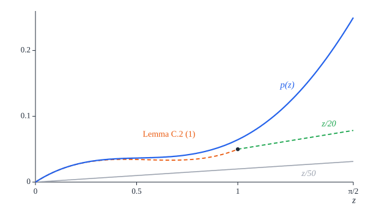
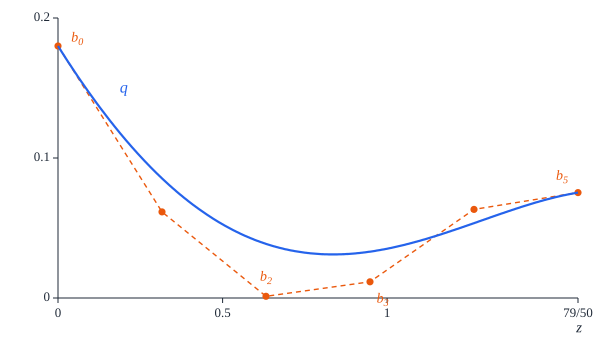
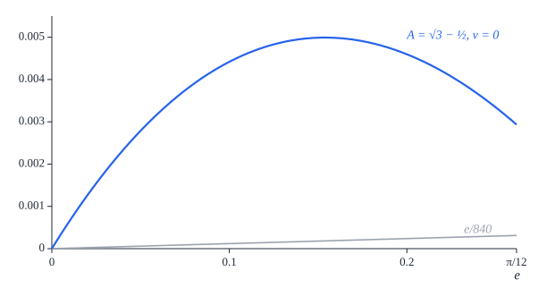
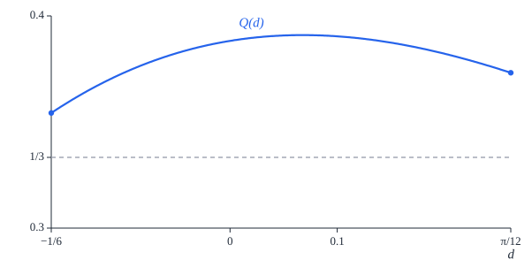
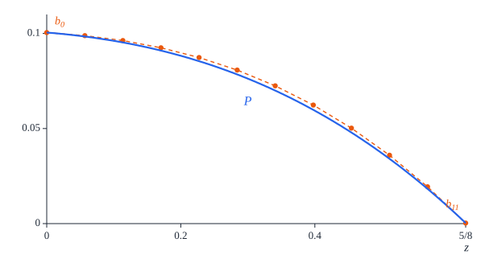
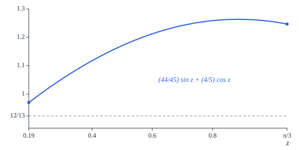
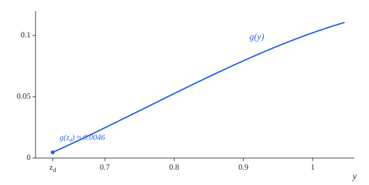

# Appendix C. The critical gap: the inward axis

[Contents](README.md) · [← Appendix B](appendix-b.md) · [Appendix D →](appendix-d.md)

This appendix proves the part of the critical-gap proposition
([Proposition 9.17](seven.md#proposition-917-the-critical-gap)) that concerns the inward axis $n_2$ when the source
sign is positive. Throughout, $(a, u)$ and $(A, v)$ are admissible states
([Definition 9.4](seven.md#definition-94-states)) with labels $\ell_1 = \ell(a, u)$ and $\ell_2 = \ell(A, v)$
([Definition 9.6](seven.md#definition-96-labels-and-markers)), and $\sigma_2$ is the support sum $\sigma_2(\frac\pi3)$ on the
axis $n_2$ of their canonical pair at the gap $\frac\pi3$ ([Definition 9.12](seven.md#definition-912-canonical-pair-and-support-sums)),
for signs $(s, t)$ with $s = +1$. The axis $n_2$ is the outer normal of the edge
of $S$ that faces the disk centre, so $\sigma_2 \ge 0$ says that the shadow of
$T$ on the line of $n_2$ reaches the near edge of $S$. The source sign $s = -1$
on this axis, the other three axes, the reduction of capped labels to active
ones and the assembly of all the sectors are treated in Appendices B and D.

For active labels, that is axial or side ones, we prove the following, where $e$
is the turn of §C.1 and a contact is meant in the sense of
[Definition 9.15](seven.md#definition-915-contacts).

| signs $(s, t)$ | label of $(a, u)$ | label of $(A, v)$ | result | statement |
| --- | --- | --- | --- | --- |
| $(+, +)$ | axial | axial | $\sigma_2 > 0$ | Proposition C.6 |
| $(+, +)$ | side | axial | $\sigma_2 \ge \frac2{15}r(a, u) + \frac1{840}\lvert e\rvert$, zero only at a contact | Proposition C.7 |
| $(+, +)$ | any | side | $\sigma_2 > 0$ | Proposition C.12 |
| $(+, -)$ | active | active | $\sigma_2 \ge 0$, zero only at a contact | Theorem C.32 |

The method is the same in every sector. The support sum is written in closed
form as a function of the turn $e$ (§C.1). The equations of the labels tie the
radial coordinates $a$ and $A$ to the turn and to the remainder $r(a, u)$. Where
this does not fix the states, the sum is monotone in them and its minimum sits
on the boundary of the label regions (§C.6 to §C.8). What is left is an
inequality in one angle, which Taylor bounds of $\sin$ and $\cos$ reduce to a
polynomial that is positive by its Bernstein coefficients or by an explicit
identity.

We use the following facts of Chapter 9 without further comment. For an
admissible state $(a, u)$:

- $0 \le \ell(a, u) \le \frac\pi4$, $\ell(a, u) \le \mathrm{axial}(u)$ and
  $\ell(a, u) \le \mathrm{side}(a, u)$ ([Lemma 9.7](seven.md#lemma-97-the-label));
- the remainder $r(a, u) = 4 - 3a - 2u$ satisfies
  $r(a, u) = (a - 1)^2 + (u - \frac12)^2 + \frac{13}4 - \varphi(a, u)$
  ([Lemma 9.5](seven.md#lemma-95-admissible-states)), so $r(a, u) \ge 0$
  ([Lemma 9.5](seven.md#lemma-95-admissible-states)), and $r(a, u) = 0$ only at
  $(a, u) = (1, \frac12)$ ([Lemma 9.16](seven.md#lemma-916-contacts));
- the transverse and radial forms of the side label,
  ```math
  \mathrm{side}(a, u) = \tfrac\pi6 + \tfrac56\left(u - \tfrac12\right) + \tfrac14 r(a, u)
  = \tfrac\pi6 - \tfrac54(a - 1) - \tfrac16 r(a, u)
  ```
  ([Lemma 9.7](seven.md#lemma-97-the-label));
- $\frac12 \le a \le \sqrt3 - \frac12$ and $u < \frac{31}{40}$
  ([Lemma 9.5](seven.md#lemma-95-admissible-states));
- a side label exceeds $\frac9{25}$ ([Lemma 9.8](seven.md#lemma-98-side-and-axial-labels)), and an
  axial label forces $a + u < \frac{113}{80}$ ([Lemma 9.8](seven.md#lemma-98-side-and-axial-labels));
- the side state $(1, \frac12)$ has the label $\frac\pi6$ ([Lemma 9.16](seven.md#lemma-916-contacts)),
  and an admissible state $(A, 0)$ is an axial state
  ([Lemma 9.16](seven.md#lemma-916-contacts)).

We also use $\frac{173}{100} < \sqrt3 < \frac{1733}{1000}$ (compare the
squares), the bounds $3.14 < \pi < \frac{22}7$, and, for $z \ge 0$, the
elementary estimates $z - \frac{z^3}6 \le \sin z \le z$ and
$\cos z \ge 1 - \frac{z^2}2$ together with the Taylor bounds of Appendix A
([Lemma A.7](appendix-a.md#lemma-a7-taylor-bounds)):

```math
\sin z \le z - \tfrac{z^3}6 + \tfrac{z^5}{120}, \qquad
1 - \tfrac{z^2}2 + \tfrac{z^4}{24} - \tfrac{z^6}{720} \le \cos z \le 1 - \tfrac{z^2}2 + \tfrac{z^4}{24} .
```

A polynomial whose Bernstein coefficients on an interval are all positive is
positive on that interval ([Lemma A.10](appendix-a.md#lemma-a10-bernstein-criterion)): if $p$ has degree $n$ and
$p(z)\,c^n = \sum_{i=0}^n b_i \binom ni z^i (c - z)^{n-i}$ with all $b_i > 0$,
then $p > 0$ on $[0, c]$. We call $b_0, \dots, b_n$ the Bernstein coefficients
of $p$ on $[0, c]$.

## C.1 The inward support sum

By the definition of the support sums ([Definition 9.12](seven.md#definition-912-canonical-pair-and-support-sums)) with $k = 2$,
$s = +1$ and the gap $g = \frac\pi3$, the canonical pair has the relative phase
$d = \frac\pi3 + \ell_1 - t\ell_2$ and

```math
\sigma_2 = h(a, u, \pi) + h(A, tv, 2\pi - d),
```

where $h$ is the support function ([Definition 9.10](seven.md#definition-910-support-function)). The first term is
$h(a, u, \pi) = \frac12 - a$. The *turn* of the pair is

```math
e = \ell_1 - t\,\ell_2 - \tfrac\pi6 ,
```

so that $d = \frac\pi2 + e$: the turn measures how far the frame of $T$ is from
a quarter turn relative to the frame of $S$. Then $2\pi - d = \frac{3\pi}2 - e$,
so $\cos(2\pi - d) = -\sin e$ and $\sin(2\pi - d) = -\cos e$; and since both
labels lie in $[0, \frac\pi4]$, the turn lies in
$[-\frac{5\pi}{12}, \frac\pi3]$, where $\cos e \ge 0$. Hence
([Lemma B.6](appendix-b.md#lemma-b6-the-inward-sum-with-a-positive-source-sign))

```math
\sigma_2 = \tfrac12 - a - A\sin e + \tfrac12\lvert\sin e\rvert + \left(\tfrac12 - tv\right)\cos e . \tag{C.1}
```

At the contact of a side square with the top or bottom square,
$(a, u) = (1, \frac12)$ and $(A, v) = (A, 0)$, the turn is
$e = \frac\pi6 - 0 - \frac\pi6 = 0$, and (C.1) is $\frac12 - 1 + \frac12 = 0$.


*Figure C.1.* The canonical pair on the inward axis, drawn in the chart of $S$
(disk centre $o$ at the origin, unit circle dashed), in four sectors: (a) two
axial labels, signs $(+, +)$; (b) the side state $(1, \frac12)$ and the axial
state $(1, 0)$, signs $(+, +)$: a contact; (c) a side target, signs $(+, +)$;
(d) a side source and an axial target with opposite signs $(+, -)$. The thick
arcs are the parts of the unit circle inside $S$ and inside $T$, and the dots on
them are the markers, $\frac\pi3$ apart. Below each pair are the shadows of $S$
and $T$ on the line of $n_2$, which points from $S$ towards $o$; $\sigma_2$ is
the amount (orange) by which the shadow of $T$ reaches past the near edge of
$S$. It is zero only in (b), where the squares touch.

Three consequences of the label equations are used only in this appendix.

### Lemma C.1 (three label bounds)

Let $(a, u)$ be admissible and $\ell = \ell(a, u)$.

1. $a \le 1 + \frac{2\pi}{15} - \frac45\ell$.
2. If $\ell = \mathrm{side}(a, u)$, then $a > \frac7{10}$.
3. If $\ell = \mathrm{side}(a, u)$, then
   $\frac95\left(\ell - \frac\pi6\right)^2 \le r(a, u)$.

*Proof.* Part (1) is [Lemma 9.7](seven.md#lemma-97-the-label) (3), and parts (2) and (3) are contained in
[Lemma 9.8](seven.md#lemma-98-side-and-axial-labels) (1). $\square$

*Lean:
[`Seven.Admissible.radial_label_bound`](../../SquaresInCircles/Seven/Labels.lean#L112),
[`Seven.side_selected_a_gt`](../../SquaresInCircles/Seven/Labels.lean#L169),
[`Seven.side_remainder_quadratic`](../../SquaresInCircles/Seven/Labels.lean#L194).*

## C.2 Two profiles of the turn

### Lemma C.2 (the turn profile)

For $0 \le z \le \frac\pi2$,

```math
p(z) = \sin z - \tfrac45 z\cos z - \tfrac34(1 - \cos z) \ge \tfrac z{50} .
```

*Proof.* Let $0 \le z \le \frac\pi2$. We use $\sin z \ge z - \frac{z^3}6$, the
upper Taylor bound of $\cos z$ multiplied by $\frac45 z \ge 0$, and the lower
Taylor bound of $\cos z$:

```math
p(z) - \tfrac z{50} \ge \left(z - \tfrac{z^3}6\right) - \tfrac45 z\left(1 - \tfrac{z^2}2 + \tfrac{z^4}{24}\right)
- \tfrac34\left(\tfrac{z^2}2 - \tfrac{z^4}{24} + \tfrac{z^6}{720}\right) - \tfrac z{50} = z\,q(z),
```

```math
q(z) = \tfrac9{50} - \tfrac{3z}8 + \tfrac{7z^2}{30} + \tfrac{z^3}{32} - \tfrac{z^4}{30} - \tfrac{z^5}{960} .
```

Since $\pi < 3.16$, $[0, \frac\pi2] \subset [0, \frac{79}{50}]$. On
$[0, \frac{79}{50}]$ the quintic $q$ has the Bernstein coefficients

```math
\tfrac9{50},\quad \tfrac{123}{2000},\quad \tfrac{937}{750000},\quad \tfrac{462959}{40000000},\quad
\tfrac{237199301}{3750000000},\quad \tfrac{22578739001}{300000000000},
```

that is, if $b_0, \dots, b_5$ denote these numbers, then

```math
q(z)\left(\tfrac{79}{50}\right)^5 = \sum_{i=0}^5 b_i\binom5i z^i\left(\tfrac{79}{50} - z\right)^{5-i},
```

as one checks by expanding. They are positive, so $q > 0$ on
$[0, \frac{79}{50}]$ ([Lemma A.10](appendix-a.md#lemma-a10-bernstein-criterion)), and
$p(z) - \frac z{50} \ge z\,q(z) \ge 0$. $\square$

*Lean:
[`Seven.inward_turn_profile`](../../SquaresInCircles/Seven/InwardAxialTarget.lean#L19).*



*Figure C.2.* The turn profile $p$ of Lemma C.2 (blue), its lower bound
$\frac z{50} + z\,q(z)$ from the Taylor bounds (orange, dashed), and
$\frac z{50}$ (grey). The lower bound follows $p$ closely up to about $z = 0.6$;
the quintic $q$, its margin over $\frac z{50}$ per unit of $z$, is least near
$z = 0.84$ (Figure C.3).



*Figure C.3.* The quintic $q$ of Lemma C.2 on $[0, \frac{79}{50}]$ and its
control polygon: the points $(\frac{79}{250}i, b_i)$, $i = 0, \dots, 5$. The
polygon lies above the axis, and $q$ lies in its convex hull.

### Lemma C.3 (a nonnegative turn)

Let $A \le \sqrt3 - \frac12$, $v \ge 0$ and $0 \le e \le \frac\pi{12}$. Then

```math
\tfrac45e - A\sin e + \tfrac12\lvert\sin e\rvert + \left(v - \tfrac12\right)(1 - \cos e) \ge \tfrac e{840} .
```

*Proof.* Here $0 \le \sin e \le e$, so $\lvert\sin e\rvert = \sin e$;
$0 \le 1 - \cos e \le \frac{e^2}2$; $\sqrt3 < \frac{26}{15}$; and
$e \le \frac\pi{12} < \frac{11}{42}$. The left side minus $\frac e{840}$ equals

```math
\left(\sqrt3 - \tfrac12 - A\right)\sin e + \left(\sqrt3 - 1\right)(e - \sin e) + v(1 - \cos e)
+ \tfrac12\left(\tfrac{e^2}2 - (1 - \cos e)\right) + \left(\tfrac{26}{15} - \sqrt3\right)e + \tfrac14 e\left(\tfrac{11}{42} - e\right),
```

as one checks by expanding; for instance, the terms linear in $e$ add up to
$(\sqrt3 - 1 + \frac{26}{15} - \sqrt3 + \frac{11}{168})e = \frac{671}{840}e$,
and $\frac{671}{840} = \frac45 - \frac1{840}$. Every term is nonnegative.
$\square$

*Lean:
[`Seven.inward_positive_turn_bound`](../../SquaresInCircles/Seven/InwardAxialTarget.lean#L35).*



*Figure C.4.* The left side of Lemma C.3 in its worst case
$A = \sqrt3 - \frac12$, $v = 0$ (it decreases in $A$ and increases in $v$),
against $\frac e{840}$.

## C.3 Signs (+, +) with an axial target

In this section $t = +1$, so $e = \ell_1 - \ell_2 - \frac\pi6$ and (C.1) reads
$\sigma_2 = \frac12 - a - A\sin e + \frac12\lvert\sin e\rvert + (\frac12 - v)\cos e$.

### Lemma C.4 (axial target, nonnegative turn)

Let $(a, u)$ and $(A, v)$ be admissible with $\ell_2 = \mathrm{axial}(v)$, and
let $e = \ell_1 - \ell_2 - \frac\pi6 \ge 0$. Then, for the signs $(+, +)$,

```math
\sigma_2 \ge \tfrac2{15}r(a, u) + \tfrac e{840} .
```

*Proof.* As $\ell_2 = \frac54v$ and
$\ell_1 \le \mathrm{side}(a, u) = \frac\pi6 - \frac54(a - 1) - \frac16r(a, u)$,

```math
\tfrac45e = \tfrac45\left(\ell_1 - \tfrac\pi6\right) - v \le -(a - 1) - \tfrac2{15}r(a, u) - v,
\qquad\text{so}\qquad 1 - a - v \ge \tfrac45e + \tfrac2{15}r(a, u) . \tag{C.2}
```

Also $e \le \frac\pi4 - 0 - \frac\pi6 = \frac\pi{12}$. Since
$\frac12 - a + (\frac12 - v)\cos e = (1 - a - v) + (v - \frac12)(1 - \cos e)$,
(C.1) and (C.2) give

```math
\sigma_2 = (1 - a - v) - A\sin e + \tfrac12\lvert\sin e\rvert + \left(v - \tfrac12\right)(1 - \cos e)
\ge \tfrac2{15}r(a, u) + \left[\tfrac45e - A\sin e + \tfrac12\lvert\sin e\rvert + \left(v - \tfrac12\right)(1 - \cos e)\right],
```

and the bracket is at least $\frac e{840}$ by Lemma C.3, which applies since
$A \le \sqrt3 - \frac12$ and $v \ge 0$. $\square$

*Lean:
[`Seven.inward_axial_positive_turn`](../../SquaresInCircles/Seven/InwardAxialTarget.lean#L58).*

### Lemma C.5 (two axial labels, nonpositive turn)

Let $(a, u)$ and $(A, v)$ be admissible with $\ell_1 = \mathrm{axial}(u)$ and
$\ell_2 = \mathrm{axial}(v)$, let $t \in \lbrace 1, -1\rbrace$, and suppose that
$e = \ell_1 - t\ell_2 - \frac\pi6 \le 0$. Then $\sigma_2 > 0$ for the signs
$(+, t)$.

*Proof.* Put $z = -e \ge 0$. As $\ell_1 \ge 0$ and $\ell_2 \le \frac\pi4$,
$z = \frac\pi6 - \ell_1 + t\ell_2 \le \frac{5\pi}{12} < \frac\pi2$, so $\sin z$
and $\cos z$ are nonnegative. Since $\ell_1 = \frac54u$ and
$t\ell_2 = \frac54tv$, we have $tv = u + \frac45z - \frac{2\pi}{15}$, and (C.1)
becomes

```math
\sigma_2 = \tfrac12 - a + A\sin z + \tfrac12\sin z + \left(\tfrac12 - u - \tfrac45z + \tfrac{2\pi}{15}\right)\cos z .
```

Expanding shows the identity

```math
\sigma_2 = \tfrac1{200} + \tfrac z{50} + \left(p(z) - \tfrac z{50}\right)
+ \left(\tfrac54 - a - \tfrac1{200}\right)(1 - \cos z)
+ \left(1 + \tfrac{2\pi}{15} - a - u - \tfrac1{200}\right)\cos z + \left(A - \tfrac12\right)\sin z ,
```

with $p$ the turn profile of Lemma C.2. Every term after $\frac1{200}$ is
nonnegative: $p(z) \ge \frac z{50}$ by Lemma C.2;
$a \le \sqrt3 - \frac12 < \frac54 - \frac1{200}$; $a + u < \frac{113}{80}$ for
the axial label $\ell_1$, while $\pi > 3.14$ gives

```math
1 + \tfrac{2\pi}{15} - \tfrac1{200} - \tfrac{113}{80} > 1 + \tfrac{2 \cdot 3.14}{15} - \tfrac1{200} - \tfrac{113}{80} = \tfrac7{6000} ;
```

and $A \ge \frac12$. So $\sigma_2 \ge \frac1{200}$. $\square$

*Lean:
[`Seven.inward_axial_nonpositive_turn`](../../SquaresInCircles/Seven/InwardAxialTarget.lean#L77).*

### Proposition C.6 (two axial labels)

Let $(a, u)$ and $(A, v)$ be admissible with $\ell_1 = \mathrm{axial}(u)$ and
$\ell_2 = \mathrm{axial}(v)$. Then $\sigma_2 > 0$ for the signs $(+, +)$.

*Proof.* Let $e = \ell_1 - \ell_2 - \frac\pi6$. If $e \le 0$, apply Lemma C.5
with $t = +1$. If $e > 0$, Lemma C.4 gives
$\sigma_2 \ge \frac2{15}r(a, u) + \frac e{840} > 0$. $\square$

*Lean:
[`Seven.inward_axial_axial_pos`](../../SquaresInCircles/Seven/InwardAxialTarget.lean#L106).*

### Proposition C.7 (side source, axial target)

Let $(a, u)$ and $(A, v)$ be admissible with $\ell_1 = \mathrm{side}(a, u)$ and
$\ell_2 = \mathrm{axial}(v)$, and let $e = \ell_1 - \ell_2 - \frac\pi6$. Then,
for the signs $(+, +)$,

```math
\sigma_2 \ge \tfrac2{15}r(a, u) + \tfrac1{840}\lvert e\rvert .
```

In particular $\sigma_2 \ge 0$, and $\sigma_2 = 0$ only if
$(a, u) = (1, \frac12)$ and $(A, v)$ is an axial state; then the two states with
the signs $(+, +)$ form a contact ([Definition 9.15](seven.md#definition-915-contacts)), of the second kind:
a side square and the top or bottom square.

*Proof.* If $e \ge 0$, this is Lemma C.4. Let $e < 0$ and $z = -e > 0$. As
$\ell_1 = \mathrm{side}(a, u)$ and $\ell_2 = \frac54v$, the definitions of the
side label and of the remainder give the identity

```math
1 - a - v = \tfrac45e + \tfrac2{15}r(a, u) . \tag{C.3}
```

(Indeed $\frac45e = \frac45(\mathrm{side}(a, u) - \frac\pi6) - v$ and
$\frac45(\mathrm{side}(a, u) - \frac\pi6) + \frac2{15}(4 - 3a - 2u) = 1 - a$.)
Moreover
$z = \frac\pi6 - \ell_1 + \ell_2 \le \frac\pi6 + \frac\pi4 < \frac\pi2$, and as
$\ell_1 > \frac9{25} > \frac\pi{12}$,

```math
\tfrac45z - \tfrac34 = v + \tfrac{2\pi}{15} - \tfrac45\ell_1 - \tfrac34 < v + \tfrac\pi{15} - \tfrac34 \le v - \tfrac12 ,
```

because $\pi \le \frac{15}4$. With $\sin e = -\sin z$,
$\lvert\sin e\rvert = \sin z$ and $\cos e = \cos z$, (C.1) and (C.3) give

```math
\sigma_2 = (1 - a - v) + A\sin z + \tfrac12\sin z + \left(v - \tfrac12\right)(1 - \cos z)
= -\tfrac45z + \tfrac2{15}r(a, u) + A\sin z + \tfrac12\sin z + \left(v - \tfrac12\right)(1 - \cos z),
```

and hence, by expanding,

```math
\sigma_2 - \tfrac2{15}r(a, u) - \tfrac z{840} = \left(p(z) - \tfrac z{50}\right) + \left(A - \tfrac12\right)\sin z
+ \left(v - \tfrac12 - \tfrac45z + \tfrac34\right)(1 - \cos z) + \left(\tfrac1{50} - \tfrac1{840}\right)z .
```

Each term is nonnegative, by Lemma C.2, by $A \ge \frac12$ and by the inequality
above. This proves the bound.

Both terms of the lower bound are nonnegative, so $\sigma_2 = 0$ forces
$r(a, u) = 0$ and $e = 0$. Then $(a, u) = (1, \frac12)$, whose label is
$\frac\pi6$, so $e = -\ell_2 = -\frac54v = 0$ and $v = 0$. The admissible state
$(A, 0)$ is an axial state, and with $s = +1$ the two states form a contact of
the second kind. $\square$

*Lean:
[`Seven.inward_side_axial_property`](../../SquaresInCircles/Seven/InwardAxialTarget.lean#L161),
[`Seven.inward_side_axial_lower`](../../SquaresInCircles/Seven/InwardAxialTarget.lean#L126).*

## C.4 Signs (+, +) with a side target

When the target has a side label, the turn is negative, and the target term of
(C.1) is best written in the angle $\psi = e + \frac\pi2$.

### Lemma C.8 (the target term)

Let $(A, v)$ be admissible with $\ell_2 = \mathrm{side}(A, v)$. For real $x$ put
$\psi(x) = \frac\pi3 + x - \ell_2$ and

```math
H(x) = \left(A + \tfrac12\right)\cos\psi(x) + \left(\tfrac12 - v\right)\sin\psi(x) .
```

Let $0 \le x \le \frac\pi4$. Then:

1. $0 < \psi(x) < \frac\pi2$;
2. $H(x) > 0$;
3. if $(a, u)$ is admissible with $\ell(a, u) = x$, then
   $\sigma_2 = \frac12 - a + H(x)$ for the signs $(+, +)$.

*Proof.* (1) As $\frac9{25} < \ell_2 \le \frac\pi4$,
$\psi(x) \ge \frac\pi3 - \frac\pi4 > 0$ and
$\psi(x) \le \frac\pi3 + \frac\pi4 - \frac9{25} < \frac\pi2$, the last because
$\frac\pi{12} < \frac9{25}$.

(2) By (1) and the definition of the support function,

```math
h(A, v, -\psi(x)) = A\cos\psi(x) - v\sin\psi(x) + \tfrac12\left(\cos\psi(x) + \sin\psi(x)\right) = H(x) .
```

The direction $\ell_2 - \frac12$ is within $\frac12 < \frac{801}{1600}$ of the
marker direction $\ell_2$, so by the marker arc lemma ([Lemma 9.9](seven.md#lemma-99-the-marker-arc)) the
point $u(\ell_2 - \frac12)$ of the unit circle lies in the closed square
$\overline{Q(A, v)}$, and therefore ([Lemma 9.11](seven.md#lemma-911-the-support-function))

```math
h(A, v, w) \ge \left\langle u\left(\ell_2 - \tfrac12\right), u(w)\right\rangle = \cos\left(w - \ell_2 + \tfrac12\right)
\qquad\text{for every direction } w .
```

With $w = -\psi(x)$ this gives $H(x) \ge \cos(\frac\pi3 + x - \frac12) > 0$,
because $0 < \frac\pi3 - \frac12 \le \frac\pi3 + x - \frac12$ and
$\frac\pi3 + x - \frac12 \le \frac{7\pi}{12} - \frac12 < \frac\pi2$.

(3) Here $e = x - \ell_2 - \frac\pi6 = \psi(x) - \frac\pi2$, so
$\sin e = -\cos\psi(x)$, $\lvert\sin e\rvert = \cos\psi(x)$ by (1), and
$\cos e = \sin\psi(x)$. Substituting in (C.1) with $t = +1$ gives
$\sigma_2 = \frac12 - a + (A + \frac12)\cos\psi(x) + (\frac12 - v)\sin\psi(x)$,
which is $\frac12 - a + H(x)$. $\square$

*Lean:
[`Seven.targetH`](../../SquaresInCircles/Seven/InwardSideTarget.lean#L14),
[`Seven.target_angle`](../../SquaresInCircles/Seven/InwardSideTarget.lean#L17),
[`Seven.targetH_pos`](../../SquaresInCircles/Seven/InwardSideTarget.lean#L36),
[`Seven.targetH_support`](../../SquaresInCircles/Seven/InwardSideTarget.lean#L25).*


*Figure C.5.* Lemma C.8 (2), in the chart of the target $T$ (here the side state
$(1, \frac12)$ and $x = \frac\pi8$). The marker arc of $T$ (green) lies in $T$;
its point $p = u(\ell_2 - \frac12)$ projects onto the direction $u(-\psi(x))$ at
$\cos(\frac\pi3 + x - \frac12) > 0$, so the support $H(x)$ of $T$ in that
direction (the distance of the solid support line from $o$) is positive.

### Lemma C.9 (the target term at zero)

Under the hypotheses of Lemma C.8, $H(0) > 1$.

*Proof.* Let $s = \ell_2 \in (\frac9{25}, \frac\pi4]$ and
$d = \psi(0) = \frac\pi3 - s$, so $0 < d < \frac\pi2$ and
$\cos d, \sin d \ge 0$. Since $s \le \mathrm{axial}(v)$, $v \ge \frac45s$; and
solving $\mathrm{side}(A, v) = s$ for $A$ gives

```math
A = \tfrac{2\pi + 7}9 + \tfrac49v - \tfrac43s = \tau(s) + \tfrac49\left(v - \tfrac45s\right) \ge \tau(s),
\qquad \tau(s) = \tfrac{2\pi + 7}9 - \tfrac{44}{45}s
```

[Proposition B.16](appendix-b.md#proposition-b16-segments-of-constant-side-label). The transverse form of the side label and
$r(A, v) \ge 0$ give $s \ge \frac\pi6 + \frac56(v - \frac12)$, that is,
$v \le \frac12 + \frac65(s - \frac\pi6)$. We distinguish three cases.

- $s \le \frac\pi6$. Then
  $A \ge \tau(\frac\pi6) = \frac79 + \frac{8\pi}{135} > \frac{19}{20}$ and
  $v \le \frac12$. Also $d < \frac{22}{21} - \frac9{25} < \frac7{10}$, so
  $\cos d \ge 1 - \frac{d^2}2 > \frac{151}{200}$. Hence
  $H(0) \ge (A + \frac12)\cos d$, which exceeds
  $\frac{29}{20}\cdot\frac{151}{200} = \frac{4379}{4000} > 1$.
- $\frac\pi6 < s \le \frac23$. Then
  $A \ge \tau(\frac23) = \frac{30\pi + 17}{135} > \frac45$ and
  $v \le \frac{13}{10} - \frac\pi5 < \frac7{10}$. Also $0 < d < \frac\pi6$, so
  $\cos d > \frac{\sqrt3}2 > \frac{17}{20}$ and $\sin d \le \frac12$. Hence
  $H(0) = (A + \frac12)\cos d + (\frac7{10} - v)\sin d - \frac15\sin d$, which
  exceeds $\frac{13}{10}\cdot\frac{17}{20} - \frac1{10} = \frac{201}{200} > 1$.
- $s > \frac23$. Then $A > \frac7{10}$ by Lemma C.1 (2), and
  $v < \frac{31}{40}$. Also $d < \frac{22}{21} - \frac23 = \frac8{21}$, so
  $\cos d > 1 - \frac12(\frac8{21})^2 = \frac{409}{441}$ and
  $\sin d \le d < \frac8{21}$. Hence
  $H(0) = (A + \frac12)\cos d + (\frac{31}{40} - v)\sin d - \frac{11}{40}\sin d$,
  which exceeds
  $\frac65\cdot\frac{409}{441} - \frac{11}{40}\cdot\frac8{21} = \frac{247}{245} > 1$.
  $\square$

*Lean:
[`Seven.targetH_zero_gt_one`](../../SquaresInCircles/Seven/InwardSideTarget.lean#L49).*

### Lemma C.10 (the quarter profile)

For $-\frac16 \le d \le \frac\pi{12}$, with $y = \frac{5\pi}{12} - d$,

```math
Q(d) = \tfrac32\cos y - d\left(\tfrac45\cos y + \tfrac65\sin y\right) > \tfrac13 .
```

*Proof.* As $y = \frac{5\pi}{12} - d$ decreases with slope 1 in $d$,
differentiation gives

```math
Q'(d) = \tfrac3{10}\sin y - \tfrac45\cos y - d\left(\tfrac45\sin y - \tfrac65\cos y\right), \qquad
Q''(d) = \tfrac9{10}\cos y - \tfrac85\sin y + d\left(\tfrac45\cos y + \tfrac65\sin y\right) .
```

On the interval, $\frac\pi3 \le y \le \frac\pi2$ (the upper bound because
$\frac{5\pi}{12} + \frac16 \le \frac\pi2$ for $\pi \ge 2$), so
$0 \le \cos y \le \frac12$ and $\sin y \ge \frac{\sqrt3}2 > \frac45$. The factor
$P = \frac45\cos y + \frac65\sin y$ is nonnegative and
$d \le \frac\pi{12} < \frac4{15}$, so $dP \le \frac4{15}P$ and

```math
Q''(d) \le \tfrac{167}{150}\cos y - \tfrac{32}{25}\sin y < \tfrac{167}{150}\cdot\tfrac12 - \tfrac{32}{25}\cdot\tfrac45 = -\tfrac{701}{1500} < 0 .
```

So $Q$ is concave on $[-\frac16, \frac\pi{12}]$, and it suffices to check the
two ends.

At $d = -\frac16$, $y = \frac\pi2 - \varepsilon$ with
$\varepsilon = \frac\pi{12} - \frac16$, and
$\frac9{100} < \frac{19}{200} < \varepsilon < \frac2{21} < \frac1{10}$. Then
$Q(-\frac16) = (\frac32 + \frac2{15})\sin\varepsilon + \frac15\cos\varepsilon$,
that is, $Q(-\frac16) = \frac{49}{30}\sin\varepsilon + \frac15\cos\varepsilon$;
and with $\sin\varepsilon \ge \varepsilon - \frac{\varepsilon^3}6$,
$\varepsilon^3 \le \frac1{1000}$,
$\cos\varepsilon \ge 1 - \frac{\varepsilon^2}2$ and
$\varepsilon^2 \le \frac\varepsilon{10}$,

```math
Q\left(-\tfrac16\right) - \tfrac13 \ge \tfrac{49}{30}\varepsilon - \tfrac{49}{180000} + \tfrac15 - \tfrac\varepsilon{100} - \tfrac13
= \tfrac{487}{300}\varepsilon - \tfrac{49}{180000} - \tfrac2{15} > \tfrac{487}{300}\cdot\tfrac9{100} - \tfrac{49}{180000} - \tfrac2{15} = \tfrac{2249}{180000} .
```

At $d = \frac\pi{12}$, $y = \frac\pi3$ and

```math
Q\left(\tfrac\pi{12}\right) = \tfrac34 - \tfrac\pi{12}\left(\tfrac25 + \tfrac{3\sqrt3}5\right)
= \tfrac34 - \pi\left(\tfrac1{30} + \tfrac{\sqrt3}{20}\right)
> \tfrac34 - \tfrac{22}7\left(\tfrac1{30} + \tfrac{1733}{20000}\right) = \tfrac13 + \tfrac{8311}{210000} .
```

$\square$

*Lean:
[`Seven.quarterProfile`](../../SquaresInCircles/Seven/InwardSideTarget.lean#L107),
[`Seven.quarter_profile_gt`](../../SquaresInCircles/Seven/InwardSideTarget.lean#L118),
[`Seven.quarterProfileD`](../../SquaresInCircles/Seven/InwardSideTarget.lean#L110),
[`Seven.quarterProfileDD`](../../SquaresInCircles/Seven/InwardSideTarget.lean#L114).*



*Figure C.6.* The quarter profile $Q$ of Lemma C.10 is concave and exceeds
$\frac13$ (grey) at both ends, hence everywhere between.

### Lemma C.11 (the target term at a quarter)

Under the hypotheses of Lemma C.8, $H(\frac\pi4) > \frac13$.

*Proof.* Put $d = \ell_2 - \frac\pi6$ and $W = r(A, v) \ge 0$. As
$\frac9{25} < \ell_2 \le \frac\pi4$ and
$\frac\pi6 - \frac16 < \frac{11}{21} - \frac16 = \frac5{14} < \frac9{25}$, we
have $-\frac16 < d \le \frac\pi{12}$. Let
$y = \psi(\frac\pi4) = \frac{5\pi}{12} - d \in [\frac\pi3, \frac\pi2]$, so
$\sin y > \frac45$. Since $\ell_2 = \mathrm{side}(A, v)$, the two forms of the
side label give

```math
A - 1 = -\tfrac45d - \tfrac2{15}W, \qquad v - \tfrac12 = \tfrac65d - \tfrac3{10}W,
```

and substituting in
$H(\frac\pi4) = (\frac32 + (A - 1))\cos y - (v - \frac12)\sin y$ gives

```math
H\left(\tfrac\pi4\right) = Q(d) + W\left(\tfrac3{10}\sin y - \tfrac2{15}\cos y\right) .
```

The bracket is at least $\frac3{10}\cdot\frac45 - \frac2{15} = \frac8{75} > 0$,
so $H(\frac\pi4) \ge Q(d) > \frac13$ by Lemma C.10. $\square$

*Lean:
[`Seven.targetH_quarter_gt`](../../SquaresInCircles/Seven/InwardSideTarget.lean#L188).*

### Proposition C.12 (side target)

Let $(a, u)$ and $(A, v)$ be admissible with $\ell_2 = \mathrm{side}(A, v)$; the
label of $(a, u)$ is arbitrary. Then $\sigma_2 > 0$ for the signs $(+, +)$.

*Proof.* For real $x$ let
$f(x) = \frac12 - (1 + \frac{2\pi}{15}) + \frac45x + H(x)$, with $H$ as in Lemma
C.8. By Lemma C.8 (3) and Lemma C.1 (1),

```math
\sigma_2 = \tfrac12 - a + H(\ell_1) \ge \tfrac12 - \left(1 + \tfrac{2\pi}{15} - \tfrac45\ell_1\right) + H(\ell_1) = f(\ell_1),
\qquad 0 \le \ell_1 \le \tfrac\pi4 .
```

Since $\psi' = 1$,

```math
f'(x) = \tfrac45 - \left(A + \tfrac12\right)\sin\psi(x) + \left(\tfrac12 - v\right)\cos\psi(x), \qquad f''(x) = -H(x),
```

and $f'' < 0$ on $[0, \frac\pi4]$ by Lemma C.8 (2). So $f$ is concave there. At
the ends, by Lemmas C.9 and C.11,

```math
f(0) = H(0) - \tfrac12 - \tfrac{2\pi}{15} > \tfrac12 - \tfrac{2\pi}{15} > 0,
\qquad
f\left(\tfrac\pi4\right) = H\left(\tfrac\pi4\right) - \tfrac12 + \tfrac\pi{15} > \tfrac\pi{15} - \tfrac16 > 0 .
```

A concave function on an interval is at least the smaller of its values at the
ends, so $f(\ell_1) > 0$ and $\sigma_2 > 0$. $\square$

*Lean:
[`Seven.fixed_gap_inward_side_target`](../../SquaresInCircles/Seven/InwardSideTarget.lean#L223).*


*Figure C.7.* The concave lower bound $f$ of Proposition C.12, as a function of
the source label, for four side targets: the side state $(1, \frac12)$, the
transition state $(a_0, u_0)$, the diagonal corner $(r_d, r_d)$ and the tie
state $(\tau(\frac\pi4), \frac\pi5)$ (notation of §C.6). The dots mark the two
ends, where Lemmas C.9 and C.11 bound $f$ below.

## C.5 Signs (+, −): the closed form and a nonpositive turn

For the signs $(+, -)$ the turn is $e = \ell_1 + \ell_2 - \frac\pi6$.

### Lemma C.13 (the sum with opposite signs)

For real $a, A, v, e$ let

```math
J(a, A, v, e) = \tfrac12 - a - A\sin e + \tfrac12\lvert\sin e\rvert + \left(v + \tfrac12\right)\cos e .
```

1. If $(a, u)$ and $(A, v)$ are admissible, then
   $\sigma_2 = J(a, A, v, \ell_1 + \ell_2 - \frac\pi6)$ for the signs $(+, -)$.
2. If $\ell(a, u) = \mathrm{side}(a, u)$, $\ell(A, v) = \mathrm{axial}(v)$ and
   $e = \ell(a, u) + \ell(A, v) - \frac\pi6$, then

   ```math
   J(a, A, v, e) = \tfrac45e + \tfrac2{15}r(a, u) - A\sin e + \tfrac12\lvert\sin e\rvert - \left(v + \tfrac12\right)(1 - \cos e) .
   ```

*Proof.* (1) is (C.1) with $t = -1$. (2) Write
$(v + \frac12)\cos e = (v + \frac12) - (v + \frac12)(1 - \cos e)$; it remains to
see that $1 - a + v = \frac45e + \frac2{15}r(a, u)$. Now
$\frac45e = \frac45(\mathrm{side}(a, u) - \frac\pi6) + v$, and
$\frac45(\mathrm{side}(a, u) - \frac\pi6) + \frac2{15}(4 - 3a - 2u) = 1 - a$ by
the definition of the side label. $\square$

*Lean:
[`Seven.inwardOpposite`](../../SquaresInCircles/Seven/InwardOppositeMinima.lean#L23),
[`Seven.inward_opposite_formula`](../../SquaresInCircles/Seven/InwardOppositeMinima.lean#L26),
[`Seven.inward_opposite_side_identity`](../../SquaresInCircles/Seven/InwardOppositeMinima.lean#L34).*

The function $J$ decreases in $a$; it decreases in $A$ where $\sin e \ge 0$ and
increases in $v$ where $\cos e \ge 0$. This is what moves the states to the
boundary of their label regions below.

### Lemma C.14 (side source, axial target, nonpositive turn)

Let $(a, u)$ and $(A, v)$ be admissible with $\ell_1 = \mathrm{side}(a, u)$ and
$\ell_2 = \mathrm{axial}(v)$, and suppose that
$e = \ell_1 + \ell_2 - \frac\pi6 \le 0$. Then, for the signs $(+, -)$,

```math
\sigma_2 \ge \tfrac2{15}r(a, u) + \tfrac1{12}\lvert e\rvert .
```

*Proof.* Put $z = -e \ge 0$. As $\ell_1 > \frac9{25}$ and $\ell_2 \ge 0$,
$z < \frac\pi6 - \frac9{25}$, and
$\frac\pi6 - \frac9{25} < \frac{11}{21} - \frac9{25} = \frac{86}{525} < \frac16$.
As $\frac54v = \ell_2 \le \frac\pi4$,
$v + \frac12 \le \frac\pi5 + \frac12 < \frac65$. By Lemma C.13, with
$\sin e = -\sin z \le 0$,

```math
\sigma_2 = -\tfrac45z + \tfrac2{15}r(a, u) + A\sin z + \tfrac12\sin z - \left(v + \tfrac12\right)(1 - \cos z),
```

and expanding shows

```math
\begin{aligned}
\sigma_2 - \tfrac2{15}r(a, u) - \tfrac z{12} ={}& \left(A - \tfrac12\right)\sin z + \left(\sin z - z + \tfrac{z^3}6\right)
+ \left(\tfrac65 - v - \tfrac12\right)(1 - \cos z) \\
&+ \tfrac65\left(\cos z - 1 + \tfrac{z^2}2\right) + z\left(\tfrac7{60} - \tfrac35z - \tfrac{z^2}6\right) .
\end{aligned}
```

The first four terms are nonnegative, and so is the last, since for
$0 \le z \le \frac16$

```math
\tfrac7{60} - \tfrac35z - \tfrac{z^2}6 = \tfrac{13}{1080} + \tfrac35\left(\tfrac16 - z\right) + \tfrac16\left(\tfrac16 - z\right)\left(\tfrac16 + z\right) > 0 .
```

$\square$

*Lean:
[`Seven.inward_opposite_negative_turn`](../../SquaresInCircles/Seven/InwardOpposite.lean#L16).*

## C.6 The boundary of the label regions

For a positive turn with opposite signs, the sum is not fixed by the labels and
the turn: the source can move along the segment of its side label and the target
along the segment of its axial label. We recall the description of these
segments from Appendix B.

The *transition state* $(a_0, u_0)$ is the point of the circle
$\varphi = \frac{13}4$ on the tie line $9a + 11u = 2\pi + 7$
([Definition B.9](appendix-b.md#definition-b9-boundary-curves-and-special-states)); its label $s_0 = \frac54u_0$
([Definition B.9](appendix-b.md#definition-b9-boundary-curves-and-special-states)) is both axial and side, and it is admissible
([Lemma B.10](appendix-b.md#lemma-b10-the-transition-state)).
Numerically $1.11979 < a_0 < 1.11980$, $0.29136 < u_0 < 0.29137$ and
$\frac9{25} < s_0 < \frac25$ ([Lemma B.10](appendix-b.md#lemma-b10-the-transition-state)). Further let

```math
r_d = \sqrt{\tfrac{13}8} - \tfrac12, \qquad t_d = \tfrac\pi6 + \tfrac7{12} - \tfrac5{12}r_d = \mathrm{side}(r_d, r_d),
```

the *diagonal corner* $(r_d, r_d)$ of the admissible region and its side label
([Definition B.9](appendix-b.md#definition-b9-boundary-curves-and-special-states)); $0.77475 < r_d < 0.77476$ and
$\frac{18}{25} < t_d < \frac\pi4$ ([Lemma B.11](appendix-b.md#lemma-b11-the-diagonal-corner)) (in fact $t_d \approx 0.78412$, just below
$\frac\pi4 \approx 0.78540$). For real $w$ and $x$ let

```math
c(w) = \sqrt{\tfrac{13}4 - \left(w + \tfrac12\right)^2} - \tfrac12, \qquad
\lambda(w) = \tfrac{2\pi + 7 - 11w}9, \qquad \bar a(w) = \min\left(c(w), \lambda(w)\right),
```

```math
\tau(x) = \tfrac{2\pi + 7}9 - \tfrac{44}{45}x = \lambda\left(\tfrac45x\right), \qquad
\delta(x) = \tfrac{2\pi + 7 - 12x}5
```

([Definition B.9](appendix-b.md#definition-b9-boundary-curves-and-special-states)): the circle $\varphi = \frac{13}4$ and the tie line
as graphs over the second coordinate, the *axial top* $\bar a(w)$, the *tie
point* $(\tau(x), \frac45x)$ of label $x$ on the tie line, and the diagonal
state $(\delta(x), \delta(x))$ of side label $x$. Finally, for $x \ge s_0$ the
*side top* $(a^+(x), u^+(x))$ is, for $x \le t_d$, the point of the circle
$\varphi = \frac{13}4$ on the line $\mathrm{side}(a, u) = x$ with the larger
second coordinate, and $(\delta(x), \delta(x))$ for $x > t_d$; for
$s_0 \le x \le \frac\pi4$ it is the upper end of the segment of side label $x$
([Definition B.13](appendix-b.md#definition-b13-the-circle-parametrised-by-the-side-label)).

We use these facts of Appendix B.

- $c(u_0) = a_0$, $\tau(s_0) = a_0$ and
  $\delta(t_d) = a^+(t_d) = u^+(t_d) = r_d$ ([Lemma B.12](appendix-b.md#lemma-b12-the-circle-over-the-u-axis), [Lemma B.10](appendix-b.md#lemma-b10-the-transition-state), [Lemma B.11](appendix-b.md#lemma-b11-the-diagonal-corner) and [Lemma B.14](appendix-b.md#lemma-b14-the-parametrisation)). So $a^+(x) = \delta(x)$ for every
  $x \ge t_d$.
- $\bar a(w) = \lambda(w)$ for $u_0 \le w \le r_d$
  ([Lemma B.12](appendix-b.md#lemma-b12-the-circle-over-the-u-axis)).
- An admissible $(a, u)$ has $a \le c(u)$ ([Lemma B.12](appendix-b.md#lemma-b12-the-circle-over-the-u-axis)), and
  $a \le \bar a(u)$ if its label is axial ([Proposition B.15](appendix-b.md#proposition-b15-the-axial-region)). For
  $0 \le w \le \frac\pi5$ the state $(\bar a(w), w)$ is admissible with an axial
  label ([Proposition B.15](appendix-b.md#proposition-b15-the-axial-region)).
- An admissible $(a, u)$ with a side label $\ell$ has $u_0 \le u$, $a \le a_0$
  and $s_0 \le \ell$ ([Proposition B.16](appendix-b.md#proposition-b16-segments-of-constant-side-label)); it lies on
  its side segment, $\frac45\ell \le u \le u^+(\ell)$ and
  $a = \tau(\ell) + \frac49(u - \frac45\ell)$ ([Proposition B.16](appendix-b.md#proposition-b16-segments-of-constant-side-label));
  and $a \le a^+(\ell)$ ([Proposition B.16](appendix-b.md#proposition-b16-segments-of-constant-side-label)).
- For $s_0 \le x \le \frac\pi4$ the side top $(a^+(x), u^+(x))$ is admissible
  with the side label $x$ ([Proposition B.16](appendix-b.md#proposition-b16-segments-of-constant-side-label)), and the tie point
  $(\tau(x), \frac45x)$ is admissible with the label $x$, which is both axial
  and side ([Proposition B.16](appendix-b.md#proposition-b16-segments-of-constant-side-label)).
- Displacements: for $0 \le w \le w' \le \frac\pi5$, $\bar a(w') \le \bar a(w)$
  and $\bar a(w) - \bar a(w') \le \frac{11}9(w' - w)$
  ([Proposition B.15](appendix-b.md#proposition-b15-the-axial-region)); for $0 \le w \le w' \le u_0$,
  $c(w) - c(w') \le \frac12(w' - w)$
  ([Lemma B.12](appendix-b.md#lemma-b12-the-circle-over-the-u-axis)); for $s_0 \le x \le x' \le t_d$,
  $a^+(x) - a^+(x') \le \frac{12}{13}(x' - x)$
  ([Proposition B.16](appendix-b.md#proposition-b16-segments-of-constant-side-label)).

![The admissible region in the (a, u)-plane, bounded by the axis u = 0, the line a = 1/2, the diagonal u = a and the circle phi = 13/4, split by the tie line into the axial region (below) and the thin side region along the circle (above), with the small capped triangle near the diagonal; the axial top curve runs along the circle from (root 3 minus 1/2, 0) up to the transition state and then along the tie line, the side top curve runs along the circle from the transition state to the diagonal corner; a side segment of slope 9/4 and a horizontal axial segment are drawn with their minimising ends marked](figures/appc-label-boundary.svg)

*Figure C.8.* The admissible region in the $(a, u)$-plane and its label regions:
axial (blue), side (orange) and capped (grey). The axial top $\bar a$ (blue,
bold) follows the circle $\varphi = \frac{13}4$ below the transition state
$(a_0, u_0)$ and the tie line above it; the side top $(a^+, u^+)$ (orange, bold)
follows the circle from $(a_0, u_0)$ to the diagonal corner $(r_d, r_d)$ (and
the diagonal from there, too short to see). With opposite signs and a positive
turn, the support sum decreases along the side segment of the source and along
the axial segment of the target in the directions of the arrows, so its minimum
sits at the ends marked by dots; for a side target it sits at the lower end, the
tie point (open dot).

## C.7 Two circles

The first boundary piece is where both states lie on the circle
$\varphi = \frac{13}4$: the source at a side top of label at most $t_d$ and the
target at an axial top of second coordinate at most $u_0$. Each state is then
controlled by the circle: the source through its remainder (Lemma C.1 (3)), the
target through the following quadratic bound.

### Lemma C.15 (a quadratic bound for the circle)

For $0 \le w \le \frac3{10}$,

```math
c(w) - \tfrac12 \le \sqrt3 - 1 - \tfrac{15}{52}w - \tfrac{341}{1092}w^2 .
```

*Proof.* Since $\frac{13}4 - (w + \frac12)^2 = 3 - w - w^2$, the left side is
$\sqrt{3 - w - w^2} - 1$. Let $\alpha = \frac{15}{52}$,
$\beta = \frac{341}{1092} = \frac{15}{52} + \frac1{42}$ and
$B = \sqrt3 - \alpha w - \beta w^2$. Then
$B \ge \frac{173}{100} - \alpha\cdot\frac3{10} - \beta\cdot\frac9{100} > 0$,
and, using $(\sqrt3)^2 = 3$,

```math
B^2 - (3 - w - w^2) = w\left(1 - 2\sqrt3\,\alpha\right) + w^2\left(1 - 2\sqrt3\,\beta + \alpha^2\right) + 2\alpha\beta w^3 + \beta^2w^4 ,
```

where, by $\sqrt3 < \frac{1733}{1000}$,

```math
1 - 2\sqrt3\,\alpha > 1 - 2\cdot\tfrac{1733}{1000}\cdot\tfrac{15}{52} = \tfrac1{5200}, \qquad
1 - 2\sqrt3\,\beta + \alpha^2 > 1 - 2\cdot\tfrac{1733}{1000}\cdot\tfrac{341}{1092} + \tfrac{225}{2704} = \tfrac{1559}{1774500} .
```

So $B^2 \ge 3 - w - w^2 \ge 0$, and since $B > 0$, $\sqrt{3 - w - w^2} \le B$.
$\square$

*Lean:
[`Seven.circle_quadratic_upper`](../../SquaresInCircles/Seven/InwardOppositeMinima.lean#L98).*

### Definition C.16 (the radial polynomials)

For real $z$ and $v$ let

```math
\begin{aligned}
b_0(z) &= \tfrac{67}{1000}z - \tfrac14z^2 + \tfrac{73}{600}z^3 + \tfrac1{48}z^4 - \tfrac{733}{120000}z^5 - \tfrac1{1440}z^6, \\
b_1(z) &= \tfrac{15}{52}\left(z - \tfrac{z^3}6\right) - \left(\tfrac{z^2}2 - \tfrac{z^4}{24} + \tfrac{z^6}{720}\right), \qquad
b_2(z) = \tfrac{341}{1092}\left(z - \tfrac{z^3}6\right), \\
E(z, v) &= b_0(z) + v\,b_1(z) + v^2b_2(z) + \tfrac6{25}\left(z - \tfrac54v\right)^2,
\end{aligned}
```

and

```math
\begin{aligned}
P(z) ={}& \tfrac{201}{2000} - \tfrac{201353}{7098000}z - \tfrac{3091}{21840}z^2 - \tfrac{1571239}{14196000}z^3
- \tfrac{23103}{7280000}z^4 + \tfrac{977419}{182520000}z^5 \\
&- \tfrac{13}{6300}z^6 - \tfrac{364297}{196560000}z^7 + \tfrac1{90720}z^8 + \tfrac1{8640}z^9 - \tfrac1{518400}z^{11} .
\end{aligned}
```

*Lean:
[`Seven.radialB`](../../SquaresInCircles/Seven/InwardOppositeMinima.lean#L64),
[`Seven.radialL`](../../SquaresInCircles/Seven/InwardOppositeMinima.lean#L67),
[`Seven.radialK`](../../SquaresInCircles/Seven/InwardOppositeMinima.lean#L70),
[`Seven.radialE`](../../SquaresInCircles/Seven/InwardOppositeMinima.lean#L72),
[`Seven.radialPolynomial`](../../SquaresInCircles/Seven/InwardOppositeMinima.lean#L46).*

### Lemma C.17 (a Taylor bound for the circular pieces)

Let $0 \le z \le \frac58$, $v \ge 0$ and
$\frac{73}{100} \le \rho \le \frac{733}{1000}$. Then

```math
b_0(z) + v\,b_1(z) + v^2b_2(z) \le \tfrac45z - \left(\rho - \tfrac{15}{52}v - \tfrac{341}{1092}v^2\right)\sin z - \left(v + \tfrac12\right)(1 - \cos z) .
```

*Proof.* We bound the terms on the right one by one, using $z, v, \rho \ge 0$.
By the upper Taylor bound of $\sin z$,

```math
\rho\sin z \le \rho\left(z - \tfrac{z^3}6 + \tfrac{z^5}{120}\right)
= \tfrac{733}{1000}z - \tfrac{73}{600}z^3 + \tfrac{733}{120000}z^5
- \left(\tfrac{733}{1000} - \rho\right)z - \left(\rho - \tfrac{73}{100}\right)\tfrac{z^3}6 - \left(\tfrac{733}{1000} - \rho\right)\tfrac{z^5}{120},
```

and the last three terms are nonpositive. By $\sin z \ge z - \frac{z^3}6$,
$\frac{15}{52}v\sin z \ge \frac{15}{52}v(z - \frac{z^3}6)$ and
$\frac{341}{1092}v^2\sin z \ge \frac{341}{1092}v^2(z - \frac{z^3}6)$. By the
lower Taylor bound of $\cos z$, $(v + \frac12)(1 - \cos z)$ is at most
$(v + \frac12)(\frac{z^2}2 - \frac{z^4}{24} + \frac{z^6}{720})$. So the right
side is at least

```math
\left(\tfrac45 - \tfrac{733}{1000}\right)z + \tfrac{73}{600}z^3 - \tfrac{733}{120000}z^5
+ \tfrac{15}{52}v\left(z - \tfrac{z^3}6\right) + \tfrac{341}{1092}v^2\left(z - \tfrac{z^3}6\right)
- \left(v + \tfrac12\right)\left(\tfrac{z^2}2 - \tfrac{z^4}{24} + \tfrac{z^6}{720}\right),
```

which is $b_0(z) + v\,b_1(z) + v^2b_2(z)$ by expanding. $\square$

*Lean:
[`Seven.radial_trig_lower`](../../SquaresInCircles/Seven/InwardOppositeMinima.lean#L132).*

### Lemma C.18 (positivity of the radial form)

$P(z) > 0$ for $0 \le z \le \frac58$, and $E(z, v) > 0$ for $0 < z \le \frac58$
and every real $v$.

*Proof.* On $[0, \frac58]$ the polynomial $P$, of degree 11, has the Bernstein
coefficients

```math
\begin{aligned}
&\tfrac{201}{2000},\quad \tfrac{61767947}{624624000},\quad \tfrac{160355527}{1665664000},\quad
\tfrac{22183121153}{239855616000},\quad \tfrac{1341122208527}{15350759424000},\quad
\tfrac{44622066127207}{552627339264000}, \\
&\tfrac{23358801914587}{322365947904000},\quad \tfrac{4410162763554631}{70736299425792000},\quad
\tfrac{1523041486356419}{30315556896768000},\quad \tfrac{4524018740302909}{125753421201408000}, \\
&\tfrac{406318644428659}{20958903533568000},\quad \tfrac{125352005285647}{418089296461824000},
\end{aligned}
```

that is, if $b_0, \dots, b_{11}$ denote these numbers (from about $0.1005$ down
to about $0.0003$), then
$P(z)(\frac58)^{11} = \sum_{i=0}^{11} b_i\binom{11}i z^i(\frac58 - z)^{11-i}$,
as one checks by expanding. They are all positive, so $P > 0$ on $[0, \frac58]$
([Lemma A.10](appendix-a.md#lemma-a10-bernstein-criterion)).

Expanding $\frac6{25}(z - \frac54v)^2 = \frac6{25}z^2 - \frac35zv + \frac38v^2$
shows that $E$ is a quadratic polynomial in $v$,

```math
E(z, v) = \gamma + \beta v + \alpha v^2, \qquad
\alpha = b_2(z) + \tfrac38, \quad \beta = b_1(z) - \tfrac35z, \quad \gamma = b_0(z) + \tfrac6{25}z^2 ,
```

and expanding the polynomials of Definition C.16 gives the discriminant identity

```math
4\alpha\gamma - \beta^2 = z\,P(z), \qquad\text{hence}\qquad 4\alpha\,E(z, v) = \left(2\alpha v + \beta\right)^2 + z\,P(z) .
```

For $0 < z \le \frac58$, $b_2(z) = \frac{341}{1092}z(1 - \frac{z^2}6) > 0$, so
$\alpha > 0$, and $z\,P(z) > 0$. Therefore $E(z, v) > 0$. $\square$

*Lean:
[`Seven.radialE_pos`](../../SquaresInCircles/Seven/InwardOppositeMinima.lean#L82),
[`Seven.radial_discriminant_identity`](../../SquaresInCircles/Seven/InwardOppositeMinima.lean#L75),
[`Seven.radialPolynomial_pos`](../../SquaresInCircles/Seven/InwardOppositeMinima.lean#L52).*



*Figure C.9.* The polynomial $P$ of Lemma C.18 on $[0, \frac58]$ with its
control polygon $(\frac5{88}i, b_i)$. Both come close to the axis only at the
right end, where $P(\frac58) = b_{11} \approx 0.0003$.

### Proposition C.19 (both states on the circle)

Let $(a, u)$ and $(A, v)$ be admissible with $\ell_1 = \mathrm{side}(a, u)$ and
$\ell_2 = \mathrm{axial}(v)$, let $z = \ell_1 + \ell_2 - \frac\pi6$, and suppose
that $0 < z \le \frac58$ and $v \le \frac3{10}$. Then $J(a, A, v, z) > 0$.

*Proof.* By $A \le c(v)$ ([Lemma B.12](appendix-b.md#lemma-b12-the-circle-over-the-u-axis)) and Lemma C.15,
$A - \frac12 \le \sqrt3 - 1 - \frac{15}{52}v - \frac{341}{1092}v^2$; and
$\sin z \ge 0$. As $\ell_1 - \frac\pi6 = z - \frac54v$, Lemma C.1 (3) gives
$r(a, u) \ge \frac95(z - \frac54v)^2$. By Lemma C.13 (2), with
$\lvert\sin z\rvert = \sin z$,

```math
\begin{aligned}
J(a, A, v, z) &= \tfrac45z + \tfrac2{15}r(a, u) - \left(A - \tfrac12\right)\sin z - \left(v + \tfrac12\right)(1 - \cos z) \\
&\ge \tfrac6{25}\left(z - \tfrac54v\right)^2 + \tfrac45z - \left(\sqrt3 - 1 - \tfrac{15}{52}v - \tfrac{341}{1092}v^2\right)\sin z - \left(v + \tfrac12\right)(1 - \cos z) \\
&\ge \tfrac6{25}\left(z - \tfrac54v\right)^2 + b_0(z) + v\,b_1(z) + v^2b_2(z) = E(z, v) > 0,
\end{aligned}
```

by Lemma C.17 with $\rho = \sqrt3 - 1 \in [\frac{73}{100}, \frac{733}{1000}]$
and by Lemma C.18. $\square$

*Lean:
[`Seven.inward_circular_pos`](../../SquaresInCircles/Seven/InwardOppositeMinima.lean#L155).*


*Figure C.10.* A pair of the kind of Proposition C.19, in the chart of $S$: the
source at the side top of label $\ell_1 = 0.45$ and the target at the axial top
of label $\ell_2 = 0.3$, signs $(+, -)$. Both states lie on the circle
$\varphi = \frac{13}4$, so both squares have a corner on the circle of radius
$\frac{\sqrt{13}}2$ about $o$ (dashed). The overlap of the shadows on the line
of $n_2$ is $\sigma_2 = J > 0$.

## C.8 Minima on the boundary

### Lemma C.20 (a turn margin)

For $\frac{19}{100} \le z \le \frac\pi3$,
$\frac{44}{45}\sin z + \frac45\cos z > \frac{12}{13}$.

*Proof.* The function is concave on $[0, \frac\pi2]$, as a combination with
nonnegative coefficients of $\sin$ and $\cos$, which are concave there
([Lemma A.5](appendix-a.md#lemma-a5-concave-trigonometric-sums)). So it suffices to check the ends, where, by
$\sin z \ge z - \frac{z^3}6$, $\cos z \ge 1 - \frac{z^2}2$ and
$\sqrt3 > \frac{173}{100}$,

```math
\begin{aligned}
\tfrac{44}{45}\sin\tfrac{19}{100} + \tfrac45\cos\tfrac{19}{100}
&\ge \tfrac{44}{45}\left(\tfrac{19}{100} - \tfrac16\left(\tfrac{19}{100}\right)^3\right) + \tfrac45\left(1 - \tfrac12\left(\tfrac{19}{100}\right)^2\right)
= \tfrac{65489851}{67500000} > \tfrac{12}{13}, \\
\tfrac{44}{45}\sin\tfrac\pi3 + \tfrac45\cos\tfrac\pi3 &= \tfrac{44}{45}\cdot\tfrac{\sqrt3}2 + \tfrac25 > \tfrac{44}{45}\cdot\tfrac{173}{200} + \tfrac25 = \tfrac{2803}{2250} > \tfrac{12}{13} .
\end{aligned}
```

$\square$

*Lean:
[`Seven.line_to_circle_turn_margin`](../../SquaresInCircles/Seven/InwardOppositeMinima.lean#L182).*



*Figure C.11.* The turn margin of Lemma C.20 against $\frac{12}{13}$ (grey).

We now fix the turn $z$ and follow the sum at the side top of the source and the
axial top of the target as the source label $x$ varies; the target label is then
$z + \frac\pi6 - x$.

### Definition C.21 (the upper profile)

For real $z$ and $x \ge s_0$ let

```math
\mu(z, x) = z + \tfrac\pi6 - x, \qquad \nu(z, x) = \tfrac45\mu(z, x), \qquad
U(z, x) = J\left(a^+(x), \bar a(\nu(z, x)), \nu(z, x), z\right),
```

and $G(z) = J(r_d, \tau(\mu(z, t_d)), \nu(z, t_d), z)$, the *diagonal junction*.

*Lean:
[`Seven.Boundary.otherLabel`](../../SquaresInCircles/Seven/InwardOppositeMinima.lean#L195),
[`Seven.Boundary.otherV`](../../SquaresInCircles/Seven/InwardOppositeMinima.lean#L196),
[`Seven.Boundary.oppositeUpper`](../../SquaresInCircles/Seven/InwardOppositeMinima.lean#L197),
[`Seven.Boundary.diagonalJunction`](../../SquaresInCircles/Seven/InwardOppositeMinima.lean#L200),
[`Seven.Boundary.sideTopA_diagonal`](../../SquaresInCircles/Seven/InwardOppositeMinima.lean#L203),
[`Seven.Boundary.sideTopA_td`](../../SquaresInCircles/Seven/InwardOppositeMinima.lean#L212).*

If the source has the side label $x$, the target has the axial label $\mu(z, x)$
and the turn is $z$, then the target has the second coordinate $\nu(z, x)$, and
$U(z, x)$ is the value of $J$ with both states moved to the tops of their
segments. By §C.6, $a^+(x) = \delta(x)$ for $x \ge t_d$ and $a^+(t_d) = r_d$. We
write $z_d = t_d + s_0 - \frac\pi6$ for the turn at which the diagonal corner
meets a target of label $s_0$; $0.6246 < z_d < 0.6248$
([Lemma B.19](appendix-b.md#lemma-b19-the-diagonal-junction)).

### Lemma C.22 (circular source, circular target)

Let $z > 0$, $s_0 \le x \le t_d$ and $0 \le \mu(z, x) \le s_0$. Then
$U(z, x) > 0$.

*Proof.* Let $\mu = \mu(z, x)$ and $\nu = \frac45\mu$; then
$0 \le \nu \le \frac45s_0 = u_0 < \frac3{10} < \frac\pi5$. The side top
$(a^+(x), u^+(x))$ is admissible with the side label $x$
([Proposition B.16](appendix-b.md#proposition-b16-segments-of-constant-side-label)), and $(\bar a(\nu), \nu)$ is admissible with
the axial label $\frac54\nu = \mu$ ([Proposition B.15](appendix-b.md#proposition-b15-the-axial-region)). Their turn
with opposite signs is $x + \mu - \frac\pi6 = z$, and
$z = \mu + x - \frac\pi6 \le s_0 + t_d - \frac\pi6 = z_d < \frac58$. So
Proposition C.19 applies to these two states and gives
$U(z, x) = J(a^+(x), \bar a(\nu), \nu, z) > 0$. $\square$

*Lean:
[`Seven.Boundary.opposite_upper_circular`](../../SquaresInCircles/Seven/InwardOppositeMinima.lean#L216).*

### Lemma C.23 (capped target)

Let $0 < z \le \frac\pi3$, $t_d \le x \le \frac\pi4$ and
$\mu(z, x) = \frac\pi4$. Then $U(z, x) > 0$.

*Proof.* Here $\nu(z, x) = \frac\pi5$ and $u_0 \le \frac\pi5 \le r_d$, so
$\bar a(\frac\pi5) = \lambda(\frac\pi5) = \frac79 - \frac\pi{45} < \frac34$, and
$\bar a(\frac\pi5) \ge \frac12$ because $(\bar a(\frac\pi5), \frac\pi5)$ is
admissible. The source top is
$a^+(x) = \delta(x) \le \delta(t_d) = r_d < \frac{31}{40}$, as $\delta$
decreases. Since $0 < z \le \frac\pi3$, $0 \le \sin z \le 1$ and
$\cos z \ge \frac12$. Hence

```math
U(z, x) = \tfrac12 - \delta(x) - \left(\bar a\left(\tfrac\pi5\right) - \tfrac12\right)\sin z + \left(\tfrac\pi5 + \tfrac12\right)\cos z
\ge \tfrac12 - \tfrac{31}{40} - \tfrac14 + \tfrac12\left(\tfrac\pi5 + \tfrac12\right) = \tfrac\pi{10} - \tfrac{11}{40} > 0 .
```

$\square$

*Lean:
[`Seven.Boundary.opposite_upper_cap`](../../SquaresInCircles/Seven/InwardOppositeMinima.lean#L242).*

### Lemma C.24 (the diagonal junction)

Let $0 < z \le \frac\pi3$ and $s_0 \le \mu(z, t_d) \le \frac\pi4$. Then
$G(z) > 0$.

*Proof.* The condition $\mu(z, t_d) \ge s_0$ says $z \ge z_d$. For
$z_d \le y \le z$ let $\mu_y = \mu(y, t_d) = y + \frac\pi6 - t_d$, so that
$s_0 \le \mu_y \le \mu(z, t_d) \le \frac\pi4$, and let

```math
g(y) = \tfrac12 - r_d - \left(\tau(\mu_y) - \tfrac12\right)\sin y + \left(\tfrac45\mu_y + \tfrac12\right)\cos y .
```

As $0 \le y \le \frac\pi3$, $\sin y \ge 0$ and $g(y) = G(y)$. Since
$d\mu_y/dy = 1$ and $\tau' = -\frac{44}{45}$,

```math
g'(y) = \left(\tfrac{43}{90} - \tfrac45\mu_y\right)\sin y + \left(\tfrac{13}{10} - \tau(\mu_y)\right)\cos y .
```

On $[z_d, z]$ we have $\cos y \ge \frac12 > 0$, $\sin y \ge 0$ and
$\sin y \le 1 \le \frac94\cos y$, so $g'(y) > 0$ by Appendix B
([Lemma B.17](appendix-b.md#lemma-b17-the-slope-along-the-tie-line)). Hence $g$ increases on $[z_d, z]$ and
$G(z) = g(z) \ge g(z_d)$. At $y = z_d$, $\mu_y = s_0$, $\tau(s_0) = a_0$ and
$\frac45s_0 = u_0$, so

```math
g(z_d) = \tfrac12 - r_d - \left(a_0 - \tfrac12\right)\sin z_d + \left(u_0 + \tfrac12\right)\cos z_d > 0
```

by Appendix B ([Lemma B.19](appendix-b.md#lemma-b19-the-diagonal-junction)). $\square$

*Lean:
[`Seven.Boundary.diagonal_junction_pos`](../../SquaresInCircles/Seven/InwardOppositeMinima.lean#L267).*

The value $g(z_d) \approx 0.0046$ is the smallest margin on the inward axis.



*Figure C.12.* The diagonal junction $g$ of Lemma C.24 on
$[z_d, t_d + \frac\pi{12}]$, the turns for which
$\mu(y, t_d) \in [s_0, \frac\pi4]$. It increases from $g(z_d) \approx 0.0046$.

### Lemma C.25 (the junction)

Let $0 < z \le \frac\pi3$ and $0 \le \mu(z, t_d) \le \frac\pi4$. Then
$U(z, t_d) > 0$.

*Proof.* If $\mu(z, t_d) \le s_0$, apply Lemma C.22 with $x = t_d$, noting
$s_0 < t_d$. Otherwise $\nu = \nu(z, t_d) = \frac45\mu(z, t_d)$ lies in
$[u_0, \frac\pi5] \subset [u_0, r_d]$, so
$\bar a(\nu) = \lambda(\nu) = \tau(\mu(z, t_d))$; with $a^+(t_d) = r_d$ this
gives $U(z, t_d) = G(z)$, which is positive by Lemma C.24. $\square$

*Lean:
[`Seven.Boundary.opposite_upper_junction`](../../SquaresInCircles/Seven/InwardOppositeMinima.lean#L313).*

### Lemma C.26 (a diagonal source moves down)

Let $0 \le z \le \frac\pi3$ and $t_d \le l \le x$, with $\mu(z, x) \ge 0$ and
$\mu(z, l) \le \frac\pi4$. Then $U(z, l) \le U(z, x)$.

*Proof.* Let $\nu_x = \nu(z, x)$ and $\nu_l = \nu(z, l)$. Then
$0 \le \nu_x \le \nu_l \le \frac\pi5$ and $\nu_l - \nu_x = \frac45(x - l)$, so
by Appendix B ([Proposition B.15](appendix-b.md#proposition-b15-the-axial-region))
$\bar a(\nu_x) - \bar a(\nu_l) \le \frac{11}9(\nu_l - \nu_x)$, which is
$\frac{44}{45}(x - l)$. Also $a^+(x) = \delta(x)$, $a^+(l) = \delta(l)$ and
$\delta(l) - \delta(x) = \frac{12}5(x - l)$. The terms
$\frac12\lvert\sin z\rvert$ cancel, and expanding shows

```math
U(z, x) - U(z, l) = \tfrac{28}{45}(x - l) + \tfrac{44}{45}(x - l)(1 - \sin z) + \tfrac45(x - l)(1 - \cos z)
+ \left[\tfrac{44}{45}(x - l) - \left(\bar a(\nu_x) - \bar a(\nu_l)\right)\right]\sin z ,
```

a sum of nonnegative terms, as $0 \le \sin z, \cos z \le 1$. $\square$

*Lean:
[`Seven.Boundary.diagonal_source_reduction`](../../SquaresInCircles/Seven/InwardOppositeMinima.lean#L334).*

### Lemma C.27 (a circular source moves up)

Let $\frac{19}{100} \le z \le \frac\pi3$ and $s_0 \le x \le x' \le t_d$, with
$\mu(z, x') \ge s_0$ and $\mu(z, x) \le \frac\pi4$. Then $U(z, x') \le U(z, x)$.

*Proof.* For $y \in \lbrace x, x'\rbrace$ we have
$s_0 \le \mu(z, y) \le \frac\pi4$, so
$\nu(z, y) \in [u_0, \frac\pi5] \subset [u_0, r_d]$ and
$\bar a(\nu(z, y)) = \lambda(\nu(z, y)) = \tau(\mu(z, y))$. Now
$\mu(z, x) - \mu(z, x') = x' - x$, so
$\tau(\mu(z, x)) - \tau(\mu(z, x')) = -\frac{44}{45}(x' - x)$ and
$\nu(z, x) - \nu(z, x') = \frac45(x' - x)$. Hence

```math
U(z, x) - U(z, x') = \left[\tfrac{12}{13}(x' - x) - \left(a^+(x) - a^+(x')\right)\right]
+ (x' - x)\left(\tfrac{44}{45}\sin z + \tfrac45\cos z - \tfrac{12}{13}\right) \ge 0,
```

by the displacement bound for $a^+$ ([Proposition B.16](appendix-b.md#proposition-b16-segments-of-constant-side-label)) and
Lemma C.20. $\square$

*Lean:
[`Seven.Boundary.circular_source_line_reduction`](../../SquaresInCircles/Seven/InwardOppositeMinima.lean#L356).*

### Proposition C.28 (the upper profile is positive)

Let $0 < z \le \frac\pi3$, $s_0 \le x \le \frac\pi4$ and
$0 \le \mu(z, x) \le \frac\pi4$. Then $U(z, x) > 0$.

*Proof.* We move along the line of constant turn $z$ in the plane of the two
labels (Figure C.13) until one of Lemmas C.22 to C.25 applies.

*Diagonal source, $x \ge t_d$.* Let $l = \max(t_d, z - \frac\pi{12})$. Since
$\mu(z, x) \le \frac\pi4$ means $x \ge z - \frac\pi{12}$, we have
$t_d \le l \le x$; moreover $\mu(z, l) \le \frac\pi4$ as
$l \ge z - \frac\pi{12}$, and $\mu(z, l) \ge \mu(z, x) \ge 0$. By Lemma C.26,
$U(z, l) \le U(z, x)$. If $z - \frac\pi{12} \le t_d$, then $l = t_d$ and
$U(z, t_d) > 0$ by Lemma C.25. Otherwise
$l = z - \frac\pi{12} \in [t_d, \frac\pi4]$ and $\mu(z, l) = \frac\pi4$, so
$U(z, l) > 0$ by Lemma C.23.

*Circular source, $x < t_d$, circular target, $\mu(z, x) \le s_0$.* This is
Lemma C.22.

*Circular source, $x < t_d$, target on the tie line, $\mu(z, x) > s_0$.* Let
$x' = \min(t_d, z + \frac\pi6 - s_0)$. Then $x \le x' \le t_d$ (as
$\mu(z, x) > s_0$ means $x < z + \frac\pi6 - s_0$) and $\mu(z, x') \ge s_0$.
Since $x \ge s_0$ and $\mu(z, x) > s_0$, the turn
$z = \mu(z, x) + x - \frac\pi6$ exceeds
$2s_0 - \frac\pi6 > \frac{18}{25} - \frac{11}{21} > \frac{19}{100}$. By Lemma
C.27, $U(z, x') \le U(z, x)$. If $t_d \le z + \frac\pi6 - s_0$, then $x' = t_d$,
$\mu(z, t_d) \in [s_0, \mu(z, x)] \subset [0, \frac\pi4]$, and $U(z, t_d) > 0$
by Lemma C.25. Otherwise $x' = z + \frac\pi6 - s_0 \in [s_0, t_d]$ and
$\mu(z, x') = s_0$, so $U(z, x') > 0$ by Lemma C.22. $\square$

*Lean:
[`Seven.Boundary.opposite_upper_pos`](../../SquaresInCircles/Seven/InwardOppositeMinima.lean#L384).*

![The rectangle of label pairs, the source label x from s_0 to pi over 4 horizontally and the target label mu from 0 to pi over 4 vertically, split by the horizontal line mu = s_0 into a lower part where both states lie on the circle and an upper part where the target lies on the tie line, with a very thin strip at the right edge for diagonal sources and a grey corner where the turn is not positive; dashed anti-diagonal lines of constant turn, and arrows along them from the upper part down to the line mu = s_0 or to the right edge x = t_d](figures/appc-upper-cases.svg)

*Figure C.13.* The case analysis of Proposition C.28 in the plane of the source
label $x$ and the target label $\mu$. Along a line of constant turn
$x + \mu = z + \frac\pi6$ (dashed), the upper profile decreases in the
directions of the arrows, towards the circular pieces ($\mu \le s_0$, Lemma
C.22), the junction $x = t_d$ (Lemma C.25) or the capped target
$\mu = \frac\pi4$ (Lemma C.23). The strip of diagonal sources
$t_d \le x \le \frac\pi4$, where the profile decreases in the opposite direction
(Lemma C.26), is only about $0.0013$ wide: it is the orange line at the right
edge.

## C.9 Signs (+, −) with active labels

### Proposition C.29 (side source, axial target)

Let $(a, u)$ and $(A, v)$ be admissible with $\ell_1 = \mathrm{side}(a, u)$ and
$\ell_2 = \mathrm{axial}(v)$, and let $e = \ell_1 + \ell_2 - \frac\pi6$. For the
signs $(+, -)$:

1. if $e > 0$, then $\sigma_2 > 0$;
2. $\sigma_2 \ge 0$, and $\sigma_2 = 0$ only if $(a, u) = (1, \frac12)$ and
   $(A, v)$ is an axial state; then the two states with the signs $(+, -)$ form
   a contact ([Definition 9.15](seven.md#definition-915-contacts)) of the second kind.

*Proof.* (1) Let $z = e > 0$; then
$z \le \frac\pi4 + \frac\pi4 - \frac\pi6 = \frac\pi3$, so $\sin z \ge 0$.
Appendix B gives $s_0 \le \ell_1$
([Proposition B.16](appendix-b.md#proposition-b16-segments-of-constant-side-label)), so
$s_0 \le \ell_1 \le \frac\pi4$, and
$\mu(z, \ell_1) = \ell_2 \in [0, \frac\pi4]$,
$\nu(z, \ell_1) = \frac45\ell_2 = v$. By Proposition C.28, $U(z, \ell_1) > 0$.
Moreover $a \le a^+(\ell_1)$ ([Proposition B.16](appendix-b.md#proposition-b16-segments-of-constant-side-label)) and
$A \le \bar a(v)$ ([Proposition B.15](appendix-b.md#proposition-b15-the-axial-region)), and $J$ decreases in $a$ and,
as $\sin z \ge 0$, in $A$. So by Lemma C.13 (1),

```math
\sigma_2 = J(a, A, v, z) \ge J\left(a^+(\ell_1), \bar a(v), v, z\right) = U(z, \ell_1) > 0 .
```

(2) If $e > 0$, this is (1). If $e \le 0$, Lemma C.14 gives
$\sigma_2 \ge \frac2{15}r(a, u) + \frac1{12}\lvert e\rvert \ge 0$, and
$\sigma_2 = 0$ forces $r(a, u) = 0$ and $e = 0$. Then $(a, u) = (1, \frac12)$
with the label $\frac\pi6$, so $e = \ell_2 = \frac54v = 0$, and the admissible
state $(A, 0)$ is an axial state. With $s = +1$ this is a contact of the second
kind. $\square$

*Lean:
[`Seven.inward_opposite_side_axial_property`](../../SquaresInCircles/Seven/InwardOpposite.lean#L77),
[`Seven.inward_opposite_side_positive_turn`](../../SquaresInCircles/Seven/InwardOpposite.lean#L48).*

### Proposition C.30 (two axial labels)

Let $(a, u)$ and $(A, v)$ be admissible with $\ell_1 = \mathrm{axial}(u)$ and
$\ell_2 = \mathrm{axial}(v)$. Then $\sigma_2 > 0$ for the signs $(+, -)$.

*Proof.* Let $e = \ell_1 + \ell_2 - \frac\pi6$. If $e \le 0$, apply Lemma C.5
with $t = -1$. Let $z = e > 0$. Then $z \le \frac\pi3$, so $\sin z \ge 0$ and
$\cos z \ge \frac12$; and $x = \ell_1 = \frac54u \in [0, \frac\pi4]$, so
$0 \le u \le \frac\pi5$, and likewise $0 \le v \le \frac\pi5$. By Lemma C.13
(1), $\sigma_2 = J(a, A, v, z)$.

*The case $x \ge s_0$.* Then
$u = \frac45x \in [u_0, \frac\pi5] \subset [u_0, r_d]$, so
$a \le \bar a(u) = \lambda(u) = \tau(x)$ ([Proposition B.15](appendix-b.md#proposition-b15-the-axial-region) and [Lemma B.12](appendix-b.md#lemma-b12-the-circle-over-the-u-axis)). The tie point $(\tau(x), \frac45x)$ is
admissible with the label $x$, which is a side label
([Proposition B.16](appendix-b.md#proposition-b16-segments-of-constant-side-label)), and its turn with $(A, v)$ is
$x + \ell_2 - \frac\pi6 = z > 0$. By Proposition C.29 (1) and Lemma C.13 (1),
$J(\tau(x), A, v, z) > 0$, and as $J$ decreases in $a$,
$\sigma_2 = J(a, A, v, z) \ge J(\tau(x), A, v, z) > 0$.

*The case $x < s_0$.* Then $u < u_0$. From $z = \frac54(u + v) - \frac\pi6$,
$v = \frac45z + \frac{2\pi}{15} - u$. Let
$v' = \frac45z + \frac{2\pi}{15} - u_0 = v - (u_0 - u)$; then
$0 < \frac{2\pi}{15} - \frac3{10} < v' \le v \le \frac\pi5$. The state
$(\bar a(v'), v')$ is admissible with the axial label $\frac54v'$
([Proposition B.15](appendix-b.md#proposition-b15-the-axial-region)), the transition state $(a_0, u_0)$ is
admissible with the label $s_0$, which is a side label, and their turn is
$s_0 + \frac54v' - \frac\pi6 = z > 0$. By Proposition C.29 (1),
$J(a_0, \bar a(v'), v', z) > 0$. Now

```math
J(a, A, v, z) - J\left(a_0, \bar a(v'), v', z\right) = (a_0 - a) + \left(\bar a(v') - A\right)\sin z + (u_0 - u)\cos z .
```

By Appendix B,
$a \le c(u) \le c(u_0) + \frac12(u_0 - u) = a_0 + \frac12(u_0 - u)$
([Lemma B.12](appendix-b.md#lemma-b12-the-circle-over-the-u-axis)) and
$A \le \bar a(v) \le \bar a(v')$ ([Proposition B.15](appendix-b.md#proposition-b15-the-axial-region)). With $\cos z \ge \frac12$ the difference
is at least $-\frac12(u_0 - u) + 0 + \frac12(u_0 - u) = 0$, so $\sigma_2 > 0$.
$\square$

*Lean:
[`Seven.inward_opposite_axial_axial_pos`](../../SquaresInCircles/Seven/InwardOpposite.lean#L156),
[`Seven.inward_opposite_axial_positive_turn`](../../SquaresInCircles/Seven/InwardOpposite.lean#L87).*

### Lemma C.31 (a side target moves to its tie point)

Let $(a, u)$ and $(A, v)$ be admissible with $\ell_2 = \mathrm{side}(A, v)$.
Then $\sigma_2$ for $(a, u)$ and $(A, v)$ is at least $\sigma_2$ for $(a, u)$
and the tie point $(\tau(\ell_2), \frac45\ell_2)$, both with the signs $(+, -)$.

*Proof.* By Appendix B, $s_0 \le \ell_2 \le \frac\pi4$
([Proposition B.16](appendix-b.md#proposition-b16-segments-of-constant-side-label)), so the tie point is admissible
with the label $\ell_2$ ([Proposition B.16](appendix-b.md#proposition-b16-segments-of-constant-side-label)); the two pairs have the
same turn $z = \ell_1 + \ell_2 - \frac\pi6$, and
$-\frac16 < \frac9{25} - \frac\pi6 < z \le \frac\pi3$. Then
$\cos z - \frac49\sin z > 0$: for $z \ge 0$ because
$\cos z \ge \frac12 > \frac49 \ge \frac49\sin z$, and for $z < 0$ because
$\sin z < 0 < \cos z$. The target lies on its side segment,
$A = \tau(\ell_2) + \frac49(v - \frac45\ell_2)$ with $v \ge \frac45\ell_2$
([Proposition B.16](appendix-b.md#proposition-b16-segments-of-constant-side-label)), so by Lemma C.13 (1)

```math
J(a, A, v, z) - J\left(a, \tau(\ell_2), \tfrac45\ell_2, z\right)
= -\left(A - \tau(\ell_2)\right)\sin z + \left(v - \tfrac45\ell_2\right)\cos z
= \left(v - \tfrac45\ell_2\right)\left(\cos z - \tfrac49\sin z\right) \ge 0 .
```

$\square$

*Lean:
[`Seven.inward_opposite_side_target_reduction`](../../SquaresInCircles/Seven/InwardOpposite.lean#L165).*

### Theorem C.32 (opposite signs with active labels)

Let $(a, u)$ and $(A, v)$ be admissible with active labels. Then
$\sigma_2 \ge 0$ for the signs $(+, -)$, with equality only if the two states
with these signs form a contact ([Definition 9.15](seven.md#definition-915-contacts)).

*Proof.* If $\ell_2 = \mathrm{axial}(v)$, this is Proposition C.30 for an axial
source and Proposition C.29 (2) for a side source.

Let $\ell_2 = \mathrm{side}(A, v)$. Then $s_0 \le \ell_2 \le \frac\pi4$
([Proposition B.16](appendix-b.md#proposition-b16-segments-of-constant-side-label)), so the tie point
$B = (\tau(\ell_2), \frac45\ell_2)$ is admissible with the label
$\ell_2 = \mathrm{axial}(\frac45\ell_2)$ ([Proposition B.16](appendix-b.md#proposition-b16-segments-of-constant-side-label)), an axial
label. By the case just treated, applied to $(a, u)$ and $B$, the sum
$\sigma_2'$ of $(a, u)$ and $B$ is nonnegative and vanishes only at a contact,
and by Lemma C.31, $\sigma_2 \ge \sigma_2' \ge 0$. If $\sigma_2 = 0$, then
$\sigma_2' = 0$, and $(a, u)$ and $B$ with the signs $(+, -)$ form a contact.
This is impossible: a contact of the first kind needs $s = -1$; one of the
second kind needs $B$ axial, so $\frac45\ell_2 = 0$, against
$\ell_2 > \frac9{25}$; and one of the third kind needs $B = (1, \frac12)$, whose
label is $\frac\pi6$, while $\frac45\ell_2 = \frac12$ gives the label
$\ell_2 = \frac58 \ne \frac\pi6$. So $\sigma_2 > 0$ when the target has a side
label. $\square$

*Lean:
[`Seven.fixed_gap_inward_opposite_active`](../../SquaresInCircles/Seven/InwardOpposite.lean#L204).*
