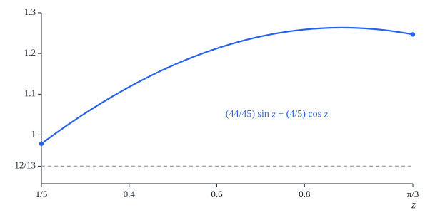

# Appendix H. Seven squares: the critical gap, the inward axis

[Contents](README.md) · [← Appendix G](appendix-g.md) · [Appendix I →](appendix-i.md)

This appendix proves the part of the critical-gap proposition
([Proposition 10.17](10-seven.md#proposition-1017-the-critical-gap)) that concerns the inward axis $n_2$ when the source
sign is positive. Throughout, $(a, b)$ and $(A, B)$ are admissible states
([Definition 10.4](10-seven.md#definition-104-states)) with labels $\ell = \ell(a, b)$ and $\ell' = \ell(A, B)$
([Definition 10.6](10-seven.md#definition-106-labels-and-markers)), and $\sigma_2$ is the support sum $\sigma_2(\frac\pi3)$ on the
axis $n_2$ of their canonical pair at the gap $\frac\pi3$ ([Definition 10.12](10-seven.md#definition-1012-canonical-pair-and-support-sums)),
for signs $(s, t)$ with $s = +1$. As in Appendix G, the square $S = Q(a, b)$ is
the *source* and the square $T$ the *target*. The axis $n_2$ is the outer
normal of the edge of $S$ that faces the disk centre, so $\sigma_2 \ge 0$ says
that the shadow of $T$ on the line of $n_2$ reaches the near edge of $S$. The
source sign $s = -1$ on this axis, the other three axes, the reduction of capped
labels to active ones and the assembly of all the sectors are treated in
Appendices G and I.

We prove the following, where $e$ is the turn of §H.1, a label is *active* if it
is axial or side, and a contact is meant in the sense of
[Definition 10.15](10-seven.md#definition-1015-contacts).

| signs $(s, t)$ | label of $(a, b)$ | label of $(A, B)$ | result | statement |
| --- | --- | --- | --- | --- |
| $(+, +)$ | axial | axial | $\sigma_2 > 0$ | Proposition H.6 |
| $(+, +)$ | side | axial | $\sigma_2 \ge \frac2{15}r(a, b) + \frac1{840}\lvert e\rvert$, zero only at a contact | Proposition H.7 |
| $(+, +)$ | any | side | $\sigma_2 > 0$ | Proposition H.12 |
| $(+, -)$ | active | active | $\sigma_2 \ge 0$, zero only at a contact | Theorem H.32 |

The method is the same in every sector. The support sum is written in closed
form as a function of the turn $e$ (§H.1), and the equations of the labels
express the coordinates of the two states through the turn and the remainder
$r(a, b)$. Where this does not fix the states, the sum is monotone in them and
its minimum sits on the boundary of the label regions (§H.6 to §H.8). What is
left is an inequality in one angle. Taylor bounds of $\sin$ and $\cos$ reduce it
to a polynomial inequality, which an explicit identity proves by writing the
difference as a sum of nonnegative terms; or the inequality holds at one end of
an interval and the sign of a derivative carries it to the rest, or it holds at
both ends and concavity carries it to the points between.

We use the following facts of Chapter 10 without further comment. For an
admissible state $(a, b)$:

- $0 \le \ell(a, b) \le \frac\pi4$, $\ell(a, b) \le \mathrm{axial}(b)$ and
  $\ell(a, b) \le \mathrm{side}(a, b)$ ([Lemma 10.7](10-seven.md#lemma-107-the-label) (2));
- the remainder $r(a, b) = 4 - 3a - 2b$ satisfies
  $r(a, b) = (a - 1)^2 + (b - \frac12)^2 + \frac{13}4 - \varphi(a, b)$, so
  $r(a, b) \ge 0$ ([Lemma 10.5](10-seven.md#lemma-105-admissible-states) (1)), and $r(a, b) = 0$ only at
  $(a, b) = (1, \frac12)$ ([Lemma 10.16](10-seven.md#lemma-1016-contacts) (2));
- the transverse and radial forms of the side label,
  ```math
  \mathrm{side}(a, b) = \tfrac\pi6 + \tfrac56\left(b - \tfrac12\right) + \tfrac14 r(a, b)
  = \tfrac\pi6 - \tfrac54(a - 1) - \tfrac16 r(a, b)
  ```
  ([Lemma 10.7](10-seven.md#lemma-107-the-label) (1));
- $\frac12 \le a \le \sqrt3 - \frac12$ and $b < \frac{31}{40}$
  ([Definition 10.4](10-seven.md#definition-104-states) and [Lemma 10.5](10-seven.md#lemma-105-admissible-states) (2));
- a side label exceeds $\frac9{25}$, and an axial label forces
  $a + b < 1 + \frac{2\pi}{15}$ ([Lemma 10.8](10-seven.md#lemma-108-side-and-axial-labels));
- the side state $(1, \frac12)$ has the label $\frac\pi6$, and an admissible
  state $(A, 0)$ is an axial state ([Lemma 10.16](10-seven.md#lemma-1016-contacts) (1) and (3)).

We also use $1.73 < \sqrt3 < 1.733$ (compare the squares), the bounds
$3.14 < \pi < \frac{22}7$, and, for $z \ge 0$, the
elementary estimates $z - \frac{z^3}6 \le \sin z \le z$ and
$\cos z \ge 1 - \frac{z^2}2$ together with the Taylor bounds of Appendix A
([Lemma A.7](appendix-a.md#lemma-a7-taylor-bounds)):

```math
\sin z \le z - \tfrac{z^3}6 + \tfrac{z^5}{120}, \qquad
1 - \tfrac{z^2}2 + \tfrac{z^4}{24} - \tfrac{z^6}{720} \le \cos z \le 1 - \tfrac{z^2}2 + \tfrac{z^4}{24} .
```

The sign of a derivative gives monotonicity
([Lemma A.1](appendix-a.md#lemma-a1-monotonicity-from-the-derivative)): a function that is continuous on a closed interval
and has a derivative $f'(y) \ge 0$ at every interior point $y$ is
nondecreasing on the interval, and one with $f'(y) \le 0$ at every interior
point is nonincreasing. A function with a nonpositive second derivative that is
positive at both ends of an interval is positive on all of it
([Lemma A.4](appendix-a.md#lemma-a4-positivity-from-concavity)). The identities are checked by expanding, and the
decimal bounds on fractions by one multiplication each.

## H.1 The inward support sum

By the definition of the support sums ([Definition 10.12](10-seven.md#definition-1012-canonical-pair-and-support-sums)) with $k = 2$,
$s = +1$ and the gap $g = \frac\pi3$, the canonical pair has the relative phase
$d = \frac\pi3 + \ell - t\ell'$ and

```math
\sigma_2 = h(a, b, \pi) + h(A, tB, 2\pi - d),
```

where $h$ is the support function ([Definition 10.10](10-seven.md#definition-1010-support-function)); the first term is
$\frac12 - a$. The *turn* of the pair is

```math
e = \ell - t\,\ell' - \tfrac\pi6 ,
```

so that $d = \frac\pi2 + e$: the turn measures how far the frame of $T$ is from
a quarter turn relative to the frame of $S$. As both labels lie in
$[0, \frac\pi4]$, the turn lies in $[-\frac{5\pi}{12}, \frac\pi{12}]$ for
$t = 1$ and in $[-\frac\pi6, \frac\pi3]$ for $t = -1$, where $\cos e \ge 0$; and
writing $2\pi - d = \frac{3\pi}2 - e$ in the second term gives
([Lemma G.6](appendix-g.md#lemma-g6-the-inward-sum-with-a-positive-source-sign))

```math
\sigma_2 = \tfrac12 - a - A\sin e + \tfrac12\lvert\sin e\rvert + \left(\tfrac12 - tB\right)\cos e . \tag{H.1}
```

At the contact of a side square with the top or bottom square,
$(a, b) = (1, \frac12)$ and $(A, B) = (A, 0)$, the turn is
$e = \frac\pi6 - 0 - \frac\pi6 = 0$, and (H.1) is $\frac12 - 1 + \frac12 = 0$
(Figure H.1 (b)).


*Figure H.1.* The canonical pair on the inward axis, in the chart of $S$ (disk
centre $o$ at the origin, unit circle dashed), in four sectors: (a) the states
$(1.05, 0.2)$ and $(0.95, 0.15)$, both with axial labels, signs $(+, +)$; (b)
the side state $(1, \frac12)$ and the axial state $(1, 0)$, signs $(+, +)$: a
contact; (c) the state $(1.1, 0.1)$, with an axial label, and the side state
$(1, \frac12)$ as the target, signs $(+, +)$; (d) the side state $(1, \frac12)$
and the state $(1, 0.1)$, with an axial label, signs $(+, -)$. The thick arcs
are the parts of the unit circle inside $S$ and inside $T$, and the dots on
them are the markers, $\frac\pi3$ apart. Below each pair are the shadows of $S$
and $T$ on the line of $n_2$, which points from $S$ towards $o$; $\sigma_2$ is
the amount (orange) by which the shadow of $T$ reaches past the near edge of
$S$. It is zero only in (b), where the squares touch.

We restate three label bounds of Chapter 10 in the form used below.

### Lemma H.1 (three label bounds)

Let $(a, b)$ be admissible and $\ell = \ell(a, b)$.

1. $a \le 1 + \frac{2\pi}{15} - \frac45\ell$.
2. If $\ell = \mathrm{side}(a, b)$, then $a > \frac7{10}$.
3. If $\ell = \mathrm{side}(a, b)$, then
   $\frac95\left(\ell - \frac\pi6\right)^2 \le r(a, b)$.

*Proof.* Part (1) is [Lemma 10.7](10-seven.md#lemma-107-the-label) (3), and parts (2) and (3) are contained in
[Lemma 10.8](10-seven.md#lemma-108-side-and-axial-labels) (1). $\square$

*Lean:
[`Seven.Admissible.radial_label_bound`](../../SquaresInCircles/Seven/Exterior.lean#L115),
[`Seven.side_selected_a_gt`](../../SquaresInCircles/Seven/Exterior.lean#L159),
[`Seven.side_remainder_quadratic`](../../SquaresInCircles/Seven/Exterior.lean#L190).*

## H.2 Two profiles of the turn

### Lemma H.2 (the turn profile)

For real $z$ let $p(z) = \sin z - \frac45 z\cos z - \frac34(1 - \cos z)$.

1. If $0 \le z \le 1$, then $p(z) \ge \frac z{40}\left(9z^2 - 15z + 8\right)$.
2. If $0 \le z \le \frac\pi2$, then $p(z) \ge \frac z{40}$.

*Proof.* (1) Let $0 \le z \le 1$. We use $\sin z \ge z - \frac{z^3}6$, the
upper Taylor bound of $\cos z$ multiplied by $\frac45 z \ge 0$, and the lower
Taylor bound of $\cos z$:

```math
p(z) \ge \left(z - \tfrac{z^3}6\right) - \tfrac45 z\left(1 - \tfrac{z^2}2 + \tfrac{z^4}{24}\right)
- \tfrac34\left(\tfrac{z^2}2 - \tfrac{z^4}{24} + \tfrac{z^6}{720}\right) = z\,q(z),
```

```math
q(z) = \tfrac15 - \tfrac{3z}8 + \tfrac{7z^2}{30} + \tfrac{z^3}{32} - \tfrac{z^4}{30} - \tfrac{z^5}{960} .
```

We split $q$ into a quadratic and an error that factors:

```math
q(z) = \tfrac1{40}\left(9z^2 - 15z + 8\right) + \tfrac{z^2}{960}\left(5 + (1 - z)\left(z^2 + 33z + 3\right)\right) .
```

Indeed, the quadratic is $\frac15 - \frac{3z}8 + \frac{9z^2}{40}$; as
$5 + (1 - z)(z^2 + 33z + 3) = 8 + 30z - 32z^2 - z^3$, the error is
$\frac{z^2}{120} + \frac{z^3}{32} - \frac{z^4}{30} - \frac{z^5}{960}$; and the
two add up to $q(z)$, because $\frac9{40} + \frac1{120} = \frac7{30}$. For
$0 \le z \le 1$ the error is nonnegative, since $1 - z \ge 0$ and
$z^2 + 33z + 3 > 0$; multiplying by $z \ge 0$,

```math
p(z) \ge z\,q(z) \ge \tfrac z{40}\left(9z^2 - 15z + 8\right) .
```

(2) For $0 \le z \le 1$ this follows from (1), as
$9z^2 - 15z + 8 = (3z - \frac52)^2 + \frac74 > 1$. On $[1, \frac\pi2]$ let
$f(y) = p(y) - \frac y{20}$. Since the derivative of $y\cos y$ is
$\cos y - y\sin y$,

```math
f'(y) = \tfrac15\cos y + \left(\tfrac45y - \tfrac34\right)\sin y - \tfrac1{20}
= \tfrac3{20}\cos y + \tfrac45(y - 1)\sin y + \tfrac1{20}\left(\cos y + \sin y - 1\right) .
```

For $1 \le y \le \frac\pi2$, $0 \le \cos y \le 1$ and $0 \le \sin y \le 1$, so
$\cos y \ge \cos^2 y$ and $\sin y \ge \sin^2 y$, and
$\cos y + \sin y - 1 \ge \cos^2 y + \sin^2 y - 1 = 0$. So all three terms of
$f'(y)$ are nonnegative, the middle one because $y \ge 1$, and $f$ is
nondecreasing on $[1, \frac\pi2]$
([Lemma A.1](appendix-a.md#lemma-a1-monotonicity-from-the-derivative) (1)). At $y = 1$, part (1) gives
$p(1) \ge \frac1{40}(9 - 15 + 8) = \frac1{20}$, that is, $f(1) \ge 0$. Hence
for $1 \le z \le \frac\pi2$, $f(z) \ge f(1) \ge 0$ and
$p(z) \ge \frac z{20} \ge \frac z{40}$ (Figures H.2 and H.3). $\square$

*Lean:
[`Seven.inward_small_turn_bound`](../../SquaresInCircles/Seven/Pair/Inward/AxialTarget.lean#L26),
[`Seven.inward_turn_profile`](../../SquaresInCircles/Seven/Pair/Inward/AxialTarget.lean#L39).*


*Figure H.2.* The turn profile $p$ of Lemma H.2 (blue) and the line
$\frac z{40}$ (grey). The proof bounds $p$ below by
$\frac z{40}(9z^2 - 15z + 8)$ on $[0, 1]$ (orange, dashed), which follows $p$
closely up to about $z = 0.6$, and by
$\frac z{20}$ on $[1, \frac\pi2]$ (green, dashed). The two bounds meet at
$(1, \frac1{20})$ (dot).

![Two graphs. Left, on the interval from 0 to 1: p(z) in blue rises to about 0.037 near z = 0.5, stays nearly level up to about 0.7 and climbs to about 0.064 at z = 1; just below it the Taylor bound z q(z), dashed, ending near 0.055; below that the cubic z(9z² − 15z + 8)/40, dashed, nearly level at about 0.034 between 0.4 and 0.7 and ending at 1/20 (dot); the band between the last two is shaded. Right, on the interval from 1 to pi over 2: p(z) − z/20 increases from about 0.014 at z = 1 (dot) to about 0.17](figures/appendix-h/profile-split.svg)

*Figure H.3.* The two parts of the proof of Lemma H.2. (a) On $[0, 1]$:
$p(z)$ (blue) and its Taylor bound $z\,q(z)$ (purple, dashed), which is the
cubic $\frac z{40}(9z^2 - 15z + 8)$ (orange, dashed) plus the factored error
$\frac{z^3}{960}(5 + (1 - z)(z^2 + 33z + 3))$ (shaded). At $z = 1$ the cubic is
$\frac1{20}$ (dot). (b) On $[1, \frac\pi2]$: $p(z) - \frac z{20}$
increases from its value at 1, about $0.014$, which part (1) shows to be
nonnegative.

### Lemma H.3 (a nonnegative turn)

Let $A \le \sqrt3 - \frac12$, $B \ge 0$ and $0 \le e \le \frac\pi{12}$. Then

```math
\tfrac45e - A\sin e + \tfrac12\lvert\sin e\rvert + \left(B - \tfrac12\right)(1 - \cos e) \ge \tfrac e{840} .
```

*Proof.* Here $0 \le \sin e \le e$, so $\lvert\sin e\rvert = \sin e$;
$0 \le 1 - \cos e \le \frac{e^2}2$; $\sqrt3 < \frac{26}{15}$; and
$e \le \frac\pi{12} < \frac{11}{42}$. As $A \le \sqrt3 - \frac12$, $B \ge 0$
and $\sqrt3 - 1 \ge 0$, the left side is at least

```math
\tfrac45e - \left(\sqrt3 - 1\right)\sin e - \tfrac12(1 - \cos e) \ge \tfrac45e - \left(\sqrt3 - 1\right)e - \tfrac{e^2}4
= e\left(\tfrac95 - \sqrt3 - \tfrac e4\right),
```

which is at least $\frac e{840}$, since
$\frac95 - \sqrt3 - \frac e4 > \frac95 - \frac{26}{15} - \frac{11}{168} = \frac1{15} - \frac{11}{168} = \frac1{840}$
(Figure H.4). $\square$

*Lean:
[`Seven.inward_positive_turn_bound`](../../SquaresInCircles/Seven/Pair/Inward/AxialTarget.lean#L67).*


*Figure H.4.* The left side of Lemma H.3 in its worst case
$A = \sqrt3 - \frac12$, $B = 0$ (it decreases in $A$ and increases in $B$;
blue), the bound $e(\frac95 - \sqrt3 - \frac e4)$ of the proof (orange, dashed)
and $\frac e{840}$ (grey).

## H.3 Signs (+, +) with an axial target

In this section $t = +1$, so $e = \ell - \ell' - \frac\pi6$ and (H.1) reads
$\sigma_2 = \frac12 - a - A\sin e + \frac12\lvert\sin e\rvert + (\frac12 - B)\cos e$.

### Lemma H.4 (axial target, nonnegative turn)

Let $(a, b)$ and $(A, B)$ be admissible with $\ell' = \mathrm{axial}(B)$, and
let $e = \ell - \ell' - \frac\pi6 \ge 0$. Then, for the signs $(+, +)$,

```math
\sigma_2 \ge \tfrac2{15}r(a, b) + \tfrac e{840} .
```

*Proof.* As $\ell' = \frac54B$ and
$\ell \le \mathrm{side}(a, b) = \frac\pi6 - \frac54(a - 1) - \frac16r(a, b)$,

```math
\tfrac45e = \tfrac45\left(\ell - \tfrac\pi6\right) - B \le -(a - 1) - \tfrac2{15}r(a, b) - B,
\qquad\text{so}\qquad 1 - a - B \ge \tfrac45e + \tfrac2{15}r(a, b) . \tag{H.2}
```

Also $e \le \frac\pi4 - 0 - \frac\pi6 = \frac\pi{12}$. Since
$\frac12 - a + (\frac12 - B)\cos e = (1 - a - B) + (B - \frac12)(1 - \cos e)$,
(H.1) and (H.2) give

```math
\sigma_2 = (1 - a - B) - A\sin e + \tfrac12\lvert\sin e\rvert + \left(B - \tfrac12\right)(1 - \cos e)
\ge \tfrac2{15}r(a, b) + \left[\tfrac45e - A\sin e + \tfrac12\lvert\sin e\rvert + \left(B - \tfrac12\right)(1 - \cos e)\right],
```

and the bracket is at least $\frac e{840}$ by Lemma H.3, which applies since
$A \le \sqrt3 - \frac12$ and $B \ge 0$. $\square$

*Lean:
[`Seven.inward_axial_positive_turn`](../../SquaresInCircles/Seven/Pair/Inward/AxialTarget.lean#L90).*

### Lemma H.5 (two axial labels, nonpositive turn)

Let $(a, b)$ and $(A, B)$ be admissible with $\ell = \mathrm{axial}(b)$ and
$\ell' = \mathrm{axial}(B)$, let $t \in \lbrace 1, -1\rbrace$, and suppose that
$e = \ell - t\ell' - \frac\pi6 \le 0$. Then $\sigma_2 > 0$ for the signs
$(+, t)$.

*Proof.* Put $z = -e \ge 0$. As $\ell \ge 0$ and $\ell' \le \frac\pi4$,
$z = \frac\pi6 - \ell + t\ell' \le \frac{5\pi}{12} < \frac\pi2$, so
$\sin z \ge 0$ and $\cos z > 0$. Since $\ell = \frac54b$ and
$t\ell' = \frac54tB$, we have $tB = b + \frac45z - \frac{2\pi}{15}$, and (H.1)
becomes

```math
\sigma_2 = \tfrac12 - a + A\sin z + \tfrac12\sin z + \left(\tfrac12 - b - \tfrac45z + \tfrac{2\pi}{15}\right)\cos z .
```

Expanding shows the identity

```math
\sigma_2 = p(z) + \left(\tfrac54 - a\right)(1 - \cos z) + \left(1 + \tfrac{2\pi}{15} - a - b\right)\cos z + \left(A - \tfrac12\right)\sin z ,
```

with $p$ the turn profile of Lemma H.2. Every term is nonnegative, and the
third is positive: $p(z) \ge \frac z{40}$ by Lemma H.2 (2);
$a \le \sqrt3 - \frac12 < \frac54$; $a + b < 1 + \frac{2\pi}{15}$ for the
axial label $\ell$; and $A \ge \frac12$. So $\sigma_2 > 0$. $\square$

*Lean:
[`Seven.inward_axial_nonpositive_turn`](../../SquaresInCircles/Seven/Pair/Inward/AxialTarget.lean#L109).*

### Proposition H.6 (two axial labels)

Let $(a, b)$ and $(A, B)$ be admissible with $\ell = \mathrm{axial}(b)$ and
$\ell' = \mathrm{axial}(B)$. Then $\sigma_2 > 0$ for the signs $(+, +)$.

*Proof.* Let $e = \ell - \ell' - \frac\pi6$. If $e \le 0$, apply Lemma H.5
with $t = +1$. If $e > 0$, Lemma H.4 gives
$\sigma_2 \ge \frac2{15}r(a, b) + \frac e{840} > 0$. $\square$

*Lean:
[`Seven.inward_axial_axial_pos`](../../SquaresInCircles/Seven/Pair/Inward/AxialTarget.lean#L138).*

### Proposition H.7 (side source, axial target)

Let $(a, b)$ and $(A, B)$ be admissible with $\ell = \mathrm{side}(a, b)$ and
$\ell' = \mathrm{axial}(B)$, and let $e = \ell - \ell' - \frac\pi6$. Then,
for the signs $(+, +)$,

```math
\sigma_2 \ge \tfrac2{15}r(a, b) + \tfrac1{840}\lvert e\rvert .
```

In particular $\sigma_2 \ge 0$, and $\sigma_2 = 0$ only if
$(a, b) = (1, \frac12)$ and $(A, B)$ is an axial state; then the two states with
the signs $(+, +)$ form a contact ([Definition 10.15](10-seven.md#definition-1015-contacts)), of the second kind:
a side square and the top or bottom square.

*Proof.* If $e \ge 0$, the bound is Lemma H.4. Let $e < 0$ and $z = -e > 0$. As
$\ell = \mathrm{side}(a, b)$ and $\ell' = \frac54B$, the definitions of the
side label and of the remainder give the identity

```math
1 - a - B = \tfrac45e + \tfrac2{15}r(a, b) . \tag{H.3}
```

(Indeed $\frac45e = \frac45(\mathrm{side}(a, b) - \frac\pi6) - B$ and
$\frac45(\mathrm{side}(a, b) - \frac\pi6) + \frac2{15}(4 - 3a - 2b) = 1 - a$.)
Moreover
$z = \frac\pi6 - \ell + \ell' \le \frac\pi6 + \frac\pi4 < \frac\pi2$, and as
$\ell > \frac9{25} > \frac\pi{12}$,

```math
\tfrac45z - \tfrac34 = B + \tfrac{2\pi}{15} - \tfrac45\ell - \tfrac34 < B + \tfrac\pi{15} - \tfrac34 \le B - \tfrac12 ,
```

because $\pi \le \frac{15}4$. With $\sin e = -\sin z$,
$\lvert\sin e\rvert = \sin z$ and $\cos e = \cos z$, (H.1) and (H.3) give

```math
\sigma_2 = (1 - a - B) + A\sin z + \tfrac12\sin z + \left(B - \tfrac12\right)(1 - \cos z)
= -\tfrac45z + \tfrac2{15}r(a, b) + A\sin z + \tfrac12\sin z + \left(B - \tfrac12\right)(1 - \cos z),
```

and hence, by expanding,

```math
\sigma_2 - \tfrac2{15}r(a, b) - \tfrac z{840} = \left(p(z) - \tfrac z{40}\right) + \left(A - \tfrac12\right)\sin z
+ \left(B - \tfrac12 - \tfrac45z + \tfrac34\right)(1 - \cos z) + \left(\tfrac1{40} - \tfrac1{840}\right)z .
```

Each term is nonnegative, by Lemma H.2 (2), by $A \ge \frac12$ and by the
inequality above. This proves the bound. By
[Lemma 10.16](10-seven.md#lemma-1016-contacts) (5) with $c = \frac1{840}$, it follows that $\sigma_2 \ge 0$, with
equality only at a contact, and a contact with the signs $(+, +)$ is of the
second kind ([Definition 10.15](10-seven.md#definition-1015-contacts)). The bound is attained at $e = 0$, where
(H.1) and (H.3) give $\sigma_2 = 1 - a - B = \frac2{15}r(a, b)$ (Figure H.5).
$\square$

*Lean:
[`Seven.inward_side_axial_property`](../../SquaresInCircles/Seven/Pair/Inward/AxialTarget.lean#L193),
[`Seven.inward_side_axial_lower`](../../SquaresInCircles/Seven/Pair/Inward/AxialTarget.lean#L158).*

![Graph over the turn e from −0.4 to 0.25 of the least inward sum for three side sources, each a V-shaped solid curve with its corner at e = 0: blue for the side state, falling from about 0.055 to 0 at e = 0; orange for the side label 0.6, falling from about 0.06 to about 0.0016 at e = 0 and rising to about 0.005 at e = 0.08; green for the side label 0.75, falling from about 0.08 to about 0.013 at e = 0 and rising to about 0.02. Under each curve a nearly flat dashed line of the same colour, its bound, which it touches at e = 0 (dots)](figures/appendix-h/side-axial.svg)

*Figure H.5.* Proposition H.7 for three side sources on the circle
$\varphi = \frac{13}4$: the side state $(1, \frac12)$, of label $\frac\pi6$
(blue), and the states of side labels $0.6$ (orange) and $0.75$ (green). For
each turn $e$, the solid curve is the least value of $\sigma_2$ over the
admissible targets with the axial label $\ell' = \ell - \frac\pi6 - e$ (by
(H.1), the target with the largest $A$ if $e \ge 0$ and the smallest if
$e < 0$), and the dashed line is the bound
$\frac2{15}r(a, b) + \frac1{840}\lvert e\rvert$. The two meet at $e = 0$ (dots);
the bound vanishes only for the side state, at the contact.

## H.4 Signs (+, +) with a side target

When the target has a side label, $\ell' > \frac9{25}$ and the turn
$e = \ell - \ell' - \frac\pi6$ is negative. The target term of (H.1) is then
best written through the relative phase $d = e + \frac\pi2$, which we follow as
a function $\psi(x)$ of the source label $x$.

### Lemma H.8 (the target term)

Let $(A, B)$ be admissible with $\ell' = \mathrm{side}(A, B)$. For real $x$ put
$\psi(x) = \frac\pi3 + x - \ell'$ and

```math
H(x) = \left(A + \tfrac12\right)\cos\psi(x) + \left(\tfrac12 - B\right)\sin\psi(x) .
```

Let $0 \le x \le \frac\pi4$. Then:

1. $0 < \psi(x) < \frac\pi2$;
2. $H(x) > 0$;
3. if $(a, b)$ is admissible with $\ell(a, b) = x$, then
   $\sigma_2 = \frac12 - a + H(x)$ for the signs $(+, +)$.

*Proof.* (1) As $\frac9{25} < \ell' \le \frac\pi4$,
$\psi(x) \ge \frac\pi3 - \frac\pi4 > 0$ and
$\psi(x) \le \frac\pi3 + \frac\pi4 - \frac9{25} < \frac\pi2$, the last because
$\frac\pi{12} < \frac9{25}$.

(2) By (1) and the definition of the support function,

```math
h(A, B, -\psi(x)) = A\cos\psi(x) - B\sin\psi(x) + \tfrac12\left(\cos\psi(x) + \sin\psi(x)\right) = H(x) .
```

The direction $\ell' - \frac12$ is within $\frac12$ of the label $\ell'$, so the
point $u(\ell' - \frac12)$ of the unit circle lies in the closed square
$\overline{Q(A, B)}$ (the marker arc lemma,
[Lemma 10.9](10-seven.md#lemma-109-the-marker-arc)), and
([Lemma 10.11](10-seven.md#lemma-1011-the-support-function) (2))

```math
h(A, B, w) \ge \left\langle u\left(\ell' - \tfrac12\right), u(w)\right\rangle = \cos\left(w - \ell' + \tfrac12\right)
\qquad\text{for every direction } w .
```

With $w = -\psi(x)$ this gives $H(x) \ge \cos(\frac\pi3 + x - \frac12) > 0$,
because $0 < \frac\pi3 - \frac12 \le \frac\pi3 + x - \frac12$ and
$\frac\pi3 + x - \frac12 \le \frac{7\pi}{12} - \frac12 < \frac\pi2$
(Figure H.6).

(3) Here $e = x - \ell' - \frac\pi6 = \psi(x) - \frac\pi2$, so
$\sin e = -\cos\psi(x)$, $\lvert\sin e\rvert = \cos\psi(x)$ by (1), and
$\cos e = \sin\psi(x)$. Substituting in (H.1) with $t = +1$ gives
$\sigma_2 = \frac12 - a + (A + \frac12)\cos\psi(x) + (\frac12 - B)\sin\psi(x)$,
which is $\frac12 - a + H(x)$. $\square$

*Lean:
[`Seven.targetH`](../../SquaresInCircles/Seven/Pair/Inward/SideTarget.lean#L19),
[`Seven.target_angle`](../../SquaresInCircles/Seven/Pair/Inward/SideTarget.lean#L22),
[`Seven.targetH_pos`](../../SquaresInCircles/Seven/Pair/Inward/SideTarget.lean#L41),
[`Seven.targetH_support`](../../SquaresInCircles/Seven/Pair/Inward/SideTarget.lean#L30).*


*Figure H.6.* Lemma H.8 (2), in the chart of the target $T$ (here the side
state $(1, \frac12)$, of label $\ell' = \frac\pi6$, and $x = \frac\pi8$). The
marker arc of $T$ (green), of half-width $\frac12$ about $\ell'$, lies in $T$;
its end point $u(\ell' - \frac12)$ projects onto the direction $u(-\psi(x))$
at $\cos(\frac\pi3 + x - \frac12) > 0$ (orange dot), so the support $H(x)$ of
$T$ in that direction, the distance of the solid support line from $o$, is
positive.

### Lemma H.9 (the target term at zero)

Under the hypotheses of Lemma H.8, $H(0) > 1$.

*Proof.* Write $\psi = \psi(0) = \frac\pi3 - \ell'$. As
$\frac9{25} < \ell' \le \frac\pi4$, $0 < \psi < \frac\pi2$, so
$\cos\psi, \sin\psi \ge 0$. Since $\ell' \le \mathrm{axial}(B)$,
$B \ge \frac45\ell'$; and solving $\mathrm{side}(A, B) = \ell'$ for $A$ gives
([Proposition G.16](appendix-g.md#proposition-g16-segments-of-constant-side-label) (5))

```math
A = \tfrac{2\pi + 7}9 + \tfrac49B - \tfrac43\ell' = \alpha(\ell') + \tfrac49\left(B - \tfrac45\ell'\right) \ge \alpha(\ell'),
\qquad \alpha(x) = \tfrac{2\pi + 7}9 - \tfrac{44}{45}x ,
```

where $(\alpha(x), \frac45x)$ is the tie state of label $x$
([Definition G.9](appendix-g.md#definition-g9-boundary-curves-and-special-states)). The transverse form of the side label and
$r(A, B) \ge 0$ give $\ell' \ge \frac\pi6 + \frac56(B - \frac12)$, that is,
$B \le \frac12 + \frac65(\ell' - \frac\pi6)$. We distinguish three cases.

- $\ell' \le \frac\pi6$. Then
  $A \ge \alpha(\frac\pi6) = \frac79 + \frac{8\pi}{135} > \frac56$ and
  $B \le \frac12$. Also $\psi < \frac{22}{21} - \frac9{25} < \frac7{10}$, so
  $\psi^2 < \frac12$ and $\cos\psi \ge 1 - \frac{\psi^2}2 > \frac34$. Hence
  $H(0) \ge (A + \frac12)\cos\psi > \frac43\cdot\frac34 = 1$.
- $\frac\pi6 < \ell' \le \frac23$. Then
  $A \ge \alpha(\frac23) = \frac{30\pi + 17}{135} > \frac45$ and
  $B \le \frac{13}{10} - \frac\pi5 < \frac7{10}$. Also $0 < \psi < \frac\pi6$, so
  $\cos\psi \ge \frac{\sqrt3}2 > 0.865$ and $\sin\psi \le \frac12$. Hence
  $H(0) = (A + \frac12)\cos\psi + (\frac7{10} - B)\sin\psi - \frac15\sin\psi$,
  which exceeds $1.3\cdot 0.865 - 0.1 > 1$.
- $\ell' > \frac23$. Then $A > \frac7{10}$ by Lemma H.1 (2), and
  $B < \frac{31}{40}$. Also $\psi < \frac{22}{21} - \frac23 = \frac8{21} < 0.381$,
  so $\cos\psi \ge 1 - \frac{\psi^2}2 > 0.927$ and $\sin\psi \le \psi < 0.381$.
  Hence
  $H(0) = (A + \frac12)\cos\psi + (\frac{31}{40} - B)\sin\psi - \frac{11}{40}\sin\psi$,
  which exceeds $1.2\cdot 0.927 - 0.275\cdot 0.381 > 1$. $\square$

*Lean:
[`Seven.targetH_zero_gt_one`](../../SquaresInCircles/Seven/Pair/Inward/SideTarget.lean#L54).*

### Lemma H.10 (the quarter profile)

For $-\frac16 \le D \le \frac\pi{12}$, with $y = \frac{5\pi}{12} - D$,

```math
P(D) = \tfrac32\cos y - D\left(\tfrac45\cos y + \tfrac65\sin y\right) > \tfrac13 .
```

*Proof.* As $y = \frac{5\pi}{12} - D$ has derivative $-1$ in $D$,
differentiation gives

```math
P'(D) = \tfrac3{10}\sin y - \tfrac45\cos y - D\left(\tfrac45\sin y - \tfrac65\cos y\right), \qquad
P''(D) = \tfrac9{10}\cos y - \tfrac85\sin y + D\left(\tfrac45\cos y + \tfrac65\sin y\right) .
```

On the interval, $\frac\pi3 \le y \le \frac\pi2$ (the upper bound because
$\frac{5\pi}{12} + \frac16 \le \frac\pi2$ for $\pi \ge 2$), so
$0 \le \cos y \le \frac12$ and $\sin y \ge \frac{\sqrt3}2 > \frac45$. The
bracket $\frac45\cos y + \frac65\sin y$ is nonnegative and
$D \le \frac\pi{12} < \frac13$, so $D$ times the bracket is at most a third of
the bracket, and

```math
P''(D) \le \tfrac76\cos y - \tfrac65\sin y < \tfrac76\cdot\tfrac12 - \tfrac65\cdot\tfrac45 < 0 .
```

So $P$ is concave on $[-\frac16, \frac\pi{12}]$, and by Lemma A.4, applied to
$P - \frac13$, it suffices to check the two ends (Figure H.7).

At $D = -\frac16$, $y = \frac\pi2 - \varepsilon$ with
$\varepsilon = \frac\pi{12} - \frac16$, and $0.095 < \varepsilon < 0.1$ by
$3.14 < \pi < \frac{22}7$. Then
$P(-\frac16) = (\frac32 + \frac2{15})\sin\varepsilon + \frac15\cos\varepsilon$,
and with $\sin\varepsilon \ge \varepsilon - \frac{\varepsilon^3}6 > 0.094$ and
$\cos\varepsilon \ge 1 - \frac{\varepsilon^2}2 > 0.995$,

```math
P\left(-\tfrac16\right) = \tfrac{49}{30}\sin\varepsilon + \tfrac15\cos\varepsilon > \tfrac{49}{30}\cdot 0.094 + \tfrac15\cdot 0.995 > 0.153 + 0.199 > \tfrac13 .
```

At $D = \frac\pi{12}$, $y = \frac\pi3$; as $\frac1{30} + \frac{\sqrt3}{20} < \frac18$
(that is, $\sqrt3 < \frac{11}6$) and $\pi < \frac{10}3$,

```math
P\left(\tfrac\pi{12}\right) = \tfrac34 - \tfrac\pi{12}\left(\tfrac25 + \tfrac{3\sqrt3}5\right)
= \tfrac34 - \pi\left(\tfrac1{30} + \tfrac{\sqrt3}{20}\right) > \tfrac34 - \tfrac\pi8 > \tfrac13 .
```

$\square$

*Lean:
[`Seven.quarterProfile`](../../SquaresInCircles/Seven/Pair/Inward/SideTarget.lean#L113),
[`Seven.quarter_profile_gt`](../../SquaresInCircles/Seven/Pair/Inward/SideTarget.lean#L124),
[`Seven.quarterProfileD`](../../SquaresInCircles/Seven/Pair/Inward/SideTarget.lean#L116),
[`Seven.quarterProfileDD`](../../SquaresInCircles/Seven/Pair/Inward/SideTarget.lean#L120).*


*Figure H.7.* The quarter profile $P$ of Lemma H.10 is concave and exceeds
$\frac13$ (grey) at both ends, hence everywhere between.

### Lemma H.11 (the target term at a quarter)

Under the hypotheses of Lemma H.8, $H(\frac\pi4) > \frac13$.

*Proof.* Put $D = \ell' - \frac\pi6$ and $w = r(A, B) \ge 0$. As
$\frac9{25} < \ell' \le \frac\pi4$ and
$\frac\pi6 - \frac16 < \frac{11}{21} - \frac16 = \frac5{14} < \frac9{25}$, we
have $-\frac16 < D \le \frac\pi{12}$. Let
$y = \psi(\frac\pi4) = \frac{5\pi}{12} - D \in [\frac\pi3, \frac\pi2]$, so
$\sin y > \frac45$. Since $\ell' = \mathrm{side}(A, B)$, the two forms of the
side label give

```math
A - 1 = -\tfrac45D - \tfrac2{15}w, \qquad B - \tfrac12 = \tfrac65D - \tfrac3{10}w,
```

and substituting in
$H(\frac\pi4) = (\frac32 + (A - 1))\cos y - (B - \frac12)\sin y$ gives

```math
H\left(\tfrac\pi4\right) = P(D) + w\left(\tfrac3{10}\sin y - \tfrac2{15}\cos y\right) .
```

The bracket is at least $\frac3{10}\cdot\frac45 - \frac2{15} = \frac8{75} > 0$,
so $H(\frac\pi4) \ge P(D) > \frac13$ by Lemma H.10. $\square$

*Lean:
[`Seven.targetH_quarter_gt`](../../SquaresInCircles/Seven/Pair/Inward/SideTarget.lean#L192).*

### Proposition H.12 (side target)

Let $(a, b)$ and $(A, B)$ be admissible with $\ell' = \mathrm{side}(A, B)$; the
label of $(a, b)$ is arbitrary. Then $\sigma_2 > 0$ for the signs $(+, +)$.

*Proof.* For real $x$ let
$f(x) = \frac12 - (1 + \frac{2\pi}{15}) + \frac45x + H(x)$, with $H$ as in Lemma
H.8. By Lemma H.8 (3) and Lemma H.1 (1),

```math
\sigma_2 = \tfrac12 - a + H(\ell) \ge \tfrac12 - \left(1 + \tfrac{2\pi}{15} - \tfrac45\ell\right) + H(\ell) = f(\ell),
\qquad 0 \le \ell \le \tfrac\pi4 .
```

Since $\psi' = 1$,

```math
f'(x) = \tfrac45 - \left(A + \tfrac12\right)\sin\psi(x) + \left(\tfrac12 - B\right)\cos\psi(x), \qquad f''(x) = -H(x),
```

and $f'' < 0$ on $[0, \frac\pi4]$ by Lemma H.8 (2). At the ends, by Lemmas
H.9 and H.11,

```math
f(0) = H(0) - \tfrac12 - \tfrac{2\pi}{15} > \tfrac12 - \tfrac{2\pi}{15} > 0,
\qquad
f\left(\tfrac\pi4\right) = H\left(\tfrac\pi4\right) - \tfrac12 + \tfrac\pi{15} > \tfrac\pi{15} - \tfrac16 > 0 .
```

So $f > 0$ on $[0, \frac\pi4]$ by Lemma A.4; in particular $f(\ell) > 0$ and
$\sigma_2 > 0$ (Figure H.8). $\square$

*Lean:
[`Seven.fixed_gap_inward_side_target`](../../SquaresInCircles/Seven/Pair/Inward/SideTarget.lean#L228).*


*Figure H.8.* The concave lower bound $f$ of Proposition H.12, as a function of
the source label $\ell$, for four side targets: the side state $(1, \frac12)$,
the transition state $(a_0, b_0)$, the diagonal corner $(r_d, r_d)$ and the tie
state $(\alpha(\frac\pi4), \frac\pi5)$ (notation of §H.6). The dots mark the two
ends, where Lemmas H.9 and H.11 give $f(0) > \frac12 - \frac{2\pi}{15}$ and
$f(\frac\pi4) > \frac\pi{15} - \frac16$ (short dashed lines).

## H.5 Signs (+, −): the closed form and a nonpositive turn

For the signs $(+, -)$ the turn is $e = \ell + \ell' - \frac\pi6$.

### Lemma H.13 (the sum with opposite signs)

For real $a, A, B, e$ let

```math
J(a, A, B, e) = \tfrac12 - a - A\sin e + \tfrac12\lvert\sin e\rvert + \left(B + \tfrac12\right)\cos e .
```

1. If $(a, b)$ and $(A, B)$ are admissible, then
   $\sigma_2 = J(a, A, B, \ell + \ell' - \frac\pi6)$ for the signs $(+, -)$.
2. If $\ell(a, b) = \mathrm{side}(a, b)$, $\ell(A, B) = \mathrm{axial}(B)$ and
   $e = \ell(a, b) + \ell(A, B) - \frac\pi6$, then

   ```math
   J(a, A, B, e) = \tfrac45e + \tfrac2{15}r(a, b) - A\sin e + \tfrac12\lvert\sin e\rvert - \left(B + \tfrac12\right)(1 - \cos e) .
   ```

*Proof.* (1) is (H.1) with $t = -1$. (2) Write
$(B + \frac12)\cos e = (B + \frac12) - (B + \frac12)(1 - \cos e)$; it remains to
see that $1 - a + B = \frac45e + \frac2{15}r(a, b)$. Now
$\frac45e = \frac45(\mathrm{side}(a, b) - \frac\pi6) + B$, and
$\frac45(\mathrm{side}(a, b) - \frac\pi6) + \frac2{15}(4 - 3a - 2b) = 1 - a$ by
the definition of the side label. $\square$

*Lean:
[`Seven.inwardOpposite`](../../SquaresInCircles/Seven/Pair/Inward/OppositeMinima.lean#L30),
[`Seven.inward_opposite_formula`](../../SquaresInCircles/Seven/Pair/Inward/OppositeMinima.lean#L33),
[`Seven.inward_opposite_side_identity`](../../SquaresInCircles/Seven/Pair/Inward/OppositeMinima.lean#L41).*

The function $J$ decreases in $a$; it decreases in $A$ where $\sin e \ge 0$ and
increases in $B$ where $\cos e \ge 0$. This is what moves the states to the
boundary of their label regions below.

### Lemma H.14 (side source, axial target, nonpositive turn)

Let $(a, b)$ and $(A, B)$ be admissible with $\ell = \mathrm{side}(a, b)$ and
$\ell' = \mathrm{axial}(B)$, and suppose that
$e = \ell + \ell' - \frac\pi6 \le 0$. Then, for the signs $(+, -)$,

```math
\sigma_2 \ge \tfrac2{15}r(a, b) + \tfrac1{12}\lvert e\rvert .
```

*Proof.* Put $z = -e \ge 0$. As $\ell > \frac9{25}$ and $\ell' \ge 0$,
$z < \frac\pi6 - \frac9{25} < 0.524 - 0.36 < \frac16$. As
$\frac54B = \ell' \le \frac\pi4$, $B + \frac12 \le \frac\pi5 + \frac12 < \frac65$.
By Lemma H.13, with $\sin e = -\sin z \le 0$,

```math
\sigma_2 = -\tfrac45z + \tfrac2{15}r(a, b) + A\sin z + \tfrac12\sin z - \left(B + \tfrac12\right)(1 - \cos z).
```

Here $A \ge \frac12$, $\sin z \ge z - \frac{z^3}6 \ge 0$ and
$0 \le 1 - \cos z \le \frac{z^2}2$, so

```math
\sigma_2 - \tfrac2{15}r(a, b) \ge -\tfrac45z + z - \tfrac{z^3}6 - \tfrac65\cdot\tfrac{z^2}2
= z\left(\tfrac15 - \tfrac35z - \tfrac{z^2}6\right) \ge \tfrac z{12},
```

because $\frac35z + \frac{z^2}6 \le \frac1{10} + \frac1{216} < \frac15 - \frac1{12}$
for $0 \le z \le \frac16$ (Figure H.9). $\square$

*Lean:
[`Seven.inward_opposite_negative_turn`](../../SquaresInCircles/Seven/Pair/Inward/Opposite.lean#L24).*


*Figure H.9.* Lemma H.14, divided by $z$: the least value of
$\sigma_2 - \frac2{15}r(a, b)$ over the side sources and axial targets with the
turn $e = -z$ (blue), the bound $z(\frac15 - \frac35z - \frac{z^2}6)$ of the
proof (orange, dashed) and $\frac z{12}$ (grey). By Lemma H.13 (2), the least
value is attained by the transition state, of label $s_0$, and the target
$(\frac12, B)$; such pairs have $z \le \frac\pi6 - s_0$ (dot).

## H.6 The boundary of the label regions

For a positive turn with opposite signs, the sum is not fixed by the labels and
the turn: the source can move along the segment of its side label and the target
along the segment of its axial label. We recall the description of these
segments from Appendix G (Figure H.10).

The tie line $9a + 11b = 2\pi + 7$, where the axial and the side term agree,
meets the circle $\varphi = \frac{13}4$ at the *transition state* $(a_0, b_0)$;
its label $s_0 = \frac54b_0$ is both axial and side, and it is admissible
([Definition G.9](appendix-g.md#definition-g9-boundary-curves-and-special-states), [Lemma G.10](appendix-g.md#lemma-g10-the-transition-state)). Numerically
$1.11979 < a_0 < 1.11980$, $0.29136 < b_0 < 0.29137$ and
$\frac9{25} < s_0 < \frac25$ ([Lemma G.10](appendix-g.md#lemma-g10-the-transition-state)). The diagonal meets the circle at
the *diagonal corner* $(r_d, r_d)$, of side label $t_d$:

```math
r_d = \sqrt{\tfrac{13}8} - \tfrac12, \qquad t_d = \tfrac\pi6 + \tfrac7{12} - \tfrac5{12}r_d = \mathrm{side}(r_d, r_d),
```

and $0.77475 < r_d < 0.77476$ and $\frac{18}{25} < t_d < \frac\pi4$
([Definition G.9](appendix-g.md#definition-g9-boundary-curves-and-special-states), [Lemma G.11](appendix-g.md#lemma-g11-the-diagonal-corner)); in fact $t_d \approx 0.78412$, just below
$\frac\pi4 \approx 0.78540$. For real $w$ and $x$ let

```math
\gamma(w) = \sqrt{\tfrac{13}4 - \left(w + \tfrac12\right)^2} - \tfrac12, \qquad
\lambda(w) = \tfrac{2\pi + 7 - 11w}9, \qquad \chi(w) = \min\left(\gamma(w), \lambda(w)\right),
```

```math
\alpha(x) = \tfrac{2\pi + 7}9 - \tfrac{44}{45}x = \lambda\left(\tfrac45x\right), \qquad
\delta(x) = \tfrac{2\pi + 7 - 12x}5
```

([Definition G.9](appendix-g.md#definition-g9-boundary-curves-and-special-states)): the circle $\varphi = \frac{13}4$ and the tie line
as graphs over the second coordinate, the *top* $\chi(w)$ *of the axial region*,
the tie state $(\alpha(x), \frac45x)$ of label $x$ on the tie line, and the
diagonal state $(\delta(x), \delta(x))$ of side label $x$. Finally, for
$s_0 \le x \le \frac\pi4$ the *top* $(\hat a(x), \hat b(x))$ of the side label
$x$ is the upper end of the segment of side label $x$: for $x \le t_d$ the point
of the circle $\varphi = \frac{13}4$ on the line $\mathrm{side}(a, b) = x$ with
the larger second coordinate, and $(\delta(x), \delta(x))$ for $x > t_d$
([Definition G.13](appendix-g.md#definition-g13-the-circle-parametrized-by-the-side-label)).

We use these facts of Appendix G.

- $\gamma(b_0) = a_0$, $\alpha(s_0) = a_0$ and
  $\delta(t_d) = \hat a(t_d) = \hat b(t_d) = r_d$ ([Lemma G.12](appendix-g.md#lemma-g12-the-circle-over-the-b-axis) (3), [Lemma G.10](appendix-g.md#lemma-g10-the-transition-state) (2), [Lemma G.11](appendix-g.md#lemma-g11-the-diagonal-corner) (2) and [Lemma G.14](appendix-g.md#lemma-g14-the-parametrization) (2)). So
  $\hat a(x) = \delta(x)$ for every $x \ge t_d$.
- $\chi(w) = \lambda(w)$ for $b_0 \le w \le r_d$
  ([Lemma G.12](appendix-g.md#lemma-g12-the-circle-over-the-b-axis) (3)).
- An admissible $(a, b)$ has $a \le \gamma(b)$ ([Lemma G.12](appendix-g.md#lemma-g12-the-circle-over-the-b-axis) (5)), and
  $a \le \chi(b)$ if its label is axial ([Proposition G.15](appendix-g.md#proposition-g15-the-axial-region) (1)). For
  $0 \le w \le \frac\pi5$ the state $(\chi(w), w)$ is admissible with an axial
  label ([Proposition G.15](appendix-g.md#proposition-g15-the-axial-region) (2)).
- An admissible $(a, b)$ with a side label $\ell$ has $b_0 \le b$, $a \le a_0$
  and $s_0 \le \ell$ ([Proposition G.16](appendix-g.md#proposition-g16-segments-of-constant-side-label) (1)). It lies on its side
  segment: $\frac45\ell \le b \le \hat b(\ell)$,
  $a = \alpha(\ell) + \frac49(b - \frac45\ell)$ and $a \le \hat a(\ell)$
  ([Proposition G.16](appendix-g.md#proposition-g16-segments-of-constant-side-label) (2)).
- For $s_0 \le x \le \frac\pi4$ the top $(\hat a(x), \hat b(x))$ is admissible
  with the side label $x$ ([Proposition G.16](appendix-g.md#proposition-g16-segments-of-constant-side-label) (4)), and the tie
  state $(\alpha(x), \frac45x)$ is admissible with the label $x$, which is both
  axial and side ([Proposition G.16](appendix-g.md#proposition-g16-segments-of-constant-side-label) (3)).
- Displacements: for $0 \le w \le w' \le \frac\pi5$, $\chi(w') \le \chi(w)$
  and $\chi(w) - \chi(w') \le \frac{11}9(w' - w)$
  ([Proposition G.15](appendix-g.md#proposition-g15-the-axial-region) (3)); for $0 \le w \le w' \le b_0$,
  $\gamma(w) - \gamma(w') \le \frac12(w' - w)$
  ([Lemma G.12](appendix-g.md#lemma-g12-the-circle-over-the-b-axis) (4)); for $s_0 \le x \le x' \le t_d$,
  $\hat a(x) - \hat a(x') \le \frac{12}{13}(x' - x)$
  ([Proposition G.16](appendix-g.md#proposition-g16-segments-of-constant-side-label) (6)).

![The admissible region in the (a, b)-plane, bounded by the axis b = 0, the line a = 1/2, the diagonal b = a and the circle phi = 13/4, split by the tie line into the axial region (below) and the thin side region along the circle (above), with the small capped triangle near the diagonal; the top of the axial region runs along the circle from (root 3 minus 1/2, 0) up to the transition state and then along the tie line, and the tops of the side labels run along the circle from the transition state to the diagonal corner. A horizontal axial segment has an arrow to its right end, a short side segment of slope 9/4 an arrow up to its top, and a longer side segment an arrow down to its tie state; the minimizing ends are marked](figures/appendix-h/label-boundary.svg)

*Figure H.10.* The admissible region in the $(a, b)$-plane and its label
regions: axial (blue), side (orange) and capped (grey). The top $\chi$ of the
axial region (blue, bold) follows the circle $\varphi = \frac{13}4$ below the
transition state $(a_0, b_0)$ and the tie line above it; the tops
$(\hat a, \hat b)$ of the side labels (orange, bold) follow the circle from
$(a_0, b_0)$ to the diagonal corner $(r_d, r_d)$ (and the diagonal from there,
too short to see). With opposite signs and a positive turn, the support sum
decreases along the axial segment of the target and the side segment of the
source in the directions of the arrows (drawn for the axial label $0.25$ and
the side label $0.45$), so its minimum sits at the ends marked by dots; for a
side target (side label $0.65$) it sits at the lower end, the tie state (open
dot).

## H.7 Two circles

The first boundary piece is where both states lie on the circle
$\varphi = \frac{13}4$: the source at the top of a side label at most $t_d$ and
the target at the top of the axial region, at a height at most $b_0$. Each state
is then controlled by the circle: the source through its remainder (Lemma H.1
(3)), the target through the following quadratic bound.

### Lemma H.15 (a quadratic bound for the circle)

For $0 \le w \le \frac3{10}$,

```math
\gamma(w) - \tfrac12 \le \sqrt3 - 1 - \tfrac{\sqrt3}6w - \tfrac5{16}w^2 .
```

The right side is the tangent of $\gamma(w) - \frac12$ at $w = 0$, lowered by
$\frac5{16}w^2$ (Figure H.11).

*Proof.* Since $\frac{13}4 - (w + \frac12)^2 = 3 - w - w^2$, the left side is
$\sqrt{3 - w - w^2} - 1$. Let
$K = \sqrt3\left(1 - \frac w6\right) - \frac5{16}w^2$. Then
$K \ge 1.73\cdot\frac{19}{20} - \frac5{16}\cdot\frac9{100} > 0$, and,
using $(\sqrt3)^2 = 3$,

```math
K^2 - (3 - w - w^2) = \left(\tfrac{13}{12} - \tfrac58\sqrt3\right)w^2 + \tfrac5{48}\sqrt3\,w^3 + \tfrac{25}{256}w^4 ,
```

where $\frac{13}{12} - \frac58\sqrt3 > 0$ as $\sqrt3 < 1.733 < \frac{26}{15}$.
So $K^2 \ge 3 - w - w^2 \ge 0$, and since $K > 0$, $\sqrt{3 - w - w^2} \le K$.
$\square$

*Lean:
[`Seven.circle_quadratic_upper`](../../SquaresInCircles/Seven/Pair/Inward/OppositeMinima.lean#L53).*


*Figure H.11.* Lemma H.15. (a) The circle $\varphi = \frac{13}4$ as the graph of
$\gamma(w) - \frac12$ (blue), below its tangent at $w = 0$ (grey, dashed); the
tangent lowered by $\frac5{16}w^2$ (orange, dashed) still lies above it, by at
most about $0.002$. (b) The gap between the tangent and the circle, divided by
$w^2$ (blue), exceeds $\frac5{16}$ (orange, dashed); at $w = 0$ it is
$\frac{13\sqrt3}{72} \approx 0.3127$, just above $\frac5{16} = 0.3125$.

### Definition H.16 (the radial form)

For real $z$ and $B$ let

```math
E(z, B) = \tfrac45z + \tfrac6{25}\left(z - \tfrac54B\right)^2 - \left(\sqrt3 - 1 - \tfrac{\sqrt3}6B - \tfrac5{16}B^2\right)\sin z - \left(B + \tfrac12\right)(1 - \cos z)
```

and $\beta(z) = \frac38 + \frac5{16}\sin z$. Since
$\frac6{25}(z - \frac54B)^2 = \frac6{25}z^2 - \frac35zB + \frac38B^2$, $E(z, B)$ is a
quadratic polynomial in $B$ with leading coefficient $\beta(z)$.

*Lean:
[`Seven.radialForm`](../../SquaresInCircles/Seven/Pair/Inward/OppositeMinima.lean#L82).*

### Lemma H.17 (the radial form at two heights)

For $0 < z \le \frac58$,

```math
E(z, 0) > \beta(z)\left(\tfrac z2\right)^2, \qquad
E\left(z, \tfrac3{10}\right) > \beta(z)\left(\tfrac3{10} - \tfrac z2\right)^2 .
```

*Proof.* For $0 \le z \le \frac58$, $0 \le \sin z \le z$ and
$\cos z \ge 1 - \frac{z^2}2 \ge 0$; we also use
$\sqrt3 < 1.733$.

*The height $B = 0$.* Here

```math
E(z, 0) - \beta(z)\left(\tfrac z2\right)^2 = \tfrac45z + \tfrac6{25}z^2 - (\sqrt3 - 1)\sin z - \tfrac12(1 - \cos z) - \left(\tfrac3{32} + \tfrac5{64}\sin z\right)z^2 .
```

We bound $\sin z \le z - \frac{z^3}6 + \frac{z^5}{120}$ in the term
$(\sqrt3 - 1)\sin z$, $\sin z \le z$ in the last term, and
$1 - \cos z \le \frac{z^2}2$. As
$\frac14 - \frac6{25} = \frac1{100}$, the difference is then at least

```math
z\left(\tfrac95 - \sqrt3 - \left(\tfrac1{100} + \tfrac3{32}\right)z\right) + z^3\left((\sqrt3 - 1)\left(\tfrac16 - \tfrac{z^2}{120}\right) - \tfrac5{64}\right).
```

For $0 < z \le \frac58$ both brackets are positive: the first exceeds
$0.067 - \frac58\cdot 0.104 > 0$, and the second exceeds
$0.73\cdot 0.163 - 0.079 > 0$.

*The height $B = \frac3{10}$.* Let
$F(z) = E(z, \frac3{10}) - \beta(z)(\frac3{10} - \frac z2)^2$ and let
$\rho = \sqrt3 - 1 - \frac{\sqrt3}6\cdot\frac3{10} - \frac5{16}\cdot\frac9{100}$, so that

```math
E\left(z, \tfrac3{10}\right) = \tfrac45z + \tfrac6{25}\left(z - \tfrac38\right)^2 - \rho\,\sin z - \tfrac45(1 - \cos z).
```

Then $F(0) = \frac6{25}\cdot\frac9{64} - \frac38\cdot\frac9{100} = 0$, and,
differentiating twice,

```math
F''(z) = \tfrac{12}{25} - \tfrac3{16} + \sin z\left(\rho - \tfrac5{32} + \tfrac5{16}\left(\tfrac3{10} - \tfrac z2\right)^2\right) - \cos z\left(\tfrac45 - \tfrac58\left(\tfrac3{10} - \tfrac z2\right)\right).
```

For $0 \le z \le \frac58$: $(\frac3{10} - \frac z2)^2 \le \frac9{100}$ and
$\rho < 0.6183$, so the factor of $\sin z$ is less than $\frac12$; and
$\frac45 - \frac58(\frac3{10} - \frac z2) \ge \frac35 + \frac5{16}z$. With
$\sin z \le z$ and $\cos z \ge 1 - \frac{z^2}2$,

```math
F''(z) < \tfrac3{10} + \tfrac z2 - \left(\tfrac35 + \tfrac5{16}z\right)\left(1 - \tfrac{z^2}2\right)
= -\tfrac3{10} + \tfrac3{16}z + \tfrac3{10}z^2 + \tfrac5{32}z^3
< -0.3 + 0.118 + 0.118 + 0.039 < 0 ,
```

so $F$ is concave on $[0, \frac58]$
([Lemma A.10](appendix-a.md#lemma-a10-concave-functions) (1)). At $z = \frac58$, where
$\frac3{10} - \frac z2 = -\frac1{80}$, the Taylor bounds give
$\sin\frac58 < 0.5852$ and $\cos\frac58 > 0.8109$, and $\beta(\frac58) < 1$, so

```math
F\left(\tfrac58\right) = \tfrac12 + \tfrac3{200} - \rho\sin\tfrac58 - \tfrac45\left(1 - \cos\tfrac58\right) - \tfrac{\beta(5/8)}{6400}
> 0.515 - 0.6183\cdot 0.5852 - 0.8\cdot 0.1891 - 0.0002 > 0.0016 .
```

By concavity, $F$ lies above its chord: $F(z) \ge \frac{8z}5F(\frac58) > 0$
for $0 < z \le \frac58$. $\square$

*Lean:
[`Seven.radialForm_ends`](../../SquaresInCircles/Seven/Pair/Inward/OppositeMinima.lean#L143).*

### Lemma H.18 (positivity of the radial form)

$E(z, B) > 0$ for $0 < z \le \frac58$ and $0 \le B \le \frac3{10}$.

*Proof.* As $E(z, B)$ is a quadratic polynomial in $B$ with leading coefficient
$\beta(z)$ (Definition H.16), the difference
$L(B) = E(z, B) - \beta(z)(B - \frac z2)^2$ is affine in $B$ (Figure H.12), and
$L(0) > 0$ and $L(\frac3{10}) > 0$ by Lemma H.17. For $0 \le B \le \frac3{10}$,
$L(B) = (1 - \frac{10}3B)L(0) + \frac{10}3B\,L(\frac3{10}) > 0$, and since
$\beta(z) > 0$,

```math
E(z, B) = \beta(z)\left(B - \tfrac z2\right)^2 + L(B) > 0 .
```

$\square$

*Lean:
[`Seven.radialForm_pos`](../../SquaresInCircles/Seven/Pair/Inward/OppositeMinima.lean#L166).*

![Two graphs. Left: at z = 5/8, over B from 0 to 0.36, with a legend at the top right, the radial form E decreases from about 0.071 to about 0.003 at B = 3/10; below it the square beta(5/8) times (B − 5/16) squared falls from about 0.054 to 0 at 5/16, and their difference L is a green straight line falling from about 0.016 at B = 0 to about 0.0025 at B = 3/10, with dots at both ends above the axis. Right: over z from 0 to 5/8, the orange L(0) rises from 0 to about 0.016, and the blue F = L(3/10) rises to about 0.013 near z = 0.3 and falls to about 0.0025 at 5/8, an arch above the dashed chord from the origin to its end value](figures/appendix-h/radial-ends.svg)

*Figure H.12.* Lemmas H.17 and H.18. (a) At $z = \frac58$: the radial form
$E(\frac58, B)$ (blue) is the square $\beta(\frac58)(B - \frac5{16})^2$ (orange)
plus the affine function $L$ (green), positive at $B = 0$ and $B = \frac3{10}$
(dots). (b) The two heights of Lemma H.17 as functions of $z$ on
$[0, \frac58]$: $L(0)$ (orange) and $F = L(\frac3{10})$ (blue), which is concave
and so lies above its chord (dashed) from $F(0) = 0$ to
$F(\frac58) \approx 0.0025$.

### Proposition H.19 (both states on the circle)

Let $(a, b)$ and $(A, B)$ be admissible with $\ell = \mathrm{side}(a, b)$ and
$\ell' = \mathrm{axial}(B)$, let $z = \ell + \ell' - \frac\pi6$, and suppose
that $0 < z \le \frac58$ and $B \le \frac3{10}$. Then $J(a, A, B, z) > 0$.

*Proof.* By $A \le \gamma(B)$ ([Lemma G.12](appendix-g.md#lemma-g12-the-circle-over-the-b-axis) (5)) and Lemma H.15,
$A - \frac12 \le \sqrt3 - 1 - \frac{\sqrt3}6B - \frac5{16}B^2$; and
$\sin z \ge 0$. As $\ell - \frac\pi6 = z - \frac54B$, Lemma H.1 (3) gives
$r(a, b) \ge \frac95(z - \frac54B)^2$. By Lemma H.13 (2), with
$\lvert\sin z\rvert = \sin z$,

```math
\begin{aligned}
J(a, A, B, z) &= \tfrac45z + \tfrac2{15}r(a, b) - \left(A - \tfrac12\right)\sin z - \left(B + \tfrac12\right)(1 - \cos z) \\
&\ge \tfrac45z + \tfrac6{25}\left(z - \tfrac54B\right)^2 - \left(\sqrt3 - 1 - \tfrac{\sqrt3}6B - \tfrac5{16}B^2\right)\sin z - \left(B + \tfrac12\right)(1 - \cos z) = E(z, B),
\end{aligned}
```

and $E(z, B) > 0$ by Lemma H.18, as $0 \le B \le \frac3{10}$ (the state $(A, B)$
is admissible, so $B \ge 0$). Figure H.13 shows such a pair. $\square$

*Lean:
[`Seven.inward_circular_pos`](../../SquaresInCircles/Seven/Pair/Inward/OppositeMinima.lean#L182).*


*Figure H.13.* A pair of the kind of Proposition H.19, in the chart of $S$: the
source at the top of the side label $\ell = 0.45$ and the target at the top of
the axial region with the label $\ell' = 0.3$, signs $(+, -)$, so that
$z \approx 0.226$. Both states lie on the circle $\varphi = \frac{13}4$, so both
squares have a corner on the circle of radius $\frac{\sqrt{13}}2$ about $o$
(dashed). The overlap of the shadows on the line of $n_2$ is
$\sigma_2 = J \approx 0.019 > 0$.

## H.8 Minima on the boundary

### Lemma H.20 (a turn margin)

For $\frac15 \le z \le \frac\pi3$,
$\frac{44}{45}\sin z + \frac45\cos z > \frac{12}{13}$.

*Proof.* By [Lemma A.5](appendix-a.md#lemma-a5-concave-trigonometric-sums), applied to
$\frac{44}{45}\sin z + \frac45\cos z$ with $m = \frac{12}{13}$ on the interval
$[\frac15, \frac\pi3] \subset [0, \frac\pi2]$, it suffices to check the ends
(Figure H.14), where
$\sin\frac15 \ge \frac15 - \frac16(\frac15)^3 > 0.18$,
$\cos\frac15 \ge 1 - \frac12(\frac15)^2 = 0.98$ and
$\frac{\sqrt3}2 > 0.865$:

```math
\begin{aligned}
\tfrac{44}{45}\sin\tfrac15 + \tfrac45\cos\tfrac15 &> \tfrac{44}{45}\cdot 0.18 + \tfrac45\cdot 0.98 = 0.96 > \tfrac{12}{13}, \\
\tfrac{44}{45}\sin\tfrac\pi3 + \tfrac45\cos\tfrac\pi3 &= \tfrac{44}{45}\cdot\tfrac{\sqrt3}2 + \tfrac25 > \tfrac{44}{45}\cdot 0.865 + 0.4 > 1.2 > \tfrac{12}{13} .
\end{aligned}
```

$\square$

*Lean:
[`Seven.line_to_circle_turn_margin`](../../SquaresInCircles/Seven/Pair/Inward/OppositeMinima.lean#L204).*



*Figure H.14.* The turn margin of Lemma H.20 against $\frac{12}{13}$ (grey).

We now fix the turn $z$ and follow the sum at the top of the source's side label
and the top of the target's axial region as the source label $x$ varies; the
target label is then $z + \frac\pi6 - x$.

### Definition H.21 (the upper profile)

For real $z$ and $x \ge s_0$ let

```math
m(z, x) = z + \tfrac\pi6 - x, \qquad \nu(z, x) = \tfrac45m(z, x), \qquad
U(z, x) = J\left(\hat a(x), \chi(\nu(z, x)), \nu(z, x), z\right),
```

and $G(z) = J(r_d, \alpha(m(z, t_d)), \nu(z, t_d), z)$, the *diagonal junction*.

*Lean:
[`Seven.Boundary.otherLabel`](../../SquaresInCircles/Seven/Pair/Inward/OppositeMinima.lean#L217),
[`Seven.Boundary.otherV`](../../SquaresInCircles/Seven/Pair/Inward/OppositeMinima.lean#L218),
[`Seven.Boundary.oppositeUpper`](../../SquaresInCircles/Seven/Pair/Inward/OppositeMinima.lean#L219),
[`Seven.Boundary.diagonalJunction`](../../SquaresInCircles/Seven/Pair/Inward/OppositeMinima.lean#L222),
[`Seven.Boundary.sideTopA_diagonal`](../../SquaresInCircles/Seven/Pair/Inward/OppositeMinima.lean#L225),
[`Seven.Boundary.sideTopA_td`](../../SquaresInCircles/Seven/Pair/Inward/OppositeMinima.lean#L234).*

If the source has the side label $x$, the target has the axial label $m(z, x)$
and the turn is $z$, then the target has the second coordinate $\nu(z, x)$, and
$U(z, x)$ is the value of $J$ with both states moved to the tops of their
segments (Figure H.15). By §H.6, $\hat a(x) = \delta(x)$ for $x \ge t_d$ and
$\hat a(t_d) = r_d$. The turn at which the diagonal corner meets a target of
label $s_0$ is $\theta_d = t_d + s_0 - \frac\pi6$, and
$0.6246 < \theta_d < 0.6248$
([Lemma G.19](appendix-g.md#lemma-g19-the-diagonal-junction)).


*Figure H.15.* The upper profile $U(z, x)$ as a function of the source label
$x$, for the turns $z = 0.3$, $0.5$, $\theta_d$, $0.8$ and $1$, each from
$\max(s_0, z - \frac\pi{12})$ to $\frac\pi4$. Left of the dots the target lies
on the tie line, $m(z, x) > s_0$, and $U$ decreases as $x$ increases (Lemma
H.27); right of them both states lie on the circle (Lemma H.22). For
$z \ge \theta_d$ the least value is at the junction $x = t_d$, just left of
$\frac\pi4$ (the tiny rise beyond it is the strip of diagonal sources, Lemma
H.26), and it is smallest for $z = \theta_d$, where
$U(\theta_d, t_d) = G(\theta_d) \approx 0.0046$ (black dot, Lemma H.24).

### Lemma H.22 (circular source, circular target)

Let $z > 0$, $s_0 \le x \le t_d$ and $0 \le m(z, x) \le s_0$. Then
$U(z, x) > 0$.

*Proof.* Let $m = m(z, x)$ and $\nu = \frac45m$; then
$0 \le \nu \le \frac45s_0 = b_0 < \frac3{10} < \frac\pi5$. The top
$(\hat a(x), \hat b(x))$ is admissible with the side label $x$
([Proposition G.16](appendix-g.md#proposition-g16-segments-of-constant-side-label) (4)), and $(\chi(\nu), \nu)$ is admissible with
the axial label $\frac54\nu = m$ ([Proposition G.15](appendix-g.md#proposition-g15-the-axial-region) (2)). Their turn
with opposite signs is $x + m - \frac\pi6 = z$, and
$z = m + x - \frac\pi6 \le s_0 + t_d - \frac\pi6 = \theta_d < \frac58$. So
Proposition H.19 applies to these two states and gives
$U(z, x) = J(\hat a(x), \chi(\nu), \nu, z) > 0$. $\square$

*Lean:
[`Seven.Boundary.opposite_upper_circular`](../../SquaresInCircles/Seven/Pair/Inward/OppositeMinima.lean#L238).*

### Lemma H.23 (capped target)

Let $0 < z \le \frac\pi3$, $t_d \le x \le \frac\pi4$ and
$m(z, x) = \frac\pi4$. Then $U(z, x) > 0$.

*Proof.* Here $\nu(z, x) = \frac\pi5$ and $b_0 \le \frac\pi5 \le r_d$, so
$\chi(\frac\pi5) = \lambda(\frac\pi5) = \frac79 - \frac\pi{45} < \frac34$, and
$\chi(\frac\pi5) \ge \frac12$ because $(\chi(\frac\pi5), \frac\pi5)$ is
admissible. The top of the source is
$\hat a(x) = \delta(x) \le \delta(t_d) = r_d < \frac{31}{40}$, as $\delta$
decreases. Since $0 < z \le \frac\pi3$, $0 \le \sin z \le 1$ and
$\cos z \ge \frac12$. Hence

```math
U(z, x) = \tfrac12 - \delta(x) - \left(\chi\left(\tfrac\pi5\right) - \tfrac12\right)\sin z + \left(\tfrac\pi5 + \tfrac12\right)\cos z
\ge \tfrac12 - \tfrac{31}{40} - \tfrac14 + \tfrac12\left(\tfrac\pi5 + \tfrac12\right) = \tfrac\pi{10} - \tfrac{11}{40} > 0 .
```

$\square$

*Lean:
[`Seven.Boundary.opposite_upper_cap`](../../SquaresInCircles/Seven/Pair/Inward/OppositeMinima.lean#L264).*

### Lemma H.24 (the diagonal junction)

Let $0 < z \le \frac\pi3$ and $s_0 \le m(z, t_d) \le \frac\pi4$. Then
$G(z) > 0$.

*Proof.* The condition $m(z, t_d) \ge s_0$ says $z \ge \theta_d$. For
$\theta_d \le y \le z$ let $m_y = m(y, t_d) = y + \frac\pi6 - t_d$, so that
$s_0 \le m_y \le m(z, t_d) \le \frac\pi4$, and let

```math
g(y) = \tfrac12 - r_d - \left(\alpha(m_y) - \tfrac12\right)\sin y + \left(\tfrac45m_y + \tfrac12\right)\cos y .
```

As $0 \le y \le \frac\pi3$, $\sin y \ge 0$ and $g(y) = G(y)$. Since
$dm_y/dy = 1$ and $\alpha' = -\frac{44}{45}$,

```math
g'(y) = \left(\tfrac{43}{90} - \tfrac45m_y\right)\sin y + \left(\tfrac{13}{10} - \alpha(m_y)\right)\cos y .
```

On $[\theta_d, z]$ we have $\cos y \ge \frac12 > 0$, $\sin y \ge 0$ and
$\sin y \le 1 \le \frac94\cos y$, so $g'(y) > 0$ by Appendix G
([Lemma G.17](appendix-g.md#lemma-g17-the-slope-along-the-tie-line)). Hence $g$ increases on $[\theta_d, z]$ (Figure H.16) and
$G(z) = g(z) \ge g(\theta_d)$. At $y = \theta_d$, $m_y = s_0$,
$\alpha(s_0) = a_0$ and $\frac45s_0 = b_0$, so

```math
g(\theta_d) = \tfrac12 - r_d - \left(a_0 - \tfrac12\right)\sin\theta_d + \left(b_0 + \tfrac12\right)\cos\theta_d > 0
```

by Appendix G ([Lemma G.19](appendix-g.md#lemma-g19-the-diagonal-junction)). $\square$

*Lean:
[`Seven.Boundary.diagonal_junction_pos`](../../SquaresInCircles/Seven/Pair/Inward/OppositeMinima.lean#L289).*

At $y = \theta_d$ the source is the diagonal corner and the target the
transition state. The value $g(\theta_d) \approx 0.0046$ there is the least
value of the upper profile at the turns $z \ge \theta_d$ (Figure H.15).


*Figure H.16.* The diagonal junction $g$ of Lemma H.24 on
$[\theta_d, t_d + \frac\pi{12}]$, the turns for which
$m(y, t_d) \in [s_0, \frac\pi4]$. It increases from
$g(\theta_d) \approx 0.0046$.

### Lemma H.25 (the junction)

Let $0 < z \le \frac\pi3$ and $0 \le m(z, t_d) \le \frac\pi4$. Then
$U(z, t_d) > 0$.

*Proof.* If $m(z, t_d) \le s_0$, apply Lemma H.22 with $x = t_d$, noting
$s_0 < t_d$. Otherwise $\nu = \nu(z, t_d) = \frac45m(z, t_d)$ lies in
$[b_0, \frac\pi5] \subset [b_0, r_d]$, so
$\chi(\nu) = \lambda(\nu) = \alpha(m(z, t_d))$; with $\hat a(t_d) = r_d$ this
gives $U(z, t_d) = G(z)$, which is positive by Lemma H.24. $\square$

*Lean:
[`Seven.Boundary.opposite_upper_junction`](../../SquaresInCircles/Seven/Pair/Inward/OppositeMinima.lean#L335).*

### Lemma H.26 (a diagonal source moves down)

Let $0 \le z \le \frac\pi3$ and $t_d \le l \le x$, with $m(z, x) \ge 0$ and
$m(z, l) \le \frac\pi4$. Then $U(z, l) \le U(z, x)$.

*Proof.* Let $\nu_x = \nu(z, x)$ and $\nu_l = \nu(z, l)$. Then
$0 \le \nu_x \le \nu_l \le \frac\pi5$ and $\nu_l - \nu_x = \frac45(x - l)$, so
by Appendix G ([Proposition G.15](appendix-g.md#proposition-g15-the-axial-region) (3))
$\chi(\nu_x) - \chi(\nu_l) \le \frac{11}9(\nu_l - \nu_x)$, which is
$\frac{44}{45}(x - l)$. Also $\hat a(x) = \delta(x)$, $\hat a(l) = \delta(l)$ and
$\delta(l) - \delta(x) = \frac{12}5(x - l)$. The terms
$\frac12\lvert\sin z\rvert$ cancel, and expanding shows

```math
U(z, x) - U(z, l) = \tfrac{28}{45}(x - l) + \tfrac{44}{45}(x - l)(1 - \sin z) + \tfrac45(x - l)(1 - \cos z)
+ \left[\tfrac{44}{45}(x - l) - \left(\chi(\nu_x) - \chi(\nu_l)\right)\right]\sin z ,
```

a sum of nonnegative terms, as $0 \le \sin z, \cos z \le 1$. $\square$

*Lean:
[`Seven.Boundary.diagonal_source_reduction`](../../SquaresInCircles/Seven/Pair/Inward/OppositeMinima.lean#L356).*

### Lemma H.27 (a circular source moves up)

Let $\frac15 \le z \le \frac\pi3$ and $s_0 \le x \le x' \le t_d$, with
$m(z, x') \ge s_0$ and $m(z, x) \le \frac\pi4$. Then $U(z, x') \le U(z, x)$.

*Proof.* For $y \in \lbrace x, x'\rbrace$ we have
$s_0 \le m(z, y) \le \frac\pi4$, so
$\nu(z, y) \in [b_0, \frac\pi5] \subset [b_0, r_d]$ and
$\chi(\nu(z, y)) = \lambda(\nu(z, y)) = \alpha(m(z, y))$. Now
$m(z, x) - m(z, x') = x' - x$, so
$\alpha(m(z, x)) - \alpha(m(z, x')) = -\frac{44}{45}(x' - x)$ and
$\nu(z, x) - \nu(z, x') = \frac45(x' - x)$. Hence

```math
U(z, x) - U(z, x') = \left[\tfrac{12}{13}(x' - x) - \left(\hat a(x) - \hat a(x')\right)\right]
+ (x' - x)\left(\tfrac{44}{45}\sin z + \tfrac45\cos z - \tfrac{12}{13}\right) \ge 0,
```

by the displacement bound for $\hat a$ ([Proposition G.16](appendix-g.md#proposition-g16-segments-of-constant-side-label) (6)) and
Lemma H.20. $\square$

*Lean:
[`Seven.Boundary.circular_source_line_reduction`](../../SquaresInCircles/Seven/Pair/Inward/OppositeMinima.lean#L378).*

### Proposition H.28 (the upper profile is positive)

Let $0 < z \le \frac\pi3$, $s_0 \le x \le \frac\pi4$ and
$0 \le m(z, x) \le \frac\pi4$. Then $U(z, x) > 0$.

*Proof.* We move along the line of constant turn $z$ in the plane of the two
labels (Figure H.17) until one of Lemmas H.22 to H.25 applies.

*Diagonal source, $x \ge t_d$.* Let $l = \max(t_d, z - \frac\pi{12})$. Since
$m(z, x) \le \frac\pi4$ means $x \ge z - \frac\pi{12}$, we have
$t_d \le l \le x$; moreover $m(z, l) \le \frac\pi4$ as
$l \ge z - \frac\pi{12}$, and $m(z, l) \ge m(z, x) \ge 0$. By Lemma H.26,
$U(z, l) \le U(z, x)$. If $z - \frac\pi{12} \le t_d$, then $l = t_d$ and
$U(z, t_d) > 0$ by Lemma H.25. Otherwise
$l = z - \frac\pi{12} \in [t_d, \frac\pi4]$ and $m(z, l) = \frac\pi4$, so
$U(z, l) > 0$ by Lemma H.23.

*Circular source, $x < t_d$, circular target, $m(z, x) \le s_0$.* This is
Lemma H.22.

*Circular source, $x < t_d$, target on the tie line, $m(z, x) > s_0$.* Let
$x' = \min(t_d, z + \frac\pi6 - s_0)$. Then $x \le x' \le t_d$ (as
$m(z, x) > s_0$ means $x < z + \frac\pi6 - s_0$) and $m(z, x') \ge s_0$.
Since $x \ge s_0$ and $m(z, x) > s_0$, the turn
$z = m(z, x) + x - \frac\pi6$ exceeds
$2s_0 - \frac\pi6 = \frac52b_0 - \frac\pi6 > 0.7284 - 0.5239 > \frac15$. By Lemma
H.27, $U(z, x') \le U(z, x)$. If $t_d \le z + \frac\pi6 - s_0$, then $x' = t_d$,
$m(z, t_d) \in [s_0, m(z, x)] \subset [0, \frac\pi4]$, and $U(z, t_d) > 0$
by Lemma H.25. Otherwise $x' = z + \frac\pi6 - s_0 \in [s_0, t_d]$ and
$m(z, x') = s_0$, so $U(z, x') > 0$ by Lemma H.22. $\square$

*Lean:
[`Seven.Boundary.opposite_upper_pos`](../../SquaresInCircles/Seven/Pair/Inward/OppositeMinima.lean#L406).*

![The rectangle of label pairs, the source label x from s_0 to pi over 4 horizontally and the target label m from 0 to pi over 4 vertically, split by the horizontal line m = s_0 into a lower part where both states lie on the circle and an upper part where the target lies on the tie line, with a very thin strip at the right edge for diagonal sources and a grey corner where the turn is not positive; dashed anti-diagonal lines of constant turn, and arrows along them from the upper part down to the line m = s_0 or to the right edge x = t_d](figures/appendix-h/upper-cases.svg)

*Figure H.17.* The case analysis of Proposition H.28 in the plane of the source
label $x$ and the target label $m$. Along a line of constant turn
$x + m = z + \frac\pi6$ (dashed; drawn for $z = 0.3$, $0.6$ and $0.9$), the
upper profile decreases in the directions of the arrows, towards the circular
pieces ($m \le s_0$, Lemma H.22), the junction $x = t_d$ (Lemma H.25) or the
capped target $m = \frac\pi4$ (Lemma H.23). The strip of diagonal sources
$t_d \le x \le \frac\pi4$, where the profile decreases in the opposite
direction (Lemma H.26), is only about $0.0013$ wide: it is the orange line at
the right edge.

## H.9 Signs (+, −) with active labels

### Proposition H.29 (side source, axial target)

Let $(a, b)$ and $(A, B)$ be admissible with $\ell = \mathrm{side}(a, b)$ and
$\ell' = \mathrm{axial}(B)$, and let $e = \ell + \ell' - \frac\pi6$. For the
signs $(+, -)$:

1. if $e > 0$, then $\sigma_2 > 0$;
2. $\sigma_2 \ge 0$, and $\sigma_2 = 0$ only if $(a, b) = (1, \frac12)$ and
   $(A, B)$ is an axial state; then the two states with the signs $(+, -)$ form
   a contact ([Definition 10.15](10-seven.md#definition-1015-contacts)) of the second kind.

*Proof.* (1) Let $z = e > 0$; then
$z \le \frac\pi4 + \frac\pi4 - \frac\pi6 = \frac\pi3$, so $\sin z \ge 0$.
Appendix G gives $s_0 \le \ell$
([Proposition G.16](appendix-g.md#proposition-g16-segments-of-constant-side-label) (1)), so
$s_0 \le \ell \le \frac\pi4$, and
$m(z, \ell) = \ell' \in [0, \frac\pi4]$,
$\nu(z, \ell) = \frac45\ell' = B$. By Proposition H.28, $U(z, \ell) > 0$.
Moreover $a \le \hat a(\ell)$ ([Proposition G.16](appendix-g.md#proposition-g16-segments-of-constant-side-label) (2)) and
$A \le \chi(B)$ ([Proposition G.15](appendix-g.md#proposition-g15-the-axial-region) (1)), and $J$ decreases in $a$ and,
as $\sin z \ge 0$, in $A$. So by Lemma H.13 (1),

```math
\sigma_2 = J(a, A, B, z) \ge J\left(\hat a(\ell), \chi(B), B, z\right) = U(z, \ell) > 0 .
```

(2) If $e > 0$, this is (1). If $e \le 0$, Lemma H.14 gives
$\sigma_2 \ge \frac2{15}r(a, b) + \frac1{12}\lvert e\rvert$, and by
[Lemma 10.16](10-seven.md#lemma-1016-contacts) (5) with $c = \frac1{12}$, $\sigma_2 \ge 0$, with equality only at a
contact. That contact is of the second kind, since $(a, b)$, with its side
label $\ell > \frac9{25}$, is not an axial state, whose label is 0
([Definition 10.15](10-seven.md#definition-1015-contacts), [Lemma 10.16](10-seven.md#lemma-1016-contacts) (1)). $\square$

*Lean:
[`Seven.inward_opposite_side_axial_property`](../../SquaresInCircles/Seven/Pair/Inward/Opposite.lean#L85),
[`Seven.inward_opposite_side_positive_turn`](../../SquaresInCircles/Seven/Pair/Inward/Opposite.lean#L56).*

### Proposition H.30 (two axial labels)

Let $(a, b)$ and $(A, B)$ be admissible with $\ell = \mathrm{axial}(b)$ and
$\ell' = \mathrm{axial}(B)$. Then $\sigma_2 > 0$ for the signs $(+, -)$.

*Proof.* Let $e = \ell + \ell' - \frac\pi6$. If $e \le 0$, apply Lemma H.5
with $t = -1$. Let $z = e > 0$. Then $z \le \frac\pi3$, so $\sin z \ge 0$ and
$\cos z \ge \frac12$; and $x = \ell = \frac54b \in [0, \frac\pi4]$, so
$0 \le b \le \frac\pi5$, and likewise $0 \le B \le \frac\pi5$. By Lemma H.13
(1), $\sigma_2 = J(a, A, B, z)$.

*The case $x \ge s_0$.* Then
$b = \frac45x \in [b_0, \frac\pi5] \subset [b_0, r_d]$, so
$a \le \chi(b) = \lambda(b) = \alpha(x)$ ([Proposition G.15](appendix-g.md#proposition-g15-the-axial-region) (1) and [Lemma G.12](appendix-g.md#lemma-g12-the-circle-over-the-b-axis) (3)). The tie state $(\alpha(x), \frac45x)$ is
admissible with the label $x$, which is a side label
([Proposition G.16](appendix-g.md#proposition-g16-segments-of-constant-side-label) (3)), and its turn with $(A, B)$ is
$x + \ell' - \frac\pi6 = z > 0$. By Proposition H.29 (1) and Lemma H.13 (1),
$J(\alpha(x), A, B, z) > 0$, and as $J$ decreases in $a$,
$\sigma_2 = J(a, A, B, z) \ge J(\alpha(x), A, B, z) > 0$.

*The case $x < s_0$* (Figure H.18). Then $b < b_0$. From
$z = \frac54(b + B) - \frac\pi6$,
$B = \frac45z + \frac{2\pi}{15} - b$. Let
$B' = \frac45z + \frac{2\pi}{15} - b_0 = B - (b_0 - b)$; then
$0 < \frac{2\pi}{15} - \frac3{10} < B' \le B \le \frac\pi5$. The state
$(\chi(B'), B')$ is admissible with the axial label $\frac54B'$
([Proposition G.15](appendix-g.md#proposition-g15-the-axial-region) (2)), the transition state $(a_0, b_0)$ is
admissible with the label $s_0$, which is a side label, and their turn is
$s_0 + \frac54B' - \frac\pi6 = z > 0$. By Proposition H.29 (1),
$J(a_0, \chi(B'), B', z) > 0$. Now

```math
J(a, A, B, z) - J\left(a_0, \chi(B'), B', z\right) = (a_0 - a) + \left(\chi(B') - A\right)\sin z + (b_0 - b)\cos z .
```

By Appendix G,
$a \le \gamma(b) \le \gamma(b_0) + \frac12(b_0 - b) = a_0 + \frac12(b_0 - b)$
([Lemma G.12](appendix-g.md#lemma-g12-the-circle-over-the-b-axis) (5), (4) and (3)) and
$A \le \chi(B) \le \chi(B')$ ([Proposition G.15](appendix-g.md#proposition-g15-the-axial-region) (1) and (3)). With $\cos z \ge \frac12$ the difference
is at least $-\frac12(b_0 - b) + 0 + \frac12(b_0 - b) = 0$, so $\sigma_2 > 0$.
$\square$

*Lean:
[`Seven.inward_opposite_axial_axial_pos`](../../SquaresInCircles/Seven/Pair/Inward/Opposite.lean#L164),
[`Seven.inward_opposite_axial_positive_turn`](../../SquaresInCircles/Seven/Pair/Inward/Opposite.lean#L95).*

![A zoom of the (a, b)-plane near the transition state: the axial region in blue below its top, which follows the circle up to the transition state and then the tie line, and the side region in orange above the tie line. A blue dot (a, b) below the transition state, inside the circle, with an arrow up to the open blue dot at (a0, b0); a green dot (A, B) high on the left with an arrow down and to the right to the open green dot (chi(B'), B') on the tie line; brackets on the right show that both moves have the same height b0 − b; a dashed line from the transition state down to the a-axis lies right of the circle](figures/appendix-h/transition-shift.svg)

*Figure H.18.* The case $x < s_0$ of the proof of Proposition H.30, near the
transition state, for the source $(a, b) = (1.16, 0.15)$ and the target
$(A, B) = (\chi(0.59) - 0.06, 0.59)$, with the turn $z \approx 0.40$. The source
moves up to the transition state $(a_0, b_0)$ and the target moves down by the
same amount $b_0 - b$ (brackets) and out to the top $(\chi(B'), B')$ of the
axial region; the two labels change by $\pm\frac54(b_0 - b)$, so the turn is
kept. The source moves left by at most $\frac12(b_0 - b)$: below $b_0$ the
circle lies left of the dashed line $a = a_0 + \frac12(b_0 - w)$ through the
transition state.

### Lemma H.31 (a side target moves to its tie state)

Let $(a, b)$ and $(A, B)$ be admissible with $\ell' = \mathrm{side}(A, B)$.
Then $\sigma_2$ for $(a, b)$ and $(A, B)$ is at least $\sigma_2$ for $(a, b)$
and the tie state $(\alpha(\ell'), \frac45\ell')$, both with the signs
$(+, -)$.

*Proof.* By Appendix G, $s_0 \le \ell' \le \frac\pi4$
([Proposition G.16](appendix-g.md#proposition-g16-segments-of-constant-side-label) (1)), so the tie state is admissible
with the label $\ell'$ ([Proposition G.16](appendix-g.md#proposition-g16-segments-of-constant-side-label) (3)); the two pairs have the
same turn $z = \ell + \ell' - \frac\pi6$, and
$-\frac16 < \frac9{25} - \frac\pi6 < z \le \frac\pi3$. Then
$\cos z - \frac49\sin z > 0$: for $z \ge 0$ because
$\cos z \ge \frac12 > \frac49 \ge \frac49\sin z$, and for $z < 0$ because
$\sin z < 0 < \cos z$. The target lies on its side segment,
$A = \alpha(\ell') + \frac49(B - \frac45\ell')$ with $B \ge \frac45\ell'$
([Proposition G.16](appendix-g.md#proposition-g16-segments-of-constant-side-label) (2)), so by Lemma H.13 (1)

```math
J(a, A, B, z) - J\left(a, \alpha(\ell'), \tfrac45\ell', z\right)
= -\left(A - \alpha(\ell')\right)\sin z + \left(B - \tfrac45\ell'\right)\cos z
= \left(B - \tfrac45\ell'\right)\left(\cos z - \tfrac49\sin z\right) \ge 0 .
```

$\square$

*Lean:
[`Seven.inward_opposite_side_target_reduction`](../../SquaresInCircles/Seven/Pair/Inward/Opposite.lean#L173).*

### Theorem H.32 (opposite signs with active labels)

Let $(a, b)$ and $(A, B)$ be admissible with active labels. Then
$\sigma_2 \ge 0$ for the signs $(+, -)$, with equality only if the two states
with these signs form a contact ([Definition 10.15](10-seven.md#definition-1015-contacts)).

*Proof.* If $\ell' = \mathrm{axial}(B)$, this is Proposition H.30 for an axial
source and Proposition H.29 (2) for a side source.

Let $\ell' = \mathrm{side}(A, B)$. Then $s_0 \le \ell' \le \frac\pi4$
([Proposition G.16](appendix-g.md#proposition-g16-segments-of-constant-side-label) (1)), so the tie state
$N = (\alpha(\ell'), \frac45\ell')$ is admissible with the label
$\ell' = \mathrm{axial}(\frac45\ell')$ ([Proposition G.16](appendix-g.md#proposition-g16-segments-of-constant-side-label) (3)), an axial
label. By the case just treated, applied to $(a, b)$ and $N$, the sum
$\sigma_2'$ of $(a, b)$ and $N$ is nonnegative and vanishes only at a contact,
and by Lemma H.31, $\sigma_2 \ge \sigma_2' \ge 0$. If $\sigma_2 = 0$, then
$\sigma_2' = 0$, and $(a, b)$ and $N$ with the signs $(+, -)$ form a contact.
This is impossible: a contact of the first kind needs $s = -1$; one of the
second kind needs $N$ axial, so $\frac45\ell' = 0$, against
$\ell' > \frac9{25}$; and one of the third kind needs $N = (1, \frac12)$, whose
label is $\frac\pi6$, while $\frac45\ell' = \frac12$ gives the label
$\ell' = \frac58 \ne \frac\pi6$. So $\sigma_2 > 0$ when the target has a side
label. $\square$

*Lean:
[`Seven.fixed_gap_inward_opposite_active`](../../SquaresInCircles/Seven/Pair/Inward/Opposite.lean#L212).*
