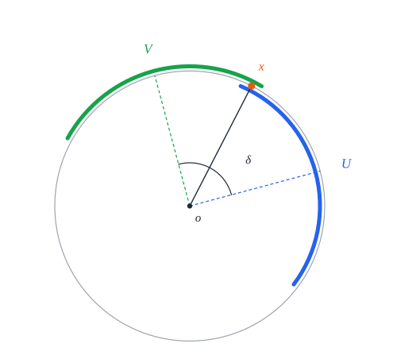
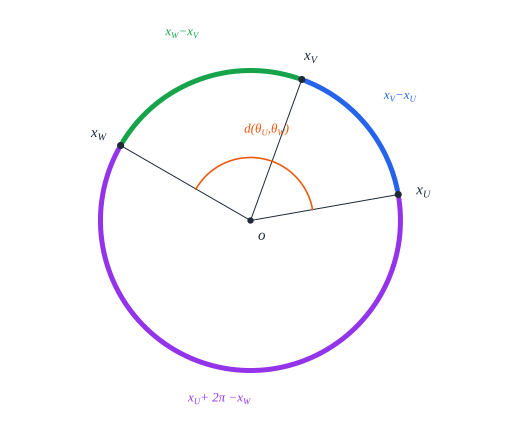
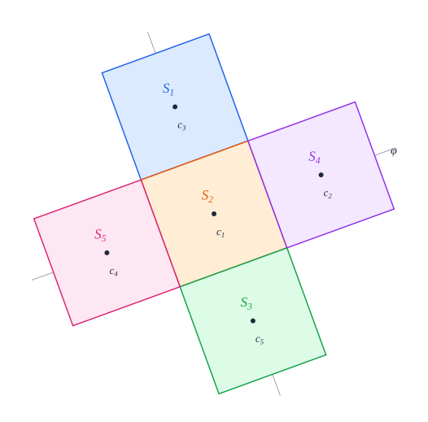

# 3. Tools

[Contents](README.md) · [← 2. Preliminaries](preliminaries.md) · [4. One square →](one.md)

This chapter collects the tools that several cases share. From now on the disk
centre $o$ is a fixed point, and "square" means unit square. Each section
defines its notions and proves the lemmas about them; the case chapters cite
both by number. Table 3.1 shows which cases use which lemmas, including those
used only inside other lemmas of this chapter. Every case also uses Lemma 2.8
for its construction and Corollary 2.10 to conclude.

| section | Ch. 4 | Ch. 5 | Ch. 6 | Ch. 7 | Ch. 8 | Ch. 9 |
| --- | :-: | :-: | :-: | :-: | :-: | :-: |
| [§3.1](#31-the-disk-centre-seen-from-a-square) the disk centre seen from a square | 3.4 | 3.4 | 3.4 | 3.4 | 3.4 | 3.4 |
| [§3.2](#32-contact-polygons) contact polygons | | | 3.6 | 3.6 | 3.6 | |
| [§3.3](#33-two-disjoint-squares) two disjoint squares | | 3.9, 3.10 | | 3.12 | 3.9 to 3.13 | 3.12 |
| [§3.4](#34-arcs-and-the-angular-budget) arcs and the angular budget | | 3.17 | 3.16 to 3.18 | 3.16, 3.17, 3.19 | 3.16 | 3.16, 3.19 |
| [§3.5](#35-charts) charts | 3.21, 3.22 | 3.21, 3.22 | 3.21, 3.22 | 3.21, 3.22 | 3.21 | 3.21, 3.22 |
| [§3.6](#36-arcs-of-an-exterior-square) arcs of an exterior square | | 3.24 | 3.24 | 3.24 | 3.24 | |
| [§3.7](#37-the-radial-sweep) the radial sweep | | | | | 3.26 to 3.28 | |
| [§3.8](#38-elementary-estimates) elementary estimates | | | 3.29 | | 3.29 | 3.29 |
| [§3.9](#39-recognising-a-model) recognising a model | 3.31 | 3.30, 3.31 | 3.30, 3.31 | 3.30, 3.31 | 3.30, 3.31 | 3.30, 3.31 |

*Table 3.1.* The results of this chapter used by the chapter of each case.

## 3.1 The disk centre seen from a square

Whether a square fits in a disk about $o$ depends only on where $o$ lies
relative to the square, and two numbers record that.

### Definition 3.1 (position of the disk centre)

For a square $S$, let

```math
a_S = \max\left(|x_S(o)|, |y_S(o)|\right), \qquad b_S = \min\left(|x_S(o)|, |y_S(o)|\right),
```

the offsets of $o$ from $c_S$ along the two axes of $S$, larger first. A
quarter turn of the frame changes neither $S$ (Definition 2.1) nor these two
numbers, and one of the four quarter turns puts $o$ in the closed first
quadrant of the frame. We draw squares in that frame: there both local
coordinates of $o$ are nonnegative, and they are $a_S$ and $b_S$ in some order.


*Figure 3.1.* A square in its own frame, turned so that $o$ lies in the first
quadrant. From the centre $c_S$, the disk centre $o$ is $a_S$ along one axis
and $b_S$ along the other.

*Lean: [`alpha`](../../SquaresInCircles/Common/Basic.lean#L81),
[`beta`](../../SquaresInCircles/Common/Basic.lean#L82),
[`SquareChart.transfer`](../../SquaresInCircles/Common/Charts.lean#L69). (The
formal offsets come in the order of the frame; every statement is symmetric in
them.)*

### Definition 3.2 (containing and exterior squares)

A square $S$ is *containing* if $o \in S^\circ$, that is, if $a_S < \frac12$,
and *exterior* otherwise, that is, if $a_S \ge \frac12$. Two disjoint squares
cannot both be containing, since $o$ would lie in both open squares. So a
packing has at most one containing square, and a packing of two or more
squares has an exterior square.


*Figure 3.2.* Left, $o$ lies in $S^\circ$ and $a_S < \frac12$. Right, $o$ lies
outside $S^\circ$ and $a_S \ge \frac12$.

*Lean: [`openSquare`](../../SquaresInCircles/Geometry.lean#L58),
[`exists_exterior`](../../SquaresInCircles/Common/ArcBudget.lean#L15).*

### Definition 3.3 (farthest-vertex function)

For real numbers $a$ and $b$, let

```math
\varphi(a, b) = \left(a + \tfrac12\right)^2 + \left(b + \tfrac12\right)^2 .
```

For a square $S$, $\varphi(a_S, b_S)$ is the squared distance from $o$ to the
vertex of $S$ farthest from it (Lemma 3.4).

*Lean: [`phi`](../../SquaresInCircles/Common/Basic.lean#L100).*

### Lemma 3.4 (farthest vertex)

For every square $S$, the vertex of $S$ farthest from $o$ is at squared
distance $\varphi(a_S, b_S)$ from $o$, and the centre is at squared distance
$a_S^2 + b_S^2$. In particular, if $\overline{S}$ lies in the closed disk
$\overline{D}(o, R)$, then

```math
\varphi(a_S, b_S) \le R^2 . \tag{3.1}
```


*Figure 3.3.* The farthest vertex, $(-\frac12, -\frac12)$ in the frame of the
figure, is $a_S + \frac12$ across and $b_S + \frac12$ down from $o$.

*Proof.* Work in the frame of $S$ turned as in Definition 3.1 (Figure 3.3);
distances can be computed in local coordinates, since these are an isometry.
There $o = (x, y)$ with $x, y \ge 0$, and $x, y$ are $a_S, b_S$ in some order.
The vertices are $(\pm\frac12, \pm\frac12)$. The vertex $(-\frac12, -\frac12)$,
across both axes from $o$, is at squared distance
$(x + \frac12)^2 + (y + \frac12)^2 = \varphi(a_S, b_S)$, since $\varphi$ is
symmetric. No vertex is farther, because $|x \mp \frac12| \le x + \frac12$ and
$|y \mp \frac12| \le y + \frac12$. The centre is at squared distance
$x^2 + y^2 = a_S^2 + b_S^2$. If $\overline{S} \subseteq \overline{D}(o, R)$,
the farthest vertex is in the disk, which is (3.1). $\square$

*Remark.* The case chapters use the disk only through (3.1), one inequality for
each square. Every uniqueness proof starts from these inequalities and from
then on works only with the pairs $(a_S, b_S)$ and the disjointness of the
squares.

*Lean: [`phi_le_of_contained`](../../SquaresInCircles/Common/Basic.lean#L109),
[`Packing.phi_le`](../../SquaresInCircles/Common/Basic.lean#L122),
[`local_center_norm`](../../SquaresInCircles/Common/Basic.lean#L95),
[`exists_signed`](../../SquaresInCircles/Common/Basic.lean#L103).*

## 3.2 Contact polygons

By Lemma 3.4, a packing in a disk of radius $R$ has $\varphi(a_S, b_S) \le R^2$
for every square $S$. Plot each square $S$ as the point $(a_S, b_S)$ of an
auxiliary plane with coordinates $a$ and $b$, the *$(a, b)$-plane*; it is not
the plane the squares lie in. There the constraint is curved:
$\varphi(a, b)$ is the squared distance from $(a, b)$ to
$(-\frac12, -\frac12)$, so $\lbrace \varphi \le K \rbrace$ is a disk. The
proofs replace it by a polygon of tangent lines.

### Definition 3.5 (tangent half-plane)

Let $K > 0$ and let $(u, v)$ be a point with $\varphi(u, v) = K$. The *tangent
half-plane* at $(u, v)$ is the set of points $(a, b)$ with

```math
\left(u + \tfrac12\right)(a - u) + \left(v + \tfrac12\right)(b - v) \le 0 :
```

the side of the tangent line to the circle $\lbrace \varphi = K \rbrace$ at
$(u, v)$ that contains the disk $\lbrace \varphi \le K \rbrace$ (Lemma 3.6).


*Figure 3.4.* The disk $\lbrace \varphi \le K \rbrace$ is centred at
$(-\frac12, -\frac12)$. The tangent half-plane at a boundary point $(u, v)$
contains it.

*Lean: [`tangent_le`](../../SquaresInCircles/Common/Tangents.lean#L20).*

### Lemma 3.6 (tangent lines)

For all real $a, b, u, v$,

```math
\varphi(a,b) - \varphi(u,v) = 2\left(u+\tfrac12\right)(a-u) + 2\left(v+\tfrac12\right)(b-v) + (a-u)^2 + (b-v)^2 .
```

So if $\varphi(u, v) = K$ and $\varphi(a, b) \le K$, then $(a, b)$ lies in the
tangent half-plane at $(u, v)$, and strictly inside it if $a \ne u$.

*Proof.* For the first coordinate,

```math
\left(a + \tfrac12\right)^2 - \left(u + \tfrac12\right)^2 = \left((a - u) + \left(u + \tfrac12\right)\right)^2 - \left(u + \tfrac12\right)^2 = 2\left(u + \tfrac12\right)(a - u) + (a - u)^2 ,
```

and likewise for the second; adding gives the identity. If $\varphi(u, v) = K$
and $\varphi(a, b) \le K$, the left side is at most 0, so

```math
2\left(u+\tfrac12\right)(a-u) + 2\left(v+\tfrac12\right)(b-v) \le -(a - u)^2 - (b - v)^2 \le 0 ,
```

and the right side is negative if $a \ne u$. $\square$

*Lean: [`tangent_identity`](../../SquaresInCircles/Common/Tangents.lean#L15),
[`tangent_le`](../../SquaresInCircles/Common/Tangents.lean#L20),
[`tangent_lt`](../../SquaresInCircles/Common/Tangents.lean#L26).*

### Definition 3.7 (contact polygon)

A *contact polygon* of level $K$ is an intersection of finitely many tangent
half-planes of the circle $\lbrace \varphi = K \rbrace$. Each case takes $K$ to
be the square of its optimal radius, and takes its points of tangency from the
pairs $(a_S, b_S)$ of the squares of its optimal packing, together with their
mirror images in the diagonal $a = b$; five squares add one more point of
tangency, on the diagonal. Three and five squares use polygons
$P_3$ and $P_5$, defined in [Definition 6.4](three.md#definition-64-the-16-gon) and [Definition 8.4](five.md#definition-84-the-12-gon); four squares use the
single half-plane at $(\frac12, \frac12)$, the diamond $a + b \le 1$ of
[Lemma 7.4](four.md#lemma-74-the-diamond).


*Figure 3.5.* The contact polygons of three, four and five squares, where
$a, b \ge 0$, around the disks
$\lbrace \varphi \le \frac{425}{256} \rbrace$, $\lbrace \varphi \le 2 \rbrace$
and $\lbrace \varphi \le \frac52 \rbrace$. The dots are the points of tangency,
and the dashed lines the tangents there.

*Lean: [`tangent_le`](../../SquaresInCircles/Common/Tangents.lean#L20),
[`tangent_lt`](../../SquaresInCircles/Common/Tangents.lean#L26).*

### Definition 3.8 (the octagon)

The *octagon* $P_8$ is the set of points $(a, b)$ with

```math
3a + b \le 3, \qquad a + 3b \le 3 ,
```

the tangent half-planes of the circle $\varphi = \frac52$ at $(1, 0)$ and
$(0, 1)$. Indeed $\varphi(1, 0) = \frac94 + \frac14 = \frac52$, and at $(1, 0)$
the inequality of Definition 3.5 reads $\frac32(a - 1) + \frac12 b \le 0$, that
is $3a + b \le 3$; the point $(0, 1)$ is its mirror image. The two
inequalities are symmetric in $a$ and $b$. Applied to the absolute values of
the two local coordinates of $o$, in either order and with either signs, the
two lines become eight, hence the name. The 12-gon $P_5$ of five squares lies
inside $P_8$, and $P_8$ keeps the radial sweep of §3.7 away from the other
squares.


*Figure 3.6.* The disk $\lbrace \varphi \le \frac52 \rbrace$ and the part of
$P_8$ with $a, b \ge 0$, cut out by the tangents at $(1, 0)$ and $(0, 1)$. The
dotted third tangent cuts off the corner; five squares add it.

![The plane of the local coordinates x_S(o), y_S(o) of the disk centre. The eight dashed lines, plus or minus 3x plus or minus y = 3 and plus or minus x plus or minus 3y = 3, cut out the octagon P8 with vertices (plus or minus 1, 0), (0, plus or minus 1) and (plus or minus 3/4, plus or minus 3/4). Inside it lies the region where phi(|x|, |y|) is at most 5/2, bounded by four circular arcs through (plus or minus 1, 0) and (0, plus or minus 1), and inside that the dashed unit square S about its centre](figures/front-octagon.svg)

*Figure 3.7.* The octagon in the plane of the local coordinates
$(x_S(o), y_S(o))$ of the disk centre: $(a_S, b_S) \in P_8$ exactly when this
point lies in the octagon cut out by the eight lines. Inside it lies the region
$\varphi(|x_S(o)|, |y_S(o)|) \le \frac52$, where $S$ fits in the disk of radius
$\sqrt{5/2}$ about $o$ (Lemma 3.4); the dashed square is $S$ itself.

*Lean: [`P8`](../../SquaresInCircles/Common/Tangents.lean#L31).*

## 3.3 Two disjoint squares

### Lemma 3.9 (inscribed disks)

Let $S$ be a square.

1. The open disk $D(c_S, \frac12)$ lies in $S^\circ$.
2. If $a_S \le \alpha$ and $b_S \le \alpha$ for some $\alpha < \frac12$, then
   the open disk $D(o, \frac12 - \alpha)$ lies in $S^\circ$.


*Figure 3.8.* The disk of radius $\frac12$ about $c_S$, and the disk of radius
$\frac12 - \alpha$ about $o$, both inside $S$.

*Proof.* (2) Let $|p - o| < \frac12 - \alpha$. Each local coordinate of $p$
differs from that of $o$ by at most $|p - o|$, since the local coordinates are
an isometry, and the local coordinates of $o$ are at most $\alpha$ in absolute
value. So $|x_S(p)| < \alpha + (\frac12 - \alpha) = \frac12$, and likewise
$|y_S(p)| < \frac12$. (1) The same argument with $c_S$ in place of $o$, whose
local coordinates are both 0, and $\alpha = 0$. $\square$

*Lean: [`inscribed_disk_mem`](../../SquaresInCircles/Common/Basic.lean#L128),
[`small_disk_in_openSquare`](../../SquaresInCircles/Common/Basic.lean#L144).*

### Lemma 3.10 (centres at least 1 apart)

If $S$ and $T$ are disjoint squares, then $|c_T - c_S| \ge 1$.


*Figure 3.9.* If the centres were less than 1 apart, the midpoint $m$ would
lie in both inscribed disks.

*Proof.* Otherwise the midpoint $m$ of the two centres is at distance
$\frac12|c_T - c_S| < \frac12$ from each of them, so by Lemma 3.9 (1) it lies
in $S^\circ$ and in $T^\circ$. $\square$

*Lean:
[`centers_distance_sq_ge_one`](../../SquaresInCircles/Common/Contacts.lean#L74).*

### Definition 3.11 (width)

For a square $S$ and a vector $n$, the *width* of $S$ in the direction $n$ is

```math
w_S(n) = \tfrac12\left(|\langle n, e^S_1\rangle| + |\langle n, e^S_2\rangle|\right) = \max_{p \in \overline{S}} \langle n,\ p - c_S\rangle .
```

Indeed a point of $\overline{S}$ is $p = c_S + s\,e^S_1 + t\,e^S_2$ with
$|s|, |t| \le \frac12$, and
$\langle n, p - c_S\rangle = s\langle n, e^S_1\rangle + t\langle n, e^S_2\rangle$
is largest when $s$ and $t$ are $\pm\frac12$ with the signs of the two inner
products. For $p \in S^\circ$ we have $|s|, |t| < \frac12$, and if $n \ne 0$
one of the inner products is nonzero, so
$|\langle n, p - c_S\rangle| < w_S(n)$. The width is the half-width of the
shadow of $S$ on the line of $n$, in units of $|n|$.


*Figure 3.10.* For a unit vector $n$, the square reaches $w_S(n)$ beyond its
centre in the direction $n$.

*Lean: [`width`](../../SquaresInCircles/Common/Separation.lean#L69),
[`closed_dot_bound`](../../SquaresInCircles/Common/Support.lean#L97),
[`dot_open_bound_of_ne`](../../SquaresInCircles/Common/Support.lean#L70).*

### Lemma 3.12 (supporting line)

Let $S$ and $T$ be disjoint squares.

1. There is a vector $n \ne 0$ with

   ```math
   w_S(n) + w_T(n) \le \langle n,\ c_T - c_S\rangle .
   ```

   In words: some line separates the two squares, each lying on its own side.
2. No point of the closed square $\overline{S}$ lies in $T^\circ$.


*Figure 3.11.* Disjoint squares have disjoint shadows in some direction $n$.
Each shadow reaches $w(n)$ on either side of the shadow of the centre.

*Idea of the proof.* The separation theorem gives a separating line. Pushing
test points out towards the vertices of each square shows that the line clears
both squares by their full widths.


*Figure 3.12.* The proof of (1), with $n$ horizontal. The point a fraction $t$
of the way from $c_S$ to the vertex of $S$ that maximises
$\langle n, \cdot\rangle$ lies in $S^\circ$ (hollow dot), and likewise for $T$
with the vertex that minimises it, so the separating line
$\langle n, \cdot\rangle = \kappa$ passes between the two points. As
$t \to 1$ the points reach the dashed supporting lines, at $w_S(n)$ beyond
$c_S$ and $w_T(n)$ before $c_T$.

*Proof.* The open squares are disjoint, open, convex and nonempty, so by the
separation theorem for disjoint open convex sets there are a vector $n \ne 0$
and a number $\kappa$ with

```math
\langle n, p\rangle < \kappa < \langle n, q\rangle \qquad \text{for all } p \in S^\circ,\ q \in T^\circ .
```

Fix $0 \le t < 1$. The point of the segment from $c_S$ to the vertex of $S$
that maximises $\langle n, \cdot\rangle$, a fraction $t$ of the way, lies in
$S^\circ$, and its value is $\langle n, c_S\rangle + t\,w_S(n)$. In the same
way, the point a fraction $t$ of the way from $c_T$ to the vertex of $T$ that
minimises $\langle n, \cdot\rangle$ lies in $T^\circ$ and has value
$\langle n, c_T\rangle - t\,w_T(n)$. Therefore

```math
\langle n, c_S\rangle + t\,w_S(n) < \langle n, c_T\rangle - t\,w_T(n)
\qquad \text{for every } 0 \le t < 1,
```

and letting $t \to 1$ proves (1). For (2), let $p \in \overline{S}$ and
$q \in T^\circ$. By Definition 3.11, applied to $n$ for $S$ and to $-n$ for $T$,

```math
\langle n, p\rangle \le \langle n, c_S\rangle + w_S(n) \le \langle n, c_T\rangle - w_T(n) < \langle n, q\rangle ,
```

so $p \ne q$. $\square$

*Lean:
[`support_separator`](../../SquaresInCircles/Common/Separation.lean#L114),
[`closed_open_disjoint`](../../SquaresInCircles/Common/Support.lean#L108).*

### Lemma 3.13 (squares at distance 1)

If $S$ and $T$ are disjoint and $|c_T - c_S| = 1$, then $T$ has its sides
parallel to those of $S$ and shares a full edge with it: $c_T - c_S$ is one of
$\pm e^S_1, \pm e^S_2$.


*Figure 3.13.* At distance exactly 1 the squares share a full edge.


*Figure 3.14.* The width of a square $U$ in a unit direction $n$, against the
angle between $n$ and a side of $U$. It is $\frac12$ exactly when $n$ is
parallel to a side, and more otherwise, up to $\frac{\sqrt2}2$ along a
diagonal; the proof uses the minimum.

*Proof.* Take $n$ from Lemma 3.12 (1) and put $d = c_T - c_S$, a unit vector.
For any square $U$,

```math
\left(|\langle n, e^U_1\rangle| + |\langle n, e^U_2\rangle|\right)^2 \ge \langle n, e^U_1\rangle^2 + \langle n, e^U_2\rangle^2 = |n|^2 ,
```

so $w_U(n) \ge \frac12|n|$, with equality exactly when one of the two inner
products vanishes, that is, when $n$ is parallel to a side of $U$. Therefore

```math
|n| \le w_S(n) + w_T(n) \le \langle n, d\rangle \le |n|\,|d| = |n| ,
```

and all three inequalities are equalities. Equality in the Cauchy–Schwarz
inequality, with $\langle n, d\rangle > 0$, makes $d = n/|n|$. Equality in the
first step makes $w_S(n) = w_T(n) = \frac12|n|$, so $n$ is parallel to a side
of $S$ and to a side of $T$. So $d$ is a unit vector along an axis of $S$, that
is, one of $\pm e^S_1, \pm e^S_2$, and the sides of $T$ are parallel to $d$ and
to its perpendicular, hence to those of $S$. A square with the same axes whose
centre is one unit away along an axis shares the corresponding edge. $\square$

*Lean: [`unit_contact`](../../SquaresInCircles/Common/Contacts.lean#L105).*

## 3.4 Arcs and the angular budget

The main tool for three to five squares measures how much of a small circle
about $o$ each square covers. Disjoint squares cover disjoint parts of the
circle, and together they cannot cover more than all of it.

### Definition 3.14 (circles about the disk centre)

For $r > 0$, the circle of radius $r$ about $o$ is

```math
\Gamma_r = \lbrace o + r\,u(\theta) : \theta \text{ a direction} \rbrace ,
```

and we label its points by their directions. Angles between points of
$\Gamma_r$ are measured by the angle $d$ of §2.1.


*Figure 3.15.* Two directions $\theta, \theta'$ seen from $o$, the unit vector
$u(\theta)$, and the angle $d(\theta, \theta')$ between them.

*Lean: [`circlePoint`](../../SquaresInCircles/Common/AngularBudget.lean#L21),
[`direction_dist`](../../SquaresInCircles/Common/AngularBudget.lean#L30).*

### Definition 3.15 (arc)

Let $U$ be a set in the plane and $r > 0$. An *arc of $U$ on $\Gamma_r$* with
*centre* $\theta_0$ and *half-width* $w \in (0, \pi]$ is the set of points
$o + r\,u(\theta)$ with $d(\theta, \theta_0) < w$, provided all of them lie in
$U$. It need not be all of $\Gamma_r \cap U$. When $U$ is an open square
$S^\circ$, we say that $S$ *holds* the arc.


*Figure 3.16.* An arc of $U$ with centre $\theta_0$ and half-width $w$ (thick).
It need not cover all of $\Gamma_r \cap U$ (thin).

*Lean: [`OpenArc`](../../SquaresInCircles/Common/AngularBudget.lean#L38).*


*Figure 3.17.* Disjoint squares hold disjoint arcs of the same circle, so the
arcs share its $2\pi$ of angle.

### Lemma 3.16 (angular budget)

If the sets $U_1, \dots, U_n$ are pairwise disjoint and $U_i$ holds an arc of
half-width $w_i$ on a common circle $\Gamma_r$, then

```math
w_1 + \dots + w_n \le \pi .
```

In particular it cannot happen that every $w_i \ge \frac\pi n$ and one of them
is strictly larger.

*Proof.* Measure sets of directions by length, the Lebesgue measure on
$\mathbb{R}/2\pi\mathbb{Z}$, of total $2\pi$; a closed arc of directions
$\lbrace \theta : d(\theta, \theta_0) \le v \rbrace$ with $0 \le v \le \pi$ has
length $2v$. Let $\theta_i$ be the centre of the arc of $U_i$. Fix
$0 \le t < 1$, and consider the closed arcs of directions of half-width
$t w_i$ about the $\theta_i$. They are pairwise disjoint: a direction $\theta$
in two of them, $i \ne j$, has $d(\theta, \theta_i) \le t w_i < w_i$ and
$d(\theta, \theta_j) < w_j$, so the point $o + r\,u(\theta)$ lies in $U_i$ and
in $U_j$. Their lengths $2t w_i$ therefore add up to at most $2\pi$, so
$t(w_1 + \dots + w_n) \le \pi$ for every $t < 1$, and the claim follows. If
every $w_i \ge \frac\pi n$ and one is larger, the sum exceeds $\pi$. $\square$

Shrinking first means the proof never has to measure the endpoints of an open
arc.


*Figure 3.18.* The shrinking step for the T of Chapter 6 on $\Gamma_{3/8}$.
The three squares hold open arcs of half-width $w = \frac\pi3$ (thin), which
meet at endpoints that lie in none of them (hollow). The closed arcs of
half-width $t w$ for $t < 1$ (thick, here $t = \frac45$) are disjoint, so their
lengths add up to at most $2\pi$.

*Lean:
[`open_arc_budget`](../../SquaresInCircles/Common/AngularBudget.lean#L65),
[`closed_arc_budget`](../../SquaresInCircles/Common/AngularBudget.lean#L48),
[`uniform_arc_excess`](../../SquaresInCircles/Common/AngularBudget.lean#L79).*

### Lemma 3.17 (disjoint arcs have separated centres)

If disjoint sets $U$ and $V$ hold arcs on the same circle $\Gamma_r$, with
centres $\theta_U, \theta_V$ and half-widths $w_U, w_V$, then

```math
d(\theta_U, \theta_V) \ge w_U + w_V .
```

In particular, disjoint half circles, with $w_U = w_V = \frac\pi2$, have
opposite centres: $\theta_V = \theta_U + \pi$.


*Figure 3.19.* The centres of two disjoint arcs are at least $w_U + w_V$
apart.



*Figure 3.20.* The proof: if the centres were $\delta < w_U + w_V$ apart, the
direction $x$ that divides the angle between them in the ratio $w_U : w_V$
would be within $w_U$ of $\theta_U$ and within $w_V$ of $\theta_V$, and its
point on $\Gamma_r$ would lie in both $U$ and $V$.

*Proof.* Suppose $\delta = d(\theta_U, \theta_V) < w_U + w_V$, and take
representatives $x_U, x_V$ of the two directions with $|x_V - x_U| = \delta$.
The direction of
$x = x_U + \frac{w_U}{w_U + w_V}(x_V - x_U)$ is at angle at most
$\frac{w_U}{w_U + w_V}\delta < w_U$ from $\theta_U$ and at most
$\frac{w_V}{w_U + w_V}\delta < w_V$ from $\theta_V$. So its point on $\Gamma_r$
lies in $U$ and in $V$, a contradiction. For half circles this gives
$d(\theta_U, \theta_V) \ge \pi$, and only opposite directions are $\pi$ apart.
$\square$

*Lean:
[`OpenArc.centers_separated`](../../SquaresInCircles/Common/ArcMetric.lean#L28),
[`OpenArc.opposite`](../../SquaresInCircles/Common/Angles.lean#L32),
[`antipodal_of_distance`](../../SquaresInCircles/Common/Angles.lean#L24).*

### Lemma 3.18 (three arcs)

If pairwise disjoint sets $U, V, W$ hold arcs on the same circle $\Gamma_r$,
with centres $\theta_U, \theta_V, \theta_W$ and half-widths $w_U, w_V, w_W$,
then

```math
w_V + w_W \le d(\theta_V, \theta_W) \le 2\pi - 2w_U - w_V - w_W ,
```

and in particular $w_U + w_V + w_W \le \pi$.


*Figure 3.21.* The short way from $\theta_V$ to $\theta_W$ crosses half of $V$
and half of $W$. The long way crosses those halves and all of $U$.



*Figure 3.22.* Representatives $x_U \le x_V \le x_W < x_U + 2\pi$ cut the
circle into three gaps that add up to $2\pi$. Each angle between two of the
directions is at most the gap between their representatives: here
$d(\theta_U, \theta_W)$ is shorter than the gap $x_U + 2\pi - x_W$.

*Proof.* First, any three directions have
$d(\theta_U, \theta_V) + d(\theta_V, \theta_W) + d(\theta_U, \theta_W) \le 2\pi$.
Indeed, take a representative $x_U$ of $\theta_U$ and representatives
$x_V, x_W \in [x_U, x_U + 2\pi)$ of the other two, and exchange the names $V$
and $W$ if needed so that $x_U \le x_V \le x_W < x_U + 2\pi$; since $x_U + 2\pi$
also represents $\theta_U$, the three angles are at most $x_V - x_U$,
$x_W - x_V$ and $x_U + 2\pi - x_W$, which add up to $2\pi$. Now bound
$d(\theta_U, \theta_V) \ge w_U + w_V$ and $d(\theta_U, \theta_W) \ge w_U + w_W$
by Lemma 3.17 to get the upper bound, and use Lemma 3.17 for $V$ and $W$ to
get the lower bound. Comparing the two bounds gives
$2(w_U + w_V + w_W) \le 2\pi$. $\square$

This gives the budget for three sets without measure theory, and it also
locates the centres, which the uniqueness proofs use.

*Lean:
[`OpenArc.third_distance_bounds`](../../SquaresInCircles/Common/ArcMetric.lean#L93),
[`triple_arc_budget`](../../SquaresInCircles/Common/ArcMetric.lean#L106),
[`direction_triangle_perimeter`](../../SquaresInCircles/Common/ArcMetric.lean#L68).*

### Lemma 3.19 (regular polygons)

Let $m \ge 1$ and $0 \le g \le 2\pi$, and let $m$ directions be pairwise at
least $g$ apart.

1. $mg \le 2\pi$.
2. If $mg = 2\pi$, then for some direction $\theta_0$ the directions are, in
   some order, $\theta_0, \theta_0 + g, \dots, \theta_0 + (m - 1)g$.


*Figure 3.23.* Four directions pairwise at least $\frac\pi2$ apart: the only
way is a quarter grid.


*Figure 3.24.* The proof for six directions and $g = \frac\pi3$. Sorted, the
directions cut the circle into six gaps, the last one from $p_5$ round to
$p_0 + 2\pi$. Each gap is at least $g$, since its two ends represent
directions at least $g$ apart; unrolled, the gaps add up to $2\pi = 6g$, so
each is exactly $g$.

*Proof.* Represent the directions by real numbers in $(-\pi, \pi]$, sorted:
$p_0 \le p_1 \le \dots \le p_{m-1}$. The $m$ gaps $p_1 - p_0, \dots, p_{m-1} - p_{m-2}$ and
$p_0 + 2\pi - p_{m-1}$ are nonnegative and add up to $2\pi$. Each of them is at
least the angle between the two directions it joins, since both ends of each
gap represent those directions, hence at least $g$ (for $m = 1$ the one gap is
$2\pi \ge g$). (1) So $mg \le 2\pi$. (2) As $m$ gaps of at least $g$ add up to
$mg = 2\pi$, every gap equals $g$, and $p_i = p_0 + ig$. Take $\theta_0$ the
direction of $p_0$. $\square$

*Lean: [`directions_budget`](../../SquaresInCircles/Common/Angles.lean#L68),
[`regular_polygon`](../../SquaresInCircles/Common/Angles.lean#L80),
[`sorted_directions`](../../SquaresInCircles/Common/Angles.lean#L42).*

## 3.5 Charts

To find the arcs that a square holds, we turn the picture about $o$, and
reflect it if needed, until the square sits in a standard position.

### Definition 3.20 (chart)

A *chart* of a square $S$ is a direction $\theta_S$, the *phase*, and a sign
$\varepsilon_S = \pm 1$, the *orientation*, such that for all real $r, t, m$

```math
o + r\,u(\theta_S + \varepsilon_S t) - m\,(c_S - o) \in S^\circ
\iff
\left|r\cos t - (1+m)a_S\right| < \tfrac12 \ \text{ and } \ \left|r\sin t - (1+m)b_S\right| < \tfrac12 . \tag{3.2}
```

Take $m = 0$ first. Condition (3.2) says: measure angles from $o$ as
$\theta_S + \varepsilon_S t$, and use $t$ as the angle variable, the *chart
angle*; then $S$ is the axis-parallel square $Q(a_S, b_S)$. The parameter $m$
slides $S$ away from $o$ along the ray through its centre: the left side of
(3.2) says that $o + r\,u(\theta_S + \varepsilon_S t)$ lies in
$S^\circ + m(c_S - o)$, and in the chart that square is centred at
$(1 + m)(a_S, b_S)$. Lemma 3.21 shows that every square has a chart.


*Figure 3.25.* Left: a square seen from $o$. Right: its chart. Turning by
$-\theta_S$, and reflecting when $\varepsilon_S = -1$, puts the square in
standard position, centred at $(a_S, b_S)$; the point at angle
$\theta_S + \varepsilon_S t$ goes to the point at chart angle $t$.

*Lean: [`SquareChart`](../../SquaresInCircles/Common/Charts.lean#L46),
[`ChartCondition`](../../SquaresInCircles/Common/Charts.lean#L40),
[`chartAngle`](../../SquaresInCircles/Common/Charts.lean#L35).*

### Lemma 3.21 (charts)

Every square $S$ has a chart $(\theta_S, \varepsilon_S)$, and for every chart:

1. $o \in S^\circ$ exactly when $a_S < \frac12$; an exterior square has
   $a_S \ge \frac12$.
2. Let $r > 0$, and suppose every chart angle $t$ in an open interval $(l, h)$
   of length at most $2\pi$ gives a point of $S$ on $\Gamma_r$, that is,
   $|r\cos t - a_S| < \frac12$ and $|r\sin t - b_S| < \frac12$. Then $S$ holds
   the arc of $\Gamma_r$ with centre $\theta_S + \varepsilon_S\frac{l + h}2$ and
   half-width $\frac{h - l}2$.

*Idea of the proof.* Rotate so that an axis of $S$ points along the phase,
then reflect and turn by quarter and half turns so that the centre of $S$ lands
at $(a_S, b_S)$.

![Four panels with the same tilted square S and disk centre o. Each shows the two axes of a chart at o, labelled t = 0 and t = pi/2, a curved arrow for the sense of increasing t, and an orange path from o along the first axis and then the second to the centre of S. The panels are a chart (theta, epsilon), with the centre at (X, Y); the reversal (theta, minus epsilon), at (X, minus Y); the half turn (theta plus pi, epsilon), at (minus X, minus Y); and the exchange (theta plus epsilon pi/2, minus epsilon), at (Y, X)](figures/front-chart-moves.svg)

*Figure 3.26.* The three moves of the proof, for one square $S$. Each panel
shows the axes $t = 0$ and $t = \frac\pi2$ of a chart at $o$, with an arrow for
the sense in which the chart angle $t$ increases, and the chart coordinates of
$c_S$: $(X, Y)$ for $(\theta, \varepsilon)$, then $(X, -Y)$ after the reversal,
$(-X, -Y)$ after the half turn and $(Y, X)$ after the exchange.

*Proof.* Let $\theta$ be the direction of $e^S_1$, so that $e^S_1 = u(\theta)$
and $e^S_2 = u(\theta + \frac\pi2)$, and write $c_S - o = X e^S_1 + Y e^S_2$.
Since $\langle u(\theta + t), u(\theta)\rangle = \cos t$ and
$\langle u(\theta + t), u(\theta + \frac\pi2)\rangle = \sin t$, the point
$o + r\,u(\theta + t) - m(c_S - o)$ has local coordinates
$\left(r\cos t - (1 + m)X,\ r\sin t - (1 + m)Y\right)$. So the pair
$(\theta, 1)$ satisfies (3.2) with $(X, Y)$ in place of $(a_S, b_S)$. Suppose
now that $(\theta, \varepsilon)$ satisfies (3.2) with some pair $(X, Y)$ in
place of $(a_S, b_S)$. Three changes keep this true:

- *reversal:* $(\theta, -\varepsilon)$ satisfies it with $(X, -Y)$, by
  substituting $-t$ for $t$, since $\cos(-t) = \cos t$ and
  $\sin(-t) = -\sin t$;
- *half turn:* $(\theta + \pi, \varepsilon)$ satisfies it with $(-X, -Y)$, by
  substituting $t + \pi$ for $t$;
- *exchange:* $(\theta + \varepsilon\frac\pi2, -\varepsilon)$ satisfies it
  with $(Y, X)$, by substituting $\frac\pi2 - t$ for $t$, since
  $\theta + \varepsilon\frac\pi2 - \varepsilon t = \theta + \varepsilon(\frac\pi2 - t)$,
  $\cos(\frac\pi2 - t) = \sin t$ and $\sin(\frac\pi2 - t) = \cos t$.

Doing nothing, a reversal, a half turn, or a half turn followed by a reversal
makes the pair $(|X|, |Y|)$, and an exchange then puts the larger entry first. The result is
$(a_S, b_S)$, since $|X| = |x_S(o)|$ and $|Y| = |y_S(o)|$. This proves that a
chart exists.

(1) At $r = m = 0$, condition (3.2) reads: $o \in S^\circ$ exactly when
$a_S < \frac12$ and $b_S < \frac12$, that is, when $a_S < \frac12$, since
$b_S \le a_S$. (2) The directions within angle $\frac{h - l}2$ of
$\theta_S + \varepsilon_S\frac{l + h}2$ are exactly the directions
$\theta_S + \varepsilon_S t$ with $t \in (l, h)$, because $h - l \le 2\pi$; and
at $m = 0$ the hypothesis says that each such point $o + r\,u(\theta_S + \varepsilon_S t)$
lies in $S^\circ$. $\square$

*Lean: [`sorted_square_chart`](../../SquaresInCircles/Common/Charts.lean#L146),
[`square_chart`](../../SquaresInCircles/Common/Charts.lean#L133),
[`ChartCondition.reflect`](../../SquaresInCircles/Common/Charts.lean#L99),
[`ChartCondition.turn`](../../SquaresInCircles/Common/Charts.lean#L107),
[`ChartCondition.swap`](../../SquaresInCircles/Common/Charts.lean#L119),
[`SquareChart.exterior`](../../SquaresInCircles/Common/Charts.lean#L158),
[`SquareChart.arc`](../../SquaresInCircles/Common/Charts.lean#L182).*

### Lemma 3.22 (Cartesian form of a chart)

If $(\theta_S, \varepsilon_S)$ is a chart of $S$, then $S$ sits at
$(a_S, \varepsilon_S b_S)$ in the frame $\theta_S$.


*Figure 3.27.* The frame $\theta_S$ at $o$ is counterclockwise, while a chart
with $\varepsilon_S = -1$ measures the chart angle clockwise (orange), so its
axis $t = \frac\pi2$ points along $-u(\theta_S + \frac\pi2)$. The centre, at
$(a_S, b_S)$ in the chart, is at $(a_S, \varepsilon_S b_S)$ in the frame.

*Proof.* If $\varepsilon_S = -1$, a reversal (proof of Lemma 3.21) shows that
$(\theta_S, 1)$ satisfies (3.2) with $(a_S, \varepsilon_S b_S)$ in place of
$(a_S, b_S)$; if $\varepsilon_S = 1$ there is nothing to do. So, at $m = 0$,

```math
o + r\,u(\theta_S + t) \in S^\circ \iff |r\cos t - a_S| < \tfrac12 \ \text{ and } \ |r\sin t - \varepsilon_S b_S| < \tfrac12 .
```

Every point of the plane is $F_{\theta_S}(x, y)$ for some $(x, y)$, and writing
$(x, y) = (r\cos t, r\sin t)$ in polar coordinates,
$F_{\theta_S}(x, y) = o + r\cos t\,u(\theta_S) + r\sin t\,u(\theta_S + \frac\pi2) = o + r\,u(\theta_S + t)$.
So $F_{\theta_S}(x, y) \in S^\circ$ exactly when $|x - a_S| < \frac12$ and
$|y - \varepsilon_S b_S| < \frac12$, which is Definition 2.4. $\square$

*Lean:
[`SquareChart.cartesian`](../../SquaresInCircles/Common/Coordinates.lean#L41),
[`SquareChart.unreversed`](../../SquaresInCircles/Common/Coordinates.lean#L34),
[`chart_represents`](../../SquaresInCircles/Common/Congruence.lean#L148).*

## 3.6 Arcs of an exterior square

Throughout this section $S$ is an exterior square with a chart
$(\theta_S, \varepsilon_S)$, so $a_S \ge \frac12$, and $\Gamma_r$ is a circle
about $o$ with $r > 0$.

### Definition 3.23 (crossing angles)

Let $a_S - \frac12 \le r$. Put

```math
A_S = \arccos\frac{a_S - \frac12}{r}, \qquad V_S = \arcsin\frac{\frac12 - b_S}{r}, \qquad U_S = \arcsin\frac{b_S + \frac12}{r} ,
```

with the extended $\arcsin$ of §2.1, so that $U_S = \frac\pi2$ when
$b_S + \frac12 \ge r$. Since $0 \le \frac{a_S - 1/2}r \le 1$, the angle $A_S$
lies in $[0, \frac\pi2]$. In the chart, the circle $\Gamma_r$ crosses the line
of the near edge, $x = a_S - \frac12$, at the chart angles $\pm A_S$, and the
lines of the lower and the upper edge, $y = b_S \mp \frac12$, at $-V_S$ and
$U_S$ if it reaches them. The radius $r$ is fixed by the context and left out
of the notation.


*Figure 3.28.* An exterior square in its chart, with $o$ at the origin. The
circle $\Gamma_r$ crosses the line of the near edge at the angles $\pm A_S$
and the line of the lower edge at $-V_S$; it does not reach the upper edge.
The part of the circle inside the square is highlighted: here $V_S < A_S$, so
the lower edge clips it, and it runs from $-V_S$ to $A_S$.

*Lean: [`capA`](../../SquaresInCircles/Common/RectangleArcs.lean#L20),
[`capV`](../../SquaresInCircles/Common/RectangleArcs.lean#L21),
[`capU`](../../SquaresInCircles/Common/RectangleArcs.lean#L22).*

### Lemma 3.24 (arcs of an exterior square)

Let $a_S - \frac12 \le r < a_S + \frac12$, so that $\Gamma_r$ does not reach
the far edge $x = a_S + \frac12$.

1. Every chart angle $t$ with $-\min(A_S, V_S) < t < \min(A_S, U_S)$ gives a
   point of $S$ on $\Gamma_r$. So if
   $L = \min(A_S, U_S) + \min(A_S, V_S) > 0$, then $S$ holds an arc of
   $\Gamma_r$ of half-width $\frac L2$ and centre
   $\theta_S + \varepsilon_S\frac{\min(A_S, U_S) - \min(A_S, V_S)}2$.
2. *The cap.* If moreover $r \le \frac12$, $a_S - \frac12 < r$ and
   $b_S \le \frac12$, then $S$ holds the arc of chart angles from
   $-\min(A_S, V_S)$ to $A_S$, of half-width
   $\frac12\left(A_S + \min(A_S, V_S)\right)$. If $A_S \le V_S$ this cap is
   centred at the phase $\theta_S$ and has half-width $A_S$; if $V_S < A_S$
   the lower edge clips it.
3. *Half circles.* If $a_S = \frac12$ and $b_S + r \le \frac12$, then $S$
   holds the half of $\Gamma_r$ centred at $\theta_S$: the arc with centre
   $\theta_S$ and half-width $\frac\pi2$.


*Figure 3.29.* On a larger circle the arc can leave through the upper edge.
Here the circle meets the lines of the lower and the upper edge before the line
of the near edge (grey dot), and the arc runs from $-V_S$ to $U_S$.


*Figure 3.30.* Parts (2) and (3), on a circle of radius $r \le \frac12$. Left:
when $A_S \le V_S$ the cap runs from $-A_S$ to $A_S$ and is centred at the
phase. Middle: when $V_S < A_S$ the lower edge clips it, and it runs from
$-V_S$ to $A_S$. Right: when $a_S = \frac12$ and $b_S + r \le \frac12$ the near
edge passes through $o$, and the square holds the half circle from
$-\frac\pi2$ to $\frac\pi2$.

*Proof.* (1) Let $-\min(A_S, V_S) < t < \min(A_S, U_S)$. Then
$|t| < A_S \le \frac\pi2$.

- *Near edge.* The cosine decreases on $[0, \pi]$, so
  $r\cos t = r\cos|t| > r\cos A_S = a_S - \frac12$.
- *Far edge.* $r\cos t \le r < a_S + \frac12$. With the near edge,
  $|r\cos t - a_S| < \frac12$.
- *Lower edge.* We need $r\sin t > b_S - \frac12$. If
  $\frac{1/2 - b_S}r \ge 1$, then $\sin t > -1 \ge \frac{b_S - 1/2}r$, since
  $t > -\frac\pi2$. Otherwise the quotient lies in $[-1, 1)$, since
  $b_S - \frac12 \le a_S - \frac12 \le r$; so $V_S \in [-\frac\pi2, \frac\pi2)$
  with $\sin V_S = \frac{1/2 - b_S}r$, and since the sine increases on
  $[-\frac\pi2, \frac\pi2]$ and $-V_S < t < \frac\pi2$,
  $\sin t > -\sin V_S = \frac{b_S - 1/2}r$.
- *Upper edge.* We need $r\sin t < b_S + \frac12$. If
  $\frac{b_S + 1/2}r \ge 1$, this holds because $\sin t < 1$ for
  $|t| < \frac\pi2$. Otherwise $\sin t < \sin U_S = \frac{b_S + 1/2}r$, since
  $t < U_S$.

So $|r\sin t - b_S| < \frac12$ too, and Lemma 3.21 (2) turns the interval,
of length $L \le \pi$, into the arc.

(2) Here $b_S + \frac12 \ge \frac12 \ge r$, so $U_S = \frac\pi2 \ge A_S$ and
$\min(A_S, U_S) = A_S$. Also $A_S > 0$, because $\frac{a_S - 1/2}r < 1$, and
$V_S \ge 0$, because $b_S \le \frac12$; so $L = A_S + \min(A_S, V_S) > 0$ and
(1) gives the arc from $-\min(A_S, V_S)$ to $A_S$. If $A_S \le V_S$ it runs
from $-A_S$ to $A_S$, and its centre is the phase.

(3) Here $r \le \frac12 - b_S \le \frac12$ and $a_S - \frac12 = 0 < r$, so
(2) applies. Moreover $A_S = \arccos 0 = \frac\pi2$, and $V_S = \frac\pi2$
because $\frac{1/2 - b_S}r \ge 1$. By (2), $S$ holds the cap of half-width
$\frac\pi2$ centred at $\theta_S$. $\square$

*Lean: [`cap_mem`](../../SquaresInCircles/Common/RectangleArcs.lean#L26),
[`SquareChart.edge_arc`](../../SquaresInCircles/Common/RectangleArcs.lean#L53),
[`SquareChart.cap_arc`](../../SquaresInCircles/Common/RectangleArcs.lean#L71),
[`SquareChart.full_cap_arc`](../../SquaresInCircles/Common/RectangleArcs.lean#L87),
[`SquareChart.half_arc`](../../SquaresInCircles/Common/Charts.lean#L193).*

## 3.7 The radial sweep

The square that contains $o$, if there is one, may hold only a short arc of the
auxiliary circle, or none: a square centred at $o$ holds no point of a circle
of radius more than $\frac{\sqrt2}2$ about $o$. Five squares, whose auxiliary
circle has radius $\frac56$, enlarge it.

### Definition 3.25 (radial sweep)

The *radial sweep* of a square $S$ is

```math
\widehat{S} = \bigcup_{m \ge 0} \left( S^\circ + m\,(c_S - o) \right),
```

the region that $S^\circ$ covers as it slides away from $o$ along the ray
through its centre.


*Figure 3.31.* The square $S$ contains $o$ but does not reach the circle
$\Gamma_r$. Sliding it away from $o$ along the ray through its centre (dotted
copies) sweeps out $\widehat{S}$, which covers the highlighted arc. Five squares
use exactly this ([Lemma 8.10](five.md#lemma-810-the-sweep-holds-a-fifth-of-the-circle)).

*Lean: [`openRay`](../../SquaresInCircles/Common/Support.lean#L48).*

The sweep holds longer arcs than the square itself. The next two lemmas show
that it still avoids every other square, as long as every square $S$ has
$(a_S, b_S)$ in the octagon $P_8$ (Definition 3.8).

### Lemma 3.26 (octagon support)

If $(a_S, b_S) \in P_8$, then for every square $T$ and every vector $n$,

```math
|\langle n,\ c_S - o\rangle| \le w_S(n) + w_T(n) .
```


*Figure 3.32.* Over the quadrilateral $P_8 \cap \lbrace a, b \ge 0 \rbrace$,
$pa + qb$ is largest at a vertex, here $(\frac34, \frac34)$.


*Figure 3.33.* The three cases of the proof. Over the quadrilateral
$P_8 \cap \lbrace a, b \ge 0 \rbrace$ the largest value of $pa + qb$ (solid
line) is $p$, at $(1, 0)$, when $p \ge 3q$; it is $q$, at $(0, 1)$, when
$q \ge 3p$; and otherwise it is $\frac34(p + q)$, at $(\frac34, \frac34)$.

*Proof.* Let $p = |\langle n, e^S_1\rangle|$, $q = |\langle n, e^S_2\rangle|$,
$u = |\langle n, e^T_1\rangle|$ and $v = |\langle n, e^T_2\rangle|$, so that
$w_S(n) + w_T(n) = \frac{p+q}2 + \frac{u+v}2$ and
$p^2 + q^2 = u^2 + v^2 = |n|^2$. In the frame of $S$ the coordinates of
$c_S - o$ are $-x_S(o)$ and $-y_S(o)$, whose absolute values are $a_S$ and
$b_S$ in some order. So $|\langle n, c_S - o\rangle| \le pa + qb$ for a point
$(a, b)$ that is $(a_S, b_S)$ or $(b_S, a_S)$; as $P_8$ is symmetric, $(a, b)$
lies in $P_8$, with $a, b \ge 0$. We show
$pa + qb \le \max\left(p, q, \frac34(p + q)\right)$.

- If $p \ge 3q$, then $pa + qb \le \frac p3(3a + b) \le p$.
- If $q \ge 3p$, then symmetrically $pa + qb \le q$.
- Otherwise both weights below are nonnegative, and

  ```math
  pa + qb = \frac{3p - q}{8}(3a + b) + \frac{3q - p}{8}(a + 3b) \le \frac{3p - q}8\cdot 3 + \frac{3q - p}8\cdot 3 = \frac34(p + q) .
  ```

Finally, each of $p$ and $q$ is at most $|n|$, and
$|n| = \sqrt{u^2 + v^2} \le u + v$. So
$p \le \frac p2 + \frac{u+v}2 \le \frac{p+q}2 + \frac{u+v}2$, the same holds
for $q$, and $\frac34(p + q) \le \frac{p+q}2 + \frac{u+v}2$ because
$\frac{p+q}4 \le \frac{\sqrt2\,|n|}4 \le \frac{u+v}2$. $\square$

*Lean: [`octagon_support`](../../SquaresInCircles/Common/Support.lean#L18),
[`dot_center_le`](../../SquaresInCircles/Common/Support.lean#L35).*

### Lemma 3.27 (the sweep is safe)

If $S$ and $T$ are disjoint and $(a_S, b_S)$ and $(a_T, b_T)$ both lie in
$P_8$, then the sweep $\widehat{S}$ does not meet $T^\circ$.


*Figure 3.34.* The separating line between $S$ and $T$, with $n$ pointing
towards $T$. The ray from $o$ through $c_S$ points away from $T$, so the sweep
of $S$ stays on its side.

*Idea of the proof.* Take the separating line of Lemma 3.12. The octagon forces
the ray from $o$ through $c_S$ to point away from $T$ across that line, so
sliding $S$ along the ray only moves it further from $T$.

*Proof.* Take $n$ from Lemma 3.12 (1) and write $W = w_S(n) + w_T(n)$.

1. *Where $o$ lies.* By Lemma 3.26 applied to $S$ and to $T$,
   $|\langle n, c_S - o\rangle| \le W$ and $|\langle n, c_T - o\rangle| \le W$.
   Their difference is $\langle n, c_T - c_S\rangle \ge W$. Two numbers in
   $[-W, W]$ at least $W$ apart satisfy

   ```math
   \langle n,\ c_S - o\rangle \le 0 \le \langle n,\ c_T - o\rangle .
   ```

2. *Sliding.* Let $q \in S^\circ$, $m \ge 0$ and $p \in T^\circ$. By step 1
   and Definition 3.11,

   ```math
   \langle n,\ q + m(c_S - o)\rangle \le \langle n, q\rangle < \langle n, c_S\rangle + w_S(n)
   \le \langle n, c_T\rangle - w_T(n) < \langle n, p\rangle ,
   ```

   so $q + m(c_S - o) \ne p$: no point of the sweep lies in $T^\circ$.
   $\square$

*Lean:
[`safe_openRay_of_disjoint`](../../SquaresInCircles/Common/Support.lean#L82),
[`Separation.center_signs`](../../SquaresInCircles/Common/Support.lean#L59).*

### Proposition 3.28 (budget with a sweep)

Let $n \ge 2$, let $S_1, \dots, S_n$ be pairwise disjoint squares with every
$(a_{S_i}, b_{S_i})$ in $P_8$, and fix a circle $\Gamma_r$. The following cannot
both hold:

- the sweep of every containing square holds an arc of $\Gamma_r$ of
  half-width at least $\frac\pi n$;
- every exterior square holds an arc of $\Gamma_r$ of half-width more than
  $\frac\pi n$.

*Proof.* Replace each containing square by its sweep, and keep each exterior
square $S$ as $S^\circ$. The $n$ sets are pairwise disjoint: two exterior
squares are disjoint, there is at most one containing square (Definition 3.2),
and its sweep avoids the open squares of the others by Lemma 3.27. Every set
holds an arc of half-width at least $\frac\pi n$. Since $n \ge 2$, some square
is exterior (Definition 3.2), and its arc has half-width more than
$\frac\pi n$. This contradicts Lemma 3.16. $\square$

*Lean:
[`ray_budget_impossible`](../../SquaresInCircles/Common/ArcBudget.lean#L42),
[`rayRegions_disjoint`](../../SquaresInCircles/Common/ArcBudget.lean#L27),
[`exists_exterior`](../../SquaresInCircles/Common/ArcBudget.lean#L15).*

## 3.8 Elementary estimates

### Lemma 3.29 (elementary estimates)

1. $\pi < \frac{22}7$.
2. $\arcsin x \ge x$ for $0 \le x \le 1$, and $\arcsin x \le x$ for
   $-1 \le x \le 0$.
3. $\arcsin x \le x + \frac{x^3}4$ for $0 \le x \le \frac35$.
4. If $0 \le \theta \le \frac\pi2$, $u, v \in [0, 1]$ and
   $\sin\theta < \frac{u+v}2$, then $2\theta < \arcsin u + \arcsin v$.
5. $\cos t > \frac{401}{500}$ for $|t| \le \frac\pi5$, and
   $\sin\frac\pi5 < \frac35$.


*Figure 3.35.* Left, parts (2) and (3): on $[0, \frac35]$ the arcsine lies
between $x$ and $x + \frac{x^3}4$; the cubic bound is dashed beyond $\frac35$,
and fails near $x = 1$. Right, part (5): for $|t| \le \frac\pi5$ (shaded) the
cosine lies above $1 - \frac{t^2}2$, which lies just above $\frac{401}{500}$.


*Figure 3.36.* Part (4). Since the sine is concave, the chord between
$(\arcsin u, u)$ and $(\arcsin v, v)$ lies below the curve, so at the
midpoint $\mu$ the sine is at least $\frac{u+v}2$. A $\theta$ with
$\sin\theta < \frac{u+v}2$ lies left of $\mu$, since the sine increases.

*Proof.*

1. $\pi < 3.141593 < \frac{22}7 = 3.142857\dots$
2. For $y \ge 0$, $\sin y \le y$. With $y = \arcsin x \in [0, \frac\pi2]$ this
   gives $x \le \arcsin x$. The second bound follows, since $\arcsin$ is odd.
3. Put $y = x + \frac{x^3}4$. Since $x^2 \le \frac9{25}$,
   $y \le (1 + \frac9{100})x = \frac{109}{100}x \le \frac{327}{500} < \frac\pi2$.
   For $y \ge 0$, $\sin y \ge y - \frac{y^3}6$, and
   $y - \frac{y^3}6 \ge x$ because $\frac{y^3}6 \le \frac16\left(\frac{109}{100}\right)^3x^3 < \frac{x^3}4$,
   as $\left(\frac{109}{100}\right)^3 = 1.295029 < \frac32$. So $\sin y \ge x$
   with $y \in [0, \frac\pi2]$, and $\arcsin x \le y$ because $\arcsin$ is
   increasing and $\arcsin(\sin y) = y$.
4. Both $\arcsin u$ and $\arcsin v$ lie in $[0, \frac\pi2]$. The sine is
   concave on $[0, \pi]$, so its value at the midpoint
   $\mu = \frac12(\arcsin u + \arcsin v)$ is at least
   $\frac12(\sin\arcsin u + \sin\arcsin v) = \frac{u+v}2 > \sin\theta$. The
   sine increases on $[0, \frac\pi2]$, which contains $\theta$ and $\mu$, so
   $\mu > \theta$.
5. $\cos t \ge 1 - \frac{t^2}2$, and $|t| \le \frac\pi5 < \frac{22}{35}$ by (1),
   so $\cos t > 1 - \frac12\left(\frac{22}{35}\right)^2 = \frac{983}{1225} > \frac{401}{500}$.
   Then $\sin^2\frac\pi5 = 1 - \cos^2\frac\pi5 < 1 - \left(\frac{401}{500}\right)^2 = \frac{89199}{250000} < \frac9{25}$,
   and $\sin\frac\pi5 > 0$. $\square$

*Lean:
[`pi_lt_22_over_7`](../../SquaresInCircles/Common/ElementaryTrig.lean#L17),
[`arcsin_ge_self`](../../SquaresInCircles/Common/ElementaryTrig.lean#L20),
[`arcsin_le_self_of_nonpos`](../../SquaresInCircles/Common/ElementaryTrig.lean#L23),
[`arcsin_le_cubic`](../../SquaresInCircles/Common/ElementaryTrig.lean#L30),
[`arcsin_sum_gt_of_sin_lt`](../../SquaresInCircles/Common/ElementaryTrig.lean#L42),
[`cos_gt_401_500`](../../SquaresInCircles/Common/ElementaryTrig.lean#L61),
[`sin_pi_fifth_lt_three_fifths`](../../SquaresInCircles/Common/ElementaryTrig.lean#L69).*

## 3.9 Recognising a model

Each uniqueness proof ends the same way: it finds one frame at $o$ in which
every square sits at a centre of the model (Definition 2.4), and then applies
Lemma 3.31. For four and seven squares, Lemma 3.19 helps to find that frame.

### Lemma 3.30 (sitting at a centre)

1. Let $\phi$ be the direction of $e^S_1$. In the frame $\phi$, the square $S$
   sits at the coordinates $\left(\langle c_S - o, e^S_1\rangle, \langle c_S - o, e^S_2\rangle\right)$
   of $c_S - o$ in the frame of $S$. So does every square $T$ with sides
   parallel to those of $S$, at the coordinates of $c_T - o$ in the frame of
   $S$.
2. If $S$ sits at $c$ in the frame $\phi + k\frac\pi2$, for an integer $k$,
   then in the frame $\phi$ it sits at $\rho^k(c)$, where
   $\rho(x, y) = (-y, x)$ is the quarter turn about the origin.


*Figure 3.37.* Part (1): in the frame at $o$ parallel to the sides of $S$, the
square $T$ sits at the coordinates $(c_1, c_2)$ of $c_T - o$.


*Figure 3.38.* Part (2) with $k = 1$. The axes $x', y'$ of the frame
$\phi + \frac\pi2$ are the axes $y, -x$ of the frame $\phi$. A square that
sits at $c = (c_1, c_2)$ in the frame $\phi + \frac\pi2$ (orange path) sits at
$\rho(c) = (-c_2, c_1)$ in the frame $\phi$ (green path).

*Proof.* (1) Here $u(\phi) = e^S_1$ and $u(\phi + \frac\pi2) = e^S_2$, so
$F_\phi(x, y) = o + x\,e^S_1 + y\,e^S_2$. Let $T$ have sides parallel to those
of $S$, and let $(X, Y)$ be the coordinates of $c_T - o$ in the frame of $S$.
Then $F_\phi(x, y) - c_T = (x - X)\,e^S_1 + (y - Y)\,e^S_2$. The frame of $T$
is the frame of $S$ turned by a multiple of a quarter turn, so the local
coordinates of $F_\phi(x, y)$ with respect to $T$ are the pair $(x - X, y - Y)$
turned by that multiple. A quarter turn maps the open square
$(-\frac12, \frac12)^2$ onto itself, so $F_\phi(x, y) \in T^\circ$ exactly when
$|x - X| < \frac12$ and $|y - Y| < \frac12$. The case $T = S$ is the first
claim. (2) Since $u(\psi + \frac\pi2)$ is $u(\psi)$ turned by a quarter turn,
$F_{\phi + \pi/2}(x, y) = o + x\,u(\phi + \frac\pi2) - y\,u(\phi) = F_\phi(\rho(x, y))$,
and by induction $F_{\phi + k\pi/2} = F_\phi \circ \rho^k$. The quarter turn
$\rho$ maps $Q(c)^\circ$ onto $Q(\rho(c))^\circ$. So
$S^\circ = F_{\phi + k\pi/2}(Q(c)^\circ) = F_\phi(Q(\rho^k(c))^\circ)$.
$\square$

*Lean: [`self_represents`](../../SquaresInCircles/Common/Contacts.lean#L67),
[`same_axes_represents`](../../SquaresInCircles/Common/Contacts.lean#L50),
[`represents_quarter`](../../SquaresInCircles/Common/Angles.lean#L103),
[`represents_cardinal`](../../SquaresInCircles/Common/Angles.lean#L114).*

### Lemma 3.31 (from slots to congruence)

Let $S_1, \dots, S_n$ be pairwise disjoint squares and $c_1, \dots, c_n$
points. If there is a direction $\phi$ such that each $S_i$ sits, in the frame
$\phi$, at one of the points $c_1, \dots, c_n$, then the configuration
$S_1, \dots, S_n$ is congruent to the model $Q(c_1), \dots, Q(c_n)$.



*Figure 3.39.* Five disjoint squares that each sit, in a frame $\phi$ at $o$,
at one of the points $c_1, \dots, c_5$ of the plus of Chapter 8: here $S_1$ at
$c_3$, $S_2$ at $c_1$, $S_3$ at $c_5$, $S_4$ at $c_2$ and $S_5$ at $c_4$, so
that $\sigma(1) = 2$, $\sigma(2) = 4$, $\sigma(3) = 1$, $\sigma(4) = 5$ and
$\sigma(5) = 3$. Two squares at the same point would share its image, which
lies in both open squares.

*Proof.* Let $S_i$ sit at $c_{f(i)}$. If $f(i) = f(j)$ for some $i \ne j$, the
point $F_\phi(c_{f(i)})$ lies in $S_i^\circ$ and in $S_j^\circ$, since
$c_{f(i)} \in Q(c_{f(i)})^\circ$; this contradicts disjointness. So $f$ is
injective, hence a permutation of $\lbrace 1, \dots, n\rbrace$, and
$\sigma = f^{-1}$ satisfies $S_{\sigma(k)}^\circ = F_\phi(Q(c_k)^\circ)$ for
every $k$. The closed squares follow: a closed square is the closure of its
open square (Definition 2.1), and $F_\phi$ is a homeomorphism (Lemma 2.5), so
$\overline{S_{\sigma(k)}} = F_\phi(\overline{Q(c_k)})$. $\square$

*Lean:
[`congruent_of_slots`](../../SquaresInCircles/Common/Congruence.lean#L99),
[`same_open_same_closed`](../../SquaresInCircles/Common/Congruence.lean#L58),
[`Represents.closed`](../../SquaresInCircles/Common/Congruence.lean#L83). (The
formal proof reaches a boundary point along the segment from the centre instead
of taking a closure.)*
