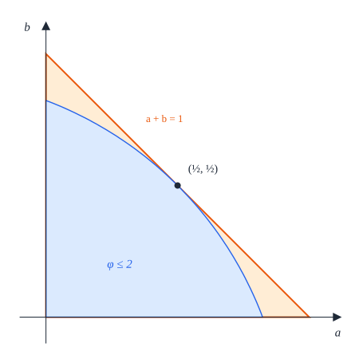
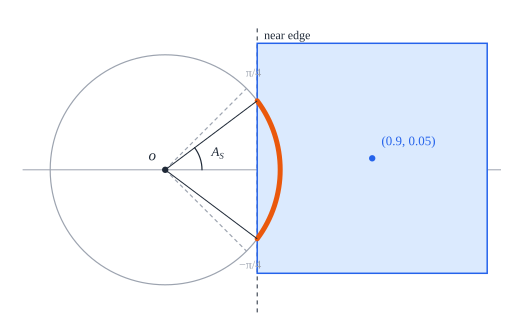
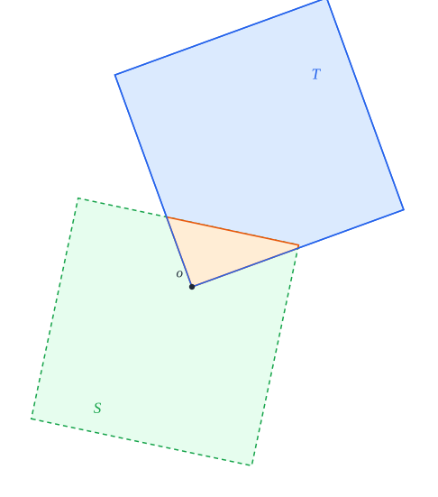

# 7. Four squares

[Contents](README.md) · [← 6. Three squares](three.md) · [8. Five squares →](five.md)

Four unit squares fit in a closed disk of radius $\sqrt2$ as a $2 \times 2$
block, with the disk centre at the common vertex of the four squares. This
chapter proves that no smaller closed disk holds four unit squares, and that
every packing of four unit squares in a closed disk of radius $\sqrt2$ is
congruent to the block.

The proof measures how much of the circle $\Gamma_{1/2}$ of radius $\frac12$
about the disk centre each square holds. The disk forces every square to hold
at least a quarter of this circle, and a square that avoids the disk centre
holds more than a quarter unless the disk centre is one of its vertices. The
four squares share the circle, so the disk centre is a vertex of every square,
and four squares with a common vertex and disjoint quarter circles form the
block. Unlike the cases of three and five squares, the argument uses the disk
constraint itself, and not only the linear inequalities of a contact polygon
(see the remark after Lemma 7.5). The same circle and the same count of
quarters are the argument of an unpublished note by Wei Zhao on Problem 6 of
IMSC 2026. The two were reached separately, but both with Claude, so they may
not be independent ([§1.3](README.md#13-background)).

## Theorem 7.1 (four squares)

Let $R_4 = \sqrt2$, and let the *block* be the model
$Q(c_1), Q(c_2), Q(c_3), Q(c_4)$ with $c_1 = (\frac12, \frac12)$,
$c_2 = (-\frac12, \frac12)$, $c_3 = (-\frac12, -\frac12)$ and
$c_4 = (\frac12, -\frac12)$.

1. The block is a packing in the closed disk of radius $R_4$ about the origin.
2. If four unit squares form a packing in a closed disk of radius $R$, then
   $R \ge R_4$.
3. The packings of four unit squares in a closed disk of radius $R_4$ are
   exactly the configurations congruent to the block.


*Figure 7.1.* The block in the circle of radius $R_4 = \sqrt2$ (dashed). The
circle $\Gamma_{1/2}$ about the disk centre $o$ splits into four quarter
circles, one in each square.

*Lean:
[`Four.model_packing`](../../SquaresInCircles/Four/Construction.lean#L21),
[`Four.uniqueness`](../../SquaresInCircles/Four/Uniqueness.lean#L69),
[`Four.optimum`](../../SquaresInCircles/Four/Uniqueness.lean#L117).*

*Outline of the proof.* Part (1) is the construction, Proposition 7.2 (§7.1).
Parts (2) and (3) follow, by
[Corollary 2.10](preliminaries.md#corollary-210-the-scheme-of-proof) (§7.5),
from the uniqueness statement, Proposition 7.3: every packing of four unit
squares in a closed disk of radius $\sqrt2$ is congruent to the block. Its
proof takes three steps.

1. *The diamond* (§7.2). The disk puts the offsets $(a_S, b_S)$ of every
   square $S$ in the half-plane $a + b \le 1$, and on its edge only when the
   disk centre is a vertex of $S$ (Lemma 7.4).
2. *Arcs* (§7.3). On the circle $\Gamma_{1/2}$ every square holds an arc of at
   least a quarter of the circle, and a square that avoids the disk centre
   holds more than a quarter unless the disk centre is one of its vertices
   (Lemmas 7.5 and 7.6).
3. *The block* (§7.4). By the angular budget, the disk centre is a vertex of
   every square. The four quarter circles are then centred on a grid of
   quarter turns, and in the frame given by this grid the squares sit at the
   centres of the block (Lemma 7.7).

## 7.1 Construction

### Proposition 7.2 (construction)

The block is a packing in the closed disk of radius $\sqrt2$ about the origin.

*Proof.* Any two of the centres $c_1, \dots, c_4$ differ by 1 in at least one
coordinate, and every centre $(x, y)$ has

```math
\left(|x| + \tfrac12\right)^2 + \left(|y| + \tfrac12\right)^2 = 1 + 1 = 2 .
```

[Lemma 2.8](preliminaries.md#lemma-28-axis-parallel-squares) (3) applies.
$\square$

*Lean:
[`Four.model_packing`](../../SquaresInCircles/Four/Construction.lean#L21),
[`Four.model`](../../SquaresInCircles/Geometry.lean#L162),
[`Four.centers`](../../SquaresInCircles/Geometry.lean#L159),
[`Four.radius`](../../SquaresInCircles/Geometry.lean#L156).*

The four outer corners $(\pm1, \pm1)$ of the block lie on the circle of radius
$\sqrt2$.

## 7.2 The diamond

The rest of the chapter, up to §7.5, proves that the optimal packing is unique.

### Proposition 7.3 (uniqueness)

Every packing of four unit squares in a closed disk of radius $\sqrt2$ is
congruent to the block.

The proof occupies §7.2 to §7.4. Throughout, $o$ is the disk centre, and for a
square $S$ the numbers $a_S \ge b_S \ge 0$ are the offsets of $o$ from $S$
([Definition 3.1](common.md#definition-31-position-of-the-disk-centre)). By
[Lemma 3.4](common.md#lemma-34-farthest-vertex), a square $S$ whose closed
square lies in the closed disk of radius $\sqrt2$ about $o$ satisfies

```math
\varphi(a_S, b_S) \le 2 . \tag{7.1}
```

This section replaces (7.1) by a linear inequality, §7.3 finds arcs that the
squares hold on $\Gamma_{1/2}$, and §7.4 assembles the block.

The tangent half-plane of the disk $\lbrace\varphi \le 2\rbrace$ at the point
$(\frac12, \frac12)$ of its boundary
([Definition 3.5](common.md#definition-35-tangent-half-plane)) is
$a + b \le 1$. It is the contact polygon of four squares
([Definition 3.7](common.md#definition-37-contact-polygon)), and we call it the
*diamond*: restoring the signs of the two local coordinates of $o$ turns it
into the square $|x| + |y| \le 1$, which stands on a vertex. A square with
$a_S = b_S = \frac12$ has $o$ as a vertex, since both local coordinates of $o$
are $\pm\frac12$.

### Lemma 7.4 (the diamond)

Let $a$ and $b$ be real numbers with $\varphi(a, b) \le 2$. Then $a + b \le 1$.
If moreover $a + b \ge 1$, then $a = b = \frac12$.



*Figure 7.2.* The disk $\lbrace\varphi \le 2\rbrace$ in the $(a, b)$-plane,
where $a, b \ge 0$, inside the diamond $a + b \le 1$, which touches it only at
$(\frac12, \frac12)$. Dashed, for comparison, the octagon $P_8$ of five
squares.

*Proof.* Expanding both sides gives the identity

```math
\varphi(a, b) - 2 = 2(a + b - 1) + \left(a - \tfrac12\right)^2 + \left(b - \tfrac12\right)^2 ,
```

which is the identity of [Lemma 3.6](common.md#lemma-36-tangent-lines) at the
point $(u, v) = (\frac12, \frac12)$, where $\varphi(\frac12, \frac12) = 2$. The
left side is at most 0 and the last two terms are nonnegative, so
$a + b - 1 \le 0$. If moreover $a + b \ge 1$, then
$0 \ge \varphi(a, b) - 2 \ge (a - \frac12)^2 + (b - \frac12)^2$, so both
squares vanish. $\square$

*Lean: [`Four.diamond`](../../SquaresInCircles/Four/Exterior.lean#L16).*

## 7.3 Arcs of the squares

We now find, for every square $S$ that satisfies (7.1), an arc of
$\Gamma_{1/2}$ that $S$ holds
([Definition 3.15](common.md#definition-315-arc)). Both lemmas use a chart
$(\theta_S, \varepsilon_S)$ of $S$
([Definition 3.20](common.md#definition-320-chart); every square has one by
[Lemma 3.21](common.md#lemma-321-charts)). Exterior squares come first, then
the squares whose closed square contains $o$.

### Lemma 7.5 (exterior arcs)

Let $S$ be an exterior square with $\varphi(a_S, b_S) \le 2$. Then $S$ holds an
arc of $\Gamma_{1/2}$ of half-width at least $\frac\pi4$, and of half-width
greater than $\frac\pi4$ if $a_S + b_S < 1$.


*Figure 7.3.* Left: an exterior square in its chart, with
$(a_S, b_S) = (0.72, 0.1)$. Its cap on $\Gamma_{1/2}$ runs from $-V_S$, on the
line of the lower edge, to $A_S$, on the line of the near edge, and contains
the quarter circle from $A_S - \frac\pi2$ to $A_S$: this is the inequality
$V_S \ge \frac\pi2 - A_S$ of step 4 of the proof, strict here. Right: the tight
case $a_S = b_S = \frac12$, where $o$ is a vertex of $S$ and the cap is exactly
a quarter circle.

*Proof.*

1. *Bounds on $a_S$ and $b_S$.* As $S$ is exterior, $a_S \ge \frac12$
   ([Lemma 3.21](common.md#lemma-321-charts) (1)). By Lemma 7.4,
   $a_S + b_S \le 1$, so $b_S \le 1 - a_S \le \frac12$. Moreover
   $a_S < \frac56$: otherwise, as $b_S \ge 0$,

   ```math
   \varphi(a_S, b_S) \ge \left(\tfrac56 + \tfrac12\right)^2 + \left(0 + \tfrac12\right)^2 = \tfrac{16}9 + \tfrac14 = \tfrac{73}{36} > 2 .
   ```

2. *The cap.* Take $r = \frac12$. Since $0 \le a_S - \frac12 < \frac13 < r$,
   the crossing angles of
   [Definition 3.23](common.md#definition-323-crossing-angles) are defined on
   $\Gamma_{1/2}$, and they are

   ```math
   A_S = \arccos(2a_S - 1), \qquad V_S = \arcsin(1 - 2b_S) .
   ```

   The hypotheses of
   [Lemma 3.24](common.md#lemma-324-arcs-of-an-exterior-square) (2) hold:
   $a_S - \frac12 < r < a_S + \frac12$, $r \le \frac12$ and
   $b_S \le \frac12$. So $S$ holds an arc of $\Gamma_{1/2}$ of length
   $\min(2A_S, A_S + V_S)$, that is, of half-width

   ```math
   w = \min\left(A_S,\ \tfrac12\left(A_S + V_S\right)\right) .
   ```

3. *$A_S > \frac\pi4$.* We have
   $0 \le 2a_S - 1 < \frac23 < \frac{\sqrt2}2 = \cos\frac\pi4$, the middle
   inequality because $\frac49 < \frac12$. The arccosine is strictly
   decreasing on $[-1, 1]$, so $A_S > \frac\pi4$.
4. *$A_S + V_S \ge \frac\pi2$, strictly if $a_S + b_S < 1$.* As
   $\arccos z = \frac\pi2 - \arcsin z$, we have
   $\frac\pi2 - A_S = \arcsin(2a_S - 1)$. The inequality $a_S + b_S \le 1$
   says that $2a_S - 1 \le 1 - 2b_S$, and both numbers lie in $[0, 1]$, where
   the arcsine is strictly increasing. So $\frac\pi2 - A_S \le V_S$, with
   strict inequality if $a_S + b_S < 1$.
5. *Conclusion.* By steps 3 and 4 both terms of the minimum in step 2 are at
   least $\frac\pi4$, so $w \ge \frac\pi4$. If $a_S + b_S < 1$, both terms are
   greater than $\frac\pi4$, and so is $w$. $\square$

*Lean: [`Four.exterior_arc`](../../SquaresInCircles/Four/Exterior.lean#L24).*

*Remark (why the disk constraint is still needed).* The proof of
Proposition 7.3 uses (7.1) itself, and not only the diamond, in two places:
the bound $a_S < \frac56$ of step 1 above, and the equality case of
Lemma 7.4. Neither follows from the diamond. The diamond alone allows $a_S$ up
to 1, and the arc of $S$ can then be shorter than a quarter circle: for
$(a_S, b_S) = (0.9, 0.05)$, which satisfies $a_S + b_S < 1$ but not (7.1), a
point $\frac12(\cos t, \sin t)$ of the chart lies in $S$ exactly when
$\cos t > 0.8$, so the points of $\Gamma_{1/2}$ in $S$ form an arc of
half-width $\arccos 0.8 < \frac\pi4$ (Figure 7.4). Nor does the diamond force
the block: the four squares $Q(\pm1, 0)$ and $Q(0, \pm1)$ are pairwise
disjoint, and seen from the origin each has $(a_S, b_S) = (1, 0)$, on the edge
of the diamond (Figure 7.5). This is why, unlike the proofs for three and five
squares, this proof keeps (7.1) next to its contact polygon.



*Figure 7.4.* The square with $(a_S, b_S) = (0.9, 0.05)$ lies in the diamond
but outside the disk $\lbrace\varphi \le 2\rbrace$. It holds only the arc of
$\Gamma_{1/2}$ between $\pm A_S$, where $A_S = \arccos 0.8$, which is shorter
than the quarter circle between the dashed radii at $\pm\frac\pi4$.


*Figure 7.5.* Four disjoint squares, each with $(a_S, b_S) = (1, 0)$ on the
edge of the diamond, that do not form the block. The circle $\Gamma_{1/2}$ only
touches them, and they do not fit in the dashed circle of radius $\sqrt2$.

### Lemma 7.6 (a quarter circle at the disk centre)

Let $S$ be a square with $a_S \le \frac12$, that is, with $o \in \overline S$,
and let $(\theta_S, \varepsilon_S)$ be a chart of $S$. Then $S$ holds the arc
of $\Gamma_{1/2}$ with centre $\mu_S = \theta_S + \varepsilon_S\frac\pi4$ and
half-width $\frac\pi4$.


*Figure 7.6.* A square $S$ that contains $o$, in its chart. It contains the
box $(0, \frac12) \times (0, \frac12)$ (shaded), and with it the quarter of
$\Gamma_{1/2}$ between the chart angles $0$ and $\frac\pi2$ (thick), centred at
the chart angle $\frac\pi4$, that is, at the direction $\mu_S$. Thin: the rest
of $\Gamma_{1/2} \cap S^\circ$, which the lemma does not use.

*Proof.* Let $0 < t < \frac\pi2$. Then $0 < \frac12\cos t < \frac12$ and
$0 < \frac12\sin t < \frac12$, while $0 \le b_S \le a_S \le \frac12$. A number
in $(0, \frac12)$ and a number in $[0, \frac12]$ differ by less than
$\frac12$, so

```math
\left|\tfrac12\cos t - a_S\right| < \tfrac12, \qquad \left|\tfrac12\sin t - b_S\right| < \tfrac12 .
```

So every chart angle in $(0, \frac\pi2)$ gives a point of $S$ on
$\Gamma_{1/2}$, and [Lemma 3.21](common.md#lemma-321-charts) (2), with
$(l, h) = (0, \frac\pi2)$, gives the arc of half-width $\frac\pi4$ and centre
$\theta_S + \varepsilon_S\frac\pi4 = \mu_S$. $\square$

*Lean: [`Four.quarter_arc`](../../SquaresInCircles/Four/Uniqueness.lean#L31),
[`Four.vertexMid`](../../SquaresInCircles/Four/Uniqueness.lean#L26).*

## 7.4 The block

### Lemma 7.7 (a square with a vertex at the disk centre)

Let $S$ be a square with $a_S = b_S = \frac12$, let $(\theta_S, \varepsilon_S)$
be a chart of $S$, and let $\mu_S = \theta_S + \varepsilon_S\frac\pi4$. Then
$S$ sits at $(\frac12, \frac12)$ in the frame $\mu_S - \frac\pi4$.


*Figure 7.7.* A square with a vertex at $o$. Its two edges from $o$ point in the
directions $\mu_S \pm \frac\pi4$, and $S$ holds the quarter of $\Gamma_{1/2}$
between them. In the frame at $o$ whose first axis points along the edge in the
direction $\mu_S - \frac\pi4$, the square is $Q(\frac12, \frac12)$.

*Proof.* By [Lemma 3.22](common.md#lemma-322-cartesian-form-of-a-chart), $S$
sits at $(a_S, \varepsilon_S b_S) = (\frac12, \varepsilon_S\frac12)$ in the
frame $\theta_S$. If $\varepsilon_S = 1$, then $\theta_S = \mu_S - \frac\pi4$,
and this is the claim. If $\varepsilon_S = -1$, then
$\theta_S = \mu_S + \frac\pi4 = (\mu_S - \frac\pi4) + \frac\pi2$, so $S$ sits
at $(\frac12, -\frac12)$ in the frame $(\mu_S - \frac\pi4) + \frac\pi2$. By
[Lemma 3.30](common.md#lemma-330-sitting-at-a-centre) (2) with $k = 1$, it
sits in the frame $\mu_S - \frac\pi4$ at $(\frac12, -\frac12)$ turned by a
quarter turn, $(x, y) \mapsto (-y, x)$, which is $(\frac12, \frac12)$.
$\square$

*Lean:
[`Four.vertex_represents`](../../SquaresInCircles/Four/Uniqueness.lean#L45).*

The proof of Proposition 7.3 now assembles these lemmas. Figure 7.8 shows why
no square can contain the disk centre once the disk centre is a vertex of
another square, and Figure 7.9 the configuration that the proof arrives at.



*Figure 7.8.* Step 3 of the proof. If $o$ is a vertex of $T$, every square $S$
with $o \in S^\circ$ overlaps $T$ near $o$ (shaded), so disjoint squares
cannot do this.


*Figure 7.9.* Steps 4 and 5 of the proof. The quarter arcs are centred at
$\mu_0$ and its quarter turns, and in the frame at $o$ turned by
$\mu_0 - \frac\pi4$ (arrows) the four squares sit at $c_1, \dots, c_4$.

*Proof of Proposition 7.3.* Let $S_1, \dots, S_4$ be a packing of four unit
squares in the closed disk of radius $\sqrt2$ about a point $o$. Fix a chart
$(\theta_i, \varepsilon_i)$ of each $S_i$, write $a_i, b_i$ for
$a_{S_i}, b_{S_i}$, and put $\mu_i = \theta_i + \varepsilon_i\frac\pi4$. Every
square satisfies (7.1), and the squares are pairwise disjoint.

1. *Every square holds an arc of $\Gamma_{1/2}$ of half-width at least
   $\frac\pi4$, and an exterior square $S_i$ with $a_i + b_i < 1$ holds one of
   half-width greater than $\frac\pi4$.* If $S_i$ contains $o$, then
   $a_i < \frac12$ ([Lemma 3.21](common.md#lemma-321-charts) (1)), and
   Lemma 7.6 gives an arc of half-width $\frac\pi4$. If $S_i$ is exterior,
   Lemma 7.5 gives the arc.
2. *Every exterior square $S_i$ has $a_i = b_i = \frac12$.* If some exterior
   square had $a_i + b_i < 1$, the four open squares, which are pairwise
   disjoint, would hold arcs of $\Gamma_{1/2}$ of half-widths at least
   $\frac\pi4$, one of them greater than $\frac\pi4$. The angular budget,
   [Lemma 3.16](common.md#lemma-316-angular-budget) with $n = 4$, forbids
   this. So every exterior square has $a_i + b_i \ge 1$, and Lemma 7.4 gives
   $a_i = b_i = \frac12$.
3. *No square contains $o$.* Suppose that $S_i$ does. Two disjoint squares
   cannot both contain $o$
   ([Definition 3.2](common.md#definition-32-containing-and-exterior-squares)),
   so any other square $S_k$, $k \ne i$, is exterior. By step 2,
   $a_k = b_k = \frac12$:
   both local coordinates of $o$ in the frame of $S_k$ are $\pm\frac12$, so
   $o \in \overline{S_k}$. By
   [Lemma 3.12](common.md#lemma-312-supporting-line) (2), applied to the
   disjoint squares $S_k$ and $S_i$, the point $o$ of $\overline{S_k}$ does not
   lie in $S_i^\circ$, a contradiction (Figure 7.8).
4. *The quarter arcs lie on a grid of quarter turns.* By steps 2 and 3,
   $a_i = b_i = \frac12$ for every $i$: the disk centre is a vertex of all
   four squares. By Lemma 7.6 each $S_i$ holds the arc of $\Gamma_{1/2}$ with
   centre $\mu_i$ and half-width $\frac\pi4$. These arcs belong to pairwise
   disjoint open squares, so
   [Lemma 3.17](common.md#lemma-317-disjoint-arcs-have-separated-centres)
   gives $d(\mu_i, \mu_j) \ge \frac\pi4 + \frac\pi4 = \frac\pi2$ for
   $i \ne j$. By [Lemma 3.19](common.md#lemma-319-regular-polygons) (2) with
   $m = 4$ and $g = \frac\pi2$, there are a direction $\mu_0$ and a
   relabelling $\tau$ of $\lbrace 1, 2, 3, 4 \rbrace$ such that

   ```math
   \mu_{\tau(k)} = \mu_0 + (k - 1)\tfrac\pi2 \qquad (k = 1, 2, 3, 4) .
   ```

5. *The block.* Let $\phi = \mu_0 - \frac\pi4$. By Lemma 7.7, $S_{\tau(k)}$
   sits at $(\frac12, \frac12)$ in the frame
   $\mu_{\tau(k)} - \frac\pi4 = \phi + (k - 1)\frac\pi2$, so by
   [Lemma 3.30](common.md#lemma-330-sitting-at-a-centre) (2) it sits in the
   frame $\phi$ at $(\frac12, \frac12)$ turned by $k - 1$ quarter turns. For
   $k = 1, 2, 3, 4$ these points are $(\frac12, \frac12)$,
   $(-\frac12, \frac12)$, $(-\frac12, -\frac12)$ and $(\frac12, -\frac12)$,
   that is, $c_k$ (Figure 7.9). So each of the four squares sits at one of
   $c_1, \dots, c_4$ in the frame $\phi$, and
   [Lemma 3.31](common.md#lemma-331-from-slots-to-congruence) shows that the
   packing is congruent to the block. $\square$

*Lean: [`Four.uniqueness`](../../SquaresInCircles/Four/Uniqueness.lean#L69).*

## 7.5 Proof of Theorem 7.1

*Proof of Theorem 7.1.* We apply
[Corollary 2.10](preliminaries.md#corollary-210-the-scheme-of-proof) with
$n = 4$, $R_4 = \sqrt2$ and $\mathcal M = \lbrace\text{the block}\rbrace$:
(a) is Proposition 7.2; (b) the corner $(1, 1)$ of $Q(c_1)$ has
$1^2 + 1^2 = 2 = R_4^2$; (c) is Proposition 7.3. Parts (1), (2), (3) of the
theorem are (a), (i) and (ii). $\square$

*Lean: [`Four.optimum`](../../SquaresInCircles/Four/Uniqueness.lean#L117),
[`Optimum.isLeast`](../../SquaresInCircles/Common/Optimum.lean#L61),
[`Optimum.packing_iff`](../../SquaresInCircles/Common/Optimum.lean#L67).*
