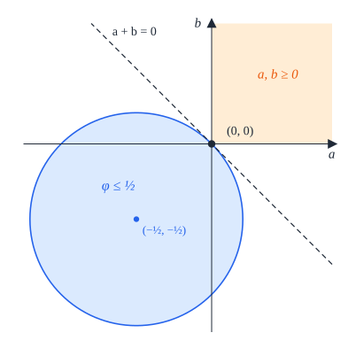
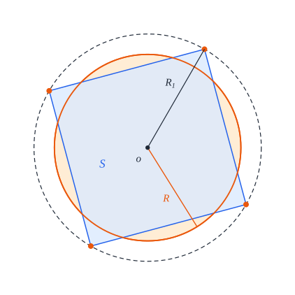

# 4. One square

[Contents](README.md) · [← 3. Tools](common.md) · [5. Two squares →](two.md)

This chapter proves the case $n = 1$ of the main theorem. The answer is the
expected one: the least radius of a closed disk that holds a unit square is
half the diagonal of the square, $R_1 = \frac{\sqrt2}2$, and a unit square lies
in a closed disk of that radius only if it is centred at the centre of the
disk. Packings, models and congruence are as in
[Definitions 2.3](preliminaries.md#definition-23-packing) and
[2.6](preliminaries.md#definition-26-congruence-to-a-model).

The proof rests on one inequality. If the closed square of a unit square $S$
lies in a closed disk of radius $R$ about $o$, the farthest-vertex bound
([Lemma 3.4](common.md#lemma-34-farthest-vertex)) gives
$\varphi(a_S, b_S) \le R^2$, where
$\varphi(a_S, b_S) = \frac12 + a_S + b_S + a_S^2 + b_S^2$ is the squared
distance from $o$ to the vertex of $S$ farthest from it. For $R = R_1$ the
bound reads $\varphi(a_S, b_S) \le \frac12$, and as $a_S$ and $b_S$ are
nonnegative, this forces $a_S = b_S = 0$: the disk centre is the centre of the
square.

## Theorem 4.1 (one square)

Let $R_1 = \frac{\sqrt2}2$, and regard the axis-parallel unit square
$Q(0, 0)$, centred at the origin, as a model of one square.

1. The model $Q(0, 0)$ is a packing in the closed disk of radius $R_1$ about
   the origin.
2. If one unit square forms a packing in a closed disk of radius $R$, then
   $R \ge R_1$.
3. The packings of one unit square in a closed disk of radius $R_1$ are
   exactly the configurations congruent to the model $Q(0, 0)$.


*Figure 4.1.* The model $Q(0, 0)$ placed at the disk centre $o$. Its four
vertices lie on the circle of radius $R_1$ about $o$ (dashed).

*Lean: [`One.model_packing`](../../SquaresInCircles/One/Construction.lean#L17),
[`One.uniqueness`](../../SquaresInCircles/One/Uniqueness.lean#L23),
[`One.optimum`](../../SquaresInCircles/One/Uniqueness.lean#L38).*

*Outline of the proof.* Part (1) is a direct check (Proposition 4.2, §4.1).
The substance of the theorem is uniqueness (Proposition 4.3, §4.2): a unit
square whose closed square lies in a closed disk of radius $R_1$ is centred at
the centre of the disk, and it is then congruent to the model. Parts (2) and
(3) follow from these two propositions by the scheme of proof,
[Corollary 2.10](preliminaries.md#corollary-210-the-scheme-of-proof) (§4.3).
In particular the lower bound (2) comes from uniqueness: a unit square in a
closed disk of radius $R < R_1$ would also lie in the concentric closed disk of
radius $R_1$, so it would be centred at the disk centre, and its vertices, at
distance $R_1$ from that centre, would lie outside the smaller disk.

## 4.1 Construction

### Proposition 4.2 (construction)

The model $Q(0, 0)$ is a packing in the closed disk of radius $R_1$ about the
origin: the closed square $\overline{Q(0, 0)} = [-\frac12, \frac12]^2$ lies in
$\overline{D}(0, R_1)$.

*Proof.* By [Lemma 2.8](preliminaries.md#lemma-28-axis-parallel-squares) (3)
with $n = 1$, where there is no pair of centres to separate, it suffices that
the centre $(x, y) = (0, 0)$ satisfy the inequality of Lemma 2.8 (2). It does,
with equality:

```math
\left(|x| + \tfrac12\right)^2 + \left(|y| + \tfrac12\right)^2 = \tfrac14 + \tfrac14 = \tfrac12 = R_1^2 . \qquad \square
```

*Lean: [`One.model_packing`](../../SquaresInCircles/One/Construction.lean#L17),
[`One.model`](../../SquaresInCircles/Geometry.lean#L119),
[`One.radius`](../../SquaresInCircles/Geometry.lean#L113),
[`axis_packing`](../../SquaresInCircles/Common/Constructions.lean#L38).*

## 4.2 Uniqueness

### Proposition 4.3 (uniqueness)

Let $o$ be a point of the plane, and let $S$ be a unit square whose closed
square lies in the closed disk $\overline{D}(o, R_1)$, that is, a packing of
one unit square in that disk. Then $c_S = o$, and the configuration $S$ is
congruent to the model $Q(0, 0)$.

The idea is in Figure 4.2: the vertices of $S$ lie on the circle of radius
$R_1$ about $c_S$, and a closed disk of the same radius about any other point
misses one of them.


*Figure 4.2.* A unit square $S$ whose centre $c_S$ is not the disk centre $o$;
from $c_S$, the point $o$ is $a_S$ along one axis of $S$ and $b_S$ along the
other. The vertices of $S$ lie on the dotted circle of radius $R_1$ about
$c_S$, and the vertex farthest from $o$, at distance
$\sqrt{\varphi(a_S, b_S)}$ from $o$ (Lemma 3.4), lies outside the dashed
circle of radius $R_1$ about $o$.

*Proof.* For all real $a$ and $b$, expanding the squares gives

```math
\varphi(a, b) = \left(a + \tfrac12\right)^2 + \left(b + \tfrac12\right)^2 = \tfrac12 + a + b + a^2 + b^2 \ge \tfrac12 + a + b .
```

By [Lemma 3.4](common.md#lemma-34-farthest-vertex),
$\varphi(a_S, b_S) \le R_1^2 = \frac12$, and $a_S, b_S \ge 0$ by
[Definition 3.1](common.md#definition-31-position-of-the-disk-centre). Hence

```math
\tfrac12 \ge \varphi(a_S, b_S) \ge \tfrac12 + a_S + b_S \ge \tfrac12 ,
```

so $a_S + b_S = 0$, and as both terms are nonnegative, $a_S = b_S = 0$
(Figure 4.3).



*Figure 4.3.* The inequality in the $(a, b)$-plane. The disk
$\lbrace \varphi \le \frac12 \rbrace$ has centre $(-\frac12, -\frac12)$ and
radius $R_1$. It passes through the origin, lies in the half-plane
$a + b \le 0$, and touches the line $a + b = 0$ at the origin, the only point
it shares with the quadrant $a, b \ge 0$.

By Lemma 3.4 again, $|c_S - o|^2 = a_S^2 + b_S^2 = 0$, so $c_S = o$. Let
$(\theta_S, \varepsilon_S)$ be a chart of $S$
([Lemma 3.21](common.md#lemma-321-charts)). By
[Lemma 3.22](common.md#lemma-322-cartesian-form-of-a-chart), $S$ sits at
$(a_S, \varepsilon_S b_S) = (0, 0)$ in the frame $\theta_S$ (Figure 4.4).
Hence [Lemma 3.31](common.md#lemma-331-from-slots-to-congruence), applied with
$n = 1$ and $c_1 = (0, 0)$, shows that the configuration $S$ is congruent to
the model $Q(0, 0)$. $\square$

*Lean: [`One.uniqueness`](../../SquaresInCircles/One/Uniqueness.lean#L23),
[`One.half_add_le_phi`](../../SquaresInCircles/One/Uniqueness.lean#L18),
[`local_center_norm`](../../SquaresInCircles/Common/Basic.lean#L111).*


*Figure 4.4.* The conclusion of Proposition 4.3. Left, the model $Q(0, 0)$.
Right, a unit square $S$ with $c_S = o$: the axes of the frame $\theta_S$ at
$o$ are parallel to the sides of $S$, and $S$ sits at $(0, 0)$ in this frame.
The frame $F_{\theta_S}$ carries the model onto $S$: turning the left picture
by $\theta_S$ gives the right one.

## 4.3 Proof of Theorem 4.1

The lower bound is not proved directly: it follows from uniqueness, through
Corollary 2.10. A closed disk of radius $R < R_1$ lies in the concentric
closed disk of radius $R_1$, and a unit square that lies in the latter is
centred at the disk centre, so its vertices fall outside the smaller disk
(Figure 4.5).



*Figure 4.5.* The lower bound. A unit square centred at $o$ does not lie in
the closed disk of radius $R < R_1$ about $o$ (shaded): its four vertices lie
on the circle of radius $R_1$ (dashed), outside the smaller disk.

*Proof of Theorem 4.1.* We apply
[Corollary 2.10](preliminaries.md#corollary-210-the-scheme-of-proof) with
$n = 1$, $R_1 = \frac{\sqrt2}2 > 0$, and $\mathcal M$ the set whose only
element is the model $Q(0, 0)$: (a) is Proposition 4.2; (b) holds because the
vertex $(\frac12, \frac12)$ of $\overline{Q(0, 0)}$ is at distance
$\sqrt{\frac14 + \frac14} = R_1$ from the origin; (c) is Proposition 4.3.
Parts (1), (2), (3) of the theorem are (a), (i) and (ii). $\square$

*Lean: [`One.optimum`](../../SquaresInCircles/One/Uniqueness.lean#L38),
[`Optimum.optimality`](../../SquaresInCircles/Common/Optimum.lean#L47),
[`Optimum.isLeast`](../../SquaresInCircles/Common/Optimum.lean#L61),
[`Optimum.packing_iff`](../../SquaresInCircles/Common/Optimum.lean#L67).*
