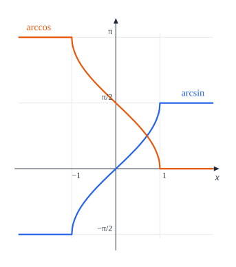
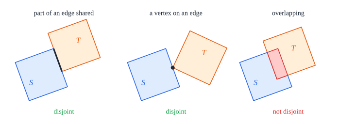

# 2. Preliminaries

[Contents](README.md) · [← 1. Introduction](README.md#1-introduction) · [3. Tools →](common.md)

This chapter fixes the conventions, defines unit squares, packings and
congruence to a model, and proves the few facts that turn the main theorem into
one uniqueness statement for each number of squares (§2.6). Everything here is
elementary; the point is to state it precisely once.

## 2.1 Conventions

We work in the Euclidean plane $\mathbb{R}^2$, with the inner product
$\langle p, q\rangle$ and the norm $|p|$. For a point $c$ and a radius
$r \ge 0$, the closed and the open disk of centre $c$ and radius $r$ are

```math
\overline{D}(c, r) = \lbrace p : |p - c| \le r \rbrace, \qquad D(c, r) = \lbrace p : |p - c| < r \rbrace .
```

A *direction* is an angle modulo $2\pi$, an element of
$\mathbb{R}/2\pi\mathbb{Z}$. The unit vector in the direction $\theta$ is
$u(\theta) = (\cos\theta, \sin\theta)$, and the direction of a nonzero vector
$v$ is the $\theta$ with $v = |v|\,u(\theta)$. The *angle* $d(\theta, \theta')$
between two directions is their distance in $\mathbb{R}/2\pi\mathbb{Z}$: the
least $|x - x'|$ over real representatives $x$ of $\theta$ and $x'$ of
$\theta'$. It is a number in $[0, \pi]$, it is a metric on the directions, and
$\cos(\theta - \theta') = \cos d(\theta, \theta')$.


*Figure 2.1.* The angle $d(\theta, \theta')$ goes the shorter way round the
circle; the longer way is $2\pi - d(\theta, \theta')$. On the line it is the
least distance between a representative $x$ of $\theta$ and a representative
$x'$ of $\theta'$, here between $x$ and $x' - 2\pi$.

We use $\arcsin$ on all of $\mathbb{R}$, extended by $\arcsin x = \frac\pi2$
for $x \ge 1$ and $\arcsin x = -\frac\pi2$ for $x \le -1$; it is odd and
nondecreasing, and increasing on $[-1, 1]$. We put
$\arccos x = \frac\pi2 - \arcsin x$, which on $[-1, 1]$ is the usual arccosine.
We use freely the classical bounds $3.141592 < \pi < 3.141593$, and weaker ones
such as $\pi < \frac{22}7$.



*Figure 2.2.* The extended $\arcsin$ (blue) and $\arccos$ (orange). Outside
$[-1, 1]$ both are constant.

A *configuration* of $n$ unit squares is a family $S_1, \dots, S_n$ of unit
squares (Definition 2.1), indexed by $\lbrace 1, \dots, n\rbrace$. A
*relabelling* is a permutation $\sigma$ of $\lbrace 1, \dots, n\rbrace$.

*Lean: [`Point`](../../SquaresInCircles/Geometry.lean#L27),
[`normSq`](../../SquaresInCircles/Geometry.lean#L30),
[`inDisk`](../../SquaresInCircles/Geometry.lean#L67),
[`Direction`](../../SquaresInCircles/Geometry.lean#L79),
[`direction_dist`](../../SquaresInCircles/Common/AngularBudget.lean#L30).*

## 2.2 Unit squares

A unit square can sit anywhere in the plane and be turned any way. We describe
it through its own frame. Everything attached to a square carries its name: its
centre $c_S$, its frame $e^S_1, e^S_2$, and in later chapters $a_S$, $A_S$,
$\theta_S$.

### Definition 2.1 (unit square)

A *unit square* $S$ is given by a centre $c_S$ and an orthonormal frame
$e^S_1, e^S_2$ in which $e^S_2$ is $e^S_1$ turned by a quarter turn
counterclockwise. The *local coordinates* of a point $p$ are its coordinates in
this frame,

```math
x_S(p) = \langle p - c_S,\ e^S_1\rangle, \qquad y_S(p) = \langle p - c_S,\ e^S_2\rangle ,
```

and in them $S$ is the standard square: its *open square* $S^\circ$ is the set
of points with $|x_S| < \frac12$ and $|y_S| < \frac12$, and its *closed square*
$\overline{S}$ the set with $|x_S| \le \frac12$ and $|y_S| \le \frac12$. The
*vertices* of $S$ are the four points $c_S \pm \frac12 e^S_1 \pm \frac12 e^S_2$.

The map $p \mapsto (x_S(p), y_S(p))$ is an isometry of the plane, since the
frame is orthonormal. So $\overline{S}$ is the closure of $S^\circ$, and both
are squares of side 1 in the usual sense. Turning the frame by a quarter turn
replaces $(x_S, y_S)$ by $(y_S, -x_S)$ and leaves $S^\circ$ and $\overline{S}$
unchanged (Figure 2.4); every statement in this book is about these two sets,
never about the frame itself.


*Figure 2.3.* The frame of $S$ at its centre $c_S$, and the local coordinates
of a point $p$. The open square is where both are less than $\frac12$ in
absolute value.


*Figure 2.4.* The frame of $S$, and the frame $e^S_2, -e^S_1$ turned from it
by a quarter turn. The square and the point $p$ are the same, and the local
coordinates of $p$ change from $(x_S(p), y_S(p))$ to $(y_S(p), -x_S(p))$:
both are less than $\frac12$ in absolute value in either frame.

*Lean: [`UnitSquare`](../../SquaresInCircles/Geometry.lean#L37),
[`localX`](../../SquaresInCircles/Geometry.lean#L44),
[`localY`](../../SquaresInCircles/Geometry.lean#L48),
[`openSquare`](../../SquaresInCircles/Geometry.lean#L58),
[`closedSquare`](../../SquaresInCircles/Geometry.lean#L53).*

### Definition 2.2 (axis-parallel square)

For a point $c = (c_1, c_2)$, $Q(c)$ is the unit square with centre $c$ and the
standard frame $e_1 = (1, 0)$, $e_2 = (0, 1)$, so that

```math
Q(c)^\circ = \lbrace (x, y) : |x - c_1| < \tfrac12,\ |y - c_2| < \tfrac12 \rbrace, \qquad
\overline{Q(c)} = \lbrace (x, y) : |x - c_1| \le \tfrac12,\ |y - c_2| \le \tfrac12 \rbrace .
```


*Figure 2.5.* The square $Q(c)$ spans $c_1 \pm \frac12$ across and
$c_2 \pm \frac12$ up.

*Lean: [`axisSquare`](../../SquaresInCircles/Geometry.lean#L87),
[`openAxisSquare`](../../SquaresInCircles/Common/Constructions.lean#L9),
[`closedAxisSquare`](../../SquaresInCircles/Common/Constructions.lean#L11),
[`axisSquare_open`](../../SquaresInCircles/Common/Constructions.lean#L14),
[`axisSquare_closed`](../../SquaresInCircles/Common/Constructions.lean#L18).*

## 2.3 Packings

### Definition 2.3 (packing)

Two unit squares $S$ and $T$ are *disjoint* if $S^\circ \cap T^\circ$ is
empty. Let $o$ be a point and $R \ge 0$. A *packing* of $n$ unit squares in the
closed disk $\overline{D}(o, R)$ is a configuration $S_1, \dots, S_n$ of
pairwise disjoint unit squares with $\overline{S_i} \subseteq \overline{D}(o, R)$
for every $i$. The point $o$ is the *disk centre* of the packing.


*Figure 2.6.* A packing of three unit squares in the closed disk of radius $R$
about $o$.

Nothing else is assumed. The squares are placed and turned independently of
one another; the disk centre may lie anywhere, inside a square or not; and the
squares may touch along edges or at vertices, since only their open squares
must be disjoint (Figure 2.7). Every optimal packing in this book but the
single square has touching squares.



*Figure 2.7.* Left and middle, the closed squares share a segment or a point,
but the open squares do not meet: the squares are disjoint, and may both
belong to a packing. Right, the open squares meet in the shaded region.

*Lean: [`Packing`](../../SquaresInCircles/Geometry.lean#L73),
[`InteriorDisjoint`](../../SquaresInCircles/Common/Basic.lean#L45).*

## 2.4 Frames and congruence

To compare a packing with a model, we read it in coordinates centred at its
disk centre.

### Definition 2.4 (frames at the disk centre)

Let $o$ be a point, the disk centre. For a direction $\phi$, the *frame
$\phi$ at $o$* is the map

```math
F_\phi(x, y) = o + x\,u(\phi) + y\,u\left(\phi + \tfrac\pi2\right) ,
```

whose first axis points in the direction $\phi$. A unit square $S$ *sits at
$c$ in the frame $\phi$* if $S^\circ = F_\phi\left(Q(c)^\circ\right)$, that
is, if for all real $x, y$

```math
F_\phi(x, y) \in S^\circ \iff |x - c_1| < \tfrac12 \ \text{ and } \ |y - c_2| < \tfrac12 .
```


*Figure 2.8.* The frame $F_\phi$ at $o$. The square sits at $c = (c_1, c_2)$:
in these coordinates it is $Q(c)$.

*Lean: [`pointInDirection`](../../SquaresInCircles/Geometry.lean#L83),
[`Represents`](../../SquaresInCircles/Common/Congruence.lean#L18).*

### Lemma 2.5 (frames are rigid motions)

For every point $o$ and direction $\phi$, the map $F_\phi$ is a bijection of
the plane with $F_\phi(0) = o$ and

```math
|F_\phi(p) - F_\phi(q)| = |p - q| \qquad \text{for all points } p, q .
```

In particular $|F_\phi(p) - o| = |p|$. Its inverse is
$p \mapsto \left(\langle p - o, u(\phi)\rangle,\ \langle p - o, u(\phi + \frac\pi2)\rangle\right)$.


*Figure 2.9.* The frame $F_\phi$ carries the origin to $o$ and turns the
plane by $\phi$. The grid goes to the turned grid, the square $Q(c)$ to the
square that sits at $c$ in the frame $\phi$, and the point $q$ to a point at
the same distance $|q|$ from $o$.

*Proof.* The vectors $u(\phi)$ and $u(\phi + \frac\pi2)$ are orthonormal. So
$F_\phi(p) - F_\phi(q) = (p_1 - q_1)\,u(\phi) + (p_2 - q_2)\,u(\phi + \frac\pi2)$
has squared norm $(p_1 - q_1)^2 + (p_2 - q_2)^2$, and taking inner products of
$F_\phi(x, y) - o$ with the two vectors returns $x$ and $y$; conversely every
$p$ equals $F_\phi$ of the pair of those inner products, by expanding $p - o$ in
the orthonormal basis. Finally $F_\phi(0) = o$. $\square$

*Lean: [`frameEquiv`](../../SquaresInCircles/Common/Congruence.lean#L22),
[`frameEquiv_zero`](../../SquaresInCircles/Common/Congruence.lean#L42),
[`frameEquiv_distance`](../../SquaresInCircles/Common/Congruence.lean#L45),
[`pointInDirection_norm`](../../SquaresInCircles/Common/Coordinates.lean#L19).*

### Definition 2.6 (congruence to a model)

A *model* is a configuration $M_1, \dots, M_n$ of unit squares, thought of as
placed about the origin; every model in this book is made of axis-parallel
squares $Q(c_1), \dots, Q(c_n)$. A configuration $S_1, \dots, S_n$ with disk
centre $o$ is *congruent to* the model if, for one direction $\phi$ and one
relabelling $\sigma$, the frame $F_\phi$ carries each model square onto a square
of the configuration, the open squares and the closed squares alike:

```math
S_{\sigma(i)}^\circ = F_\phi\left(M_i^\circ\right), \qquad \overline{S_{\sigma(i)}} = F_\phi\left(\overline{M_i}\right) \qquad (i = 1, \dots, n) .
```

In words: placed with its origin at $o$, the model is carried onto the
configuration by one rotation about $o$ and one relabelling. For the model
$Q(c_1), \dots, Q(c_n)$ this says that each $S_{\sigma(i)}$ sits at $c_i$ in
the frame $\phi$, for the open and the closed squares alike.


*Figure 2.10.* A packing congruent to the T of Chapter 6. Turning the model by
$\phi$ about $o$ gives the packing; the square in the slot $c_i$ is
$S_{\sigma(i)}$, here with $\sigma(1) = 2$, $\sigma(2) = 3$, $\sigma(3) = 1$.

*Remark.* Congruence allows rotations but not reflections. Every optimal model
of this book is symmetric under the reflection in a line through the origin,
so a reflected copy of an optimal packing is also a rotated copy of it, and
nothing is lost.

*Lean: [`Congruent`](../../SquaresInCircles/Geometry.lean#L99).*

### Lemma 2.7 (congruent configurations)

Let a model $M_1, \dots, M_n$ be a packing in the closed disk
$\overline{D}(0, R)$. Then every configuration with disk centre $o$ that is
congruent to it is a packing in $\overline{D}(o, R)$.


*Figure 2.11.* A model in $\overline{D}(0, R)$, left, and a configuration
congruent to it, right, with $\sigma(1) = 2$, $\sigma(2) = 3$ and
$\sigma(3) = 1$. A point $q$ of $\overline{M_1}$ is as far from $0$ as its
image $F_\phi(q) \in \overline{S_2}$ is from $o$, so the configuration lies
in $\overline{D}(o, R)$ as the model lies in $\overline{D}(0, R)$.

*Proof.* Let $\phi$ and $\sigma$ be as in Definition 2.6, and let
$S_1, \dots, S_n$ be the configuration.

1. *Containment.* A point $p$ of $\overline{S_{\sigma(i)}}$ is $F_\phi(q)$ for
   some $q \in \overline{M_i}$. By Lemma 2.5,
   $|p - o| = |F_\phi(q) - F_\phi(0)| = |q| \le R$.
2. *Disjointness.* Let $j \ne k$, write $j = \sigma(i)$ and $k = \sigma(l)$, so
   that $i \ne l$, and suppose $p \in S_j^\circ \cap S_k^\circ$. Since
   $F_\phi$ is a bijection, $q = F_\phi^{-1}(p)$ lies in $M_i^\circ$ and in
   $M_l^\circ$, against the disjointness of the model. $\square$

*Lean:
[`Congruent.packing`](../../SquaresInCircles/Common/Congruence.lean#L122),
[`frameEquiv_distance`](../../SquaresInCircles/Common/Congruence.lean#L45).*

## 2.5 Models of axis-parallel squares

The optimal models are checked to be packings by one lemma.

### Lemma 2.8 (axis-parallel squares)

1. $Q(p)$ and $Q(q)$ are disjoint as soon as $p$ and $q$ differ by at least 1
   in one coordinate.
2. $\overline{Q(c)}$, with $c = (x, y)$, lies in $\overline{D}(0, R)$ as soon
   as $(|x| + \frac12)^2 + (|y| + \frac12)^2 \le R^2$.
3. Hence $Q(c_1), \dots, Q(c_n)$ is a packing in $\overline{D}(0, R)$, for
   $R \ge 0$, as soon as any two of the centres differ by at least 1 in one
   coordinate and every centre satisfies the inequality of (2).


*Figure 2.12.* Every point of the two squares lies in the box
$[-B, B] \times [-C, C]$, and so in the disk of radius $\sqrt{B^2 + C^2}$,
which passes through the corners of the box.


*Figure 2.13.* Left, part (1): with $q_1 \ge p_1 + 1$, the open square
$Q(p)^\circ$ lies left of the line $x = p_1 + \frac12$ and $Q(q)^\circ$ right
of $x = q_1 - \frac12$, whatever the second coordinates. Right, part (2): the
corner of $Q(c)$ farthest from the origin is $|x| + \frac12$ across and
$|y| + \frac12$ up, for $c = (x, y)$.

*Proof.* (1) If, say, $q_1 \ge p_1 + 1$, a common point $(x, y)$ of the open
squares would have $x < p_1 + \frac12 \le q_1 - \frac12 < x$. (2) A point
$p$ of $\overline{Q(c)}$ has $|p_1| \le |x| + |p_1 - x| \le |x| + \frac12$ and
likewise $|p_2| \le |y| + \frac12$, so
$|p|^2 \le (|x| + \frac12)^2 + (|y| + \frac12)^2 \le R^2$. (3) combines (1) and
(2). $\square$

*Lean: [`axis_disjoint`](../../SquaresInCircles/Common/Constructions.lean#L25),
[`axis_packing`](../../SquaresInCircles/Common/Constructions.lean#L34).*

## 2.6 Reduction to uniqueness

For each number of squares, the main theorem names a radius $R_n$ and a set of
optimal models, and claims two things: no packing fits in a smaller disk, and
the packings of radius $R_n$ are exactly the configurations congruent to an
optimal model. The next proposition shows that the first claim follows from
the second, as soon as every optimal model reaches the circle of radius $R_n$.
So each case chapter proves only one hard statement: uniqueness at the optimal
radius.

### Proposition 2.9 (the lower bound)

Let $R_n > 0$, and let $\mathcal{M}$ be a set of models of $n$ unit squares
such that

- every model in $\mathcal{M}$ *reaches the circle* of radius $R_n$: one of
  its closed squares has a point at distance at least $R_n$ from the origin;
  and
- every packing of $n$ unit squares in a closed disk of radius $R_n$ is
  congruent to a model in $\mathcal{M}$.

Then every packing of $n$ unit squares in a closed disk of radius $R$ has
$R \ge R_n$.


*Figure 2.14.* Proposition 2.9 for the T of Chapter 6, with $n = 3$. The
corner $p = (-1, -\frac{13}{16})$ has $|p| = R_3$, so the T reaches the
circle. In every configuration congruent to the T, the corresponding corner
$F_\phi(p)$ is at distance $R_3$ from $o$, outside every disk
$\overline{D}(o, R)$ with $R < R_3$.

*Proof.* Let $S_1, \dots, S_n$ be a packing in $\overline{D}(o, R)$, and
suppose $R < R_n$. Since $\overline{D}(o, R) \subseteq \overline{D}(o, R_n)$,
it is also a packing in $\overline{D}(o, R_n)$, so it is congruent to some
model $M$ in $\mathcal{M}$: for a direction $\phi$ and a relabelling $\sigma$,
$\overline{S_{\sigma(i)}} = F_\phi(\overline{M_i})$ for every $i$. Take $i$ and
a point $p$ of $\overline{M_i}$ with $|p| \ge R_n$. Then $F_\phi(p)$ is a point
of $\overline{S_{\sigma(i)}}$, and by Lemma 2.5 its distance from $o$ is
$|p| \ge R_n > R$. So $\overline{S_{\sigma(i)}}$ does not lie in
$\overline{D}(o, R)$, a contradiction. $\square$

*Lean: [`Optimum.optimality`](../../SquaresInCircles/Common/Optimum.lean#L47),
[`pointInDirection_norm`](../../SquaresInCircles/Common/Coordinates.lean#L19).*

### Corollary 2.10 (the scheme of proof)

Let $n \ge 1$ and $R_n > 0$, and let $\mathcal{M}$ be a nonempty set of models
of $n$ unit squares such that

- (a) every model in $\mathcal{M}$ is a packing in $\overline{D}(0, R_n)$;
- (b) every model in $\mathcal{M}$ reaches the circle of radius $R_n$;
- (c) every packing of $n$ unit squares in a closed disk of radius $R_n$ is
  congruent to a model in $\mathcal{M}$.

Then:

- (i) every packing of $n$ unit squares in a closed disk of radius $R$ has
  $R \ge R_n$, and $R_n$ is the least radius of a closed disk that holds a
  packing of $n$ unit squares;
- (ii) the packings of $n$ unit squares in a closed disk of radius $R_n$ are
  exactly the configurations congruent to a model in $\mathcal{M}$.

*Proof.* (i) The inequality is Proposition 2.9, from (b) and (c). A model in
$\mathcal{M}$ exists, and by (a) it is a packing in $\overline{D}(0, R_n)$, so
the radius $R_n$ is attained and is the least one. (ii) By (c), every such
packing is congruent to a model in $\mathcal{M}$. Conversely, a configuration
congruent to a model in $\mathcal{M}$ is a packing in the closed disk of radius
$R_n$ about its disk centre, by (a) and Lemma 2.7. $\square$

Each of Chapters 4 to 9 proves its case theorem by checking (a), (b) and (c).
Condition (a) is a direct computation with Lemma 2.8, and (b) is one corner of
one square (Figure 2.15); all the work is in (c).


*Figure 2.15.* Conditions (a) and (b) for the optimal models of Chapters 4
to 9: each model lies in its closed disk of radius $R_n$, and the marked
corner $p$ reaches the circle, with $|p|^2 = R_n^2$.

*Lean: [`Optimum`](../../SquaresInCircles/Common/Optimum.lean#L21),
[`Optimum.isLeast`](../../SquaresInCircles/Common/Optimum.lean#L61),
[`Optimum.packing_iff`](../../SquaresInCircles/Common/Optimum.lean#L67),
[`Optimum.rigid_uniqueness`](../../SquaresInCircles/Common/Optimum.lean#L73),
[`Optimum.ofUnique`](../../SquaresInCircles/Common/Optimum.lean#L35).*
