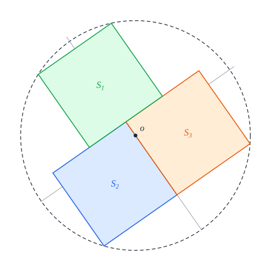

# Preliminaries

[Back to the proof overview](README.md) · [Shared lemmas](common.md)

This page fixes the notation and restates the definitions that the main
theorem is stated with; their Lean text is on
[the definitions page](../definitions.md). The tools of the proofs are defined
on the [shared-lemmas page](common.md), each just before the lemmas that use
it. Each definition ends with the Lean declarations it corresponds to.

## Notation at a glance

Definitions 1 to 5 are on this page, Definitions 6 to 17 on the
[shared-lemmas page](common.md).

| symbol | meaning | defined in |
| --- | --- | --- |
| $\overline{D}(c, r)$, $D(c, r)$ | the closed and the open disk | Conventions |
| $u(\theta)$ | the unit vector in the direction $\theta$ | Conventions |
| $c_S$, $e^S_1, e^S_2$ | the centre and the frame of a square $S$ | Definition 1 |
| $x_S$, $y_S$ | local coordinates in the frame of $S$ | Definition 1 |
| $S^\circ$, $\overline{S}$ | the open and the closed square | Definition 1 |
| $Q(c)$ | the axis-parallel unit square centred at $c$ | Definition 2 |
| $o$ | the disk centre | Definition 3 |
| $F_\phi$ | the frame at $o$ turned by $\phi$ | Definition 4 |
| $M_1, \dots, M_n$ | a model: unit squares about the origin | Definition 5 |
| $a_S \ge b_S$ | the offsets of $o$ from $c_S$ along the axes of $S$ | [Definition 6](common.md#definition-6-position-of-the-disk-centre) |
| $\varphi(a, b)$ | the farthest-vertex function | [Definition 8](common.md#definition-8-farthest-vertex-function) |
| $P_8$ ($P_3$, $P_5$) | contact polygons in the $(a, b)$-plane | [Definitions 10, 11](common.md#definition-10-contact-polygon) |
| $w_S(n)$ | the half-width of $S$ in the direction $n$ | [Definition 12](common.md#definition-12-width) |
| $\Gamma_r$, $d(\theta, \theta')$ | the circle of radius $r$ about $o$; the angle between two directions | [Definition 13](common.md#definition-13-circles-about-the-disk-centre) |
| arc, half-width | a stretch of $\Gamma_r$ that lies in a given set | [Definition 14](common.md#definition-14-arc) |
| $\theta_S$, $\varepsilon_S$, $t$ | the phase and orientation of the chart of $S$, and the chart angle | [Definition 15](common.md#definition-15-chart) |
| $A_S$, $V_S$, $U_S$ | where $\Gamma_r$ crosses the lines of the edges of an exterior square $S$ | [Definition 16](common.md#definition-16-crossing-angles) |
| $\widehat{S}$ | the radial sweep of $S$ | [Definition 17](common.md#definition-17-radial-sweep) |
| $r(a, u)$, $\ell(a, u)$ | the remainder and the label of a state, for seven squares | [Definitions 7.3, 7.4](seven.md#definition-73-states) |
| $h(a, b, z)$, $\sigma_k(g)$ | the support function, and the support sums of a pair, for seven squares | [Definitions 7.7, 7.8](seven.md#definition-77-support-function) |

## Conventions

We work in the Euclidean plane: points are vectors in $\mathbb{R}^2$, with the
inner product $\langle p, q\rangle$ and the norm $|p|$. For a point $c$ and a
radius $r \ge 0$, the closed and the open disk of centre $c$ and radius $r$
are

```math
\overline{D}(c, r) = \lbrace p : |p - c| \le r \rbrace, \qquad D(c, r) = \lbrace p : |p - c| < r \rbrace .
```

A *direction* is an angle modulo $2\pi$. The unit vector in the direction
$\theta$ is $u(\theta) = (\cos\theta, \sin\theta)$, and the direction of a
nonzero vector $v$ is the $\theta$ with $v = |v| u(\theta)$.

*Lean: [`Point`](../../SquaresInCircles/Geometry.lean#L16),
[`normSq`](../../SquaresInCircles/Geometry.lean#L18) (the squared norm),
[`inDisk`](../../SquaresInCircles/Geometry.lean#L46) (the closed disk, stated
with squared distances),
[`Direction`](../../SquaresInCircles/Geometry.lean#L56).*

## Unit squares

A unit square can sit anywhere in the plane and be turned any way. We describe
it through its own frame. Everything attached to a square carries its name:
its centre $c_S$, its frame $e^S_1, e^S_2$, and later $a_S$, $A_S$, $\theta_S$.

### Definition 1 (unit square)

A *unit square* $S$ is given by a centre $c_S$ and an orthonormal frame
$e^S_1, e^S_2$, with $e^S_2$ a quarter turn from $e^S_1$. The *local
coordinates* of a point $p$ are its coordinates in this frame,

```math
x_S(p) = \langle p - c_S,\ e^S_1\rangle, \qquad y_S(p) = \langle p - c_S,\ e^S_2\rangle ,
```

and in them $S$ is the standard square: its *open square* $S^\circ$ is the set
of points with $|x_S|, |y_S| < \frac12$, and its *closed square*
$\overline{S}$ the set with $|x_S|, |y_S| \le \frac12$. The vertices are
$c_S \pm \frac12 e^S_1 \pm \frac12 e^S_2$. Turning the frame by a quarter turn
gives the same sets, and every statement is about these sets.


*The frame of $S$ at its centre $c_S$, and the local coordinates of a point $p$.
The open square is where both are below $\frac12$ in absolute value.*

*Lean: [`UnitSquare`](../../SquaresInCircles/Geometry.lean#L22),
[`localX`](../../SquaresInCircles/Geometry.lean#L28),
[`localY`](../../SquaresInCircles/Geometry.lean#L31),
[`openSquare`](../../SquaresInCircles/Geometry.lean#L37),
[`closedSquare`](../../SquaresInCircles/Geometry.lean#L34).*

### Definition 2 (axis-parallel square)

For a point $c = (c_1, c_2)$, $Q(c)$ is the unit square with centre $c$ and the
standard frame, so that

```math
Q(c)^\circ = \lbrace (x, y) : |x - c_1| < \tfrac12,\ |y - c_2| < \tfrac12 \rbrace, \qquad
\overline{Q(c)} = \lbrace (x, y) : |x - c_1| \le \tfrac12,\ |y - c_2| \le \tfrac12 \rbrace .
```

The optimal packings are made of such squares.


*The square $Q(c)$ spans $c_1 \pm \frac12$ across and $c_2 \pm \frac12$ up.*

*Lean: [`axisSquare`](../../SquaresInCircles/Geometry.lean#L63) for $Q(c)$;
[`openAxisSquare`](../../SquaresInCircles/Common/Constructions.lean#L9) and
[`closedAxisSquare`](../../SquaresInCircles/Common/Constructions.lean#L11) for
the two conditions above.*

## Packings and congruence

The main theorem is about unit squares packed in a disk. For each $n$ it names
the smallest radius and the packings that attain it, as models about the
origin: for $n \le 5$ one model, so the optimal packing is unique up to a
rotation about the disk centre and a relabelling of the squares, and for
$n = 7$ a family of models in which each of the three middle squares can move
along the middle column.

### Definition 3 (packing)

Two squares $S$ and $T$ are *disjoint* if their open squares do not meet. A
*packing* of $n$ unit squares in the closed disk $\overline{D}(o, R)$ is a
family of $n$ pairwise disjoint unit squares whose closed squares lie in
$\overline{D}(o, R)$. The point $o$ is the *disk centre*.


*A packing of three unit squares in the closed disk of radius $R$ about $o$.*

*Lean: [`InteriorDisjoint`](../../SquaresInCircles/Common/Basic.lean#L39),
[`Packing`](../../SquaresInCircles/Geometry.lean#L50).*

### Definition 4 (frames at the disk centre)

To compare a packing with a model, we read it in coordinates centred at $o$.
For a direction $\phi$ let

```math
F_\phi(x, y) = o + x\,u(\phi) + y\,u\left(\phi + \tfrac\pi2\right),
```

the frame at $o$ whose first axis points in the direction $\phi$. A square $S$
*sits at $c$ in the frame $\phi$* if, in these coordinates, its open square is
$Q(c)^\circ$.


*The frame $F_\phi$ at $o$. The square sits at $c = (c_1, c_2)$: in these
coordinates it is $Q(c)$.*

*Lean: [`pointInDirection`](../../SquaresInCircles/Geometry.lean#L59),
[`Represents`](../../SquaresInCircles/Common/Congruence.lean#L18).*

### Definition 5 (congruence to a model)

A *model* is a configuration $M_1, \dots, M_n$ of unit squares about the
origin; every model here is made of axis-parallel squares
$Q(c_1), \dots, Q(c_n)$. A configuration $S_1, \dots, S_n$ with disk centre $o$
is *congruent to* the model if, for one direction $\phi$ and one relabelling
$\sigma$, the frame $F_\phi$ carries each model square onto a square of the
configuration, the open squares and the closed squares alike:

```math
S_{\sigma(i)}^\circ = F_\phi\left(M_i^\circ\right), \qquad \overline{S_{\sigma(i)}} = F_\phi\left(\overline{M_i}\right) \qquad (i = 1, \dots, n) .
```

In words: placed with its origin at $o$, the model is carried onto the
configuration by one rotation about $o$ and one relabelling. For the model
$Q(c_1), \dots, Q(c_n)$ this says that each $S_{\sigma(i)}$ sits at $c_i$ in
the frame $\phi$, for the open and the closed squares alike.



*A packing congruent to the T. Turning the model by $\phi$ about $o$ gives the
packing; the square in slot $c_i$ is $S_{\sigma(i)}$, here with
$\sigma(1) = 2$, $\sigma(2) = 3$, $\sigma(3) = 1$.*

*Lean: [`Congruent`](../../SquaresInCircles/Geometry.lean#L75).*

With these definitions the main theorem can be stated; it is on the
[overview page](README.md#the-main-theorem).
