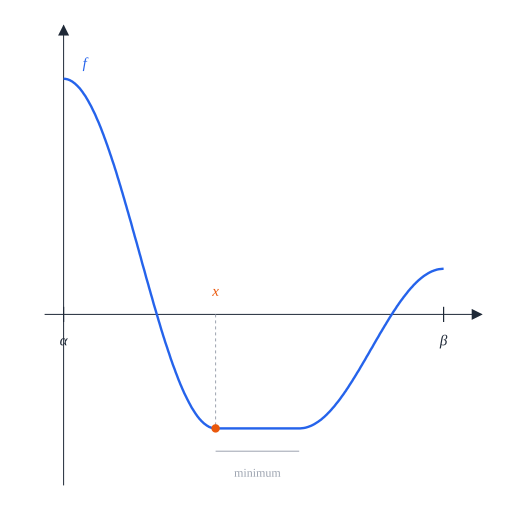

# 9. Seven squares

[Contents](README.md) · [← 8. Five squares](five.md) · [Appendix A →](appendix-a.md)

This chapter proves that the least radius of a closed disk that holds seven
unit squares with disjoint interiors is $R_7 = \frac{\sqrt{13}}2$, and it
finds all the packings at that radius. Unlike one to five squares, the optimal
packing is not unique: four squares form two side columns, and each of the
three squares of the middle column can slide along it on its own, as long as
the three stay 1 apart and inside the disk.

The idea is the following. Every square that does not contain the disk centre
gets a *marker*, a direction from the disk centre computed from the position of
the centre relative to the square. The heart of the proof is a statement about
two disjoint such squares: their markers are at least $\frac\pi3$ apart, and
exactly $\frac\pi3$ apart only if the two squares touch as neighbours do in the
optimal packings. Seven markers cannot be pairwise $\frac\pi3$ apart, so one
square contains the disk centre; the markers of the other six form a regular
hexagon, and the contacts between neighbours rebuild the optimal packing. The
argument compares pairs of squares rather than arcs of a single circle, and it
uses the disk only through the farthest-vertex bound
$\varphi(a_S, b_S) \le \frac{13}4$ of
[Lemma 3.4](common.md#lemma-34-farthest-vertex).

## Theorem 9.1 (seven squares)

Let $R_7 = \frac{\sqrt{13}}2$. For real numbers $y_1, y_2, y_3$, the *heights*,
with

```math
-\left(\sqrt3 - \tfrac12\right) \le y_1, \qquad y_1 + 1 \le y_2, \qquad y_2 + 1 \le y_3, \qquad y_3 \le \sqrt3 - \tfrac12 ,
```

the *column packing* with these heights is the model $Q(1, -\frac12)$,
$Q(1, \frac12)$, $Q(-1, -\frac12)$, $Q(-1, \frac12)$, $Q(0, y_1)$,
$Q(0, y_2)$, $Q(0, y_3)$: a column of three squares between two columns of
two.

1. Every column packing is a packing in the closed disk of radius $R_7$ about
   the origin.
2. If seven unit squares form a packing in a closed disk of radius $R$, then
   $R \ge R_7$.
3. The packings of seven unit squares in a closed disk of radius $R_7$ are
   exactly the configurations congruent to a column packing.


*Figure 9.1.* The column packing with heights $(-1, 0, 1)$ in its circle of
radius $R_7$ (dashed). The unit circle $\Gamma_1$ about the disk centre $o$
splits into six arcs of exactly 60°, one in each square that avoids $o$; the
middle square (grey) contains $o$. The centres of the six arcs are the markers
of Definition 9.6, in the directions 30°, 90°, …, 330°, exactly $\frac\pi3$
apart.

*Lean: [`Seven.radius`](../../SquaresInCircles/Geometry.lean#L238),
[`Seven.columnLimit`](../../SquaresInCircles/Geometry.lean#L243),
[`Seven.Column`](../../SquaresInCircles/Geometry.lean#L248),
[`Seven.columnCenters`](../../SquaresInCircles/Geometry.lean#L259),
[`Seven.columnModel`](../../SquaresInCircles/Geometry.lean#L265),
[`Seven.column_packing`](../../SquaresInCircles/Seven/Construction.lean#L49),
[`Seven.uniqueness`](../../SquaresInCircles/Seven/Uniqueness.lean#L64),
[`Seven.optimum`](../../SquaresInCircles/Seven/Uniqueness.lean#L70).*

*Remark.* The optimum is not unique. The four side squares are fixed, but each
of the three middle squares can move along the middle column on its own, as
long as their centres stay at least 1 apart and within $\sqrt3 - \frac12$ of
the disk centre (Figure 9.2). The four outer corners $(\pm\frac32, \pm1)$ lie on
the circle of radius $R_7$; a middle square reaches it only at the end of its
range. In every column packing the middle square $Q(0, y_2)$ contains the
origin: $y_2 \ge y_1 + 1 \ge \frac32 - \sqrt3$ and
$y_2 \le y_3 - 1 \le \sqrt3 - \frac32$, so
$|y_2| \le \sqrt3 - \frac32 < \frac12$. The other six squares avoid it: the
side centres are 1 away from it in the first coordinate, and
$y_1 \le y_2 - 1 \le \sqrt3 - \frac52 < -\frac12$ and
$y_3 \ge y_2 + 1 \ge \frac52 - \sqrt3 > \frac12$.

*Outline of the proof.* Part (1) is Proposition 9.2 (§9.1). The work is part
(3) at the radius $R_7$ itself: Proposition 9.3 shows that every packing in the
closed disk of radius $R_7$ is congruent to a column packing, and parts (2) and
(3) then follow from
[Corollary 2.10](preliminaries.md#corollary-210-the-scheme-of-proof) (§9.8).
The proof of Proposition 9.3 has five steps.

1. *States and markers* (§9.2). Each square $S$ that does not contain the disk
   centre has a *state* $(a_S, b_S)$, the position of the disk centre seen
   from the square, and a *marker*, a direction from the disk centre. At the
   radius $R_7$ the states are *admissible*: $\varphi(a_S, b_S) \le \frac{13}4$.
   The closed square contains a long arc of the unit circle about its marker
   (Lemma 9.9, proved in [Appendix A](appendix-a.md)).
2. *Pairs of squares* (§9.3, §9.4). Two such squares, read in the frame of the
   first, form a *canonical pair*, and four *support sums* $\sigma_k$ measure
   the overlaps of their shadows on the four edge directions of the first
   square. If the squares are disjoint, a support sum of the pair, or of the
   pair seen from the second square, is at most 0 (Lemma 9.14). When the
   markers are exactly $\frac\pi3$ apart, every support sum is nonnegative,
   and it vanishes only at a *contact*, one of the three ways in which
   neighbours touch in a column packing (Proposition 9.17, proved in
   [Appendix B](appendix-b.md), [Appendix C](appendix-c.md) and
   [Appendix D](appendix-d.md)).
3. *Marker separation* (§9.5). For markers less than $\frac\pi3$ apart every
   support sum is positive (Theorem 9.23). So disjoint squares have markers at
   least $\frac\pi3$ apart, and exactly $\frac\pi3$ apart only at a contact
   (Theorem 9.24).
4. *The ring* (§9.6). Seven markers do not fit, so some square contains the
   disk centre. The markers of the other six form a regular hexagon,
   neighbours round it are contacts, and the contacts rebuild the two side
   columns and one square above and one below the centre (Proposition 9.26).
5. *The middle column* (§9.7). The side columns pin the square that contains
   the disk centre to the middle column (Lemma 9.27). The three squares of the
   column need only be 1 apart, and that is a column packing.

## 9.1 Construction

### Proposition 9.2 (the column packings)

Let $y_1, y_2, y_3$ be heights as in Theorem 9.1.

1. The column packing with these heights is a packing in the closed disk of
   radius $R_7$ about the origin.
2. The four *slacks*

   ```math
   \eta_0 = y_1 + \sqrt3 - \tfrac12, \qquad \eta_1 = y_2 - y_1 - 1, \qquad \eta_2 = y_3 - y_2 - 1, \qquad \eta_3 = \sqrt3 - \tfrac12 - y_3 ,
   ```

   the room below, between and above the squares of the middle column, are
   nonnegative with $\eta_0 + \eta_1 + \eta_2 + \eta_3 = 2\sqrt3 - 3$.
   Conversely, for all nonnegative $\eta_0, \dots, \eta_3$ with this sum there
   is exactly one choice of heights with these slacks.

*Proof.* (1) We apply
[Lemma 2.8](preliminaries.md#lemma-28-axis-parallel-squares) (3). Any two of
the seven centres differ by at least 1 in one coordinate: two side centres
$(\pm1, \pm\frac12)$ differ by 2 in the first coordinate or by 1 in the second;
a side centre and a middle centre $(0, y_i)$ differ by 1 in the first; and two
middle centres differ by at least 1 in the second, as $y_2 - y_1 \ge 1$,
$y_3 - y_2 \ge 1$ and $y_3 - y_1 \ge 2$. Each centre $(x, y)$ satisfies
$(|x| + \frac12)^2 + (|y| + \frac12)^2 \le R_7^2 = \frac{13}4$: for the side
centres this is $\frac94 + 1 = \frac{13}4$, and for a middle centre it is
$\frac14 + (|y_i| + \frac12)^2 \le \frac14 + 3$, because
$-(\sqrt3 - \frac12) \le y_1 \le y_2 \le y_3 \le \sqrt3 - \frac12$.

(2) The slacks are nonnegative by the four conditions on the heights, and
their sum telescopes to $2(\sqrt3 - \frac12) - 2 = 2\sqrt3 - 3$. Conversely the
slacks determine the heights, $y_1 = -(\sqrt3 - \frac12) + \eta_0$,
$y_2 = y_1 + 1 + \eta_1$, $y_3 = y_2 + 1 + \eta_2$, and these heights satisfy
the four conditions, the last one because
$y_3 = \sqrt3 - \frac12 - \eta_3$ when the slacks add up to $2\sqrt3 - 3$.
$\square$

*Lean:
[`Seven.column_packing`](../../SquaresInCircles/Seven/Construction.lean#L49),
[`Seven.model_packing`](../../SquaresInCircles/Seven/Construction.lean#L87),
[`Seven.centeredColumn`](../../SquaresInCircles/Seven/Construction.lean#L70),
[`Seven.Column.slots`](../../SquaresInCircles/Seven/Construction.lean#L94),
[`Seven.Column.slots_nonneg`](../../SquaresInCircles/Seven/Construction.lean#L98),
[`Seven.Column.sum_slots`](../../SquaresInCircles/Seven/Construction.lean#L102),
[`Seven.columnOfSlots`](../../SquaresInCircles/Seven/Construction.lean#L109),
[`Seven.columnSlotEquiv`](../../SquaresInCircles/Seven/Construction.lean#L140),
[`axis_packing`](../../SquaresInCircles/Common/Constructions.lean#L38).*


*Figure 9.2.* Three column packings: the middle column pushed down, spread out
and pushed up, with slacks $(0, 0, 0, 2\sqrt3 - 3)$,
$(0, \sqrt3 - \frac32, \sqrt3 - \frac32, 0)$ and $(2\sqrt3 - 3, 0, 0, 0)$. The
side columns do not move; the middle column has $2\sqrt3 - 3 \approx 0.46$ of
room in all, shared in any way among its four slacks.

## 9.2 States, labels and markers

The proof of the following proposition occupies §9.2 to §9.7; it is completed
at the end of §9.7.

### Proposition 9.3 (uniqueness)

Every packing of seven unit squares in a closed disk of radius $R_7$ is
congruent to a column packing.

*Lean: [`Seven.uniqueness`](../../SquaresInCircles/Seven/Uniqueness.lean#L64).*

Throughout, the disk centre $o$ is fixed. For every exterior square $S$
([Definition 3.2](common.md#definition-32-containing-and-exterior-squares)) we
fix a chart $(\theta_S, \varepsilon_S)$
(([Definition 3.20](common.md#definition-320-chart) and [Lemma 3.21](common.md#lemma-321-charts))): in it, $S$ is the axis-parallel unit
square centred at $(a_S, b_S)$, with $a_S \ge \frac12$ and
$0 \le b_S \le a_S$, and by
[Lemma 3.22](common.md#lemma-322-cartesian-form-of-a-chart) $S$ sits at
$(a_S, \varepsilon_S b_S)$ in the frame $\theta_S$. A square may have more than
one chart (for instance when $a_S = b_S$); everything below holds for any
choice.

### Definition 9.4 (states)

A *state* is a pair of real numbers $(a, u)$ with $\frac12 \le a$ and
$0 \le u \le a$. It is *admissible* if moreover
$\varphi(a, u) \le \frac{13}4$. The *remainder* of $(a, u)$ is

```math
r(a, u) = 4 - 3a - 2u .
```

The *state* of an exterior square $S$ is $(a_S, b_S)$, and its *sign* is
$\varepsilon_S$.

*Lean: [`Seven.Admissible`](../../SquaresInCircles/Seven/Exterior.lean#L33),
[`ExteriorChart`](../../SquaresInCircles/Common/ExteriorCharts.lean#L17),
[`Seven.remainder`](../../SquaresInCircles/Seven/Exterior.lean#L30),
[`Seven.targetSq`](../../SquaresInCircles/Seven/Exterior.lean#L25).*

### Lemma 9.5 (admissible states)

1. For all real $a$ and $u$,

   ```math
   r(a, u) = (a - 1)^2 + \left(u - \tfrac12\right)^2 + \tfrac{13}4 - \varphi(a, u) .
   ```

   Hence an admissible state has $r(a, u) \ge 0$, that is $3a + 2u \le 4$.
2. An admissible state $(a, u)$ has $a \le \sqrt3 - \frac12 < \frac54$,
   $a + u < \frac{31}{20}$ and $u < \frac{31}{40}$. Here
   $1.73 < \sqrt3 < 1.733$.
3. If $S$ is an exterior square with $\varphi(a_S, b_S) \le \frac{13}4$, in
   particular if $\overline S$ lies in a closed disk of radius $R_7$ about $o$,
   then the state of $S$ is admissible.

*Proof.* (1) This is the identity of
[Lemma 3.6](common.md#lemma-36-tangent-lines) at the point $(1, \frac12)$,
where $\varphi(1, \frac12) = \frac{13}4$ and the linear terms are
$3(a - 1) + 2(u - \frac12) = -r(a, u)$. For an admissible state the three terms
on the right are nonnegative.

(2) As $u \ge 0$, [Lemma 3.4](common.md#lemma-34-farthest-vertex) (2) gives
$a \le \sqrt{\frac{13}4 - \frac14} - \frac12 = \sqrt3 - \frac12$; and
$\sqrt3 < \frac74$ because $3 < \frac{49}{16}$. Next,
$2\varphi(a, u) = (a + u + 1)^2 + (a - u)^2 \ge (a + u + 1)^2$, so
$(a + u + 1)^2 \le \frac{13}2 < (\frac{51}{20})^2 = 6.5025$ and
$a + u < \frac{31}{20}$. With $u \le a$ this gives
$2u \le a + u < \frac{31}{20}$. The bounds on $\sqrt3$ follow from
$1.73^2 < 3 < 1.733^2$.

(3) By [Lemma 3.21](common.md#lemma-321-charts) (1), $a_S \ge \frac12$ since
$o \notin S^\circ$, and $0 \le b_S \le a_S$ by
[Definition 3.1](common.md#definition-31-position-of-the-disk-centre). If
$\overline S$ lies in the closed disk of radius $R_7$ about $o$, then
$\varphi(a_S, b_S) \le R_7^2 = \frac{13}4$ by
[Lemma 3.4](common.md#lemma-34-farthest-vertex). $\square$

*Lean:
[`Seven.remainder_identity`](../../SquaresInCircles/Seven/Exterior.lean#L35),
[`Seven.Admissible.remainder_nonneg`](../../SquaresInCircles/Seven/Exterior.lean#L58),
[`Seven.Admissible.tangent`](../../SquaresInCircles/Seven/Exterior.lean#L55),
[`tangent_le`](../../SquaresInCircles/Common/Tangents.lean#L19),
[`Seven.Admissible.a_le_sqrt_three_sub_half`](../../SquaresInCircles/Seven/Exterior.lean#L62),
[`Seven.Admissible.a_lt_five_fourths`](../../SquaresInCircles/Seven/Exterior.lean#L65),
[`Seven.Admissible.sum_lt`](../../SquaresInCircles/Seven/Exterior.lean#L69),
[`Seven.Admissible.u_lt`](../../SquaresInCircles/Seven/Exterior.lean#L73),
[`dot_gt`](../../SquaresInCircles/Common/DiskSupport.lean#L34),
[`coordinate_le_of_phi`](../../SquaresInCircles/Common/Basic.lean#L166),
[`Seven.sqrt_three_bounds`](../../SquaresInCircles/Seven/Exterior.lean#L222),
[`SquareChart.exteriorChart`](../../SquaresInCircles/Common/ExteriorCharts.lean#L49).*

The identity (1) says that $r \ge 0$ is the tangent half-plane
(([Definition 3.5](common.md#definition-35-tangent-half-plane) and [Lemma 3.6](common.md#lemma-36-tangent-lines))) of the circle
$\varphi = \frac{13}4$ at $(1, \frac12)$, and that among admissible states
$r = 0$ only at that point (Figure 9.3). In a column packing the four side
squares have the state $(1, \frac12)$, and the top and bottom squares have the
states $(y_3, 0)$ and $(-y_1, 0)$, where
$\frac52 - \sqrt3 \le y_3, -y_1 \le \sqrt3 - \frac12$.


*Figure 9.3.* The admissible states: $\frac12 \le a$, $0 \le u \le a$ and
$\varphi(a, u) \le \frac{13}4$. The line $r = 0$ touches the circle
$\varphi = \frac{13}4$ at the side state $(1, \frac12)$, and the region lies on
the side $r \ge 0$. The axial states of Definition 9.15 form the thick
segment of the $a$-axis; the transition state $(a_0, u_0)$ of Definition 9.6 is
marked on the arc.

### Definition 9.6 (labels and markers)

For real $a$ and $u$ let

```math
\mathrm{axial}(u) = \tfrac54 u, \qquad
\mathrm{side}(a, u) = \tfrac\pi6 + \tfrac13\left(u - \tfrac12\right) + \tfrac34(1 - a), \qquad
\ell(a, u) = \min\left(\mathrm{axial}(u), \mathrm{side}(a, u), \tfrac\pi4\right) .
```

The number $\ell(a, u)$ is the *label* of $(a, u)$. The label is *axial*,
*side* or *capped* when the first, second or third term attains the minimum,
and *active* when it is axial or side. A tie counts for every term that
attains the minimum, so a label equal to $\frac\pi4$ can be both capped and
active. The *marker* of an exterior square $S$ is the direction

```math
\mu_S = \theta_S + \varepsilon_S\,\ell(a_S, b_S) .
```

The axial and side terms agree exactly on the line $9a + 11u = 2\pi + 7$,
since $12(\mathrm{axial}(u) - \mathrm{side}(a, u)) = 9a + 11u - 2\pi - 7$. This
line meets the circle $\varphi = \frac{13}4$ in two points; the one with the
larger $a$ is the *transition state* $(a_0, u_0)$,

```math
a_0 = \frac{9M + 11J}{202} - \frac12, \qquad u_0 = \frac{11M - 9J}{202} - \frac12, \qquad M = 2\pi + 17, \quad J = \sqrt{202\cdot\tfrac{13}4 - M^2} ,
```

and $s_0 = \frac54 u_0$ is its label. Numerically
$(a_0, u_0) \approx (1.1198, 0.2914)$ and $s_0 \approx 0.3642$.

*Lean: [`Seven.axial`](../../SquaresInCircles/Seven/Exterior.lean#L27),
[`Seven.side`](../../SquaresInCircles/Seven/Exterior.lean#L28),
[`Seven.label`](../../SquaresInCircles/Seven/Exterior.lean#L29),
[`Seven.ActiveLabel`](../../SquaresInCircles/Seven/Pair/Contacts.lean#L65),
[`Seven.chartMarker`](../../SquaresInCircles/Seven/Exterior.lean#L219),
[`Seven.chartSign`](../../SquaresInCircles/Seven/Pair.lean#L20),
[`Seven.Boundary.a0`](../../SquaresInCircles/Seven/Pair/LabelBoundary.lean#L19),
[`Seven.Boundary.u0`](../../SquaresInCircles/Seven/Pair/LabelBoundary.lean#L20),
[`Seven.Boundary.s0`](../../SquaresInCircles/Seven/Pair/LabelBoundary.lean#L21).*

The label is an angle measured in the chart from the phase $\theta_S$ towards
the centre of $S$ (Figure 9.5). In the column packing of Figure 9.1 the side
squares have the label $\mathrm{side}(1, \frac12) = \frac\pi6$ and the top and
bottom squares the label $\mathrm{axial}(0) = 0$; for instance $Q(1, -\frac12)$
has the chart $(0, -1)$ and the marker $-\frac\pi6$, and the top square has a
chart with phase $\frac\pi2$ and the marker $\frac\pi2$. This puts the six
markers at 30°, 90°, …, 330°.

![The admissible region of the (a, u)-plane divided into three label regions: the axial region below and left, where the label is 5u/4; the side region on the right next to the circle, where the label is the side term; and the small capped triangle near the diagonal, where the label is pi/4. The dividing lines meet at one point; level lines of the label are drawn in each region, horizontal in the axial region and of slope 9/4 in the side region; the side state, the transition state and the axial segment are marked](figures/seven-labels.svg)

*Figure 9.4.* The label on the admissible region. It is axial (green) below
the line $u = \frac\pi5$ and left of the line $9a + 11u = 2\pi + 7$, side
(orange) to the right of that line and below the line $9a - 4u = 7 - \pi$, and
capped (grey) in the triangle above both, whose vertices are
$(\frac\pi5, \frac\pi5)$, $(\frac{7 - \pi/5}9, \frac\pi5)$ and
$(\frac{7 - \pi}5, \frac{7 - \pi}5)$; the three lines meet at the second
vertex. The thin lines are level lines of $\ell$ at $0.1, 0.2, \dots, 0.7$,
horizontal where the label is axial. The side state (orange dot) and the
transition state (black dot) are marked.

### Lemma 9.7 (the label)

1. For all real $a$ and $u$,

   ```math
   \mathrm{side}(a, u) = \tfrac\pi6 + \tfrac56\left(u - \tfrac12\right) + \tfrac14 r(a, u)
   = \tfrac\pi6 - \tfrac54(a - 1) - \tfrac16 r(a, u) .
   ```

2. Let $(a, u)$ be admissible. Then $\mathrm{side}(a, u) > 0$ and
   $0 \le \ell(a, u) \le \frac\pi4$; the label is equal to one of
   $\mathrm{axial}(u)$, $\mathrm{side}(a, u)$, $\frac\pi4$ and at most each of
   them; and $\ell(a, u) = 0$ if and only if $u = 0$.
3. An admissible state has $a \le 1 + \frac{2\pi}{15} - \frac45\ell(a, u)$.

*Proof.* (1) Both expressions expand to
$\frac\pi6 + \frac7{12} - \frac34 a + \frac13 u$, and so does
$\mathrm{side}(a, u)$.

(2) By Lemma 9.5 (2), $u \ge 0$ and $a < \frac54$ give
$\mathrm{side}(a, u) > \frac\pi6 - \frac16 - \frac3{16}$, and this is
$\frac\pi6 - \frac{17}{48} > 0$ as $\pi > 3$. The label is the least of the
three numbers $\frac54 u \ge 0$, $\mathrm{side}(a, u) > 0$ and $\frac\pi4$; it
equals one of them and is at most each. If $u = 0$ then
$0 \le \ell(a, u) \le \mathrm{axial}(0) = 0$; if $u > 0$ all three numbers are
positive, and so is the label.

(3) By (1) and $r(a, u) \ge 0$,
$\ell(a, u) \le \mathrm{side}(a, u) \le \frac\pi6 - \frac54(a - 1)$; solve for
$a$. $\square$

*Lean:
[`Seven.side_identity_transverse`](../../SquaresInCircles/Seven/Exterior.lean#L40),
[`Seven.side_identity_radial`](../../SquaresInCircles/Seven/Exterior.lean#L45),
[`Seven.Admissible.side_pos`](../../SquaresInCircles/Seven/Exterior.lean#L75),
[`Seven.Admissible.label_nonneg`](../../SquaresInCircles/Seven/Exterior.lean#L81),
[`Seven.Admissible.label_le_axial`](../../SquaresInCircles/Seven/Exterior.lean#L85),
[`Seven.Admissible.label_le_side`](../../SquaresInCircles/Seven/Exterior.lean#L89),
[`Seven.Admissible.label_le_quarter`](../../SquaresInCircles/Seven/Exterior.lean#L93),
[`Seven.Admissible.label_mem`](../../SquaresInCircles/Seven/Exterior.lean#L96),
[`Seven.Admissible.selected`](../../SquaresInCircles/Seven/Exterior.lean#L117),
[`Seven.Admissible.label_zero_iff`](../../SquaresInCircles/Seven/Exterior.lean#L99),
[`Seven.Admissible.radial_label_bound`](../../SquaresInCircles/Seven/Exterior.lean#L110).*

### Lemma 9.8 (side and axial labels)

Let $(a, u)$ be an admissible state.

1. If the label is side, $\ell(a, u) = \mathrm{side}(a, u)$, then
   $\ell(a, u) > \frac9{25}$, $\frac7{10} < a < \frac98$, and

   ```math
   \tfrac95\left(\ell(a, u) - \tfrac\pi6\right)^2 \le r(a, u) .
   ```

2. If the label is axial, $\ell(a, u) = \mathrm{axial}(u)$, then
   $9a + 11u \le 2\pi + 7$ and $a + u < 1 + \frac{2\pi}{15}$.

*Proof.* We use $3.14 < \pi < 3.1416$.

(1) Write $\ell = \ell(a, u)$. Since $\ell = \mathrm{side}(a, u)$ we
have $12\ell = 2\pi + 7 + 4u - 9a$, and since $\ell \le \mathrm{axial}(u)$ we
have $u \ge \frac45\ell$.

*The label exceeds $\frac9{25}$.* Every admissible state has
$2a + u < 2.532$: with $X = a + \frac12$ and $Y = u + \frac12$,

```math
(2X + Y)^2 + (2Y - X)^2 = 5\left(X^2 + Y^2\right) = 5\,\varphi(a, u) \le \tfrac{65}4 < 4.032^2 ,
```

so $2X + Y < 4.032$, that is $2a + u < 2.532$.
This is the disk $\varphi \le \frac{13}4$ seen in the direction $(2, 1)$.
Now suppose $\ell \le \frac9{25}$. Then $9a = 2\pi + 7 - 12\ell + 4u$ and
$u \ge \frac45\ell$ give

```math
9(2a + u) = 4\pi + 14 - 24\ell + 17u \ge 4\pi + 14 - \tfrac{52}5\ell \ge 4\pi + 14 - \tfrac{52}5 \cdot \tfrac9{25} > 12.56 + 14 - 3.744 > 22.8 ,
```

so $2a + u > \frac{22.8}9 > 2.533$, a contradiction.

*The bound $a < \frac98$.* Suppose $a \ge \frac98$. From
$\mathrm{side}(a, u) > \frac9{25}$,

```math
u - \tfrac12 > \tfrac{27}{25} - \tfrac\pi2 + \tfrac94(a - 1) \ge 1.08 - 1.5708 + 0.28125 > -0.21 ,
```

so $u + \frac12 > 0.79$. With $a + \frac12 \ge \frac{13}8$, the state lies beyond
the corner $(\frac98, 0.29)$, which is already outside the disk:

```math
\varphi(a, u) > \left(\tfrac{13}8\right)^2 + 0.79^2 > 2.64 + 0.62 > \tfrac{13}4 ,
```

a contradiction.

*The bound $a > \frac7{10}$.* From $\ell \le \frac\pi4$,
$\frac13(u - \frac12) \le \frac\pi{12} - \frac34(1 - a)$, that is
$u \le \frac94 a + \frac\pi4 - \frac74$. From $\ell \le \mathrm{axial}(u)$,
$9a + 11u \ge 2\pi + 7$. Together,

```math
2\pi + 7 \le 9a + 11\left(\tfrac94 a + \tfrac\pi4 - \tfrac74\right) = \tfrac{135}4 a + \tfrac{11\pi}4 - \tfrac{77}4 ,
```

so $a \ge \frac{35 - \pi}{45}$, which exceeds $\frac7{10}$ as $\pi < \frac72$.

*The quadratic bound.* Put $D = \ell - \frac\pi6$ and $w = r(a, u) \ge 0$. By
Lemma 9.7 (1) with $\ell = \mathrm{side}(a, u)$,
$a - 1 = -\frac45 D - \frac2{15}w$ and $u - \frac12 = \frac65 D - \frac3{10}w$,
so that

```math
(a - 1)^2 + \left(u - \tfrac12\right)^2 = \tfrac{52}{25}D^2 - \tfrac{38}{75}Dw + \tfrac{97}{900}w^2 .
```

By Lemma 9.5 (1) the left side is at most $w$. Also
$D \le \frac\pi4 - \frac\pi6 = \frac\pi{12} < \frac4{15}$, so, as $w \ge 0$,
$\frac{38}{75}Dw \le \frac{38}{75} \cdot \frac4{15}\,w \le \frac w7$. Dropping the
term in $w^2$, we get $w \ge \frac{52}{25}D^2 - \frac w7$, that is,

```math
w \ge \tfrac78 \cdot \tfrac{52}{25}D^2 = \tfrac{91}{50}D^2 \ge \tfrac95 D^2 .
```

(2) Now $\ell(a, u) = \mathrm{axial}(u) \le \mathrm{side}(a, u)$, and
$12(\mathrm{axial}(u) - \mathrm{side}(a, u)) = 9a + 11u - 2\pi - 7$, so
$9a + 11u \le 2\pi + 7$. As $3a + 2u = 4 - r(a, u)$,

```math
15(a + u) = (9a + 11u) + 2(3a + 2u) \le 2\pi + 7 + 8 - 2r(a, u) ,
```

that is, $a + u \le 1 + \frac{2\pi}{15} - \frac2{15}r(a, u)$. Finally
$r(a, u) > 0$: by Lemma 9.5 (1), the only admissible state with
$r(a, u) = 0$ is $(1, \frac12)$, where $9a + 11u = \frac{29}2 > 2\pi + 7$.
$\square$

*Lean:
[`Seven.Admissible.projection_two_one`](../../SquaresInCircles/Seven/Exterior.lean#L127),
[`dot_gt`](../../SquaresInCircles/Common/DiskSupport.lean#L34),
[`Seven.side_selected_label_gt`](../../SquaresInCircles/Seven/Exterior.lean#L131),
[`Seven.side_selected_a_gt`](../../SquaresInCircles/Seven/Exterior.lean#L154),
[`Seven.side_selected_a_lt`](../../SquaresInCircles/Seven/Exterior.lean#L143),
[`Seven.side_remainder_quadratic`](../../SquaresInCircles/Seven/Exterior.lean#L185),
[`Seven.axial_tie_line`](../../SquaresInCircles/Seven/Exterior.lean#L162),
[`Seven.axial_sum_lt`](../../SquaresInCircles/Seven/Exterior.lean#L172).*

### Lemma 9.9 (the marker arc)

Let $(a, u)$ be an admissible state and $t$ a real number with
$|t - \ell(a, u)| \le \frac12$. Then

```math
|\cos t - a| \le \tfrac12 , \qquad |\sin t - u| \le \tfrac12 ,
```

that is, the point $u(t)$ of the unit circle lies in the closed square
$\overline{Q(a, u)}$.

The proof is given in [Appendix A](appendix-a.md).

*Lean: [`Seven.marker_arc`](../../SquaresInCircles/Seven/Exterior.lean#L486).*

In a chart of an exterior square with an admissible state, the lemma says that
the closed square contains the arc of the unit circle with half-width
$\frac12$ (about $28.6°$) about the direction of the label, that is,
about the marker (Figure 9.5). In the column packing of Figure 9.1 each
exterior square contains the arc of half-width exactly $\frac\pi6$ about its
marker.


*Figure 9.5.* The marker. Left: an exterior square $S$ seen from $o$, with its
phase $\theta_S$ (dashed) and its marker $\mu_S = \theta_S + \varepsilon_S\ell$,
here with $\varepsilon_S = -1$. Right: the same square in its chart, where it
is $Q(a, u)$ and the marker is at the angle $\ell(a, u)$. The thick arc of the
unit circle, of half-width $\frac12$ about the marker, lies in the
closed square (Lemma 9.9); the thin arc is the whole part of the circle in the
square.

## 9.3 The canonical pair

To compare two exterior squares we read both in the frame of the first; the
second is then turned by the difference of the phases, and everything depends
only on the two states, the two signs and the angle between the markers.

### Definition 9.10 (support function)

For real $a$, $b$ and a direction $z$ let

```math
h(a, b, z) = a\cos z + b\sin z + \tfrac12\left(|\cos z| + |\sin z|\right) .
```

*Lean: [`support`](../../SquaresInCircles/Common/DiskSupport.lean#L93).*

### Lemma 9.11 (the support function)

1. For all real $a, b, z$, every point $p$ of $\overline{Q(a, b)}$ has
   $\langle p, u(z)\rangle \le h(a, b, z)$, with equality at a vertex. So
   $h(a, b, z) = \max_{p \in \overline{Q(a, b)}} \langle p, u(z)\rangle$ is the
   support function of the closed square.
2. Let $(a, u)$ be admissible, $s \in \lbrace 1, -1\rbrace$, and $x$ real with
   $|x - s\,\ell(a, u)| \le \frac12$. Then
   $u(x) \in \overline{Q(a, su)}$, and $h(a, su, z) \ge \cos(z - x)$ for every
   $z$.
3. If $(a, |b|)$ is admissible, then $a^2 + b^2 \le (\sqrt3 - \frac12)^2$ and
   $h(a, b, z) \ge 1 - \sqrt3 > -\frac{37}{50}$ for every $z$. In particular
   this holds for $b = su$ when $(a, u)$ is admissible and $s = \pm1$.
4. (Cauchy–Schwarz on the disk.) Let $X^2 + Y^2 \le \frac{13}4$, $c \ge 0$ and
   $p, q$ real. If $\frac{13}4(p^2 + q^2) \le c^2$, then $pX + qY \ge -c$; if
   $\frac{13}4(p^2 + q^2) < c^2$, then $pX + qY > -c$.

*Proof.* (1) Write $p = (a + x, b + y)$ with $|x|, |y| \le \frac12$. Then
$\langle p, u(z)\rangle = a\cos z + b\sin z + x\cos z + y\sin z$, and
$x\cos z + y\sin z \le \frac12|\cos z| + \frac12|\sin z|$, with equality when
$x$ and $y$ are $\pm\frac12$ with the signs of $\cos z$ and $\sin z$.

(2) For $s = 1$, Lemma 9.9 with $t = x$ gives $u(x) \in \overline{Q(a, u)}$.
For $s = -1$, apply Lemma 9.9 to $t = -x$, which has
$|t - \ell(a, u)| = |x + \ell(a, u)| \le \frac12$: then
$|\cos x - a| \le \frac12$ and $|{-\sin x} - u| \le \frac12$, so
$u(x) \in \overline{Q(a, -u)}$. In both cases (1) gives
$h(a, su, z) \ge \langle u(x), u(z)\rangle = \cos(z - x)$.

(3) As $a$ and $|b|$ are nonnegative and $\varphi(a, |b|) \le \frac{13}4$,
[Lemma 3.4](common.md#lemma-34-farthest-vertex) (3) gives
$\rho = \sqrt{a^2 + b^2} \le \sqrt{\frac{13}4 - \frac14} - \frac12 = \sqrt3 - \frac12$.
By Cauchy–Schwarz $a\cos z + b\sin z \ge -\rho$, and
$(|\cos z| + |\sin z|)^2 = 1 + 2|\cos z\sin z| \ge 1$, so
$h(a, b, z) \ge \frac12 - \rho \ge 1 - \sqrt3$, and
$1 - \sqrt3 > 1 - 1.733 > -\frac{37}{50}$ by Lemma 9.5 (2).

(4) By Cauchy–Schwarz,
$(pX + qY)^2 \le (p^2 + q^2)(X^2 + Y^2) \le \frac{13}4(p^2 + q^2)$, which is at
most, or less than, $c^2$. $\square$

*Lean: [`point_le_support`](../../SquaresInCircles/Common/DiskSupport.lean#L96),
[`Seven.marker_arc_support`](../../SquaresInCircles/Seven/Pair/Frame.lean#L50),
[`Seven.sign_admissible`](../../SquaresInCircles/Seven/Pair/Frame.lean#L44),
[`Seven.support_lower`](../../SquaresInCircles/Seven/Exterior.lean#L228),
[`support_ge`](../../SquaresInCircles/Common/DiskSupport.lean#L107),
[`ExteriorChart.center_sq_le`](../../SquaresInCircles/Common/ExteriorCharts.lean#L41),
[`dot_ge`](../../SquaresInCircles/Common/DiskSupport.lean#L30),
[`dot_gt`](../../SquaresInCircles/Common/DiskSupport.lean#L34),
[`dot_sq_le`](../../SquaresInCircles/Common/DiskSupport.lean#L24),
[`cauchy_sq`](../../SquaresInCircles/Common/Basic.lean#L41).*

### Definition 9.12 (canonical pair and support sums)

Let $a, u, A, v, g$ be real numbers and $s, t \in \lbrace 1, -1\rbrace$; in all
our applications $(a, u)$ and $(A, v)$ are states. For an angle $d$, $R_d$ is
the rotation of the plane about the origin by $d$,
$R_d(x, y) = x\,u(d) + y\,u(d + \frac\pi2)$. The *turn* is

```math
d = g + s\,\ell(a, u) - t\,\ell(A, v) ,
```

and the *canonical pair* consists of the unit squares $S = Q(a, su)$ and $T$,
the unit square with centre $c_T = R_d(A, tv)$ and frame
$u(d), u(d + \frac\pi2)$. The local coordinates of $R_d\,p$ in $T$ are the
coordinates of $p - (A, tv)$, so

```math
T^\circ = R_d\left(Q(A, tv)^\circ\right), \qquad \overline T = R_d\left(\overline{Q(A, tv)}\right) :
```

with the origin as the disk centre, $S$ sits at $(a, su)$ in the frame $0$ and
$T$ sits at $(A, tv)$ in the frame $d$. The number $g$ is the *gap*: the
*markers* $s\,\ell(a, u)$ of $S$ and $d + t\,\ell(A, v) = g + s\,\ell(a, u)$ of
$T$ are $g$ apart. For $k = 0, 1, 2, 3$ let $n_k = u(k\frac\pi2)$, the outer
normal of the $k$-th edge of $S$. We call $n_0$, $n_1$, $n_2$, $n_3$ the
*outward*, *forward*, *inward* and *backward* axes: $n_0$ points away from the
disk centre and $n_2$ towards it, $n_1$ points in the direction of increasing
angle, towards the marker of $T$, and $n_3$ the other way. The *support sums*
of the pair are

```math
\sigma_k(g) = h\left(a, su, k\tfrac\pi2\right) + h\left(A, tv, k\tfrac\pi2 + \pi - d\right) \qquad (k = 0, 1, 2, 3),
```

regarded as functions of the gap $g$, all other data being fixed. The
*reversed pair* is the canonical pair of $A, v, a, u$ with the signs $-t, -s$
and the same gap $g$; we write $\sigma'_k(g)$ for its support sums.

*Lean:
[`Seven.TransverseSign`](../../SquaresInCircles/Seven/Pair/Frame.lean#L19),
[`Seven.cardinalAngle`](../../SquaresInCircles/Seven/Pair/Frame.lean#L37),
[`Seven.relativePhase`](../../SquaresInCircles/Seven/Pair/Frame.lean#L133),
[`Seven.pairSupport`](../../SquaresInCircles/Seven/Pair/Frame.lean#L39),
[`orientedSquare`](../../SquaresInCircles/Common/Congruence.lean#L87),
[`Seven.CanonicalDisjoint`](../../SquaresInCircles/Seven/Pair/Frame.lean#L170).*


*Figure 9.6.* A canonical pair, with the markers of $S$ and $T$ a gap $g$ apart
and the four axes $n_0, \dots, n_3$ of $S$. Below and to the left are the
shadows of $\overline S$ (blue) and $\overline T$ (green) on the two axes of
$S$. By Lemma 9.13 (1) each support sum compares two ends of shadows: $\sigma_1$
runs from the lower end of the shadow of $T$ to the upper end of the shadow of
$S$, and is positive here; $\sigma_2$ runs from the left end of the shadow of
$S$ to the right end of the shadow of $T$, and is negative here, so a vertical
line separates the squares.

### Lemma 9.13 (support sums)

Let $(S, T)$ be the canonical pair of $a, u, A, v, g, s, t$, with turn $d$,
and let

```math
\Delta = c_T - c_S = (\Delta_1, \Delta_2) = \left(A\cos d - tv\sin d - a,\ A\sin d + tv\cos d - su\right), \qquad
W = \tfrac12\left(1 + |\cos d| + |\sin d|\right) .
```

1. The support sums compare the shadows of the closed squares on the axes:

   ```math
   \sigma_k(g) = \max_{p \in \overline S}\langle p, n_k\rangle - \min_{q \in \overline T}\langle q, n_k\rangle .
   ```

   So $\sigma_k(g) \le 0$ if and only if some line perpendicular to $n_k$ has
   $\overline S$ on one side and $\overline T$ on the other:
   $\langle p, n_k\rangle \le m \le \langle q, n_k\rangle$ for some $m$ and all
   $p \in \overline S$, $q \in \overline T$.
2. In terms of the centres,

   ```math
   \sigma_0(g) = W - \Delta_1, \qquad \sigma_1(g) = W - \Delta_2, \qquad \sigma_2(g) = W + \Delta_1, \qquad \sigma_3(g) = W + \Delta_2 .
   ```

3. The reversed pair has the same turn $d$, and its support sums are

   ```math
   \begin{aligned}
   \sigma'_0(g) &= W + \langle \Delta, u(d)\rangle, & \sigma'_1(g) &= W - \left\langle \Delta, u\left(d + \tfrac\pi2\right)\right\rangle, \\
   \sigma'_2(g) &= W - \langle \Delta, u(d)\rangle, & \sigma'_3(g) &= W + \left\langle \Delta, u\left(d + \tfrac\pi2\right)\right\rangle .
   \end{aligned}
   ```

4. Each $\sigma_k$ is a continuous function of $g$.

*Proof.* (1) By Lemma 9.11 (1),
$\max_{\overline S}\langle \cdot, n_k\rangle = h(a, su, k\frac\pi2)$. Since
$\overline T = R_d(\overline{Q(A, tv)})$ and
$\langle R_d\,p, n_k\rangle = \langle p, R_{-d}\,n_k\rangle$, where
$R_{-d}\,n_k = u(k\frac\pi2 - d)$,

```math
\begin{aligned}
\min_{q \in \overline T}\langle q, n_k\rangle &= \min_{p \in \overline{Q(A, tv)}}\left\langle p, u\left(k\tfrac\pi2 - d\right)\right\rangle \\
&= -\max_{p \in \overline{Q(A, tv)}}\left\langle p, u\left(k\tfrac\pi2 + \pi - d\right)\right\rangle = -h\left(A, tv, k\tfrac\pi2 + \pi - d\right).
\end{aligned}
```

Subtract. If $\sigma_k(g) \le 0$, take
$m = \max_{\overline S}\langle\cdot, n_k\rangle$; conversely, such an $m$ lies
between $\max_{\overline S}\langle\cdot, n_k\rangle$ and
$\min_{\overline T}\langle\cdot, n_k\rangle$.

(2) As $|\cos k\frac\pi2| + |\sin k\frac\pi2| = 1$, the first term of
$\sigma_k$ is $\langle (a, su), n_k\rangle + \frac12$, that is
$\langle c_S, n_k\rangle + \frac12$. As
$\langle (A, tv), R_{-d}\,n_k\rangle = \langle R_d(A, tv), n_k\rangle$ and a
quarter turn exchanges $|\cos|$ and $|\sin|$, the second term is

```math
\begin{aligned}
& -\left\langle (A, tv), u\left(k\tfrac\pi2 - d\right)\right\rangle + \tfrac12\left(\left|\cos\left(k\tfrac\pi2 - d\right)\right| + \left|\sin\left(k\tfrac\pi2 - d\right)\right|\right) \\
&\qquad = -\langle c_T, n_k\rangle + \tfrac12\left(|\cos d| + |\sin d|\right) .
\end{aligned}
```

So $\sigma_k(g) = W - \langle \Delta, n_k\rangle$, which is (2) for
$n_k = (1, 0), (0, 1), (-1, 0), (0, -1)$.

(3) The turn of the reversed pair is
$g + (-t)\ell(A, v) - (-s)\ell(a, u) = d$. Its squares are $S' = Q(A, -tv)$ and
$T'$ with centre $R_d(a, -su)$, which is
$(a\cos d + su\sin d,\ a\sin d - su\cos d)$. So by (2) its support sums are
$W \mp \Delta'_1$ and $W \mp \Delta'_2$ with
$\Delta' = (a\cos d + su\sin d - A,\ a\sin d - su\cos d + tv)$. Expanding,

```math
\langle \Delta, u(d)\rangle = A - a\cos d - su\sin d = -\Delta'_1, \qquad
\left\langle \Delta, u\left(d + \tfrac\pi2\right)\right\rangle = tv + a\sin d - su\cos d = \Delta'_2 .
```

(4) $h$ is continuous in $z$, and $z = k\frac\pi2 + \pi - d$ is affine in $g$.
$\square$

*Lean:
[`Seven.pair_support_axis_values`](../../SquaresInCircles/Seven/Pair/Frame.lean#L142),
[`angularWidth`](../../SquaresInCircles/Common/SeparatingAxes.lean#L250),
[`Seven.centerDX`](../../SquaresInCircles/Seven/Pair/Frame.lean#L136),
[`Seven.centerDY`](../../SquaresInCircles/Seven/Pair/Frame.lean#L139),
[`Seven.reverse_reflected_phase`](../../SquaresInCircles/Seven/Pair/Frame.lean#L162),
[`pair_frameX_right`](../../SquaresInCircles/Common/SeparatingAxes.lean#L336),
[`pair_frameY_right`](../../SquaresInCircles/Common/SeparatingAxes.lean#L344),
[`Seven.pairSupport_continuous`](../../SquaresInCircles/Seven/Pair/SmallerGaps.lean#L430).*

The reversed pair is the pair seen from $T$: the isometry of the plane that
turns by $-d$ about the origin and then reflects in the first axis maps $T$
onto $S'$ and $S$ onto $T'$. So the axes of $S'$ are the edge directions of
$T$, as (3) shows.

### Lemma 9.14 (separating axes)

Let $a, u, A, v, g$ be real numbers and $s, t \in \lbrace 1, -1\rbrace$. If the
open squares of the canonical pair are disjoint, then $\sigma_k(g) \le 0$ for
some $k$, or $\sigma'_k(g) \le 0$ for some $k$.

*Idea of the proof.* This is the separating-axis theorem for two squares: two
disjoint squares are separated by a line parallel to an edge of one of them.
If all eight support sums were positive, the shadows of the squares would
overlap on the four edge directions, and a weighted sum of two of these
overlaps shows that they overlap in every direction.

*Proof.* Suppose that all eight support sums are positive. Let $e_1 = n_0$,
$e_2 = n_1$ be the frame of $S$ and $f_1 = u(d)$, $f_2 = u(d + \frac\pi2)$ the
frame of $T$, and let $W, \Delta$ be as in Lemma 9.13. By Lemma 9.13 (2),
$\sigma_0, \sigma_2 > 0$ say $|\langle \Delta, e_1\rangle| < W$ and
$\sigma_1, \sigma_3 > 0$ say $|\langle \Delta, e_2\rangle| < W$; by Lemma 9.13
(3), the $\sigma'_k > 0$ say $|\langle \Delta, f_1\rangle| < W$ and
$|\langle \Delta, f_2\rangle| < W$. So

```math
\langle p, \Delta\rangle < W \qquad \text{for each of the unit vectors } p \in P = \lbrace \pm e_1, \pm e_2, \pm f_1, \pm f_2\rbrace . \tag{9.1}
```

By [Definition 3.11](common.md#definition-311-width),

```math
\omega(n) := w_S(n) + w_T(n) = \tfrac12\left(|\langle n, e_1\rangle| + |\langle n, e_2\rangle| + |\langle n, f_1\rangle| + |\langle n, f_2\rangle|\right).
```

For $p \in P$, two of the four inner products are $\pm1$ and $0$, and the other
two are $\pm\cos d$ and $\pm\sin d$ in some order; so

```math
\omega(p) = W \qquad (p \in P). \tag{9.2}
```

We claim that $\langle n, \Delta\rangle < \omega(n)$ for every $n \ne 0$. The
points of $P$ cut the plane into closed angular sectors, each bounded by the
rays through two consecutive points $p, q$ of $P$, at an angle in
$(0, \frac\pi2]$, since $\pm e_1, \pm e_2$ alone cut it into quadrants. The
inner product $\langle n, e_1\rangle$ vanishes only on the line spanned by
$e_2$, whose unit vectors $\pm e_2$ are in $P$, and likewise for $e_2$, $f_1$
and $f_2$; so in the interior of a sector none of the four inner products
vanishes, each keeps one sign, and on the closed sector
$\omega(n) = \langle n, m\rangle$ for a fixed vector
$m = \frac12(\pm e_1 \pm e_2 \pm f_1 \pm f_2)$. A vector
$n \ne 0$ of the sector bounded by $p$ and $q$ is $n = \alpha p + \beta q$ with
$\alpha, \beta \ge 0$ not both 0, since the angle between $p$ and $q$ is less
than $\pi$. By (9.2) and (9.1),

```math
\begin{aligned}
\omega(n) &= \alpha\langle p, m\rangle + \beta\langle q, m\rangle = \alpha\,\omega(p) + \beta\,\omega(q) = (\alpha + \beta)W \\
&> \alpha\langle p, \Delta\rangle + \beta\langle q, \Delta\rangle = \langle n, \Delta\rangle .
\end{aligned}
```

But $S$ and $T$ are disjoint, so by
[Lemma 3.12](common.md#lemma-312-supporting-line) (1) some $n \ne 0$ has
$\omega(n) \le \langle n, c_T - c_S\rangle = \langle n, \Delta\rangle$. This
contradiction proves the lemma. $\square$

*Lean:
[`Seven.canonical_has_separator`](../../SquaresInCircles/Seven/Pair/Frame.lean#L177),
[`oriented_separating_axes`](../../SquaresInCircles/Common/SeparatingAxes.lean#L356),
[`SAT.separating_axes`](../../SquaresInCircles/Common/SeparatingAxes.lean#L205),
[`SAT.all_normals_strict`](../../SquaresInCircles/Common/SeparatingAxes.lean#L189),
[`SAT.octagonSupport`](../../SquaresInCircles/Common/SeparatingAxes.lean#L22).*


*Figure 9.7.* The separating-axis argument. Left, the pair of Figure 9.6 and
$\Delta = c_T - c_S$. Right, the octagon $K$ of the differences
$(p - c_S) - (q - c_T)$ with $p \in \overline S$ and $q \in \overline T$,
whose support function is $\omega$; its edges are perpendicular to the
vectors of $P$, at distance $W$ from the origin (dashed lines). By Lemma 9.13
the eight support sums are the distances from $\Delta$ to these eight lines,
measured inwards; here $\Delta$ lies beyond the line perpendicular to
$n_2 = -e_1$, and $\sigma_2 < 0$. The proof shows that a point strictly inside
all eight lines satisfies $\langle n, \Delta\rangle < \omega(n)$ for every
$n \ne 0$, so that no line separates the squares.

## 9.4 Contacts and the critical gap

### Definition 9.15 (contacts)

A state is a *side state* if it is $(1, \frac12)$, and an *axial state* if it
is $(a, 0)$ with $\frac12 \le a \le \sqrt3 - \frac12$. Two states $(a, u)$ and
$(A, v)$ with signs $s$ and $t$, in this order, form a *contact* if

1. $s = -1$, $t = 1$, and both states are side states; or
2. $s = 1$, $(a, u)$ is a side state and $(A, v)$ is an axial state; or
3. $t = -1$, $(a, u)$ is an axial state and $(A, v)$ is a side state.

*Lean: [`Seven.SideState`](../../SquaresInCircles/Seven/Pair/Contacts.lean#L16),
[`Seven.AxialState`](../../SquaresInCircles/Seven/Pair/Contacts.lean#L17),
[`Seven.OrderedContact`](../../SquaresInCircles/Seven/Pair/Contacts.lean#L19).*

Going counterclockwise round a column packing, these are the three ways in
which an exterior square touches the next one (Figure 9.8): in (1) the lower
square of a side column touches the upper one, in (2) a side column touches the
top or bottom square, and in (3) the top or bottom square touches the next side
column. In the canonical pair at the gap $\frac\pi3$ a contact of kind (1) has
turn $d = 0$, and contacts of kinds (2) and (3) have turn $d = \frac\pi2$.


*Figure 9.8.* The three kinds of contact, as canonical pairs at the gap
$\frac\pi3$. Left, kind (1): $S = Q(1, -\frac12)$ and $T = Q(1, \frac12)$, a
side column; $\sigma_1(\frac\pi3) = 0$. Middle, kind (2): $S = Q(1, \frac12)$
and the axial square $T$ at $(A, 0)$ in the frame $\frac\pi2$, that is
$Q(0, A)$; $\sigma_2(\frac\pi3) = 0$ for every $A$. Right, kind (3): the axial
square $S = Q(A, 0)$ and $T$ at $(1, -\frac12)$ in the frame $\frac\pi2$, that
is $Q(\frac12, 1)$; $\sigma_1(\frac\pi3) = 0$. The shared edges are thick; the
figure uses $A = 1$.

### Lemma 9.16 (contacts)

1. $\ell(1, \frac12) = \frac\pi6$, and every axial state $(a, 0)$ is admissible
   with $\ell(a, 0) = 0$. In particular neither state of a contact has a
   capped label.
2. If $(a, u)$ is admissible and $r(a, u) = 0$, then $(a, u)$ is the side
   state.
3. If $(a, u)$ is admissible and $u = 0$, then $(a, u)$ is an axial state.
4. If the states $(A, v)$, $(a, u)$ with the signs $-t$, $-s$ form a contact,
   then $(a, u)$, $(A, v)$ with the signs $s$, $t$ form a contact.
5. Let $(a, u)$ and $(A, v)$ be admissible with
   $\ell(A, v) = \mathrm{axial}(v)$, let $t = \pm1$ and
   $k \in \lbrace 0, 1, 2, 3\rbrace$, and let the support sum of their
   canonical pair with the signs $1, t$ satisfy, for some $c > 0$,

   ```math
   \sigma_k\left(\tfrac\pi3\right) \ge \tfrac2{15}\,r(a, u) + c\left|\ell(a, u) - t\,\ell(A, v) - \tfrac\pi6\right| .
   ```

   Then $\sigma_k(\frac\pi3) \ge 0$, and $\sigma_k(\frac\pi3) = 0$ only if the
   two states with the signs $1, t$ form a contact.

*Proof.* (1) $\mathrm{axial}(\frac12) = \frac58$ and
$\mathrm{side}(1, \frac12) = \frac\pi6$, and $\frac\pi6$ is less than $\frac58$
and $\frac\pi4$. An axial state has $0 \le u \le a$, $\frac12 \le a$ and
$\varphi(a, 0) = (a + \frac12)^2 + \frac14 \le 3 + \frac14$, and its label is 0
by Lemma 9.7 (2). Neither $\frac\pi6$ nor 0 equals $\frac\pi4$.

(2) By Lemma 9.5 (1),
$0 = (a - 1)^2 + (u - \frac12)^2 + (\frac{13}4 - \varphi(a, u))$ is a sum of
three nonnegative terms, so $a = 1$ and $u = \frac12$.

(3) $a \le \sqrt3 - \frac12$ by Lemma 9.5 (2).

(4) If $-t = -1$, $-s = 1$ and both states are side states, then $s = -1$,
$t = 1$: kind (1). If $-t = 1$, $(A, v)$ is a side state and $(a, u)$ axial,
then $t = -1$: kind (3). If $-s = -1$, $(A, v)$ is axial and $(a, u)$ a side
state, then $s = 1$: kind (2).

(5) The right side is nonnegative by Lemma 9.5 (1). If
$\sigma_k(\frac\pi3) = 0$, both terms vanish. By (2), $(a, u) = (1, \frac12)$,
whose label is $\frac\pi6$ by (1); then $t\,\ell(A, v) = 0$, so
$\frac54 v = \ell(A, v) = 0$, and $(A, v)$ is axial by (3). With $s = 1$ this
is a contact of kind (2). $\square$

*Lean:
[`Seven.side_label`](../../SquaresInCircles/Seven/Pair/Contacts.lean#L34),
[`Seven.axial_label`](../../SquaresInCircles/Seven/Pair/Contacts.lean#L41),
[`Seven.side_neq_cap`](../../SquaresInCircles/Seven/Pair/Contacts.lean#L44),
[`Seven.contact_label_not_cap`](../../SquaresInCircles/Seven/Pair/Contacts.lean#L48),
[`Seven.AxialState.admissible`](../../SquaresInCircles/Seven/Ring.lean#L45),
[`Seven.remainder_zero`](../../SquaresInCircles/Seven/Pair/Contacts.lean#L24),
[`Seven.axial_of_transverse_zero`](../../SquaresInCircles/Seven/Pair/Contacts.lean#L31),
[`Seven.reflected_reverse_contact`](../../SquaresInCircles/Seven/Pair/Contacts.lean#L59),
[`Seven.PairProperty.of_side_axial`](../../SquaresInCircles/Seven/Pair/Contacts.lean#L80).*

### Proposition 9.17 (the critical gap)

Let $(a, u)$ and $(A, v)$ be admissible states and
$s, t \in \lbrace 1, -1\rbrace$. Then for $k = 0, 1, 2, 3$ the support sums of
their canonical pair satisfy
$\sigma_k(\frac\pi3) \ge 0$, and $\sigma_k(\frac\pi3) = 0$ only if the two
states with the signs $s$ and $t$ form a contact.

*Lean:
[`Seven.fixed_gap_nonneg`](../../SquaresInCircles/Seven/Pair/CriticalGap.lean#L172),
[`Seven.fixed_gap_zero`](../../SquaresInCircles/Seven/Pair/CriticalGap.lean#L178),
[`Seven.fixed_gap_property`](../../SquaresInCircles/Seven/Pair/CriticalGap.lean#L167),
[`Seven.PairProperty`](../../SquaresInCircles/Seven/Pair/Contacts.lean#L69),
[`Seven.gap`](../../SquaresInCircles/Seven/Exterior.lean#L26).*

The proof is a case analysis over the four axes, the four pairs of signs and
the kinds of the two labels, carried out in [Appendix B](appendix-b.md)
(set-up, capped labels, the outward and backward axes and the easy sectors,
and the assembly), [Appendix C](appendix-c.md) (the inward axis) and
[Appendix D](appendix-d.md) (the forward axis). Capped labels are removed
first: where a label equals $\frac\pi4$ the support sum is an affine function
of that state, the capped states form a triangle whose vertices are admissible
states with active labels (Figure 9.4), and so the support sum at a capped
state is at least its value at a vertex. For active labels, each support sum
is written in closed form, reduced by monotonicity or concavity to the
boundary of the label regions, and bounded below by a function of one angle,
which is shown positive with the Taylor bounds of $\sin$ and $\cos$
([Lemma A.7](appendix-a.md#lemma-a7-taylor-bounds)), monotonicity and concavity
([Lemmas A.1 to A.4](appendix-a.md#a1-monotonicity-and-concavity)) of
Appendix A, and Cauchy–Schwarz on the disk
([Lemma B.3](appendix-b.md#lemma-b3-cauchyschwarz-on-the-disk)).

The zeros occur only at contacts for the following reason. Where the lower
bound of a case can vanish, it is a sum of nonnegative terms, among them the
remainder $r$ of one or both states and the absolute value of a turn between
the labels, as in Lemma 9.16 (5), and a zero makes all of them vanish. By
Lemma 9.16 (2), $r = 0$ forces the side state $(1, \frac12)$, whose label is
$\frac\pi6$; the vanishing turn then fixes the other label, which is either
$\frac\pi6$, for a second side state, or $0$, which forces transverse
coordinate 0 and an axial state (Lemma 9.7 (2), Lemma 9.16 (3)). A zero at a
capped label would pass to a vertex of the capped triangle, which would then be
a state of a contact with a capped label, and by Lemma 9.16 (1) there is none.
So $\sigma_k(\frac\pi3)$ vanishes only where two squares touch as in a column
packing. In a contact of kind (2) or (3) the equality fixes the side state and
puts the other square on the axis, $v = 0$, but leaves its first coordinate
free, as the column packings require.

## 9.5 Marker separation

We now show that for admissible states every support sum is positive at every
gap in $[0, \frac\pi3)$ (Theorem 9.23). For gaps below 1 the marker arcs of
Lemma 9.9 do it (Lemma 9.18). For larger gaps, a nonpositive value would give
a leftmost minimum inside $(\frac12, \frac\pi3)$ (Lemma 9.19), at a gap of at
least 1 by Lemma 9.18, and at such a minimum
the pair is parallel, quarter-turned (Lemmas 9.20 and 9.21) or in general
position (Lemma 9.22); in each case the value is positive.

### Lemma 9.18 (small gaps)

Let $(a, u)$ and $(A, v)$ be admissible, $s, t \in \lbrace 1, -1\rbrace$ and
$0 \le g < 1$. Then $\sigma_k(g) > 0$ for $k = 0, 1, 2, 3$.

*Proof.* Let $(S, T)$ be the canonical pair, with turn $d$, and put
$\lambda = s\,\ell(a, u)$, so that the markers are $\lambda$ and $\lambda + g$.
Let $m = \lambda + \frac g2$ be their midpoint and
$\epsilon = \frac{1 - g}2 > 0$. For each
$x \in \lbrace m - \epsilon, m, m + \epsilon\rbrace$,

```math
|x - \lambda| \le \tfrac g2 + \epsilon = \tfrac12 , \qquad
|(x - d) - t\,\ell(A, v)| = \left|x - m - \tfrac g2\right| \le \tfrac12 ,
```

so by Lemma 9.11 (2) $u(x) \in \overline{Q(a, su)} = \overline S$ and
$u(x - d) \in \overline{Q(A, tv)}$, that is
$u(x) = R_d\,u(x - d) \in \overline T$. Suppose $\sigma_k(g) \le 0$. By Lemma
9.13 (1) there is $m'$ with
$\langle p, n_k\rangle \le m' \le \langle q, n_k\rangle$ for
$p \in \overline S$ and $q \in \overline T$. Each of the three points
$u(x)$ is in both squares, so $\langle u(x), n_k\rangle = m'$: the three points
lie on one line. But a line meets the unit circle in at most two points.
$\square$

*Lean:
[`Seven.small_gap_support_pos`](../../SquaresInCircles/Seven/Pair/SmallerGaps.lean#L276).*


*Figure 9.9.* Small gaps. The marker arcs of $S$ (blue) and $T$ (green), of
half-width $\frac12$, overlap around the midpoint $m$ of the markers
when $g < 1$ (here $g = 0.8$). The common arc (orange) lies in both closed
squares, and no line contains it, so no line perpendicular to an axis
separates the squares.

### Lemma 9.19 (a leftmost minimum)

Let $\alpha < \beta$ and let $f : \mathbb R \to \mathbb R$ be continuous with
$f(\alpha) > 0$, $f(\beta) \ge 0$ and $f(y) \le 0$ for some
$y \in [\alpha, \beta)$. Then there is $x \in (\alpha, \beta)$ with
$f(x) \le 0$, $f(x) \le f(z)$ for all $z \in [\alpha, \beta]$, and
$f(x) < f(z)$ for all $z \in [\alpha, x)$.

*Proof.* By the extreme value theorem, $f$ attains a least value $\underline f$
on $[\alpha, \beta]$. The set
$E = \lbrace z \in [\alpha, \beta] : f(z) = \underline f\rbrace$ is closed,
bounded and nonempty, so it has a least element $x$. Then
$f(x) = \underline f \le f(y) \le 0 < f(\alpha)$, so $x \ne \alpha$. If
$x = \beta$, then $\underline f = f(\beta) \ge 0 \ge f(y) \ge \underline f$, so
$y \in E$ and $y < x$, against the choice of $x$. So $x \in (\alpha, \beta)$,
and every $z \in [\alpha, x)$ lies outside $E$, so $f(z) > \underline f = f(x)$.
$\square$

*Lean:
[`leftmost_nonpositive_minimum`](../../SquaresInCircles/Common/Analysis.lean#L190).*



*Figure 9.10.* A leftmost minimum. The function is positive at $\alpha$,
nonnegative at $\beta$ and somewhere nonpositive; its minimum is attained on a
whole stretch, and $x$ is the left end of that stretch: every point to the left
of $x$ has a strictly larger value. Step 3 of the proof of Lemma 9.22 needs
exactly this.

### Lemma 9.20 (labels of separated pairs)

Let $(a, u)$ and $(A, v)$ be admissible and $s, t \in \lbrace 1, -1\rbrace$.

1. If $u + v \ge 1$, then $\ell(a, u) + \ell(A, v) \ge \frac\pi3$.
2. If $a + tv \ge 1$ or $A - su \ge 1$, then
   $s\,\ell(a, u) - t\,\ell(A, v) \le \frac\pi6$.

*Proof.* (1) By Lemma 9.5 (2), $u, v < \frac{31}{40}$, so $u + v \ge 1$ gives
$u, v > \frac9{40}$. Each label is one of its three terms (Lemma 9.7 (2)), so it
suffices to show that a term of the first label plus a term of the second is
at least $\frac\pi3$. By Lemma 9.7 (1) and $r \ge 0$,
$\mathrm{side}(a, u) \ge \frac\pi6 + \frac56(u - \frac12)$, and likewise for
$(A, v)$. Then:

- two axial terms: $\frac54(u + v) \ge \frac54 > \frac\pi3$;
- two side terms: at least $\frac\pi3 + \frac56(u + v - 1) \ge \frac\pi3$;
- two capped terms: $\frac\pi2$;
- an axial and a side term: with $u \ge 1 - v$ and the definition of the side
  term,

  ```math
  \tfrac54 u + \mathrm{side}(A, v) \ge \tfrac54(1 - v) + \mathrm{side}(A, v) = \tfrac\pi6 + \tfrac1{12}(22 - 9A - 11v) ,
  ```

  and by Lemma 9.5 (2),
  $9A + 11v = 9(A + v) + 2v < 9\cdot\frac{31}{20} + 2\cdot\frac{31}{40} = \frac{31}2$.
  So the sum exceeds $\frac\pi6 + \frac{13}{24}$, which is more than
  $\frac\pi3$ as $\pi < \frac{13}4$; and symmetrically for
  $\mathrm{side}(a, u) + \frac54 v$;
- an axial and a capped term:
  $\frac54 u + \frac\pi4 > \frac9{32} + \frac\pi4 > \frac\pi3$, as
  $\pi < \frac{27}8$;
- a side and a capped term: as $u > \frac9{40}$, the sum
  $\frac\pi6 + \frac56(u - \frac12) + \frac\pi4$ exceeds
  $\frac{5\pi}{12} - \frac{11}{48}$, which is at least $\frac\pi3$ as
  $\pi \ge \frac{11}4$.

(2) First let $a + tv \ge 1$.

- $s = -1$, $t = 1$: $-\ell(a, u) - \ell(A, v) \le 0$.
- $s = -1$, $t = -1$: then $v \le a - 1 < \frac14$, and
  $-\ell(a, u) + \ell(A, v) \le \frac54 v < \frac5{16} < \frac\pi6$.
- $s = 1$, $t = -1$: then $v \le a - 1$, and by Lemma 9.7 (1)

  ```math
  \ell(a, u) + \ell(A, v) \le \mathrm{side}(a, u) + \tfrac54(a - 1) = \tfrac\pi6 + \tfrac13\left(u - \tfrac12\right) + \tfrac12(a - 1) = \tfrac\pi6 - \tfrac16 r(a, u) \le \tfrac\pi6 .
  ```

- $s = 1$, $t = 1$: then $v \ge 1 - a$. If the label of $(A, v)$ is axial,

  ```math
  \ell(a, u) - \ell(A, v) \le \mathrm{side}(a, u) - \tfrac54(1 - a) = \tfrac\pi6 - \tfrac16 r(a, u) \le \tfrac\pi6 .
  ```

  If it is side, $\ell(A, v) > \frac9{25}$ by Lemma 9.8 (1), and
  $\ell(a, u) - \ell(A, v) < \frac\pi4 - \frac9{25} < \frac\pi6$. If it is
  capped, $\ell(a, u) - \ell(A, v) \le 0$.

If instead $A - su \ge 1$, apply the case just proved to the states $(A, v)$,
$(a, u)$ with the signs $-t$, $-s$: its hypothesis is $A + (-s)u \ge 1$, and its
conclusion $(-t)\ell(A, v) - (-s)\ell(a, u) \le \frac\pi6$ is the claim.
$\square$

*Lean:
[`Seven.opposite_labels_ge`](../../SquaresInCircles/Seven/Pair/SmallerGaps.lean#L326),
[`Seven.quarter_difference_le`](../../SquaresInCircles/Seven/Pair/SmallerGaps.lean#L395),
[`Seven.quarter_difference_horizontal`](../../SquaresInCircles/Seven/Pair/SmallerGaps.lean#L372).*

### Lemma 9.21 (parallel and quarter-turned pairs)

Let $(a, u)$ and $(A, v)$ be admissible, $s, t \in \lbrace 1, -1\rbrace$, $g$
real, and $d$ the turn of the canonical pair.

1. If $0 < g < \frac\pi3$ and $d = 0$, then $\sigma_k(g) > 0$ for every $k$.
2. If $g < \frac\pi3$ and $d = \frac\pi2$, then $\sigma_k(g) > 0$ for every
   $k$.

*Proof.* We use Lemma 9.13 (2) and the bounds $\frac12 \le a, A < \frac54$ and
$0 \le u, v < \frac{31}{40}$ of Lemma 9.5 (2).

(1) Here $W = 1$ and $\Delta = (A - a, tv - su)$: the two squares are parallel,
$T = Q(A, tv)$. Then $\sigma_0 = 1 + a - A$ and $\sigma_2 = 1 + A - a$ are
positive, as $|A - a| < \frac34$. Next, $\sigma_1 = 1 + su - tv$ and
$\sigma_3 = 1 - su + tv$. If $s = t$ both are positive, as $|u - v| < 1$. The
case $s = 1$, $t = -1$ does not occur, since then
$d = g + \ell(a, u) + \ell(A, v) > 0$. If $s = -1$, $t = 1$, then
$\sigma_3 = 1 + u + v > 0$, and $d = 0$ says
$\ell(a, u) + \ell(A, v) = g < \frac\pi3$, so $u + v < 1$ by Lemma 9.20 (1) and
$\sigma_1 = 1 - u - v > 0$.

(2) Here $W = 1$ and $\Delta = (-tv - a, A - su)$. Then
$\sigma_0 = 1 + a + tv \ge \frac32 - v > 0$ and
$\sigma_3 = 1 + A - su \ge \frac32 - u > 0$. If $\sigma_1 = 1 - A + su \le 0$ or
$\sigma_2 = 1 - a - tv \le 0$, then $A - su \ge 1$ or $a + tv \ge 1$, and Lemma
9.20 (2) gives $s\,\ell(a, u) - t\,\ell(A, v) \le \frac\pi6$, so that
$d < \frac\pi3 + \frac\pi6 = \frac\pi2$, a contradiction. $\square$

*Lean:
[`Seven.parallel_pos`](../../SquaresInCircles/Seven/Pair/SmallerGaps.lean#L341),
[`Seven.quarter_turn_pos`](../../SquaresInCircles/Seven/Pair/SmallerGaps.lean#L407).*


*Figure 9.11.* The two degenerate turns. Left, $d = 0$: $S$ and $T$ are
parallel, and a line $y = \text{const}$ can separate them only if they lie on
opposite sides of the first axis with $u + v \ge 1$; then the labels add up to
at least $\frac\pi3$ (Lemma 9.20 (1)), so the markers are at least $\frac\pi3$
apart. Right, $d = \frac\pi2$: a separating line $x = \text{const}$ needs
$a + tv \ge 1$ or $A - su \ge 1$, and then the labels differ by at most
$\frac\pi6$ (Lemma 9.20 (2)), which forces $g \ge \frac\pi3$.

### Lemma 9.22 (smooth minima)

Let $(a, u)$ and $(A, v)$ be admissible, $s, t \in \lbrace 1, -1\rbrace$ and
$k \in \lbrace 0, 1, 2, 3\rbrace$. Let $1 \le g < \frac\pi3$ satisfy
$\sigma_k(g) \le \sigma_k(y)$ for all $y \in [\frac12, \frac\pi3]$ and
$\sigma_k(g) < \sigma_k(y)$ for all $y \in [\frac12, g)$, and suppose that the turn
$d$ at the gap $g$ has $\cos d \ne 0$ and $\sin d \ne 0$. Then
$\sigma_k(g) > 0$.

*Idea of the proof.* Near $g$ the support of $T$ is a sinusoid. At a minimum
that is leftmost it is stationary and negative, which happens only when the
direction points from the vertex of $T$ nearest the disk centre towards the
centre (Figure 9.12). Then the support sum is the support of $S$ minus the
distance $\delta < \frac12$ of that vertex, and the support of $S$ is larger.

*Proof.* Let $\lambda = \ell(a, u)$ and $\Lambda = \ell(A, v)$, both in
$[0, \frac\pi4]$ by Lemma 9.7 (2), and let $c = h(a, su, k\frac\pi2)$, the
first term of $\sigma_k$, which does not depend on the gap. With
$Z = k\frac\pi2 + \pi - s\lambda + t\Lambda$ the second term of $\sigma_k(y)$
is $h(A, tv, Z - y)$, and at $y = g$ its direction is
$z = Z - g = k\frac\pi2 + \pi - d$.

*Step 1: a sinusoid near $g$.* As $z$ differs from $\pi - d$ by a multiple of
$\frac\pi2$, the numbers $|\cos z|$, $|\sin z|$ are $|\cos d|$, $|\sin d|$ in
some order, so $\cos z \ne 0$ and $\sin z \ne 0$. Let $\epsilon_1$ and
$\epsilon_2$ be their signs. By continuity there is an open interval $J$ about
$g$ on which $\cos(Z - y)$ and $\sin(Z - y)$ keep these signs, and on $J$

```math
\sigma_k(y) = c + X\cos(Z - y) + Y\sin(Z - y), \qquad X = A + \tfrac{\epsilon_1}2, \quad Y = tv + \tfrac{\epsilon_2}2 . \tag{9.3}
```

The point $(X, Y)$ is the vertex of $\overline{Q(A, tv)}$ that is extreme in
the direction $u(z)$.

*Step 2: Fermat's theorem.* The point $g$ is interior to $[\frac12, \frac\pi3]$ and a
minimum of $\sigma_k$ there, so the derivative of (9.3) vanishes at $g$:

```math
X\sin z - Y\cos z = 0 . \tag{9.4}
```

*Step 3: the comparison to the left.* Let $H = X\cos z + Y\sin z$, so that
$\sigma_k(g) = c + H$. For $e > 0$ so small that $g - e \in J$ and
$g - e \ge \frac12$, (9.3), the addition formulas and (9.4) give

```math
\sigma_k(g - e) = c + X\cos(z + e) + Y\sin(z + e) = c + H\cos e + (Y\cos z - X\sin z)\sin e = c + H\cos e ,
```

so $\sigma_k(g - e) - \sigma_k(g) = H(\cos e - 1)$. The left side is positive,
because every point of $[\frac12, g)$ has a larger value than $g$, and
$\cos e - 1 \le 0$. Hence $H < 0$.

*Step 4: the nearest vertex of $T$.* By (9.4),
$X = \cos z\,(X\cos z + Y\sin z) + \sin z\,(X\sin z - Y\cos z) = H\cos z$, and
likewise $Y = H\sin z$. As $H < 0$:

- $\cos z < 0$, since otherwise $\epsilon_1 = 1$ and
  $X = A + \frac12 > 0 > H\cos z$. So $\epsilon_1 = -1$, $X = A - \frac12$, and
  $X = H\cos z > 0$.
- If $t = 1$: $\sin z > 0$ would give $Y = v + \frac12 > 0 > H\sin z$; so
  $\sin z < 0$ and $Y = v - \frac12 = H\sin z > 0$. If $t = -1$: $\sin z < 0$
  would give $Y = -v - \frac12 < 0 < H\sin z$; so $\sin z > 0$ and
  $Y = -(v - \frac12) = H\sin z < 0$. In both cases $Y = t(v - \frac12)$ and
  $v > \frac12$.

So $(X, Y) = (A - \frac12, t(v - \frac12))$ is the vertex of
$\overline{Q(A, tv)}$ nearest to the origin, and $p = A - \frac12$ and
$q = v - \frac12$ satisfy $0 < q \le p$, as $v \le A$. Let
$\delta = \sqrt{p^2 + q^2}$. From $H^2 = X^2 + Y^2 = \delta^2$ and $H < 0$ we
get $H = -\delta$, so

```math
\sigma_k(g) = c - \delta .
```

Choose $\beta \in (0, \frac\pi4]$ with $(p, q) = \delta(\cos\beta, \sin\beta)$,
possible as $0 < q \le p$. Then
$(\cos z, \sin z) = (X, Y)/H = (-\cos\beta, -t\sin\beta)$, that is

```math
z \equiv \pi + t\beta \pmod{2\pi} . \tag{9.5}
```

Moreover $\delta < \frac12$: as $(p + q)^2 = \delta^2 + 2pq > \delta^2$ we have
$p + q > \delta$, and

```math
\tfrac{13}4 \ge \varphi(A, v) = (p + 1)^2 + (q + 1)^2 = \delta^2 + 2(p + q) + 2 > \delta^2 + 2\delta + 2 ,
```

so $(\delta - \frac12)(\delta + \frac52) < 0$. Finally $\Lambda > \frac\pi6$,
because $v > \frac12$: $\mathrm{axial}(v) > \frac58 > \frac\pi6$, by Lemma 9.7
(1) $\mathrm{side}(A, v) = \frac\pi6 + \frac56(v - \frac12) + \frac14 r(A, v)$
exceeds $\frac\pi6$, and $\frac\pi4 > \frac\pi6$.

*Step 5: the support of $S$ exceeds $\delta$.* It remains to show $c > \delta$.
By (9.5), since $z = k\frac\pi2 + \pi - g - s\lambda + t\Lambda$, the numbers
$N = k\frac\pi2 - s\lambda$ and $C = g + t(\beta - \Lambda)$ are congruent
modulo $2\pi$. Now $N \in [-\frac\pi4, \frac{7\pi}4]$ and
$C \in (0, \frac{7\pi}{12})$: for $t = 1$, $C = g + \beta - \Lambda$ lies
between $1 - \frac\pi4 > 0$ and
$\frac\pi3 + \frac\pi4 - \frac\pi6 = \frac{5\pi}{12}$; for $t = -1$,
$C = g - \beta + \Lambda$ lies between $1 - \frac\pi4 + \frac\pi6 > 0$ and
$\frac\pi3 + \frac\pi4 = \frac{7\pi}{12}$. So $|N - C| < 2\pi$, and $N = C$.
We go through the axes.

- $k = 2$ or $3$: $N \ge \pi - \frac\pi4 = \frac{3\pi}4 > \frac{7\pi}{12} > C$,
  which is impossible.
- $k = 0$: $c = h(a, su, 0) = a + \frac12 \ge 1 > \delta$.
- $k = 1$, $s = 1$: $c = u + \frac12 \ge \frac12 > \delta$.
- $k = 1$, $s = -1$: $c = \frac12 - u$ and $N = \frac\pi2 + \lambda$. If
  $t = 1$, then $C = g + \beta - \Lambda < \frac{5\pi}{12} < \frac\pi2 \le N$,
  impossible. So $t = -1$ and $\frac\pi2 + \lambda = g - \beta + \Lambda$, that
  is $\Lambda = \frac\pi2 + \lambda - g + \beta$, which is at least
  $\frac\pi6 + \lambda + \beta$ as $g \le \frac\pi3$; with
  $\Lambda \le \frac\pi4$ this gives $\lambda + \beta \le \frac\pi{12}$.
  Hence $\lambda < \frac\pi{12} < \frac9{25}$, so the label of $(a, u)$ is
  neither side (Lemma 9.8 (1)) nor capped: $\lambda = \mathrm{axial}(u)$ and
  $u = \frac45\lambda$. On the other hand, with
  $\kappa = \frac34\cos\beta - \frac13\sin\beta$,

  ```math
  \Lambda \le \mathrm{side}(A, v) = \tfrac\pi6 + \tfrac13\delta\sin\beta + \tfrac34\left(\tfrac12 - \delta\cos\beta\right) = \tfrac\pi6 + \tfrac38 - \delta\kappa ,
  ```

  and together with $\Lambda \ge \frac\pi6 + \lambda + \beta$ this gives
  $\delta\kappa \le \frac38 - \lambda - \beta$. As $0 < \beta \le \frac\pi4$,
  $\sin\beta \le \cos\beta$, so $\kappa \ge \frac5{12}\cos\beta > 0$; and
  $\cos\beta \ge 1 - \frac{\beta^2}2 \ge 1 - \beta$ (as
  $1 - \cos\beta = 2\sin^2\frac\beta2 \le \frac{\beta^2}2$ and $\beta \le 2$)
  and $\sin\beta \le \beta$ give $\kappa \ge \frac34 - \frac{13}{12}\beta$.
  Since $\frac12 - \frac45\lambda > 0$,

  ```math
  \begin{aligned}
  \left(\tfrac12 - \tfrac45\lambda\right)\kappa &\ge \left(\tfrac12 - \tfrac45\lambda\right)\left(\tfrac34 - \tfrac{13}{12}\beta\right)
  = \tfrac38 - \tfrac35\lambda - \tfrac{13}{24}\beta + \tfrac{13}{15}\lambda\beta \\
  &> \tfrac38 - \lambda - \beta \ge \delta\kappa ,
  \end{aligned}
  ```

  the strict inequality because $\frac25\lambda + \frac{11}{24}\beta > 0$.
  Dividing by $\kappa > 0$ gives
  $\delta < \frac12 - \frac45\lambda = \frac12 - u = c$.

So $c > \delta$ in every case, and $\sigma_k(g) = c - \delta > 0$. $\square$

*Lean:
[`Seven.smooth_leftmost_support_pos`](../../SquaresInCircles/Seven/Pair/SmallerGaps.lean#L229),
[`sinusoid_leftmost_minimum`](../../SquaresInCircles/Common/Analysis.lean#L241),
[`Seven.stationary_nearest_corner`](../../SquaresInCircles/Seven/Pair/SmallerGaps.lean#L54),
[`Seven.corner_source_margin`](../../SquaresInCircles/Seven/Pair/SmallerGaps.lean#L137),
[`Seven.corner_label_gt`](../../SquaresInCircles/Seven/Pair/SmallerGaps.lean#L44),
[`Seven.cardinal_shift_ne`](../../SquaresInCircles/Seven/Pair/SmallerGaps.lean#L32).*


*Figure 9.12.* Step 4 of the proof of Lemma 9.22, drawn in the frame of $T$.
At a smooth leftmost minimum the direction $u(z)$ points from the vertex of
$T$ nearest to the disk centre towards the centre; the line through that
vertex perpendicular to $u(z)$ supports $T$, and the support of $T$ in the
direction $u(z)$ is $-\delta$, minus the distance of the vertex.

### Theorem 9.23 (all gaps)

Let $(a, u)$ and $(A, v)$ be admissible, $s, t \in \lbrace 1, -1\rbrace$ and
$0 \le g < \frac\pi3$. Then $\sigma_k(g) > 0$ for $k = 0, 1, 2, 3$.

*Proof.* Fix the data and $k$, and let $f(y) = \sigma_k(y)$, a continuous
function (Lemma 9.13 (4)). For $g < 1$ this is Lemma 9.18. Let
$1 \le g < \frac\pi3$ and suppose $f(g) \le 0$. Now $f(\frac12) > 0$ by
Lemma 9.18 and $f(\frac\pi3) \ge 0$ by Proposition 9.17, so Lemma 9.19 on
$[\frac12, \frac\pi3]$ gives $x \in (\frac12, \frac\pi3)$ with $f(x) \le 0$,
$f(x) \le f(y)$ for all $y \in [\frac12, \frac\pi3]$ and $f(x) < f(y)$ for
all $y \in [\frac12, x)$; and $x \ge 1$, since $f(x) \le 0$ and Lemma 9.18. Let
$d = x + s\,\ell(a, u) - t\,\ell(A, v)$ be the turn at the gap $x$. As the
labels lie in $[0, \frac\pi4]$,

```math
-\tfrac\pi2 < 1 - \tfrac\pi2 \le d < \tfrac\pi3 + \tfrac\pi2 < \pi .
```

If $\sin d = 0$, then $d = 0$, and Lemma 9.21 (1) gives $f(x) > 0$. If
$\cos d = 0$, then $d = \frac\pi2$, the only zero of $\cos$ in
$(-\frac\pi2, \pi)$, and Lemma 9.21 (2) gives $f(x) > 0$. Otherwise Lemma 9.22
gives $f(x) > 0$. Each contradicts $f(x) \le 0$. $\square$

*Lean:
[`Seven.all_gap_pos_below`](../../SquaresInCircles/Seven/Pair/SmallerGaps.lean#L436).*


*Figure 9.13.* The four support sums of the pair of a side column (states
$(1, \frac12)$ with signs $-1$ and $1$) as functions of the gap
$g \in [0, \frac\pi2]$. All four are positive below $\frac\pi3$ (Theorem 9.23).
For $g \le \frac\pi3$, $\sigma_1(g) = \frac32\sin(\frac\pi3 - g)$, which
vanishes at $\frac\pi3$, where the pair is a contact of kind (1)
(Proposition 9.17), and $\sigma_1$ is negative beyond.

### Theorem 9.24 (marker separation)

Let $S$ and $T$ be disjoint exterior squares whose states are admissible. Then
their markers are at least $\frac\pi3$ apart:
$d(\mu_S, \mu_T) \ge \frac\pi3$. If $\mu_T = \mu_S + \frac\pi3$, then the
states of $S$ and $T$ with the signs $\varepsilon_S$ and $\varepsilon_T$ form a
contact.

*Proof.* Let $g \in (-\pi, \pi]$ represent $\mu_T - \mu_S$, so that
$d(\mu_S, \mu_T) = |g|$.

*Step 1: the canonical pair.* Suppose $0 \le g \le \frac\pi3$. Put
$(a, u) = (a_S, b_S)$, $s = \varepsilon_S$, $(A, v) = (a_T, b_T)$,
$t = \varepsilon_T$, and let $d = g + s\,\ell(a, u) - t\,\ell(A, v)$ be the
turn of their canonical pair $(S_0, T_0)$ with gap $g$. Since
$\mu_T - \mu_S \equiv g$, we have $\theta_T \equiv \theta_S + d$. By
[Lemma 3.22](common.md#lemma-322-cartesian-form-of-a-chart),
$S^\circ = F_{\theta_S}(Q(a, su)^\circ) = F_{\theta_S}(S_0^\circ)$ and
$T^\circ = F_{\theta_T}(Q(A, tv)^\circ)$. By the addition formulas,
$F_{\theta_S}(R_d\,p) = F_{\theta_S + d}(p)$ for every point $p$, so
$T^\circ = F_{\theta_S}(R_d(Q(A, tv)^\circ)) = F_{\theta_S}(T_0^\circ)$. As
$F_{\theta_S}$ is a bijection
([Lemma 2.5](preliminaries.md#lemma-25-frames-are-rigid-motions)), the open
squares of $S_0$ and $T_0$ are disjoint, and by Lemma 9.14 some support sum of
the canonical pair or of the reversed pair is at most 0 at the gap $g$. The
reversed pair is the canonical pair of the admissible states $(A, v)$,
$(a, u)$ with the signs $-t$, $-s$.

*Step 2: the angle.* Suppose $|g| < \frac\pi3$. Exchanging $S$ and $T$, which
replaces $g$ by $-g$, we may assume $0 \le g < \frac\pi3$. By Step 1 a support
sum of one of the two pairs is at most 0, while all of them are positive by
Theorem 9.23. So $d(\mu_S, \mu_T) = |g| \ge \frac\pi3$.

*Step 3: the contact.* If $\mu_T = \mu_S + \frac\pi3$, then $g = \frac\pi3$, and
by Step 1 some $\sigma_k(\frac\pi3)$ of the pair, or of the reversed pair, is
at most 0. By Proposition 9.17 it is 0, and the states with their signs form a
contact: for the pair this is the claim, and for the reversed pair it is the
claim by Lemma 9.16 (4). $\square$

*Lean:
[`Seven.marker_separation_closed`](../../SquaresInCircles/Seven/Pair.lean#L72),
[`Seven.ordered_chart_contact`](../../SquaresInCircles/Seven/Pair.lean#L97),
[`Seven.charts_disjoint_canonical`](../../SquaresInCircles/Seven/Pair.lean#L33),
[`Seven.chartMarker_formula`](../../SquaresInCircles/Seven/Pair.lean#L28),
[`Seven.ordered_gap_not_below`](../../SquaresInCircles/Seven/Pair.lean#L59).*

## 9.6 The ring

### Lemma 9.25 (a square contains the centre)

In a packing of seven unit squares in a closed disk of radius $R_7$ about $o$,
some square contains $o$.

*Proof.* Otherwise all seven squares are exterior, and their states are
admissible by Lemma 9.5 (3). By Theorem 9.24 their markers are pairwise at
least $\frac\pi3$ apart, so by
[Lemma 3.19](common.md#lemma-319-regular-polygons) (1)
$7 \cdot \frac\pi3 \le 2\pi$, which is false. $\square$

*Lean: [`directions_budget`](../../SquaresInCircles/Common/Angles.lean#L68),
[`Seven.exists_containing`](../../SquaresInCircles/Seven/Containing.lean#L117).*

### Proposition 9.26 (the ring)

Let $S_1, \dots, S_6$ be pairwise disjoint exterior squares with
$\varphi(a_{S_i}, b_{S_i}) \le \frac{13}4$ for every $i$. Then there are a
direction $\theta$, numbers $h, k \in [\frac12, \sqrt3 - \frac12]$ and a
renumbering of the squares such that in the frame $\theta$ they sit at

```math
\left(1, -\tfrac12\right),\quad \left(1, \tfrac12\right),\quad (0, h),\quad \left(-1, \tfrac12\right),\quad \left(-1, -\tfrac12\right),\quad (0, -k) .
```

*Proof.* *Step 1: a hexagon of contacts.* The states are admissible by Lemma
9.5 (3), so by Theorem 9.24 the six markers are pairwise at least
$\frac\pi3$ apart. By [Lemma 3.19](common.md#lemma-319-regular-polygons) (2),
with six directions and $6 \cdot \frac\pi3 = 2\pi$, after renumbering the
squares $S_0, \dots, S_5$ the markers are $\mu_{S_i} = \psi + i\frac\pi3$ for
some direction $\psi$. So each marker is exactly $\frac\pi3$ ahead of the one
before, $\mu_{S_{i+1}} = \mu_{S_i} + \frac\pi3$, indices modulo 6, and by
Theorem 9.24 the states of $S_i$ and $S_{i+1}$ with their signs form a contact.

*Step 2: the kinds.* Call an exterior square *lower* if its state is the side
state and its sign is $-1$, *upper* if its state is the side state and its
sign is $1$, and *axial* if its state is an axial state; the three kinds
exclude one another, as the side state has $u = \frac12 \ne 0$. By Definition
9.15 the first square of a contact has a kind, and its kind decides the kind
of the contact and of the second square. A contact whose first square is lower
is of kind (1), since kind (2) needs the sign $1$ and kind (3) an axial state;
so the second square is upper. Likewise a contact whose first square is upper
is of kind (2), and the second square is axial; and a contact whose first
square is axial is of kind (3), and the second square is lower. Every $S_i$ is
the first square of a contact, so the kinds repeat with period 3 round the
hexagon, and after a cyclic renumbering $S_0, \dots, S_5$ are lower, upper,
axial, lower, upper, axial.

*Step 3: the phases.* By Lemma 9.16 (1) the signed labels
$\varepsilon_{S_i}\ell(a_{S_i}, b_{S_i})$ are $-\frac\pi6$, $\frac\pi6$ and $0$
for lower, upper and axial squares. With $\theta = \theta_{S_0}$, so that
$\psi = \theta - \frac\pi6$, the phases
$\theta_{S_i} = \mu_{S_i} - \varepsilon_{S_i}\ell(a_{S_i}, b_{S_i})$ are

```math
\theta, \quad \theta, \quad \theta + \tfrac\pi2, \quad \theta + \pi, \quad \theta + \pi, \quad \theta + \tfrac{3\pi}2 .
```

*Step 4: the positions.* By
[Lemma 3.22](common.md#lemma-322-cartesian-form-of-a-chart) each $S_i$ sits in
the frame $\theta_{S_i}$ at $(a_{S_i}, \varepsilon_{S_i}b_{S_i})$: at
$(1, -\frac12)$ if lower, at $(1, \frac12)$ if upper, and at $(a_{S_i}, 0)$ if
axial. By [Lemma 3.30](common.md#lemma-330-sitting-at-a-centre) (2), in the
frame $\theta$ the square $S_i$ sits at that point turned by as many quarter
turns as $\theta_{S_i}$ is ahead of $\theta$: $S_0$ at $(1, -\frac12)$, $S_1$
at $(1, \frac12)$, $S_2$ at $(0, a_{S_2})$, $S_3$ at $(-1, \frac12)$, $S_4$ at
$(-1, -\frac12)$ and $S_5$ at $(0, -a_{S_5})$. Put $h = a_{S_2}$ and
$k = a_{S_5}$; they lie in $[\frac12, \sqrt3 - \frac12]$ because the states of
$S_2$ and $S_5$ are axial. $\square$

*Lean: [`Seven.six_exterior_ring`](../../SquaresInCircles/Seven/Ring.lean#L144),
[`Seven.hexagon_successor`](../../SquaresInCircles/Seven/Ring.lean#L19),
[`Seven.ring_of_ordered_contacts`](../../SquaresInCircles/Seven/Ring.lean#L104),
[`Seven.contact_kinds`](../../SquaresInCircles/Seven/Ring.lean#L36),
[`Seven.kind_unique`](../../SquaresInCircles/Seven/Ring.lean#L32),
[`Seven.ExteriorRing`](../../SquaresInCircles/Seven/Ring.lean#L94),
[`regular_polygon`](../../SquaresInCircles/Common/Angles.lean#L80).*


*Figure 9.14.* The ring of Proposition 9.26, drawn in a column packing whose
middle square (dashed) is left out. The markers form a regular hexagon, and
going counterclockwise from the lower right the kinds are lower, upper, axial,
lower, upper, axial. Consecutive squares are contacts, touching along the
thick edges: a side column, a side column with the top or bottom square, and
the top or bottom square with the next side column. The heights $h$ and $k$ of
the axial squares are free.

## 9.7 The middle column

### Lemma 9.27 (the square in the middle)

Let $S$ be a unit square with $o \in S^\circ$, and let $B_1, B_2, B_3, B_4$ be
unit squares disjoint from $S$ that sit at $(1, -\frac12)$, $(1, \frac12)$,
$(-1, -\frac12)$, $(-1, \frac12)$ in a frame $\theta$. Then $S$ sits at
$(0, z)$ in the frame $\theta$ for some $z$ with $|z| < \frac12$.

*Proof.* We work in the coordinates of the frame $\theta$, that is, we
identify a point $p$ with $F_\theta^{-1}(p)$. As $F_\theta(q) = o + R_\theta\,q$
is a rotation followed by a translation
(([Definition 2.4](preliminaries.md#definition-24-frames-at-the-disk-centre) and [Lemma 2.5](preliminaries.md#lemma-25-frames-are-rigid-motions))), $S$
becomes the unit square $S^\ast$ with centre $F_\theta^{-1}(c_S)$ and frame
$R_{-\theta}e^S_1, R_{-\theta}e^S_2$, in which $F_\theta^{-1}(p)$ has the local
coordinates that $p$ has in $S$. Write $(X, Y)$ for its centre and
$u(\psi), u(\psi + \frac\pi2)$ for its frame:

```math
S^{\ast\circ} = \left\lbrace (x, y) : |\cos\psi\,(x - X) + \sin\psi\,(y - Y)| < \tfrac12,\ |-\sin\psi\,(x - X) + \cos\psi\,(y - Y)| < \tfrac12 \right\rbrace ,
```

and $B_i$ becomes $Q(p_i)$ with $p_i$ one of $(\pm1, \pm\frac12)$; as a closed
square is the closure of the open one, $\overline{B_i}$ becomes
$\overline{Q(p_i)}$. The origin lies in $S^{\ast\circ}$.

*Step 1: the band.* Every point $(x, y) \in S^{\ast\circ}$ with $|y| < 1$ has
$|x| \le \frac12$. Suppose $|x| > \frac12$ and put
$\tau = \frac1{2|x|} \in (0, 1)$. The point $(\tau x, \tau y)$ lies on the
segment from the origin to $(x, y)$,
so in $S^{\ast\circ}$ by convexity; and $|\tau x| = \frac12$,
$|\tau y| < 1$. Such a point lies in one of the closed squares
$\overline{Q(\pm1, \pm\frac12)}$: for $\tau x = \frac12$ in
$\overline{Q(1, \frac12)} = [\frac12, \frac32] \times [0, 1]$ if $\tau y \ge 0$
and in $\overline{Q(1, -\frac12)}$ if $\tau y \le 0$, and similarly for
$\tau x = -\frac12$. But by [Lemma 3.12](common.md#lemma-312-supporting-line)
(2) no point of $\overline{B_i}$ lies in $S^\circ$, that is, no point of
$\overline{Q(p_i)}$ lies in $S^{\ast\circ}$.

*Step 2: the centre is near the origin.* The local coordinates of the origin
in $S^\ast$, $-(X\cos\psi + Y\sin\psi)$ and $X\sin\psi - Y\cos\psi$, are less
than $\frac12$ in absolute value, and the sum of their squares is
$X^2 + Y^2$. So $X^2 + Y^2 < \frac12$, and $|Y| < 1$.

*Step 3: $S^\ast$ is not tilted.* Suppose $\cos\psi \ne 0$ and
$\sin\psi \ne 0$. Then $m = \max(|\cos\psi|, |\sin\psi|) < 1$. The points
$(X + \xi, Y)$ with $|\xi| < \frac1{2m}$ lie in $S^{\ast\circ}$, as their
local coordinates are $\xi\cos\psi$ and $-\xi\sin\psi$; they form the chord
of $S^\ast$ through its centre parallel to the first axis, of length
$\frac1m > 1$. Take $\xi = \pm\rho$ with
$\rho = \frac14(1 + \frac1m) \in (\frac12, \frac1{2m})$. By Step 1, applied
with $|Y| < 1$, $|X + \rho| \le \frac12$ and $|X - \rho| \le \frac12$, so
$2\rho \le 1$, a contradiction. Hence $\cos\psi = 0$ or $\sin\psi = 0$, the
frame of $S^\ast$ is $\pm(1, 0), \pm(0, 1)$ in some order, and
$S^{\ast\circ} = Q(X, Y)^\circ$.

*Step 4: the column.* Now every point $(x, Y)$ with $|x - X| < \frac12$ lies
in $S^{\ast\circ}$, so $|x| \le \frac12$ by Step 1. The open interval
$(X - \frac12, X + \frac12)$ therefore lies in $[-\frac12, \frac12]$, which
forces $X = 0$. Finally the origin lies in $Q(0, Y)^\circ$, so $|Y| < \frac12$,
and $S$ sits at $(0, z)$ with $z = Y$. $\square$

*Lean:
[`Seven.central_square_represents`](../../SquaresInCircles/Seven/Containing.lean#L106),
[`Seven.central_strip`](../../SquaresInCircles/Seven/Containing.lean#L84),
[`Seven.section_strip_rigidity`](../../SquaresInCircles/Seven/Containing.lean#L51),
[`Seven.center_section_forces_cardinal`](../../SquaresInCircles/Seven/Containing.lean#L23),
[`pullSquare`](../../SquaresInCircles/Common/Frames.lean#L21),
[`pullSquare_open`](../../SquaresInCircles/Common/Frames.lean#L40).*


*Figure 9.15.* The square in the middle. The side columns block the band
$|y| < 1$ beyond $|x| = \frac12$, so the part of the square that contains $o$
in that band stays in the strip $|x| \le \frac12$. A tilted square (dashed)
has a chord through its centre longer than 1, which pokes into a side square;
so the square is axis-parallel and centred on the axis $x = 0$.

*Proof of Proposition 9.3.* Let $S_1, \dots, S_7$ be a packing of seven unit
squares in the closed disk of radius $R_7$ about $o$.

1. By Lemma 9.25 some square, say $S_7$, contains $o$. Two disjoint squares
   cannot both contain $o$, so the other six are exterior, and
   $\varphi(a_{S_i}, b_{S_i}) \le \frac{13}4$ by
   [Lemma 3.4](common.md#lemma-34-farthest-vertex).
2. By Proposition 9.26, after renumbering, $S_1, \dots, S_6$ sit in a frame
   $\theta$ at $(1, -\frac12)$, $(1, \frac12)$, $(0, h)$, $(-1, \frac12)$,
   $(-1, -\frac12)$, $(0, -k)$ with $h, k \in [\frac12, \sqrt3 - \frac12]$.
3. By Lemma 9.27, applied to $S_7$ and the four squares at $(\pm1, \pm\frac12)$,
   $S_7$ sits at $(0, z)$ in the frame $\theta$, with $|z| < \frac12$.
4. The squares at $(0, -k)$, $(0, z)$ and $(0, h)$ are pairwise disjoint, and
   $-k \le -\frac12 < z < \frac12 \le h$. Two disjoint squares that sit at
   $(0, x)$ and $(0, y)$ in the same frame, with $x \le y$, have $y \ge x + 1$:
   otherwise the point $F_\theta(0, \frac{x + y}2)$ lies in both open squares.
   So $z \ge -k + 1$ and $h \ge z + 1$.
5. So $(y_1, y_2, y_3) = (-k, z, h)$ are heights as in Theorem 9.1, since
   $-(\sqrt3 - \frac12) \le -k$ and $h \le \sqrt3 - \frac12$, and each of the
   seven squares sits in the frame $\theta$ at one of the seven centres of the
   column packing with these heights. By
   [Lemma 3.31](common.md#lemma-331-from-slots-to-congruence) the packing is
   congruent to that column packing. $\square$

*Lean:
[`Seven.congruent_of_containing`](../../SquaresInCircles/Seven/Uniqueness.lean#L31),
[`Seven.column_centers_separated`](../../SquaresInCircles/Seven/Containing.lean#L135),
[`congruent_of_slots`](../../SquaresInCircles/Common/Congruence.lean#L148).*

## 9.8 Proof of Theorem 9.1

*Proof of Theorem 9.1.* We apply
[Corollary 2.10](preliminaries.md#corollary-210-the-scheme-of-proof) with
$n = 7$, $R_7 = \frac{\sqrt{13}}2$ and $\mathcal M$ the set of column packings,
which is not empty: the heights $(-1, 0, 1)$ are allowed, as
$\sqrt3 - \frac12 \ge 1$. Condition (a) is Proposition 9.2 (1). For (b), every
column packing has the square $Q(1, -\frac12)$, whose corner $(\frac32, -1)$ is
at distance $\sqrt{\frac94 + 1} = R_7$ from the origin. Condition (c) is
Proposition 9.3. Parts (1), (2) and (3) of the theorem are (a), (i) and (ii).
$\square$

By Proposition 9.2 (2), the optimal packings are the configurations congruent
to the column packing of a quadruple of slacks
$\eta_0, \eta_1, \eta_2, \eta_3 \ge 0$ with sum $2\sqrt3 - 3$.

*Lean: [`Seven.optimum`](../../SquaresInCircles/Seven/Uniqueness.lean#L70),
[`Optimum.isLeast`](../../SquaresInCircles/Common/Optimum.lean#L61),
[`Optimum.packing_iff`](../../SquaresInCircles/Common/Optimum.lean#L67),
[`Optimum.optimality`](../../SquaresInCircles/Common/Optimum.lean#L47),
[`Seven.classification_by_slots`](../../SquaresInCircles/Seven/Uniqueness.lean#L87).*
