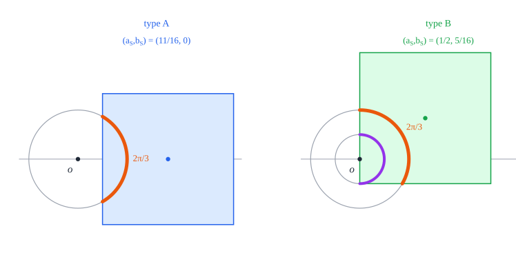

# 6. Three squares

[Contents](README.md) · [← 5. Two squares](two.md) · [7. Four squares →](four.md)

This chapter determines the least radius of a closed disk that holds a packing
of three unit squares, and all the packings that attain it. The radius is
$R_3 = \frac{5\sqrt{17}}{16}$, about $1.288$, and the optimal packing is unique
up to congruence: it is the *T*, two squares side by side with a third centred
on top of them (Figure 6.1).

The proof works on the circle $\Gamma_{3/8}$ of radius $\frac38$ about the disk
centre $o$. In the T each square holds exactly a third of this circle. In an
arbitrary packing in the closed disk of radius $R_3$ we show that no square
contains $o$, and that every square then holds an arc of at least a third of
$\Gamma_{3/8}$, exactly a third only in the position of a square of the T.
Disjoint squares hold disjoint arcs, so every arc is exactly a third, and the
three positions fit together only as the T.

## Theorem 6.1 (three squares)

Let $R_3 = \frac{5\sqrt{17}}{16}$, and let the *T* be the model
$Q(c_1), Q(c_2), Q(c_3)$, two squares side by side and a third centred on top
of them, with

```math
c_1 = \left(-\tfrac12, -\tfrac5{16}\right), \qquad c_2 = \left(\tfrac12, -\tfrac5{16}\right), \qquad c_3 = \left(0, \tfrac{11}{16}\right) .
```

1. The T is a packing in the closed disk of radius $R_3$ about the origin.
2. If three unit squares form a packing in a closed disk of radius $R$, then
   $R \ge R_3$.
3. The packings of three unit squares in a closed disk of radius $R_3$ are
   exactly the configurations congruent to the T.


*Figure 6.1.* The T in the closed disk of radius $R_3$ about its disk centre
$o$ (dashed). The circle $\Gamma_{3/8}$ about $o$ splits into three arcs of
exactly $\frac{2\pi}3$, one in each square.

*Lean: [`Three.radius`](../../SquaresInCircles/Geometry.lean#L141),
[`Three.model`](../../SquaresInCircles/Geometry.lean#L148),
[`Three.model_packing`](../../SquaresInCircles/Three/Construction.lean#L22),
[`Three.uniqueness`](../../SquaresInCircles/Three/Uniqueness.lean#L121),
[`Three.optimum`](../../SquaresInCircles/Three/Uniqueness.lean#L194).*

*Outline of the proof.* Part (1) is a direct check, Proposition 6.2 in §6.1.
The core of the chapter is Proposition 6.3, stated at the start of §6.2: every
packing of three unit squares in a closed disk of radius $R_3$ is congruent to
the T. Parts (2) and (3) follow from the two propositions by Corollary 2.10
(§6.6). The proof of Proposition 6.3 has four steps.

1. *The contact polygon* (§6.2). The disk puts the pair $(a_S, b_S)$ of every
   square $S$ in a 16-gon $P_3$, whose sides touch the disk constraint at the
   pairs of the squares of the T. After this step the disk is not used.
2. *Exterior squares* (§6.3). A square that does not contain $o$ holds an arc
   of $\Gamma_{3/8}$, its cap, of at least a third of the circle, and exactly a
   third only in two positions: type A, the position of the upper square of
   the T, and type B, that of the two lower squares.
3. *The containing square* (§6.4). A square that contains $o$ would hold an
   arc of $\Gamma_{3/8}$ less than $\frac1{12}$ short of a third. The other two
   squares would then have to hold full caps and be nearly of type A, and two
   such squares overlap. So no square contains $o$.
4. *The T* (§6.5). Three disjoint caps of at least a third are exactly a third
   each. Two squares of type A, or three of type B, would overlap; so one
   square is of type A and two are of type B, and the angles between the three
   caps rebuild the T.

## 6.1 Construction

### Proposition 6.2 (construction)

The T is a packing in the closed disk of radius $R_3$ about the origin: the
squares $Q(c_1)$, $Q(c_2)$, $Q(c_3)$ are pairwise disjoint, and their closed
squares lie in that disk. Four of their corners, $(\pm1, -\frac{13}{16})$ and
$(\pm\frac12, \frac{19}{16})$, lie on the circle of radius $R_3$.


*Figure 6.2.* The T and the circle of radius $R_3$ about the origin $o$
(dashed). The four black corners lie on the circle; the grey corners
$(\pm1, \frac3{16})$, and all the other corners, lie inside it.

*Proof.* First, $R_3^2 = \frac{25 \cdot 17}{256} = \frac{425}{256}$. The
centres $c_1$ and $c_2$ differ by $1$ in the first coordinate, and $c_3$
differs from both by $\frac{11}{16} + \frac5{16} = 1$ in the second. Every
centre $(x, y)$ has $(|x| + \frac12)^2 + (|y| + \frac12)^2 = R_3^2$:

```math
1 + \tfrac{169}{256} = \tfrac{425}{256} \quad \text{for } c_1, c_2, \qquad \tfrac14 + \tfrac{361}{256} = \tfrac{425}{256} \quad \text{for } c_3 .
```

So [Lemma 2.8](preliminaries.md#lemma-28-axis-parallel-squares) (3) applies.
The same two sums are the squared distances from the origin of the corners
$(\pm1, -\frac{13}{16})$ of $Q(c_1)$ and $Q(c_2)$ and of the corners
$(\pm\frac12, \frac{19}{16})$ of $Q(c_3)$. $\square$

*Lean:
[`Three.model_packing`](../../SquaresInCircles/Three/Construction.lean#L22),
[`Three.radius_sq`](../../SquaresInCircles/Three/Construction.lean#L17),
[`axis_packing`](../../SquaresInCircles/Common/Constructions.lean#L34).*

## 6.2 The contact polygon

### Proposition 6.3 (uniqueness)

Every packing of three unit squares in a closed disk of radius $R_3$ is
congruent to the T.

*Lean: [`Three.uniqueness`](../../SquaresInCircles/Three/Uniqueness.lean#L121).*

The proof occupies §6.2 to §6.5 and is completed at the end of §6.5.
Throughout, $o$ is the disk centre, and every square $S$ comes with its offsets
$a_S \ge b_S \ge 0$
([Definition 3.1](common.md#definition-31-position-of-the-disk-centre)) and
with a chart $(\theta_S, \varepsilon_S)$
([Definition 3.20](common.md#definition-320-chart)), which exists by
[Lemma 3.21](common.md#lemma-321-charts) and is fixed once and for all.

By [Lemma 3.4](common.md#lemma-34-farthest-vertex), a square $S$ whose closed
square lies in the closed disk of radius $R_3$ about $o$ has
$\varphi(a_S, b_S) \le R_3^2 = \frac{425}{256}$. As in
[Definition 3.7](common.md#definition-37-contact-polygon), we replace this
curved constraint by tangent half-planes at the pairs of the squares of the T:
$(\frac12, \frac5{16})$ for the two lower squares $Q(c_1)$ and $Q(c_2)$, and
$(\frac{11}{16}, 0)$ for the upper square $Q(c_3)$.

### Definition 6.4 (the 16-gon)

Let $b \le a$. The point $(a, b)$ lies in the *16-gon* $P_3$ if

```math
16a + 13b \le \tfrac{193}{16} \qquad \text{and} \qquad 19a + 8b \le \tfrac{209}{16} . \tag{6.1}
```

*Lean: [`Three.P3`](../../SquaresInCircles/Three/Exterior.lean#L18).*

The two lines $16a + 13b = \frac{193}{16}$ and $19a + 8b = \frac{209}{16}$ are
the tangents to the circle $\varphi = \frac{425}{256}$ at
$(\frac12, \frac5{16})$ and at $(\frac{11}{16}, 0)$ (Lemma 6.5). Their mirror
images in the diagonal $a = b$ bound the part with $a \le b$, and restoring the
signs of the two local coordinates of $o$ turns these four lines into sixteen,
whence the name. Only points with $b \le a$ occur below.


*Figure 6.3.* The 16-gon $P_3$ where $a, b \ge 0$ (orange), around the disk
$\lbrace \varphi \le \frac{425}{256} \rbrace$ (blue). They touch at the pairs
of the squares of the T and at their mirror images, marked with their types
(Definition 6.6).

### Lemma 6.5 (contact polygon)

Let $a$ and $b$ be real numbers with $\varphi(a, b) \le \frac{425}{256}$. Then
both inequalities (6.1) hold, so $(a, b) \in P_3$ if $b \le a$. If moreover
$a \ne \frac12$, then $16a + 13b < \frac{193}{16}$.


*Figure 6.4.* The sector $0 \le b \le a$. The lines (6.1) touch the circle
$\varphi = \frac{425}{256}$ at $B = (\frac12, \frac5{16})$ and
$A = (\frac{11}{16}, 0)$, and meet at the dot
$(\frac{69}{112}, \frac{19}{112})$. With the axis and the diagonal they bound
the part of $P_3$ in the sector, which contains the part of the disk (blue).

*Proof.* The two points of tangency lie on the circle
$\varphi = \frac{425}{256}$, since
$\varphi(\frac12, \frac5{16}) = 1 + \frac{169}{256}$ and
$\varphi(\frac{11}{16}, 0) = \frac{361}{256} + \frac14$. At these two points
the identity of [Lemma 3.6](common.md#lemma-36-tangent-lines) reads

```math
\begin{aligned}
\varphi(a, b) - \tfrac{425}{256} &= \tfrac18\left(16a + 13b - \tfrac{193}{16}\right) + \left(a - \tfrac12\right)^2 + \left(b - \tfrac5{16}\right)^2 , \\
\varphi(a, b) - \tfrac{425}{256} &= \tfrac18\left(19a + 8b - \tfrac{209}{16}\right) + \left(a - \tfrac{11}{16}\right)^2 + b^2 ,
\end{aligned}
```

as one also checks by expanding. The left-hand sides are at most $0$ and the
squares are nonnegative, so both brackets are at most $0$; and the first
bracket is negative when $a \ne \frac12$, because then
$(a - \frac12)^2 > 0$. $\square$

*Lean: [`Three.p3_of_phi`](../../SquaresInCircles/Three/Exterior.lean#L21),
[`tangent_le`](../../SquaresInCircles/Common/Tangents.lean#L20),
[`tangent_lt`](../../SquaresInCircles/Common/Tangents.lean#L26).*

From here on, the proof of Proposition 6.3 uses the disk only through
Lemma 6.5: the inequalities (6.1) for every square, and the strict one for a
square with $a_S \ne \frac12$.

## 6.3 Exterior squares

A square $S$ is exterior if $o \notin S^\circ$
([Definition 3.2](common.md#definition-32-containing-and-exterior-squares)),
which by Lemma 3.21 (1) means $a_S \ge \frac12$. For an exterior square we put

```math
u_S = \frac{a_S - \frac12}{3/8}, \qquad v_S = \frac{\frac12 - b_S}{3/8}, \qquad A_S = \arccos u_S, \qquad V_S = \arcsin v_S .
```

When $a_S - \frac12 \le \frac38$, as it will be below, $A_S$ and $V_S$ are the
crossing angles of $S$ on $\Gamma_{3/8}$
([Definition 3.23](common.md#definition-323-crossing-angles)): in the chart of
$S$ this circle crosses the line of the near edge of $S$ at the chart angles
$\pm A_S$, and the line of the lower edge at $-V_S$. Crossing angles on other
circles are named where they occur.

In these terms the two inequalities of $P_3$ become simple. For all real $a$
and $b$, with $u = \frac{a - 1/2}{3/8}$ and $v = \frac{1/2 - b}{3/8}$,
expanding gives

```math
v - \tfrac12 - \tfrac{16}{13}u = \tfrac8{39}\left(\tfrac{193}{16} - 16a - 13b\right), \qquad \tfrac{209}{16} - 19a - 8b = 8\left(\tfrac{57}{64}\left(\tfrac12 - u\right) - b\right) . \tag{6.2}
```

So the inequalities (6.1) say that $v \ge \frac12 + \frac{16}{13}u$ and
$b \le \frac{57}{64}(\frac12 - u)$.

### Definition 6.6 (the two types)

An exterior square $S$ is of *type A* if $(a_S, b_S) = (\frac{11}{16}, 0)$,
and of *type B* if $(a_S, b_S) = (\frac12, \frac5{16})$.

*Lean: [`Three.cap_bounds`](../../SquaresInCircles/Three/Exterior.lean#L63),
[`Three.cap_types`](../../SquaresInCircles/Three/Uniqueness.lean#L27).*

In the T the upper square is of type A and the two lower squares are of
type B. For a square of type A, $o$ lies on an axis of $S$, at distance
$\frac3{16}$ beyond the midpoint of an edge; then $u_S = \frac12$ and
$A_S = \frac\pi3$. For a square of type B, $o$ lies on an edge of $S$, at
distance $\frac5{16}$ from its midpoint; then $u_S = 0$ and $v_S = \frac12$, so
$A_S = \frac\pi2$ and $V_S = \frac\pi6$.



*Figure 6.5.* The two types, each in its chart. Each square holds exactly a
third of $\Gamma_{3/8}$. The square of type B also holds half of
$\Gamma_{1/16}$, which §6.5 uses.

### Lemma 6.7 (a trigonometric inequality)

Let $0 \le u \le \frac12$ and $v \ge \frac12 + \frac{16}{13}u$. Then

```math
\arccos u + \arcsin v \ge \tfrac{2\pi}3 ,
```

with equality only if $u = 0$ and $v = \frac12$.


*Figure 6.6.* The $(u, v)$-plane. The quadrilateral is the set of pairs
$(u_S, v_S)$ of the exterior squares with $(a_S, b_S) \in P_3$, bounded by the
lines (6.1), by $u = 0$ ($a_S = \frac12$) and by $v = \frac43$ ($b_S = 0$). It
lies above the curve $\arccos u + \arcsin v = \frac{2\pi}3$, meeting it only at
$B$ (Lemma 6.7), and to the left of the line $\arccos u = \frac\pi3$, meeting
it only at $A$. The dashed curve $v = \sqrt{1 - u^2}$, where $A_S = V_S$,
separates the clipped caps below it from the full caps above it
(Lemma 6.8 (4)).

*Proof.* Put $x = \arcsin u + \frac\pi6$. Since $0 \le u \le \frac12$, we have
$0 \le \arcsin u \le \arcsin\frac12 = \frac\pi6$, so
$\frac\pi6 \le x \le \frac\pi3$. By the addition formula, with
$\cos\frac\pi6 = \frac{\sqrt3}2 \le 1$, $\sin\frac\pi6 = \frac12$ and
$\cos(\arcsin u) = \sqrt{1 - u^2} \le 1$,

```math
\sin x = \tfrac{\sqrt3}2\,u + \tfrac12\sqrt{1 - u^2} \le u + \tfrac12 \le \tfrac12 + \tfrac{16}{13}u \le v . \tag{6.3}
```

We claim that $x \le \arcsin v$. If $v \ge 1$, then
$\arcsin v = \frac\pi2 > x$. Otherwise $\frac12 \le v < 1$, and
$\sin x \le v = \sin(\arcsin v)$ with $x$ and $\arcsin v$ in
$[-\frac\pi2, \frac\pi2]$, where the sine is increasing; so $x \le \arcsin v$.
Since $\arccos u = \frac\pi2 - \arcsin u$,

```math
\arccos u + \arcsin v \ge \tfrac\pi2 - \arcsin u + x = \tfrac{2\pi}3 .
```

If equality holds, then $\arcsin v = x \le \frac\pi3 < \frac\pi2$, so $v < 1$
and $v = \sin(\arcsin v) = \sin x$, and every inequality in (6.3) is an
equality. The middle one, $u + \frac12 \le \frac12 + \frac{16}{13}u$, is an
equality only if $u = 0$, and then $v = \sin\frac\pi6 = \frac12$. $\square$

*Lean: [`Three.truncated_gap`](../../SquaresInCircles/Three/Exterior.lean#L29).*

### Lemma 6.8 (exterior caps)

Let $S$ be an exterior square with $(a_S, b_S) \in P_3$.

1. $0 \le u_S \le \frac12$ and $v_S \ge \frac12 + \frac{16}{13}u_S$. In
   particular $\frac12 \le a_S \le \frac{11}{16}$ and $b_S \le \frac5{16}$.
2. $\frac\pi3 \le A_S \le \frac\pi2$, and $A_S = \frac\pi3$ only if $S$ is of
   type A.
3. $A_S + V_S \ge \frac{2\pi}3$, and $A_S + V_S = \frac{2\pi}3$ only if $S$ is
   of type B.
4. $S$ holds its *cap* on $\Gamma_{3/8}$
   ([Lemma 3.24](common.md#lemma-324-arcs-of-an-exterior-square) (2)), the arc
   of the chart angles $-\min(A_S, V_S) < t < A_S$. Its centre is
   $\theta_S + \varepsilon_S \cdot \frac12\left(A_S - \min(A_S, V_S)\right)$
   and its half-width is

   ```math
   w_S = \tfrac12\left(A_S + \min(A_S, V_S)\right) \ge \tfrac\pi3 .
   ```

   The cap is *full* if $A_S \le V_S$: then it is centred at the phase
   $\theta_S$ and has half-width $A_S$. Otherwise it is *clipped* by the lower
   edge of $S$.


*Figure 6.7.* Two exterior squares with $(a_S, b_S) \in P_3$ and their caps on
$\Gamma_{3/8}$ (orange). Left, $(a_S, b_S) = (\frac35, \frac3{50})$: the lower
edge is out of reach, $V_S = \frac\pi2 \ge A_S$, and the cap is full. Right,
$(a_S, b_S) = (\frac{13}{25}, \frac7{25})$: the circle meets the line of the
lower edge at $-V_S$, before $-A_S$, and the cap is clipped. Both caps exceed a
third of the circle.

*Proof.* (1) $u_S \ge 0$ because $a_S \ge \frac12$. By (6.2), the inequalities
(6.1) at $(a_S, b_S)$ say that $v_S \ge \frac12 + \frac{16}{13}u_S$ and
$b_S \le \frac{57}{64}(\frac12 - u_S)$. As $b_S \ge 0$, the second gives
$u_S \le \frac12$, that is $a_S \le \frac{11}{16}$. The first gives
$v_S \ge \frac12$, that is $b_S \le \frac5{16}$.

(2) The arccosine is decreasing, so $0 \le u_S \le \frac12$ gives
$\frac\pi3 = \arccos\frac12 \le A_S \le \arccos 0 = \frac\pi2$. If
$A_S = \frac\pi3$, then $u_S = \cos A_S = \frac12$, and
$0 \le b_S \le \frac{57}{64}(\frac12 - u_S) = 0$; so
$(a_S, b_S) = (\frac{11}{16}, 0)$.

(3) By (1), Lemma 6.7 applies to $u = u_S$ and $v = v_S$:
$A_S + V_S = \arccos u_S + \arcsin v_S \ge \frac{2\pi}3$, with equality only if
$u_S = 0$ and $v_S = \frac12$, that is $(a_S, b_S) = (\frac12, \frac5{16})$.

(4) By (1), $a_S - \frac12 \le \frac3{16} < \frac38 < a_S + \frac12$,
$\frac38 \le \frac12$ and $b_S \le \frac5{16} \le \frac12$, so Lemma 3.24 (2)
applies with $r = \frac38$. It gives the arc of the chart angles from
$-\min(A_S, V_S)$ to $A_S$, which by Lemma 3.21 (2) has the stated centre and
half-width. If $A_S \le V_S$, then $w_S = A_S \ge \frac\pi3$ by (2), and the
centre is $\theta_S$. If $V_S < A_S$, then
$w_S = \frac12(A_S + V_S) \ge \frac\pi3$ by (3). $\square$

*Lean: [`Three.cap_bounds`](../../SquaresInCircles/Three/Exterior.lean#L63),
[`Three.exterior_cap`](../../SquaresInCircles/Three/Exterior.lean#L85).*

### Lemma 6.9 (caps of a third)

Let $S$ be an exterior square with $(a_S, b_S) \in P_3$ whose cap has
half-width $w_S \le \frac\pi3$. Then $w_S = \frac\pi3$, and either $S$ is of
type A and its cap is centred at $\theta_S$, or $S$ is of type B and its cap is
centred at $\theta_S + \varepsilon_S\frac\pi6$.

*Proof.* By Lemma 6.8 (4), $w_S \ge \frac\pi3$, so $w_S = \frac\pi3$. If the
cap is full, then $A_S = w_S = \frac\pi3$, so $S$ is of type A by
Lemma 6.8 (2), and the cap is centred at $\theta_S$. Otherwise $V_S < A_S$ and
$A_S + V_S = 2w_S = \frac{2\pi}3$, so $S$ is of type B by Lemma 6.8 (3). Then
$A_S = \arccos 0 = \frac\pi2$ and $V_S = \arcsin\frac12 = \frac\pi6$, so the
cap runs from the chart angle $-\frac\pi6$ to $\frac\pi2$, and its centre is
$\theta_S + \varepsilon_S\frac\pi6$. $\square$

*Lean: [`Three.cap_types`](../../SquaresInCircles/Three/Uniqueness.lean#L27).*

## 6.4 The containing square

This section shows that no square of the packing contains $o$
(Proposition 6.15). For a square $S$ that contains $o$ we have
$a_S < \frac12$ (Lemma 3.21 (1)), so $0 \le b_S \le a_S < \frac12$, and we put

```math
P_S = \frac{\frac12 - a_S}{3/8}, \qquad Q_S = \frac{\frac12 - b_S}{3/8}, \qquad \text{so that} \qquad 0 < P_S \le Q_S \le \tfrac43 .
```

In the chart of $S$, the lines of the left and the lower edge of $S$ are at
the distances $\frac38 P_S$ and $\frac38 Q_S$ from $o$, and the other two edges
are out of reach of $\Gamma_{3/8}$.

The idea is as follows. The square $S$ holds an arc of $\Gamma_{3/8}$ of
length $L_S$, a quarter of the circle and a bit more (Lemma 6.10). Each of the
other two squares holds a cap of at least a third (Lemma 6.8), and together
with the first inequality (6.1) this forces the deficit $\frac{2\pi}3 - L_S$
of the arc of $S$ with respect to a third of the circle to be less than
$\frac1{12}$. So the three arcs nearly fill the circle, and that leaves no
freedom:

- neither of the other two caps can be clipped, or it would more than make up
  the deficit (Lemmas 6.11 to 6.13);
- both caps are then full, of half-width less than $\frac\pi3 + \frac1{24}$,
  so both squares are nearly of type A;
- their phases are then less than $\frac{2\pi}3 + \frac1{12}$ apart, but on
  the larger circle $\Gamma_{7/16}$ two nearly axial squares hold arcs too wide
  for that (Lemma 6.14).

### Lemma 6.10 (the arc of a containing square)

Let $S$ be a square that contains $o$. Then $S$ holds the arc of
$\Gamma_{3/8}$ of the chart angles $-\arcsin Q_S < t < \frac\pi2 + \arcsin P_S$,
of half-width $\frac12 L_S$, where

```math
L_S = \tfrac\pi2 + \arcsin P_S + \arcsin Q_S . \tag{6.4}
```


*Figure 6.8.* The arc of length $L_S$ runs from the lower edge of $S$ round to
its left edge; the far edges are out of reach.

*Proof.* **1. A sine bound.** Let $Q > 0$ and let $P$ be real. We show that
every $t$ with $-\arcsin Q < t < \frac\pi2 + \arcsin P$ has $\sin t > -Q$. If
$t > \frac\pi2$, then $\frac\pi2 < t < \frac\pi2 + \arcsin P \le \pi$, so
$\sin t > 0 > -Q$. Let $t \le \frac\pi2$; then $t > -\arcsin Q \ge -\frac\pi2$.
If $Q \ge 1$, then $\sin t > -1 \ge -Q$. If $Q < 1$, then $t$ and
$\arcsin(-Q) = -\arcsin Q$ lie in $[-\frac\pi2, \frac\pi2]$, where the sine is
increasing, and $\arcsin(-Q) < t$; so $\sin t > \sin(\arcsin(-Q)) = -Q$.

**2. The arc.** By Lemma 3.21 (2) it suffices to show that every chart angle
$t$ with $-\arcsin Q_S < t < \frac\pi2 + \arcsin P_S$ gives a point of $S$ on
$\Gamma_{3/8}$, that is

```math
\left|\tfrac38\cos t - a_S\right| < \tfrac12 \qquad \text{and} \qquad \left|\tfrac38\sin t - b_S\right| < \tfrac12 .
```

As $a_S, b_S \ge 0$, we have $\frac38\cos t - a_S \le \frac38 < \frac12$ and
$\frac38\sin t - b_S \le \frac38 < \frac12$. Step 1, with $P = P_S$ and
$Q = Q_S > 0$, gives $\sin t > -Q_S$, that is $\frac38\sin t - b_S > -\frac12$.
The number $\frac\pi2 - t$ satisfies
$-\arcsin P_S < \frac\pi2 - t < \frac\pi2 + \arcsin Q_S$, so step 1 with the
roles of $P_S$ and $Q_S$ exchanged (and $P_S > 0$) gives
$\cos t = \sin(\frac\pi2 - t) > -P_S$, that is $\frac38\cos t - a_S > -\frac12$.
The interval has length $L_S$, with $0 < L_S \le \frac{3\pi}2$, so the arc has
half-width $\frac12 L_S$. $\square$

*Lean:
[`Three.containing_arc`](../../SquaresInCircles/Three/Containing.lean#L49),
[`Three.containing_mem`](../../SquaresInCircles/Three/Containing.lean#L36),
[`Three.neg_lt_sin`](../../SquaresInCircles/Three/Containing.lean#L24).*

### Lemma 6.11 (the radial gap)

Let $S$ and $T$ be disjoint squares, where $S$ contains $o$ and $T$ is exterior
with $b_T \le \frac12$. Then

```math
\tfrac12 - a_S \le a_T - \tfrac12 .
```

In words: the near edge of $T$ is at least as far from $o$ as the disk
$D(o, \frac12 - a_S)$ reaches, and this disk lies in $S^\circ$ by
[Lemma 3.9](common.md#lemma-39-inscribed-disks) (2).


*Figure 6.9.* The disk of radius $\frac12 - a_S$ about $o$ lies in $S$, and so
does every circle about $o$ inside it. The near edge of $T$, at distance
$a_T - \frac12$ from $o$, cannot come closer.

*Proof.* Suppose that $a_T - \frac12 < \frac12 - a_S$, and put
$\rho = \frac12(a_T - a_S)$. Then $\rho > 0$, as $a_T \ge \frac12 > a_S$, and

```math
\left(\tfrac12 - a_S\right) - \rho = \rho - \left(a_T - \tfrac12\right) = \tfrac12\left(1 - a_S - a_T\right) > 0 ,
```

so $a_T - \frac12 < \rho < \frac12 - a_S \le \frac12$ (Figure 6.10).


*Figure 6.10.* The proof of Lemma 6.11, in a configuration where its
conclusion fails: the near edge of $T$ (dashed) is closer to $o$ than
$\frac12 - a_S$. The circle $\Gamma_\rho$ lies in the disk
$D(o, \frac12 - a_S) \subset S^\circ$, and $T$ holds an arc of it (orange), so
$S$ and $T$ overlap (shaded).

- *$S$ holds an arc of $\Gamma_\rho$ of half-width $\pi$.* In the chart of
  $S$, every chart angle $t$ has
  $|\rho\cos t - a_S| \le \rho + a_S < \frac12$ and
  $|\rho\sin t - b_S| \le \rho + b_S \le \rho + a_S < \frac12$. Lemma 3.21 (2),
  with the interval $(-\pi, \pi)$, gives the arc.
- *$T$ holds an arc of $\Gamma_\rho$.* Lemma 3.24 (2) applies to $T$ with
  $r = \rho$, since $a_T - \frac12 < \rho \le \frac12 < a_T + \frac12$ and
  $b_T \le \frac12$. So $T$ holds its cap on $\Gamma_\rho$, of half-width
  $\frac12(A + \min(A, V)) > 0$, where the crossing angles
  $A = \arccos\frac{a_T - 1/2}\rho$ and $V = \arcsin\frac{1/2 - b_T}\rho$ of
  $T$ on $\Gamma_\rho$ satisfy $A > 0$, as $\frac{a_T - 1/2}\rho < 1$, and
  $V \ge 0$.
- The two arcs lie in the disjoint sets $S^\circ$ and $T^\circ$, so by
  [Lemma 3.17](common.md#lemma-317-disjoint-arcs-have-separated-centres) the
  angle between their centres is at least $\pi$ plus a positive half-width,
  more than $\pi$. But no two directions are more than $\pi$ apart.
  $\square$

*Lean:
[`Three.gap_from_containing`](../../SquaresInCircles/Three/Containing.lean#L64).*

### Lemma 6.12 (an increasing difference)

The function

```math
f(t) = \arcsin\left(\tfrac12 + \tfrac{16}{13}t\right) - \arcsin t
```

is increasing on $[0, \frac{13}{32})$: if $0 \le P \le u < \frac{13}{32}$,
then $f(P) \le f(u)$.

*Proof.* Let $0 \le t < \frac{13}{32}$ and $s = \frac12 + \frac{16}{13}t$, so
that $0 \le t < s < 1$; the bound $s < 1$ is $t < \frac{13}{32}$. Both
arguments lie in $(-1, 1)$, so $f$ is differentiable at $t$, with

```math
f'(t) = \frac{16/13}{\sqrt{1 - s^2}} - \frac1{\sqrt{1 - t^2}} .
```

Since $s^2 - t^2 = (\frac12 + \frac3{13}t)(\frac12 + \frac{29}{13}t) > 0$, we
have $0 < 1 - s^2 < 1 - t^2$, hence
$\frac1{\sqrt{1 - s^2}} > \frac1{\sqrt{1 - t^2}}$ and
$f'(t) > (\frac{16}{13} - 1)\frac1{\sqrt{1 - t^2}} > 0$. By the mean value
theorem, $f$ is increasing on $[0, \frac{13}{32})$. $\square$

*Lean:
[`Three.asin_increment_mono`](../../SquaresInCircles/Three/Containing.lean#L89).*

### Lemma 6.13 (compensation)

Let $P$, $Q$, $u$, $v$ be real numbers with

```math
0 \le P \le u, \qquad 0 \le Q \le 1, \qquad v < 1, \qquad \tfrac{16}{13}P + Q > \tfrac12, \qquad v \ge \tfrac12 + \tfrac{16}{13}u .
```

Then

```math
\arcsin v - \arcsin u + \arcsin P + \arcsin Q > \tfrac\pi3 .
```

*Proof.* Since $\frac12 + \frac{16}{13}u \le v < 1$, we have
$u < \frac{13}{32}$, and Lemma 6.12 applies to $P \le u$. With the monotonicity
of the arcsine,

```math
\arcsin v - \arcsin u \ge \arcsin\left(\tfrac12 + \tfrac{16}{13}u\right) - \arcsin u \ge \arcsin\left(\tfrac12 + \tfrac{16}{13}P\right) - \arcsin P .
```

The numbers $\frac12 + \frac{16}{13}P$ and $Q$ lie in $[0, 1]$, the first
because $\frac12 \le \frac12 + \frac{16}{13}P \le \frac12 + \frac{16}{13}u < 1$,
and their average exceeds $\frac12 = \sin\frac\pi6$ because
$\frac{16}{13}P + Q > \frac12$. So
[Lemma 3.29](common.md#lemma-329-elementary-estimates) (4), with
$\theta = \frac\pi6$, gives
$\arcsin(\frac12 + \frac{16}{13}P) + \arcsin Q > \frac\pi3$. Adding this to the
previous display proves the lemma. $\square$

*Lean:
[`Three.compensation`](../../SquaresInCircles/Three/Containing.lean#L111).*

In the proof of Proposition 6.15, $P$ and $Q$ are $P_S$ and $Q_S$ for the
square $S$ that contains $o$, and $u$ and $v$ are $u_T$ and $v_T$ for a square
$T$ whose cap is clipped. Then the deficit of $S$ and the excess of the cap of
$T$ over a third of the circle are

```math
\tfrac{2\pi}3 - L_S = \tfrac\pi6 - \arcsin P - \arcsin Q, \qquad 2w_T - \tfrac{2\pi}3 = \arcsin v - \arcsin u - \tfrac\pi6 ,
```

and Lemma 6.13 says that the excess is larger than the deficit.


*Figure 6.11.* Lemma 6.13 in one variable, on $[0, \frac{13}{32})$. Orange:
$f(t) - \frac\pi6$, the least excess $2w_T - \frac{2\pi}3$ of a clipped cap
with $u_T = t$, reached when $v_T = \frac12 + \frac{16}{13}t$. Blue:
$\frac\pi6 - \arcsin t - \arcsin(\frac12 - \frac{16}{13}t)$, which exceeds the
deficit of a containing square with $P_S = t$, since
$Q_S > \frac12 - \frac{16}{13}P_S$. For $P \le u$ the excess at $u$ is at least
$f(P) - \frac\pi6$, which lies above the blue curve at $P$.

### Lemma 6.14 (nearly axial squares)

1. $\cos(\frac\pi3 + \frac1{24}) > \frac9{20}$.
2. Let $T$ be a square with $\frac12 \le a_T \le \frac{11}{16}$ and
   $b_T \le \frac1{16}$. Then $T$ holds an arc of $\Gamma_{7/16}$ centred at
   its phase $\theta_T$, of half-width more than $\frac\pi3 + \frac1{24}$.
3. Two disjoint squares $T$ and $U$ as in (2) have
   $d(\theta_T, \theta_U) > \frac{2\pi}3 + \frac1{12}$.


*Figure 6.12.* The extreme case $(a_T, b_T) = (\frac{11}{16}, \frac1{16})$ of
Lemma 6.14 (2), in the chart of $T$. The circle $\Gamma_{7/16}$ just touches
the line of the lower edge, so the cap of $T$ on it is full, with half-width
$A = \arccos\frac37$, which is larger than $\frac\pi3 + \frac1{24}$ (purple).
Grey: $\Gamma_{3/8}$.


*Figure 6.13.* Two nearly axial squares whose phases are only a little over
$\frac{2\pi}3$ apart overlap near $o$: the point $z$ lies in both.

*Proof.* (1) Let $\varepsilon = \frac1{24}$. We use the standard bounds
$0 \le \sin\varepsilon \le \varepsilon$ and
$\cos\varepsilon \ge 1 - \frac{\varepsilon^2}2$, which follow from the mean
value theorem, and $0 \le \frac{\sqrt3}2 \le 1$. Then

```math
\cos\left(\tfrac\pi3 + \varepsilon\right) = \tfrac12\cos\varepsilon - \tfrac{\sqrt3}2\sin\varepsilon \ge \tfrac12\left(1 - \tfrac{\varepsilon^2}2\right) - \varepsilon = \tfrac12 - \tfrac1{2304} - \tfrac1{24} = \tfrac{1055}{2304} > \tfrac9{20} ,
```

the last step because $1055 \cdot 20 = 21100 > 20736 = 9 \cdot 2304$.

(2) The square $T$ is exterior, as $a_T \ge \frac12$. Its crossing angles on
$\Gamma_{7/16}$ are $A = \arccos\frac{a_T - 1/2}{7/16}$ and
$V = \arcsin\frac{1/2 - b_T}{7/16}$. Since $\frac12 - b_T \ge \frac7{16}$, we
have $V = \frac\pi2 \ge A$. Lemma 3.24 (2) applies with $r = \frac7{16}$,
because $0 \le a_T - \frac12 \le \frac3{16} < \frac7{16} \le \frac12$ and
$b_T \le \frac12$; so $T$ holds its cap on $\Gamma_{7/16}$, which is full:
centred at $\theta_T$, with half-width $A$. Finally

```math
0 \le \frac{a_T - 1/2}{7/16} \le \tfrac37 < \tfrac9{20} < \cos\left(\tfrac\pi3 + \tfrac1{24}\right)
```

by (1) ($\frac37 < \frac9{20}$ as $60 < 63$), and the arccosine is strictly
decreasing, so
$A > \arccos\cos(\frac\pi3 + \frac1{24}) = \frac\pi3 + \frac1{24}$.

(3) By (2) and Lemma 3.17, $d(\theta_T, \theta_U)$ is at least the sum of the
half-widths of the two arcs of (2), which exceeds
$\frac{2\pi}3 + \frac1{12}$. $\square$

*Lean:
[`Three.cos_third_gt`](../../SquaresInCircles/Three/Containing.lean#L125),
[`Three.wide_arc`](../../SquaresInCircles/Three/Containing.lean#L135),
[`Three.axial_pair_impossible`](../../SquaresInCircles/Three/Containing.lean#L153).*

### Proposition 6.15 (no square contains the disk centre)

Let $S_1$, $S_2$, $S_3$ be pairwise disjoint unit squares with
$\varphi(a_{S_i}, b_{S_i}) \le \frac{425}{256}$ for $i = 1, 2, 3$. Then none of
them contains $o$.

*Proof.* Suppose that one of them, $S$, contains $o$, and call the other two
$T$ and $U$. They are exterior, since two disjoint squares cannot both contain
$o$ (Definition 3.2). By Lemma 6.5 all three pairs lie in $P_3$, and
$16a_S + 13b_S < \frac{193}{16}$ because $a_S < \frac12$. Write $P = P_S$ and
$Q = Q_S$. With $a = a_S$ and $b = b_S$, the numbers $u$ and $v$ of (6.2) are
$-P$ and $Q$, so the first identity (6.2) turns the strict inequality into

```math
\tfrac{16}{13}P + Q > \tfrac12 . \tag{6.5}
```

By Lemma 6.8 (4) the caps of $T$ and $U$ on $\Gamma_{3/8}$ have half-widths
$w_T, w_U \ge \frac\pi3$, and by Lemma 6.10 the arc of $S$ has half-width
$\frac12 L_S$. These three arcs lie in the pairwise disjoint sets $S^\circ$,
$T^\circ$ and $U^\circ$, so [Lemma 3.18](common.md#lemma-318-three-arcs) gives

```math
\tfrac12 L_S + w_T + w_U \le \pi . \tag{6.6}
```

**1. The deficit is small: $L_S > \frac{2\pi}3 - \frac1{12}$.** By (6.6),
$\frac12 L_S \le \pi - \frac{2\pi}3$, that is $L_S \le \frac{2\pi}3$, and by
(6.4) $\arcsin Q \le \frac{2\pi}3 - \frac\pi2 - \arcsin P \le \frac\pi6$, since
$\arcsin P \ge 0$. As $\arcsin Q = \frac\pi2$ for $Q \ge 1$, this gives
$Q < 1$, hence $0 < P \le Q < 1$. By (6.5) and $P \le Q$,

```math
\tfrac{13}2 < 16P + 13Q = \tfrac{29}2(P + Q) - \tfrac32(Q - P) \le \tfrac{29}2(P + Q) ,
```

so $P + Q > \frac{13}{29}$. Since $\arcsin x \ge x$ for $0 \le x \le 1$
(Lemma 3.29 (2)) and $\pi < \frac{22}7$,

```math
L_S \ge \tfrac\pi2 + P + Q > \tfrac\pi2 + \tfrac{13}{29} = \left(\tfrac{2\pi}3 - \tfrac1{12}\right) + \left(\tfrac{185}{348} - \tfrac\pi6\right) > \tfrac{2\pi}3 - \tfrac1{12} ,
```

because $\frac\pi6 < \frac{11}{21} < \frac{185}{348}$, the last since
$185 \cdot 21 - 11 \cdot 348 = 3885 - 3828 = 57 > 0$.


*Figure 6.14.* Step 1 in its extreme case $P = Q = \frac{13}{58}$, where
(6.5) becomes an equality and $L_S$ is smallest: the arc of $S$ (orange) falls
short of a third of $\Gamma_{3/8}$ by the red piece,
$\frac{2\pi}3 - L_S < \frac1{12}$.

**2. Neither cap is clipped.** Suppose that the cap of $T$ is clipped,
$V_T < A_T$. Then $\arcsin v_T = V_T < A_T \le \frac\pi2$ (Lemma 6.8 (2)), so
$v_T < 1$, and

```math
2w_T = A_T + V_T = \tfrac\pi2 - \arcsin u_T + \arcsin v_T .
```

By Lemma 6.8 (1), $b_T \le \frac5{16} \le \frac12$ and
$v_T \ge \frac12 + \frac{16}{13}u_T$. So Lemma 6.11 applies to $S$ and $T$:
$\frac12 - a_S \le a_T - \frac12$, that is $P \le u_T$. Now Lemma 6.13 applies
to $P$, $Q$, $u_T$, $v_T$: $0 \le P \le u_T$, $0 \le Q \le 1$ by step 1,
$v_T < 1$, (6.5), and $v_T \ge \frac12 + \frac{16}{13}u_T$. With (6.4),

```math
2w_T + L_S = \pi + \left(\arcsin v_T - \arcsin u_T + \arcsin P + \arcsin Q\right) > \tfrac{4\pi}3 .
```

With $w_U \ge \frac\pi3$ this gives
$\frac12 L_S + w_T + w_U > \frac{2\pi}3 + \frac\pi3 = \pi$, against (6.6). So
the cap of $T$ is full: by Lemma 6.8 (4) it is centred at $\theta_T$, and
$w_T = A_T$. In the same way the cap of $U$ is full, centred at $\theta_U$, and
$w_U = A_U$.

**3. Both squares are nearly of type A.** By (6.6), $w_U \ge \frac\pi3$ and
step 1,

```math
A_T = w_T \le \pi - \tfrac\pi3 - \tfrac12 L_S < \tfrac{2\pi}3 - \tfrac12\left(\tfrac{2\pi}3 - \tfrac1{12}\right) = \tfrac\pi3 + \tfrac1{24} .
```

Both $A_T$ and $\frac\pi3 + \frac1{24}$ lie in $[0, \pi]$, where the cosine is
decreasing, and $\cos A_T = u_T$ as $u_T \in [0, 1]$; so by Lemma 6.14 (1)

```math
u_T = \cos A_T > \cos\left(\tfrac\pi3 + \tfrac1{24}\right) > \tfrac9{20} .
```

Since $a_T = \frac12 + \frac38 u_T$, it follows that
$a_T > \frac12 + \frac38 \cdot \frac9{20} = \frac{107}{160}$, and the second
inequality (6.1) gives

```math
8b_T \le \tfrac{209}{16} - 19a_T < \tfrac{209}{16} - \tfrac{19 \cdot 107}{160} = \tfrac{2090 - 2033}{160} = \tfrac{57}{160} ,
```

so $b_T < \frac{57}{1280} < \frac{80}{1280} = \frac1{16}$. With
$\frac12 \le a_T \le \frac{11}{16}$ (Lemma 6.8 (1)), $T$ satisfies the
hypotheses of Lemma 6.14 (2). The same holds for $U$.

**4. The phases of $T$ and $U$ are close.** Lemma 3.18, applied to the arc of
$S$ and the caps of $T$ and $U$, which are centred at $\theta_T$ and
$\theta_U$ with half-widths $A_T, A_U \ge \frac\pi3$, and step 1 give

```math
d(\theta_T, \theta_U) \le 2\pi - L_S - A_T - A_U \le \tfrac{4\pi}3 - L_S < \tfrac{2\pi}3 + \tfrac1{12} .
```

**5. Contradiction.** By step 3, Lemma 6.14 (3) applies to $T$ and $U$ and
gives $d(\theta_T, \theta_U) > \frac{2\pi}3 + \frac1{12}$, against step 4.
$\square$

*Lean:
[`Three.no_containing`](../../SquaresInCircles/Three/Containing.lean#L168).*

## 6.5 The T

We now finish the proof of Proposition 6.3. Two lemmas remain: one on the
directions of the caps, and one on the position of a square of each type.

### Lemma 6.16 (the phases of the T)

Let $\phi$, $\psi$, $\chi$ be directions with $\psi = \phi + \pi$, and let
$\varepsilon, \varepsilon' \in \lbrace 1, -1 \rbrace$. If the three directions

```math
\phi + \varepsilon\tfrac\pi6, \qquad \psi + \varepsilon'\tfrac\pi6, \qquad \chi
```

are pairwise $\frac{2\pi}3$ apart, then $\varepsilon' = -\varepsilon$ and
$\chi = \phi - \varepsilon\frac\pi2$.


*Figure 6.15.* The T turned about $o$. The phases $\theta_1$, $\theta_2$,
$\theta_3$ of $S_1$, $S_2$, $S_3$ (dashed rays) satisfy
$\theta_2 = \theta_1 + \pi$ and $\theta_3 = \theta_1 - \frac\pi2$, with
$\varepsilon_1 = 1$ and $\varepsilon_2 = -1$. The caps on $\Gamma_{3/8}$ are
centred (black ticks) at $\theta_1 + \frac\pi6$, $\theta_2 - \frac\pi6$ and
$\theta_3$, pairwise $\frac{2\pi}3$ apart, and $S_1$ and $S_2$ hold opposite
halves of $\Gamma_{1/16}$. The dotted lines through $o$ are the axes of the
frame $\theta_3 - \frac\pi2$, in which $S_1$, $S_2$, $S_3$ sit at $c_1$,
$c_2$, $c_3$.

*Proof.* For directions $\alpha$ and $\beta$ we have
$\cos(\beta - \alpha) = \cos d(\alpha, \beta)$, since
$d(\alpha, \beta) = |\beta - \alpha + 2k\pi|$ for some integer $k$ and the
cosine is even and $2\pi$-periodic. So any two of the three directions differ
by an angle whose cosine is $\cos\frac{2\pi}3 = -\frac12$. If
$\varepsilon' = \varepsilon$, the first two directions differ by
$\psi - \phi = \pi$, and $\cos\pi = -1$. So $\varepsilon' = -\varepsilon$. Put
$\delta = \chi - \phi$. Then $\chi$ differs from the first two directions by
$\delta - \varepsilon\frac\pi6$ and by $\delta - \pi + \varepsilon\frac\pi6$,
and the addition formulas, with $\cos\frac\pi6 = \frac{\sqrt3}2$ and
$\sin(\varepsilon\frac\pi6) = \frac\varepsilon2$, turn the two remaining
conditions into

```math
\tfrac{\sqrt3}2\cos\delta + \tfrac\varepsilon2\sin\delta = -\tfrac12, \qquad -\tfrac{\sqrt3}2\cos\delta + \tfrac\varepsilon2\sin\delta = -\tfrac12 .
```

Their difference gives $\cos\delta = 0$, and their sum gives
$\varepsilon\sin\delta = -1$, that is $\sin\delta = -\varepsilon$. So
$\delta = -\varepsilon\frac\pi2$. $\square$

*Lean: [`Three.apex_phase`](../../SquaresInCircles/Three/Uniqueness.lean#L48),
[`cos_sub_distance`](../../SquaresInCircles/Common/ArcMetric.lean#L113),
[`cos_two_pi_thirds`](../../SquaresInCircles/Common/ArcMetric.lean#L119).*

### Lemma 6.17 (where the squares sit)

1. A square $S$ of type A sits at $c_3 = (0, \frac{11}{16})$ in the frame
   $\theta_S - \frac\pi2$.
2. A square $S$ of type B sits, in the frame
   $\theta_S - \varepsilon_S\frac\pi2 - \frac\pi2$, at
   $c_1 = (-\frac12, -\frac5{16})$ if $\varepsilon_S = 1$ and at
   $c_2 = (\frac12, -\frac5{16})$ if $\varepsilon_S = -1$.

*Proof.* By [Lemma 3.22](common.md#lemma-322-cartesian-form-of-a-chart), $S$
sits at $(a_S, \varepsilon_S b_S)$ in the frame $\theta_S$. By
[Lemma 3.30](common.md#lemma-330-sitting-at-a-centre) (2), a square that sits
at $c$ in the frame $\phi + k\frac\pi2$ sits, in the frame $\phi$, at $c$
turned by $k$ quarter turns; one quarter turn maps $(x, y)$ to $(-y, x)$.

(1) Here $S$ sits at $(\frac{11}{16}, 0)$ in the frame
$\theta_S = (\theta_S - \frac\pi2) + \frac\pi2$, so in the frame
$\theta_S - \frac\pi2$ it sits at $(0, \frac{11}{16}) = c_3$.

(2) Here $S$ sits at $(\frac12, \varepsilon_S\frac5{16})$ in the frame
$\theta_S$. If $\varepsilon_S = -1$, the frame of the statement is $\theta_S$
itself, and $(\frac12, -\frac5{16}) = c_2$. If $\varepsilon_S = 1$, the frame of
the statement is $\theta_S - \pi$, and
$\theta_S = (\theta_S - \pi) + 2 \cdot \frac\pi2$; two quarter turns take
$(\frac12, \frac5{16})$ to $(-\frac12, -\frac5{16}) = c_1$. $\square$

*Lean:
[`Three.a_represents`](../../SquaresInCircles/Three/Uniqueness.lean#L113),
[`Three.b_represents`](../../SquaresInCircles/Three/Uniqueness.lean#L94),
[`chart_represents`](../../SquaresInCircles/Common/Congruence.lean#L148),
[`represents_cardinal`](../../SquaresInCircles/Common/Angles.lean#L89).*

The proof of Proposition 6.3 rules out two squares of type A and three of
type B; Figures 6.16 and 6.17 show why such squares overlap.


*Figure 6.16.* Two squares of type A whose phases are exactly $\frac{2\pi}3$
apart overlap (shaded), as step 2 of the proof below shows in general. So do
their arcs on $\Gamma_{7/16}$, each of half-width
$\arccos\frac37 > \frac\pi3 + \frac1{24}$ (Lemma 6.14 (2)).


*Figure 6.17.* Three squares of type B, as in step 3 of the proof below. Each
holds a half of $\Gamma_{1/16}$ (right, enlarged nine times), and three half
circles cannot be disjoint; here the third square overlaps the other two
(red).

*Proof of Proposition 6.3.* Let $S_1$, $S_2$, $S_3$ be a packing in the closed
disk of radius $R_3$ about $o$. By Lemma 3.4,
$\varphi(a_{S_i}, b_{S_i}) \le R_3^2 = \frac{425}{256}$ for each $i$. So every
pair $(a_{S_i}, b_{S_i})$ lies in $P_3$ (Lemma 6.5), and no square contains
$o$ (Proposition 6.15). All three squares are therefore exterior, and by
Lemma 6.8 (4) each $S_i$ holds its cap on $\Gamma_{3/8}$, of half-width
$w_i \ge \frac\pi3$. The caps lie in the pairwise disjoint sets $S_i^\circ$.

1. **Every cap is exactly a third.** By
   [Lemma 3.16](common.md#lemma-316-angular-budget),
   $w_1 + w_2 + w_3 \le \pi$, so $w_i = \frac\pi3$ for each $i$. By Lemma 6.9
   each square is of type A, with its cap centred at its phase, or of type B,
   with its cap centred at $\theta_{S_i} + \varepsilon_{S_i}\frac\pi6$. For
   distinct indices $i$, $j$ and the third index $k$, Lemma 3.18 puts the
   centres of the caps of $S_i$ and $S_j$ at least $w_i + w_j = \frac{2\pi}3$
   and at most $2\pi - 2w_k - w_i - w_j = \frac{2\pi}3$ apart: exactly
   $\frac{2\pi}3$.
2. **At most one square is of type A.** Two squares of type A would have caps
   centred at their phases, which by step 1 are exactly $\frac{2\pi}3$ apart.
   But a square of type A has $\frac12 \le a_S = \frac{11}{16}$ and
   $b_S = 0 \le \frac1{16}$, so Lemma 6.14 (3) puts the phases of two disjoint
   such squares more than $\frac{2\pi}3 + \frac1{12}$ apart (Figure 6.16).
3. **At most two squares are of type B.** A square $S$ of type B holds the half
   of $\Gamma_{1/16}$ centred at $\theta_S$, by Lemma 3.24 (3), since
   $a_S = \frac12$ and $b_S + \frac1{16} = \frac38 \le \frac12$. Three squares
   of type B would give three pairwise disjoint sets holding arcs of
   half-width $\frac\pi2$ on $\Gamma_{1/16}$, and $3 \cdot \frac\pi2 > \pi$
   contradicts Lemma 3.18 (Figure 6.17).
4. **The phases.** By steps 2 and 3, one square is of type A and two are of
   type B. Congruence allows a relabelling, so we may number the squares so
   that $S_3$ is of type A; write $\theta_i = \theta_{S_i}$ and
   $\varepsilon_i = \varepsilon_{S_i}$. The half circles of $S_1$ and $S_2$ on
   $\Gamma_{1/16}$ (step 3) lie in the disjoint sets $S_1^\circ$ and
   $S_2^\circ$, so $\theta_2 = \theta_1 + \pi$ by Lemma 3.17. By step 1 the
   centres of the three caps, $\theta_1 + \varepsilon_1\frac\pi6$,
   $\theta_2 + \varepsilon_2\frac\pi6$ and $\theta_3$, are pairwise
   $\frac{2\pi}3$ apart. Lemma 6.16, with $\phi = \theta_1$, $\psi = \theta_2$
   and $\chi = \theta_3$, gives $\varepsilon_2 = -\varepsilon_1$ and
   $\theta_3 = \theta_1 - \varepsilon_1\frac\pi2$ (Figure 6.15).
5. **The T.** Consider the frame $\theta_3 - \frac\pi2$. By Lemma 6.17 (1),
   $S_3$ sits at $c_3$ in it. For $i = 1, 2$ we have
   $\theta_i - \varepsilon_i\frac\pi2 = \theta_3$: for $i = 1$ this is step 4,
   and for $i = 2$ step 4 gives

   ```math
   \theta_2 - \varepsilon_2\tfrac\pi2 = \theta_1 + \pi + \varepsilon_1\tfrac\pi2 = \theta_3 + (1 + \varepsilon_1)\pi ,
   ```

   where $(1 + \varepsilon_1)\pi$ is $0$ or $2\pi$. So by Lemma 6.17 (2),
   $S_1$ and $S_2$ sit at $c_1$ or $c_2$ in the frame $\theta_3 - \frac\pi2$:

   | square | type | phase | sign | sits at |
   | --- | --- | --- | --- | --- |
   | $S_3$ | A | $\theta_3$ | (any) | $c_3$ |
   | $S_1$ | B | $\theta_3 + \varepsilon_1\frac\pi2$ | $\varepsilon_1$ | $c_1$ if $\varepsilon_1 = 1$, $c_2$ if $\varepsilon_1 = -1$ |
   | $S_2$ | B | $\theta_3 - \varepsilon_1\frac\pi2$ | $-\varepsilon_1$ | $c_2$ if $\varepsilon_1 = 1$, $c_1$ if $\varepsilon_1 = -1$ |

   Each square sits at one of $c_1$, $c_2$, $c_3$ in the common frame
   $\theta_3 - \frac\pi2$, so the packing is congruent to the T by
   [Lemma 3.31](common.md#lemma-331-from-slots-to-congruence). $\square$

*Lean: [`Three.uniqueness`](../../SquaresInCircles/Three/Uniqueness.lean#L121),
[`SquareChart.half_arc`](../../SquaresInCircles/Common/Charts.lean#L193),
[`OpenArc.opposite`](../../SquaresInCircles/Common/Angles.lean#L31),
[`congruent_of_slots`](../../SquaresInCircles/Common/Congruence.lean#L99).*

## 6.6 Proof of Theorem 6.1

*Proof of Theorem 6.1.* We apply
[Corollary 2.10](preliminaries.md#corollary-210-the-scheme-of-proof) with
$n = 3$, the radius $R_3$ and $\mathcal M = \lbrace\text{the T}\rbrace$:
(a) is Proposition 6.2; (b) holds because the corner $(-1, -\frac{13}{16})$ of
$Q(c_1)$ has squared distance $1 + \frac{169}{256} = \frac{425}{256} = R_3^2$
from the origin; (c) is Proposition 6.3. Parts (1), (2), (3) of the theorem are
(a), (i) and (ii). $\square$

*Lean: [`Three.optimum`](../../SquaresInCircles/Three/Uniqueness.lean#L194),
[`Optimum.isLeast`](../../SquaresInCircles/Common/Optimum.lean#L61),
[`Optimum.packing_iff`](../../SquaresInCircles/Common/Optimum.lean#L67).*
